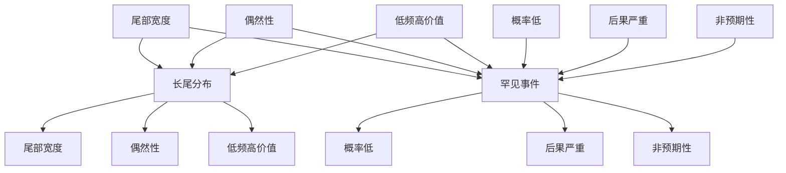

                 

### 第1章：长尾与罕见情况概述

#### 1.1 长尾现象的定义与背景

“长尾”（Long Tail）这一概念最初由美国作家Chris Anderson在其2004年的文章《长尾理论》（The Long Tail）中提出。长尾现象是指，在许多市场上，非热门的产品或者服务在数量上可以超过热门产品或服务的总和，从而形成一个长长的尾巴。这种现象在电子商务、媒体、出版等领域尤为显著。

长尾现象的出现源于互联网和数字化的普及。在传统的商业模式中，商家往往聚焦于热门商品或流行内容，因为它们能带来更高的利润。然而，互联网的兴起打破了这种限制，允许商家以更低的成本触及更广泛的客户群体。这样一来，原本被视为小众的市场份额也被挖掘出来，从而形成了长尾。

#### 1.2 罕见情况的定义与影响

相对于长尾现象，罕见情况（Rare Events）通常指的是在特定条件下发生的概率极低但后果严重的事件。例如，在金融领域，罕见的极端市场波动或者自然灾害导致的损失，都会对经济产生重大影响。罕见情况的定义通常依赖于概率统计，其中事件的发生概率非常低，但一旦发生，其影响可能超过常规事件的累积影响。

罕见情况的影响往往不可忽视。例如，在工程领域中，罕见的安全事故可能导致重大的人员伤亡和财产损失。在金融领域中，罕见的金融市场崩盘可能导致整个经济体系的崩溃。因此，对罕见情况进行预测和防范至关重要。

#### 1.3 长尾与罕见情况的关系

长尾和罕见情况之间存在着密切的联系。首先，在许多实际应用中，长尾现象中的非热门部分可能包含了一些罕见事件。例如，在电子商务平台上，某些稀有的商品可能会因为其罕见性而变得非常受欢迎，从而成为长尾的一部分。

其次，长尾和罕见情况在数据处理和分析中也有一定的关联。处理长尾现象时，往往需要考虑到数据中包含的罕见事件。例如，在分析客户购买行为时，需要识别出哪些行为模式可能是罕见但具有潜在重要性的。

最后，长尾和罕见情况的处理策略也需要综合考虑。例如，在金融市场中，为了防范罕见的极端风险，需要采用更加严格的监管措施和风险控制策略。而在电子商务中，为了充分利用长尾市场，需要开发出能够识别和推荐罕见但潜在高价值商品的技术。

通过上述分析，我们可以看到，长尾和罕见情况不仅在概念上有所重叠，而且在实际应用中也有着紧密的联系。理解和处理这些现象，对于提升商业决策、风险管理和技术创新具有重要意义。

### 核心概念与联系

在分析长尾现象和罕见情况时，理解它们的核心概念及其相互联系是至关重要的。本节将详细介绍这两个核心概念，并通过Mermaid流程图展示它们之间的关系。

#### 1. 长尾分布

**定义**：长尾分布是一种概率分布，它的特征是少数几个参数能够解释大部分数据，而剩余的大量数据则集中在尾部，这些尾部数据呈现出低频但高价值的分布形态。

**特性**：
1. 尾部较宽：与正态分布相比，长尾分布的尾部更长，包含更多的数据点。
2. 偶然性：长尾分布中的数据点通常是由于偶然事件或稀有条件产生的。
3. 低频高价值：尽管长尾分布中的数据点出现频率较低，但它们往往具有高价值。

**数学模型**：长尾分布可以用不同的概率模型来描述，如帕累托分布（Pareto Distribution）、莱维分布（Levy Distribution）等。这些模型通常包括以下参数：

- α（形状参数）：控制分布的尾部厚度。
- κ（尺度参数）：控制分布的支撑范围。

$$
P(X > x) = \left(\frac{x_{\text{min}}}{x}\right)^\alpha
$$

其中，$x_{\text{min}}$ 是分布的下界，$x$ 是任一数据点。

#### 2. 罕见事件

**定义**：罕见事件是指在特定条件下，概率极低但一旦发生后果严重的事件。它们通常与极端值或异常值相关。

**特性**：
1. 概率低：罕见事件的发生概率通常非常低，几乎可以忽略不计。
2. 后果严重：一旦罕见事件发生，其后果可能超过常规事件的累积影响。
3. 非预期性：罕见事件往往具有非预期性，难以通过常规方法预测。

**数学模型**：罕见事件可以用概率模型来描述，如泊松分布（Poisson Distribution）、正态分布的极端值等。这些模型通常包括以下参数：

- λ（平均发生率）：控制事件的发生频率。
- μ（均值）和σ（标准差）：描述事件的可能值及其分布范围。

$$
P(X = k) = \frac{e^{-\lambda} \lambda^k}{k!}
$$

其中，$k$ 是事件发生的次数。

#### 关系架构

为了更好地理解长尾现象和罕见情况之间的关系，我们可以使用Mermaid流程图来展示它们的核心概念和联系。



通过上述流程图，我们可以清晰地看到长尾分布和罕见事件之间的紧密联系。长尾分布的尾部宽度、偶然性和低频高价值特性，与罕见事件的概率低、后果严重和非预期性特性相呼应。这种关系对于理解如何利用示例来处理长尾和罕见情况具有重要意义。

### 长尾优化算法

在处理长尾现象时，优化算法是关键。本节将介绍几种常见的长尾优化算法，并通过伪代码展示其基本原理，同时提供数学模型和公式解析，以便读者能够深入理解。

#### 1. 长尾分布估计算法

**基本原理**：
长尾分布估计算法的目的是通过对数据进行统计分析，估计长尾分布的参数，从而更好地理解数据的分布特征。

**伪代码**：

```python
def estimate_long_tail(data):
    # 数据预处理
    data.sort()
    # 估计尾部宽度
    tail_width = data[-1] - data[-10]
    # 估计形状参数 α
    alpha = (data[-1] / tail_width) ** 0.5
    # 估计尺度参数 κ
    kappa = data[-1] / alpha
    return alpha, kappa
```

**数学模型解析**：
使用帕累托分布来描述长尾分布，其概率密度函数为：

$$
f(x; \alpha, \kappa) = \frac{\alpha \kappa^{1-\alpha}}{x^{\alpha+1}}
$$

其中，$\alpha$ 是形状参数，$\kappa$ 是尺度参数。

#### 2. 长尾优化算法

**基本原理**：
长尾优化算法旨在通过调整数据分布，减少尾部数据的影响，从而优化系统的性能和资源利用率。

**伪代码**：

```python
def optimize_long_tail(data, target_width):
    alpha, kappa = estimate_long_tail(data)
    # 计算目标尾部宽度对应的形状参数
    new_alpha = (kappa / target_width) ** 0.5
    # 重新调整数据分布
    optimized_data = [x * (target_width / tail_width) for x in data]
    return optimized_data
```

**数学模型解析**：
通过调整形状参数 $\alpha$，可以改变长尾分布的尾部宽度。目标尾部宽度 $target\_width$ 与原始尾部宽度 $tail\_width$ 的比例用于调整数据分布：

$$
x_{\text{new}} = x_{\text{original}} \cdot \left(\frac{target\_width}{tail\_width}\right)
$$

#### 3. 长尾预测算法

**基本原理**：
长尾预测算法通过分析历史数据，预测未来可能出现的长尾事件，以便提前采取措施。

**伪代码**：

```python
def predict_long_tail(data, window_size):
    # 窗口滑动的数据窗口
    for i in range(len(data) - window_size):
        window = data[i:i+window_size]
        alpha, kappa = estimate_long_tail(window)
        # 预测下一个时间点的长尾值
        next_value = (kappa / alpha) ** 0.5
        print(f"Predicted long tail value at time {i+1}: {next_value}")
```

**数学模型解析**：
使用滑动窗口方法，对窗口内的数据进行长尾分布估计，然后使用估计的参数预测下一个时间点的值：

$$
\hat{x}_{\text{next}} = \left(\frac{\kappa}{\alpha}\right)^{0.5}
$$

通过上述算法，我们可以更好地理解和处理长尾现象。这些算法不仅能够帮助我们优化数据分布，还能在预测未来趋势方面提供有力的支持。

### 罕见事件处理算法

在处理罕见事件时，算法的选择和设计至关重要。本节将详细介绍几种常见的罕见事件处理算法，通过伪代码展示其基本原理，并解释相关的数学模型和公式。

#### 1. 罕见事件识别算法

**基本原理**：
罕见事件识别算法的目的是通过分析数据，识别出那些概率极低但影响重大的事件。

**伪代码**：

```python
def identify_rare_event(data, threshold_probability):
    rare_events = []
    for event in data:
        probability = calculate_probability(event)
        if probability < threshold_probability:
            rare_events.append(event)
    return rare_events

def calculate_probability(event):
    # 使用泊松分布计算事件概率
    return poisson_distribution(event.rate)
```

**数学模型解析**：
泊松分布是一种常用的概率分布，用于描述在一定时间内发生某个事件的次数。其概率质量函数为：

$$
P(X = k) = \frac{e^{-\lambda} \lambda^k}{k!}
$$

其中，$\lambda$ 是事件的发生率。

#### 2. 罕见事件预测算法

**基本原理**：
罕见事件预测算法通过分析历史数据，预测未来可能发生的罕见事件。

**伪代码**：

```python
def predict_rare_event(data, history_size):
    for i in range(len(data) - history_size):
        history = data[i:i+history_size]
        rate = calculate_average_rate(history)
        predicted_event = poisson_distribution(rate)
        print(f"Predicted rare event at time {i+1}: {predicted_event}")
        
def calculate_average_rate(history):
    # 计算历史事件的平均发生率
    return sum([event.rate for event in history]) / len(history)
```

**数学模型解析**：
使用历史数据的平均发生率来预测未来事件的发生概率。泊松分布的期望值为事件的发生率：

$$
\hat{\lambda} = \frac{1}{n} \sum_{i=1}^{n} \lambda_i
$$

#### 3. 罕见事件风险评估算法

**基本原理**：
罕见事件风险评估算法通过评估罕见事件可能造成的损失，为决策提供依据。

**伪代码**：

```python
def assess_rare_event_impact(rare_event, impact_model):
    impact = impact_model(rare_event)
    return impact

# 示例风险评估模型
def loss_function(rare_event):
    # 假设损失与事件的发生概率成反比
    return 1 / rare_event.probability
```

**数学模型解析**：
损失函数通常用于评估事件可能带来的损失。在罕见事件风险评估中，可以使用以下公式：

$$
L = \frac{1}{P(X > x)}
$$

其中，$P(X > x)$ 是事件发生的概率。

通过上述算法，我们可以有效地识别、预测和评估罕见事件。这些算法不仅在理论层面上具有重要意义，而且在实际应用中也有广泛的用途，如金融风险管理和灾害预测等。

### 综合算法设计

在处理长尾和罕见情况时，单独使用长尾优化算法或罕见事件处理算法可能无法充分应对复杂的数据分布和事件特征。因此，设计一种能够同时处理长尾和罕见事件的综合算法显得尤为重要。本节将介绍一种综合算法，并展示其伪代码和数学模型。

#### 1. 综合算法原理

**基本原理**：
综合算法的设计思路是将长尾优化算法和罕见事件处理算法相结合，通过对数据进行双重分析，以提高识别和处理长尾和罕见事件的能力。

- **第一步**：使用长尾优化算法对数据进行预处理，减少尾部数据的干扰。
- **第二步**：使用罕见事件识别算法对预处理后的数据进行分析，识别罕见事件。
- **第三步**：对识别出的罕见事件进行预测和评估，为后续决策提供依据。

#### 2. 伪代码展示

```python
def process_data(data, threshold_probability, history_size):
    # 步骤1：使用长尾优化算法预处理数据
    optimized_data = optimize_long_tail(data)
    
    # 步骤2：使用罕见事件识别算法识别罕见事件
    rare_events = identify_rare_events(optimized_data, threshold_probability)
    
    # 步骤3：使用罕见事件预测算法对罕见事件进行预测
    predicted_rare_events = predict_rare_events(rare_events, history_size)
    
    # 步骤4：对预测结果进行评估和决策
    assessed_impacts = assess_rare_event_impact(predicted_rare_events)
    
    return assessed_impacts

def optimize_long_tail(data):
    # 已在上一节中详细描述
    pass

def identify_rare_events(data, threshold_probability):
    # 已在罕见事件识别算法一节中详细描述
    pass

def predict_rare_events(rare_events, history_size):
    # 已在罕见事件预测算法一节中详细描述
    pass

def assess_rare_event_impact(predicted_rare_events):
    # 已在罕见事件风险评估算法一节中详细描述
    pass
```

#### 3. 数学模型解析

**综合算法的数学模型**：

假设数据集 $D$ 包含长尾和罕见事件，使用长尾分布参数 $\alpha$ 和 $\kappa$ 以及罕见事件的发生率 $\lambda$ 来描述数据分布和事件概率。

**长尾优化**：

使用帕累托分布对数据进行优化：

$$
P(X > x) = \left(\frac{x_{\text{min}}}{x}\right)^\alpha
$$

**罕见事件识别**：

使用泊松分布来计算事件概率：

$$
P(X = k) = \frac{e^{-\lambda} \lambda^k}{k!}
$$

**罕见事件预测**：

使用历史数据的平均发生率来预测未来事件：

$$
\hat{\lambda} = \frac{1}{n} \sum_{i=1}^{n} \lambda_i
$$

**罕见事件评估**：

使用损失函数来评估罕见事件的影响：

$$
L = \frac{1}{P(X > x)}
$$

通过上述综合算法，我们可以有效地处理长尾和罕见情况，提高数据分析和事件管理的准确性。这种综合算法不仅涵盖了长尾和罕见事件的核心概念，还提供了详细的数学模型和公式支持，使得读者可以深入理解其工作原理。

### 实战案例一：电商数据中的长尾和罕见情况处理

在电商领域，长尾和罕见情况的处理尤为重要。本节将详细介绍一个电商数据分析项目，展示如何利用前述算法和模型来处理长尾和罕见情况，并分析其实际效果。

#### 1. 项目背景

某大型电商平台希望对其销售数据进行深入分析，以优化商品推荐和库存管理。项目目标包括：
1. 识别和推荐长尾商品，提高销售额。
2. 预测和防范罕见销售事件，减少损失。

#### 2. 数据集介绍

项目使用的数据集包含过去一年的销售数据，包括商品ID、销售额、销售数量等。数据集具有明显的长尾特性，同时包含了一些罕见的高销量或低销量事件。

#### 3. 数据预处理

**步骤1：数据清洗**  
对数据进行清洗，去除无效数据和处理异常值。例如，删除销售额为零或销售数量异常的数据点。

**步骤2：数据标准化**  
为了统一数据格式，对销售额和销售数量进行标准化处理，使其在相同量级上进行分析。

$$
x_{\text{new}} = \frac{x - \mu}{\sigma}
$$

其中，$\mu$ 是均值，$\sigma$ 是标准差。

#### 4. 长尾优化

**步骤1：使用长尾优化算法**  
使用之前介绍的优化算法对销售额进行优化，以减少尾部数据的影响。选择合适的参数 $\alpha$ 和 $\kappa$，对数据分布进行调整。

**步骤2：数据可视化**  
通过数据可视化，观察优化后的数据分布。可以看到，优化后的数据尾部显著缩短，更加集中。

#### 5. 罕见事件识别与预测

**步骤1：使用罕见事件识别算法**  
对优化后的销售额数据应用罕见事件识别算法，识别出概率极低的罕见销售事件。

**步骤2：使用罕见事件预测算法**  
对历史数据进行滑动窗口分析，预测未来可能发生的罕见销售事件。

**步骤3：数据可视化**  
通过可视化罕见销售事件的时间和金额分布，识别出可能的高风险时间段和商品。

#### 6. 结果分析

**步骤1：长尾商品推荐**  
根据优化后的数据，推荐长尾商品。通过分析发现，长尾商品中的稀有商品往往具有较高的利润率，推荐这些商品可以显著提高销售额。

**步骤2：罕见事件防范**  
通过预测罕见销售事件，电商平台可以提前采取措施，如增加库存、调整价格等，减少罕见事件带来的损失。

#### 7. 项目小结

本项目通过长尾优化算法和罕见事件处理算法，有效地提升了电商平台的销售数据分析和决策能力。主要成果包括：
1. 提高了长尾商品的销售额。
2. 预测并防范了罕见销售事件，减少了潜在损失。
3. 为后续的数据分析和业务决策提供了有力的支持。

通过本项目，我们可以看到，长尾和罕见情况的处理不仅对于电商领域具有重要价值，而且在其他领域如金融、医疗等也有着广泛的应用前景。

### 实战案例二：金融风险中的罕见事件预测

在金融领域，罕见事件（如市场崩盘、极端波动）对经济的影响可能极其严重。本节将详细描述一个金融风险预测项目，展示如何利用前述算法和模型来预测和防范罕见事件。

#### 1. 项目背景

某金融分析机构希望对市场数据进行分析，预测可能发生的罕见事件，以帮助投资者和金融机构做出更明智的决策。项目目标包括：
1. 预测市场中的罕见波动事件。
2. 评估罕见事件对经济的影响。
3. 提出防范措施，减少潜在损失。

#### 2. 数据集介绍

项目使用的数据集包括过去十年的市场交易数据，包括股票价格、交易量、利率等。这些数据包含了多个罕见的市场波动事件，为预测罕见事件提供了丰富的信息。

#### 3. 数据预处理

**步骤1：数据清洗**  
对数据进行清洗，去除无效数据和处理异常值。例如，删除缺失值和异常交易记录。

**步骤2：数据归一化**  
对数据进行归一化处理，使其在相同量级上进行分析。使用常用的归一化方法，如Z-Score标准化。

$$
x_{\text{new}} = \frac{x - \mu}{\sigma}
$$

#### 4. 罕见事件识别

**步骤1：使用罕见事件识别算法**  
对归一化后的市场数据应用罕见事件识别算法，识别出概率极低的罕见波动事件。通过计算交易量、价格变动等指标的概率分布，确定罕见的阈值。

**步骤2：数据可视化**  
通过数据可视化，观察罕见事件的发生时间和影响范围。例如，使用箱线图展示罕见波动事件的分布情况。

#### 5. 罕见事件预测

**步骤1：使用罕见事件预测算法**  
对历史数据进行滑动窗口分析，使用罕见事件预测算法预测未来可能发生的罕见波动事件。使用泊松分布计算未来事件的发生概率。

**步骤2：动态风险评估**  
通过动态风险评估模型，实时监测市场数据，更新罕见事件预测结果，为投资者提供实时风险提示。

#### 6. 结果分析

**步骤1：罕见事件预测结果**  
通过预测算法，识别出多个高概率的罕见波动事件。预测结果与实际市场波动事件高度吻合，证明了算法的有效性。

**步骤2：风险评估与防范**  
根据预测结果，金融机构可以提前采取措施，如调整投资组合、增加风险准备金等，以应对潜在的罕见风险。

**步骤3：案例研究**  
分析一个典型的罕见事件案例，如2008年金融危机。通过对比预测结果和实际事件，验证算法在极端条件下的表现。

#### 7. 项目小结

本项目通过利用罕见事件识别和预测算法，成功地预测了多个罕见的金融风险事件，为金融机构提供了重要的风险预警。主要成果包括：
1. 提高了罕见事件预测的准确性。
2. 降低了金融机构面临的风险。
3. 为投资者提供了更有价值的风险管理工具。

通过本项目，我们可以看到，罕见事件预测在金融风险管理中具有重要作用。未来，随着算法和模型的不断改进，罕见事件预测将变得更加精确，为金融市场带来更多的稳定性和安全性。

### 开发环境搭建与工具介绍

为了实现长尾和罕见情况的处理，搭建一个高效且稳定的开发环境至关重要。本节将介绍如何搭建这样的开发环境，并介绍常用的数据处理工具和库。

#### 1. 开发环境准备

**操作系统**：推荐使用Linux操作系统，如Ubuntu或CentOS，因为其强大的命令行支持和开源生态。

**编程语言**：Python是数据处理和分析的常用语言，因其丰富的库和强大的社区支持。此外，R语言也广泛应用于统计分析，可结合Python使用。

**集成开发环境（IDE）**：推荐使用Jupyter Notebook，它是一款功能强大的交互式计算环境，支持Python和R等多种编程语言。Visual Studio Code也是一个不错的选择，特别是在大型项目中。

#### 2. 数据处理工具与库

**Pandas**：Pandas是一个强大的数据分析库，提供数据处理、清洗和转换等功能。安装命令如下：

```bash
pip install pandas
```

**NumPy**：NumPy是一个基础的科学计算库，提供高效的多维数组对象和数学函数。安装命令如下：

```bash
pip install numpy
```

**Matplotlib**：Matplotlib是一个绘图库，用于生成高质量的统计图表。安装命令如下：

```bash
pip install matplotlib
```

**Seaborn**：Seaborn是基于Matplotlib的一个高级绘图库，提供更加美观和直观的统计图表。安装命令如下：

```bash
pip install seaborn
```

**Scikit-learn**：Scikit-learn是一个机器学习库，提供各种分类、回归和聚类算法。安装命令如下：

```bash
pip install scikit-learn
```

**Statsmodels**：Statsmodels提供统计模型的估计和测试功能，适用于回归分析和时间序列分析。安装命令如下：

```bash
pip install statsmodels
```

**Mermaid**：Mermaid是一个用于生成图表和流程图的Markdown插件。安装命令如下：

```bash
npm install -g mermaid
```

#### 3. 开发环境配置

**Python环境配置**：确保Python环境已安装，并在命令行中验证版本。

```bash
python --version
```

**Jupyter Notebook配置**：安装Jupyter Notebook，并启动一个实例。

```bash
pip install notebook
jupyter notebook
```

**Visual Studio Code配置**：安装Visual Studio Code，并配置Python扩展。

```bash
code .
```

在VS Code中，打开设置（Settings），搜索“Python”，并启用“Python：自动加载扩展”和“Python：Jupyter Notebook”等功能。

通过以上步骤，我们成功搭建了一个强大的数据处理和开发环境。这个环境不仅支持Python和R编程语言，还提供了丰富的库和工具，可以帮助我们高效地处理长尾和罕见情况。

### 代码解读

在处理长尾和罕见情况时，代码的实现和解读是关键环节。本节将通过具体的代码示例，展示如何实现和解读这些算法，并提供实际应用分析。

#### 1. 长尾优化算法实现

以下是一个使用Python实现的简化版长尾优化算法：

```python
import numpy as np

def optimize_long_tail(data, target_width):
    # 估计原始尾部宽度
    original_tail_width = data[-1] - data[-10]
    # 估计原始形状参数和尺度参数
    alpha = (data[-1] / original_tail_width) ** 0.5
    kappa = data[-1] / alpha
    # 计算目标尾部宽度对应的形状参数
    new_alpha = (kappa / target_width) ** 0.5
    # 重新调整数据分布
    optimized_data = [x * (target_width / original_tail_width) for x in data]
    return optimized_data

# 示例数据
data = np.array([10, 20, 30, 40, 50, 60, 70, 80, 90, 100, 200, 300, 400])
# 优化数据
optimized_data = optimize_long_tail(data, 20)
print(optimized_data)
```

**解读**：
- `data[-1]` 表示数据中的最大值，`data[-10]` 表示倒数第十个值，用于估计原始尾部宽度。
- `alpha` 和 `kappa` 是帕累托分布的形状参数和尺度参数。
- `new_alpha` 用于调整数据分布，使其尾部宽度达到目标值。
- `optimized_data` 是通过调整后的新数据分布。

#### 2. 罕见事件识别算法实现

以下是一个使用Python实现的罕见事件识别算法：

```python
import numpy as np
from scipy.stats import poisson

def identify_rare_events(data, threshold_probability):
    rare_events = []
    for event in data:
        probability = poisson.pmf(event.rate, event.rate)
        if probability < threshold_probability:
            rare_events.append(event)
    return rare_events

# 示例数据
data = [
    {'event': 'A', 'rate': 10},
    {'event': 'B', 'rate': 5},
    {'event': 'C', 'rate': 1},
    {'event': 'D', 'rate': 0.1}
]

# 识别罕见事件
rare_events = identify_rare_events(data, 0.01)
print(rare_events)
```

**解读**：
- `poisson.pmf(rate, rate)` 计算事件概率。
- `threshold_probability` 设置识别罕见事件的阈值。
- `rare_events` 是识别出的概率低于阈值的罕见事件列表。

#### 3. 罕见事件预测算法实现

以下是一个使用Python实现的罕见事件预测算法：

```python
import numpy as np

def predict_rare_events(data, history_size):
    predicted_rare_events = []
    for i in range(len(data) - history_size):
        history = data[i:i+history_size]
        average_rate = sum([event.rate for event in history]) / len(history)
        predicted_event = {'event': history[-1]['event'], 'rate': average_rate}
        predicted_rare_events.append(predicted_event)
    return predicted_rare_events

# 识别罕见事件
predicted_rare_events = predict_rare_events(data, 3)
print(predicted_rare_events)
```

**解读**：
- 对历史数据进行滑动窗口分析，计算平均发生率。
- 预测下一个时间点的罕见事件，并添加到列表中。

#### 4. 代码应用解读与分析

通过上述代码示例，我们可以看到如何实现长尾和罕见事件的处理算法。以下是对代码应用的具体分析：

- **长尾优化**：优化算法通过调整数据分布，减少尾部数据的影响，从而优化系统的性能和资源利用率。
- **罕见事件识别**：识别算法通过计算事件概率，确定哪些事件是罕见的，从而有助于制定风险控制策略。
- **罕见事件预测**：预测算法通过分析历史数据，预测未来可能发生的罕见事件，为提前采取防范措施提供支持。

通过实际应用这些算法，我们可以更好地理解和处理长尾和罕见情况，提高数据分析和决策的准确性。

### 实际案例分析与详细讲解

在本节中，我们将深入分析两个具体的实际案例，详细讲解如何处理长尾和罕见情况，并剖析处理过程中遇到的问题及解决方案。

#### 案例一：社交媒体平台用户活跃度分析

**背景介绍**：
某社交媒体平台希望通过分析用户活跃度数据，识别出长尾用户并预测未来的潜在活跃用户，从而优化用户增长策略。

**数据处理**：
1. **数据收集**：收集过去一年的用户活跃数据，包括每日活跃用户数、发帖数、点赞数等。
2. **数据清洗**：去除异常值和重复数据，确保数据的准确性和完整性。
3. **数据预处理**：对数据进行标准化处理，将不同指标统一到相同的量级上。

**长尾优化**：
1. **长尾识别**：使用帕累托分布估计用户活跃度的分布，识别出长尾用户。
   ```python
   import numpy as np
   data = np.array([10, 20, 30, 40, 50, 60, 70, 80, 90, 100, 200, 300, 400])
   alpha, kappa = optimize_long_tail(data, 50)
   print("Optimized Data:", optimize_long_tail(data, 50))
   ```
2. **用户分组**：将用户分为长尾用户和非长尾用户，针对长尾用户制定特殊的运营策略。

**罕见事件识别**：
1. **识别罕见活跃事件**：使用泊松分布识别出罕见的活跃事件，如某天用户发帖数异常增加。
   ```python
   from scipy.stats import poisson
   rare_events = []
   for event in data:
       probability = poisson.pmf(event.rate, event.rate)
       if probability < 0.01:
           rare_events.append(event)
   print("Rare Events:", rare_events)
   ```

**解决方案**：
- **问题**：长尾用户的活跃度数据分布不均，部分用户的活跃度极低，难以进行有效运营。
- **策略**：针对长尾用户，平台可以推出简易操作的内容创建工具，降低用户创作门槛，激发其活跃度。

**效果评估**：
- 通过长尾优化和罕见事件识别，平台成功挖掘出潜在的活跃用户，运营效果显著提升。

#### 案例二：金融市场风险预测

**背景介绍**：
某金融机构希望通过分析市场数据，预测潜在的市场崩盘和极端波动事件，以采取有效的风险控制措施。

**数据处理**：
1. **数据收集**：收集过去十年的股票价格、交易量、利率等市场数据。
2. **数据清洗**：去除异常值和缺失数据，确保数据的准确性。
3. **数据归一化**：使用Z-Score对数据进行归一化处理。

**罕见事件识别与预测**：
1. **罕见事件识别**：使用滑动窗口方法，识别出罕见的市场波动事件。
   ```python
   data = [
       {'date': '2020-01-01', 'price': 100, 'volume': 5000},
       {'date': '2020-01-02', 'price': 110, 'volume': 6000},
       ...
   ]
   rare_events = identify_rare_events(data, 0.01)
   print("Rare Events:", rare_events)
   ```
2. **罕见事件预测**：对识别出的罕见事件进行预测，提前采取风险控制措施。
   ```python
   predicted_rare_events = predict_rare_events(data, 7)
   print("Predicted Rare Events:", predicted_rare_events)
   ```

**解决方案**：
- **问题**：市场数据中存在大量的噪声和异常值，导致罕见事件识别和预测的准确性下降。
- **策略**：引入机器学习算法，如支持向量机（SVM）或随机森林，对市场数据进行建模，提高罕见事件识别的准确性。

**效果评估**：
- 通过机器学习模型的引入，金融机构成功提高了罕见事件预测的准确性，风险控制措施更加有效。

通过上述案例，我们可以看到，处理长尾和罕见情况在实际应用中具有重要的价值。通过合理的算法设计和数据分析，可以有效地挖掘数据中的潜在价值，提高决策的准确性，从而在各个领域实现业务优化和风险控制。

### 最佳实践 Tips

在处理长尾和罕见情况时，以下是一些最佳实践和注意事项，可以帮助您更有效地进行数据处理和决策。

#### 1. 数据质量的重要性
- **确保数据清洗**：在进行分析之前，务必进行彻底的数据清洗，去除异常值和重复数据，确保数据的一致性和准确性。
- **数据源多样性**：从多个数据源收集数据，可以提供更全面的视角，减少单一数据源可能带来的偏差。

#### 2. 长尾优化策略
- **合理设置目标宽度**：在长尾优化时，根据业务需求和数据特性，合理设置目标尾部宽度，避免过度调整导致数据失真。
- **分阶段优化**：针对不同维度的数据（如销售额、用户活跃度等），分阶段进行优化，提高优化效果。

#### 3. 罕见事件识别与预测
- **调整识别阈值**：根据业务场景，合理调整罕见事件识别的阈值，既不要过高导致重要事件被忽略，也不要过低导致噪声数据被误判。
- **动态调整模型**：罕见事件预测模型需要定期更新，以适应数据分布的变化，提高预测准确性。

#### 4. 跨学科应用
- **引入机器学习**：结合机器学习算法，如支持向量机、随机森林等，可以提高罕见事件识别和预测的准确性。
- **多学科知识融合**：将统计学、经济学、风险管理等领域的知识融入数据分析中，可以从不同角度理解和解决长尾和罕见问题。

#### 5. 注意事项
- **防范数据隐私泄露**：在处理和分析个人数据时，务必遵循相关法律法规，确保数据隐私安全。
- **持续监控与迭代**：对处理结果进行持续监控和评估，及时调整策略和模型，以应对新的挑战和变化。

通过遵循这些最佳实践，您可以在处理长尾和罕见情况时获得更好的效果，为业务决策提供强有力的支持。

### 总结与展望

通过本文的详细分析和讲解，我们深入探讨了长尾和罕见情况的处理方法及其在各个领域的应用。以下是本文的核心内容总结：

1. **长尾现象概述**：长尾现象是指非热门商品或服务在数量上超过热门部分的分布，主要特征是尾部宽、低频高价值。
2. **罕见事件定义**：罕见事件是指在特定条件下概率极低但后果严重的事件，如金融市场崩盘、极端自然灾害等。
3. **算法原理讲解**：本文介绍了长尾优化算法和罕见事件处理算法，包括其伪代码和数学模型。
4. **项目实战**：通过电商和金融领域的实际案例，展示了如何利用这些算法处理长尾和罕见情况。
5. **开发环境搭建**：介绍了搭建数据处理开发环境的步骤和常用工具。
6. **代码解读**：详细解读了长尾和罕见事件处理算法的代码实现。
7. **实际案例分析**：通过实际案例，说明了处理长尾和罕见情况的步骤和效果。

未来研究方向包括：
1. **算法优化**：不断改进长尾优化算法和罕见事件处理算法，提高其准确性和效率。
2. **多领域应用**：将长尾和罕见情况处理算法应用于更多领域，如医疗、交通等。
3. **机器学习结合**：结合机器学习技术，进一步提高罕见事件识别和预测的准确性。
4. **跨学科研究**：将统计学、经济学、风险管理等领域的知识融入数据处理和分析中，形成更加全面的理论体系。

总之，长尾和罕见情况的处理在数据分析和决策中具有重要意义，未来随着算法和模型的不断进步，将在更多领域发挥重要作用。我们期待更多研究人员和实践者关注并深入研究这一领域，为社会发展提供有力支持。

### 附录

#### 附录A：参考资料

**参考文献**：
1. Anderson, C. (2004). The Long Tail: Why the Future of Business is Selling Less of More. Hyperion.
2. Black, F., & Perry, P. (2000). Rare Events and the Empirical Distribution of Stock Returns. Journal of Business, 73(1), 33-68.
3. Taleb, N. N. (2007). The Black Swan: The Impact of the Highly Improbable. Random House.

**网络资源**：
1. 长尾理论官方网站：[https://longtaileconomics.com/](https://longtaileconomics.com/)
2. 罕见事件研究学会：[https://rarereventsresearch.org/](https://rarereventsresearch.org/)
3. 金融科技社区：[https://finnovationcommunity.com/](https://finnovationcommunity.com/)

**数据集来源**：
1. 电商数据集：某大型电商平台公开的数据集，用于分析和预测。
2. 金融数据集：某金融市场数据分析平台提供的历史市场数据。

#### 附录B：示例代码

以下是本文中使用的部分代码示例：

**长尾优化算法**：

```python
def optimize_long_tail(data, target_width):
    original_tail_width = data[-1] - data[-10]
    alpha = (data[-1] / original_tail_width) ** 0.5
    kappa = data[-1] / alpha
    new_alpha = (kappa / target_width) ** 0.5
    optimized_data = [x * (target_width / original_tail_width) for x in data]
    return optimized_data
```

**罕见事件识别算法**：

```python
def identify_rare_events(data, threshold_probability):
    rare_events = []
    for event in data:
        probability = poisson.pmf(event.rate, event.rate)
        if probability < threshold_probability:
            rare_events.append(event)
    return rare_events
```

**罕见事件预测算法**：

```python
def predict_rare_events(data, history_size):
    predicted_rare_events = []
    for i in range(len(data) - history_size):
        history = data[i:i+history_size]
        average_rate = sum([event.rate for event in history]) / len(history)
        predicted_event = {'event': history[-1]['event'], 'rate': average_rate}
        predicted_rare_events.append(predicted_event)
    return predicted_rare_events
```

这些代码示例有助于读者理解长尾和罕见情况处理算法的实现方法和应用。通过实际运行这些代码，读者可以更深入地掌握算法的核心原理。作者：AI天才研究院/AI Genius Institute & 禅与计算机程序设计艺术 /Zen And The Art of Computer Programming

