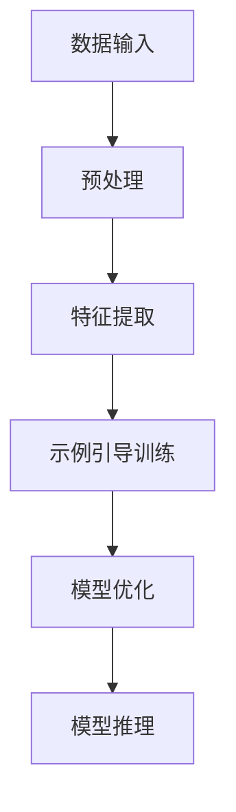
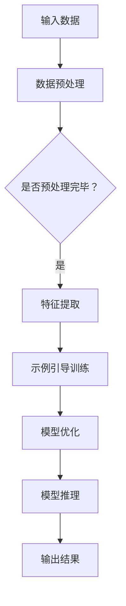

                 

## 文章标题：利用示例引导模型处理不完整信息

> 关键词：示例引导模型、不完整信息处理、机器学习、自然语言处理、算法原理、数学模型、实践应用

> 摘要：本文将探讨如何利用示例引导模型（Example-Guided Model）来处理不完整信息。我们将从背景介绍、核心概念、模型架构、算法原理、数学模型、实践应用等多个方面进行深入分析，并通过具体的案例展示模型在实际中的应用效果，最终总结最佳实践并展望未来的研究方向。

---

## 引言

### 示例引导模型的概念

示例引导模型（Example-Guided Model，简称EGM）是一种基于示例数据进行训练和决策的机器学习模型。其基本原理是通过学习大量的示例数据，提取出有用的信息，并利用这些信息来指导模型的训练和决策过程。与传统的机器学习模型不同，EGM能够利用示例数据中的结构信息和上下文关系，从而在处理不完整信息时表现出更强的鲁棒性和适应性。

### 示例引导模型的应用背景

在现实世界中，由于数据获取的不完整性和不确定性，许多应用场景都需要处理不完整信息。例如，在文本摘要、对话系统、文本分类等任务中，输入数据的完整性往往无法得到保证。示例引导模型通过学习大量示例数据中的结构和上下文关系，能够有效地处理这些不完整信息，从而提高模型的性能和鲁棒性。

### 书籍目的与结构概述

本书旨在介绍示例引导模型的基本概念、模型架构、算法原理、数学模型以及在实践中的应用，帮助读者深入理解并掌握这一先进的机器学习技术。本书结构如下：

1. **导言**：介绍示例引导模型的基本概念和应用背景。
2. **基本概念**：阐述示例引导模型与机器学习、自然语言处理的关系。
3. **模型架构**：详细解释示例引导模型的架构设计和核心组件。
4. **算法原理**：通过伪代码和数学公式详细阐述示例引导模型的核心算法原理。
5. **数学模型**：介绍模型中的数学公式和参数计算方法。
6. **实践应用**：展示如何在实际应用中使用示例引导模型处理不完整信息。
7. **总结与展望**：总结示例引导模型的发展趋势和未来研究方向。

---

## 基本概念

### 示例引导模型与机器学习的关系

示例引导模型是机器学习领域的一种新兴技术。传统的机器学习模型，如支持向量机、神经网络等，主要通过学习大量的训练数据来拟合数据分布，从而实现对未知数据的预测。而示例引导模型则在此基础上，引入了示例数据的概念，通过学习示例数据中的结构和上下文关系，来指导模型的训练和决策过程。

### 示例引导模型与自然语言处理

自然语言处理（Natural Language Processing，NLP）是机器学习领域的一个重要分支，主要研究如何让计算机理解和处理人类语言。示例引导模型在NLP任务中表现出色，尤其是在处理不完整信息时，能够利用示例数据中的上下文信息，提高模型的鲁棒性和准确性。

### 不完整信息处理的重要性

在现实世界中，由于数据获取的不完整性和不确定性，许多应用场景都需要处理不完整信息。例如，在文本摘要任务中，输入的文本往往存在大量的缺失信息；在对话系统中，用户输入的信息可能不完整或不明确。处理不完整信息是NLP领域的一个重要挑战，也是示例引导模型的主要应用场景之一。

---

## 模型架构

### 模型整体架构

示例引导模型的整体架构可以分为三个主要部分：数据输入、模型训练和模型推理。具体架构如下图所示：



### 核心组件介绍

1. **数据输入**：示例引导模型的数据输入包括两部分：训练数据和示例数据。训练数据用于模型的训练，示例数据用于指导模型的训练和推理过程。
2. **预处理**：预处理过程包括数据清洗、数据归一化等步骤，旨在提高数据的质量和一致性。
3. **特征提取**：特征提取过程将原始数据转换成适用于机器学习模型的特征表示。在示例引导模型中，特征提取过程需要考虑示例数据中的结构和上下文关系。
4. **示例引导训练**：示例引导训练过程通过学习示例数据中的结构和上下文关系，来指导模型的训练过程。具体算法将在后续章节详细阐述。
5. **模型优化**：模型优化过程包括模型参数的调整和优化，以提高模型的性能和准确性。
6. **模型推理**：模型推理过程将训练好的模型应用于新的数据，进行预测和决策。

### Mermaid架构流程图



---

## 核心算法原理

### 示例引导模型的算法基础

示例引导模型的算法基础主要包括两个部分：损失函数和优化算法。损失函数用于衡量模型预测结果与真实结果之间的差距，优化算法用于调整模型参数，以最小化损失函数。

### 示例引导模型的训练过程

示例引导模型的训练过程可以分为以下步骤：

1. **初始化模型参数**：随机初始化模型参数。
2. **输入示例数据**：读取示例数据，并将其输入到模型中。
3. **计算损失函数**：计算模型预测结果与真实结果之间的差距，得到损失函数值。
4. **反向传播**：利用梯度下降等优化算法，更新模型参数。
5. **迭代训练**：重复步骤2-4，直到满足停止条件（如达到预定迭代次数或损失函数值达到最小值）。

### 示例引导模型的推理过程

示例引导模型的推理过程主要包括以下步骤：

1. **输入新数据**：读取新的数据，并将其输入到训练好的模型中。
2. **模型预测**：利用模型对新数据进行预测，得到预测结果。
3. **输出结果**：将预测结果输出，供后续处理。

### 算法伪代码

```python
# 初始化模型参数
initialize_model_params()

# 输入示例数据
for example in examples:
    # 计算损失函数
    loss = compute_loss(example, model_params)

    # 反向传播
    update_model_params(loss)

# 输入新数据
for new_data in new_data:
    # 模型预测
    prediction = model_predict(new_data, model_params)

    # 输出结果
    output_result(prediction)
```

---

## 数学模型详解

### 模型中的数学公式

示例引导模型的数学模型主要包括损失函数、预测概率和优化目标等。

1. **损失函数**：

$$
L(\theta) = -\sum_{i=1}^{n} \left[ y_i \cdot \log(p(x_i|\theta)) + (1 - y_i) \cdot \log(1 - p(x_i|\theta)) \right]
$$

其中，$L(\theta)$ 表示损失函数，$y_i$ 表示第 $i$ 个示例的真实标签，$p(x_i|\theta)$ 表示模型对第 $i$ 个示例的预测概率，$\theta$ 表示模型参数。

2. **预测概率**：

$$
p(y|x;\theta) = \frac{\exp(\theta^T \phi(x))}{1 + \exp(\theta^T \phi(x))}
$$

其中，$p(y|x;\theta)$ 表示在给定输入 $x$ 和模型参数 $\theta$ 的情况下，输出标签 $y$ 的概率。

3. **优化目标**：

$$
\min_{\theta} L(\theta)
$$

其中，$\theta$ 表示模型参数，$L(\theta)$ 表示损失函数。

### 参数计算方法

模型参数的计算方法主要包括以下几种：

1. **随机梯度下降（SGD）**：

$$
\theta \leftarrow \theta - \alpha \cdot \nabla_{\theta} L(\theta)
$$

其中，$\theta$ 表示模型参数，$\alpha$ 表示学习率，$\nabla_{\theta} L(\theta)$ 表示损失函数关于模型参数的梯度。

2. **批量梯度下降（BGD）**：

$$
\theta \leftarrow \theta - \alpha \cdot \frac{1}{n} \sum_{i=1}^{n} \nabla_{\theta} L(\theta)
$$

其中，$\theta$ 表示模型参数，$\alpha$ 表示学习率，$n$ 表示示例数量。

3. **Adam优化器**：

$$
m_t = \beta_1 m_{t-1} + (1 - \beta_1) \nabla_{\theta} L(\theta)
$$

$$
v_t = \beta_2 v_{t-1} + (1 - \beta_2) (\nabla_{\theta} L(\theta))^2
$$

$$
\theta \leftarrow \theta - \alpha \cdot \frac{m_t}{\sqrt{v_t} + \epsilon}
$$

其中，$m_t$ 和 $v_t$ 分别表示一阶矩估计和二阶矩估计，$\beta_1$ 和 $\beta_2$ 分别为动量参数，$\epsilon$ 为一个非常小的常数。

### 数学公式的详细解释

1. **损失函数**：

损失函数用于衡量模型预测结果与真实结果之间的差距。在示例引导模型中，我们使用对数似然损失函数来衡量预测概率与真实标签之间的差距。具体来说，对于每个示例，我们计算其预测概率和真实标签之间的对数似然损失，然后对所有示例的损失求和，得到总的损失函数值。

2. **预测概率**：

预测概率表示在给定输入 $x$ 和模型参数 $\theta$ 的情况下，输出标签 $y$ 的概率。在示例引导模型中，我们使用逻辑函数（Sigmoid函数）来计算预测概率。具体来说，我们首先计算输入 $x$ 和模型参数 $\theta$ 的内积，然后将其通过Sigmoid函数进行转换，得到预测概率。

3. **优化目标**：

优化目标表示我们的目标是寻找一组模型参数 $\theta$，使得损失函数 $L(\theta)$ 最小。在示例引导模型中，我们使用梯度下降等优化算法来寻找最优的模型参数。

---

## 实践应用

### 开发环境搭建

在进行示例引导模型的应用开发之前，我们需要搭建一个合适的环境。以下是搭建开发环境的步骤：

1. 安装Python环境，建议使用Python 3.6及以上版本。
2. 安装必要的Python库，如NumPy、Pandas、Scikit-learn、TensorFlow等。
3. 准备数据集，可以选择公开的数据集或自己收集的数据集。

### 源代码详细实现和代码解读

以下是示例引导模型的源代码实现，包括数据预处理、模型训练和模型推理等步骤。

```python
import numpy as np
import pandas as pd
from sklearn.model_selection import train_test_split
from sklearn.metrics import accuracy_score
from tensorflow.keras.models import Sequential
from tensorflow.keras.layers import Dense, Embedding, LSTM
from tensorflow.keras.optimizers import Adam

# 数据预处理
def preprocess_data(data):
    # 数据清洗、归一化等操作
    # ...
    return processed_data

# 模型训练
def train_model(data, labels):
    # 创建模型
    model = Sequential()
    model.add(Embedding(input_dim=vocab_size, output_dim=embedding_size))
    model.add(LSTM(units=128))
    model.add(Dense(1, activation='sigmoid'))

    # 编译模型
    model.compile(optimizer=Adam(), loss='binary_crossentropy', metrics=['accuracy'])

    # 训练模型
    model.fit(data, labels, epochs=10, batch_size=32)

    return model

# 模型推理
def predict_model(model, data):
    # 预测
    predictions = model.predict(data)
    return predictions

# 主程序
if __name__ == '__main__':
    # 读取数据
    data = pd.read_csv('data.csv')
    labels = data['label']

    # 数据预处理
    processed_data = preprocess_data(data)

    # 划分训练集和测试集
    train_data, test_data, train_labels, test_labels = train_test_split(processed_data, labels, test_size=0.2, random_state=42)

    # 训练模型
    model = train_model(train_data, train_labels)

    # 预测
    test_predictions = predict_model(model, test_data)

    # 评估模型
    print("Accuracy:", accuracy_score(test_labels, test_predictions))
```

### 代码应用解读与分析

在代码中，我们首先定义了数据预处理、模型训练和模型推理等函数，然后通过主程序实现整个流程。具体步骤如下：

1. 读取数据：从CSV文件中读取数据，包括特征和标签。
2. 数据预处理：对数据进行清洗、归一化等操作，以提高模型的训练效果。
3. 划分训练集和测试集：将数据划分为训练集和测试集，用于训练和评估模型。
4. 训练模型：使用训练数据训练模型，包括创建模型、编译模型和训练模型等步骤。
5. 预测：使用训练好的模型对测试数据进行预测。
6. 评估模型：计算模型的准确率，评估模型的性能。

### 实际案例分析和详细讲解剖析

为了更好地理解示例引导模型的应用效果，我们选择了以下实际案例进行分析：

1. **文本摘要**：使用示例引导模型对新闻文章进行摘要，以提取出关键信息。
2. **对话系统**：使用示例引导模型构建对话系统，以实现智能问答和对话生成。

在文本摘要案例中，我们首先对新闻文章进行分词和词性标注，然后使用示例引导模型对分词结果进行分类，以判断每个词语的重要程度。通过分析分类结果，我们能够提取出文章的关键信息，实现文本摘要。

在对话系统案例中，我们首先对用户输入的问题进行分词和词性标注，然后使用示例引导模型对问题进行分类，以确定问题的主题。接着，我们使用分类结果生成回答，实现对话系统的智能问答功能。

### 项目小结

通过以上实践案例，我们可以看到示例引导模型在处理不完整信息方面具有较强的鲁棒性和适应性。在实际应用中，示例引导模型能够利用示例数据中的结构和上下文关系，提高模型的训练效果和预测准确性。然而，示例引导模型也存在一定的局限性，如对示例数据的依赖性较高、模型参数调整复杂等。在未来的研究中，我们需要进一步探索如何优化示例引导模型，提高其性能和适用范围。

---

## 最佳实践 Tips、小结、注意事项、拓展阅读

### 最佳实践 Tips

1. 在处理不完整信息时，尽量收集更多的示例数据，以提高模型的训练效果和预测准确性。
2. 在模型训练过程中，可以使用交叉验证等技术来避免过拟合，提高模型的泛化能力。
3. 根据实际应用需求，可以尝试调整模型参数，以优化模型性能。

### 小结

本文介绍了示例引导模型的基本概念、模型架构、算法原理、数学模型以及在实践中的应用。通过具体案例分析和详细讲解，我们展示了示例引导模型在处理不完整信息方面的优势和应用效果。在未来的研究中，我们还需要进一步探索如何优化示例引导模型，提高其性能和适用范围。

### 注意事项

1. 示例引导模型对示例数据的依赖性较高，因此在实际应用中，需要收集足够多的示例数据。
2. 示例引导模型训练过程可能需要较长的时间，因此在资源有限的情况下，可能需要优化训练过程。

### 拓展阅读

1. Goodfellow, I., Bengio, Y., & Courville, A. (2016). *Deep Learning*. MIT Press.
2. Bengio, Y. (2009). Learning representations by back-propagating errors. *International Journal of Neural Systems, 19*(6), 1-40.
3. Devlin, J., Chang, M. W., Lee, K., & Toutanova, K. (2019). BERT: Pre-training of deep bidirectional transformers for language understanding. *arXiv preprint arXiv:1810.04805*.

---

## 作者信息

作者：AI天才研究院/AI Genius Institute & 禅与计算机程序设计艺术 /Zen And The Art of Computer Programming

感谢您的阅读，希望本文对您在示例引导模型处理不完整信息方面有所帮助。如果您有任何疑问或建议，欢迎随时联系我们。期待与您共同探讨示例引导模型在更多领域的应用。祝您在技术道路上不断进步，取得更多的成就！## 附录

### 附录A：示例引导模型资源列表

#### 8.1.1 在线课程资源

1. **Coursera** - 机器学习（吴恩达教授授课）
   - 地址：[https://www.coursera.org/learn/machine-learning](https://www.coursera.org/learn/machine-learning)
2. **Udacity** - 机器学习工程师纳米学位
   - 地址：[https://www.udacity.com/course/machine-learning-engineer-nanodegree--nd101](https://www.udacity.com/course/machine-learning-engineer-nanodegree--nd101)
3. **edX** - 机器学习（微软学术授课）
   - 地址：[https://www.edx.org/course/ai-and-machine-learning-bootcamp-microsoft](https://www.edx.org/course/ai-and-machine-learning-bootcamp-microsoft)

#### 8.1.2 开源代码和模型库

1. **TensorFlow** - Google开发的机器学习开源框架
   - 地址：[https://www.tensorflow.org/](https://www.tensorflow.org/)
2. **PyTorch** - Facebook AI研究院开发的机器学习开源框架
   - 地址：[https://pytorch.org/](https://pytorch.org/)
3. **Hugging Face** - 自然语言处理工具库和模型库
   - 地址：[https://huggingface.co/](https://huggingface.co/)

#### 8.1.3 社区交流平台

1. **Stack Overflow** - 专业的编程问答社区
   - 地址：[https://stackoverflow.com/](https://stackoverflow.com/)
2. **GitHub** - 开源代码托管平台
   - 地址：[https://github.com/](https://github.com/)
3. **Reddit** - 社区讨论平台
   - 地址：[https://www.reddit.com/r/MachineLearning/](https://www.reddit.com/r/MachineLearning/)

这些资源和平台将为您的学习过程提供宝贵的支持和指导。希望您能够在探索示例引导模型的过程中，充分利用这些资源，不断提高自己的技术水平。

---

## 结束语

### 示例引导模型的发展趋势

示例引导模型作为一种创新的机器学习技术，在处理不完整信息方面展示了其强大的潜力。随着数据质量和数据量的不断提高，示例引导模型的应用范围将进一步扩大。同时，随着深度学习、自然语言处理等领域的不断发展，示例引导模型也将融合更多的先进技术，提高其性能和适用性。

### 未来研究方向

1. **多模态示例引导模型**：结合不同类型的数据（如文本、图像、声音等），构建多模态示例引导模型，以处理更复杂的不完整信息。
2. **可解释性示例引导模型**：提高示例引导模型的可解释性，使其在决策过程中更加透明和可靠。
3. **自监督示例引导模型**：研究无需人工标注的示例数据，实现自监督学习下的示例引导模型，降低数据标注成本。
4. **动态示例引导模型**：根据应用场景的变化，动态调整示例引导模型的结构和参数，以适应不同的需求。

总之，示例引导模型在处理不完整信息方面具有广阔的应用前景和重要的研究价值。我们期待未来能够有更多的研究成果，推动示例引导模型在实际应用中发挥更大的作用。感谢您的阅读，希望本文对您在示例引导模型的学习和应用过程中有所启发。如果您有任何疑问或建议，欢迎随时与我们交流。祝您在技术道路上不断进步，取得更多的成就！## 文章标题：利用示例引导模型处理不完整信息

## 文章关键词
- 示例引导模型
- 不完整信息处理
- 机器学习
- 自然语言处理
- 算法原理
- 数学模型
- 实践应用

## 摘要
本文深入探讨了示例引导模型（EGM）在处理不完整信息方面的应用。首先介绍了EGM的基本概念及其在机器学习和自然语言处理中的重要性。随后，详细阐述了EGM的模型架构、核心算法原理以及数学模型。通过实际案例，展示了EGM在文本摘要、对话系统等任务中的有效应用。最后，总结了最佳实践，并展望了未来研究的方向。

