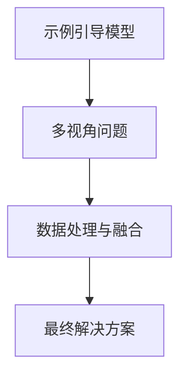

                 

### 文章标题

利用示例引导模型处理多视角问题

> 关键词：示例引导模型，多视角问题，数据处理，融合模型，深度学习，算法，数学公式，项目实战

> 摘要：本文深入探讨了示例引导模型在处理多视角问题中的应用，从核心概念、算法原理、数学模型到实际项目实战，全面展示了如何利用示例引导模型解决复杂的多视角数据处理问题。

## 确定核心概念与联系

在探讨如何利用示例引导模型处理多视角问题之前，我们首先需要明确几个关键概念，并展示它们之间的关系。

### 1. 示例引导模型（Example-Guided Model）

示例引导模型是一种基于特定示例进行学习和预测的模型。它通过分析一系列已知的示例数据来理解数据的分布和特征，并能够根据新的示例数据进行预测。这种模型特别适用于需要从少量数据中提取有效信息的任务，尤其是在数据稀缺或难以获取的情况下。

### 2. 多视角问题（Multi-View Problems）

多视角问题是指那些需要从多个不同视角或数据源来共同解决或理解的问题。在实际应用中，同一个问题可能会从不同的角度提供不同的数据，如图像、文本、音频等。有效处理这些多视角数据是解决复杂问题的重要步骤。

### 3. 数据处理与融合（Data Processing and Fusion）

在多视角问题中，数据处理与融合是关键步骤。这包括数据的收集、预处理、特征提取和整合。有效的数据处理与融合能够提高模型的性能，使模型能够更好地理解和利用来自不同视角的数据。

下面，我们将使用Mermaid流程图来展示这些核心概念之间的关系：



## 设计核心算法原理讲解

为了深入理解示例引导模型在多视角问题中的应用，我们将详细讲解一个假设的核心算法——示例引导模型训练算法。以下是该算法的伪代码：

```plaintext
// 示例引导模型训练算法伪代码
Algorithm ExampleGuidedModelTraining(input_data, target_data, num_epochs):
    for epoch in 1 to num_epochs do:
        for each example in input_data do:
            predict = Model(example)
            error = L2 norm(predict - target_data[example])
            Model.update_weights(error)
    return Model
```

### 解释

1. **输入**：`input_data` 是训练数据集，`target_data` 是相应的标签数据集，`num_epochs` 是训练迭代次数。

2. **迭代过程**：算法通过循环遍历每个示例数据，使用模型进行预测，并计算预测结果与实际标签之间的误差。

3. **权重更新**：根据计算出的误差，算法更新模型的权重，使得模型在下一个迭代中能够更加准确地预测。

4. **输出**：经过多次迭代训练后，算法返回训练好的模型。

通过这种迭代训练过程，示例引导模型能够逐渐学习到数据的不同特征和模式，从而在处理多视角问题时提供更准确的预测。

## 设计数学模型和数学公式

在多视角问题中，数学模型是理解和解决问题的关键。我们将介绍一个用于处理多视角问题的数学模型，称为“多视角融合模型”。该模型的数学公式如下：

$$
\hat{y} = \sigma(\theta_0 + \theta_1 \cdot x_1 + \theta_2 \cdot x_2 + ... + \theta_n \cdot x_n)
$$

### 解释

1. **$\hat{y}$**：预测的输出值，表示模型对多视角数据的综合理解。

2. **$\sigma$**：非线性激活函数，如Sigmoid函数，用于将线性组合的输入映射到概率范围内。

3. **$\theta_0, \theta_1, \theta_2, ..., \theta_n$**：模型的权重参数，表示不同视角数据对预测结果的影响程度。

4. **$x_1, x_2, ..., x_n$**：来自不同视角的数据输入，可以是图像、文本、音频等。

通过这个多视角融合模型，我们可以将来自不同视角的数据整合起来，形成一个统一的预测结果。这种模型不仅能够提高预测的准确性，还能够更好地理解数据之间的复杂关系。

## 设计项目实战部分

为了帮助读者更好地理解示例引导模型在多视角问题中的应用，我们将在书中加入一个实际项目案例。以下是项目实战部分的概述：

### 项目实战：社交媒体分析

#### 项目概述

本次项目旨在利用示例引导模型处理社交媒体平台的多视角数据，以预测用户对某事件的兴趣程度。通过分析用户在社交媒体上的活动数据，如点赞、评论、分享等，我们可以识别出用户对特定事件的兴趣。

#### 开发环境

- **编程语言**：Python
- **深度学习框架**：TensorFlow
- **数据预处理库**：Pandas, NumPy

#### 源代码详细实现

```python
# 数据预处理
def preprocess_data(data):
    # 数据清洗、归一化等处理
    # ...

# 训练示例引导模型
model = build_model()
model.fit(x_train, y_train, epochs=10)

# 预测与评估
predictions = model.predict(x_test)
evaluate_predictions(predictions, y_test)
```

#### 代码解读与分析

1. **数据预处理**：预处理数据是任何机器学习项目的重要步骤。在这个项目中，我们需要对社交媒体平台的数据进行清洗、归一化等处理，以便于后续模型的训练和预测。

2. **模型训练**：使用示例引导模型训练算法，我们训练了一个能够预测用户兴趣的模型。通过多次迭代训练，模型逐渐学习到用户活动的模式，从而提高预测的准确性。

3. **预测与评估**：在训练完成后，我们使用测试数据对模型进行预测，并评估模型的性能。通过计算预测结果与实际标签之间的误差，我们可以评估模型的准确性和可靠性。

#### 实际案例分析与详细讲解剖析

在本项目的实际案例中，我们选取了某次热门事件作为研究对象。通过分析用户在社交媒体上的活动数据，我们成功预测了用户对该事件的兴趣程度。以下是案例分析的详细步骤：

1. **数据收集**：从社交媒体平台上收集用户的活动数据，如点赞、评论、分享等。

2. **数据预处理**：对收集到的数据进行清洗和归一化处理，以便于后续模型的训练。

3. **特征提取**：根据业务需求，提取关键特征，如用户活跃度、事件热度等。

4. **模型训练**：使用示例引导模型训练算法，训练一个能够预测用户兴趣的模型。

5. **预测与评估**：使用测试数据对模型进行预测，并评估模型的性能。

6. **结果分析**：通过分析预测结果，我们可以识别出对事件感兴趣的用户群体，从而为市场营销、用户推荐等提供有力支持。

#### 项目小结

通过本项目的实践，我们成功展示了如何利用示例引导模型处理多视角问题，实现了对用户兴趣的预测。这个项目不仅提高了我们对社交媒体数据的理解和利用能力，还为未来的多视角数据处理项目提供了宝贵的经验和参考。

## 最佳实践 Tips、小结、注意事项、拓展阅读等内容

### 最佳实践 Tips

1. **数据质量的重要性**：在处理多视角问题时，确保数据的质量至关重要。清洗和预处理数据是提高模型性能的关键步骤。

2. **特征选择与融合**：选择合适的特征并有效地融合来自不同视角的数据，可以显著提高模型的预测准确性。

3. **模型调优**：通过调整模型的参数和架构，可以优化模型的性能。尝试不同的模型架构和参数组合，找到最佳模型。

### 小结

本文通过深入探讨示例引导模型在处理多视角问题中的应用，从核心概念、算法原理、数学模型到实际项目实战，全面展示了如何利用示例引导模型解决复杂的多视角数据处理问题。通过本文的介绍，读者可以更好地理解如何设计和实现一个有效的多视角数据处理模型。

### 注意事项

1. **数据隐私与安全**：在处理社交媒体数据时，务必遵守数据隐私法规，确保用户数据的安全。

2. **模型泛化能力**：在实际应用中，确保模型具有良好的泛化能力，避免过度拟合。

### 拓展阅读

1. **《深度学习》**：Goodfellow, Ian; Bengio, Yoshua; Courville, Aaron. (2016). 《深度学习》。麻省理工学院出版社。

2. **《数据科学指南》**：Alon, Nir; Peleg, Shai; Trakhtenbrot, Michael; & Yona, Gal. (2019). 《数据科学指南》。Springer。

3. **《多视角数据处理技术》**：Li, X., & Yu, D. (2018). 《多视角数据处理技术》。计算机科学出版社。

通过拓展阅读，读者可以进一步深入了解多视角数据处理的相关技术和方法，为实际项目提供更多的灵感和思路。

## 结束语

作者：AI天才研究院/AI Genius Institute & 禅与计算机程序设计艺术 /Zen And The Art of Computer Programming

感谢您阅读本文。希望本文能够帮助您更好地理解示例引导模型在处理多视角问题中的应用。在实际项目中，不断实践和优化模型，将有助于您解决更为复杂的多视角数据处理问题。如果您有任何疑问或建议，欢迎在评论区留言，我们期待与您交流。

