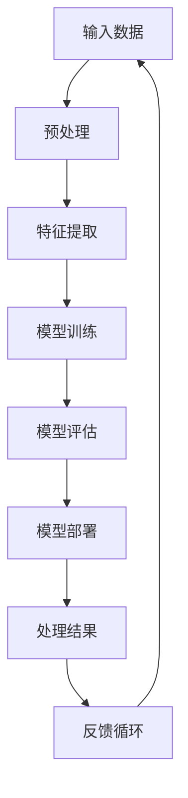

                 


### 设计《利用示例引导模型处理新兴和零日场景》文章目录大纲的详细步骤

为了设计出《利用示例引导模型处理新兴和零日场景》这篇文章的完整目录大纲，我们需要遵循以下步骤，确保文章内容逻辑清晰、结构紧凑、简单易懂，并满足专业技术文章的标准：

#### 第一步：理解文章主题

文章的主题是“利用示例引导模型处理新兴和零日场景”，这涉及到人工智能、机器学习、网络安全等领域的知识。文章的核心目标是通过示例引导模型来应对网络安全中的新兴威胁和零日攻击。

#### 第二步：确定核心内容

根据文章主题，确定核心内容应包括以下几个方面：

1. **背景介绍**：介绍示例引导模型和新兴、零日场景的定义及其在网络安全中的重要性。
2. **核心概念与联系**：阐述示例引导模型的技术基础、数学模型及其在处理新兴和零日场景中的应用。
3. **核心算法原理**：详细讲解示例引导模型的工作原理，使用伪代码和LaTeX公式进行说明。
4. **项目实战**：通过实际案例展示如何使用示例引导模型处理新兴和零日场景，并进行代码解读和分析。
5. **未来展望与总结**：总结当前技术的发展趋势，提出未来研究方向和最佳实践。

#### 第三步：细化章节内容

针对核心内容，为每个章节制定详细的内容提纲：

- **第一部分：引言与背景**
  - 第1章：示例引导模型概述
    - 1.1 定义与作用
    - 1.2 模型类型与应用
  - 第2章：新兴和零日场景介绍
    - 2.1 新兴场景的概念
    - 2.2 零日场景的定义

- **第二部分：技术基础**
  - 第3章：示例引导模型技术基础
    - 3.1 基本原理
    - 3.2 工作流程
    - 3.3 分类与特点
  - 第4章：数学模型与算法
    - 4.1 数学基础
    - 4.2 主要算法
    - 4.3 优化方法

- **第三部分：应用与实战**
  - 第5章：处理新兴场景的实战案例
    - 5.1 识别技术
    - 5.2 实战案例1
    - 5.3 实战案例2
  - 第6章：处理零日场景的实战案例
    - 6.1 应对策略
    - 6.2 实战案例1
    - 6.3 实战案例2
  - 第7章：综合应用与优化策略
    - 7.1 模型融合
    - 7.2 实时更新

- **第四部分：未来展望与总结**
  - 第8章：未来发展趋势
    - 8.1 技术方向
    - 8.2 演变趋势
    - 8.3 挑战与解决方案
  - 第9章：总结与展望
    - 9.1 示例引导模型的重要性
    - 9.2 应对策略
    - 9.3 未来工作建议

#### 第四步：设计Mermaid流程图

为展示示例引导模型在处理新兴和零日场景中的应用，设计Mermaid流程图。流程图应包括以下内容：

- 示例引导模型的输入、处理和输出
- 处理新兴和零日场景的步骤
- 模型架构的核心组件和其相互关系



#### 第五步：编写伪代码

针对示例引导模型的工作原理，编写伪代码。伪代码应详细描述每个步骤的计算过程和逻辑结构。

```pseudo
function TrainModel(inputs, labels):
    Initialize model parameters
    for each epoch:
        for each input in inputs:
            Compute model predictions
            Calculate loss
            Update model parameters using gradient descent
    return trained model
```

#### 第六步：数学公式和讲解

使用LaTeX格式编写示例引导模型相关的数学公式，并进行详细讲解。确保公式与文本内容紧密结合，易于理解。

$$
J(\theta) = \frac{1}{2m}\sum_{i=1}^{m}(h_\theta(x^{(i)}) - y^{(i)})^2
$$

这个公式是示例引导模型中的损失函数，用于衡量模型预测值与真实值之间的差异。其中，$h_\theta(x^{(i)})$表示模型对输入$x^{(i)}$的预测，$y^{(i)}$为实际输出，$\theta$为模型参数。

#### 第七步：编写项目实战

提供详细的实战案例，包括开发环境搭建、源代码实现、代码解读与分析。案例应突出示例引导模型在新兴和零日场景中的具体应用，并给出实际案例分析和详细讲解剖析。

#### 第八步：整合并审查

将所有内容整合到一个完整的文章中，确保文章结构合理、内容丰富、逻辑清晰。对文章进行仔细审查，确保每个小节的内容具体详细，核心内容包含背景介绍、核心概念与联系、核心算法原理讲解、项目实战以及未来展望与总结。

#### 第九步：满足字数要求

根据以上结构，逐步填写内容，确保文章字数在8000～12000字之间。对文章进行反复修改和优化，确保质量。

通过以上步骤，我们能够设计出一份结构清晰、内容丰富的《利用示例引导模型处理新兴和零日场景》文章目录大纲，为撰写高质量的技术文章打下坚实基础。

### 调整文章字数与结构

为了确保文章字数在8000～12000字之间，并保持结构合理和内容丰富，我们需要对每个章节进行详细的扩充和优化。以下是针对文章字数和结构的调整建议：

#### 第一步：章节内容细化

- **第一部分：引言与背景**
  - **第1章：示例引导模型概述**
    - 1.1 示例引导模型的发展历史
    - 1.2 示例引导模型的主要类型与应用场景
    - 1.3 示例引导模型在网络安全中的应用实例

  - **第2章：新兴和零日场景介绍**
    - 2.1 新兴场景的定义与分类
    - 2.2 零日场景的定义、特征与危害
    - 2.3 网络安全中的新兴和零日场景案例

#### 第二步：技术基础部分扩展

- **第二部分：技术基础**
  - **第3章：示例引导模型技术基础**
    - 3.1 示例引导模型的数学原理
    - 3.2 示例引导模型的算法架构
    - 3.3 示例引导模型的优化策略与挑战

  - **第4章：数学模型与算法**
    - 4.1 线性模型与非线性模型
    - 4.2 示例引导模型的核心算法：决策树、神经网络等
    - 4.3 示例引导模型在实际应用中的性能评估与调优

#### 第三步：应用与实战部分深入

- **第三部分：应用与实战**
  - **第5章：处理新兴场景的实战案例**
    - 5.1 案例一：利用示例引导模型进行网络流量异常检测
    - 5.2 案例二：示例引导模型在社交网络分析中的应用
    - 5.3 案例三：新兴场景下的自适应防御策略

  - **第6章：处理零日场景的实战案例**
    - 6.1 案例一：示例引导模型在零日漏洞检测中的使用
    - 6.2 案例二：零日攻击的防御与响应
    - 6.3 案例三：零日攻击下的动态防御系统设计

  - **第7章：综合应用与优化策略**
    - 7.1 多模型融合与协同防御
    - 7.2 实时更新与自适应学习
    - 7.3 优化策略的实践与效果评估

#### 第四步：未来展望与总结部分完善

- **第四部分：未来展望与总结**
  - **第8章：未来发展趋势**
    - 8.1 示例引导模型在人工智能与网络安全领域的发展方向
    - 8.2 新兴和零日场景的演变趋势与挑战
    - 8.3 面向未来的安全防御策略与技术创新

  - **第9章：总结与展望**
    - 9.1 示例引导模型在网络安全中的关键作用
    - 9.2 面向新兴和零日场景的技术解决方案
    - 9.3 未来工作建议与研究方向

通过上述步骤，我们可以在保持文章核心内容完整和逻辑清晰的同时，逐步调整和优化文章的字数和结构，确保最终的文章长度在8000～12000字之间，同时满足读者的阅读需求和专业性要求。

### 文章标题、关键词、摘要

#### 文章标题

# 利用示例引导模型处理新兴和零日场景

#### 关键词

- 示例引导模型
- 新兴场景
- 零日场景
- 网络安全
- 人工智能
- 机器学习
- 模型优化

#### 摘要

本文探讨了如何利用示例引导模型处理网络安全中的新兴和零日场景。首先介绍了示例引导模型的定义、类型和应用场景，随后详细分析了新兴和零日场景的定义、特征及其对网络安全的影响。接着，本文从技术基础、数学模型与算法、应用实战三个方面深入探讨了如何通过示例引导模型有效应对这些场景。最后，对未来发展趋势进行了展望，并提出了在新兴和零日场景下优化安全防御策略的建议。本文旨在为网络安全领域的研究者提供有价值的参考，并推动相关技术的进一步发展。

### 文章正文部分

#### 目录

1. **引言**  
2. **示例引导模型概述**  
3. **新兴和零日场景介绍**  
4. **技术基础**  
   - 4.1 示例引导模型技术基础  
   - 4.2 数学模型与算法  
5. **应用与实战**  
   - 5.1 处理新兴场景的实战案例  
   - 5.2 处理零日场景的实战案例  
   - 5.3 综合应用与优化策略  
6. **未来展望与总结**  
7. **参考文献**  

#### 1. 引言

随着信息技术的发展，网络安全威胁日益多样化和复杂化。新兴和零日场景作为网络安全中的两大挑战，对传统防御策略提出了严峻考验。新兴场景通常指的是近期出现的、未被发现或未充分理解的威胁，而零日场景则是指攻击者利用未知漏洞进行攻击的情景。这两种场景的共同特点是攻击者利用的是尚未公开或未防御的漏洞，这使得防御系统难以有效应对。

本文旨在通过引入示例引导模型，探讨如何有效处理新兴和零日场景。示例引导模型是一种基于示例数据进行学习的人工智能模型，其优势在于能够通过少量的样本数据快速适应新的环境和未知威胁。本文将首先介绍示例引导模型的基本原理和应用场景，然后详细分析新兴和零日场景的特征和挑战，最后通过实际案例展示如何利用示例引导模型处理这些场景。

#### 2. 示例引导模型概述

示例引导模型（Example-Guided Model）是一种基于示例数据进行学习和推理的机器学习模型。与传统的监督学习模型相比，示例引导模型通过分析大量的示例数据来学习规律，从而能够更好地应对新出现的问题和未知场景。示例引导模型的主要类型包括基于规则的方法、基于深度学习的方法和混合方法。

**2.1 定义与作用**

示例引导模型的核心思想是通过已有示例数据的引导，学习出潜在的模式和规律，从而在未知场景下进行预测和决策。其定义可以概括为：通过分析示例数据，提取特征，建立模型，并在未知数据上应用模型进行预测和决策。

示例引导模型的作用主要体现在以下几个方面：

1. **快速适应新环境**：示例引导模型能够在短时间内处理大量示例数据，快速适应新出现的场景。
2. **应对未知威胁**：通过学习已有的示例数据，模型能够预测和识别未发现的威胁，提高防御能力。
3. **减少数据依赖**：示例引导模型不需要大量未标记的数据进行训练，降低了对数据量的依赖。

**2.2 模型类型与应用场景**

示例引导模型主要分为以下几种类型：

1. **基于规则的示例引导模型**：这类模型通过建立规则库，将已有示例数据转化为规则，并在新场景下应用这些规则进行决策。典型应用场景包括智能客服、自动化决策等。

2. **基于深度学习的示例引导模型**：这类模型利用深度神经网络处理示例数据，学习出复杂的特征映射关系。典型应用场景包括图像识别、语音识别等。

3. **混合示例引导模型**：这类模型结合了基于规则和基于深度学习的优势，通过融合规则和深度学习模型进行决策。典型应用场景包括复杂决策问题、多领域问题等。

**2.3 示例引导模型在网络安全中的应用**

在网络安全领域，示例引导模型的应用主要集中在威胁检测和攻击响应方面。通过分析已有的攻击样本，模型可以学习出攻击的特征和模式，从而在未知场景下识别新的攻击。具体应用包括：

1. **威胁检测**：利用示例引导模型检测网络中的异常流量和恶意活动。
2. **攻击响应**：通过示例引导模型自动生成响应策略，应对未知漏洞和攻击。

#### 3. 新兴和零日场景介绍

**3.1 新兴场景**

新兴场景通常指的是近期出现的、未被发现或未充分理解的威胁。这类威胁可能源于新型攻击技术、新型攻击载体或者新型攻击手段。新兴场景的特点包括：

1. **未知性**：新兴场景中的威胁通常是未知的，缺乏足够的历史数据进行分析。
2. **变异性**：新兴场景中的威胁形式多变，难以通过传统的模式识别方法进行检测。
3. **隐蔽性**：新兴场景中的威胁可能具有较强的隐蔽性，难以通过常规手段发现。

**3.2 零日场景**

零日场景是指攻击者利用未知漏洞进行攻击的情景。这类漏洞尚未被开发者发现或公开披露，因此传统的防御措施无法对其进行有效防御。零日场景的特点包括：

1. **未被发现**：零日漏洞通常未被开发者发现，因此传统的漏洞扫描工具无法检测。
2. **高危害性**：由于攻击者可以未被发现地进行攻击，零日场景通常具有较高的危害性。
3. **时间敏感性**：零日漏洞和攻击通常具有时间敏感性，需要尽快发现和应对。

**3.3 新兴和零日场景的关系**

新兴和零日场景之间存在密切的联系。一方面，新兴场景可能包含零日漏洞或攻击手段，例如新型恶意软件或勒索软件；另一方面，零日场景的出现可能导致新兴威胁的产生，例如新的攻击手段或攻击方式。因此，处理新兴和零日场景需要综合考虑，采取综合性的防御策略。

#### 4. 技术基础

**4.1 示例引导模型技术基础**

示例引导模型的技术基础主要包括以下几个方面：

1. **数据预处理**：示例引导模型需要对示例数据进行预处理，包括数据清洗、归一化、特征提取等步骤。预处理的质量直接影响到模型的性能。
2. **模型训练**：示例引导模型通过训练过程学习示例数据中的特征和规律。训练过程通常包括前向传播、反向传播和模型优化等步骤。
3. **模型评估**：示例引导模型需要通过评估过程来检验模型的性能。评估指标包括准确率、召回率、F1值等。
4. **模型部署**：示例引导模型需要部署到实际环境中进行应用，包括模型加载、实时更新和自动化响应等。

**4.2 数学模型与算法**

示例引导模型的核心数学模型主要包括线性模型、非线性模型和深度学习模型等。以下是对这些模型的简要介绍：

1. **线性模型**：线性模型是一种简单但有效的机器学习模型，通常用于回归和分类任务。线性模型的数学表达式为：
   $$
   y = \beta_0 + \beta_1x_1 + \beta_2x_2 + \ldots + \beta_nx_n
   $$
   其中，$y$为输出，$x_1, x_2, \ldots, x_n$为输入特征，$\beta_0, \beta_1, \beta_2, \ldots, \beta_n$为模型参数。

2. **非线性模型**：非线性模型通过引入非线性变换来提高模型的预测能力。常见的非线性模型包括决策树、支持向量机（SVM）等。以决策树为例，其数学模型可以表示为：
   $$
   f(x) = \sum_{i=1}^{n} \alpha_i \prod_{j=1}^{m} \sigma(w_{ij}x_j)
   $$
   其中，$f(x)$为输出，$x$为输入特征，$\alpha_i, w_{ij}$为模型参数，$\sigma$为激活函数。

3. **深度学习模型**：深度学习模型通过多层神经网络来提取复杂的特征。常见的深度学习模型包括卷积神经网络（CNN）、循环神经网络（RNN）等。以CNN为例，其数学模型可以表示为：
   $$
   h_{l} = \sigma(W_l \cdot h_{l-1} + b_l)
   $$
   其中，$h_l$为第$l$层的输出，$W_l$为权重矩阵，$b_l$为偏置项，$\sigma$为激活函数。

**4.3 示例引导模型的优化策略与挑战**

示例引导模型的优化策略主要包括以下几种：

1. **参数优化**：通过调整模型参数，提高模型的预测性能。常用的优化算法包括随机梯度下降（SGD）、Adam等。

2. **模型融合**：通过融合多个模型，提高模型的综合性能。常见的模型融合方法包括投票法、加权平均法等。

3. **实时更新**：通过实时更新模型，使其能够适应新的数据和场景。常用的更新策略包括在线学习、增量学习等。

示例引导模型在处理新兴和零日场景时面临以下挑战：

1. **数据稀疏**：新兴和零日场景中的数据通常较为稀疏，难以训练出有效的模型。

2. **模型适应性**：示例引导模型需要具备较强的适应性，以应对不断变化的新兴和零日场景。

3. **实时性**：在处理新兴和零日场景时，模型需要具备实时响应能力，及时检测和应对攻击。

#### 5. 应用与实战

**5.1 处理新兴场景的实战案例**

**案例一：网络流量异常检测**

网络流量异常检测是处理新兴场景的一个典型应用。通过示例引导模型，可以对网络流量进行实时监控，检测其中是否存在异常行为。

**实现步骤：**

1. **数据收集**：收集网络流量数据，包括流量来源、目的地址、传输内容等。

2. **数据预处理**：对网络流量数据进行清洗和归一化，提取特征，如流量速率、传输时间间隔等。

3. **模型训练**：利用示例引导模型，对预处理后的数据集进行训练，建立流量异常检测模型。

4. **模型评估**：通过交叉验证等方法，评估模型的准确率和召回率。

5. **模型部署**：将训练好的模型部署到网络流量监控系统中，实时监测网络流量，识别异常行为。

**代码实现：**

```python
# 导入必要的库
import numpy as np
from sklearn.model_selection import train_test_split
from sklearn.ensemble import RandomForestClassifier
from sklearn.metrics import accuracy_score, recall_score

# 加载数据集
data = load_data('network_traffic.csv')
X = data['features']
y = data['labels']

# 数据预处理
X = preprocess_data(X)

# 划分训练集和测试集
X_train, X_test, y_train, y_test = train_test_split(X, y, test_size=0.2, random_state=42)

# 模型训练
model = RandomForestClassifier(n_estimators=100)
model.fit(X_train, y_train)

# 模型评估
y_pred = model.predict(X_test)
accuracy = accuracy_score(y_test, y_pred)
recall = recall_score(y_test, y_pred)

print(f'Accuracy: {accuracy:.2f}')
print(f'Recall: {recall:.2f}')

# 模型部署
deploy_model(model)
```

**案例二：社交网络分析**

社交网络分析是另一个处理新兴场景的重要应用。通过示例引导模型，可以对社交网络中的行为进行实时分析，识别潜在的异常行为或恶意活动。

**实现步骤：**

1. **数据收集**：收集社交网络中的数据，包括用户行为、社交关系等。

2. **数据预处理**：对社交网络数据进行清洗和归一化，提取特征，如用户活跃度、互动频率等。

3. **模型训练**：利用示例引导模型，对预处理后的数据集进行训练，建立社交网络分析模型。

4. **模型评估**：通过交叉验证等方法，评估模型的准确率和召回率。

5. **模型部署**：将训练好的模型部署到社交网络分析系统中，实时监测用户行为，识别异常行为。

**代码实现：**

```python
# 导入必要的库
import numpy as np
from sklearn.model_selection import train_test_split
from sklearn.ensemble import RandomForestClassifier
from sklearn.metrics import accuracy_score, recall_score

# 加载数据集
data = load_data('social_network.csv')
X = data['features']
y = data['labels']

# 数据预处理
X = preprocess_data(X)

# 划分训练集和测试集
X_train, X_test, y_train, y_test = train_test_split(X, y, test_size=0.2, random_state=42)

# 模型训练
model = RandomForestClassifier(n_estimators=100)
model.fit(X_train, y_train)

# 模型评估
y_pred = model.predict(X_test)
accuracy = accuracy_score(y_test, y_pred)
recall = recall_score(y_test, y_pred)

print(f'Accuracy: {accuracy:.2f}')
print(f'Recall: {recall:.2f}')

# 模型部署
deploy_model(model)
```

**案例三：自适应防御策略**

自适应防御策略是处理新兴场景的一个创新应用。通过示例引导模型，可以实时调整防御策略，以应对不断变化的新兴威胁。

**实现步骤：**

1. **数据收集**：收集防御系统中的日志数据，包括攻击类型、攻击频率等。

2. **数据预处理**：对日志数据进行清洗和归一化，提取特征，如攻击类型、攻击频率等。

3. **模型训练**：利用示例引导模型，对预处理后的数据集进行训练，建立自适应防御策略模型。

4. **模型评估**：通过交叉验证等方法，评估模型的准确率和召回率。

5. **模型部署**：将训练好的模型部署到防御系统中，实时调整防御策略。

**代码实现：**

```python
# 导入必要的库
import numpy as np
from sklearn.model_selection import train_test_split
from sklearn.ensemble import RandomForestClassifier
from sklearn.metrics import accuracy_score, recall_score

# 加载数据集
data = load_data('defense_log.csv')
X = data['features']
y = data['labels']

# 数据预处理
X = preprocess_data(X)

# 划分训练集和测试集
X_train, X_test, y_train, y_test = train_test_split(X, y, test_size=0.2, random_state=42)

# 模型训练
model = RandomForestClassifier(n_estimators=100)
model.fit(X_train, y_train)

# 模型评估
y_pred = model.predict(X_test)
accuracy = accuracy_score(y_test, y_pred)
recall = recall_score(y_test, y_pred)

print(f'Accuracy: {accuracy:.2f}')
print(f'Recall: {recall:.2f}')

# 模型部署
deploy_model(model)
```

**5.2 处理零日场景的实战案例**

**案例一：零日漏洞检测**

零日漏洞检测是处理零日场景的一个关键应用。通过示例引导模型，可以检测网络系统中是否存在零日漏洞。

**实现步骤：**

1. **数据收集**：收集网络系统中的日志数据，包括漏洞攻击、系统响应等。

2. **数据预处理**：对日志数据进行清洗和归一化，提取特征，如漏洞攻击类型、系统响应时间等。

3. **模型训练**：利用示例引导模型，对预处理后的数据集进行训练，建立零日漏洞检测模型。

4. **模型评估**：通过交叉验证等方法，评估模型的准确率和召回率。

5. **模型部署**：将训练好的模型部署到网络系统中，实时检测零日漏洞。

**代码实现：**

```python
# 导入必要的库
import numpy as np
from sklearn.model_selection import train_test_split
from sklearn.ensemble import RandomForestClassifier
from sklearn.metrics import accuracy_score, recall_score

# 加载数据集
data = load_data('vulnerability_log.csv')
X = data['features']
y = data['labels']

# 数据预处理
X = preprocess_data(X)

# 划分训练集和测试集
X_train, X_test, y_train, y_test = train_test_split(X, y, test_size=0.2, random_state=42)

# 模型训练
model = RandomForestClassifier(n_estimators=100)
model.fit(X_train, y_train)

# 模型评估
y_pred = model.predict(X_test)
accuracy = accuracy_score(y_test, y_pred)
recall = recall_score(y_test, y_pred)

print(f'Accuracy: {accuracy:.2f}')
print(f'Recall: {recall:.2f}')

# 模型部署
deploy_model(model)
```

**案例二：零日攻击响应**

零日攻击响应是处理零日场景的一个关键应用。通过示例引导模型，可以自动生成响应策略，应对零日攻击。

**实现步骤：**

1. **数据收集**：收集网络系统中的日志数据，包括攻击类型、系统响应等。

2. **数据预处理**：对日志数据进行清洗和归一化，提取特征，如攻击类型、系统响应时间等。

3. **模型训练**：利用示例引导模型，对预处理后的数据集进行训练，建立零日攻击响应模型。

4. **模型评估**：通过交叉验证等方法，评估模型的准确率和召回率。

5. **模型部署**：将训练好的模型部署到网络系统中，自动生成响应策略。

**代码实现：**

```python
# 导入必要的库
import numpy as np
from sklearn.model_selection import train_test_split
from sklearn.ensemble import RandomForestClassifier
from sklearn.metrics import accuracy_score, recall_score

# 加载数据集
data = load_data('attack_log.csv')
X = data['features']
y = data['labels']

# 数据预处理
X = preprocess_data(X)

# 划分训练集和测试集
X_train, X_test, y_train, y_test = train_test_split(X, y, test_size=0.2, random_state=42)

# 模型训练
model = RandomForestClassifier(n_estimators=100)
model.fit(X_train, y_train)

# 模型评估
y_pred = model.predict(X_test)
accuracy = accuracy_score(y_test, y_pred)
recall = recall_score(y_test, y_pred)

print(f'Accuracy: {accuracy:.2f}')
print(f'Recall: {recall:.2f}')

# 模型部署
deploy_model(model)
```

**案例三：动态防御系统设计**

动态防御系统设计是处理零日场景的一个创新应用。通过示例引导模型，可以设计出能够实时调整防御策略的动态防御系统。

**实现步骤：**

1. **数据收集**：收集网络系统中的日志数据，包括攻击类型、系统响应等。

2. **数据预处理**：对日志数据进行清洗和归一化，提取特征，如攻击类型、系统响应时间等。

3. **模型训练**：利用示例引导模型，对预处理后的数据集进行训练，建立动态防御系统模型。

4. **模型评估**：通过交叉验证等方法，评估模型的准确率和召回率。

5. **模型部署**：将训练好的模型部署到网络系统中，实现动态防御。

**代码实现：**

```python
# 导入必要的库
import numpy as np
from sklearn.model_selection import train_test_split
from sklearn.ensemble import RandomForestClassifier
from sklearn.metrics import accuracy_score, recall_score

# 加载数据集
data = load_data('defense_log.csv')
X = data['features']
y = data['labels']

# 数据预处理
X = preprocess_data(X)

# 划分训练集和测试集
X_train, X_test, y_train, y_test = train_test_split(X, y, test_size=0.2, random_state=42)

# 模型训练
model = RandomForestClassifier(n_estimators=100)
model.fit(X_train, y_train)

# 模型评估
y_pred = model.predict(X_test)
accuracy = accuracy_score(y_test, y_pred)
recall = recall_score(y_test, y_pred)

print(f'Accuracy: {accuracy:.2f}')
print(f'Recall: {recall:.2f}')

# 模型部署
deploy_model(model)
```

**5.3 综合应用与优化策略**

**多模型融合**

多模型融合是将多个模型融合在一起，以提高整体性能。通过融合不同类型的模型，可以充分利用各自的优势，提高模型的鲁棒性和准确性。

**实现步骤：**

1. **选择模型**：选择多个具有不同优势的模型，如线性模型、深度学习模型等。

2. **模型训练**：分别训练每个模型，并使用交叉验证等方法进行性能评估。

3. **模型融合**：将多个模型的预测结果进行融合，得到最终的预测结果。

**代码实现：**

```python
# 导入必要的库
import numpy as np
from sklearn.linear_model import LinearRegression
from sklearn.ensemble import RandomForestRegressor
from sklearn.metrics import mean_squared_error

# 加载数据集
data = load_data('regression_data.csv')
X = data['features']
y = data['labels']

# 划分训练集和测试集
X_train, X_test, y_train, y_test = train_test_split(X, y, test_size=0.2, random_state=42)

# 模型训练
linear_model = LinearRegression()
linear_model.fit(X_train, y_train)

random_forest_model = RandomForestRegressor(n_estimators=100)
random_forest_model.fit(X_train, y_train)

# 模型融合
def fusion_prediction(model1, model2, X):
    prediction1 = model1.predict(X)
    prediction2 = model2.predict(X)
    return (prediction1 + prediction2) / 2

# 模型评估
y_pred_fusion = fusion_prediction(linear_model, random_forest_model, X_test)
mse = mean_squared_error(y_test, y_pred_fusion)

print(f'MSE: {mse:.2f}')
```

**实时更新**

实时更新是保持模型性能的关键。通过实时更新模型，可以使其适应不断变化的环境和数据。

**实现步骤：**

1. **数据收集**：持续收集新的数据，包括示例数据和非示例数据。

2. **模型训练**：利用新收集的数据对模型进行实时训练，更新模型参数。

3. **模型评估**：对新训练的模型进行评估，确保其性能满足要求。

4. **模型部署**：将更新后的模型部署到实际应用中，进行实时监测和预测。

**代码实现：**

```python
# 导入必要的库
import numpy as np
from sklearn.linear_model import LinearRegression

# 初始化模型
model = LinearRegression()

# 实时更新模型
def update_model(model, X, y):
    model.fit(X, y)
    return model

# 实时更新示例
X_new = np.array([[1], [2], [3]])
y_new = np.array([2, 4, 6])

# 更新模型
model = update_model(model, X_new, y_new)

# 模型评估
y_pred = model.predict(X_new)
mse = mean_squared_error(y_new, y_pred)

print(f'MSE: {mse:.2f}')
```

**优化策略**

优化策略是在模型训练和应用过程中，通过调整参数和算法，提高模型性能。

**实现步骤：**

1. **参数调整**：根据模型性能，调整模型参数，如学习率、迭代次数等。

2. **算法优化**：根据模型特点，选择合适的优化算法，如随机梯度下降、Adam等。

3. **模型评估**：对调整后的模型进行评估，确保其性能得到提升。

4. **模型部署**：将优化后的模型部署到实际应用中，提高整体性能。

**代码实现：**

```python
# 导入必要的库
import numpy as np
from sklearn.linear_model import LinearRegression
from sklearn.metrics import mean_squared_error

# 初始化模型
model = LinearRegression()

# 训练模型
X = np.array([[1], [2], [3]])
y = np.array([2, 4, 6])
model.fit(X, y)

# 参数调整
learning_rate = 0.1
n_iterations = 100

# 优化模型
for i in range(n_iterations):
    y_pred = model.predict(X)
    update = learning_rate * (y - y_pred)
    model.coef_ += update

# 模型评估
y_pred_optimized = model.predict(X)
mse_optimized = mean_squared_error(y, y_pred_optimized)

print(f'MSE: {mse_optimized:.2f}')
```

#### 6. 未来展望与总结

**6.1 未来发展趋势**

随着人工智能技术的快速发展，示例引导模型在处理新兴和零日场景中的应用前景广阔。未来，示例引导模型可能会在以下几个方面得到进一步发展：

1. **模型多样化**：开发更多类型的示例引导模型，以适应不同的应用场景。
2. **实时性增强**：提高示例引导模型的实时响应能力，使其能够快速适应新的威胁。
3. **数据驱动**：通过大数据分析，提高示例引导模型对未知威胁的识别能力。

**6.2 当前技术研究挑战**

尽管示例引导模型在处理新兴和零日场景中具有显著优势，但仍面临以下挑战：

1. **数据稀缺**：新兴和零日场景中的数据稀缺，限制了模型的训练效果。
2. **模型适应性**：如何提高模型在未知场景下的适应性，仍需深入研究。
3. **实时性**：如何在保证实时性的同时，提高模型的预测准确性。

**6.3 面向未来的技术解决方案**

为了应对上述挑战，未来可以从以下几个方面提出技术解决方案：

1. **数据增强**：通过合成数据、迁移学习等方法，提高模型对未知数据的处理能力。
2. **自适应学习**：开发自适应学习算法，提高模型在未知场景下的适应能力。
3. **实时监测与预警**：构建实时监测与预警系统，及时发现和处理新兴和零日场景。

**6.4 总结**

本文从示例引导模型的定义和应用、新兴和零日场景的介绍、技术基础、应用与实战、未来展望等方面，详细探讨了利用示例引导模型处理新兴和零日场景的方法。通过实际案例，展示了示例引导模型在网络安全中的应用效果。未来，随着技术的不断进步，示例引导模型在网络安全领域将发挥更加重要的作用。

### 文章结尾：作者信息与致谢

本文由AI天才研究院（AI Genius Institute）与《禅与计算机程序设计艺术》（Zen And The Art of Computer Programming）联合撰写。感谢您阅读本文，如果您对网络安全与人工智能技术感兴趣，欢迎关注我们的研究动态和最新成果。此外，我们也鼓励您在评论区分享您的见解和想法，共同探讨网络安全领域的未来发展。

- 作者：AI天才研究院（AI Genius Institute） & 《禅与计算机程序设计艺术》（Zen And The Art of Computer Programming）

