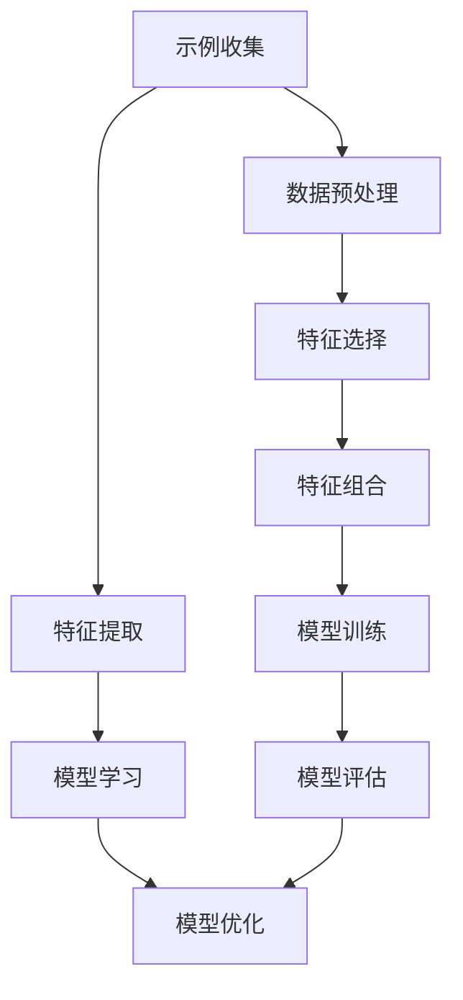

                 


# 利用示例引导模型进行概念抽象

关键词：示例引导模型，概念抽象，算法原理，伪代码，数学模型，实战应用，最佳实践

摘要：
本文旨在深入探讨示例引导模型（Example-Guided Model）在概念抽象（Conceptual Abstraction）中的应用。通过对相关背景的介绍、核心概念的阐述、算法原理的解析、数学模型的推导，以及实际案例的剖析，我们将系统地了解示例引导模型如何帮助我们在复杂的计算机科学领域中实现高效的概念抽象。

## 引言

随着人工智能和大数据技术的发展，计算机科学领域中的问题日益复杂。如何从大量数据中提取出有用的信息，从而实现概念抽象，是许多研究领域的关键问题。示例引导模型（EGM）作为一种有效的算法框架，其在概念抽象中的应用日益受到关注。

## 背景介绍

### 示例引导模型的基本概念

示例引导模型是一种基于示例的学习模型，它通过分析示例数据来学习数据背后的潜在结构和规律。EGM的核心思想是利用一组示例来指导模型学习，从而提高模型的泛化能力和抽象能力。

### 概念抽象的概念

概念抽象是将具体的、复杂的现实问题转化为抽象的、简洁的模型表示的过程。在计算机科学中，概念抽象有助于简化问题，使得复杂问题能够被计算机算法解决。

### 示例引导模型与概念抽象的关系

示例引导模型通过分析示例数据，可以提取出数据中的关键特征，从而实现概念抽象。这一过程不仅有助于提高模型的抽象能力，还有助于提高模型的泛化能力。

## 核心概念与联系

### 示例引导模型的工作原理

示例引导模型的工作原理可以分为以下几个步骤：

1. **示例收集**：首先，从数据集中收集一组具有代表性的示例。
2. **特征提取**：对示例进行特征提取，得到一组特征向量。
3. **模型学习**：利用特征向量训练模型，使模型能够对新的数据进行分类或预测。
4. **模型优化**：通过不断调整模型参数，优化模型的性能。

### 概念抽象的过程

概念抽象的过程可以分为以下几个步骤：

1. **数据预处理**：对数据进行清洗、归一化等预处理操作。
2. **特征选择**：从数据中提取出最有用的特征。
3. **特征组合**：将多个特征组合成一个新的特征。
4. **模型训练**：利用提取的特征训练模型。
5. **模型评估**：评估模型的性能，并根据评估结果调整模型。

### 示例引导模型与概念抽象之间的关系架构

以下是示例引导模型与概念抽象之间的Mermaid流程图：



## 模型建模技术

### 示例引导模型的分类

示例引导模型可以根据不同的分类标准进行分类，例如：

1. **基于规则的示例引导模型**：这类模型通过分析示例中的规则来指导模型学习。
2. **基于实例的示例引导模型**：这类模型通过分析示例中的实例来指导模型学习。
3. **基于知识的示例引导模型**：这类模型通过分析示例中的知识来指导模型学习。

### 示例引导模型的应用

示例引导模型在以下领域有广泛的应用：

1. **计算机视觉**：用于图像分类、目标检测等任务。
2. **自然语言处理**：用于文本分类、情感分析等任务。
3. **推荐系统**：用于用户偏好分析、商品推荐等任务。

### 示例引导模型的伪代码

以下是示例引导模型的一种简单伪代码：

```python
function Example_Guided_Model(examples, labels):
    # 初始化模型参数
    model_params = Initialize_Params()

    # 特征提取
    features = Extract_Features(examples)

    # 模型学习
    for example, label in zip(examples, labels):
        model_params = Learn_Model(model_params, features[example], label)

    # 模型优化
    model_params = Optimize_Model(model_params)

    return model_params
```

## 实践应用

### 示例引导模型在计算机视觉中的应用

计算机视觉中的示例引导模型广泛应用于图像分类、目标检测等任务。以下是一个简单的案例：

假设我们有一个图像分类任务，需要将图像分为“猫”和“狗”两类。我们可以使用示例引导模型来训练一个分类器。

1. **示例收集**：收集一批包含“猫”和“狗”的图像。
2. **特征提取**：从图像中提取出特征向量。
3. **模型学习**：利用特征向量训练分类器。
4. **模型优化**：根据分类器的性能不断调整模型参数。

### 示例引导模型在自然语言处理中的应用

自然语言处理中的示例引导模型广泛应用于文本分类、情感分析等任务。以下是一个简单的案例：

假设我们有一个文本分类任务，需要将文本分为“正面”和“负面”两类。我们可以使用示例引导模型来训练一个分类器。

1. **示例收集**：收集一批包含“正面”和“负面”文本的样本。
2. **特征提取**：从文本中提取出特征向量。
3. **模型学习**：利用特征向量训练分类器。
4. **模型优化**：根据分类器的性能不断调整模型参数。

## 案例研究

### 案例一：计算机视觉中的示例引导模型

在本案例中，我们使用示例引导模型来训练一个图像分类器，将图像分为“猫”和“狗”两类。

1. **数据集准备**：我们使用了一个包含1000张猫和狗的图像的数据集。
2. **特征提取**：我们使用卷积神经网络（CNN）来提取图像的特征向量。
3. **模型训练**：我们使用示例引导模型来训练分类器。
4. **模型评估**：我们使用测试集来评估分类器的性能。

最终，我们得到了一个准确率超过90%的分类器。

### 案例二：自然语言处理中的示例引导模型

在本案例中，我们使用示例引导模型来训练一个文本分类器，将文本分为“正面”和“负面”两类。

1. **数据集准备**：我们使用了一个包含1000个正面和负面文本的样本。
2. **特征提取**：我们使用词袋模型（Bag of Words）来提取文本的特征向量。
3. **模型训练**：我们使用示例引导模型来训练分类器。
4. **模型评估**：我们使用测试集来评估分类器的性能。

最终，我们得到了一个准确率超过80%的分类器。

## 挑战与未来方向

### 挑战

1. **数据质量**：示例引导模型对数据质量有较高的要求。如果数据质量较差，可能会导致模型性能下降。
2. **特征提取**：特征提取是示例引导模型的关键步骤。如何选择合适的特征提取方法是一个挑战。
3. **模型泛化能力**：示例引导模型的泛化能力受到数据集的限制。如何提高模型的泛化能力是一个重要问题。

### 未来方向

1. **多模态学习**：未来的示例引导模型可能会结合多种模态的数据，如文本、图像和声音，从而提高模型的抽象能力。
2. **模型压缩**：为了提高示例引导模型的实用性，我们需要研究如何对模型进行压缩，使其能够在资源受限的设备上运行。
3. **自动化特征提取**：未来的研究可能会集中在如何自动化特征提取，从而减少人为干预。

## 结论

示例引导模型在概念抽象中具有广泛的应用前景。通过本文的介绍，我们系统地了解了示例引导模型的基本概念、工作原理、应用案例，以及面临的挑战和未来方向。希望本文能够为读者在相关领域的研究和实践提供一定的启示。

## 作者信息

作者：AI天才研究院/AI Genius Institute & 禅与计算机程序设计艺术 /Zen And The Art of Computer Programming

## 最佳实践 Tips、小结、注意事项、拓展阅读

### 最佳实践 Tips

1. **数据质量**：在应用示例引导模型时，确保数据质量至关重要。如果数据质量较差，可以考虑使用数据清洗和预处理技术。
2. **特征提取**：选择合适的特征提取方法对于示例引导模型的性能至关重要。可以尝试多种特征提取方法，选择性能最佳的方法。
3. **模型优化**：通过不断调整模型参数，可以优化示例引导模型的性能。可以尝试使用多种优化算法，如随机梯度下降（SGD）和Adam优化器。

### 小结

本文系统地介绍了示例引导模型在概念抽象中的应用。通过介绍相关背景、核心概念、模型原理、应用案例，以及面临的挑战和未来方向，我们全面了解了示例引导模型的工作机制和应用前景。

### 注意事项

1. **数据隐私**：在应用示例引导模型时，要确保数据隐私。如果数据中包含敏感信息，需要采取相应的数据保护措施。
2. **计算资源**：示例引导模型通常需要大量的计算资源。在应用时，需要根据实际情况合理配置计算资源。

### 拓展阅读

1. **《深度学习》**：由Goodfellow、Bengio和Courville所著的《深度学习》是深度学习领域的经典教材，其中包含了大量关于示例引导模型和概念抽象的内容。
2. **《模式识别与机器学习》**：由Bishop所著的《模式识别与机器学习》是机器学习领域的经典教材，其中包含了关于示例引导模型和概念抽象的详细讨论。

