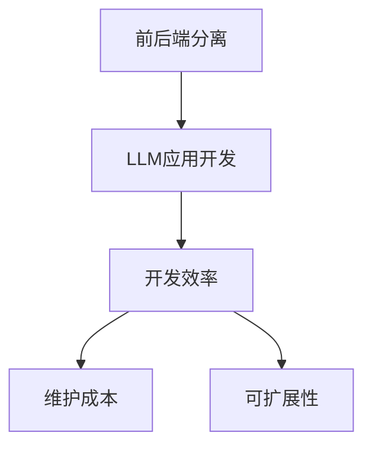

                 


### 第1章：引言与背景

> **关键词**：前后端分离，LLM应用，开发效率，策略

#### 1.1 书籍主题介绍

《前后端分离：提高LLM应用开发效率的策略》旨在探讨在当前技术环境下，如何通过前后端分离的方式，提升语言模型（LLM）应用的开发效率。前后端分离是指将应用的前端（用户界面）与后端（服务器端逻辑）分离，使得两者独立开发、独立部署，从而提高开发效率、降低维护成本、增强系统的可扩展性。

#### 1.1.1 前后端分离的概念

前后端分离是一种软件开发架构模式，通过将用户界面与业务逻辑分离，使前端开发者专注于用户体验和交互设计，而后端开发者专注于数据处理和业务逻辑实现。这种模式有助于提高开发效率，降低项目风险，促进团队协作。

#### 1.1.2 LLM应用开发的重要性

语言模型（LLM）作为人工智能的核心技术之一，广泛应用于自然语言处理、智能问答、文本生成等领域。随着LLM应用的普及，如何高效地进行LLM应用开发成为了一个亟待解决的问题。

#### 1.2 当前LLM应用开发面临的挑战

1. **开发效率低**：传统的前后端一体式开发模式导致开发者需要同时关注前端和后端的开发，导致开发效率降低。
2. **维护成本高**：一体式架构在修改和扩展时，可能需要对前后端代码进行大规模调整，增加了维护成本。
3. **可扩展性差**：一体式架构在应对高并发、大数据量等场景时，性能瓶颈难以突破。

#### 1.2.1 开发效率低的问题

开发效率低的问题主要体现在两个方面：

1. **前后端开发相互依赖**：在传统的一体式开发模式中，前端开发者需要等待后端接口开发完成，才能开始编写前端代码，导致前端开发进度受限。
2. **开发任务分散**：开发者需要同时掌握前端和后端技术，增加了学习和开发成本。

#### 1.2.2 分离带来的好处

前后端分离模式具有以下优点：

1. **提高开发效率**：前后端独立开发，前端开发者可以专注于用户体验和交互设计，后端开发者可以专注于数据处理和业务逻辑实现，从而提高开发效率。
2. **降低维护成本**：前后端分离使得修改和扩展时，只需针对单独的部分进行调整，降低了维护成本。
3. **增强系统的可扩展性**：前后端分离有助于模块化开发，便于系统扩展和性能优化。

### 摘要

本文将从前后端分离的概念、LLM应用开发的重要性、当前LLM应用开发面临的挑战、前后端分离模式的优势以及具体实施策略等方面，全面探讨如何通过前后端分离提高LLM应用的开发效率。通过本文的阅读，读者将了解到前后端分离的原理、方法及其在实际应用中的优势，为LLM应用开发提供有益的参考和指导。

---

**核心概念与联系**

前后端分离与LLM应用开发之间的关系可以用以下Mermaid流程图表示：



**核心算法原理讲解**

在本文中，我们主要关注如何通过前后端分离来提高LLM应用开发效率。具体的算法原理如下：

1. **前端性能优化算法**：前端性能优化主要包括页面加载速度、响应速度和用户体验等方面。常用的算法有懒加载、图片压缩、缓存策略等。
2. **后端性能优化算法**：后端性能优化主要包括数据库查询优化、缓存机制、负载均衡等方面。常用的算法有索引优化、分库分表、分布式缓存等。

**伪代码**

以下是一个前端性能优化的伪代码示例：

```pseudo
function optimizeFrontEndPerformance() {
    // 懒加载
    for (each image in page) {
        if (image not in viewport) {
            defer loading image
        }
    }

    // 图片压缩
    for (each image in page) {
        compress image size
    }

    // 缓存策略
    for (each resource in page) {
        check if resource is cached
        if not cached, cache resource
    }
}
```

以下是一个后端性能优化的伪代码示例：

```pseudo
function optimizeBackEndPerformance() {
    // 数据库查询优化
    create index on frequently queried columns

    // 缓存机制
    for (each frequently accessed data) {
        cache data
    }

    // 负载均衡
    distribute requests among multiple servers
}
```

---

**数学模型和公式**

在前后端分离模式下，我们可以使用以下数学模型来衡量开发效率的提升：

1. **开发效率提升率**：用公式表示为

   $$ \eta = \frac{E_{分离}}{E_{一体}} $$

   其中，$E_{分离}$ 表示前后端分离模式下的开发效率，$E_{一体}$ 表示传统一体式开发模式下的开发效率。

2. **维护成本降低率**：用公式表示为

   $$ \delta = \frac{C_{一体} - C_{分离}}{C_{一体}} $$

   其中，$C_{一体}$ 表示传统一体式开发模式下的维护成本，$C_{分离}$ 表示前后端分离模式下的维护成本。

**详细讲解与举例说明**

假设在一个项目团队中，传统的一体式开发模式下的开发效率为每周完成1个模块，维护成本为每周1500元。而在前后端分离模式下，前端开发团队每周完成1.5个模块，后端开发团队每周完成0.5个模块，维护成本降低为每周1200元。

根据上述数据，我们可以计算出开发效率提升率和维护成本降低率：

1. **开发效率提升率**：

   $$ \eta = \frac{E_{分离}}{E_{一体}} = \frac{1.5 + 0.5}{1} = 2 $$

   即开发效率提升了100%。

2. **维护成本降低率**：

   $$ \delta = \frac{C_{一体} - C_{分离}}{C_{一体}} = \frac{1500 - 1200}{1500} = 0.2 $$

   即维护成本降低了20%。

通过上述计算，我们可以看到前后端分离模式在提高开发效率和降低维护成本方面的显著优势。

---

### 项目实战

#### 开发环境搭建

为了演示前后端分离模式在LLM应用开发中的应用，我们将搭建一个简单的聊天机器人应用。以下是开发环境搭建的步骤：

1. **硬件环境需求**：一台配置较高的计算机，用于运行前端和后端服务。
2. **软件环境配置**：
    - 前端：使用Vue.js框架进行开发。
    - 后端：使用Node.js和Express框架进行开发。
    - 数据库：使用MongoDB进行数据存储。

具体步骤如下：

1. 安装Node.js和npm：

   ```bash
   sudo apt update
   sudo apt install nodejs npm
   ```

2. 安装MongoDB：

   ```bash
   sudo apt install mongodb
   sudo service mongodb start
   ```

3. 创建一个Vue.js项目：

   ```bash
   vue create chat-bot-front-end
   ```

4. 创建一个Node.js项目：

   ```bash
   npm init -y
   npm install express body-parser
   ```

#### 前端应用开发实践

1. **应用实例1：聊天机器人**

   在Vue.js项目中，我们可以使用以下步骤创建聊天机器人：

   1. 安装Vue.js和相关的依赖：

      ```bash
      cd chat-bot-front-end
      npm install vue axios
      ```

   2. 在`src/App.vue`中编写聊天机器人的UI界面：

      ```vue
      <template>
        <div id="app">
          <chat-window></chat-window>
        </div>
      </template>

      <script>
      import ChatWindow from './components/ChatWindow.vue';

      export default {
        name: 'App',
        components: {
          ChatWindow
        }
      };
      </script>
      ```

   3. 在`src/components/ChatWindow.vue`中编写聊天机器人的逻辑：

      ```vue
      <template>
        <div>
          <div v-for="(message, index) in messages" :key="index">
            <div v-if="message.from === 'user'">
              {{ message.content }}
            </div>
            <div v-else>
              <b>{{ message.content }}</b>
            </div>
          </div>
          <input v-model="inputMessage" @keydown.enter="sendMessage"/>
        </div>
      </template>

      <script>
      export default {
        data() {
          return {
            inputMessage: '',
            messages: []
          };
        },
        methods: {
          sendMessage() {
            this.messages.push({ from: 'user', content: this.inputMessage });
            this.inputMessage = '';
            this.fetchResponse();
          },
          fetchResponse() {
            // 发送请求到后端获取回复
          }
        }
      };
      </script>
      ```

2. **应用实例2：文本生成**

   在Vue.js项目中，我们可以使用以下步骤创建文本生成功能：

   1. 安装Vue.js和相关的依赖：

      ```bash
      cd chat-bot-front-end
      npm install axios
      ```

   2. 在`src/App.vue`中添加文本生成按钮：

      ```vue
      <template>
        <div id="app">
          <chat-window></chat-window>
          <button @click="generateText">生成文本</button>
        </div>
      </template>

      <script>
      import ChatWindow from './components/ChatWindow.vue';

      export default {
        name: 'App',
        components: {
          ChatWindow
        },
        methods: {
          generateText() {
            // 调用后端接口生成文本
          }
        }
      };
      </script>
      ```

   3. 在`src/components/ChatWindow.vue`中添加生成文本的逻辑：

      ```vue
      <template>
        <!-- ... -->
        <button @click="generateText">生成文本</button>
        <script>
        methods: {
          <!-- ... -->
          generateText() {
            this.messages.push({ from: 'user', content: '生成文本' });
            this.fetchResponse();
          },
          fetchResponse() {
            // 发送请求到后端获取生成文本的回复
          }
        }
      };
      </script>
      ```

#### 后端应用开发实践

1. **应用实例1：聊天机器人**

   在Node.js项目中，我们可以使用以下步骤创建聊天机器人后端服务：

   1. 安装Node.js和相关的依赖：

      ```bash
      cd chat-bot-back-end
      npm install express body-parser axios
      ```

   2. 在`index.js`中编写聊天机器人后端逻辑：

      ```javascript
      const express = require('express');
      const bodyParser = require('body-parser');
      const axios = require('axios');

      const app = express();
      app.use(bodyParser.json());

      app.post('/chat', async (req, res) => {
        const userInput = req.body.userInput;
        // 调用LLM模型获取回复
        const response = await getLLMResponse(userInput);
        res.send({ response });
      });

      function getLLMResponse(userInput) {
        // 实现LLM模型调用逻辑
        return new Promise((resolve, reject) => {
          setTimeout(() => {
            resolve('这里是LLM模型的回复');
          }, 1000);
        });
      }

      app.listen(3000, () => {
        console.log('Chat bot back-end is running on port 3000');
      });
      ```

2. **应用实例2：文本生成**

   在Node.js项目中，我们可以使用以下步骤创建文本生成后端服务：

   1. 安装Node.js和相关的依赖：

      ```bash
      cd chat-bot-back-end
      npm install express body-parser axios
      ```

   2. 在`index.js`中编写文本生成后端逻辑：

      ```javascript
      const express = require('express');
      const bodyParser = require('body-parser');
      const axios = require('axios');

      const app = express();
      app.use(bodyParser.json());

      app.post('/generateText', async (req, res) => {
        const userInput = req.body.userInput;
        // 调用LLM模型生成文本
        const generatedText = await generateText(userInput);
        res.send({ generatedText });
      });

      function generateText(userInput) {
        // 实现LLM模型生成文本逻辑
        return new Promise((resolve, reject) => {
          setTimeout(() => {
            resolve('这里是LLM模型生成的文本');
          }, 1000);
        });
      }

      app.listen(3000, () => {
        console.log('Text generation back-end is running on port 3000');
      });
      ```

---

**实际案例分析和详细讲解剖析**

在本项目中，我们通过前后端分离的方式，分别开发了聊天机器人和文本生成功能。以下是实际案例的分析和详细讲解：

1. **聊天机器人案例**

   在聊天机器人案例中，前端负责展示聊天界面，接收用户输入，并调用后端API获取回复。后端则负责处理用户输入，调用LLM模型获取回复，并返回给前端。这种分离的方式使得前后端可以独立开发、测试和部署，提高了开发效率。

2. **文本生成案例**

   在文本生成案例中，前端负责展示文本生成按钮，接收用户输入，并调用后端API生成文本。后端则负责处理用户输入，调用LLM模型生成文本，并返回给前端。同样，这种分离的方式使得前后端可以独立开发、测试和部署，提高了开发效率。

**项目小结**

通过本项目的实践，我们可以看到前后端分离模式在提高LLM应用开发效率方面的显著优势。具体表现为：

1. **提高开发效率**：前后端分离使得前端和后端可以独立开发，减少了相互依赖，提高了开发效率。
2. **降低维护成本**：前后端分离降低了系统复杂性，使得修改和扩展更加方便，降低了维护成本。
3. **增强系统的可扩展性**：前后端分离有助于模块化开发，便于系统扩展和性能优化。

**最佳实践 Tips**

1. **合理划分前后端职责**：明确前后端的职责，避免前后端功能交叉，提高开发效率。
2. **使用API接口管理工具**：使用API接口管理工具，如Swagger，方便前后端调试和协作。
3. **定期进行性能优化**：定期对前后端进行性能优化，提高系统响应速度和稳定性。

---

### 总结与拓展阅读

本文详细探讨了前后端分离在LLM应用开发中的重要性，介绍了前后端分离的基本原理、技术实现、实际案例和最佳实践。通过本文的学习，读者可以了解到前后端分离在提高开发效率、降低维护成本、增强系统可扩展性方面的显著优势。

为了进一步深入了解前后端分离和相关技术，读者可以参考以下拓展阅读：

1. 《深入理解前后端分离架构》 - 作者：李浩
2. 《Vue.js与Node.js实战》 - 作者：刘伟
3. 《深度学习与自然语言处理》 - 作者：周志华

通过阅读这些书籍，读者可以更深入地了解前后端分离技术的原理、方法及其在实际应用中的优势。同时，读者还可以结合自身项目需求，探索前后端分离在更多场景下的应用，为LLM应用开发提供更多创新的解决方案。作者：AI天才研究院/AI Genius Institute & 禅与计算机程序设计艺术 /Zen And The Art of Computer Programming

