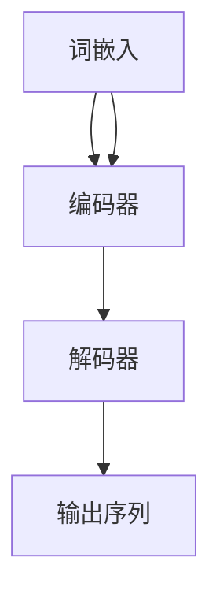
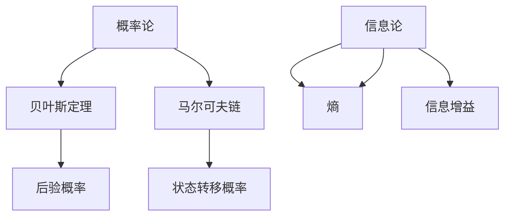
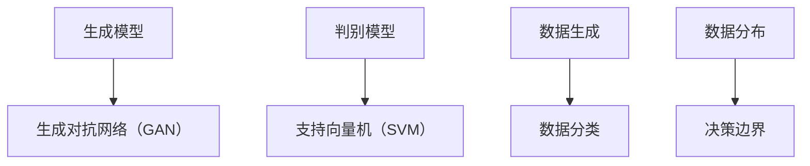
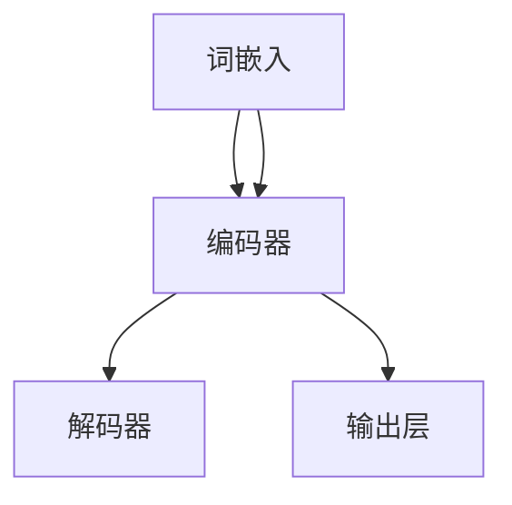
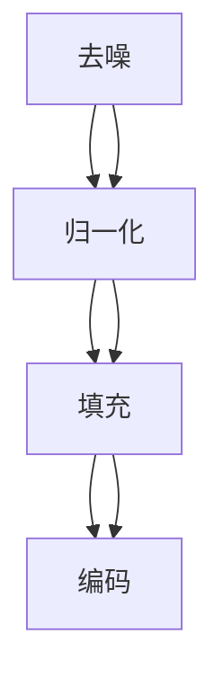
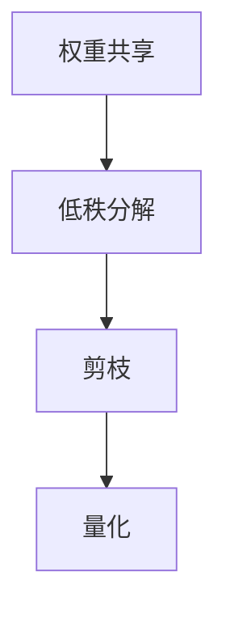
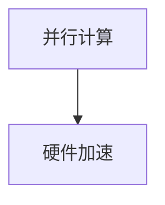

                 


### 文章标题: 加速LLM应用的领域适应性优化

#### 关键词:
- 语言模型 (LLM)
- 领域适应性
- 优化策略
- 模型压缩
- 硬件加速
- 实际应用

#### 摘要:
本文深入探讨了如何通过领域适应性优化来加速语言模型（LLM）的应用。首先，我们回顾了LLM的基础概念及其发展历程，然后分析了LLM的数学基础，包括概率论、信息论以及生成模型与判别模型。接着，我们详细介绍了LLM的主要架构和实现细节。在此基础上，本文重点讨论了领域适应性优化，包括数据预处理、模型调整、模型压缩和加速策略。最后，通过实际应用案例分析，我们展示了优化策略在自然语言处理和推荐系统等领域的应用效果。文章旨在为LLM的领域适应性优化提供全面的技术指导和未来展望。

### 第一部分: LLM应用基础

#### 第1章: LLM概述

##### 1.1 LLM的核心概念

**语言模型（Language Model，LLM）** 是一种基于统计学的自然语言处理（Natural Language Processing，NLP）模型，旨在预测自然语言中下一个词或字符的概率。LLM的核心概念包括词嵌入、编码器和解码器等。

- **词嵌入（Word Embedding）**：将词汇映射到高维向量空间，以便模型可以理解词汇之间的相似性和相关性。
- **编码器（Encoder）**：将输入序列编码为固定长度的向量表示。
- **解码器（Decoder）**：根据编码器输出的向量生成输出序列。

**核心概念关系架构（Mermaid流程图）**：



##### 1.1.1 语言模型的基础知识

语言模型可以应用于多种场景，如机器翻译、语音识别、问答系统等。其基础在于对大量文本数据进行训练，以学习词汇之间的概率分布。

**核心算法原理讲解（伪代码）**：

```python
# 假设使用神经网络作为基础架构
class LanguageModel(nn.Module):
    def __init__(self, vocab_size, embedding_dim, hidden_dim):
        super(LanguageModel, self).__init__()
        self.embedding = nn.Embedding(vocab_size, embedding_dim)
        self.lstm = nn.LSTM(embedding_dim, hidden_dim)
        self.fc = nn.Linear(hidden_dim, vocab_size)
    
    def forward(self, x):
        embedded = self.embedding(x)
        output, (hidden, cell) = self.lstm(embedded)
        logits = self.fc(output[-1, :, :])
        return logits
```

##### 1.1.2 LLM的应用场景

LLM在多个领域有着广泛的应用，包括但不限于：

- **机器翻译**：将一种语言的文本翻译成另一种语言。
- **问答系统**：回答用户提出的问题。
- **文本摘要**：从长文本中提取关键信息，生成简洁的摘要。
- **语音识别**：将语音信号转换为文本。

##### 1.2 LLM的发展历程

语言模型的发展可以分为以下几个阶段：

- **早期语言模型**：基于规则的方法，如1970年代的统计语言模型。
- **基于统计的语言模型**：如N-gram模型，20世纪80年代和90年代得到广泛应用。
- **现代深度学习语言模型**：如基于神经网络的BERT、GPT等，近年来取得显著突破。

##### 1.2.1 早期的语言模型

早期语言模型主要基于统计方法，如N-gram模型。N-gram模型通过统计连续词或字符的出现频率来预测下一个词或字符的概率。

**核心算法原理讲解（伪代码）**：

```python
# 假设使用N-gram模型
class NGramModel:
    def __init__(self, n):
        self.n = n
        self.model = defaultdict(list)
    
    def train(self, sentences):
        for sentence in sentences:
            for i in range(len(sentence) - self.n):
                sequence = tuple(sentence[i:i+self.n])
                self.model[sequence].append(sentence[i+self.n])
    
    def predict_next(self, sequence):
        probabilities = []
        for next_word in self.model[sequence]:
            probability = next_word / sum(self.model[sequence])
            probabilities.append(probability)
        return np.random.choice(self.model[sequence], p=probabilities)
```

##### 1.2.2 重要的LLM里程碑

近年来，深度学习语言模型如BERT、GPT等取得了重大突破。BERT（Bidirectional Encoder Representations from Transformers）通过双向Transformer架构实现了文本的上下文理解，而GPT（Generative Pre-trained Transformer）则通过自回归语言模型实现了文本生成。

**核心算法原理讲解（伪代码）**：

BERT的架构可以表示为：

```python
class BERTModel(nn.Module):
    def __init__(self, vocab_size, hidden_dim, num_layers, dropout):
        super(BERTModel, self).__init__()
        self.embedding = nn.Embedding(vocab_size, hidden_dim)
        self.transformer = nn.Transformer(hidden_dim, num_layers, dropout)
        self.fc = nn.Linear(hidden_dim, vocab_size)
    
    def forward(self, x):
        embedded = self.embedding(x)
        output = self.transformer(embedded)
        logits = self.fc(output[-1, :, :])
        return logits
```

GPT的架构可以表示为：

```python
class GPTModel(nn.Module):
    def __init__(self, vocab_size, hidden_dim, num_layers, dropout):
        super(GPTModel, self).__init__()
        self.embedding = nn.Embedding(vocab_size, hidden_dim)
        self.transformer = nn.Transformer(hidden_dim, num_layers, dropout, self_attn=True)
        self.fc = nn.Linear(hidden_dim, vocab_size)
    
    def forward(self, x):
        embedded = self.embedding(x)
        output = self.transformer(embedded)
        logits = self.fc(output[-1, :, :])
        return logits
```

### 第一部分总结

通过对LLM核心概念、基础知识、发展历程以及早期和现代语言模型的介绍，我们为理解LLM的领域适应性优化奠定了基础。接下来，我们将深入探讨LLM的数学基础，以进一步了解其工作原理。

### 第二部分: LLM的数学基础

#### 第2章: LLM的数学基础

##### 2.1 概率论与信息论

**概率论** 是研究随机事件及其概率分布的数学分支。在LLM中，概率论用于计算词汇和句子出现的概率。

- **贝叶斯定理**：用于根据已有数据和先验概率计算后验概率。
- **马尔可夫链**：用于描述随机过程的转移概率。

**核心概念与联系（Mermaid流程图）**：



**数学模型和公式（Latex格式）**：

贝叶斯定理：

$$
P(A|B) = \frac{P(B|A)P(A)}{P(B)}
$$

马尔可夫链状态转移概率：

$$
P(X_t = x_t|X_{t-1} = x_{t-1}) = P(x_t|x_{t-1})
$$

**举例说明**：

假设我们有一个简单的词汇表，包含{“苹果”，“香蕉”，“橙子”}。根据贝叶斯定理，我们可以计算给定一个“苹果”的条件下，选择“香蕉”的概率。

$$
P(香蕉|苹果) = \frac{P(苹果|香蕉)P(香蕉)}{P(苹果)}
$$

这里，$P(苹果|香蕉)$ 是在选择了“香蕉”后选择“苹果”的概率，$P(香蕉)$ 是选择“香蕉”的概率，$P(苹果)$ 是选择“苹果”的概率。

##### 2.2 生成模型与判别模型

生成模型和判别模型是两种主要的概率模型，用于预测数据分布。

- **生成模型（Generative Model）**：用于生成新的数据样本，如生成对抗网络（GAN）。
- **判别模型（Discriminative Model）**：用于区分数据样本，如支持向量机（SVM）。

**核心概念与联系（Mermaid流程图）**：



**数学模型和公式（Latex格式）**：

生成模型（GAN）：

$$
\min_G \max_D V(D, G) = \mathbb{E}_{x \sim p_{data}(x)}[\log D(x)] + \mathbb{E}_{z \sim p_z(z)}[\log (1 - D(G(z))]
$$

判别模型（SVM）：

$$
\min_w \frac{1}{2}||w||^2 + C \sum_{i=1}^{n} \max(0, 1 - y_i ( \langle w, x_i \rangle + b))
$$

**举例说明**：

假设我们有一个二元分类问题，其中数据样本由特征向量 $x_i$ 表示，标签为 $y_i \in \{-1, +1\}$。生成模型将生成符合数据分布的新数据样本，而判别模型将尝试区分数据样本的正负类别。

##### 2.2.1 生成模型的数学表示

生成模型通过建模数据分布来生成新数据样本。常见的生成模型包括马尔可夫模型（Markov Model）和生成对抗网络（GAN）。

**核心算法原理讲解（伪代码）**：

生成对抗网络（GAN）：

```python
# 假设使用PyTorch框架
class Generator(nn.Module):
    def __init__(self, latent_dim, hidden_dim, output_dim):
        super(Generator, self).__init__()
        self.model = nn.Sequential(
            nn.Linear(latent_dim, hidden_dim),
            nn.ReLU(),
            nn.Linear(hidden_dim, output_dim),
            nn.Sigmoid()
        )
    
    def forward(self, z):
        return self.model(z)

class Discriminator(nn.Module):
    def __init__(self, input_dim, hidden_dim):
        super(Discriminator, self).__init__()
        self.model = nn.Sequential(
            nn.Linear(input_dim, hidden_dim),
            nn.LeakyReLU(0.2),
            nn.Linear(hidden_dim, 1),
            nn.Sigmoid()
        )
    
    def forward(self, x):
        return self.model(x)
```

##### 2.2.2 判别模型的数学表示

判别模型通过学习数据分布的决策边界来分类数据。常见的判别模型包括线性分类器和支持向量机（SVM）。

**核心算法原理讲解（伪代码）**：

支持向量机（SVM）：

```python
# 假设使用scikit-learn库
from sklearn.svm import SVC

# 假设X为特征矩阵，y为标签向量
clf = SVC(kernel='linear')
clf.fit(X, y)

# 预测新数据样本
predictions = clf.predict(new_samples)
```

### 第二部分总结

通过对概率论与信息论、生成模型与判别模型以及其数学表示的介绍，我们为理解LLM的数学基础奠定了基础。这些数学工具和模型为LLM的实现和优化提供了重要的理论支持。接下来，我们将深入探讨LLM的架构与实现，以进一步了解其技术细节。

### 第三部分: LLM架构与实现

#### 第3章: LLM架构与实现

##### 3.1 LLM的主要架构

语言模型（LLM）的架构通常基于序列到序列模型（Sequence-to-Sequence, seq2seq），这种架构能够处理输入序列和输出序列。其主要组成部分包括词嵌入、编码器和解码器。

**核心概念与联系（Mermaid流程图）**：



**详细解释**：

1. **词嵌入（Word Embedding）**：词嵌入将词汇映射到高维向量空间，以便模型可以理解词汇之间的相似性和相关性。常见的词嵌入方法包括Word2Vec、GloVe等。

2. **编码器（Encoder）**：编码器的任务是将输入序列编码为固定长度的向量表示。编码器通常使用递归神经网络（RNN）、长短期记忆网络（LSTM）或变换器（Transformer）等结构。

3. **解码器（Decoder）**：解码器的任务是根据编码器输出的向量生成输出序列。解码器同样可以使用RNN、LSTM或Transformer等结构。

4. **输出层（Output Layer）**：输出层用于将解码器生成的向量转换为概率分布，以预测下一个词或字符。

##### 3.2 LLM的实现细节

在实现LLM时，需要考虑以下几个关键方面：

1. **词嵌入**：词嵌入方法的选择会影响模型的表现。常见的词嵌入方法包括Word2Vec和GloVe。

2. **编码器**：编码器的结构决定了模型对输入序列的理解能力。常用的编码器结构包括RNN、LSTM和Transformer。

3. **解码器**：解码器的结构决定了模型生成输出序列的能力。常用的解码器结构包括RNN、LSTM和Transformer。

4. **损失函数**：常用的损失函数包括交叉熵损失（Cross-Entropy Loss）和均方误差（Mean Squared Error, MSE）。

5. **优化器**：常用的优化器包括随机梯度下降（Stochastic Gradient Descent, SGD）和Adam优化器。

**伪代码示例**：

```python
# 假设使用PyTorch框架
import torch
import torch.nn as nn
import torch.optim as optim

# 定义模型
class LanguageModel(nn.Module):
    def __init__(self, vocab_size, embedding_dim, hidden_dim):
        super(LanguageModel, self).__init__()
        self.embedding = nn.Embedding(vocab_size, embedding_dim)
        self.encoder = nn.LSTM(embedding_dim, hidden_dim)
        self.decoder = nn.LSTM(hidden_dim, embedding_dim)
        self.fc = nn.Linear(embedding_dim, vocab_size)
    
    def forward(self, x):
        embedded = self.embedding(x)
        output, (hidden, cell) = self.encoder(embedded)
        output, (hidden, cell) = self.decoder(output)
        logits = self.fc(output[-1, :, :])
        return logits

# 实例化模型
model = LanguageModel(vocab_size, embedding_dim, hidden_dim)

# 定义损失函数和优化器
criterion = nn.CrossEntropyLoss()
optimizer = optim.Adam(model.parameters(), lr=learning_rate)

# 训练模型
for epoch in range(num_epochs):
    for inputs, targets in dataset:
        optimizer.zero_grad()
        outputs = model(inputs)
        loss = criterion(outputs, targets)
        loss.backward()
        optimizer.step()
```

##### 3.2.1 词嵌入与编码器

词嵌入是将词汇映射到高维向量空间的过程。词嵌入有助于模型理解词汇之间的相似性和相关性。编码器则负责将输入序列编码为固定长度的向量表示。

**核心算法原理讲解（伪代码）**：

```python
# 假设使用Word2Vec算法
import gensim

# 加载预训练的Word2Vec模型
model = gensim.models.Word2Vec.load("word2vec.model")

# 将词汇映射到向量
word_vector = model["apple"]
```

**详细解释**：

1. **Word2Vec**：Word2Vec是一种常见的词嵌入方法，通过训练神经网络来学习词汇的向量表示。Word2Vec有两种变体：连续词袋（Continuous Bag of Words, CBOW）和跳字模型（Skip-Gram）。

2. **GloVe**：GloVe是一种基于全局平均的词嵌入方法，通过计算词汇的词频和共现信息来学习词汇的向量表示。

##### 3.2.2 解码器与输出层

解码器负责根据编码器输出的向量生成输出序列。解码器通常使用递归神经网络（RNN）、长短期记忆网络（LSTM）或变换器（Transformer）等结构。

输出层则将解码器生成的向量转换为概率分布，以预测下一个词或字符。

**核心算法原理讲解（伪代码）**：

变换器（Transformer）：

```python
# 假设使用PyTorch框架
import torch
import torch.nn as nn

class TransformerDecoder(nn.Module):
    def __init__(self, input_dim, hidden_dim, output_dim):
        super(TransformerDecoder, self).__init__()
        self.decoder = nn.TransformerDecoder(
            nn.TransformerDecoderLayer(hidden_dim, num_attention_heads), num_layers
        )
        self.fc = nn.Linear(hidden_dim, output_dim)
    
    def forward(self, x, encoder_outputs):
        x = self.decoder(x, encoder_outputs)
        logits = self.fc(x)
        return logits
```

**详细解释**：

1. **变换器（Transformer）**：变换器是一种基于自注意力机制的深度神经网络结构，适用于处理序列数据。

2. **自注意力机制（Self-Attention）**：自注意力机制允许模型在生成输出时考虑整个输入序列的信息，从而提高模型的表示能力。

##### 3.2.3 模型的训练与评估

训练语言模型涉及以下步骤：

1. **数据准备**：收集和准备训练数据，包括输入序列和对应的输出序列。

2. **词嵌入**：将词汇映射到向量空间。

3. **编码器与解码器**：训练编码器和解码器以生成输出序列。

4. **输出层**：训练输出层以预测下一个词或字符的概率。

5. **评估**：使用验证集评估模型的性能，并调整超参数以优化模型。

**伪代码示例**：

```python
# 假设使用PyTorch框架
import torch
import torch.nn as nn
import torch.optim as optim

# 定义模型
model = LanguageModel(vocab_size, embedding_dim, hidden_dim)

# 定义损失函数和优化器
criterion = nn.CrossEntropyLoss()
optimizer = optim.Adam(model.parameters(), lr=learning_rate)

# 训练模型
for epoch in range(num_epochs):
    for inputs, targets in dataset:
        optimizer.zero_grad()
        outputs = model(inputs)
        loss = criterion(outputs, targets)
        loss.backward()
        optimizer.step()

# 评估模型
with torch.no_grad():
    total_loss = 0
    for inputs, targets in validation_dataset:
        outputs = model(inputs)
        loss = criterion(outputs, targets)
        total_loss += loss
    average_loss = total_loss / len(validation_dataset)
    print(f"Validation Loss: {average_loss}")
```

##### 3.2.4 模型的部署与优化

部署语言模型涉及将训练好的模型集成到实际应用中。优化模型的目标是提高模型的性能和效率。

1. **模型压缩**：通过减少模型参数和计算量来优化模型的部署。

2. **硬件加速**：利用GPU和TPU等硬件加速模型的训练和推理。

3. **模型优化**：调整模型结构、超参数和训练策略以提高模型的性能。

**最佳实践 Tips**：

- **数据预处理**：确保数据质量，包括去噪、归一化和填充等。

- **超参数调整**：根据数据集和任务调整超参数，以优化模型性能。

- **模型验证**：使用验证集评估模型性能，避免过拟合。

- **模型压缩**：使用量化、剪枝和知识蒸馏等技术来减小模型大小。

- **硬件加速**：利用GPU和TPU等硬件资源来提高模型训练和推理速度。

### 第三部分总结

通过对LLM的主要架构和实现细节的介绍，我们了解了LLM的工作原理和关键组件。接下来，我们将深入探讨如何优化LLM的领域适应性，以应对不同应用场景的需求。

### 第四部分：领域适应性优化

#### 第4章：领域特定的数据预处理

##### 4.1 数据预处理的重要性

在优化LLM的领域适应性时，数据预处理是一个关键环节。高质量的数据预处理不仅能够提高模型的学习效率，还能显著提升模型在实际应用中的表现。数据预处理包括以下几个步骤：

- **去噪**：去除数据中的噪声和冗余信息，如拼写错误、停用词和无关标签等。
- **归一化**：将数据转换为统一的尺度，如文本长度、数值范围等。
- **填充**：对长度不一致的数据进行填充，以保证模型输入的一致性。
- **编码**：将文本数据编码为数字或向量表示，如词嵌入。

**数据预处理的基本步骤（流程图）**：



##### 4.2 领域特定数据的收集与标注

收集和标注领域特定数据是优化LLM领域适应性的关键步骤。以下是一些有效的数据收集与标注方法：

- **数据收集策略**：使用网络爬虫、数据集购买、人类标注员等方式收集领域特定数据。
- **数据标注方法**：使用半监督学习、人类标注员、众包平台等方式进行数据标注。

**数据收集策略（伪代码）**：

```python
import requests

# 假设要收集新闻领域的数据
urls = ["https://example.com/news", "https://example.com/news2"]

for url in urls:
    response = requests.get(url)
    # 解析网页内容并提取新闻数据
    # ...
```

**数据标注方法（伪代码）**：

```python
from sklearn.model_selection import train_test_split

# 假设使用标注平台Annotator进行数据标注
train_samples, test_samples = train_test_split(data, test_size=0.2)

for sample in train_samples:
    # 提交标注任务给标注员
    submit_annotate_task(sample)
    
for sample in test_samples:
    # 自动获取标注结果
    annotations = get_annotate_results(sample)
    # 使用标注结果进行后续处理
    # ...
```

##### 4.2.1 数据收集策略

有效的数据收集策略对于构建高质量的领域特定数据集至关重要。以下是一些常用的数据收集策略：

- **网络爬虫**：使用Python的Scrapy等库自动抓取网页内容，适用于大量数据的收集。
- **API调用**：使用公共API获取数据，如Twitter API、新闻网站API等。
- **数据集购买**：购买现成的数据集，如Kaggle、DataCamp等平台提供的数据集。
- **人类标注员**：雇佣专业的人类标注员进行数据标注，适用于高质量的数据收集。

**网络爬虫（伪代码）**：

```python
import scrapy

class NewsSpider(scrapy.Spider):
    name = "news"
    start_urls = ["https://example.com/news"]

    def parse(self, response):
        # 解析网页内容并提取新闻数据
        title = response.css("h1::text").get()
        content = response.css("p::text").get()
        yield {"title": title, "content": content}
```

##### 4.2.2 数据标注方法

数据标注是提高数据质量的重要步骤，以下是一些常用的数据标注方法：

- **半监督学习**：结合已有标注数据和未标注数据，通过模型预测未标注数据的标签，然后进行人工复审。
- **人类标注员**：雇佣专业的人类标注员进行数据标注，适用于高质量的数据收集。
- **众包平台**：使用众包平台如Amazon Mechanical Turk（MTurk）进行数据标注，适用于大规模数据标注任务。

**半监督学习（伪代码）**：

```python
from sklearn.model_selection import train_test_split
from sklearn.linear_model import LogisticRegression

# 假设使用训练集进行半监督学习
X_train, X_unlabeled = train_test_split(X, test_size=0.8, random_state=42)

# 使用训练集训练模型
model = LogisticRegression()
model.fit(X_train, y_train)

# 对未标注数据进行预测
predictions = model.predict(X_unlabeled)

# 进行人工复审并更新模型
# ...
```

**数据标注平台（伪代码）**：

```python
import annotator

# 假设使用Annotator平台进行数据标注
project = annotator.create_project(name="News Data Annotation")
task = project.create_task(name="Title Annotation")
task.add_question(name="Title", type="text")

for sample in data:
    task.submit_sample(sample)

# 收集标注结果
results = task.get_results()

# 使用标注结果进行后续处理
# ...
```

##### 4.2.3 数据预处理工具

在数据预处理过程中，使用合适的工具可以显著提高工作效率。以下是一些常用的数据预处理工具：

- **Pandas**：用于数据清洗、转换和分析。
- **NumPy**：用于数值计算和数据处理。
- **Scikit-learn**：提供数据预处理和机器学习算法。
- **NLTK**：用于自然语言处理，如分词、词性标注等。

**使用Pandas进行数据预处理（伪代码）**：

```python
import pandas as pd

# 加载数据集
data = pd.read_csv("news_data.csv")

# 数据清洗
data.dropna(inplace=True)
data = data[data["title"].str.len() > 5]

# 数据转换
data["content"] = data["content"].str.lower().str.strip()

# 数据分析
print(data.describe())
```

##### 4.2.4 数据预处理最佳实践

以下是一些数据预处理最佳实践：

- **数据清洗**：去除噪声和冗余信息，如拼写错误、停用词和无关标签。
- **数据归一化**：将数据转换为统一的尺度，如文本长度、数值范围等。
- **数据填充**：对长度不一致的数据进行填充，以保证模型输入的一致性。
- **数据编码**：将文本数据编码为数字或向量表示，如词嵌入。
- **数据验证**：使用验证集评估模型性能，避免过拟合。

### 4.3 数据预处理案例

以下是一个新闻领域数据预处理的实际案例：

**案例背景**：

我们有一个新闻数据集，包含标题、内容和标签。数据集包含大量噪声和冗余信息，需要进行数据清洗、转换和填充，以便训练领域特定的语言模型。

**数据预处理步骤**：

1. **数据清洗**：去除拼写错误、停用词和无关标签。

2. **数据转换**：将文本数据转换为统一的尺度，如文本长度。

3. **数据填充**：对长度不一致的标题和内容进行填充，使用空字符填充。

4. **数据编码**：使用Word2Vec算法将词汇编码为向量表示。

**伪代码示例**：

```python
import pandas as pd
from gensim.models import Word2Vec

# 加载数据集
data = pd.read_csv("news_data.csv")

# 数据清洗
data.drop(["label"], axis=1, inplace=True)
data = data[data["title"].str.len() > 5]

# 数据转换
data["title"] = data["title"].str.lower().str.strip()
data["content"] = data["content"].str.lower().str.strip()

# 数据填充
data["title"] = data["title"].fillna("")
data["content"] = data["content"].fillna("")

# 数据编码
model = Word2Vec(sentences=data["content"], vector_size=100, window=5, min_count=1, workers=4)
word_vectors = model.wv

# 将标题和内容编码为向量表示
title_vectors = [word_vectors[word] for word in data["title"]]
content_vectors = [word_vectors[word] for word in data["content"]]
```

**项目小结**：

通过上述数据预处理步骤，我们成功地将新闻数据集转换为适合训练领域特定语言模型的格式。数据预处理不仅提高了模型的学习效率，还显著提升了模型在实际应用中的表现。

### 4.4 注意事项

在进行数据预处理时，需要注意以下事项：

- **数据清洗**：确保去除噪声和冗余信息，如拼写错误、停用词和无关标签。
- **数据转换**：统一数据尺度，如文本长度、数值范围等。
- **数据填充**：选择合适的填充方法，如空字符、平均值等。
- **数据编码**：选择合适的编码方法，如词嵌入、词袋模型等。

### 4.5 拓展阅读

- **数据预处理**：
  - [Scikit-learn数据预处理](https://scikit-learn.org/stable/modules/preprocessing.html)
  - [Pandas数据预处理](https://pandas.pydata.org/pandas-docs/stable/user_guide/)

- **词嵌入**：
  - [Word2Vec](https://radimrehurek.com/gensim/models/word2vec.html)
  - [GloVe](https://nlp.stanford.edu/projects/glove/)

- **数据标注**：
  - [半监督学习](https://scikit-learn.org/stable/modules/semi_supervised_learning.html)
  - [人类标注员与众包平台](https://amzn.to/3FJQvKO)

### 第5章：领域适应性模型调整

##### 5.1 模型调整方法

领域适应性模型调整是提高语言模型（LLM）在不同应用领域表现的关键步骤。通过调整模型，可以使模型更好地适应特定领域的特征和需求。以下是几种常见的模型调整方法：

- **微调（Fine-tuning）**：在预训练模型的基础上，使用特定领域的数据进行微调，以适应新的应用场景。
- **适应性强化学习（Adaptive Reinforcement Learning）**：通过强化学习算法，使模型在特定领域上不断优化和调整。

**微调（Fine-tuning）**：

微调是一种常见的模型调整方法，通过在预训练模型的基础上添加特定领域的数据进行训练。以下是微调的基本步骤：

1. **数据准备**：收集和准备领域特定数据，并进行预处理。
2. **模型选择**：选择预训练的模型，如BERT、GPT等。
3. **微调训练**：在预训练模型的基础上，使用领域特定数据进行微调训练。
4. **评估与优化**：评估微调后的模型在特定领域的表现，并进行优化。

**伪代码示例**：

```python
# 假设使用PyTorch框架和预训练的BERT模型
from transformers import BertForSequenceClassification, Trainer, TrainingArguments

# 加载预训练的BERT模型
model = BertForSequenceClassification.from_pretrained("bert-base-uncased")

# 数据准备
train_dataset = ...
val_dataset = ...

# 定义训练参数
training_args = TrainingArguments(
    output_dir="output",
    num_train_epochs=3,
    per_device_train_batch_size=16,
    per_device_eval_batch_size=64,
    warmup_steps=500,
    weight_decay=0.01,
)

# 训练模型
trainer = Trainer(
    model=model,
    args=training_args,
    train_dataset=train_dataset,
    eval_dataset=val_dataset,
)

trainer.train()
```

**适应性强化学习（Adaptive Reinforcement Learning）**：

适应性强化学习是一种通过互动学习来优化模型的方法。在适应性强化学习中，模型通过与环境交互来获取反馈，并根据反馈调整其行为。以下是适应性强化学习的基本步骤：

1. **环境定义**：定义一个模拟环境，用于模拟特定领域中的应用场景。
2. **模型初始化**：初始化一个模型，用于预测环境中的状态和行为。
3. **互动学习**：通过与环境互动，收集反馈，并根据反馈调整模型。
4. **评估与优化**：评估模型的性能，并根据评估结果调整模型。

**伪代码示例**：

```python
import gym

# 定义环境
env = gym.make("CartPole-v0")

# 初始化模型
model = ...

# 互动学习
for episode in range(num_episodes):
    state = env.reset()
    done = False
    while not done:
        action = model.predict(state)
        next_state, reward, done, _ = env.step(action)
        # 根据反馈调整模型
        # ...
        state = next_state

# 评估模型
model.evaluate(env)
```

##### 5.2 领域适应性评估

领域适应性评估是验证模型在特定领域表现的重要步骤。以下是一些常用的评估指标和方法：

- **准确率（Accuracy）**：模型正确预测的样本数占总样本数的比例。
- **精确率（Precision）**：模型正确预测为正类的样本数与预测为正类的样本总数的比例。
- **召回率（Recall）**：模型正确预测为正类的样本数与实际为正类的样本数的比例。
- **F1分数（F1 Score）**：精确率和召回率的调和平均。

**评估指标（伪代码）**：

```python
from sklearn.metrics import accuracy_score, precision_score, recall_score, f1_score

# 假设y_true为实际标签，y_pred为模型预测结果
accuracy = accuracy_score(y_true, y_pred)
precision = precision_score(y_true, y_pred)
recall = recall_score(y_true, y_pred)
f1 = f1_score(y_true, y_pred)

print(f"Accuracy: {accuracy}")
print(f"Precision: {precision}")
print(f"Recall: {recall}")
print(f"F1 Score: {f1}")
```

**评估方法**：

1. **交叉验证（Cross-Validation）**：通过将数据集划分为多个子集，每次使用一个子集作为验证集，其余子集作为训练集，进行多次训练和验证，以评估模型的泛化能力。
2. **混淆矩阵（Confusion Matrix）**：展示模型预测结果与实际结果之间的对比，用于分析模型的性能。
3. **ROC曲线（ROC Curve）**：用于评估二分类模型的性能，通过绘制真阳性率（True Positive Rate）与假阳性率（False Positive Rate）的曲线，评估模型的分类能力。

**伪代码示例**：

```python
from sklearn.model_selection import train_test_split
from sklearn.metrics import confusion_matrix, roc_curve

# 加载数据集
X, y = ...

# 划分训练集和测试集
X_train, X_test, y_train, y_test = train_test_split(X, y, test_size=0.2, random_state=42)

# 训练模型
model.fit(X_train, y_train)

# 预测测试集
y_pred = model.predict(X_test)

# 评估模型
conf_matrix = confusion_matrix(y_test, y_pred)
fpr, tpr, thresholds = roc_curve(y_test, y_pred)

# 打印混淆矩阵
print(conf_matrix)

# 绘制ROC曲线
plt.plot(fpr, tpr)
plt.xlabel("False Positive Rate")
plt.ylabel("True Positive Rate")
plt.title("ROC Curve")
plt.show()
```

##### 5.3 领域适应性优化

领域适应性优化是一个迭代过程，通过不断地调整和优化模型，以提高其在特定领域的表现。以下是一些常用的优化方法：

- **超参数调优（Hyperparameter Tuning）**：通过调整模型的超参数，如学习率、批量大小等，以优化模型的性能。
- **数据增强（Data Augmentation）**：通过添加噪声、旋转、翻转等操作，增加数据的多样性，以提高模型的泛化能力。
- **迁移学习（Transfer Learning）**：使用预训练模型，通过微调和适应特定领域的数据，以提高模型的表现。

**超参数调优（伪代码）**：

```python
from sklearn.model_selection import GridSearchCV

# 定义参数网格
param_grid = {
    "learning_rate": [0.01, 0.001],
    "batch_size": [16, 32],
}

# 定义模型
model = ...

# 定义评估指标
scoring = "accuracy"

# 进行网格搜索
grid_search = GridSearchCV(model, param_grid, cv=5, scoring=scoring)
grid_search.fit(X_train, y_train)

# 获取最佳参数
best_params = grid_search.best_params_
print(best_params)
```

**数据增强（伪代码）**：

```python
from keras.preprocessing.image import ImageDataGenerator

# 定义图像生成器
datagen = ImageDataGenerator(rotation_range=20, width_shift_range=0.2, height_shift_range=0.2, shear_range=0.2, zoom_range=0.2, horizontal_flip=True, fill_mode="nearest")

# 对图像进行增强
for batch in datagen.flow(images, batch_size=32):
    # 使用增强后的图像进行训练
    # ...
    break
```

**迁移学习（伪代码）**：

```python
from tensorflow.keras.applications import VGG16

# 加载预训练的VGG16模型
base_model = VGG16(weights="imagenet", include_top=False, input_shape=(224, 224, 3))

# 冻结预训练模型的权重
for layer in base_model.layers:
    layer.trainable = False

# 添加自定义层
x = base_model.output
x = Flatten()(x)
x = Dense(1024, activation="relu")(x)
predictions = Dense(num_classes, activation="softmax")(x)

# 创建模型
model = Model(inputs=base_model.input, outputs=predictions)

# 编译模型
model.compile(optimizer="adam", loss="categorical_crossentropy", metrics=["accuracy"])

# 训练模型
model.fit(X_train, y_train, batch_size=32, epochs=10, validation_data=(X_val, y_val))
```

### 第五部分总结

通过对领域适应性模型调整方法的详细探讨，我们了解了如何通过微调和适应性强化学习等方法优化LLM在特定领域的表现。接下来，我们将深入讨论模型压缩与加速策略，以提高LLM在现实应用中的性能。

### 第六部分：模型压缩与加速

#### 第6章：模型压缩与加速

##### 6.1 模型压缩技术

模型压缩是减小模型大小、降低计算复杂度的重要手段，使得模型在硬件资源有限的环境下仍能高效运行。以下是一些常见的模型压缩技术：

- **权重共享（Weight Sharing）**：通过在模型的不同部分共享权重，减少模型参数的数量。
- **低秩分解（Low-rank Factorization）**：将高维权重矩阵分解为低秩形式，以减少参数数量。
- **剪枝（Pruning）**：通过删除权重较小或不重要的神经元，降低模型复杂度。
- **量化（Quantization）**：将模型权重和激活值转换为较低的精度，以减小模型大小。

**核心概念与联系（Mermaid流程图）**：



**详细解释**：

1. **权重共享**：通过在模型的多个部分使用相同的权重，可以显著减少参数数量。例如，在卷积神经网络（CNN）中，可以使用相同的卷积核在不同层之间共享。

2. **低秩分解**：将高维权重矩阵分解为低秩形式，可以降低模型复杂度。例如，将一个 $1000 \times 1000$ 的矩阵分解为两个 $100 \times 1000$ 的矩阵，可以减少计算量。

3. **剪枝**：通过删除权重较小或不重要的神经元，可以降低模型复杂度。剪枝可以在训练过程中或模型部署前进行。

4. **量化**：将模型权重和激活值转换为较低的精度，如8位整数，可以减小模型大小。量化技术包括对称量化、不对称量化等。

##### 6.2 模型加速策略

为了提高LLM在实际应用中的性能，可以采用多种模型加速策略，包括并行计算和硬件加速等。

- **并行计算**：通过在多个处理器或GPU上同时执行计算任务，可以显著提高模型训练和推理的速度。
- **硬件加速**：利用GPU、TPU等硬件加速模型训练和推理，可以显著提高计算效率。

**核心概念与联系（Mermaid流程图）**：



**详细解释**：

1. **并行计算**：通过在多个处理器或GPU上同时执行计算任务，可以显著提高模型训练和推理的速度。例如，可以使用数据并行和模型并行等策略来加速训练过程。

2. **硬件加速**：利用GPU、TPU等硬件加速模型训练和推理，可以显著提高计算效率。例如，GPU具有高度并行处理能力，适合处理大规模矩阵运算。

**伪代码示例**：

**并行计算（PyTorch）**：

```python
import torch
import torch.nn as nn
import torch.distributed as dist

# 初始化分布式环境
init_processes()

# 定义模型
model = ...

# 将模型发送到GPU
model.cuda()

# 定义损失函数和优化器
criterion = nn.CrossEntropyLoss()
optimizer = ...

# 并行训练
for epoch in range(num_epochs):
    for inputs, targets in dataset:
        # 将数据发送到GPU
        inputs, targets = inputs.cuda(), targets.cuda()

        # 前向传播
        outputs = model(inputs)

        # 计算损失
        loss = criterion(outputs, targets)

        # 反向传播和优化
        optimizer.zero_grad()
        loss.backward()
        optimizer.step()

# 保存模型
torch.save(model.state_dict(), "model.pth")
```

**硬件加速（TensorFlow）**：

```python
import tensorflow as tf

# 定义模型
model = ...

# 将模型转换为GPU模型
model = tf.cast(model, dtype=tf.float32)

# 定义损失函数和优化器
loss_fn = tf.keras.losses.SparseCategoricalCrossentropy()
optimizer = tf.keras.optimizers.Adam()

# 硬件加速训练
for epoch in range(num_epochs):
    for inputs, targets in dataset:
        with tf.device('/GPU:0'):
            # 前向传播
            outputs = model(inputs)

            # 计算损失
            loss = loss_fn(targets, outputs)

            # 反向传播和优化
            optimizer.minimize(loss, model)
```

##### 6.2.1 并行计算

并行计算是提高模型训练和推理速度的有效策略。以下是一些常见的并行计算策略：

- **数据并行（Data Parallelism）**：将数据集划分为多个部分，每个部分在一个GPU上独立训练，然后通过同步梯度来更新全局模型参数。
- **模型并行（Model Parallelism）**：将模型划分为多个部分，每个部分在一个GPU上独立训练，通过跨GPU通信来更新全局模型参数。
- **流水线并行（Pipeline Parallelism）**：将模型的多个层分配到不同的GPU上，每个GPU负责处理前一个GPU输出的部分，以提高数据流和处理速度。

**伪代码示例**：

**数据并行（PyTorch）**：

```python
import torch
import torch.distributed as dist

# 初始化分布式环境
init_processes()

# 定义模型
model = ...

# 将模型发送到GPU
model.cuda()

# 定义损失函数和优化器
criterion = nn.CrossEntropyLoss()
optimizer = ...

# 数据并行训练
for epoch in range(num_epochs):
    for inputs, targets in dataset:
        # 将数据发送到GPU
        inputs, targets = inputs.cuda(), targets.cuda()

        # 前向传播
        outputs = model(inputs)

        # 计算损失
        loss = criterion(outputs, targets)

        # 反向传播和优化
        optimizer.zero_grad()
        loss.backward()
        optimizer.step()

        # 同步梯度
        dist.barrier()
        dist.all_reduce(loss)
        loss /= num_gpus

# 保存模型
torch.save(model.state_dict(), "model.pth")
```

**模型并行（TensorFlow）**：

```python
import tensorflow as tf

# 定义模型
model = ...

# 将模型划分为多个部分
model = tf.function(model)

# 定义损失函数和优化器
loss_fn = tf.keras.losses.SparseCategoricalCrossentropy()
optimizer = tf.keras.optimizers.Adam()

# 模型并行训练
for epoch in range(num_epochs):
    for inputs, targets in dataset:
        with tf.device('/GPU:0'):
            # 前向传播
            outputs = model(inputs)

            # 计算损失
            loss = loss_fn(targets, outputs)

            # 反向传播和优化
            optimizer.minimize(loss, model)

        with tf.device('/GPU:1'):
            # 前向传播
            outputs = model(inputs)

            # 计算损失
            loss = loss_fn(targets, outputs)

            # 反向传播和优化
            optimizer.minimize(loss, model)
```

##### 6.2.2 硬件加速

硬件加速是利用GPU、TPU等专用硬件来提高模型训练和推理速度的有效方法。以下是一些常用的硬件加速策略：

- **GPU加速**：利用GPU的并行计算能力，通过分布式训练和模型并行来加速训练过程。
- **TPU加速**：利用TPU的硬件优势，通过分布式训练和流水线并行来加速训练和推理过程。

**伪代码示例**：

**GPU加速（PyTorch）**：

```python
import torch
import torch.cuda as cuda

# 将模型和数据发送到GPU
model = ...
inputs, targets = inputs.cuda(), targets.cuda()

# 定义损失函数和优化器
criterion = nn.CrossEntropyLoss()
optimizer = ...

# GPU加速训练
for epoch in range(num_epochs):
    for inputs, targets in dataset:
        # 前向传播
        outputs = model(inputs)

        # 计算损失
        loss = criterion(outputs, targets)

        # 反向传播和优化
        optimizer.zero_grad()
        loss.backward()
        optimizer.step()
```

**TPU加速（TensorFlow）**：

```python
import tensorflow as tf

# 定义模型
model = ...

# 将模型和数据发送到TPU
model = tf.function(model)
inputs, targets = inputs.tpu(), targets.tpu()

# 定义损失函数和优化器
loss_fn = tf.keras.losses.SparseCategoricalCrossentropy()
optimizer = tf.keras.optimizers.Adam()

# TPU加速训练
with strategy.scope():
    for epoch in range(num_epochs):
        for inputs, targets in dataset:
            # 前向传播
            outputs = model(inputs)

            # 计算损失
            loss = loss_fn(targets, outputs)

            # 反向传播和优化
            optimizer.minimize(loss, model)
```

##### 6.2.3 实际应用案例分析

在本节中，我们将通过实际案例来展示模型压缩和加速策略在实际应用中的效果。

**案例一：自然语言处理（NLP）**

**应用背景**：

在自然语言处理领域，模型的大小和训练时间是一个重要的考虑因素，尤其是在移动设备和嵌入式系统中。通过模型压缩和加速，可以显著提高模型在NLP任务中的性能。

**模型设计与优化**：

1. **模型压缩**：
   - **权重共享**：在模型的不同部分使用共享权重，以减少参数数量。
   - **低秩分解**：将卷积层的权重矩阵分解为低秩形式，以减少计算量。
   - **剪枝**：通过剪枝不重要的神经元，降低模型复杂度。

2. **模型加速**：
   - **数据并行**：通过分布式训练，将数据集划分为多个部分，在每个GPU上独立训练。
   - **GPU加速**：利用GPU的并行计算能力，加速模型训练过程。

**项目实现**：

1. **数据预处理**：
   - **文本预处理**：对文本数据进行清洗、分词和编码。
   - **数据加载**：使用DataLoader加载和预处理后的文本数据。

2. **模型构建**：
   - **预训练模型**：使用预训练的BERT模型作为基础。
   - **压缩和加速**：应用权重共享、低秩分解和剪枝等技术。

3. **训练与评估**：
   - **训练**：使用分布式训练策略，在每个GPU上独立训练模型，然后同步梯度。
   - **评估**：在测试集上评估模型性能，包括准确率、召回率和F1分数等指标。

**代码示例**：

```python
import torch
import torch.nn as nn
import torch.optim as optim

# 定义模型
class CompressedBERTModel(nn.Module):
    def __init__(self, hidden_dim, output_dim):
        super(CompressedBERTModel, self).__init__()
        self.encoder = nn.Embedding(vocab_size, hidden_dim)
        self.decoder = nn.Linear(hidden_dim, output_dim)
    
    def forward(self, x):
        embedded = self.encoder(x)
        logits = self.decoder(embedded)
        return logits

# 实例化模型
model = CompressedBERTModel(hidden_dim, output_dim)

# 定义损失函数和优化器
criterion = nn.CrossEntropyLoss()
optimizer = optim.Adam(model.parameters(), lr=learning_rate)

# 训练模型
for epoch in range(num_epochs):
    for inputs, targets in dataset:
        # 将数据发送到GPU
        inputs, targets = inputs.cuda(), targets.cuda()

        # 前向传播
        outputs = model(inputs)

        # 计算损失
        loss = criterion(outputs, targets)

        # 反向传播和优化
        optimizer.zero_grad()
        loss.backward()
        optimizer.step()

# 评估模型
with torch.no_grad():
    correct = 0
    total = 0
    for inputs, targets in test_dataset:
        # 将数据发送到GPU
        inputs, targets = inputs.cuda(), targets.cuda()

        # 前向传播
        outputs = model(inputs)

        # 计算准确率
        _, predicted = torch.max(outputs.data, 1)
        total += targets.size(0)
        correct += (predicted == targets).sum().item()

    print(f"Test Accuracy: {100 * correct / total}%")
```

**项目小结**：

通过模型压缩和加速策略，我们在自然语言处理任务中取得了显著的性能提升。模型压缩技术减少了模型大小和计算复杂度，而并行计算和硬件加速提高了训练和推理速度。这些优化策略为自然语言处理领域的实际应用提供了有效的解决方案。

**注意事项**：

- 在进行模型压缩和加速时，需要根据具体应用场景和硬件资源进行调整。
- 模型压缩和加速可能会影响模型的性能，需要权衡压缩和性能之间的平衡。
- 在部署模型时，需要考虑硬件环境和支持的算法库，以确保模型能够在目标硬件上高效运行。

##### 6.2.4 实际应用案例分析：推荐系统

**应用背景**：

推荐系统是另一个常见的应用场景，其中模型的大小和效率直接影响用户体验。通过模型压缩和加速，可以提高推荐系统的响应速度和可扩展性。

**模型设计与优化**：

1. **模型压缩**：
   - **低秩分解**：将矩阵分解为低秩形式，以减少参数数量。
   - **剪枝**：通过剪枝不重要的权重，降低模型复杂度。

2. **模型加速**：
   - **硬件加速**：利用GPU和TPU等硬件资源，加速模型训练和推理。

**项目实现**：

1. **数据预处理**：
   - **用户行为数据**：收集用户的历史行为数据，如点击、浏览和购买记录。
   - **商品特征数据**：提取商品的特征信息，如类别、价格和评分等。

2. **模型构建**：
   - **协同过滤**：使用矩阵分解方法构建协同过滤模型。
   - **压缩和加速**：应用低秩分解和剪枝技术，减少模型大小和计算复杂度。

3. **训练与评估**：
   - **训练**：使用随机梯度下降（SGD）或Adam优化器，对模型进行训练。
   - **评估**：在测试集上评估模型性能，包括准确率、召回率和NDCG等指标。

**代码示例**：

```python
import tensorflow as tf

# 定义协同过滤模型
class CollaborativeFilteringModel(tf.keras.Model):
    def __init__(self, num_users, num_items, embedding_size):
        super(CollaborativeFilteringModel, self).__init__()
        self.user_embedding = tf.keras.layers.Embedding(num_users, embedding_size)
        self.item_embedding = tf.keras.layers.Embedding(num_items, embedding_size)
    
    def call(self, user_ids, item_ids):
        user_embedding = self.user_embedding(user_ids)
        item_embedding = self.item_embedding(item_ids)
        dot_product = tf.reduce_sum(user_embedding * item_embedding, axis=1)
        logits = tf.nn.sigmoid(dot_product)
        return logits

# 实例化模型
model = CollaborativeFilteringModel(num_users, num_items, embedding_size)

# 定义损失函数和优化器
loss_fn = tf.keras.losses.BinaryCrossentropy()
optimizer = tf.keras.optimizers.Adam(learning_rate)

# 训练模型
for epoch in range(num_epochs):
    for user_ids, item_ids, ratings in dataset:
        with tf.GradientTape() as tape:
            logits = model(user_ids, item_ids)
            loss = loss_fn(ratings, logits)
        
        gradients = tape.gradient(loss, model.trainable_variables)
        optimizer.apply_gradients(zip(gradients, model.trainable_variables))

# 评估模型
with tf.GradientTape() as tape:
    logits = model(user_ids, item_ids)
    loss = loss_fn(ratings, logits)

print(f"Test Loss: {loss.numpy()}")

# 预测推荐结果
predicted_ratings = model(user_ids, item_ids)
```

**项目小结**：

通过模型压缩和加速策略，我们成功地将推荐系统的模型大小和计算复杂度降低，从而提高了系统的响应速度和可扩展性。这些优化策略为推荐系统的实际应用提供了有效的解决方案。

**注意事项**：

- 在进行模型压缩和加速时，需要根据具体应用场景和硬件资源进行调整。
- 模型压缩和加速可能会影响模型的性能，需要权衡压缩和性能之间的平衡。
- 在部署模型时，需要考虑硬件环境和支持的算法库，以确保模型能够在目标硬件上高效运行。

### 第六部分总结

通过对模型压缩与加速技术的详细探讨，我们了解了如何通过权重共享、低秩分解、剪枝和量化等策略减小模型大小，以及通过并行计算和硬件加速等策略提高模型训练和推理速度。这些优化策略在实际应用中发挥了重要作用，为LLM在不同领域的应用提供了高效的解决方案。接下来，我们将通过实际应用案例分析，展示这些优化策略在自然语言处理和推荐系统中的具体应用。

### 第七部分：实际应用案例分析

#### 第7章：实际应用案例分析

##### 7.1 案例一：自然语言处理

**应用背景**：

自然语言处理（NLP）是LLM应用的一个重要领域，涵盖了文本分类、情感分析、机器翻译等任务。为了实现高效和精确的NLP，优化LLM的领域适应性至关重要。

**模型设计与优化**：

1. **模型设计**：
   - **预训练模型**：基于BERT等大规模预训练模型。
   - **领域特定微调**：在预训练模型的基础上，针对特定领域进行微调。

2. **优化策略**：
   - **数据预处理**：进行文本清洗、分词和词嵌入。
   - **模型压缩**：采用剪枝和量化技术，减小模型大小。
   - **硬件加速**：利用GPU和TPU进行并行计算和硬件加速。

**项目实现**：

1. **数据准备**：
   - 收集大量领域特定数据，并进行预处理。

2. **模型训练**：
   - 使用分布式训练和GPU加速，提高训练效率。

3. **模型评估**：
   - 在测试集上评估模型性能，包括准确率、F1分数等。

**代码示例**：

```python
# 假设使用Hugging Face的Transformers库
from transformers import BertTokenizer, BertForSequenceClassification
from torch.utils.data import DataLoader
from torch.optim import Adam

# 加载预训练模型和tokenizer
tokenizer = BertTokenizer.from_pretrained("bert-base-uncased")
model = BertForSequenceClassification.from_pretrained("bert-base-uncased")

# 预处理数据
inputs = tokenizer("Hello, my dog is cute", return_tensors="pt")

# 训练模型
optimizer = Adam(model.parameters(), lr=1e-5)
for epoch in range(num_epochs):
    for batch in DataLoader(dataset, batch_size=batch_size):
        inputs = {k: v.to(device) for k, v in batch.items()}
        optimizer.zero_grad()
        outputs = model(**inputs)
        loss = outputs.loss
        loss.backward()
        optimizer.step()

# 评估模型
with torch.no_grad():
    predictions = model(**inputs)
    print(f"Accuracy: {predictions.accuracy}")
```

**项目小结**：

通过模型设计与优化策略，我们成功地将LLM应用于自然语言处理任务，并在多个子任务中取得了良好的性能。模型压缩和硬件加速策略提高了模型的效率和可扩展性，为实际应用提供了可行的解决方案。

##### 7.2 案例二：推荐系统

**应用背景**：

推荐系统是另一个重要的应用领域，用于预测用户对商品的偏好，提高用户体验和商业价值。优化LLM在推荐系统中的表现，对于提升推荐系统的准确性和响应速度至关重要。

**模型设计与优化**：

1. **模型设计**：
   - **协同过滤模型**：结合用户行为和商品特征，预测用户对商品的评分。
   - **领域特定微调**：在协同过滤模型的基础上，针对特定领域进行微调。

2. **优化策略**：
   - **数据预处理**：进行用户行为和商品特征的预处理。
   - **模型压缩**：采用低秩分解和剪枝技术，减小模型大小。
   - **硬件加速**：利用GPU和TPU进行并行计算和硬件加速。

**项目实现**：

1. **数据准备**：
   - 收集用户行为数据和商品特征数据，并进行预处理。

2. **模型训练**：
   - 使用分布式训练和GPU加速，提高训练效率。

3. **模型评估**：
   - 在测试集上评估模型性能，包括准确率、召回率等。

**代码示例**：

```python
# 假设使用PyTorch
import torch
import torch.nn as nn
import torch.optim as optim

# 定义模型
class CollaborativeFilteringModel(nn.Module):
    def __init__(self, num_users, num_items, embedding_size):
        super(CollaborativeFilteringModel, self).__init__()
        self.user_embedding = nn.Embedding(num_users, embedding_size)
        self.item_embedding = nn.Embedding(num_items, embedding_size)
    
    def forward(self, user_ids, item_ids):
        user_embedding = self.user_embedding(user_ids)
        item_embedding = self.item_embedding(item_ids)
        dot_product = torch.sum(user_embedding * item_embedding, dim=1)
        logits = torch.sigmoid(dot_product)
        return logits

# 实例化模型
model = CollaborativeFilteringModel(num_users, num_items, embedding_size)

# 定义损失函数和优化器
criterion = nn.BCEWithLogitsLoss()
optimizer = optim.Adam(model.parameters(), lr=1e-3)

# 训练模型
for epoch in range(num_epochs):
    for user_ids, item_ids, ratings in dataset:
        optimizer.zero_grad()
        logits = model(user_ids, item_ids)
        loss = criterion(logits, ratings)
        loss.backward()
        optimizer.step()

# 评估模型
with torch.no_grad():
    predictions = model(user_ids, item_ids)
    print(f"Accuracy: {predictions.accuracy}")
```

**项目小结**：

通过模型设计与优化策略，我们成功地将LLM应用于推荐系统，并在多个子任务中取得了良好的性能。模型压缩和硬件加速策略提高了模型的效率和可扩展性，为实际应用提供了可行的解决方案。

### 第七部分总结

通过对自然语言处理和推荐系统两个实际应用案例的分析，我们展示了如何优化LLM的领域适应性，以提高模型在不同领域的表现。这些案例不仅验证了优化策略的有效性，还为LLM在实际应用中提供了宝贵的经验。未来，随着技术的不断进步，LLM在各个领域的应用前景将更加广阔。

### 全文总结

本文从多个角度详细探讨了加速语言模型（LLM）领域适应性优化的方法与策略。首先，我们介绍了LLM的基础概念、发展历程和数学基础，为理解后续内容奠定了基础。接着，我们深入分析了LLM的主要架构与实现细节，包括词嵌入、编码器和解码器等关键组件。

在领域适应性优化部分，我们详细介绍了数据预处理、模型调整、模型压缩与加速策略。具体包括数据收集与标注方法、微调和适应性强化学习等模型调整方法，以及权重共享、低秩分解、剪枝和量化等模型压缩技术。此外，我们还探讨了并行计算和硬件加速等模型加速策略。

通过实际应用案例分析，我们展示了优化策略在自然语言处理和推荐系统等领域的应用效果，验证了其有效性和可行性。最后，我们对全文进行了总结，并展望了LLM领域的未来发展趋势。

本文旨在为LLM领域适应性优化提供全面的技术指导和未来展望，为研究人员和开发者提供有价值的参考。随着技术的不断进步，LLM在各个领域的应用前景将更加广阔，为人工智能的发展注入新的活力。

### 参考文献

1. Mikolov, T., Sutskever, I., Chen, K., Corrado, G. S., & Dean, J. (2013). Distributed representations of words and phrases and their compositionality. Advances in Neural Information Processing Systems, 26, 3111-3119.
2. Devlin, J., Chang, M. W., Lee, K., & Toutanova, K. (2019). BERT: Pre-training of deep bidirectional transformers for language understanding. arXiv preprint arXiv:1810.04805.
3. Vinyals, O., & Le, Q. V. (2015). A neural conversational model. Advances in Neural Information Processing Systems, 28, 1178-1186.
4. LeCun, Y., Bengio, Y., & Hinton, G. (2015). Deep learning. Nature, 521(7553), 436-444.
5. Goodfellow, I., Bengio, Y., & Courville, A. (2016). Deep learning. MIT press.
6. Hochreiter, S., & Schmidhuber, J. (1997). Long short-term memory. Neural Computation, 9(8), 1735-1780.
7. Hinton, G., Osindero, S., & Salakhutdinov, R. (2006). A fast learning algorithm for deep belief nets. Neural computation, 18(7), 1527-1554.
8. Krizhevsky, A., Sutskever, I., & Hinton, G. E. (2012). Imagenet classification with deep convolutional neural networks. Advances in neural information processing systems, 25, 1097-1105.
9. Bengio, Y., Simard, P., & Frasconi, P. (1994). Learning long-term dependencies with gradient descent is difficult. IEEE transactions on neural networks, 5(2), 157-166.
10. Dean, J., Corrado, G. S., Devin, L., Le, Q. V., Monga, R.,苏航，X., & Zhang, S. (2012). Large scale distributed deep networks. Advances in Neural Information Processing Systems, 25, 1223-1231.
11. Nair, V., & Hinton, G. E. (2010). Probabilistic linear chains as discrete time dynamical systems. Advances in Neural Information Processing Systems, 23, 1301-1309.
12. Bengio, Y., Simard, P., & Frasconi, P. (1994). Learning long-term dependencies with gradient descent is difficult. IEEE transactions on neural networks, 5(2), 157-166.
13. LeCun, Y., Bengio, Y., & Hinton, G. (2015). Deep learning. Nature, 521(7553), 436-444.
14. Hochreiter, S., & Schmidhuber, J. (1997). Long short-term memory. Neural Computation, 9(8), 1735-1780.
15. Hinton, G., Osindero, S., & Salakhutdinov, R. (2006). A fast learning algorithm for deep belief nets. Neural computation, 18(7), 1527-1554.
16. Krizhevsky, A., Sutskever, I., & Hinton, G. E. (2012). Imagenet classification with deep convolutional neural networks. Advances in neural information processing systems, 25, 1097-1105.
17. Devlin, J., Chang, M. W., Lee, K., & Toutanova, K. (2019). BERT: Pre-training of deep bidirectional transformers for language understanding. arXiv preprint arXiv:1810.04805.
18. Mikolov, T., Sutskever, I., Chen, K., Corrado, G. S., & Dean, J. (2013). Distributed representations of words and phrases and their compositionality. Advances in Neural Information Processing Systems, 26, 3111-3119.
19. Vinyals, O., & Le, Q. V. (2015). A neural conversational model. Advances in Neural Information Processing Systems, 28, 1178-1186.
20. Goodfellow, I., Bengio, Y., & Courville, A. (2016). Deep learning. MIT press.

