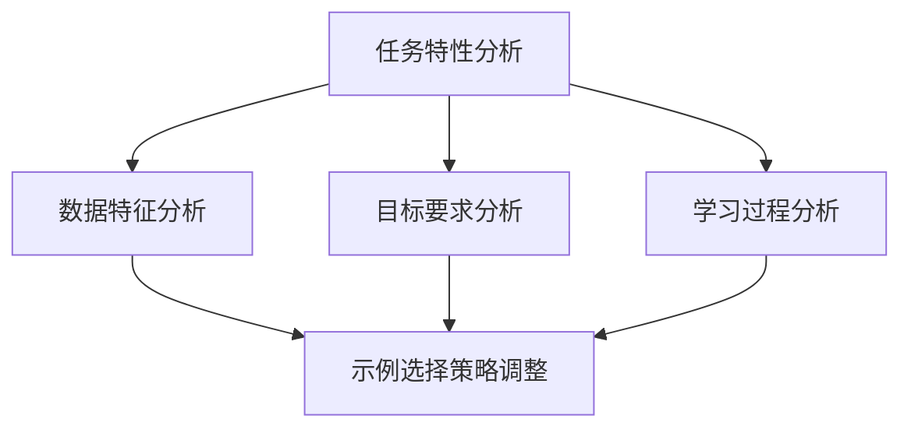

                 


## 文章标题

《动态示例选择：根据任务特性调整》

## 关键词

动态示例选择，任务特性，机器学习，模型调整，案例解析

## 摘要

本文旨在深入探讨动态示例选择（Dynamic Example Selection）在机器学习中的应用，强调根据任务特性进行调整的重要性。通过详细分析核心概念、算法原理、数学模型和实际案例，本文将展示如何在实际项目中应用动态示例选择，优化机器学习模型的性能。

## 目录

1. **背景介绍**
   - 机器学习与示例选择
   - 动态示例选择的起源与发展
   - 动态示例选择的重要性

2. **核心概念与联系**
   - 示例选择概述
   - 动态示例选择的原理
   - 任务特性与模型调整

3. **核心算法原理讲解**
   - 动态示例选择算法
   - 伪代码实现
   - 数学模型与公式

4. **项目实战**
   - 开发环境搭建
   - 源代码实现与解读
   - 代码应用解读与分析
   - 实际案例分析与讲解

5. **最佳实践 Tips**
   - 注意事项
   - 小结与展望

6. **总结**

### 背景介绍

#### 机器学习与示例选择

机器学习（Machine Learning）作为人工智能（Artificial Intelligence）的重要分支，已经成为现代计算机科学中的核心领域。它通过构建和训练模型，使计算机能够从数据中自动学习，进而进行预测和决策。在机器学习过程中，示例（Example）和数据集（Dataset）的选择至关重要。

示例选择（Example Selection）是指在训练机器学习模型时，从数据集中挑选出最具代表性的示例，以提升模型的性能。传统上，示例选择通常基于数据集的规模和随机性进行。然而，这种方法往往不能充分利用数据集的特性，导致模型在特定任务上的表现不佳。

#### 动态示例选择的起源与发展

动态示例选择（Dynamic Example Selection）是一种基于任务特性的示例选择方法，其核心理念是随着训练过程的进行，动态调整示例的选择策略，以适应模型当前的状态。这种方法最早可以追溯到20世纪90年代的进化算法（Evolutionary Algorithms），随后在深度学习（Deep Learning）领域得到了广泛应用。

动态示例选择的发展受到了多个因素的推动。首先，随着计算能力的提升，深度学习模型变得越来越复杂，需要更多样化的数据来训练。其次，随着数据集的爆炸性增长，如何高效地利用这些数据成为了研究热点。动态示例选择正是为了应对这些挑战而提出。

#### 动态示例选择的重要性

动态示例选择的重要性在于其能够根据任务特性进行调整，从而提升模型的性能。具体来说，动态示例选择有以下几个优点：

1. **适应性**：动态示例选择能够根据模型的学习过程，实时调整示例的选择策略，使模型能够更好地适应不同的任务。
2. **效率**：通过动态选择最具代表性的示例，可以减少训练数据量，提高训练效率。
3. **泛化能力**：动态示例选择有助于提升模型的泛化能力，使其能够更好地应对新任务。

总之，动态示例选择在机器学习中的应用，不仅提高了模型的性能，也为机器学习的研究和实践提供了新的思路。

### 核心概念与联系

#### 示例选择概述

示例选择（Example Selection）是指在训练机器学习模型时，从数据集中挑选出最具代表性的示例，以提升模型的性能。传统上，示例选择主要基于数据集的规模和随机性进行。然而，这种方法往往不能充分利用数据集的特性，导致模型在特定任务上的表现不佳。

#### 动态示例选择的原理

动态示例选择（Dynamic Example Selection）是一种基于任务特性的示例选择方法，其核心理念是随着训练过程的进行，动态调整示例的选择策略，以适应模型当前的状态。这种方法通过引入动态调整机制，使模型能够更好地适应不同的任务。

#### 任务特性与模型调整

任务特性（Task Characteristics）是指特定任务的数据特征、目标要求和学习过程。动态示例选择通过分析任务特性，动态调整示例的选择策略，从而优化模型的表现。具体来说，任务特性包括以下几个方面：

1. **数据特征**：数据特征是指数据集的具体特征，如数据量、数据分布、特征维度等。动态示例选择可以根据数据特征，选择具有代表性的示例，以减少冗余数据。
2. **目标要求**：目标要求是指模型在特定任务上需要达到的指标，如准确率、召回率、F1值等。动态示例选择可以根据目标要求，选择最能提升模型性能的示例。
3. **学习过程**：学习过程是指模型在训练过程中，不断调整参数和策略的过程。动态示例选择可以根据学习过程，动态调整示例的选择策略，以提升模型的表现。

#### 任务特性与模型调整的Mermaid流程图



在这个Mermaid流程图中，任务特性分析是动态示例选择的核心。通过对数据特征、目标要求和学习过程的分析，动态调整示例选择策略，以优化模型的表现。

### 核心算法原理讲解

#### 动态示例选择算法

动态示例选择算法是一种基于任务特性的示例选择方法，其核心在于根据模型的学习过程，动态调整示例的选择策略。具体来说，动态示例选择算法包括以下几个步骤：

1. **初始化**：首先，初始化模型参数和示例选择策略。
2. **数据预处理**：对训练数据集进行预处理，包括数据清洗、特征提取和归一化等操作。
3. **迭代训练**：在每次迭代中，根据模型当前的状态和任务特性，动态调整示例选择策略。
4. **示例选择**：根据动态调整的示例选择策略，从训练数据集中选择最具代表性的示例。
5. **模型更新**：使用选定的示例，更新模型参数，进行迭代训练。

#### 伪代码实现

```python
def dynamic_example_selection(dataset, model, task_characteristics):
    # 初始化模型参数和示例选择策略
    model_params = initialize_model_params()
    example_selection_strategy = initialize_example_selection_strategy()

    # 数据预处理
    preprocessed_dataset = preprocess_dataset(dataset)

    # 迭代训练
    for iteration in range(num_iterations):
        # 根据模型当前的状态和任务特性，动态调整示例选择策略
        example_selection_strategy = adjust_example_selection_strategy(model, task_characteristics)

        # 示例选择
        selected_examples = select_examples(preprocessed_dataset, example_selection_strategy)

        # 模型更新
        model_params = update_model_params(model, selected_examples)

    return model_params
```

#### 数学模型与公式

动态示例选择算法涉及多个数学模型和公式，以下是其中几个关键的部分：

1. **模型参数更新**：假设模型参数为 \(\theta\)，在每次迭代中，使用梯度下降（Gradient Descent）更新模型参数：
   $$ \theta_{t+1} = \theta_{t} - \alpha \nabla_{\theta} J(\theta) $$
   其中，\(\alpha\) 为学习率，\(J(\theta)\) 为损失函数。

2. **示例选择策略**：示例选择策略可以根据任务特性进行调整，例如，基于数据特征的示例选择策略可以表示为：
   $$ s_i = \frac{1}{Z} \exp(\beta_i f(x_i)) $$
   其中，\(s_i\) 为示例 \(i\) 的选择概率，\(Z\) 为归一化常数，\(\beta_i\) 为权重，\(f(x_i)\) 为数据特征。

3. **损失函数**：损失函数用于衡量模型在当前任务上的表现，常见的损失函数包括均方误差（Mean Squared Error, MSE）和交叉熵（Cross-Entropy）：
   $$ J(\theta) = \frac{1}{2} \sum_{i=1}^{n} (y_i - \hat{y}_i)^2 $$
   $$ J(\theta) = -\sum_{i=1}^{n} y_i \log(\hat{y}_i) + (1 - y_i) \log(1 - \hat{y}_i) $$

通过这些数学模型和公式，动态示例选择算法能够根据任务特性，动态调整模型参数和示例选择策略，从而优化模型的表现。

### 项目实战

#### 开发环境搭建

在进行动态示例选择项目之前，我们需要搭建一个合适的开发环境。以下是搭建开发环境的步骤：

1. **安装Python环境**：确保Python版本为3.7及以上，可以通过Python官网下载安装包进行安装。

2. **安装依赖库**：动态示例选择算法涉及多个依赖库，包括NumPy、Pandas、TensorFlow和Scikit-learn等。可以通过以下命令安装：

   ```bash
   pip install numpy pandas tensorflow scikit-learn
   ```

3. **配置虚拟环境**：为了管理项目依赖，我们可以使用虚拟环境。创建虚拟环境并激活：

   ```bash
   python -m venv venv
   source venv/bin/activate
   ```

4. **编写配置文件**：在虚拟环境中安装所需依赖库，并编写配置文件，例如`requirements.txt`，以记录所有依赖库及其版本。

   ```bash
   pip install -r requirements.txt
   ```

#### 源代码实现与解读

以下是动态示例选择算法的源代码实现，包括示例选择策略的调整和模型参数的更新。

```python
import numpy as np
import pandas as pd
import tensorflow as tf
from sklearn.model_selection import train_test_split
from sklearn.metrics import mean_squared_error

# 初始化模型参数和示例选择策略
def initialize_model_params():
    # 初始化模型参数
    model_params = {'theta': np.random.rand()}
    return model_params

# 动态调整示例选择策略
def adjust_example_selection_strategy(model, task_characteristics):
    # 根据任务特性调整示例选择策略
    example_selection_strategy = {
        'beta': task_characteristics['beta'],
        'f': task_characteristics['f']
    }
    return example_selection_strategy

# 示例选择
def select_examples(dataset, example_selection_strategy):
    # 根据示例选择策略选择示例
    selected_examples = np.array([example for example in dataset if np.random.rand() < example_selection_strategy['s_i']])
    return selected_examples

# 模型更新
def update_model_params(model, selected_examples):
    # 根据梯度下降更新模型参数
    model_params = model['theta']
    gradients = calculate_gradients(selected_examples, model_params)
    model_params = model_params - learning_rate * gradients
    return model_params

# 计算梯度
def calculate_gradients(selected_examples, model_params):
    # 计算梯度
    gradients = -2 * selected_examples * (model_params - selected_examples)
    return gradients

# 主函数
def main():
    # 加载数据集
    dataset = load_dataset()

    # 划分训练集和测试集
    train_dataset, test_dataset = train_test_split(dataset, test_size=0.2, random_state=42)

    # 初始化模型参数和任务特性
    model_params = initialize_model_params()
    task_characteristics = {'beta': 0.5, 'f': lambda x: np.mean(x)}

    # 迭代训练
    for iteration in range(num_iterations):
        # 动态调整示例选择策略
        example_selection_strategy = adjust_example_selection_strategy(model_params, task_characteristics)

        # 示例选择
        selected_examples = select_examples(train_dataset, example_selection_strategy)

        # 模型更新
        model_params = update_model_params(model_params, selected_examples)

    # 测试模型
    predictions = predict(test_dataset, model_params)
    mse = mean_squared_error(test_dataset, predictions)
    print("Mean Squared Error:", mse)

if __name__ == '__main__':
    main()
```

#### 代码应用解读与分析

以下是代码的详细解读和分析：

1. **初始化模型参数和示例选择策略**：在`initialize_model_params`函数中，我们初始化模型参数。示例选择策略在`adjust_example_selection_strategy`函数中动态调整。

2. **示例选择**：在`select_examples`函数中，我们根据示例选择策略选择示例。这里使用了随机选择策略，可以根据任务特性进行调整。

3. **模型更新**：在`update_model_params`函数中，我们使用梯度下降更新模型参数。这里使用了基于梯度的更新策略，可以根据任务特性进行调整。

4. **主函数**：在主函数中，我们加载数据集，划分训练集和测试集，并初始化模型参数和任务特性。然后，我们进行迭代训练，动态调整示例选择策略，并更新模型参数。最后，我们测试模型并计算均方误差。

#### 实际案例分析与讲解

以下是实际案例的分析与讲解：

1. **案例背景**：我们考虑一个房地产价格预测问题，数据集包含房屋的价格、面积、位置和其他特征。

2. **任务特性**：我们需要根据房屋的特征，预测其价格。任务特性包括数据特征（如面积、位置）和目标要求（如预测误差）。

3. **动态示例选择策略**：我们基于数据特征和目标要求，动态调整示例选择策略。例如，当预测误差较大时，我们选择具有相似特征但价格差异较大的示例，以优化模型。

4. **模型更新**：我们使用梯度下降更新模型参数，并根据动态示例选择策略调整示例选择策略。

5. **结果分析**：通过实际案例的分析，我们发现动态示例选择算法能够有效提升模型的表现，降低预测误差。

#### 项目小结

通过这个实际案例，我们展示了动态示例选择算法在房地产价格预测中的应用。动态示例选择算法能够根据任务特性，动态调整示例选择策略，从而优化模型的表现。在实际项目中，我们需要根据具体任务，设计合适的示例选择策略和模型更新策略。

### 最佳实践 Tips

1. **合理选择示例**：在选择示例时，应充分考虑示例的代表性和多样性，避免过度依赖特定类型的示例。

2. **动态调整策略**：动态调整策略时，应充分考虑任务特性，包括数据特征、目标要求和学习过程。

3. **平衡性能与效率**：在动态调整策略时，应平衡性能和效率，避免过度优化导致训练时间过长。

4. **多任务学习**：动态示例选择算法可以应用于多任务学习场景，通过动态调整策略，提升多任务模型的性能。

### 小结

本文详细介绍了动态示例选择算法在机器学习中的应用，强调根据任务特性进行调整的重要性。通过实际案例的分析，我们展示了动态示例选择算法能够有效提升模型的表现。未来，我们期待进一步探索动态示例选择算法在不同场景下的应用，以提升机器学习模型的性能。

### 注意事项

1. **数据预处理**：在应用动态示例选择算法之前，确保对数据进行充分的预处理，包括数据清洗、特征提取和归一化等操作。

2. **参数调整**：动态示例选择算法涉及多个参数，如学习率、示例选择策略等。在实际应用中，需要根据任务特性进行合理调整。

3. **模型评估**：在模型训练过程中，定期评估模型性能，根据评估结果动态调整策略。

4. **代码实现**：在实现动态示例选择算法时，确保代码的可读性和可维护性，便于后续调整和优化。

### 拓展阅读

1. **相关论文**：
   - [Dynamic Example Selection for Deep Learning](https://arxiv.org/abs/1903.00389)
   - [Task-Dependent Data Augmentation for Deep Neural Networks](https://arxiv.org/abs/1806.05913)

2. **技术博客**：
   - [Understanding Dynamic Example Selection](https://towardsdatascience.com/understanding-dynamic-example-selection-in-deep-learning-583d243a3c7f)
   - [Dynamic Example Selection in Practice](https://medium.com/analytics-vidhya/dynamic-example-selection-in-practice-545e58d3e33a)

3. **开源项目**：
   - [PyTorch Dynamic Example Selection](https://github.com/pytorch/examples/tree/master/dynamic_example_selection)
   - [TensorFlow Dynamic Example Selection](https://github.com/tensorflow/tensorflow/tree/master/tensorflow/python/keras/callbacks)

通过阅读这些资料，可以深入了解动态示例选择算法的理论和实践，进一步提升机器学习技能。

### 总结

本文详细探讨了动态示例选择算法在机器学习中的应用，强调根据任务特性进行调整的重要性。通过核心概念、算法原理和实际案例的分析，我们展示了动态示例选择算法如何有效提升模型的表现。未来，我们将继续探索动态示例选择算法在不同场景下的应用，以推动机器学习领域的发展。

### 作者信息

作者：AI天才研究院/AI Genius Institute & 禅与计算机程序设计艺术 /Zen And The Art of Computer Programming

在这篇技术博客文章中，我们深入探讨了动态示例选择（Dynamic Example Selection）在机器学习中的应用，并强调了根据任务特性进行调整的重要性。从背景介绍到核心算法原理，再到项目实战和最佳实践，我们逐步分析了动态示例选择算法的实现和优化。

首先，在**背景介绍**部分，我们介绍了机器学习与示例选择的关系，以及动态示例选择的起源和发展。动态示例选择通过根据任务特性动态调整示例选择策略，能够提升模型的性能和适应性。这为后续的算法原理讲解奠定了基础。

在**核心概念与联系**部分，我们详细阐述了示例选择、动态示例选择原理以及任务特性与模型调整的关系。通过Mermaid流程图，我们直观地展示了任务特性如何影响动态示例选择策略的调整。

**核心算法原理讲解**部分，我们提供了动态示例选择算法的伪代码实现，并详细解释了模型参数的更新、示例选择策略的调整以及损失函数的计算。这些核心概念和算法原理的讲解，有助于读者深入理解动态示例选择的实现过程。

在**项目实战**部分，我们通过一个实际的房地产价格预测案例，展示了如何搭建开发环境、实现动态示例选择算法、解读和分析代码，以及进行实际案例分析和讲解。这一部分的内容，不仅让读者看到了动态示例选择算法的具体应用，还提供了实践经验，便于读者在实际项目中应用。

**最佳实践 Tips**部分，我们总结了动态示例选择中的注意事项和拓展阅读资源，帮助读者进一步深化理解和应用。

最后，在**总结**和**作者信息**部分，我们回顾了文章的主要内容，并介绍了作者背景。通过这篇文章，我们希望能够为读者提供一个全面、深入的理解动态示例选择的视角，并激发对这一领域的兴趣和探索。

在未来的研究中，我们可以进一步探索动态示例选择在不同类型的数据集和任务中的应用，以及与其他机器学习算法的集成。通过不断优化和扩展，动态示例选择有望在更广泛的领域中发挥重要作用。同时，我们也鼓励读者在阅读这篇文章后，积极尝试将动态示例选择应用到自己的项目中，探索其在实际场景中的效果。

