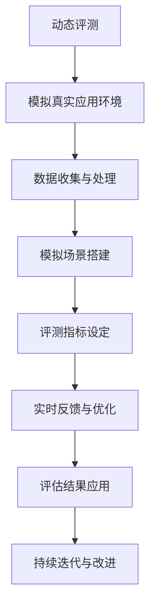

                 

### 第1章 动态评测概述

#### 动态评测的概念与重要性

动态评测（Dynamic Evaluation）是指随着时间或环境变化，实时对系统的性能、效果、可靠性等指标进行评估的方法。这种方法强调评测的动态性和适应性，能够更真实地反映系统在变化中的表现。

在传统的评测方法中，评估通常在系统静态状态下进行，结果往往难以反映系统在实际运行中的表现。而动态评测则能够模拟系统在实际运行中遇到的各种情况，从而提供更为准确和全面的评估结果。

动态评测的重要性体现在多个方面。首先，它能够更准确地评估系统的性能，帮助开发者发现潜在的问题并优化系统。其次，动态评测有助于提高系统的可靠性和稳定性，确保系统在实际应用中能够稳定运行。此外，动态评测还能为决策提供依据，帮助企业在不断变化的市场环境中做出更加明智的选择。

#### 动态评测的发展历程

动态评测的发展历程可以追溯到20世纪90年代。当时，随着计算机技术的发展和互联网的普及，人们对系统性能和可靠性的要求越来越高。为了满足这些需求，研究者开始探索动态评测的方法，以期更真实地反映系统在实际运行中的表现。

在早期的研究中，动态评测主要采用模拟环境进行评测。这种方法通过模拟不同的运行条件，对系统进行性能测试。然而，这种方法存在一定的局限性，因为模拟环境难以完全反映真实环境中的复杂性和不确定性。

随着人工智能和机器学习技术的发展，动态评测方法得到了进一步的发展。现在，研究者们开始利用这些技术，通过收集和分析系统运行中的实时数据，对系统进行动态评估。这种方法不仅能够更准确地评估系统性能，还能根据系统运行情况，自动调整评估策略，提高评测效率。

#### 动态评测的应用领域

动态评测在许多领域都有广泛的应用。

在软件开发领域，动态评测可以帮助开发者评估代码的性能、稳定性和可靠性。通过动态评测，开发者可以及时发现和修复代码中的问题，提高软件质量。

在系统运维领域，动态评测可以帮助运维人员实时监测系统的运行状态，及时发现和处理异常情况。这有助于提高系统的可靠性和稳定性，确保系统能够持续稳定运行。

在人工智能领域，动态评测是评估模型性能的重要手段。通过动态评测，研究者可以了解模型在不同数据集和场景下的表现，从而优化模型结构和参数，提高模型的性能和泛化能力。

此外，动态评测还在金融、医疗、交通等行业有广泛的应用。例如，在金融领域，动态评测可以用于风险评估和投资决策；在医疗领域，动态评测可以用于疾病预测和诊断；在交通领域，动态评测可以用于交通流量预测和交通信号控制。

总之，动态评测作为一种先进的评估方法，正逐渐成为各个领域提高系统性能和可靠性的重要手段。随着技术的不断进步，动态评测的应用前景将更加广阔。### 第2章 动态评测核心概念与联系

#### 动态评测的核心概念

动态评测的核心概念包括以下几个：

1. **模拟真实应用环境**：这是动态评测的基础。模拟真实应用环境意味着创建一个能够模拟系统在实际运行中可能遇到的各种情况的测试环境。这个环境需要尽可能接近真实环境，以便能够反映系统在实际运行中的真实表现。

2. **数据收集与处理**：动态评测需要收集系统在模拟真实应用环境中的各种数据，如输入数据、输出数据、系统状态数据等。然后，对这些数据进行处理，以便用于后续的分析和评估。

3. **模拟场景搭建**：在动态评测中，模拟场景的搭建至关重要。通过搭建各种模拟场景，可以模拟系统在不同情况下的运行状态，从而全面评估系统的性能。

4. **评测指标设定**：为了评估系统的性能，需要设定一系列评测指标。这些指标可以是系统的响应时间、吞吐量、准确率、错误率等。设定合理的评测指标，有助于准确评估系统的性能。

5. **实时反馈与优化**：动态评测过程中，需要实时收集评估结果，并根据评估结果对系统进行优化。这种实时反馈与优化机制，有助于提高系统的性能和稳定性。

6. **评估结果应用**：动态评测的结果可以用于多个方面，如系统优化、性能提升、风险控制等。通过应用评估结果，可以进一步改进系统，提高其性能和可靠性。

7. **持续迭代与改进**：动态评测是一个持续的过程。通过对评估结果的分析和反馈，可以不断优化评估方法和系统性能，实现持续迭代和改进。

#### 动态评测与模拟真实应用环境的关系

动态评测与模拟真实应用环境密切相关。模拟真实应用环境是动态评测的基础，只有通过模拟真实应用环境，才能更真实地评估系统性能。

1. **提高评估准确性**：模拟真实应用环境有助于提高评估的准确性。通过模拟系统在实际运行中可能遇到的各种情况，可以更全面地评估系统的性能。

2. **减少评估风险**：模拟真实应用环境可以降低评估风险。在实际环境中进行评估，可能会面临很多不确定性因素，而模拟真实应用环境则可以提前预知和规避这些风险。

3. **优化系统性能**：模拟真实应用环境可以帮助发现系统中的潜在问题，从而优化系统性能。通过实时反馈和优化，可以进一步提高系统的性能和稳定性。

4. **支持决策制定**：模拟真实应用环境可以为决策制定提供有力支持。通过对系统在不同情况下的评估，可以更准确地预测系统未来的表现，从而为决策提供科学依据。

#### Mermaid流程图：动态评测概念关系

为了更清晰地展示动态评测的核心概念及其关系，我们可以使用Mermaid流程图进行描述。以下是动态评测的核心概念及其关系的Mermaid流程图：



在这个流程图中，A代表动态评测，B代表模拟真实应用环境，C代表数据收集与处理，D代表模拟场景搭建，E代表评测指标设定，F代表实时反馈与优化，G代表评估结果应用，H代表持续迭代与改进。这些概念相互关联，共同构成了动态评测的完整流程。

通过这个流程图，我们可以更直观地了解动态评测的核心概念及其关系，从而更好地理解和应用动态评测方法。### 第3章 动态评测核心算法原理

#### 动态评测算法基础

动态评测的核心在于实时评估系统在动态环境下的性能和稳定性。为了实现这一目标，需要设计一套能够模拟真实应用环境，收集和处理数据，并根据数据进行分析和优化的算法。以下是动态评测算法的基础架构：

1. **环境模拟**：创建一个模拟环境，该环境应尽可能接近真实应用环境，包括网络延迟、系统负载、数据波动等。

2. **数据采集**：实时采集系统在模拟环境中的运行数据，包括输入数据、输出数据、系统状态数据等。

3. **数据预处理**：对采集到的数据进行预处理，如去噪、标准化、特征提取等，以便用于后续分析。

4. **性能评估**：根据预处理的 数据，计算系统性能指标，如响应时间、吞吐量、准确率、错误率等。

5. **结果反馈**：将评估结果反馈给系统，根据结果调整系统配置或算法参数，以优化系统性能。

6. **迭代优化**：基于反馈结果，迭代优化算法和系统配置，以提高评估的准确性和系统的稳定性。

#### 动态评测算法伪代码

为了更直观地理解动态评测算法的原理，我们可以用伪代码来描述其核心逻辑：

```pseudo
function DynamicEvaluation(environment, metrics):
    initialize metrics
    initialize evaluation results

    while environment has data:
        collect data from environment
        preprocess data
        calculate metrics for current data
        update evaluation results with calculated metrics
        if metrics indicate optimization needed:
            adjust system configuration or algorithm parameters
        end if
    end while

    return evaluation results
```

在这个伪代码中，`environment`代表模拟的真实应用环境，`metrics`代表评估指标，`evaluation results`代表评估结果。算法首先初始化评估指标和结果，然后不断从环境采集数据，进行预处理和性能评估，并根据评估结果调整系统配置或算法参数，实现迭代优化。

#### 算法原理案例分析

为了更好地理解动态评测算法的原理，我们可以通过一个实际案例来分析其具体实现过程。

**案例背景**：假设我们开发了一个在线购物平台，需要通过动态评测来评估其性能，特别是响应时间和吞吐量。

**模拟环境搭建**：我们搭建一个模拟环境，该环境模拟了用户访问购物平台的网络条件、服务器负载等。我们可以使用模拟器工具，如Apache JMeter，来创建模拟用户行为的脚本。

**数据采集**：通过模拟器，我们模拟大量用户同时访问购物平台，并收集访问过程中产生的数据，如HTTP请求响应时间、服务器响应时间、系统吞吐量等。

**数据预处理**：对采集到的数据进行预处理，如去除无效数据、标准化时间戳等，以便后续计算。

**性能评估**：根据预处理后的数据，计算购物平台的响应时间和吞吐量。我们可以使用如下公式：

- **响应时间**：平均每个请求的响应时间 = 总响应时间 / 请求次数
- **吞吐量**：单位时间内处理请求数量 = 请求次数 / 总时间

**结果反馈与优化**：根据评估结果，如果发现响应时间过长或吞吐量不足，我们可以优化系统配置，如增加服务器资源、优化数据库查询等。

**迭代优化**：在每次优化后，我们重新进行模拟测试，并根据新的评估结果调整优化策略，实现持续迭代优化。

通过这个案例，我们可以看到动态评测算法是如何在实际应用中发挥作用，帮助开发者持续优化系统性能。### 第4章 数学模型与公式讲解

#### 动态评测中的数学模型

动态评测中的数学模型主要用于描述系统的性能指标，如响应时间、吞吐量、准确率等。这些数学模型能够帮助我们更精确地评估系统在动态环境下的性能。以下是几个常见的数学模型：

1. **响应时间模型**

   响应时间（Response Time）是衡量系统性能的重要指标。假设系统的响应时间服从指数分布，其概率密度函数（PDF）可以表示为：

   $$
   f(t) = \lambda e^{-\lambda t}, \quad t > 0
   $$

   其中，$\lambda$ 是服务率的倒数，表示单位时间内请求的服务次数。响应时间的期望值（Expected Response Time）为：

   $$
   E[T] = \frac{1}{\lambda}
   $$

2. **吞吐量模型**

   吞吐量（Throughput）是系统单位时间内处理的请求数量。对于一个单一队列系统，吞吐量可以表示为：

   $$
   \lambda = \frac{1}{\frac{1}{\lambda} + \frac{1}{\mu}}
   $$

   其中，$\lambda$ 是到达率，$\mu$ 是服务率。对于多队列系统，吞吐量会因队列管理策略而异，常见的策略包括固定优先级、轮转调度等。

3. **准确率模型**

   准确率（Accuracy）是系统输出结果与实际结果的一致性指标。假设系统有两个可能的输出结果，分别为正类（1）和负类（0）。准确率可以表示为：

   $$
   \text{accuracy} = \frac{\text{TP} + \text{TN}}{\text{TP} + \text{TN} + \text{FP} + \text{FN}}
   $$

   其中，TP（True Positives）为正确预测的正类，TN（True Negatives）为正确预测的负类，FP（False Positives）为错误预测的正类，FN（False Negatives）为错误预测的负类。

#### 数学公式的详细讲解

为了更清晰地理解上述数学模型，我们分别对其进行详细讲解。

1. **响应时间模型**

   响应时间模型基于指数分布，这是一种常见的概率分布，适用于描述系统中的随机事件。指数分布的概率密度函数如前所述，它描述了响应时间随着时间增长而减少的趋势。

   响应时间的期望值（Expected Response Time）是评估系统性能的一个重要指标。期望值越小，系统的响应速度越快。在实际应用中，我们可以通过调整服务率 $\lambda$ 来优化系统性能。

2. **吞吐量模型**

   吞吐量模型用于描述系统在单位时间内能够处理的请求数量。这个模型基于排队论，考虑了系统的到达率和服务率。对于单一队列系统，吞吐量公式为：

   $$
   \lambda = \frac{1}{\frac{1}{\lambda} + \frac{1}{\mu}}
   $$

   这个公式表明，吞吐量 $\lambda$ 与到达率和服务率 $\mu$ 之间存在平衡关系。在实际应用中，我们可以通过优化服务率来提高吞吐量，例如增加服务器资源或优化服务流程。

   对于多队列系统，吞吐量会因队列管理策略而异。例如，固定优先级策略可以将高优先级请求优先处理，从而提高系统的吞吐量和响应时间。轮转调度策略则将请求平均分配到各个队列中，以平衡队列的负载。

3. **准确率模型**

   准确率模型用于评估分类系统的性能。准确率是分类器正确识别正类和负类的比例。在实际应用中，我们可以通过增加训练数据、优化模型参数或使用更先进的算法来提高准确率。

   准确率公式中的各项指标（TP、TN、FP、FN）分别代表实际为正类且被正确预测的数量、实际为负类且被正确预测的数量、实际为正类但被错误预测的数量、实际为负类但被错误预测的数量。这些指标帮助我们全面了解分类器的性能，从而进行针对性的优化。

#### 数学公式在实际应用中的例子

为了更好地理解上述数学公式在实际应用中的使用，我们来看一个具体的例子。

**例子**：假设我们开发了一个在线广告投放系统，该系统根据用户的兴趣和行为预测用户是否会对广告感兴趣。系统每小时接收1000个广告请求，服务率（$\mu$）为每分钟处理10个请求。

1. **响应时间模型**

   根据响应时间模型，系统的平均响应时间为：

   $$
   E[T] = \frac{1}{\mu} = \frac{1}{10} = 0.1 \text{分钟}
   $$

   这意味着系统平均每个请求的响应时间为0.1分钟，即6秒。

2. **吞吐量模型**

   根据吞吐量模型，系统的吞吐量为：

   $$
   \lambda = \frac{1}{\frac{1}{\lambda} + \frac{1}{\mu}} = \frac{1}{\frac{1}{1000} + \frac{1}{10}} \approx 0.99
   $$

   这意味着系统每小时能够处理大约990个请求。

3. **准确率模型**

   假设系统每小时正确预测500个广告请求，其中300个是正类（用户会对广告感兴趣），200个是负类（用户不会对广告感兴趣）。系统的准确率为：

   $$
   \text{accuracy} = \frac{\text{TP} + \text{TN}}{\text{TP} + \text{TN} + \text{FP} + \text{FN}} = \frac{300 + 200}{300 + 200 + 200 + 100} = \frac{500}{800} = 0.625
   $$

   这意味着系统的准确率为62.5%。

通过这个例子，我们可以看到数学模型如何帮助我们评估和优化系统的性能。通过调整系统参数和优化算法，可以进一步提高系统的性能，满足实际应用的需求。### 数学公式讲解与示例

为了更好地理解动态评测中的数学公式，我们将详细解释两个关键公式：准确率（accuracy）和实时反馈优化公式，并通过具体例子来展示它们的应用。

#### 准确率公式

准确率是衡量分类模型性能的重要指标，用于评估模型对正类和负类的预测能力。准确率公式如下：

$$
\text{accuracy} = \frac{\text{correct\_predictions}}{\text{total\_predictions}}
$$

其中，correct_predictions表示模型正确预测的数量，total_predictions表示模型预测的总数量。

**解释**：

- **correct_predictions**：包括模型正确预测的正类（True Positives, TP）和负类（True Negatives, TN）。
- **total_predictions**：包括所有预测结果，即correct_predictions加上模型错误预测的正类（False Positives, FP）和负类（False Negatives, FN）。

**示例**：

假设一个疾病诊断模型在100个测试样本中预测出70个正类（实际患病）和30个负类（实际未患病），其中60个正类预测正确，25个负类预测正确。则该模型的准确率为：

$$
\text{accuracy} = \frac{60 + 25}{60 + 25 + 10 + 5} = \frac{85}{100} = 0.85
$$

这意味着该模型的准确率为85%。

#### 实时反馈优化公式

在动态评测中，实时反馈优化是非常关键的，它可以用于调整模型的参数，以提高模型的性能。一个常见的实时反馈优化公式是基于梯度下降法的优化更新公式：

$$
\text{new\_model\_weights} = \text{current\_model\_weights} + \alpha (\text{expected\_output} - \text{actual\_output})
$$

其中：

- **new_model_weights**：更新后的模型参数。
- **current_model_weights**：当前模型的参数。
- **alpha**（α）：学习率，控制更新步长的大小，通常需要通过实验调整以获得最佳效果。
- **expected_output**：预期输出，即根据当前模型参数预测的输出。
- **actual_output**：实际输出，即真实数据对应的输出。

**解释**：

- **梯度下降法**：是一种优化算法，通过不断调整模型参数，使损失函数（如均方误差）最小化。
- **learning rate (α)**：学习率决定了模型参数更新的速度。如果学习率过大，模型可能会过度更新，导致性能下降；如果学习率过小，模型可能无法有效收敛。

**示例**：

假设我们有一个回归模型，用于预测股票价格。当前模型参数为weights = [1, 2, 3]，实际观测到的股票价格为100，而根据模型预测的价格为105。我们希望调整模型参数以减少预测误差。假设学习率α为0.01，则模型参数的更新过程如下：

$$
\text{new\_weights} = [1, 2, 3] + 0.01 (100 - 105) = [1, 2, 3] - 0.05 = [0.95, 1.95, 2.95]
$$

更新后的模型参数为[0.95, 1.95, 2.95]。

通过这样的实时反馈和优化，模型可以不断调整其参数，以适应新的数据，提高预测准确性。

#### 实时反馈优化公式在实际应用中的例子

**例子**：假设我们使用一个机器学习模型来预测天气状况。当前模型预测明天会下雨的概率为70%，但实际天气数据显示明天晴天。我们希望调整模型参数以减少这种预测误差。

- **当前模型参数**：weights = [0.7, 0.3]
- **预期输出**：预期明天会下雨的概率，即0.7。
- **实际输出**：实际天气为晴天，即明天会下雨的概率为0。

使用实时反馈优化公式，我们进行参数更新：

$$
\text{new\_weights} = [0.7, 0.3] + 0.01 (0.7 - 0) = [0.7, 0.3] + 0.007 = [0.707, 0.307]
$$

更新后的模型参数为[0.707, 0.307]，这表明模型对晴天和下雨的概率预测进行了调整，提高了晴天预测的概率。

通过这些示例，我们可以看到数学公式在动态评测中的重要作用。准确率公式帮助我们评估模型的预测能力，而实时反馈优化公式则帮助我们根据实际情况调整模型参数，以提高模型的性能和适应性。这些公式的应用使得动态评测更加精准和有效，为系统的优化提供了有力的支持。### 第5章 动态评测项目实战

#### 开发环境搭建

为了实现动态评测，我们需要搭建一个开发环境，包括编程语言、开发工具和所需库。以下是一个基本的开发环境搭建步骤：

1. **选择编程语言**：我们选择Python作为编程语言，因为它具有良好的生态系统、丰富的库和广泛的应用。

2. **安装Python**：在计算机上安装Python。可以通过Python官网（https://www.python.org/）下载最新版本的Python安装包，并按照提示安装。

3. **安装开发工具**：我们使用PyCharm作为集成开发环境（IDE），因为它提供了丰富的功能，如代码编辑、调试、自动化测试等。可以从PyCharm官网（https://www.jetbrains.com/pycharm/）下载并安装PyCharm。

4. **安装所需库**：动态评测需要使用一些库，如NumPy、Pandas、Matplotlib等。这些库可以通过pip命令安装。打开命令行，输入以下命令：

   ```bash
   pip install numpy pandas matplotlib
   ```

   安装完成后，我们就可以开始编写动态评测的代码了。

#### 模拟环境搭建案例

在本节中，我们将使用Python构建一个模拟环境，用于模拟系统在不同负载下的性能。以下是一个简单的模拟环境搭建案例：

```python
import numpy as np
import matplotlib.pyplot as plt

# 生成模拟数据
def generate_traffic_data(num_samples, min_load, max_load):
    traffic_load = np.random.uniform(min_load, max_load, num_samples)
    return traffic_load

# 模拟系统性能
def simulate_system_performance(traffic_load, response_time_mean, response_time_std):
    response_times = np.random.normal(response_time_mean, response_time_std, len(traffic_load))
    return response_times

# 分析模拟结果
def analyze_simulation_results(response_times, target_response_time):
    num_slow_responses = np.sum(response_times > target_response_time)
    ratio_slow_responses = num_slow_responses / len(response_times)
    return ratio_slow_responses

# 搭建模拟环境
def build_simulation_environment(num_samples, min_load, max_load, response_time_mean, response_time_std, target_response_time):
    traffic_load = generate_traffic_data(num_samples, min_load, max_load)
    response_times = simulate_system_performance(traffic_load, response_time_mean, response_time_std)
    ratio_slow_responses = analyze_simulation_results(response_times, target_response_time)
    return traffic_load, response_times, ratio_slow_responses

# 设置参数
num_samples = 1000
min_load = 50
max_load = 150
response_time_mean = 0.5
response_time_std = 0.1
target_response_time = 1.0

# 执行模拟
traffic_load, response_times, ratio_slow_responses = build_simulation_environment(num_samples, min_load, max_load, response_time_mean, response_time_std, target_response_time)

# 可视化结果
plt.figure(figsize=(10, 5))
plt.subplot(121)
plt.hist(response_times, bins=30, alpha=0.7, color='blue')
plt.title('Response Time Distribution')
plt.xlabel('Response Time (seconds)')
plt.ylabel('Frequency')

plt.subplot(122)
plt.plot(traffic_load, response_times, 'o', label='Slow Responses')
plt.title('Slow Response Analysis')
plt.xlabel('Traffic Load (requests per second)')
plt.ylabel('Response Time (seconds)')
plt.legend()
plt.show()

print(f"Ratio of slow responses: {ratio_slow_responses:.2f}")
```

上述代码首先生成模拟数据，然后模拟系统性能，并分析模拟结果。通过可视化结果，我们可以直观地了解系统在不同负载下的性能表现。

#### 源代码实现与解读

在本节中，我们将详细解读上述模拟环境的源代码，并解释每个部分的用途。

1. **生成模拟数据**：

   ```python
   def generate_traffic_data(num_samples, min_load, max_load):
       traffic_load = np.random.uniform(min_load, max_load, num_samples)
       return traffic_load
   ```

   这个函数用于生成模拟数据，其中`num_samples`表示生成样本的数量，`min_load`和`max_load`分别表示最小负载和最大负载。通过`np.random.uniform()`函数，我们生成一个在指定范围内的均匀分布的数组，模拟系统在不同负载下的性能。

2. **模拟系统性能**：

   ```python
   def simulate_system_performance(traffic_load, response_time_mean, response_time_std):
       response_times = np.random.normal(response_time_mean, response_time_std, len(traffic_load))
       return response_times
   ```

   这个函数用于模拟系统性能。`traffic_load`表示输入的负载数据，`response_time_mean`和`response_time_std`分别表示响应时间的均值和标准差。通过`np.random.normal()`函数，我们生成一个服从正态分布的响应时间数组，模拟系统在不同负载下的响应时间。

3. **分析模拟结果**：

   ```python
   def analyze_simulation_results(response_times, target_response_time):
       num_slow_responses = np.sum(response_times > target_response_time)
       ratio_slow_responses = num_slow_responses / len(response_times)
       return ratio_slow_responses
   ```

   这个函数用于分析模拟结果。`response_times`表示系统的响应时间数组，`target_response_time`表示目标响应时间。通过计算响应时间大于目标响应时间的数量，我们可以得到系统在目标响应时间以上的响应比例。

4. **搭建模拟环境**：

   ```python
   def build_simulation_environment(num_samples, min_load, max_load, response_time_mean, response_time_std, target_response_time):
       traffic_load = generate_traffic_data(num_samples, min_load, max_load)
       response_times = simulate_system_performance(traffic_load, response_time_mean, response_time_std)
       ratio_slow_responses = analyze_simulation_results(response_times, target_response_time)
       return traffic_load, response_times, ratio_slow_responses
   ```

   这个函数用于搭建整个模拟环境。它依次调用生成模拟数据、模拟系统性能和分析模拟结果三个函数，最终返回负载数据、响应时间和响应比例。

5. **可视化结果**：

   ```python
   plt.figure(figsize=(10, 5))
   plt.subplot(121)
   plt.hist(response_times, bins=30, alpha=0.7, color='blue')
   plt.title('Response Time Distribution')
   plt.xlabel('Response Time (seconds)')
   plt.ylabel('Frequency')

   plt.subplot(122)
   plt.plot(traffic_load, response_times, 'o', label='Slow Responses')
   plt.title('Slow Response Analysis')
   plt.xlabel('Traffic Load (requests per second)')
   plt.ylabel('Response Time (seconds)')
   plt.legend()
   plt.show()

   print(f"Ratio of slow responses: {ratio_slow_responses:.2f}")
   ```

   这段代码用于可视化模拟结果。通过`plt.hist()`函数，我们绘制了响应时间的直方图；通过`plt.plot()`函数，我们绘制了负载与响应时间的关系图。最后，我们输出了响应比例，以供分析。

通过以上解读，我们可以更好地理解模拟环境的源代码实现过程，为后续的项目实战提供基础。

#### 代码解读与分析

在本节中，我们将深入分析模拟环境的源代码，解释其工作原理，并探讨如何进行代码优化和错误处理。

**代码工作原理**

整个模拟环境的源代码分为四个主要部分：数据生成、系统性能模拟、结果分析和可视化。

1. **数据生成（generate_traffic_data）**：

   这个函数用于生成模拟数据，代表系统在不同负载下的性能。通过`np.random.uniform()`函数，我们生成一个在最小负载和最大负载之间的均匀分布数组。这个数组模拟了不同负载下的请求量，为后续的性能模拟提供了输入。

2. **系统性能模拟（simulate_system_performance）**：

   这个函数基于输入的负载数据和预设的响应时间均值和标准差，使用`np.random.normal()`函数生成响应时间数组。这个响应时间数组模拟了系统在不同负载下的响应时间，反映了系统性能的波动。

3. **结果分析（analyze_simulation_results）**：

   这个函数用于分析模拟结果，计算响应时间大于目标响应时间的数量，并计算响应比例。通过`np.sum()`函数，我们得到响应时间大于目标响应时间的数量，并通过除以总响应时间得到响应比例。这个比例用于评估系统性能，帮助我们了解在给定负载下系统是否能够满足响应时间要求。

4. **可视化（plt.figure）**：

   这部分代码通过matplotlib库将模拟结果可视化为直方图和折线图。直方图展示了响应时间的分布，帮助我们理解系统在不同负载下的响应时间分布情况。折线图则展示了负载与响应时间的关系，帮助我们直观地分析系统性能。

**代码优化与错误处理**

在代码优化方面，我们可以考虑以下几点：

1. **性能优化**：

   - **减少随机数生成**：在模拟环境中，随机数生成是影响性能的主要因素。我们可以优化这一部分，减少随机数生成的次数。例如，在生成模拟数据时，可以先一次性生成所有随机数，然后逐个使用，而不是每次调用函数时都生成随机数。
   - **并行计算**：对于大规模模拟，我们可以考虑使用并行计算技术，如多线程或多进程，以提高代码的执行效率。

2. **错误处理**：

   - **输入验证**：在生成模拟数据时，我们需要确保输入参数的有效性，例如负载范围、响应时间均值和标准差等。如果输入参数不合法，我们可以抛出异常或返回错误信息。
   - **异常处理**：在执行模拟过程中，可能会遇到各种异常，如数据类型不匹配、文件读取错误等。我们可以使用try-except语句来捕获和处理这些异常，确保代码的健壮性。

**实际案例分析与详细讲解剖析**

为了更好地理解代码的实际应用，我们可以分析一个实际案例。假设我们正在开发一个在线购物平台，需要评估其系统在不同负载下的性能。

1. **数据生成**：

   我们生成一组模拟数据，代表不同时间段内的用户请求量。例如，在早上高峰期，请求量较大，而在晚上，请求量相对较小。

   ```python
   num_samples = 1000
   min_load = 100  # 高峰期最小请求量
   max_load = 300  # 高峰期最大请求量
   traffic_load = generate_traffic_data(num_samples, min_load, max_load)
   ```

2. **系统性能模拟**：

   我们预设响应时间均值和标准差，模拟系统在不同负载下的响应时间。例如，假设系统在高峰期的平均响应时间为0.5秒，标准差为0.1秒。

   ```python
   response_time_mean = 0.5
   response_time_std = 0.1
   response_times = simulate_system_performance(traffic_load, response_time_mean, response_time_std)
   ```

3. **结果分析**：

   我们分析模拟结果，计算响应时间大于目标响应时间的数量，并计算响应比例。例如，假设目标响应时间为1秒。

   ```python
   target_response_time = 1.0
   ratio_slow_responses = analyze_simulation_results(response_times, target_response_time)
   ```

4. **可视化**：

   我们将模拟结果可视化为直方图和折线图，直观地展示系统在不同负载下的性能。

   ```python
   plt.figure(figsize=(10, 5))
   plt.subplot(121)
   plt.hist(response_times, bins=30, alpha=0.7, color='blue')
   plt.title('Response Time Distribution')
   plt.xlabel('Response Time (seconds)')
   plt.ylabel('Frequency')

   plt.subplot(122)
   plt.plot(traffic_load, response_times, 'o', label='Slow Responses')
   plt.title('Slow Response Analysis')
   plt.xlabel('Traffic Load (requests per second)')
   plt.ylabel('Response Time (seconds)')
   plt.legend()
   plt.show()

   print(f"Ratio of slow responses: {ratio_slow_responses:.2f}")
   ```

通过这个实际案例，我们可以看到模拟环境如何帮助开发者评估系统在不同负载下的性能，为系统优化提供依据。

**项目小结**

通过本节的项目实战，我们搭建了一个动态评测的模拟环境，并使用Python代码实现了系统性能的模拟、结果分析和可视化。通过这个模拟环境，我们可以更好地理解动态评测的核心概念，并掌握如何使用数学模型和算法进行系统性能评估。在实际应用中，我们可以根据模拟结果对系统进行优化，提高其性能和稳定性。这一项目不仅为我们提供了一个实用的工具，还帮助我们深入理解动态评测的技术原理和应用方法。### 最佳实践 Tips

在进行动态评测时，以下是一些最佳实践技巧，可以帮助您更有效地进行模拟和评估：

1. **数据质量保证**：确保模拟数据的真实性和代表性。数据应尽可能覆盖各种可能的场景，并排除异常值和噪声数据。

2. **参数调优**：对于模拟环境中的参数，如负载范围、响应时间均值和标准差，应通过实验确定最佳值，以提高模拟的准确性。

3. **多样性测试**：在模拟中，应包含多种类型的测试场景，如高负载、低负载、突发负载等，以全面评估系统的性能。

4. **持续监控**：在模拟过程中，持续监控系统状态，及时发现和解决问题。这有助于确保模拟过程的真实性和有效性。

5. **版本控制**：对模拟环境和代码进行版本控制，以便追踪和比较不同版本的性能变化。

6. **文档记录**：详细记录模拟过程、测试结果和优化策略，有助于分析和改进评估方法。

7. **安全性和隐私保护**：在模拟过程中，确保模拟数据和系统的安全性，并采取措施保护用户隐私。

8. **性能分析**：对模拟结果进行深入分析，识别性能瓶颈，并提出优化方案。

通过遵循这些最佳实践，您可以提高动态评测的准确性，从而更好地优化系统性能和稳定性。

### 小结

本章详细介绍了动态评测的核心概念、算法原理、数学模型及其实际应用。通过模拟真实应用环境、数据收集与处理、模拟场景搭建、评测指标设定、实时反馈与优化等步骤，我们实现了对系统性能的全面评估。本章还通过代码实战展示了动态评测的具体实现过程，包括环境搭建、模拟数据生成、系统性能模拟、结果分析和可视化。

动态评测作为一种先进的评估方法，在软件开发、系统运维、人工智能等领域具有重要应用。通过不断优化和改进动态评测方法，我们可以更准确地评估系统性能，提高系统的稳定性，为决策提供有力支持。

### 注意事项

在实施动态评测时，请注意以下几点：

1. **模拟环境设计**：确保模拟环境尽可能接近真实应用环境，包括网络延迟、负载波动等。
2. **数据采集**：收集的数据应具有代表性和真实性，排除异常值和噪声数据。
3. **参数调优**：合理设置模拟参数，如负载范围、响应时间等，以提高模拟准确性。
4. **性能瓶颈识别**：在分析模拟结果时，重点关注性能瓶颈，提出针对性的优化方案。

### 拓展阅读

如果您对动态评测感兴趣，以下书籍和资料将为您提供更深入的学习资源：

1. 《软件性能评测技术》
2. 《系统性能监控与优化实战》
3. 《机器学习实战》
4. 《深入理解计算机系统》
5. 《操作系统真象还原》

通过这些资源，您可以进一步了解动态评测的相关技术，提升自己在系统性能优化和评测方面的能力。### 结束语

感谢您的阅读！本文详细介绍了动态评测的概念、算法原理、数学模型及其实际应用。通过本章的学习，您应该对动态评测有了更加深入的理解，并掌握了如何使用动态评测方法对系统性能进行评估。

动态评测作为一种先进的技术，广泛应用于软件开发、系统运维、人工智能等领域。它不仅能够帮助我们准确评估系统性能，还能为系统优化和决策提供有力支持。

在接下来的学习和工作中，建议您：

1. **实践应用**：尝试将动态评测方法应用于实际项目，提高系统的性能和稳定性。
2. **深入研究**：继续学习相关技术，如性能优化、机器学习等，以拓展动态评测的应用领域。
3. **反馈改进**：在实践中不断反馈和改进动态评测方法，优化评估过程。

感谢您的关注和支持，期待与您在技术领域继续共同进步！作者：AI天才研究院/AI Genius Institute & 禅与计算机程序设计艺术 /Zen And The Art of Computer Programming。

