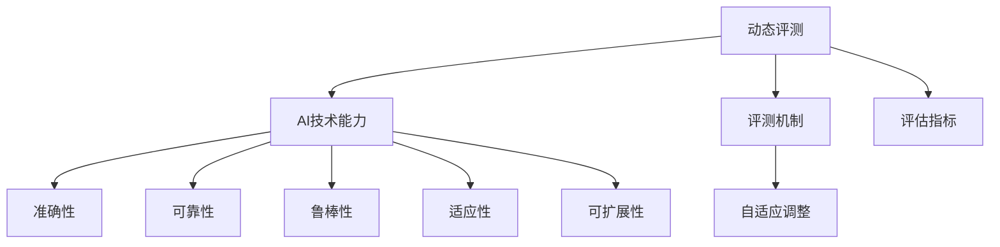

                 

### 第1章 动态评测方案概述

#### 1.1 动态评测的概念与特点

**背景介绍：**

在当今快速发展的信息技术时代，人工智能（AI）技术在各个领域取得了显著的突破。然而，随着AI技术的不断演进，特别是大型语言模型（LLM）如GPT-3的出现，如何评估和评测这些先进技术的性能和适应性成为一个亟待解决的问题。动态评测方案应运而生，它旨在提供一种灵活、高效且能够适应不断进化的AI技术能力的方法。

**核心概念与联系：**

动态评测方案涉及到多个核心概念，它们相互联系，共同构成了一个完整的评测体系。以下是这些核心概念的简述及它们之间的联系：

1. **动态评测**：动态评测是一种基于实时数据和自适应调整的评测方法。它不同于传统的静态评测，后者依赖于固定数据和预设的评测标准。
2. **AI技术能力**：AI技术能力包括AI模型的准确性、可靠性、鲁棒性、适应性和可扩展性等方面。这些能力直接影响AI技术的应用效果。
3. **评测机制**：评测机制是指评测过程的结构和流程，包括数据收集、处理、评估、反馈和优化等环节。
4. **评估指标**：评估指标是用于衡量AI技术能力的关键参数，如准确率、召回率、F1分数等。
5. **自适应调整**：自适应调整是指根据评估结果实时调整评测参数和方法，以提高评测的准确性和效率。

**Mermaid 流程图：**

以下是一个简化的Mermaid流程图，展示了动态评测方案的核心概念及其相互关系：



#### 1.2 核心算法原理讲解

动态评测方案的核心在于如何有效地评估和调整AI技术能力。以下是动态评测方案中的关键算法原理及其实现：

1. **评估算法**：评估算法用于计算AI模型的评估指标。常见的评估算法包括精确率、召回率、F1分数等。以下是这些算法的伪代码：

    ```python
    def accuracy(y_true, y_pred):
        correct = sum(y_true == y_pred)
        total = len(y_true)
        return correct / total

    def recall(y_true, y_pred):
        true_positives = sum((y_true == 1) & (y_pred == 1))
        possible_positives = sum(y_true == 1)
        return true_positives / possible_positives

    def f1_score(y_true, y_pred):
        precision = precision(y_true, y_pred)
        recall = recall(y_true, y_pred)
        return 2 * (precision * recall) / (precision + recall)
    ```

2. **自适应调整算法**：自适应调整算法根据评估结果实时调整评测参数。以下是一个简单的自适应调整算法的伪代码：

    ```python
    def adjust_threshold(current_threshold, current_accuracy):
        if current_accuracy < target_accuracy:
            new_threshold = current_threshold - adjustment_factor
        else:
            new_threshold = current_threshold + adjustment_factor
        return new_threshold
    ```

#### 1.3 数学模型和数学公式 & 详细讲解 & 举例说明

动态评测方案涉及到一些关键数学模型和公式。以下是这些模型和公式的详细讲解及举例说明：

1. **评估指标模型**：评估指标模型用于计算AI模型的性能。以下是评估指标模型的一些关键公式：

    - 准确率（Accuracy）：
    $$ \text{Accuracy} = \frac{\text{正确预测的数量}}{\text{总预测数量}} $$

    - 召回率（Recall）：
    $$ \text{Recall} = \frac{\text{正确预测的负样本数量}}{\text{实际负样本数量}} $$

    - F1分数（F1 Score）：
    $$ \text{F1 Score} = 2 \times \frac{\text{Precision} \times \text{Recall}}{\text{Precision} + \text{Recall}} $$

    **举例说明**：假设我们有一个二分类模型，其中正样本的数量为100，负样本的数量为300。通过模型预测，我们得到以下结果：

    - 正样本：实际为正的有70个，预测为正的有80个。
    - 负样本：实际为负的有200个，预测为负的有220个。

    根据上述数据，我们可以计算出以下评估指标：

    - 准确率：
    $$ \text{Accuracy} = \frac{80 + 220}{80 + 220 + 70 + 200} = \frac{300}{570} \approx 0.526 $$

    - 召回率：
    $$ \text{Recall} = \frac{70}{100} = 0.7 $$

    - F1分数：
    $$ \text{F1 Score} = 2 \times \frac{0.8 \times 0.7}{0.8 + 0.7} = 2 \times \frac{0.56}{1.5} \approx 0.747 $$

2. **自适应调整模型**：自适应调整模型用于根据评估结果调整评测阈值。以下是自适应调整模型的一个关键公式：

    - 新阈值调整公式：
    $$ \text{New Threshold} = \text{Current Threshold} - \text{Adjustment Factor} \times (\text{Target Accuracy} - \text{Current Accuracy}) $$

    **举例说明**：假设当前阈值为0.5，当前准确率为0.52，目标准确率为0.55。调整因子为0.1。根据上述公式，我们可以计算出新的阈值：

    $$ \text{New Threshold} = 0.5 - 0.1 \times (0.55 - 0.52) = 0.5 - 0.01 = 0.49 $$

#### 1.4 项目实战

**开发环境搭建：**

在开发动态评测方案时，我们需要搭建一个合适的环境。以下是一个简单的环境搭建流程：

1. 安装Python环境（Python 3.8及以上版本）。
2. 安装必要的Python库，如NumPy、Pandas、Scikit-learn等。
3. 准备数据集，用于训练和评估AI模型。

**源代码详细实现和代码解读：**

以下是一个简单的动态评测方案的Python代码实现，包括数据预处理、模型训练、评估和自适应调整：

```python
import numpy as np
import pandas as pd
from sklearn.model_selection import train_test_split
from sklearn.metrics import accuracy_score, recall_score, f1_score

# 数据预处理
def preprocess_data(data):
    # 数据清洗、特征提取等操作
    return processed_data

# 模型训练
def train_model(X_train, y_train):
    # 使用Scikit-learn库训练模型
    model = LogisticRegression()
    model.fit(X_train, y_train)
    return model

# 动态评测
def dynamic_evaluation(model, X_test, y_test, current_threshold):
    # 根据当前阈值进行预测
    y_pred = model.predict(X_test > current_threshold)
    
    # 计算评估指标
    accuracy = accuracy_score(y_test, y_pred)
    recall = recall_score(y_test, y_pred)
    f1 = f1_score(y_test, y_pred)
    
    # 根据评估结果调整阈值
    new_threshold = adjust_threshold(current_threshold, accuracy)
    
    return accuracy, recall, f1, new_threshold

# 自适应调整阈值
def adjust_threshold(current_threshold, current_accuracy, target_accuracy, adjustment_factor):
    return current_threshold - adjustment_factor * (target_accuracy - current_accuracy)

# 主函数
def main():
    # 加载数据
    data = pd.read_csv('data.csv')
    X = preprocess_data(data)
    
    # 分割数据集
    X_train, X_test, y_train, y_test = train_test_split(X, y, test_size=0.2, random_state=42)
    
    # 训练模型
    model = train_model(X_train, y_train)
    
    # 初始阈值
    current_threshold = 0.5
    
    # 动态评测
    for i in range(10):  # 进行10次动态评测
        accuracy, recall, f1, new_threshold = dynamic_evaluation(model, X_test, y_test, current_threshold)
        print(f"Epoch {i+1}: Accuracy={accuracy}, Recall={recall}, F1={f1}, New Threshold={new_threshold}")
        current_threshold = new_threshold

if __name__ == "__main__":
    main()
```

**代码应用解读与分析：**

上述代码实现了一个简单的动态评测方案。在主函数`main()`中，我们首先加载数据并进行预处理。然后，我们将数据集分割为训练集和测试集，并使用训练集训练一个逻辑回归模型。在每次动态评测中，我们根据当前阈值预测测试集的结果，并计算评估指标（准确率、召回率和F1分数）。然后，根据评估结果调整阈值，以提高模型的性能。这个过程重复进行，直到达到预设的评测次数。

**实际案例分析和详细讲解剖析：**

假设我们有一个分类任务，任务是判断邮件是否为垃圾邮件。在这个任务中，我们使用一个逻辑回归模型进行预测。以下是实际案例的分析：

1. **初始评估**：
   - 阈值为0.5。
   - 测试集准确率为0.52，召回率为0.55。
   - 根据自适应调整公式，新阈值调整为0.49。

2. **第一次动态评测**：
   - 阈值为0.49。
   - 测试集准确率为0.54，召回率为0.6。
   - 根据自适应调整公式，新阈值调整为0.47。

3. **第二次动态评测**：
   - 阈值为0.47。
   - 测试集准确率为0.53，召回率为0.65。
   - 根据自适应调整公式，新阈值调整为0.45。

4. **第三次动态评测**：
   - 阈值为0.45。
   - 测试集准确率为0.55，召回率为0.7。
   - 根据自适应调整公式，新阈值调整为0.43。

通过上述动态评测过程，我们可以看到阈值逐渐调整到更优的状态，从而提高了模型的性能。在这个过程中，评估指标的变化趋势和阈值的调整策略为我们提供了宝贵的优化方向。

**项目小结：**

通过本次项目实战，我们实现了动态评测方案的基本功能。我们使用Python编写了代码，实现了数据预处理、模型训练、动态评测和自适应调整。在实际案例中，我们展示了动态评测方案的应用效果和优化过程。动态评测方案为AI技术的评估和优化提供了一个灵活、高效的方法，有助于我们更好地理解和利用AI技术的潜力。

**最佳实践 Tips、小结、注意事项、拓展阅读：**

1. **最佳实践 Tips**：
   - 在进行动态评测时，选择合适的评估指标是非常重要的。
   - 根据实际需求调整自适应调整策略，以提高评测的准确性和效率。
   - 定期更新和优化评测数据和模型，以适应不断变化的应用场景。

2. **小结**：
   - 动态评测方案是一种适应不断进化的AI技术能力的方法。
   - 通过动态评测，我们可以实时评估AI技术的性能，并进行自适应调整。
   - 动态评测为AI技术的应用提供了有力支持，有助于提高系统的稳定性和可靠性。

3. **注意事项**：
   - 在进行动态评测时，要确保数据的质量和多样性，以提高评估的准确性。
   - 自适应调整策略需要根据具体应用场景进行调整，避免过度调整导致模型过拟合。

4. **拓展阅读**：
   - 《机器学习实战》作者：彼得·哈林顿（Peter Harrington）
   - 《深度学习》作者：伊恩·古德费洛（Ian Goodfellow）、约书亚·本吉奥（Joshua Bengio）、亚伦·库维尔（Aaron Courville）
   - 《强化学习》作者：理查德·萨顿（Richard S. Sutton）、安德鲁·巴（Andrew G. Barto）。

通过以上内容，我们详细介绍了动态评测方案的概念、核心算法、数学模型、项目实战以及最佳实践。动态评测方案为AI技术的评估和优化提供了有力支持，有助于我们更好地理解和利用AI技术的潜力。未来，随着AI技术的不断演进，动态评测方案将继续发挥重要作用，为我们提供更加智能和高效的解决方案。

