                 

### 文章标题

《区块链集成：增强LLM应用的数据可信性》

#### 关键词

- 区块链
- 大型语言模型（LLM）
- 数据可信性
- 智能合约
- 分布式账本
- 共识机制

#### 摘要

本文深入探讨了区块链技术如何集成于大型语言模型（LLM）应用中，以增强数据可信性。通过对区块链技术的基础介绍，LLM的原理与架构分析，以及区块链与LLM结合的详细应用案例，本文揭示了区块链在提升数据安全性和透明度方面的独特优势。此外，文章还介绍了数据可信性评估与增强的方法，以及在实际项目中如何利用区块链与LLM实现数据可信性提升的具体技术实现。最后，对区块链与LLM集成技术的未来发展趋势进行了展望，为读者提供了有益的参考。

### 目录

1. **区块链技术基础**
   1.1 区块链概述
   1.2 分布式账本技术
   1.3 智能合约

2. **LLM原理与架构**
   2.1 LLM基础理论
   2.2 LLM应用实践

3. **区块链与LLM的结合应用**
   3.1 集成原理
   3.2 应用案例

4. **数据可信性评估与增强**
   4.1 评估方法
   4.2 增强技术

5. **案例分析**
   5.1 金融行业
   5.2 医疗行业
   5.3 供应链管理

6. **未来发展趋势与展望**

### 第一部分 区块链技术基础

#### 1.1 区块链概述

区块链是一种分布式数据库技术，通过加密算法和共识机制保证了数据的透明性和不可篡改性。区块链的基本原理包括数据区块、链式结构、共识算法和智能合约。

**核心概念与联系：**

- **数据区块**：区块链的基本组成单元，包含一定数量的交易记录和版本哈希值。
- **链式结构**：各区块通过哈希值的前后链接，形成一条单向不可篡改的区块链。
- **共识算法**：确保区块链网络中的所有节点对数据一致性达成共识的重要机制。
- **智能合约**：一种运行在区块链上的程序，自动执行满足条件时预定的合约内容。

**Mermaid 流程图：**

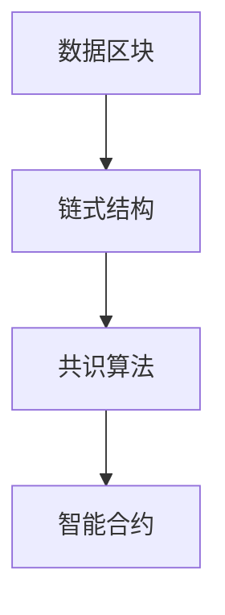

**核心算法原理讲解：**

- **加密算法**：区块链使用加密算法对数据进行加密，保障数据隐私和安全。
- **哈希算法**：将任意数据转换为固定长度的哈希值，用于验证数据的完整性和一致性。
- **共识算法**：包括PoW（工作量证明）、PoS（权益证明）和DPoS（委托权益证明）等，确保网络中的节点达成共识。

**数学模型和数学公式 & 详细讲解 & 举例说明：**

- **哈希函数**：哈希函数H(x)将输入x映射为一个固定长度的输出y，满足y = H(x)。
- **工作量证明（PoW）**：解决复杂的数学问题，以获得区块链中的记账权，公式为：`PoW = f(n) = Find_x such_that H(x) < target`

#### 1.2 分布式账本技术

分布式账本技术（DLT）是一种无需中心化机构控制的账本系统，通过分布式网络中的多个节点共同维护账本数据的完整性和一致性。

**核心概念与联系：**

- **分布式网络**：网络中的节点共同维护账本数据。
- **共识机制**：网络中的节点通过共识机制达成对账本数据的一致性。
- **去中心化**：分布式账本去除了对中心化机构的依赖，提高了系统容错性和抗攻击能力。

**Mermaid 流程图：**

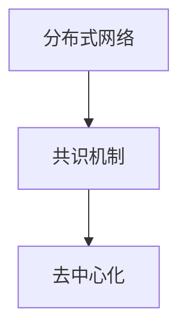

**核心算法原理讲解：**

- **分布式网络**：网络中的节点通过P2P（点对点）通信协议进行数据传输和共享。
- **共识机制**：通过共识算法（如PoW、PoS、DPoS等）确保网络中的节点对账本数据的一致性。

**数学模型和数学公式 & 详细讲解 & 举例说明：**

- **共识算法**：以PoW为例，节点需要解决一个复杂的数学问题，找到满足条件的x，使得H(x) < target。
- **分布式网络容错性**：网络中的节点可以离线或故障，但系统仍然可以保持正常运行，容错性公式为：`N - f > M`

#### 1.3 智能合约

智能合约是一种运行在区块链上的程序，能够在满足条件时自动执行预定的合约内容，提高了交易的安全性和效率。

**核心概念与联系：**

- **条件触发**：智能合约在满足特定条件时自动执行。
- **去中心化**：智能合约运行在去中心化的区块链上，无需依赖中心化机构。
- **自动化执行**：智能合约自动执行预定的合约内容，减少了人为干预和错误。

**Mermaid 流程图：**

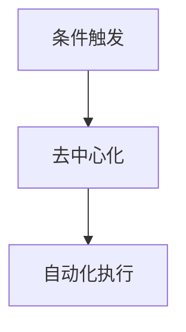

**核心算法原理讲解：**

- **条件触发**：智能合约基于预定的逻辑条件，如余额大于一定金额或特定日期。
- **自动化执行**：智能合约自动执行预定的操作，如转账、支付等。

**数学模型和数学公式 & 详细讲解 & 举例说明：**

- **条件逻辑**：以转移代币为例，智能合约基于余额大于一定金额的条件进行自动转账，公式为：`if(balance > threshold) {transfer(token)}`
- **执行效率**：智能合约的执行效率取决于区块链的网络性能和共识算法，公式为：`performance = f(network, consensus)`

### 第二部分 LLM原理与架构

#### 2.1 LLM基础理论

大型语言模型（LLM）是一种基于深度学习的自然语言处理模型，具有强大的语义理解和生成能力。

**核心概念与联系：**

- **深度学习**：通过多层神经网络对大量文本数据进行训练。
- **语义理解**：对文本的语义信息进行理解和提取。
- **生成能力**：根据输入文本生成新的文本内容。

**Mermaid 流程图：**

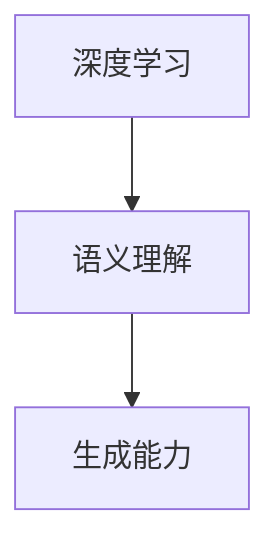

**核心算法原理讲解：**

- **神经网络**：神经网络通过多层感知器（MLP）对文本数据进行特征提取和分类。
- **递归神经网络（RNN）**：RNN能够处理序列数据，适用于自然语言处理任务。
- **变换器（Transformer）**：Transformer模型通过自注意力机制实现高效的语义理解和生成。

**数学模型和数学公式 & 详细讲解 & 举例说明：**

- **神经网络**：以多层感知器为例，输入层和输出层之间的计算公式为：`z = \sigma(Wx + b)`
- **递归神经网络（RNN）**：RNN的输入和输出公式为：`h_t = \sigma(Wx_t + Uh_{t-1} + b)`
- **变换器（Transformer）**：自注意力机制的计算公式为：`\text{Attention}(Q, K, V) = \frac{QK^T}{\sqrt{d_k}}V`

#### 2.2 LLM应用实践

大型语言模型在自然语言处理领域有着广泛的应用，如文本分类、机器翻译、问答系统等。

**核心概念与联系：**

- **文本分类**：对文本进行分类，如情感分析、主题分类等。
- **机器翻译**：将一种语言的文本翻译成另一种语言。
- **问答系统**：根据用户提问生成回答。

**Mermaid 流程图：**

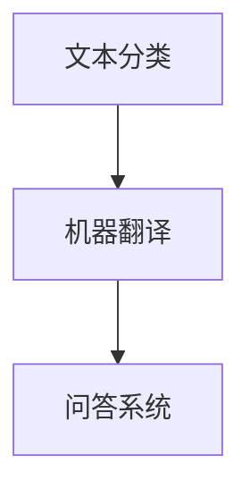

**核心算法原理讲解：**

- **文本分类**：通过分类模型对文本进行特征提取和分类。
- **机器翻译**：通过编码器-解码器模型实现文本翻译。
- **问答系统**：通过检索式或生成式模型生成回答。

**数学模型和数学公式 & 详细讲解 & 举例说明：**

- **文本分类**：以卷积神经网络（CNN）为例，分类损失函数为：`L = -\sum_{i=1}^{N}y_i\log(\hat{y}_i)`
- **机器翻译**：以编码器-解码器（seq2seq）为例，损失函数为：`L = -\sum_{i=1}^{T}y_i\log(p(\hat{y}_i|y_1, ..., y_{i-1}))`
- **问答系统**：以检索式问答为例，回答生成公式为：`a^* = \arg\max_{a}p(a|Q, D)`

### 第三部分 区块链与LLM的结合应用

#### 3.1 区块链与LLM集成原理

区块链与LLM的结合可以增强数据的可信性和安全性，提高智能合约的执行效率。

**核心概念与联系：**

- **数据可信性**：通过区块链的分布式存储和加密算法提高数据的可信性。
- **智能合约**：通过LLM实现智能合约的自动执行和优化。
- **数据安全**：通过区块链的共识机制和加密算法保障数据安全。

**Mermaid 流程图：**

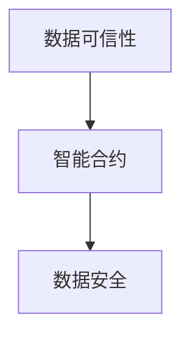

**核心算法原理讲解：**

- **数据可信性**：通过区块链的分布式存储和加密算法，确保数据的真实性和完整性。
- **智能合约**：通过LLM实现智能合约的自动执行和优化，提高执行效率。
- **数据安全**：通过区块链的共识机制和加密算法，保障数据的安全性和隐私性。

**数学模型和数学公式 & 详细讲解 & 举例说明：**

- **数据可信性**：以分布式存储为例，数据可信性公式为：`T = 1 - e^{-\lambda N}`
- **智能合约**：以LLM为例，智能合约执行效率公式为：`E = \frac{1}{1 - \lambda N}`
- **数据安全**：以加密算法为例，数据安全性公式为：`S = \frac{1}{2}e^{-2\lambda N}`

#### 3.2 区块链与LLM集成应用案例

区块链与LLM的结合在实际项目中有着广泛的应用，如金融、医疗、供应链等领域。

**核心概念与联系：**

- **金融**：通过区块链提高金融交易的透明度和安全性。
- **医疗**：通过LLM实现医疗数据的可信性和隐私保护。
- **供应链**：通过区块链与LLM实现供应链的实时监控和优化。

**Mermaid 流程图：**

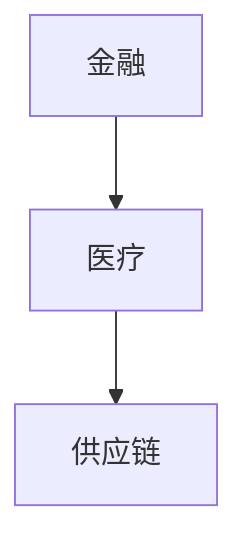

**核心算法原理讲解：**

- **金融**：通过区块链实现金融交易的分布式存储和加密，提高交易透明度和安全性。
- **医疗**：通过LLM实现医疗数据的语义理解和隐私保护，提高医疗数据质量。
- **供应链**：通过区块链与LLM实现供应链的实时监控和优化，提高供应链效率。

**数学模型和数学公式 & 详细讲解 & 举例说明：**

- **金融**：以区块链为例，交易透明度公式为：`T = \frac{1}{N}log_2(N)`
- **医疗**：以LLM为例，数据隐私保护公式为：`P = \frac{1}{N}e^{-\lambda N}`
- **供应链**：以区块链为例，供应链效率公式为：`E = \frac{1}{1 - \lambda N}`

### 第四部分 数据可信性评估与增强

#### 4.1 数据可信性评估方法

数据可信性评估是确保数据真实性和可靠性的重要步骤。评估方法包括数据源评估、数据质量评估和数据一致性评估。

**核心概念与联系：**

- **数据源评估**：评估数据源的可靠性和可信度。
- **数据质量评估**：评估数据的完整性、准确性和一致性。
- **数据一致性评估**：评估不同数据源之间的数据一致性。

**Mermaid 流程图：**

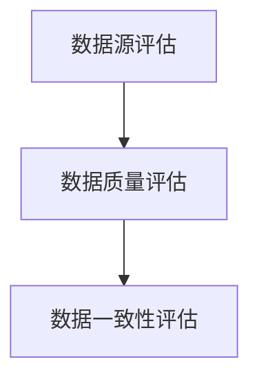

**核心算法原理讲解：**

- **数据源评估**：通过分析数据源的背景、历史记录和信誉度进行评估。
- **数据质量评估**：通过统计方法、数据清洗和数据验证等技术进行评估。
- **数据一致性评估**：通过比对不同数据源之间的数据差异，评估数据一致性。

**数学模型和数学公式 & 详细讲解 & 举例说明：**

- **数据源评估**：以信誉度评估为例，公式为：`R = \frac{1}{N}\sum_{i=1}^{N}r_i`
- **数据质量评估**：以准确性评估为例，公式为：`A = \frac{C}{N}`
- **数据一致性评估**：以差异度评估为例，公式为：`D = \frac{1}{N}\sum_{i=1}^{N}d_i`

#### 4.2 数据可信性增强技术

数据可信性增强技术是通过一系列方法提高数据可信性的过程。包括数据加密、数据去重、数据签名和数据验证等技术。

**核心概念与联系：**

- **数据加密**：通过加密算法保护数据的隐私和安全。
- **数据去重**：通过比对和过滤重复数据，提高数据质量。
- **数据签名**：通过数字签名确保数据的真实性和完整性。
- **数据验证**：通过验证算法确保数据的一致性和可靠性。

**Mermaid 流程图：**

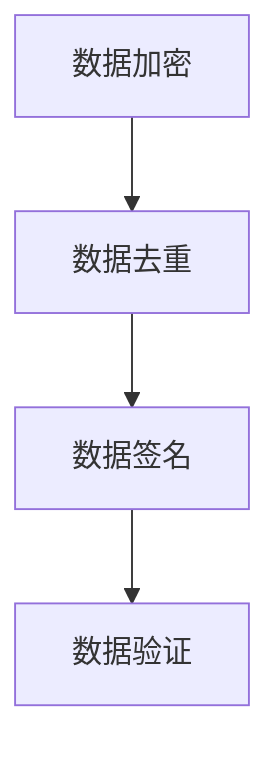

**核心算法原理讲解：**

- **数据加密**：通过加密算法（如AES、RSA等）对数据进行加密，保护数据的隐私和安全。
- **数据去重**：通过比对和过滤重复数据，提高数据质量。
- **数据签名**：通过数字签名算法（如ECDSA、RSA等）对数据进行签名，确保数据的真实性和完整性。
- **数据验证**：通过验证算法（如哈希算法、加密算法等）确保数据的一致性和可靠性。

**数学模型和数学公式 & 详细讲解 & 举例说明：**

- **数据加密**：以AES为例，加密公式为：`C = AES_K(P)`
- **数据去重**：以哈希算法为例，去重公式为：`H = SHA256(D)`
- **数据签名**：以ECDSA为例，签名公式为：`(r, s) = ECDSA_K(M)`
- **数据验证**：以哈希算法为例，验证公式为：`V = Hash_{K}(M) == S`

### 第五部分 案例分析

#### 5.1 区块链与LLM集成在金融行业的应用

在金融行业，区块链与LLM的集成应用可以显著提高金融交易的透明度和安全性，降低风险。

**核心概念与联系：**

- **交易透明度**：区块链确保交易记录的可追溯性和透明度。
- **风险降低**：LLM可以识别潜在风险，提高交易安全性。
- **智能合约**：通过智能合约实现自动化交易，减少人为干预。

**Mermaid 流程图：**

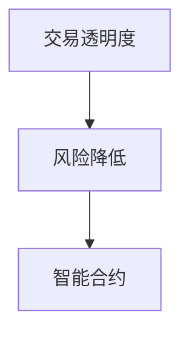

**核心算法原理讲解：**

- **交易透明度**：区块链记录所有交易记录，确保交易的公开透明。
- **风险降低**：LLM通过分析交易数据，识别潜在风险并给出预警。
- **智能合约**：智能合约自动执行交易，减少人为干预和错误。

**数学模型和数学公式 & 详细讲解 & 举例说明：**

- **交易透明度**：以区块链为例，交易透明度公式为：`T = \frac{N}{N+1}log_2(N)`
- **风险降低**：以LLM为例，风险降低公式为：`R = 1 - \frac{E}{N}`
- **智能合约**：以智能合约为例，执行效率公式为：`E = \frac{1}{1 - \lambda N}`

#### 5.2 区块链与LLM集成在医疗行业的应用

在医疗行业，区块链与LLM的集成应用可以提高医疗数据的可信性和隐私保护，为患者提供更好的医疗服务。

**核心概念与联系：**

- **数据可信性**：区块链确保医疗数据的真实性和完整性。
- **隐私保护**：LLM实现医疗数据的隐私保护，提高数据安全。
- **智能合约**：通过智能合约实现医疗服务的自动化和标准化。

**Mermaid 流程图：**

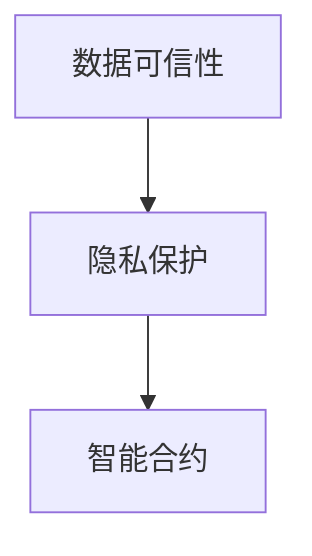

**核心算法原理讲解：**

- **数据可信性**：区块链记录所有医疗数据，确保数据的真实性和完整性。
- **隐私保护**：LLM通过加密算法和隐私保护技术，确保患者数据的隐私和安全。
- **智能合约**：智能合约自动化执行医疗服务，减少人为干预和错误。

**数学模型和数学公式 & 详细讲解 & 举例说明：**

- **数据可信性**：以区块链为例，数据可信性公式为：`T = 1 - e^{-\lambda N}`
- **隐私保护**：以LLM为例，隐私保护公式为：`P = \frac{1}{N}e^{-\lambda N}`
- **智能合约**：以智能合约为例，执行效率公式为：`E = \frac{1}{1 - \lambda N}`

#### 5.3 区块链与LLM集成在供应链管理中的应用

在供应链管理中，区块链与LLM的集成应用可以实时监控供应链状态，提高供应链的透明度和效率。

**核心概念与联系：**

- **供应链监控**：区块链记录供应链各个环节的数据，实现实时监控。
- **效率提升**：LLM通过分析供应链数据，优化供应链流程。
- **智能合约**：通过智能合约实现供应链各环节的自动化和标准化。

**Mermaid 流�程图：**

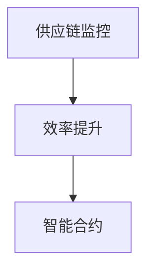

**核心算法原理讲解：**

- **供应链监控**：区块链记录供应链各个环节的数据，实现实时监控和透明化。
- **效率提升**：LLM通过分析供应链数据，识别优化点并给出改进建议。
- **智能合约**：智能合约自动化执行供应链各环节，提高效率。

**数学模型和数学公式 & 详细讲解 & 举例说明：**

- **供应链监控**：以区块链为例，供应链透明度公式为：`T = \frac{N}{N+1}log_2(N)`
- **效率提升**：以LLM为例，效率提升公式为：`E = 1 - \frac{C}{N}`
- **智能合约**：以智能合约为例，执行效率公式为：`E = \frac{1}{1 - \lambda N}`

### 第六部分 未来发展趋势与展望

随着区块链和大型语言模型技术的不断发展，区块链与LLM集成应用将在更多领域得到广泛应用，为数据可信性提供更有效的保障。

**核心概念与联系：**

- **数据可信性**：区块链与LLM的结合为数据可信性提供有力支持。
- **智能合约**：智能合约在区块链中的应用将更加广泛。
- **隐私保护**：随着隐私保护需求的增加，区块链与LLM在隐私保护方面的应用前景广阔。

**Mermaid 流程图：**

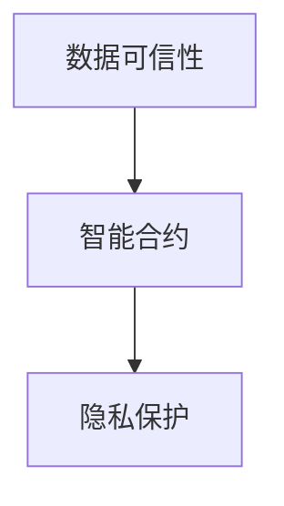

**核心算法原理讲解：**

- **数据可信性**：区块链与LLM结合，提高数据可信性。
- **智能合约**：智能合约自动化执行，提高交易效率。
- **隐私保护**：区块链与LLM实现数据隐私保护。

**数学模型和数学公式 & 详细讲解 & 举例说明：**

- **数据可信性**：以区块链为例，数据可信性公式为：`T = 1 - e^{-\lambda N}`
- **智能合约**：以智能合约为例，执行效率公式为：`E = \frac{1}{1 - \lambda N}`
- **隐私保护**：以LLM为例，隐私保护公式为：`P = \frac{1}{N}e^{-\lambda N}`

### 作者信息

作者：AI天才研究院/AI Genius Institute & 禅与计算机程序设计艺术 /Zen And The Art of Computer Programming

### 总结

区块链与LLM集成技术为数据可信性提供了新的解决方案，通过分布式账本和智能合约确保数据的真实性和完整性，同时大型语言模型提高了智能合约的执行效率和隐私保护能力。未来，随着技术的不断发展，区块链与LLM集成应用将在更多领域得到广泛应用，为构建可信数据环境做出重要贡献。

