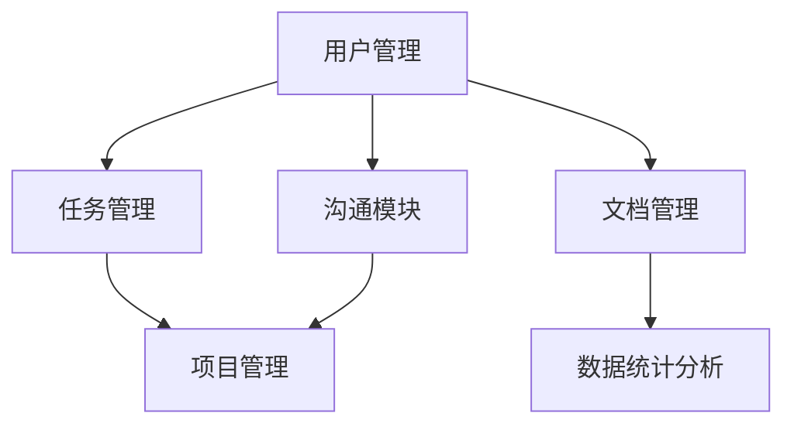

                 

### 文章标题

协作平台的定制与应用：支持灵活的需求管理

### 关键词

协作平台、需求管理、定制化、应用实践、灵活应对

### 摘要

本文旨在探讨协作平台的定制与应用，特别是在支持灵活需求管理方面的实践。通过详细分析协作平台的核心概念、架构设计、需求管理技术实现，以及定制化与应用实践，本文提供了系统性、可操作性的解决方案，帮助企业在快速变化的市场环境中，通过灵活的需求管理提高协作效率和创新能力。

## 引言

在当今信息化、网络化高速发展的时代，协作平台作为一种集成了沟通、协作、管理和分享功能的信息系统，已经在各类企业和组织中得到广泛应用。协作平台不仅能够促进团队成员之间的沟通和协作，还能有效管理项目进度、资源和信息，提高工作效率和项目成功率。

### 协作平台的重要性

协作平台在现代化企业管理中扮演着至关重要的角色。首先，它为团队成员提供了一个统一的工作空间，使得信息共享和沟通变得更加便捷和高效。其次，协作平台能够自动化管理项目流程，降低人工操作错误的风险。最后，协作平台还能够根据企业的实际需求进行定制，实现个性化的业务流程和管理模式。

### 书籍目的与结构

本书籍的目的是为IT专业人士和企业管理者提供一本全面、实用的协作平台设计与应用指南，特别是针对支持灵活需求管理方面的深入探讨。本书分为五个主要部分：

1. 引言与概述：介绍协作平台的重要性，阐述书籍的目的与结构。
2. 协作平台核心概念与架构：讲解协作平台的核心概念及其架构设计。
3. 需求管理技术实现：详细阐述需求收集、变更管理、需求文档编写和需求跟踪与监控的技术方法。
4. 协作平台定制与应用：分析定制化需求分析、定制化设计和应用实践。
5. 支持灵活需求管理的策略与方法：探讨灵活需求管理策略、方法和持续改进与优化的最佳实践。

通过这五个部分的内容，读者可以全面了解协作平台的设计与应用，掌握支持灵活需求管理的核心技术和实践方法。

## 协作平台的定义与范围

### 协作平台的基本概念

协作平台是一种集成了多种功能模块，旨在促进信息共享、任务协作和资源管理的软件系统。它通常包含以下几个核心功能模块：

1. **沟通模块**：提供即时消息、邮件、电话等多种沟通方式，确保团队成员之间的信息畅通无阻。
2. **协作模块**：支持任务分配、进度追踪、文档共享和合作编辑等功能，使得团队成员能够协同工作，提高工作效率。
3. **项目管理模块**：帮助团队管理项目进度、资源分配和风险管理，确保项目按时按质完成。
4. **文档管理模块**：提供文档上传、下载、版本控制和共享等功能，确保团队所有成员都能够访问到最新的文档资料。
5. **资源共享模块**：提供文件共享、知识库和论坛等功能，促进团队内部知识和资源的共享与交流。

### 协作平台的应用领域

协作平台的应用范围非常广泛，几乎涵盖了所有类型的企业和组织。以下是几个典型的应用领域：

1. **企业内部协作**：在大型企业中，协作平台能够帮助各个部门之间进行高效的沟通和协作，实现跨部门的业务流程整合和管理。
2. **项目管理**：对于项目团队来说，协作平台提供了项目管理所需的各项功能，如任务分配、进度追踪、资源管理等，有助于确保项目顺利进行。
3. **远程办公**：随着远程办公的普及，协作平台成为远程团队成员之间沟通和协作的重要工具，确保远程工作的高效和顺畅。
4. **客户服务**：一些企业使用协作平台来管理客户关系，提供及时、高效的客户服务和反馈，提高客户满意度。
5. **创新协作**：协作平台可以促进创新活动的开展，通过团队协作和资源共享，加速新产品的开发和市场的推广。

总之，协作平台在现代企业管理中的应用具有重要意义，它不仅能够提高团队协作效率，还能帮助企业应对快速变化的市场环境，提升竞争力和创新能力。

### 需求管理的核心概念

需求管理是协作平台实现有效管理和应用的关键环节，它涉及多个核心概念，包括需求定义、需求分类和需求管理流程。以下是对这些核心概念的详细探讨。

#### 需求定义

需求定义是需求管理的起点，它明确了协作平台所需的功能、性能和其他特性。需求定义的过程通常包括以下几个步骤：

1. **识别需求**：通过与用户、客户和其他相关利益相关者的交流，了解他们的实际需求和期望。
2. **需求文档**：将识别出的需求整理成需求文档，文档中应详细描述需求的功能、性能、约束和优先级。
3. **需求评审**：对需求文档进行评审，确保需求明确、合理且可实现。

#### 需求分类

需求分类有助于对需求进行有效管理和优先级排序。常见的需求分类方法包括：

1. **功能需求**：描述系统应具备的功能特性，如用户管理、任务分配、文档共享等。
2. **非功能需求**：描述系统的非功能性需求，如性能、安全性、可用性和可扩展性等。
3. **业务需求**：从业务角度出发，描述系统如何支持企业的核心业务流程和目标。
4. **用户需求**：从用户角度出发，描述用户期望系统提供的功能和服务。

#### 需求管理流程

需求管理流程是确保需求从识别、分析到实现全过程有序进行的重要机制。以下是需求管理的基本流程：

1. **需求收集**：通过各种途径收集用户需求，包括问卷调查、访谈、会议等。
2. **需求分析**：对收集到的需求进行分类、优先级排序和分析，确保需求合理、可行。
3. **需求文档**：将分析后的需求整理成需求文档，并进行评审和确认。
4. **需求跟踪**：对需求从识别到实现的全过程进行监控和跟踪，确保需求得到有效落实。
5. **需求变更管理**：在项目执行过程中，需求可能会发生变化，需求变更管理旨在确保变更的合理性和可控性。

通过理解需求管理的核心概念，协作平台开发团队能够更有效地识别和满足用户需求，从而提升平台的实用性和用户满意度。

### 本书结构

本书旨在为读者提供一部全面、深入的协作平台定制与应用指南，特别是针对支持灵活需求管理方面的内容。为了帮助读者更好地理解和应用本书的知识，我们将其分为以下五个主要部分：

**第一部分：引言与概述**
- **第1章 引言与概述**：介绍协作平台的重要性，阐述本书的目的与结构，为后续章节的内容奠定基础。

**第二部分：协作平台核心概念与架构**
- **第2章 协作平台核心概念与架构**：讲解协作平台的基本概念、架构设计及其组件和模块的划分。

**第三部分：需求管理技术实现**
- **第3章 需求管理技术实现**：详细阐述需求收集与分类、需求变更管理、需求文档编写和需求跟踪与监控的技术方法和工具。

**第四部分：协作平台定制与应用**
- **第4章 协作平台定制与应用**：分析定制化需求分析、定制化设计和应用实践，展示如何根据企业实际需求进行平台定制。

**第五部分：支持灵活需求管理的策略与方法**
- **第5章 支持灵活需求管理的策略与方法**：探讨灵活需求管理策略、方法以及持续改进与优化的最佳实践。

通过这五个部分的内容，本书旨在帮助读者全面掌握协作平台的定制与应用，掌握支持灵活需求管理的核心技术和实践方法，从而提升企业协作效率和创新能力。

### 协作平台架构概述

协作平台的架构设计是确保其功能全面、性能稳定、易于扩展和高效管理的关键。以下是协作平台架构的概述，包括系统架构设计、组件与模块划分，以及Mermaid流程图的使用。

#### 系统架构设计

协作平台通常采用三层架构设计，即表示层、业务逻辑层和数据层。这种架构设计能够实现各层职责的分离，提高系统的可维护性和扩展性。

1. **表示层**：负责用户界面设计和用户交互，使用前端技术实现。包括HTML、CSS、JavaScript等。
2. **业务逻辑层**：处理业务逻辑和数据处理，包括服务端API、业务规则和算法。通常使用Java、Python、Node.js等后端技术实现。
3. **数据层**：负责数据的存储和管理，包括关系型数据库和非关系型数据库。例如MySQL、MongoDB等。

#### 组件与模块划分

协作平台由多个组件和模块组成，每个组件和模块都有明确的职责，以确保系统的整体性和功能性。

1. **用户管理模块**：负责用户注册、登录、权限管理等功能。
2. **任务管理模块**：负责任务的创建、分配、追踪和进度管理。
3. **文档管理模块**：负责文档的上传、下载、版本控制和共享。
4. **沟通模块**：提供即时消息、邮件和电话等多种沟通方式。
5. **项目管理模块**：支持项目进度追踪、资源管理和风险管理。
6. **数据统计分析模块**：提供实时数据分析和报告功能。

#### Mermaid流程图

为了更好地理解协作平台的架构设计，我们可以使用Mermaid流程图来展示各组件和模块之间的关联和交互。以下是一个简单的Mermaid流程图示例：



在这个流程图中，用户管理模块与任务管理模块、文档管理模块和沟通模块直接相关。任务管理模块与项目管理模块相关，而文档管理模块和数据统计分析模块也有直接的交互。这种流程图可以帮助开发团队更好地理解系统架构，确保各模块之间的高效协作。

通过上述架构设计和方法，协作平台能够实现功能全面、性能稳定、易于扩展和管理，从而满足各类企业和组织的协作需求。

### 数据模型设计

在协作平台的架构设计中，数据模型设计是确保系统性能、扩展性和数据一致性的关键环节。以下是数据模型设计的详细讲解，包括数据需求分析、关系型数据库设计、非关系型数据库设计等内容。

#### 数据需求分析

数据需求分析是数据模型设计的起点，其目标是明确系统所需的数据项和它们之间的关系。以下是协作平台中常见的数据需求：

1. **用户数据**：包括用户ID、用户名、密码、邮箱、角色、权限等。
2. **任务数据**：包括任务ID、任务名称、任务描述、任务状态、任务优先级、任务创建时间、任务截止时间等。
3. **文档数据**：包括文档ID、文档名称、文档路径、文档类型、文档创建时间、文档更新时间、文档权限等。
4. **沟通数据**：包括消息ID、发送者ID、接收者ID、发送时间、消息内容等。
5. **项目数据**：包括项目ID、项目名称、项目描述、项目状态、项目创建时间、项目截止时间等。

#### 关系型数据库设计

关系型数据库设计旨在利用关系模型来组织数据，确保数据的完整性和一致性。以下是协作平台中用户数据、任务数据和文档数据的关系型数据库设计示例：

**用户数据表（users）：**
```sql
CREATE TABLE users (
    id INT PRIMARY KEY AUTO_INCREMENT,
    username VARCHAR(255) UNIQUE NOT NULL,
    password VARCHAR(255) NOT NULL,
    email VARCHAR(255) UNIQUE NOT NULL,
    role ENUM('admin', 'user', 'guest') NOT NULL,
    permission VARCHAR(255)
);
```

**任务数据表（tasks）：**
```sql
CREATE TABLE tasks (
    id INT PRIMARY KEY AUTO_INCREMENT,
    title VARCHAR(255) NOT NULL,
    description TEXT,
    status ENUM('pending', 'in_progress', 'completed') NOT NULL,
    priority ENUM('low', 'medium', 'high') NOT NULL,
    created_at DATETIME DEFAULT CURRENT_TIMESTAMP,
    deadline DATETIME
);
```

**文档数据表（documents）：**
```sql
CREATE TABLE documents (
    id INT PRIMARY KEY AUTO_INCREMENT,
    name VARCHAR(255) NOT NULL,
    path VARCHAR(255) NOT NULL,
    type ENUM('text', 'image', 'video', 'pdf') NOT NULL,
    created_at DATETIME DEFAULT CURRENT_TIMESTAMP,
    updated_at DATETIME DEFAULT CURRENT_TIMESTAMP ON UPDATE CURRENT_TIMESTAMP,
    permission ENUM('public', 'private', 'group') NOT NULL
);
```

通过这些表的设计，我们可以有效地管理用户、任务和文档数据，并确保数据的一致性和完整性。

#### 非关系型数据库设计

非关系型数据库，如MongoDB，具有灵活的数据模型和高效的查询性能，适用于处理复杂的数据结构和海量数据。以下是协作平台中用户数据、任务数据和文档数据在MongoDB中的设计示例：

**用户数据（User）：**
```json
{
  "_id": ObjectId(""),
  "username": "string",
  "password": "string",
  "email": "string",
  "role": "string",
  "permissions": "string"
}
```

**任务数据（Task）：**
```json
{
  "_id": ObjectId(""),
  "title": "string",
  "description": "string",
  "status": "string",
  "priority": "string",
  "createdAt": Date(""),
  "deadline": Date("")
}
```

**文档数据（Document）：**
```json
{
  "_id": ObjectId(""),
  "name": "string",
  "path": "string",
  "type": "string",
  "createdAt": Date(""),
  "updatedAt": Date(""),
  "permission": "string"
}
```

通过这些设计，我们可以灵活地处理协作平台中的各类数据，并支持高效的查询和分析。

总之，数据模型设计是协作平台架构设计的重要组成部分，通过合理的数据需求分析和数据库设计，我们可以确保系统的高性能、高扩展性和数据一致性，为平台的稳定运行提供坚实的基础。

### 服务层设计

服务层是协作平台的核心部分，负责业务逻辑的处理和数据层的交互。以下是服务层设计的详细内容，包括RESTful API设计、微服务架构以及服务间通信机制。

#### RESTful API设计

RESTful API设计遵循REST（Representational State Transfer）架构风格，旨在通过标准化和简洁的接口设计，实现系统的易用性和扩展性。

1. **URL设计**：每个API接口都应该有清晰、简洁的URL，以方便调用和识别。
    - 用户管理接口：`/users`、`/users/{id}`
    - 任务管理接口：`/tasks`、`/tasks/{id}`
    - 文档管理接口：`/documents`、`/documents/{id}`
    - 项目管理接口：`/projects`、`/projects/{id}`

2. **HTTP方法**：根据操作类型选择适当的HTTP方法（GET、POST、PUT、DELETE等）。
    - 创建用户：`POST /users`
    - 获取用户列表：`GET /users`
    - 更新用户信息：`PUT /users/{id}`
    - 删除用户：`DELETE /users/{id}`

3. **响应格式**：通常使用JSON格式作为API响应的数据格式，便于客户端解析和使用。

以下是一个简单的用户管理API接口示例：

```json
// 创建用户
POST /users
{
  "username": "string",
  "password": "string",
  "email": "string",
  "role": "string",
  "permissions": "string"
}

// 获取用户列表
GET /users
{
  "users": [
    {
      "id": "string",
      "username": "string",
      "email": "string",
      "role": "string",
      "permissions": "string"
    }
  ]
}
```

#### 微服务架构

微服务架构将系统分解为多个小型、独立的服务模块，每个服务负责特定的业务功能。这种架构设计具有高可扩展性、高可靠性和高可维护性。

1. **服务拆分**：根据业务功能将系统拆分为多个独立的服务，例如用户服务、任务服务、文档服务等。
2. **服务通信**：使用轻量级的通信协议（如HTTP/HTTPS、gRPC等），实现服务间的数据交换和协同工作。
3. **服务容器化**：使用容器技术（如Docker）对服务进行封装，实现服务的快速部署和扩展。

#### 服务间通信机制

服务间通信机制是确保各服务模块能够高效、可靠地交互的关键。

1. **消息队列**：使用消息队列（如RabbitMQ、Kafka等）实现异步通信，确保高并发和负载均衡。
2. **服务发现**：使用服务发现机制（如Eureka、Consul等）实现服务注册和发现，简化服务调用。
3. **API网关**：使用API网关（如Kong、Zuul等）实现统一的接口管理和路由，提高系统的安全性、稳定性和可维护性。

通过上述服务层设计，协作平台能够实现功能模块的灵活拆分和独立部署，确保系统的高性能和高可用性，同时方便后续的扩展和维护。

### 用户界面设计

用户界面设计（UI/UX Design）是协作平台成功的重要因素之一，它直接影响用户的操作体验和系统的易用性。以下是用户界面设计的详细内容，包括前端框架选择、用户交互设计和响应式布局。

#### 前端框架选择

选择适合的前端框架对于确保UI的现代化和高效性至关重要。以下是一些常见的前端框架：

1. **React**：React是由Facebook开发的声明式UI库，具有高效的虚拟DOM机制和丰富的生态系统，适用于构建动态和交互性强的应用。
2. **Vue.js**：Vue.js是一个轻量级的前端框架，易于上手，适用于中小型应用。它提供了双向数据绑定和组件化开发，提高了开发效率。
3. **Angular**：Angular是由Google开发的全功能前端框架，具有强大的数据绑定和依赖注入机制，适用于复杂的大型应用。

在协作平台的设计中，我们可以根据项目的具体需求和团队的技术栈选择合适的前端框架。例如，如果项目需要高度的动态交互和社区支持，React可能是更好的选择；如果项目需要快速迭代和灵活性，Vue.js可能更适合；如果项目需求复杂，需要严格的结构和规范，Angular可能是一个不错的选择。

#### 用户交互设计

用户交互设计（User Interaction Design）的目标是确保用户在使用协作平台时能够轻松、高效地完成任务。以下是用户交互设计的几个关键点：

1. **直观的导航**：设计清晰的导航菜单，使用户能够快速找到所需功能。导航菜单应保持一致性，确保用户在平台的不同部分都能找到相同的操作方式。
2. **清晰的反馈**：在用户执行操作时，应提供及时的反馈，如加载动画、成功提示和错误消息。这样可以减少用户的等待时间和困惑感。
3. **任务流程优化**：优化用户完成任务所需的步骤，减少不必要的点击和操作，使用户能够高效地完成工作。
4. **可访问性**：设计时应考虑到所有用户，包括那些使用辅助技术的用户。遵守WCAG（Web Content Accessibility Guidelines）标准，确保平台对所有用户都是可访问的。

#### 响应式布局

响应式布局（Responsive Layout）是用户界面设计中的另一个关键要素，它确保平台在不同设备和屏幕尺寸上都能提供良好的用户体验。以下是响应式布局的关键点：

1. **媒体查询**：使用CSS媒体查询（Media Queries）来根据屏幕尺寸和设备类型调整布局。例如，为桌面、平板和移动设备设置不同的样式规则。
2. **弹性布局**：使用弹性布局（Flexible Layout）技术，如Flexbox和CSS Grid，使内容能够在不同屏幕尺寸上自动适应和重新布局。
3. **视觉层次**：通过视觉层次（Visual Hierarchy）设计，确保关键信息和操作按钮在不同设备和屏幕尺寸上始终保持可见和易操作。

通过上述用户界面设计的详细步骤，我们可以打造一个现代、易用且具有良好用户体验的协作平台，提高用户满意度和工作效率。

### 需求收集与分类

需求收集是协作平台设计和开发过程中的关键环节，直接影响到系统的功能完整性和用户满意度。以下将详细讨论需求收集的方法、分类标准以及需求优先级的确定。

#### 需求收集方法

1. **问卷调查**：通过设计详尽的问卷，收集用户对协作平台各项功能的需求和期望。问卷可以采用线上和线下两种形式，确保广泛覆盖。
2. **访谈**：与用户和利益相关者进行一对一或小组访谈，深入了解他们对现有系统的使用体验、存在的问题和新的需求。
3. **用户观察**：通过观察用户在实际工作环境中使用现有系统的方式，识别潜在的需求和改进点。
4. **工作流程分析**：分析用户的工作流程，识别现有流程中的瓶颈和需求改进点。
5. **需求研讨会**：组织跨部门的研讨会，邀请用户、产品经理、开发团队和相关利益相关者共同讨论和确定需求。

#### 需求分类标准

对收集到的需求进行分类，有助于更好地管理和优先级排序。常见的需求分类标准包括：

1. **功能需求**：描述系统应具备的具体功能，如用户管理、任务分配、文档共享等。
2. **非功能需求**：描述系统应满足的性能、安全性、可用性和可扩展性等要求。
3. **业务需求**：从业务角度出发，描述系统如何支持企业的核心业务流程和目标。
4. **用户需求**：从用户的角度出发，描述用户期望系统提供的功能和服务。

#### 需求优先级的确定

需求优先级确定是确保资源合理分配和关键需求优先实现的重要步骤。以下是一些常用的方法：

1. **Kano模型**：根据需求的满足程度将需求分为基本型、期望型、魅力型和遗忘型，并据此确定优先级。
2. **MoSCoW模型**：将需求分为必须具备（MUST）、必须拥有（MUST HAVE）、可以拥有（COULD HAVE）和可能拥有（WON'T HAVE）四个等级，根据其重要性和紧迫性排序。
3. **价值-风险分析**：评估每个需求的价值和风险，根据价值高且风险低的需求确定优先级。

通过科学的需求收集方法和合理的分类、优先级确定方法，可以确保协作平台在设计和开发过程中满足用户需求，提高系统的实用性和用户体验。

### 需求变更管理

在协作平台的设计和开发过程中，需求变更不可避免。需求变更管理是一个关键环节，确保变更的合理性和可控性，避免因变更导致项目进度和成本的不必要浪费。以下将详细阐述需求变更管理流程、变更控制机制以及变更评估与决策。

#### 需求变更管理流程

需求变更管理流程通常包括以下几个步骤：

1. **需求变更提出**：任何利益相关者都可以提出需求变更，变更请求应包括变更内容、变更原因和预期影响。
2. **需求变更评估**：项目管理团队对变更请求进行初步评估，包括变更的紧急性、影响范围和可行性。
3. **需求变更审核**：变更请求提交给变更控制委员会（CCB）或相关负责人进行审批，确保变更符合项目目标和约束。
4. **需求变更实现**：如果变更请求被批准，开发团队根据变更内容进行调整和实现。
5. **需求变更验证**：对变更结果进行验证，确保变更满足预期目标和需求。
6. **需求变更记录**：将变更过程和结果记录在案，以便后续的追踪和回顾。

#### 变更控制机制

变更控制机制是确保需求变更管理流程有效运行的重要保障。以下是一些常见的变更控制机制：

1. **变更日志**：记录所有变更请求、评估结果、实现过程和验证结果，便于追踪和管理。
2. **变更审批流程**：明确变更的审批权限和流程，确保变更的合理性和可控性。
3. **变更影响分析**：评估变更对项目进度、成本、资源和风险的影响，为决策提供依据。
4. **变更通知**：及时通知所有相关利益相关者变更内容、进度和结果，确保信息透明。
5. **变更风险控制**：对变更过程中可能出现的风险进行识别、评估和控制，确保项目稳定进行。

#### 变更评估与决策

在需求变更管理中，评估和决策是关键环节。以下是一些评估和决策的方法：

1. **成本效益分析**：评估变更所需的成本和预期效益，确保变更在经济上合理。
2. **风险分析**：评估变更对项目进度、成本和风险的影响，确保变更的风险可控。
3. **优先级排序**：根据变更的重要性和紧急性对变更进行优先级排序，确保关键变更优先处理。
4. **决策矩阵**：使用决策矩阵工具，综合评估变更的各个方面，为决策提供支持。

通过科学的需求变更管理流程、严格的变更控制机制和合理的评估与决策方法，可以确保协作平台在快速变化的市场环境中，保持灵活性和可持续性，同时确保项目进度和质量的稳定。

### 需求文档编写

需求文档是协作平台设计和开发过程中不可或缺的一部分，它详细描述了系统的功能需求、性能需求和非功能需求，为开发团队提供明确的指导和依据。以下是需求文档编写的详细步骤，包括文档格式、内容、维护以及注意事项。

#### 需求文档格式

需求文档的格式应简洁明了，便于阅读和查找。以下是一些常用的文档格式：

1. **Markdown**：Markdown是一种轻量级标记语言，易于编写和排版，适合记录和展示需求细节。
2. **Word文档**：Word文档具有丰富的格式化功能，适合详细的需求描述和文档排版。
3. **PDF文档**：PDF文档格式稳定，便于分享和打印，适合正式的需求文档。

#### 需求文档内容

需求文档的内容应详尽、具体，包括以下部分：

1. **概述**：简要介绍协作平台的功能、目标和应用场景，为读者提供整体视角。
2. **功能需求**：详细描述系统应具备的功能，包括用户管理、任务管理、文档管理、沟通模块和项目管理等。
3. **性能需求**：描述系统应达到的性能指标，如响应时间、并发处理能力、数据存储容量等。
4. **非功能需求**：描述系统的安全性、可用性、可扩展性和兼容性等要求。
5. **业务流程**：详细描述系统的业务流程，包括各功能模块之间的交互和逻辑关系。
6. **用户界面设计**：展示用户界面的设计原型和交互流程，确保用户能够直观地理解系统功能。

#### 维护

需求文档的维护是一个持续的过程，随着项目进展和需求变化，需求文档也应不断更新和完善。以下是一些维护方法：

1. **定期审查**：定期对需求文档进行审查和更新，确保其与实际情况相符。
2. **变更记录**：在需求变更时，及时记录变更内容和理由，确保文档的一致性和完整性。
3. **版本控制**：使用版本控制系统（如Git）管理需求文档的版本，便于追踪和回顾。

#### 注意事项

编写需求文档时，应注意以下几点：

1. **准确性**：确保需求文档描述准确无误，避免歧义和误解。
2. **一致性**：保持需求文档内各部分的一致性，避免重复和矛盾。
3. **可理解性**：使用清晰、简洁的语言和图表，确保需求文档易于理解。
4. **可追溯性**：记录需求来源和变更历史，确保需求的可追溯性。

通过科学的需求文档编写和维护方法，可以确保协作平台的设计和开发过程有条不紊，提高项目的成功率和用户体验。

### 需求跟踪与监控

需求跟踪与监控是确保协作平台需求实现和项目进度顺利进行的重要环节。以下将详细阐述需求跟踪与监控的工具、指标以及需求状态报告。

#### 需求跟踪与监控工具

1. **Jira**：Jira是一款功能强大的需求跟踪工具，支持需求创建、分配、跟踪和统计，便于团队协作和项目管理。
2. **Trello**：Trello是一款简洁直观的需求跟踪工具，通过看板和卡片的形式，帮助团队高效地管理需求进度。
3. **Azure DevOps**：Azure DevOps集成了需求跟踪、项目管理、代码管理和测试工具，提供一站式的解决方案。
4. **Confluence**：Confluence是一款知识管理和协作工具，可用于创建、共享和跟踪需求文档。

#### 需求监控指标

需求监控指标是评估需求实现情况和项目进度的关键依据。以下是一些常见的需求监控指标：

1. **需求完成率**：衡量已实现需求占总需求的百分比，反映需求的实现进度。
2. **需求变更率**：衡量需求变更的频率和影响范围，反映项目需求的稳定性。
3. **需求实现周期**：衡量从需求提出到实现完成所需的时间，反映项目效率。
4. **需求满足度**：通过用户反馈和测试结果，评估需求实现的质量和用户满意度。

#### 需求状态报告

需求状态报告是定期向项目团队和管理层提供需求实现情况和项目进展的重要文档。以下是一个简单的需求状态报告模板：

1. **报告摘要**：简要概述当前需求实现情况和项目进展。
2. **需求完成情况**：列出已实现需求、未实现需求和待实现需求，并说明原因。
3. **需求变更情况**：记录需求变更的内容、原因和影响范围。
4. **项目进度**：展示项目进度图，包括已完成的任务、正在进行中的任务和未开始的任务。
5. **风险评估**：评估项目风险，并提出相应的预防和应对措施。

通过使用需求跟踪与监控工具、设定合理的监控指标和定期编写需求状态报告，可以确保协作平台的需求实现和项目进度在可控范围内，提高项目的成功率和用户满意度。

### 定制化需求分析

在协作平台的设计和应用中，定制化需求分析是确保平台满足特定企业需求的关键步骤。以下将详细探讨定制化需求分析的过程，包括用户需求调研、业务流程分析和需求建模。

#### 用户需求调研

用户需求调研是定制化需求分析的基础，通过深入了解用户的需求和痛点，为平台设计和功能定制提供依据。以下是用户需求调研的步骤：

1. **调研目标**：明确调研的目标和范围，确定需要收集的用户需求类型。
2. **调研方法**：选择合适的调研方法，如问卷调查、用户访谈、用户观察和用户工作流程分析。
3. **数据收集**：通过问卷、访谈和观察等方式，收集用户的需求信息，包括功能需求、性能需求和非功能需求。
4. **数据分析**：对收集到的用户需求进行分析，识别关键需求和优先级，为后续的定制化设计提供指导。

#### 业务流程分析

业务流程分析是确保协作平台能够有效支持企业现有业务流程的关键环节。以下是业务流程分析的步骤：

1. **流程映射**：通过流程图或文档形式，映射出企业现有的业务流程，包括各个环节、角色和交互关系。
2. **流程评估**：评估现有业务流程的效率、效果和存在的问题，识别需要改进和优化的环节。
3. **需求提取**：从业务流程分析中提取出与协作平台相关的需求，如任务分配、进度追踪、资源管理和报告生成等。
4. **需求验证**：通过与用户和利益相关者的沟通，验证提取出的需求，确保需求的准确性和可行性。

#### 需求建模

需求建模是将用户需求和业务流程分析结果转化为具体的系统需求和功能模块的过程。以下是需求建模的步骤：

1. **需求文档编写**：根据用户需求调研和业务流程分析的结果，编写详细的需求文档，包括功能需求、性能需求和非功能需求。
2. **需求评审**：组织需求评审会议，邀请用户、产品经理、开发团队和相关利益相关者对需求文档进行评审，确保需求的完整性、一致性和可行性。
3. **需求模型建立**：使用统一建模语言（UML）或其他建模工具，建立需求模型，包括用例图、类图、状态图等，清晰地展示系统的功能和结构。
4. **需求变更管理**：在需求建模过程中，对需求进行持续跟踪和管理，确保需求的及时更新和调整。

通过上述定制化需求分析的过程，可以确保协作平台能够有效支持企业特定业务需求，提高平台的实用性和用户满意度。

### 定制化设计

在协作平台的应用中，定制化设计是实现平台满足特定企业需求的关键步骤。以下是定制化设计的详细内容，包括UI/UX设计、功能模块定制和性能优化。

#### UI/UX设计

用户界面设计（UI）和用户体验设计（UX）是定制化设计的重要方面，直接影响用户对协作平台的使用感受和满意度。

1. **UI设计**：UI设计的目标是创建直观、美观且易于操作的用户界面。以下是一些关键点：
    - **色彩和字体**：选择适合企业品牌形象的色彩和字体，确保界面视觉一致性。
    - **布局**：采用简洁、清晰的布局，使用户能够快速找到所需功能。
    - **图标和按钮**：设计简洁、直观的图标和按钮，提高用户操作的便利性。
    - **响应式设计**：确保界面在不同设备和屏幕尺寸上都能提供良好的用户体验。

2. **UX设计**：UX设计的核心目标是优化用户交互流程，提高用户满意度。以下是一些关键点：
    - **用户研究**：通过用户调研和用户测试，了解用户的需求和行为习惯，为UX设计提供依据。
    - **用户旅程**：设计用户在系统中的操作路径，确保用户能够顺利完成各项任务。
    - **可用性测试**：进行可用性测试，收集用户反馈，持续优化设计。

#### 功能模块定制

功能模块定制是根据企业特定需求，对协作平台的功能模块进行修改和扩展。以下是一些关键点：

1. **需求分析**：通过用户调研和业务流程分析，明确企业的特定需求，包括功能需求、性能需求和用户体验需求。

2. **功能定制**：根据需求分析结果，对现有的功能模块进行修改和扩展，例如：
    - **任务管理**：增加自定义任务类型、任务优先级和任务提醒功能。
    - **文档管理**：增加文档分类、标签管理和权限设置功能。
    - **沟通模块**：增加聊天记录保存、消息通知和语音通话功能。

3. **接口设计**：设计合理的接口，确保功能模块之间的数据交互和协同工作。

#### 性能优化

性能优化是确保协作平台在高峰期仍能提供良好用户体验的关键步骤。以下是一些性能优化方法：

1. **负载测试**：进行负载测试，模拟用户高峰期的操作场景，识别系统的瓶颈和性能问题。

2. **缓存策略**：采用缓存策略，减少数据库访问和计算次数，提高系统响应速度。

3. **数据库优化**：优化数据库设计，如索引优化、分库分表等，提高数据库查询和写入性能。

4. **代码优化**：优化代码，如减少不必要的计算、使用高效算法和数据结构，提高系统运行效率。

通过上述定制化设计，协作平台可以更好地满足企业特定需求，提高用户体验和业务效率。

### 定制化实现

定制化实现是将需求分析和设计转化为具体代码和功能模块的过程，确保协作平台能够满足企业特定的业务需求。以下是定制化实现的具体步骤，包括技术选型、开发环境搭建和源代码实现。

#### 技术选型

技术选型是定制化实现的第一步，选择合适的技术栈和工具，能够提高开发效率和系统性能。以下是几个关键点：

1. **前端技术**：选择适合的前端框架，如React、Vue.js或Angular，确保用户界面的响应速度和交互体验。
2. **后端技术**：根据业务需求选择合适的服务端技术，如Spring Boot、Node.js或Django，确保系统的稳定性和扩展性。
3. **数据库技术**：根据数据存储需求，选择关系型数据库（如MySQL、PostgreSQL）或非关系型数据库（如MongoDB、Cassandra），确保数据的一致性和查询性能。
4. **消息队列**：选择适合的消息队列，如Kafka、RabbitMQ或ActiveMQ，确保系统的高并发和异步处理能力。

#### 开发环境搭建

开发环境搭建是定制化实现的基础，搭建一个稳定、高效的开发环境能够提高开发团队的协作效率。以下是开发环境搭建的步骤：

1. **基础环境**：安装操作系统（如Linux或Windows）、开发工具（如IDE、文本编辑器）和版本控制工具（如Git）。
2. **依赖管理**：配置依赖管理工具（如Maven、Gradle或npm），确保项目所需依赖的版本和控制。
3. **数据库配置**：配置数据库服务器，创建数据库和用户，确保数据库连接的正确性和性能。
4. **开发工具**：安装和配置前端和后端开发工具，如Webpack、Babel、Docker等，确保开发流程的流畅和可重复性。

#### 源代码实现

源代码实现是将需求分析和设计转化为具体的代码和功能模块，以下是一些关键点：

1. **模块划分**：根据业务需求和设计文档，将系统划分为多个功能模块，如用户管理模块、任务管理模块和文档管理模块。
2. **接口设计**：设计清晰的API接口，确保模块之间的数据交互和功能调用。
3. **代码编写**：根据设计文档和接口设计，编写具体的代码，实现各个功能模块。
4. **代码质量**：编写高质量的代码，确保代码的可读性、可维护性和可扩展性，使用代码规范和静态代码分析工具（如SonarQube、Checkstyle）进行代码审查。
5. **单元测试**：编写单元测试，确保每个功能模块的正确性和稳定性，使用测试框架（如JUnit、Mocha或PyTest）进行自动化测试。

通过上述定制化实现步骤，协作平台能够满足企业特定的业务需求，提高系统的实用性和用户体验。

### 应用实践

#### 项目背景

随着全球化进程的加速和市场竞争的加剧，企业需要更加高效和灵活的协作平台来支持跨部门、跨地域的团队协作。为了满足这一需求，我们开展了一个企业协作平台定制项目，旨在通过定制化的需求分析和设计，构建一个功能强大、易于使用、具备高性能和高扩展性的协作平台。

#### 项目目标

本项目的主要目标包括：

1. **功能完整性**：确保平台涵盖企业所需的全部功能，包括用户管理、任务管理、文档管理、沟通模块和项目管理。
2. **用户体验**：设计直观、简洁的用户界面，提高用户的操作效率和满意度。
3. **性能和扩展性**：优化系统性能，确保在高并发和大数据量情况下仍能稳定运行，同时具备良好的扩展性，支持未来功能模块的添加和升级。
4. **安全性**：确保平台数据的安全性和系统的可靠性，防范潜在的安全风险。

#### 项目实施

项目实施分为以下几个阶段：

1. **需求分析**：通过用户调研和业务流程分析，明确企业具体的协作需求，包括功能需求、性能需求和用户体验需求。
2. **设计阶段**：根据需求分析结果，进行系统架构设计、用户界面设计和功能模块设计，确保平台设计的合理性和可扩展性。
3. **开发阶段**：按照设计文档和开发计划，编写源代码，实现各个功能模块，并进行单元测试和集成测试，确保代码质量和系统稳定性。
4. **测试阶段**：进行全面的系统测试，包括功能测试、性能测试和安全性测试，确保系统在各个方面的表现符合预期。
5. **部署阶段**：将系统部署到生产环境，进行实时的监控和运维，确保系统的稳定运行。

#### 项目效果

通过本项目的实施，我们成功构建了一个功能完整、性能卓越、用户体验优异的企业协作平台，取得了以下效果：

1. **提升协作效率**：平台实现了团队成员之间的实时沟通和协作，任务分配和进度追踪变得更加便捷，提高了整体工作流程的效率。
2. **优化用户体验**：直观的用户界面和简洁的操作流程，使得用户能够快速上手，减少学习成本，提升了使用满意度。
3. **增强系统稳定性**：通过优化系统性能和扩展性，平台能够在高并发和大数据量的情况下稳定运行，保证了系统的可靠性和可用性。
4. **增强安全性**：采用了严格的安全措施和防护策略，确保平台数据的安全和系统的可靠性。

#### 项目小结

本项目通过科学的需求分析和定制化设计，成功构建了一个符合企业实际需求的企业协作平台，实现了项目目标，提升了企业的协作效率和创新能力。未来，我们将继续优化平台功能，确保其能够持续满足企业发展的需求。

### 支持灵活需求管理的策略与方法

在快速变化的市场环境中，企业需要具备灵活应对需求变化的能力，以确保协作平台的持续迭代和优化。以下将探讨支持灵活需求管理的策略、方法以及最佳实践，并给出相关的小结和注意事项。

#### 灵活需求管理策略

1. **敏捷开发**：采用敏捷开发方法，如Scrum或Kanban，实现快速迭代和灵活响应需求变化。通过短周期的迭代，团队可以更频繁地接收用户反馈，快速调整和优化产品功能。

2. **需求优先级调整**：根据市场变化和用户反馈，灵活调整需求优先级，确保资源优先分配给最关键的功能。例如，可以采用MoSCoW模型，根据需求的紧迫性和重要性进行动态调整。

3. **需求反馈机制**：建立有效的需求反馈机制，包括用户调研、用户访谈、在线调查和社区反馈等，及时收集用户反馈，快速识别和响应需求变化。

4. **持续集成与持续部署（CI/CD）**：通过实施CI/CD，实现代码的持续集成、测试和部署，提高开发效率，缩短产品迭代周期，更好地支持灵活的需求管理。

#### 灵活需求管理方法

1. **需求建模工具**：采用需求建模工具，如Jira、Confluence或Azure DevOps，实现需求的数字化管理，便于团队协作和追踪。

2. **用户故事地图**：使用用户故事地图，将用户需求分解为具体的用户故事，明确每个用户故事的优先级和实现路径，便于团队理解和实现。

3. **迭代计划**：定期进行迭代计划，根据需求优先级和资源情况，合理安排开发任务和迭代目标，确保项目进度和需求实现。

4. **风险管理**：建立需求变更风险管理机制，对可能的需求变更进行评估和监控，制定相应的应对措施，确保项目风险可控。

#### 最佳实践

1. **定期需求评审**：定期组织需求评审会议，邀请相关利益相关者参与，对现有需求进行回顾和评估，确保需求的持续优化和适应性。

2. **需求文档更新**：随着项目进展和需求变化，及时更新需求文档，保持文档与实际情况的一致性，便于团队理解和实现。

3. **用户参与**：鼓励用户参与需求分析和设计过程，通过用户测试和反馈，确保系统功能符合用户实际需求。

4. **知识传递**：定期组织需求管理培训，提升团队成员的需求管理能力和技术水平，确保团队能够灵活应对需求变化。

#### 小结

通过上述策略和方法，企业可以构建一个灵活、高效的需求管理机制，确保协作平台能够快速响应市场需求，持续迭代和优化。灵活需求管理不仅能够提升企业的竞争力，还能增强用户的满意度和忠诚度。

#### 注意事项

1. **需求明确性**：确保需求明确、具体且可量化，避免模糊和抽象的需求导致项目实施困难。

2. **资源合理分配**：根据项目实际情况和需求优先级，合理分配资源，确保关键需求的优先实现。

3. **沟通和协作**：建立有效的沟通和协作机制，确保团队内部和跨部门之间的信息畅通，提高需求管理的效率。

4. **风险管理**：对需求变更进行风险评估，制定相应的应对策略，确保项目风险可控。

5. **持续改进**：通过用户反馈和项目总结，不断优化需求管理流程和方法，提升整体需求管理水平。

### 附录

#### 常用工具与资源

1. **协作平台开发工具**：
    - **Jira**：用于需求跟踪和项目管理。
    - **Confluence**：用于知识管理和文档协作。
    - **GitLab**：用于版本控制和项目管理。

2. **需求管理工具**：
    - **Azure DevOps**：用于需求管理和代码管理。
    - **Trello**：用于任务跟踪和项目管理。
    - **Asana**：用于任务分配和进度追踪。

3. **市场趋势与研究报告**：
    - **Gartner**：提供全球IT市场的分析和研究报告。
    - **IDC**：发布关于信息技术、互联网和数字化的全球市场趋势报告。
    - **Forrester**：提供市场调研和战略咨询报告。

#### 项目案例与代码示例

1. **项目案例概述**：
    - **企业内部协作平台**：用于提升企业内部沟通和协作效率。
    - **项目管理协作平台**：用于支持项目团队的任务管理和进度追踪。

2. **代码示例与解读**：
    - **用户管理模块**：展示用户注册、登录和权限管理的基础代码实现。
    - **任务管理模块**：展示任务创建、分配和进度追踪的示例代码。

通过附录中的常用工具与资源以及项目案例和代码示例，读者可以更好地理解和应用本书所介绍的需求管理和协作平台定制方法。

### 作者信息

**作者：**AI天才研究院（AI Genius Institute） & 禅与计算机程序设计艺术（Zen And The Art of Computer Programming）  
**简介：**本文由AI天才研究院的专家团队撰写，结合了《禅与计算机程序设计艺术》的哲学思想，旨在为读者提供一部全面、实用的协作平台定制与应用指南。通过深入探讨协作平台的设计与需求管理方法，帮助企业在快速变化的市场环境中，提升协作效率和创新能力。

