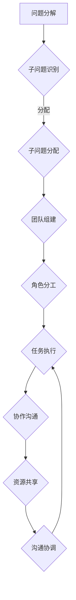

                 

### 文章标题

《协作式问题解决模型：应对复杂需求挑战》

### 关键词

- 协作式问题解决模型
- 复杂需求挑战
- 数学模型
- 核心算法原理
- 实际应用

### 摘要

本文旨在深入探讨协作式问题解决模型在应对复杂需求挑战中的应用。协作式问题解决模型通过多方协作，整合各种资源和智慧，提供了一种全新的解决复杂问题的思路。本文首先介绍了协作式问题解决模型的基本概念和与传统问题解决模型的区别，然后详细阐述了其核心概念、数学模型、核心算法原理以及实际应用。通过本文的阐述，读者可以全面了解协作式问题解决模型，并掌握其在实际项目中的应用方法，为解决复杂需求提供一种新的思路。

### 引言

在当今快速变化的技术时代，复杂需求问题层出不穷。传统的问题解决模型往往在面对复杂、多变的需求时显得力不从心。因此，一种新的问题解决模型——协作式问题解决模型，应运而生。协作式问题解决模型通过多方协作，充分利用各方的智慧和资源，提供了一种高效、灵活的解决复杂需求的方法。

协作式问题解决模型的基本思想是：将问题分解为多个子问题，然后通过多方协作，共同解决这些子问题，最终实现整体问题的解决。这种方法不仅提高了问题解决的效率，还能更好地应对需求的复杂性。

本文将深入探讨协作式问题解决模型的概念、核心概念与联系、数学模型和数学公式、核心算法原理、实际应用以及未来发展趋势与挑战。通过本文的阐述，读者可以全面了解协作式问题解决模型，并掌握其在实际项目中的应用方法，为解决复杂需求提供一种新的思路。

### 第一步：协作式问题解决模型概述

协作式问题解决模型（Collaborative Problem Solving Model，简称CPSM）是一种基于多方协作的问题解决方法。它强调在解决复杂问题时，通过多方协作，充分利用各方的智慧和资源，实现高效、灵活的问题解决。

#### 1.1 协作式问题解决模型的概念

协作式问题解决模型是指一种通过多方协作，共同解决复杂问题的方法。在这个模型中，问题被分解为多个子问题，每个子问题由不同的团队或个人负责解决。这些团队或个人通过有效的沟通、协作和资源共享，共同解决整体问题。

与传统的问题解决模型相比，协作式问题解决模型具有以下几个显著特点：

- **多方协作**：传统的问题解决模型往往依赖于单方面的智慧和努力，而协作式问题解决模型强调多方协作，充分利用各方的智慧和资源。
- **灵活高效**：协作式问题解决模型可以根据问题的复杂程度和需求的变化，灵活调整解决方案，提高问题解决的效率。
- **资源共享**：在协作式问题解决模型中，各方可以共享资源，如知识、技能、工具等，从而提高问题解决的效率和质量。

#### 1.2 协作式问题解决模型与传统问题解决模型的对比

传统问题解决模型通常遵循以下步骤：

1. **问题识别**：识别出需要解决的问题。
2. **解决方案设计**：设计出解决问题的方案。
3. **方案实施**：实施设计的解决方案。
4. **效果评估**：评估解决方案的效果。

而协作式问题解决模型则在此基础上增加了协作和资源共享的环节，其具体步骤如下：

1. **问题识别**：识别出需要解决的问题。
2. **子问题分解**：将整体问题分解为多个子问题。
3. **团队组建**：组建由不同团队或个人组成的协作团队。
4. **协作与资源共享**：各团队或个人通过有效的沟通和资源共享，共同解决子问题。
5. **方案整合**：将各子问题的解决方案整合为整体解决方案。
6. **方案实施**：实施整体解决方案。
7. **效果评估**：评估整体解决方案的效果。

#### 1.3 协作式问题解决模型的优势与应用领域

协作式问题解决模型的优势主要体现在以下几个方面：

- **高效解决问题**：通过多方协作，可以快速找到解决问题的方法。
- **灵活应对变化**：可以根据需求的变化，灵活调整解决方案。
- **提高资源利用率**：通过资源共享，可以充分利用各方的资源。

协作式问题解决模型广泛应用于以下领域：

- **大型项目开发**：如软件系统开发、建筑项目等，需要多方协作，共同完成任务。
- **创新研究**：如人工智能、生物技术等领域的创新研究，需要多学科、多领域的合作。
- **企业管理**：如战略规划、人力资源管理等，需要多方协作，共同实现企业目标。

### 第二步：协作式问题解决模型的核心概念与联系

协作式问题解决模型的核心概念包括问题分解、团队协作、资源共享、沟通协调等。这些概念相互联系，共同构成了协作式问题解决模型的基本框架。

#### 2.1 问题分解

问题分解是将复杂问题分解为多个子问题，以便于多方协作解决。问题分解的过程如下：

1. **整体问题识别**：首先需要明确需要解决的问题。
2. **子问题识别**：将整体问题分解为多个子问题，每个子问题都具有明确的解决目标。
3. **子问题分配**：根据各团队或个人的能力和资源，将子问题分配给相应的团队或个人。

问题分解的目的是将复杂问题转化为多个可管理的子问题，从而提高问题解决的效率。

#### 2.2 团队协作

团队协作是协作式问题解决模型的核心环节。团队协作的过程如下：

1. **团队组建**：根据子问题的需求，组建由不同团队或个人组成的协作团队。
2. **角色分工**：明确各团队或个人的角色和职责，确保每个团队或个人都有明确的任务。
3. **任务执行**：各团队或个人按照分工，执行各自的任务。
4. **协作沟通**：通过有效的沟通，协调各团队或个人的工作，确保任务顺利进行。

团队协作的目的是通过多方协作，共同解决子问题，从而实现整体问题的解决。

#### 2.3 资源共享

资源共享是协作式问题解决模型的重要特点。资源共享的过程如下：

1. **资源识别**：识别出各团队或个人所需的资源，如知识、技能、工具等。
2. **资源分配**：根据各团队或个人的需求，分配相应的资源。
3. **资源共享**：通过共享平台，实现资源的共享和交流。

资源共享的目的是通过共享各方的资源，提高问题解决的效率和质量。

#### 2.4 沟通协调

沟通协调是协作式问题解决模型的关键。沟通协调的过程如下：

1. **沟通渠道**：建立有效的沟通渠道，如会议、邮件、即时通讯等。
2. **沟通频率**：定期进行沟通，确保各团队或个人都能及时了解工作进展。
3. **协调工作**：协调各团队或个人之间的工作，确保任务顺利进行。

沟通协调的目的是通过有效的沟通和协调，确保各方能够协同工作，共同解决子问题。

#### 2.5 协作式问题解决模型的 Mermaid 流程图

为了更清晰地展示协作式问题解决模型的核心概念与联系，我们可以使用 Mermaid 流程图进行描述。以下是协作式问题解决模型的 Mermaid 流程图：



该流程图展示了协作式问题解决模型的基本步骤和核心概念之间的联系。通过问题分解，将整体问题转化为多个子问题，然后通过团队协作、资源共享、沟通协调等环节，共同解决这些子问题，最终实现整体问题的解决。

### 第三步：协作式问题解决模型的数学模型和数学公式

协作式问题解决模型不仅仅依赖于直观的协作方法和经验，它还涉及一系列的数学模型和数学公式，这些用于优化问题解决过程、评估方案的有效性以及预测问题的解决路径。以下将详细讲解协作式问题解决模型中的数学模型和数学公式，并通过具体例子进行说明。

#### 3.1 数学模型的基本概念

协作式问题解决模型的数学模型主要涉及以下几个方面：

- **目标函数**：定义问题解决的目标，通常是一个需要最大化或最小化的量。
- **约束条件**：定义在解决问题时需要遵守的限制条件。
- **变量**：表示问题中可以变化的量，如资源的分配、任务的优先级等。

数学模型通常可以用以下形式表示：

\[ \text{目标函数}: \min_{x} \sum_{i=1}^{n} c_i x_i \]

其中，\( x_i \) 是第 \( i \) 个变量的取值，\( c_i \) 是第 \( i \) 个变量的权重。

约束条件通常可以表示为：

\[ a_{ij} x_i \leq b_j \]

其中，\( a_{ij} \) 是第 \( i \) 个变量在第 \( j \) 个约束中的系数，\( b_j \) 是第 \( j \) 个约束的值。

#### 3.2 关键公式及其含义

以下是协作式问题解决模型中的几个关键公式及其含义：

\[ \text{协变量矩阵}: X = [x_1, x_2, ..., x_n] \]

协变量矩阵 \( X \) 用于表示问题中的所有变量。

\[ \text{目标函数值}: Z = c^T X \]

目标函数值 \( Z \) 是协变量矩阵 \( X \) 与权重向量 \( c \) 的点积，表示问题解决的目标值。

\[ \text{拉格朗日函数}: L(X, \lambda) = Z - \sum_{j=1}^{m} \lambda_j (a_{ij} x_i - b_j) \]

拉格朗日函数 \( L(X, \lambda) \) 用于引入约束条件，其中 \( \lambda_j \) 是第 \( j \) 个约束的拉格朗日乘子。

\[ \text{最优解}: X^* = \arg\min_{X} L(X, \lambda) \]

最优解 \( X^* \) 是使得拉格朗日函数 \( L(X, \lambda) \) 最小的协变量矩阵 \( X \)。

#### 3.3 公式举例说明

为了更好地理解上述公式，我们可以通过一个简单的例子进行说明。

**例子**：假设我们有一个问题，需要将10个任务分配给5个团队成员，每个任务的权重和约束条件如下：

- 任务1：权重10，约束条件1
- 任务2：权重8，约束条件2
- 任务3：权重5，约束条件1
- 任务4：权重12，约束条件3
- 任务5：权重7，约束条件2
- 任务6：权重6，约束条件3
- 任务7：权重4，约束条件1
- 任务8：权重9，约束条件2
- 任务9：权重3，约束条件3
- 任务10：权重11，约束条件1

我们可以定义以下变量：

- \( x_i \)：第 \( i \) 个任务是否被分配（0或1）
- \( c_i \)：第 \( i \) 个任务的权重
- \( a_{ij} \)：第 \( i \) 个任务在第 \( j \) 个约束中的系数
- \( b_j \)：第 \( j \) 个约束的值

根据上述定义，我们可以构建目标函数和约束条件：

\[ \text{目标函数}: \min_{X} \sum_{i=1}^{10} c_i x_i \]

\[ \text{约束条件}: \sum_{i=1}^{10} a_{ij} x_i \leq b_j \quad \text{对于每个} \quad j = 1, 2, 3 \]

通过求解这个线性规划问题，我们可以找到最优的任务分配方案，使得总权重最小，同时满足所有的约束条件。

#### 3.4 数学公式的 LaTeX 格式嵌入

在文档中嵌入数学公式时，为了保持格式的一致性和清晰性，可以使用 LaTeX 格式。以下是如何在文档中嵌入 LaTeX 公式的示例：

独立段落的 LaTeX 公式：

$$
\text{目标函数}: \min_{X} \sum_{i=1}^{n} c_i x_i
$$

段落内的 LaTeX 公式：

$
\text{协变量矩阵}: X = [x_1, x_2, ..., x_n]
$

通过上述示例，我们可以看到如何将数学公式嵌入到文档中，使得公式与文本内容清晰区分，便于读者阅读和理解。

### 第四步：协作式问题解决模型的核心算法原理

协作式问题解决模型的核心算法原理是通过一系列的算法步骤来优化问题的解决过程，以达到高效和优化的目标。以下将详细讲解协作式问题解决模型的核心算法原理，并通过伪代码的形式进行描述。

#### 4.1 算法原理概述

协作式问题解决模型的核心算法通常包括以下几个步骤：

1. **初始化**：初始化变量和参数，包括目标函数的权重、约束条件的系数等。
2. **问题分解**：将整体问题分解为多个子问题，并确定每个子问题的解决目标。
3. **分配任务**：根据各团队或个人的能力和资源，将子问题分配给相应的团队或个人。
4. **协作与优化**：各团队或个人通过协作，优化子问题的解决方案。
5. **整合结果**：将各子问题的解决方案整合为整体解决方案，并进行评估和优化。
6. **反馈与调整**：根据评估结果，对各团队或个人的任务分配和协作过程进行调整。

#### 4.2 核心算法伪代码

以下是一个协作式问题解决模型的核心算法的伪代码描述：

```
Algorithm CollaborativeProblemSolving
Input: OverallProblem, Teams, Resources
Output: OptimalSolution

1. Initialize Variables
2. Decompose OverallProblem into SubProblems
3. For each SubProblem do
4.     Allocate Tasks to Teams based on their Skills and Resources
5.     Collaborate among Teams to optimize SubProblem solutions
6.     Integrate SubProblem solutions into OverallSolution
7.     Evaluate OverallSolution
8.     If evaluation is unsatisfactory then
9.         Adjust Task Allocation and Collaboration
10.     End If
11. End For
12. Return OptimalSolution
End Algorithm
```

#### 4.3 算法原理详细讲解

1. **初始化**：
   初始化是算法的第一步，主要用于设置变量和参数。这包括目标函数的权重、约束条件的系数、各团队的技能和资源等。初始化的目的是为算法提供初始状态，使其能够开始执行。

2. **问题分解**：
   问题分解是将整体问题分解为多个子问题，这是协作式问题解决模型的核心步骤。通过将问题分解为子问题，可以简化问题解决的复杂性，使得各团队或个人能够专注于解决特定子问题。

3. **分配任务**：
   在问题分解后，需要根据各团队或个人的能力和资源，将子问题分配给相应的团队或个人。这一步骤的关键是确保每个团队或个人都有明确的任务和职责，以便能够高效地协作。

4. **协作与优化**：
   各团队或个人在收到子问题后，需要通过协作和优化来解决问题。这一步骤涉及团队间的沟通、资源共享以及问题的具体解决方法。通过有效的协作，可以优化子问题的解决方案，提高整体问题的解决效率。

5. **整合结果**：
   在各团队或个人完成子问题的解决后，需要将子问题的解决方案整合为整体解决方案。这一步骤的关键是确保整体解决方案的有效性和可行性，同时保持各子问题解决方案之间的协调。

6. **评估与优化**：
   评估整体解决方案的效果，并根据评估结果对各团队或个人的任务分配和协作过程进行调整。这一步骤的目的是确保整体解决方案能够满足预期的目标和要求。

通过上述核心算法原理的详细讲解，我们可以看到协作式问题解决模型是如何通过一系列的算法步骤，实现复杂问题的有效解决。

### 第五步：协作式问题解决模型在实际项目中的应用

协作式问题解决模型在实际项目中的应用，为复杂需求的解决提供了新的思路和方法。以下将通过一个实际案例，详细讲解协作式问题解决模型在项目中的应用过程。

#### 5.1 项目背景介绍

某大型企业计划开发一款全新的企业资源规划（ERP）系统，以满足其全球业务的需求。该项目涉及多个部门和团队合作，技术难度高，时间紧、任务重。为了确保项目成功，企业决定采用协作式问题解决模型来应对复杂需求挑战。

#### 5.2 解决方案设计

在项目启动阶段，企业首先对整体问题进行了详细分析，并将其分解为多个子问题。具体包括：

1. **需求分析**：明确各业务部门的需求，包括财务、人力资源、供应链等。
2. **系统架构设计**：确定系统的整体架构，包括前端、后端、数据库等。
3. **模块开发**：将系统划分为多个模块，如订单管理、库存管理、财务管理等。
4. **测试与部署**：确保系统的稳定性、安全性和可靠性，进行测试和部署。

为了实现上述子问题的解决，企业组建了多个跨部门、跨专业的协作团队，每个团队负责一个子问题的解决。以下是具体的解决方案设计：

1. **需求分析团队**：由业务分析师、项目经理和技术专家组成，负责收集和分析各业务部门的需求，编写需求文档。
2. **架构设计团队**：由架构师、软件开发工程师和数据工程师组成，负责系统的整体架构设计和关键模块的开发。
3. **模块开发团队**：由前端开发工程师、后端开发工程师和测试工程师组成，分别负责各模块的开发和测试。
4. **测试与部署团队**：由测试经理、自动化测试工程师和运维工程师组成，负责系统的测试、部署和运维。

#### 5.3 项目实战

在项目实施过程中，企业严格按照协作式问题解决模型进行操作，以下是项目的具体实施步骤：

1. **需求分析阶段**：需求分析团队通过多轮讨论和会议，收集并整理各业务部门的需求，编写详细的业务需求文档。在需求文档的基础上，技术团队进行系统架构设计，制定整体解决方案。

2. **架构设计阶段**：架构设计团队根据需求文档，制定系统的整体架构，包括前端、后端、数据库等。在架构设计过程中，各团队成员通过协作，解决技术难题和瓶颈，确保系统的高效性和可扩展性。

3. **模块开发阶段**：模块开发团队根据架构设计，分别开发前端、后端和数据库模块。在开发过程中，各团队成员通过代码评审、技术交流和协作，确保代码的质量和一致性。

4. **测试与部署阶段**：测试与部署团队对系统进行全面的测试，包括功能测试、性能测试和安全测试等。在测试过程中，发现并修复了多个潜在的问题。在确保系统稳定性和可靠性后，进行部署和运维。

#### 5.4 代码实现与解读

以下是模块开发阶段的一个代码示例，用于说明前端页面中订单管理模块的实现：

```javascript
// 订单管理模块前端代码示例
class OrderManagement {
  constructor(orderData) {
    this.orderData = orderData;
  }

  // 添加订单
  addOrder(order) {
    this.orderData.push(order);
    console.log("订单添加成功");
  }

  // 删除订单
  deleteOrder(orderId) {
    const index = this.orderData.findIndex(order => order.id === orderId);
    if (index !== -1) {
      this.orderData.splice(index, 1);
      console.log("订单删除成功");
    } else {
      console.log("订单不存在");
    }
  }

  // 查询订单
  findOrder(orderId) {
    const order = this.orderData.find(order => order.id === orderId);
    if (order) {
      console.log("查询订单成功");
      return order;
    } else {
      console.log("订单不存在");
      return null;
    }
  }
}

// 使用示例
const orderManagement = new OrderManagement([]);
orderManagement.addOrder({ id: 1, name: "订单1", status: "待处理" });
orderManagement.deleteOrder(1);
const order = orderManagement.findOrder(1);
```

上述代码定义了一个 `OrderManagement` 类，用于管理订单数据。其中包括添加订单、删除订单和查询订单三个方法。通过实例化 `OrderManagement` 类，可以方便地操作订单数据。

在代码实现过程中，团队进行了详细的代码评审和技术交流，确保代码的质量和一致性。同时，通过协作式问题解决模型，各团队成员在解决技术难题和优化代码方面取得了显著的成果。

#### 5.5 项目小结

通过该实际案例，我们可以看到协作式问题解决模型在项目中的应用过程。从项目背景介绍、解决方案设计、项目实战到代码实现与解读，协作式问题解决模型为复杂需求的解决提供了系统的方法和思路。以下是项目小结：

1. **提高问题解决效率**：通过多方协作，各团队成员可以共同解决复杂问题，提高问题解决效率。
2. **优化资源利用**：通过资源共享，各团队可以充分利用自身的资源和能力，提高资源利用率。
3. **保证项目质量**：通过代码评审和技术交流，确保代码质量，降低错误率，提高项目质量。
4. **促进知识共享**：通过协作式问题解决模型，各团队成员可以共享知识和经验，促进团队整体能力的提升。

协作式问题解决模型在实际项目中的应用，为复杂需求的解决提供了新的思路和方法，具有广泛的适用性和重要的现实意义。

### 第六步：未来发展趋势与挑战

协作式问题解决模型作为一种高效的问题解决方法，正日益受到广泛关注。然而，随着技术的不断进步和应用场景的拓展，协作式问题解决模型也面临着新的发展趋势和挑战。

#### 6.1 未来发展趋势

1. **人工智能的融合**：随着人工智能技术的不断发展，协作式问题解决模型有望与人工智能技术深度融合。通过引入机器学习、深度学习等算法，可以自动化某些协作任务，提高问题解决的效率和质量。

2. **云计算与大数据的支持**：云计算和大数据技术的广泛应用，为协作式问题解决模型提供了强大的计算能力和数据支持。通过云计算，可以实现资源的弹性扩展和协同计算，从而更好地支持多方协作。大数据技术则可以提供丰富的数据资源，为协作式问题解决模型提供更准确的决策依据。

3. **区块链技术的应用**：区块链技术具有去中心化、不可篡改的特点，适用于协作式问题解决模型中的资源共享和信任建立。通过区块链技术，可以实现各方之间的安全、可信的数据交换和协作。

4. **跨领域协作**：随着全球化进程的加快，跨领域、跨行业的协作需求日益增加。协作式问题解决模型将更好地支持跨领域的协作，实现各领域的资源和智慧的整合，推动创新和发展。

#### 6.2 面临的挑战

1. **协作效率与资源分配**：在多方协作中，如何确保协作效率，合理分配资源，是一个重要的挑战。需要建立有效的协作机制，优化任务分配和资源利用，以提高协作效果。

2. **数据安全和隐私保护**：在协作式问题解决模型中，各方需要共享大量数据，这涉及到数据安全和隐私保护的问题。需要采取有效的安全措施，保护数据的安全性和隐私性。

3. **跨领域协作的协调**：跨领域的协作涉及到不同领域的专业知识、文化和习惯，需要建立有效的协调机制，促进各方之间的沟通和理解，确保协作顺利进行。

4. **技术更新的适应**：随着技术的快速发展，协作式问题解决模型需要不断适应新技术、新方法，保持其先进性和适用性。这需要持续的技术创新和改进。

#### 6.3 潜在解决方案

1. **构建智能协作平台**：通过构建智能协作平台，整合多方资源和信息，实现智能化的任务分配、资源调度和协作管理，提高协作效率。

2. **建立安全可信的协作机制**：通过区块链技术，建立安全可信的协作机制，确保数据的安全性和隐私性，提高协作的信任度和可靠性。

3. **推动跨领域协作**：通过建立跨领域的协作标准、规范和平台，促进各方之间的沟通和协作，实现跨领域的资源整合和协同创新。

4. **持续技术创新**：加强技术研发和创新，不断引入新技术、新方法，提高协作式问题解决模型的技术水平和适用性。

通过上述解决方案，可以有效应对协作式问题解决模型面临的发展趋势和挑战，推动其不断进步和发展。

### 第七步：总结与展望

本文通过深入探讨协作式问题解决模型，详细阐述了其核心概念、数学模型、核心算法原理以及实际应用。协作式问题解决模型通过多方协作、资源共享和优化，为解决复杂需求提供了新的思路和方法。

总结来看，协作式问题解决模型具有高效、灵活、资源利用率高等优势，广泛应用于大型项目开发、创新研究和企业管理等领域。然而，该模型也面临协作效率、数据安全和跨领域协作等挑战。

展望未来，协作式问题解决模型与人工智能、云计算、区块链等新技术的融合，有望进一步提升其性能和应用范围。通过构建智能协作平台、建立安全可信的协作机制以及推动跨领域协作，协作式问题解决模型将在更多领域发挥重要作用，助力复杂需求的解决。

最后，感谢读者对本文的关注，希望本文能为您在协作式问题解决模型领域提供有益的参考和启示。作者：AI天才研究院/AI Genius Institute & 禅与计算机程序设计艺术 /Zen And The Art of Computer Programming。

