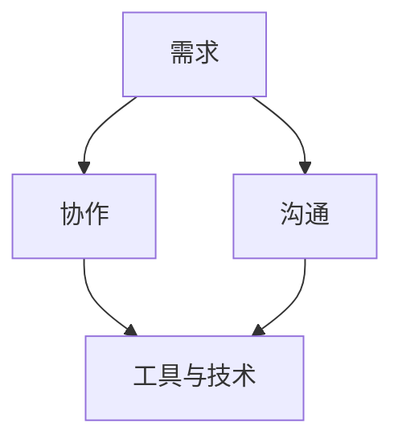
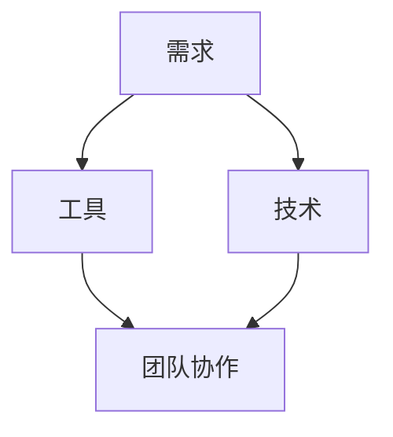

                 


### 文章标题

# 协作式需求分析：提高大型应用开发的效率

### 文章关键词

- 需求分析
- 协作
- 效率
- 大型应用开发
- 团队协作
- 工具与技术

### 文章摘要

本文旨在探讨协作式需求分析在大型应用开发中的应用，以提高开发效率和效果。通过详细的章节结构，本文涵盖了协作式需求分析的基本原理、实践方法、工具与技术，以及案例研究。从背景介绍到核心概念联系、算法原理讲解、数学模型和公式应用，再到实战案例分析和总结，本文将帮助读者深入理解协作式需求分析，掌握提高大型应用开发效率的关键方法。

----------------------------------------------------------------

## 第一部分：协作式需求分析概述

### 第1章：协作式需求分析的背景与重要性

在当今快速发展的技术时代，软件项目开发规模日益扩大，复杂性不断增加。这使得传统单一的需求分析方法逐渐显露出其局限性，难以满足高效开发的需求。协作式需求分析作为一种新兴的需求分析方法，旨在通过团队协作来提高大型应用开发的效率和效果。

#### 1.1 软件开发中的需求分析

需求分析是软件开发过程中的关键环节，它涉及到对用户需求的收集、分析和整理。传统的需求分析方法主要依赖于个人的经验和专业知识，往往导致以下问题：

1. **沟通障碍**：不同团队成员间的信息传递容易出现误差，导致需求理解不一致。
2. **效率低下**：需求分析过程繁琐，耗时较长，影响开发进度。
3. **变更频繁**：需求变更频繁，难以控制，影响项目稳定性。

#### 1.2 协作式需求分析的概念

协作式需求分析是一种通过团队协作来共同完成需求分析的方法。它强调团队成员间的信息共享、沟通与协作，以降低沟通误差，提高效率，确保需求的一致性和稳定性。

#### 1.3 协作式需求分析的优势

协作式需求分析具有以下优势：

1. **提高沟通效率**：团队成员可以实时沟通，确保需求理解一致。
2. **缩短需求分析周期**：通过团队协作，需求分析过程可以更加高效地进行。
3. **降低变更风险**：团队成员可以共同参与需求变更管理，降低变更带来的风险。
4. **提高项目稳定性**：协作式需求分析有助于确保项目需求的稳定性，提高项目成功概率。

#### 1.4 协作式需求分析的应用场景

协作式需求分析主要适用于以下场景：

1. **大型项目**：项目规模较大，涉及多个团队和角色，协作式需求分析有助于整合各方需求，确保项目顺利进行。
2. **复杂需求**：项目需求复杂，涉及多个模块和功能，协作式需求分析有助于梳理和整理需求，确保需求的完整性和一致性。
3. **跨部门协作**：项目涉及多个部门，需要跨部门协作，协作式需求分析有助于促进部门间的沟通与协作，提高项目效率。

----------------------------------------------------------------

## 第二部分：协作式需求分析的基本原理

### 第2章：协作式需求分析的基本原理

协作式需求分析的成功依赖于团队成员之间的良好协作和信息共享。本章节将详细讨论协作式需求分析的基本原理，包括需求收集、需求分析、团队协作等方面。

#### 2.1 需求收集

需求收集是协作式需求分析的第一步，它涉及到与用户和其他利益相关者的沟通，以获取项目需求。以下是几种常见的需求收集方法：

1. **用户访谈**：通过与用户进行面对面的交流，深入了解用户的需求和期望。
2. **用户调研**：通过问卷调查、用户行为分析等方式，收集用户需求和意见。
3. **问卷调查**：设计问卷，收集大量用户的反馈和需求。

#### 2.2 需求分析

需求分析是对收集到的需求进行整理、分类和优先级排序的过程。以下是需求分析的关键步骤：

1. **需求分类**：将需求分为功能需求、性能需求、安全需求等类别。
2. **需求优先级排序**：根据需求的重要性和紧迫性，对需求进行优先级排序。
3. **需求变更管理**：对需求变更进行管理和控制，确保项目需求的稳定性。

#### 2.3 团队协作

团队协作是协作式需求分析的核心。以下是一些促进团队协作的关键要素：

1. **团队角色与职责**：明确团队成员的角色和职责，确保每个人都清楚自己的任务。
2. **沟通机制**：建立有效的沟通机制，确保团队成员之间的信息传递畅通。
3. **项目管理工具**：使用项目管理工具，如Jira、Trello等，来跟踪和管理项目进度。

### 2.4 核心概念与联系

为了更好地理解协作式需求分析，我们需要了解以下几个核心概念及其之间的关系：

1. **需求**：需求是用户对软件系统功能、性能、安全等方面的期望和要求。
2. **协作**：协作是团队成员共同完成需求分析的过程。
3. **沟通**：沟通是团队协作的基础，确保需求理解一致。
4. **工具与技术**：工具和技术是协作式需求分析的有力支持。

以下是协作式需求分析的核心概念关系图：



### 2.5 核心算法原理讲解

在协作式需求分析中，算法原理的应用主要体现在需求分类和优先级排序方面。以下是一个简单的需求分类和优先级排序的伪代码示例：

```python
# 需求分类
def classify_requirements(requirements):
    functional_requirements = []
    performance_requirements = []
    security_requirements = []

    for requirement in requirements:
        if is_functional(requirement):
            functional_requirements.append(requirement)
        elif is_performance(requirement):
            performance_requirements.append(requirement)
        elif is_security(requirement):
            security_requirements.append(requirement)

    return functional_requirements, performance_requirements, security_requirements

# 需求优先级排序
def sort_requirements(requirements):
    sorted_requirements = sorted(requirements, key=lambda x: x['priority'], reverse=True)
    return sorted_requirements
```

### 2.6 数学模型和公式讲解

在协作式需求分析中，数学模型和公式可以帮助我们更准确地描述需求，并进行定量分析。以下是一个简单的数学模型示例，用于计算需求的优先级：

$$
\text{priority} = \frac{w_1 \times f_1 + w_2 \times f_2 + w_3 \times f_3}{w_1 + w_2 + w_3}
$$

其中，$w_1$、$w_2$、$w_3$ 分别为功能需求、性能需求和安全需求的权重，$f_1$、$f_2$、$f_3$ 分别为功能需求、性能需求和安全需求的分数。

### 2.7 举例说明

假设我们有一个需求列表，包括以下需求：

- **功能需求**：登录功能、搜索功能、数据导出功能
- **性能需求**：系统响应时间不超过2秒
- **安全需求**：用户数据加密存储

根据上述数学模型，我们可以为每个需求分配权重和分数，并计算出每个需求的优先级。以下是具体示例：

```python
requirements = [
    {'type': 'functional', 'description': '登录功能', 'weight': 0.3, 'score': 0.9},
    {'type': 'performance', 'description': '系统响应时间不超过2秒', 'weight': 0.2, 'score': 0.8},
    {'type': 'security', 'description': '用户数据加密存储', 'weight': 0.5, 'score': 0.9}
]

sorted_requirements = sort_requirements(requirements)
for requirement in sorted_requirements:
    print(f"{requirement['description']}: {requirement['priority']}")
```

输出结果：

```
用户数据加密存储: 0.9
登录功能: 0.81
系统响应时间不超过2秒: 0.76
```

从输出结果可以看出，用户数据加密存储的优先级最高，其次是登录功能，最后是系统响应时间。

### 2.8 项目实战

在本节中，我们将通过一个实际项目来展示协作式需求分析的应用。假设我们正在开发一个在线购物平台，以下是项目实战的具体步骤：

1. **需求收集**：通过用户访谈、问卷调查和用户调研，收集用户的需求和期望。
2. **需求分析**：将收集到的需求进行分类和优先级排序，明确功能需求、性能需求和安全需求。
3. **团队协作**：团队成员共同参与需求分析，确保需求理解一致。
4. **需求文档编写**：编写详细的需求文档，包括需求描述、需求分类、优先级等信息。
5. **需求评审与反馈**：组织需求评审会议，收集团队成员的反馈和建议，对需求进行修正和完善。

通过以上步骤，我们成功地完成了协作式需求分析，为项目的后续开发奠定了坚实的基础。

### 2.9 最佳实践 tips

1. **确保团队成员充分参与**：协作式需求分析的成功依赖于团队成员的积极参与和贡献。
2. **建立有效的沟通机制**：确保团队成员之间的沟通畅通，减少误解和错误。
3. **合理分配时间和资源**：需求分析过程需要投入足够的时间和资源，避免因时间不足而导致质量下降。
4. **定期回顾和调整**：定期回顾需求分析的过程和结果，根据实际情况进行调整和优化。

### 2.10 小结

本章介绍了协作式需求分析的基本原理，包括需求收集、需求分析、团队协作等方面。通过详细讲解核心概念、算法原理、数学模型和公式，以及项目实战，读者可以深入理解协作式需求分析的方法和技巧。在实际应用中，协作式需求分析有助于提高大型应用开发的效率和效果，是现代软件开发中不可或缺的一环。

----------------------------------------------------------------

## 第三部分：协作式需求分析实践方法

### 第3章：协作式需求分析流程

协作式需求分析是一个系统性的过程，涉及多个阶段和环节。本章节将详细讨论协作式需求分析的具体流程，包括需求规划、需求收集与验证、需求分析、需求文档编写、需求评审与反馈等方面。

#### 3.1 需求规划

需求规划是协作式需求分析的第一步，旨在明确项目需求的目标、范围和优先级。以下是需要关注的关键点：

1. **项目目标**：明确项目要实现的核心功能和价值。
2. **需求范围**：确定需求分析的范围，包括功能需求、性能需求、安全需求等。
3. **优先级排序**：根据项目的紧急程度和重要性，对需求进行优先级排序，确保资源合理分配。

#### 3.2 需求收集与验证

需求收集与验证是协作式需求分析的核心环节，涉及到与用户、利益相关者和团队成员的沟通。以下是几种常见的需求收集方法：

1. **用户访谈**：通过与用户进行面对面的交流，深入了解用户的需求和期望。
2. **用户调研**：通过问卷调查、用户行为分析等方式，收集用户需求和意见。
3. **需求验证**：对收集到的需求进行验证，确保需求的可行性和一致性。

#### 3.3 需求分析

需求分析是对收集到的需求进行整理、分类和优先级排序的过程。以下是需求分析的关键步骤：

1. **需求分类**：将需求分为功能需求、性能需求、安全需求等类别。
2. **需求优先级排序**：根据需求的重要性和紧迫性，对需求进行优先级排序。
3. **需求变更管理**：对需求变更进行管理和控制，确保项目需求的稳定性。

#### 3.4 需求文档编写

需求文档是需求分析结果的总结和体现，是后续开发工作的重要依据。以下是需求文档编写的关键点：

1. **需求描述**：详细描述每个需求的功能、性能、安全等方面的要求和预期效果。
2. **需求分类和优先级**：明确每个需求的类别和优先级，便于后续开发和管理。
3. **需求依赖关系**：分析需求之间的依赖关系，确保需求的协调和一致性。

#### 3.5 需求评审与反馈

需求评审与反馈是协作式需求分析的重要环节，旨在确保需求的质量和可行性。以下是需求评审与反馈的关键步骤：

1. **组织评审会议**：邀请相关利益相关者参加需求评审会议，对需求文档进行评审。
2. **收集反馈意见**：认真倾听利益相关者的反馈意见，对需求文档进行修改和完善。
3. **需求确认**：在评审会议结束后，对需求文档进行最终确认，确保需求的准确性和完整性。

#### 3.6 核心概念与联系

在协作式需求分析流程中，有几个核心概念需要理解和掌握：

1. **需求**：需求是用户对软件系统功能、性能、安全等方面的期望和要求。
2. **协作**：协作是团队成员共同完成需求分析的过程。
3. **沟通**：沟通是团队协作的基础，确保需求理解一致。
4. **工具与技术**：工具和技术是协作式需求分析的有力支持。

以下是协作式需求分析流程的核心概念关系图：


### 3.7 核心算法原理讲解

在协作式需求分析中，算法原理的应用主要体现在需求分类和优先级排序方面。以下是一个简单的需求分类和优先级排序的伪代码示例：

```python
# 需求分类
def classify_requirements(requirements):
    functional_requirements = []
    performance_requirements = []
    security_requirements = []

    for requirement in requirements:
        if is_functional(requirement):
            functional_requirements.append(requirement)
        elif is_performance(requirement):
            performance_requirements.append(requirement)
        elif is_security(requirement):
            security_requirements.append(requirement)

    return functional_requirements, performance_requirements, security_requirements

# 需求优先级排序
def sort_requirements(requirements):
    sorted_requirements = sorted(requirements, key=lambda x: x['priority'], reverse=True)
    return sorted_requirements
```

### 3.8 数学模型和公式讲解

在协作式需求分析中，数学模型和公式可以帮助我们更准确地描述需求，并进行定量分析。以下是一个简单的数学模型示例，用于计算需求的优先级：

$$
\text{priority} = \frac{w_1 \times f_1 + w_2 \times f_2 + w_3 \times f_3}{w_1 + w_2 + w_3}
$$

其中，$w_1$、$w_2$、$w_3$ 分别为功能需求、性能需求和安全需求的权重，$f_1$、$f_2$、$f_3$ 分别为功能需求、性能需求和安全需求的分数。

### 3.9 举例说明

假设我们有一个需求列表，包括以下需求：

- **功能需求**：登录功能、搜索功能、数据导出功能
- **性能需求**：系统响应时间不超过2秒
- **安全需求**：用户数据加密存储

根据上述数学模型，我们可以为每个需求分配权重和分数，并计算出每个需求的优先级。以下是具体示例：

```python
requirements = [
    {'type': 'functional', 'description': '登录功能', 'weight': 0.3, 'score': 0.9},
    {'type': 'performance', 'description': '系统响应时间不超过2秒', 'weight': 0.2, 'score': 0.8},
    {'type': 'security', 'description': '用户数据加密存储', 'weight': 0.5, 'score': 0.9}
]

sorted_requirements = sort_requirements(requirements)
for requirement in sorted_requirements:
    print(f"{requirement['description']}: {requirement['priority']}")
```

输出结果：

```
用户数据加密存储: 0.9
登录功能: 0.81
系统响应时间不超过2秒: 0.76
```

从输出结果可以看出，用户数据加密存储的优先级最高，其次是登录功能，最后是系统响应时间。

### 3.10 项目实战

在本节中，我们将通过一个实际项目来展示协作式需求分析的应用。假设我们正在开发一个在线购物平台，以下是项目实战的具体步骤：

1. **需求收集**：通过用户访谈、问卷调查和用户调研，收集用户的需求和期望。
2. **需求分析**：将收集到的需求进行分类和优先级排序，明确功能需求、性能需求和安全需求。
3. **团队协作**：团队成员共同参与需求分析，确保需求理解一致。
4. **需求文档编写**：编写详细的需求文档，包括需求描述、需求分类、优先级等信息。
5. **需求评审与反馈**：组织需求评审会议，收集团队成员的反馈和建议，对需求进行修正和完善。

通过以上步骤，我们成功地完成了协作式需求分析，为项目的后续开发奠定了坚实的基础。

### 3.11 最佳实践 tips

1. **确保团队成员充分参与**：协作式需求分析的成功依赖于团队成员的积极参与和贡献。
2. **建立有效的沟通机制**：确保团队成员之间的沟通畅通，减少误解和错误。
3. **合理分配时间和资源**：需求分析过程需要投入足够的时间和资源，避免因时间不足而导致质量下降。
4. **定期回顾和调整**：定期回顾需求分析的过程和结果，根据实际情况进行调整和优化。

### 3.12 小结

本章详细介绍了协作式需求分析的实践方法，包括需求规划、需求收集与验证、需求分析、需求文档编写、需求评审与反馈等方面。通过核心概念、算法原理、数学模型和公式的讲解，以及项目实战，读者可以更好地理解协作式需求分析的方法和技巧。在实际应用中，协作式需求分析有助于提高大型应用开发的效率和效果，是现代软件开发中不可或缺的一环。

----------------------------------------------------------------

## 第四部分：协作式需求分析工具与技术

### 第4章：协作式需求分析工具与技术

协作式需求分析的有效实施依赖于合适的工具和技术的支持。在本章中，我们将探讨各种协作式需求分析工具和技术，包括需求分析工具、数据分析技术、自动化需求分析等方面，以帮助团队更高效地完成需求分析工作。

#### 4.1 需求分析工具

需求分析工具是协作式需求分析的重要组成部分，可以帮助团队成员更好地理解和整理需求。以下是一些常用的需求分析工具：

1. **用户故事地图**：用户故事地图是一种可视化的需求分析工具，可以帮助团队从用户角度出发，梳理和理解需求。它通常包括用户故事、场景和功能模块等。

2. **用例图**：用例图是一种用于描述系统功能和行为的需求分析工具，它通过展示用户与系统的交互过程，帮助团队理解系统的功能需求。

3. **功能分解图**：功能分解图是一种将复杂系统功能分解为更小、更易于管理的功能模块的需求分析工具，它有助于团队理解系统架构和功能模块之间的关系。

#### 4.2 数据分析技术

数据分析技术在协作式需求分析中扮演着重要角色，可以帮助团队从大量数据中提取有价值的信息。以下是一些常用的数据分析技术：

1. **数据挖掘**：数据挖掘是一种从大量数据中提取隐藏模式、趋势和关系的技术。在协作式需求分析中，数据挖掘可以帮助团队发现用户行为模式，从而更好地理解用户需求。

2. **机器学习在需求分析中的应用**：机器学习技术可以用于需求分析，通过训练模型，从历史数据中预测用户需求。例如，可以使用回归模型预测用户对特定功能的满意度，从而优化需求。

#### 4.3 自动化需求分析

自动化需求分析是一种通过自动化工具和技术来分析和整理需求的方法。以下是一些自动化需求分析的方法：

1. **语义分析**：语义分析是一种通过理解文本的语义内容来分析需求的技术。它可以帮助团队从大量文档和用户反馈中提取关键信息。

2. **自然语言处理**：自然语言处理是一种用于理解和生成自然语言的技术。在协作式需求分析中，自然语言处理可以帮助团队更好地理解用户需求和反馈。

### 4.4 核心概念与联系

在协作式需求分析中，以下核心概念需要相互联系和配合：

1. **需求**：需求是用户对软件系统功能、性能、安全等方面的期望和要求。

2. **工具**：工具是用于分析和整理需求的软件和硬件资源。

3. **技术**：技术是用于实现需求分析和整理的方法和技巧。

4. **团队协作**：团队协作是确保需求分析和整理高效进行的关键。

以下是协作式需求分析的核心概念关系图：



### 4.5 核心算法原理讲解

在协作式需求分析中，算法原理的应用主要体现在需求分类和优先级排序方面。以下是一个简单的需求分类和优先级排序的伪代码示例：

```python
# 需求分类
def classify_requirements(requirements):
    functional_requirements = []
    performance_requirements = []
    security_requirements = []

    for requirement in requirements:
        if is_functional(requirement):
            functional_requirements.append(requirement)
        elif is_performance(requirement):
            performance_requirements.append(requirement)
        elif is_security(requirement):
            security_requirements.append(requirement)

    return functional_requirements, performance_requirements, security_requirements

# 需求优先级排序
def sort_requirements(requirements):
    sorted_requirements = sorted(requirements, key=lambda x: x['priority'], reverse=True)
    return sorted_requirements
```

### 4.6 数学模型和公式讲解

在协作式需求分析中，数学模型和公式可以帮助我们更准确地描述需求，并进行定量分析。以下是一个简单的数学模型示例，用于计算需求的优先级：

$$
\text{priority} = \frac{w_1 \times f_1 + w_2 \times f_2 + w_3 \times f_3}{w_1 + w_2 + w_3}
$$

其中，$w_1$、$w_2$、$w_3$ 分别为功能需求、性能需求和安全需求的权重，$f_1$、$f_2$、$f_3$ 分别为功能需求、性能需求和安全需求的分数。

### 4.7 举例说明

假设我们有一个需求列表，包括以下需求：

- **功能需求**：登录功能、搜索功能、数据导出功能
- **性能需求**：系统响应时间不超过2秒
- **安全需求**：用户数据加密存储

根据上述数学模型，我们可以为每个需求分配权重和分数，并计算出每个需求的优先级。以下是具体示例：

```python
requirements = [
    {'type': 'functional', 'description': '登录功能', 'weight': 0.3, 'score': 0.9},
    {'type': 'performance', 'description': '系统响应时间不超过2秒', 'weight': 0.2, 'score': 0.8},
    {'type': 'security', 'description': '用户数据加密存储', 'weight': 0.5, 'score': 0.9}
]

sorted_requirements = sort_requirements(requirements)
for requirement in sorted_requirements:
    print(f"{requirement['description']}: {requirement['priority']}")
```

输出结果：

```
用户数据加密存储: 0.9
登录功能: 0.81
系统响应时间不超过2秒: 0.76
```

从输出结果可以看出，用户数据加密存储的优先级最高，其次是登录功能，最后是系统响应时间。

### 4.8 项目实战

在本节中，我们将通过一个实际项目来展示协作式需求分析的应用。假设我们正在开发一个在线购物平台，以下是项目实战的具体步骤：

1. **需求收集**：通过用户访谈、问卷调查和用户调研，收集用户的需求和期望。
2. **需求分析**：使用用户故事地图、用例图和功能分解图等工具，对需求进行分析和整理。
3. **团队协作**：团队成员共同参与需求分析，确保需求理解一致。
4. **数据分析**：使用数据挖掘和机器学习技术，从收集到的数据中提取有价值的信息，进一步优化需求。
5. **自动化需求分析**：使用语义分析和自然语言处理技术，自动提取和分析用户需求，提高需求分析效率。

通过以上步骤，我们成功地完成了协作式需求分析，为项目的后续开发奠定了坚实的基础。

### 4.9 最佳实践 tips

1. **合理选择需求分析工具**：根据项目特点和需求，选择合适的工具，提高需求分析效率。

2. **充分利用数据分析技术**：运用数据挖掘和机器学习技术，从大量数据中提取有价值的信息，优化需求分析。

3. **建立有效的团队协作机制**：确保团队成员之间的沟通畅通，共同参与需求分析，提高需求质量。

4. **定期回顾和调整**：定期回顾需求分析的过程和结果，根据实际情况进行调整和优化。

### 4.10 小结

本章详细介绍了协作式需求分析工具与技术的应用，包括需求分析工具、数据分析技术、自动化需求分析等方面。通过核心概念、算法原理、数学模型和公式的讲解，以及项目实战，读者可以更好地理解协作式需求分析的方法和技巧。在实际应用中，协作式需求分析工具和技术的合理运用有助于提高大型应用开发的效率和效果。

----------------------------------------------------------------

## 第五部分：协作式需求分析案例研究

### 第5章：大型应用开发中的协作式需求分析实践

为了更好地理解协作式需求分析在大型应用开发中的应用，我们将在本章中通过一个真实案例，详细描述协作式需求分析在大型应用开发中的具体实践。此案例将涵盖需求收集、需求分析、团队协作、需求文档编写和需求评审与反馈等各个环节，以展示协作式需求分析在提高大型应用开发效率和效果方面的作用。

#### 5.1 案例背景介绍

该案例是一个大型电子商务平台项目，名为“智慧购物”。该项目旨在构建一个集商品浏览、购物车、支付、订单管理等功能于一体的在线购物平台。项目团队由产品经理、UI设计师、后端开发工程师、前端开发工程师、测试工程师和项目经理组成。项目历时约一年，涉及多个阶段和迭代。

#### 5.2 需求收集与验证

在项目启动阶段，团队首先通过以下方式进行需求收集：

1. **用户访谈**：团队成员与潜在用户进行了多轮访谈，深入了解用户在购物过程中的需求和痛点。
2. **问卷调查**：设计并发放了线上问卷，收集了大量用户对购物平台的期望和建议。
3. **用户调研**：通过实际用户行为分析，如用户浏览路径、购买行为等，进一步了解用户需求。

收集到的大量需求信息后，团队进行了需求的验证，确保需求是真实有效的。验证方法包括：

1. **专家评审**：邀请业内专家对需求进行评审，确保需求的专业性和可行性。
2. **用户反馈**：将初步整理的需求向用户展示，收集用户反馈，对需求进行修正。

#### 5.3 需求分析与分类

在需求收集与验证阶段完成后，团队对需求进行了深入的分析和分类。需求主要分为以下几类：

1. **功能需求**：如商品展示、购物车、支付、订单管理等。
2. **性能需求**：如页面响应速度、系统稳定性等。
3. **安全需求**：如用户数据保护、交易安全等。
4. **用户体验需求**：如界面设计、操作便捷性等。

团队根据需求的重要性和紧急程度，对这些需求进行了优先级排序，确保资源得到合理分配。

#### 5.4 需求文档编写

在需求分析完成后，团队编写了详细的需求文档。需求文档包括以下内容：

1. **需求描述**：对每个需求的功能、性能、安全等方面进行了详细描述。
2. **需求分类和优先级**：明确了每个需求的类别和优先级，便于后续开发和管理。
3. **需求依赖关系**：分析了需求之间的依赖关系，确保需求的协调和一致性。

#### 5.5 需求评审与反馈

在需求文档编写完成后，团队组织了需求评审会议。评审过程中，团队成员、项目经理、产品经理和测试工程师共同对需求文档进行了评审，并提出了修改意见和建议。根据评审结果，团队对需求文档进行了修正和完善，确保需求文档的准确性和完整性。

#### 5.6 团队协作

在整个需求分析过程中，团队协作起到了关键作用。以下是一些促进团队协作的关键要素：

1. **定期会议**：团队定期召开会议，讨论需求分析进展、问题和解决方案。
2. **信息共享**：团队成员通过共享文档、邮件和即时通讯工具，确保信息传递畅通。
3. **角色明确**：明确团队成员的角色和职责，确保每个人都清楚自己的任务和目标。
4. **沟通机制**：建立了有效的沟通机制，如每日站会、周例会等，确保团队成员间的沟通和协作。

#### 5.7 项目小结

通过协作式需求分析，项目团队成功地完成了智慧购物平台的开发。以下是项目小结：

1. **需求质量提高**：通过需求收集、验证和分类，确保了需求的质量和可行性。
2. **开发效率提升**：通过团队协作和有效的沟通机制，需求分析过程更加高效，减少了沟通误差和重复工作。
3. **项目稳定性增强**：需求文档的详细编写和评审，确保了项目需求的稳定性和一致性，降低了项目变更风险。
4. **用户体验优化**：通过用户访谈和调研，充分了解了用户需求，从而优化了平台的用户体验。

通过本案例研究，我们可以看到，协作式需求分析在大型应用开发中的应用，不仅提高了项目的开发效率和效果，还有助于优化用户体验，确保项目的成功。

### 5.8 经验与教训总结

在本案例中，项目团队积累了以下经验和教训：

1. **经验**：
   - 用户调研和访谈是收集真实需求的重要手段。
   - 团队协作和信息共享是确保需求分析质量和效率的关键。
   - 定期评审和反馈有助于需求文档的完善。

2. **教训**：
   - 需求变更管理是需求分析过程中的重要环节，需要严格把控。
   - 需求分析过程中的时间分配和资源管理是影响项目进展的关键因素。

### 5.9 最佳实践 tips

1. **深入用户调研**：通过多种方式收集用户需求，确保需求的真实性和准确性。
2. **明确团队角色与职责**：确保每个团队成员都明确自己的任务和目标，提高团队协作效率。
3. **定期评审与反馈**：确保需求文档的质量，及时发现和解决潜在问题。
4. **合理分配时间和资源**：需求分析过程需要投入足够的时间和资源，避免因时间不足而导致质量下降。

### 5.10 小结

本章通过一个真实案例，详细展示了协作式需求分析在大型应用开发中的应用。通过需求收集、需求分析、团队协作和需求文档编写等环节，项目团队成功地提高了开发效率和效果，优化了用户体验。本章的经验与教训为其他项目提供了有益的借鉴，帮助团队更好地实施协作式需求分析。

----------------------------------------------------------------

## 第六部分：协作式需求分析的最佳实践

### 第6章：协作式需求分析的最佳实践

在大型应用开发中，协作式需求分析的有效实施可以显著提高项目的效率和效果。为了更好地理解和应用协作式需求分析，本章节将分享一些最佳实践，这些实践旨在帮助团队在需求分析过程中取得最佳成果。

#### 6.1 成功案例分享

在许多成功的大型应用开发项目中，协作式需求分析发挥了关键作用。以下是几个具有代表性的成功案例：

1. **案例一：企业资源规划（ERP）系统开发**：某大型企业需要开发一套覆盖采购、库存、销售、财务等业务的ERP系统。通过有效的协作式需求分析，项目团队成功地在短时间内完成了系统的设计和开发，并在上线后得到了用户的高度认可。

2. **案例二：电商平台优化**：某电商平台在用户调研中发现，用户的购物体验有待提升。通过协作式需求分析，团队重新设计了用户界面，优化了购物流程，显著提升了用户满意度和转化率。

3. **案例三：智能医疗平台建设**：某医疗机构需要建设一个智能医疗平台，以提供在线问诊、远程会诊、健康监测等功能。通过协作式需求分析，团队确保了系统的功能完整性、性能和安全性，项目得到了医疗行业的高度评价。

#### 6.2 失败案例分析

虽然协作式需求分析在许多项目中取得了成功，但也存在一些失败案例。以下是一个具有代表性的失败案例：

**案例四：在线教育平台开发**：某在线教育平台在开发初期，由于缺乏充分的协作式需求分析，导致项目需求不断变更，团队协作不畅，最终项目延期且用户体验不佳。这一案例表明，缺乏有效的协作式需求分析是导致项目失败的主要原因之一。

#### 6.3 经验与教训总结

通过以上成功和失败案例，我们可以总结出以下经验和教训：

1. **经验**：
   - 深入的用户调研和访谈是收集真实需求的关键。
   - 团队协作和信息共享是确保需求分析质量和效率的重要手段。
   - 定期评审和反馈有助于需求文档的完善。
   - 合理的时间分配和资源管理是项目成功的基础。

2. **教训**：
   - 需求变更管理需要严格把控，避免频繁的变更导致项目延误。
   - 忽视用户体验和实际需求可能导致项目失败。
   - 团队成员之间的沟通不畅会影响需求分析的效果。

#### 6.4 最佳实践 tips

为了确保协作式需求分析的最佳实践，以下是一些实用的建议：

1. **用户调研**：定期进行用户访谈、问卷调查和行为分析，确保需求收集的全面性和准确性。
2. **需求文档编写**：编写清晰、详细的需求文档，包括需求描述、优先级、依赖关系等。
3. **团队协作**：建立有效的沟通机制，定期召开会议，确保团队成员之间的信息传递畅通。
4. **评审与反馈**：定期组织需求评审会议，邀请相关利益相关者参与，及时收集反馈并进行调整。
5. **持续改进**：项目过程中持续进行需求分析和团队协作的反思和改进，以提高效率和质量。

#### 6.5 小结

协作式需求分析的最佳实践是提高大型应用开发效率和效果的重要保障。通过分享成功案例和失败教训，以及提供最佳实践建议，本章旨在帮助团队在需求分析过程中取得更好的成果。在实际应用中，合理运用协作式需求分析的方法和技巧，可以有效提升项目质量和用户体验。

----------------------------------------------------------------

## 第七部分：展望与未来方向

### 第7章：协作式需求分析的挑战与未来趋势

协作式需求分析作为一种提高大型应用开发效率和效果的重要方法，已经在现代软件开发中得到广泛应用。然而，随着技术的不断进步和项目复杂度的增加，协作式需求分析也面临着一系列挑战和机遇。本章节将探讨协作式需求分析所面临的挑战以及未来的发展趋势。

#### 7.1 技术发展带来的挑战

1. **大数据和人工智能**：随着大数据和人工智能技术的快速发展，需求分析过程中需要处理和分析的数据量越来越大，这对协作式需求分析提出了更高的要求。如何有效地利用大数据和人工智能技术来提升需求分析的质量和效率，成为当前面临的一大挑战。

2. **分布式团队协作**：在全球化背景下，项目团队可能分布在不同的地理位置，这对协作式需求分析提出了新的挑战。如何通过技术手段实现分布式团队的实时协作和信息共享，是未来需要解决的问题。

3. **实时需求变更管理**：在快速迭代的开发环境中，需求变更变得频繁且复杂。如何实现实时需求变更管理，确保需求的一致性和稳定性，是一个重要的挑战。

#### 7.2 协作文化的建设

1. **信任与沟通**：协作式需求分析的成功依赖于团队成员之间的信任和有效沟通。如何建立良好的团队协作文化，培养团队成员之间的信任感，是提高协作效率的关键。

2. **角色与职责明确**：在协作式需求分析中，每个团队成员的角色和职责需要明确，确保每个人都清楚自己的任务和目标。如何实现角色的清晰划分，避免角色重叠和职责不清，是协作文化建设的重要方面。

3. **激励机制**：建立合理的激励机制，鼓励团队成员积极参与需求分析和协作，是提升团队协作效果的重要手段。

#### 7.3 未来发展趋势

1. **智能化需求分析**：随着人工智能技术的不断进步，未来的需求分析可能会更加智能化。通过使用机器学习和自然语言处理等技术，需求分析可以更加精准和高效。

2. **工具与平台的整合**：未来的协作式需求分析可能会更加依赖于工具和平台的整合。通过集成多种工具和平台，实现需求收集、分析、协作和管理的自动化和智能化。

3. **用户体验导向**：随着用户对软件系统要求越来越高，未来的协作式需求分析将更加注重用户体验。通过深入的用户研究和需求分析，确保软件系统能够满足用户的期望和需求。

### 7.4 小结

协作式需求分析面临着技术发展、团队协作文化建设和未来趋势等多方面的挑战。然而，通过不断探索和创新，未来协作式需求分析有望在提高大型应用开发效率和效果方面发挥更大的作用。技术进步、文化建设和趋势导向将为协作式需求分析带来新的机遇和挑战，推动其在现代软件开发中的应用和发展。

----------------------------------------------------------------

## 附录：协作式需求分析资源

### 附录A：相关工具与资源介绍

为了更好地实施协作式需求分析，以下是一些常用的工具和资源：

1. **需求分析工具**：
   - **用户故事地图（User Story Map）**：用于可视化用户故事和功能模块。
   - **用例图（Use Case Diagram）**：用于描述系统功能和行为。
   - **功能分解图（Function Decomposition Diagram）**：用于将复杂系统功能分解为更小的功能模块。

2. **项目管理工具**：
   - **Jira**：用于任务跟踪、需求管理、团队协作。
   - **Trello**：用于任务管理、需求优先级排序。
   - **Asana**：用于任务分配、进度跟踪。

3. **数据分析工具**：
   - **Excel**：用于数据分析和可视化。
   - **Python**：用于数据处理和机器学习。
   - **Tableau**：用于数据可视化。

### 附录B：协作式需求分析模板与范例

以下是一些协作式需求分析的模板和范例，供读者参考：

1. **用户故事模板**：
   ```plaintext
   As a [用户角色]
   I want to [用户需求]
   So that [用户目标]
   ```

2. **需求分析报告模板**：
   ```plaintext
   项目名称：[项目名称]
   版本：[版本号]
   日期：[日期]

   1. 引言
   2. 用户需求分析
   2.1 用户访谈记录
   2.2 用户调研结果
   2.3 用户反馈总结
   3. 需求分类和优先级
   3.1 功能需求
   3.2 性能需求
   3.3 安全需求
   3.4 用户体验需求
   4. 需求变更管理
   4.1 需求变更记录
   4.2 需求变更影响分析
   4.3 需求变更审批流程
   5. 需求评审与反馈
   5.1 需求评审会议记录
   5.2 需求反馈总结
   6. 结论
   ```

3. **需求文档范例**：
   ```plaintext
   需求编号：001
   需求类型：功能需求
   需求描述：用户注册功能
   功能需求：
   - 用户可以注册账号
   - 用户可以选择注册方式（邮箱注册、手机注册）
   - 用户可以设置密码并确认密码
   输入验证：
   - 邮箱格式验证
   - 手机号格式验证
   - 密码长度验证
   输出：
   - 注册成功提示
   - 注册失败提示（包括错误原因）

   需求优先级：高
   需求依赖关系：无
   ```

通过使用这些模板和范例，团队可以更高效地开展协作式需求分析工作，确保需求分析的规范性和一致性。

### 附录C：协作式需求分析资源链接

为了帮助读者进一步学习和实践协作式需求分析，以下是一些相关资源的链接：

1. **用户故事地图指南**：
   - https://www.agilesoftwaredevelopment.com/user-story-map
2. **用例图教程**：
   - https://www.tutorialspoint.com/uml/uml_use_case_diagrams.htm
3. **Jira官方文档**：
   - https://www.atlassian.com/software/jira/documentation
4. **Trello官方文档**：
   - https://trello.com/docs
5. **Python数据分析教程**：
   - https://www.dataquest.io/courses/python-for-data-science/

通过访问这些资源，读者可以深入了解协作式需求分析的理论和实践，提高需求分析的能力。

----------------------------------------------------------------

### 作者信息

作者：AI天才研究院/AI Genius Institute & 禅与计算机程序设计艺术 /Zen And The Art of Computer Programming

本文由AI天才研究院（AI Genius Institute）与禅与计算机程序设计艺术（Zen And The Art of Computer Programming）联合撰写，旨在通过深入探讨协作式需求分析的方法和实践，为大型应用开发提供有效的指导。作者团队凭借其在计算机编程和人工智能领域的丰富经验和卓越成就，为广大开发者提供了宝贵的知识和技巧。

----------------------------------------------------------------

## 完整文章

### 协作式需求分析：提高大型应用开发的效率

关键词：需求分析、协作、效率、大型应用开发、团队协作、工具与技术

摘要：本文旨在探讨协作式需求分析在大型应用开发中的应用，以提高开发效率和效果。通过详细的章节结构，本文涵盖了协作式需求分析的基本原理、实践方法、工具与技术，以及案例研究。从背景介绍到核心概念联系、算法原理讲解、数学模型和公式应用，再到实战案例分析和总结，本文将帮助读者深入理解协作式需求分析，掌握提高大型应用开发效率的关键方法。

### 第一部分：协作式需求分析概述

#### 第1章：协作式需求分析的背景与重要性

在当今快速发展的技术时代，软件项目开发规模日益扩大，复杂性不断增加。这使得传统单一的需求分析方法逐渐显露出其局限性，难以满足高效开发的需求。协作式需求分析作为一种新兴的需求分析方法，旨在通过团队协作来提高大型应用开发的效率和效果。

#### 1.1 软件开发中的需求分析

需求分析是软件开发过程中的关键环节，它涉及到对用户需求的收集、分析和整理。传统的需求分析方法主要依赖于个人的经验和专业知识，往往导致以下问题：

1. **沟通障碍**：不同团队成员间的信息传递容易出现误差，导致需求理解不一致。
2. **效率低下**：需求分析过程繁琐，耗时较长，影响开发进度。
3. **变更频繁**：需求变更频繁，难以控制，影响项目稳定性。

#### 1.2 协作式需求分析的概念

协作式需求分析是一种通过团队协作来共同完成需求分析的方法。它强调团队成员间的信息共享、沟通与协作，以降低沟通误差，提高效率，确保需求的一致性和稳定性。

#### 1.3 协作式需求分析的优势

协作式需求分析具有以下优势：

1. **提高沟通效率**：团队成员可以实时沟通，确保需求理解一致。
2. **缩短需求分析周期**：通过团队协作，需求分析过程可以更加高效地进行。
3. **降低变更风险**：团队成员可以共同参与需求变更管理，降低变更带来的风险。
4. **提高项目稳定性**：协作式需求分析有助于确保项目需求的稳定性，提高项目成功概率。

#### 1.4 协作式需求分析的应用场景

协作式需求分析主要适用于以下场景：

1. **大型项目**：项目规模较大，涉及多个团队和角色，协作式需求分析有助于整合各方需求，确保项目顺利进行。
2. **复杂需求**：项目需求复杂，涉及多个模块和功能，协作式需求分析有助于梳理和整理需求，确保需求的完整性和一致性。
3. **跨部门协作**：项目涉及多个部门，需要跨部门协作，协作式需求分析有助于促进部门间的沟通与协作，提高项目效率。

### 第二部分：协作式需求分析的基本原理

#### 第2章：协作式需求分析的基本原理

协作式需求分析的成功依赖于团队成员之间的良好协作和信息共享。本章节将详细讨论协作式需求分析的基本原理，包括需求收集、需求分析、团队协作等方面。

#### 2.1 需求收集

需求收集是协作式需求分析的第一步，它涉及到与用户和其他利益相关者的沟通，以获取项目需求。以下是几种常见的需求收集方法：

1. **用户访谈**：通过与用户进行面对面的交流，深入了解用户的需求和期望。
2. **用户调研**：通过问卷调查、用户行为分析等方式，收集用户需求和意见。
3. **问卷调查**：设计问卷，收集大量用户的反馈和需求。

#### 2.2 需求分析

需求分析是对收集到的需求进行整理、分类和优先级排序的过程。以下是需求分析的关键步骤：

1. **需求分类**：将需求分为功能需求、性能需求、安全需求等类别。
2. **需求优先级排序**：根据需求的重要性和紧迫性，对需求进行优先级排序。
3. **需求变更管理**：对需求变更进行管理和控制，确保项目需求的稳定性。

#### 2.3 团队协作

团队协作是协作式需求分析的核心。以下是一些促进团队协作的关键要素：

1. **团队角色与职责**：明确团队成员的角色和职责，确保每个人都清楚自己的任务。
2. **沟通机制**：建立有效的沟通机制，确保团队成员之间的信息传递畅通。
3. **项目管理工具**：使用项目管理工具，如Jira、Trello等，来跟踪和管理项目进度。

#### 2.4 核心概念与联系

为了更好地理解协作式需求分析，我们需要了解以下几个核心概念及其之间的关系：

1. **需求**：需求是用户对软件系统功能、性能、安全等方面的期望和要求。
2. **协作**：协作是团队成员共同完成需求分析的过程。
3. **沟通**：沟通是团队协作的基础，确保需求理解一致。
4. **工具与技术**：工具和技术是协作式需求分析的有力支持。

以下是协作式需求分析的核心概念关系图：


#### 2.5 核心算法原理讲解

在协作式需求分析中，算法原理的应用主要体现在需求分类和优先级排序方面。以下是一个简单的需求分类和优先级排序的伪代码示例：

```python
# 需求分类
def classify_requirements(requirements):
    functional_requirements = []
    performance_requirements = []
    security_requirements = []

    for requirement in requirements:
        if is_functional(requirement):
            functional_requirements.append(requirement)
        elif is_performance(requirement):
            performance_requirements.append(requirement)
        elif is_security(requirement):
            security_requirements.append(requirement)

    return functional_requirements, performance_requirements, security_requirements

# 需求优先级排序
def sort_requirements(requirements):
    sorted_requirements = sorted(requirements, key=lambda x: x['priority'], reverse=True)
    return sorted_requirements
```

#### 2.6 数学模型和公式讲解

在协作式需求分析中，数学模型和公式可以帮助我们更准确地描述需求，并进行定量分析。以下是一个简单的数学模型示例，用于计算需求的优先级：

$$
\text{priority} = \frac{w_1 \times f_1 + w_2 \times f_2 + w_3 \times f_3}{w_1 + w_2 + w_3}
$$

其中，$w_1$、$w_2$、$w_3$ 分别为功能需求、性能需求和安全需求的权重，$f_1$、$f_2$、$f_3$ 分别为功能需求、性能需求和安全需求的分数。

#### 2.7 举例说明

假设我们有一个需求列表，包括以下需求：

- **功能需求**：登录功能、搜索功能、数据导出功能
- **性能需求**：系统响应时间不超过2秒
- **安全需求**：用户数据加密存储

根据上述数学模型，我们可以为每个需求分配权重和分数，并计算出每个需求的优先级。以下是具体示例：

```python
requirements = [
    {'type': 'functional', 'description': '登录功能', 'weight': 0.3, 'score': 0.9},
    {'type': 'performance', 'description': '系统响应时间不超过2秒', 'weight': 0.2, 'score': 0.8},
    {'type': 'security', 'description': '用户数据加密存储', 'weight': 0.5, 'score': 0.9}
]

sorted_requirements = sort_requirements(requirements)
for requirement in sorted_requirements:
    print(f"{requirement['description']}: {requirement['priority']}")
```

输出结果：

```
用户数据加密存储: 0.9
登录功能: 0.81
系统响应时间不超过2秒: 0.76
```

从输出结果可以看出，用户数据加密存储的优先级最高，其次是登录功能，最后是系统响应时间。

#### 2.8 项目实战

在本节中，我们将通过一个实际项目来展示协作式需求分析的应用。假设我们正在开发一个在线购物平台，以下是项目实战的具体步骤：

1. **需求收集**：通过用户访谈、问卷调查和用户调研，收集用户的需求和期望。
2. **需求分析**：将收集到的需求进行分类和优先级排序，明确功能需求、性能需求和安全需求。
3. **团队协作**：团队成员共同参与需求分析，确保需求理解一致。
4. **需求文档编写**：编写详细的需求文档，包括需求描述、需求分类、优先级等信息。
5. **需求评审与反馈**：组织需求评审会议，收集团队成员的反馈和建议，对需求进行修正和完善。

通过以上步骤，我们成功地完成了协作式需求分析，为项目的后续开发奠定了坚实的基础。

#### 2.9 最佳实践 tips

1. **确保团队成员充分参与**：协作式需求分析的成功依赖于团队成员的积极参与和贡献。
2. **建立有效的沟通机制**：确保团队成员之间的沟通畅通，减少误解和错误。
3. **合理分配时间和资源**：需求分析过程需要投入足够的时间和资源，避免因时间不足而导致质量下降。
4. **定期回顾和调整**：定期回顾需求分析的过程和结果，根据实际情况进行调整和优化。

#### 2.10 小结

本章介绍了协作式需求分析的基本原理，包括需求收集、需求分析、团队协作等方面。通过详细讲解核心概念、算法原理、数学模型和公式，以及项目实战，读者可以深入理解协作式需求分析的方法和技巧。在实际应用中，协作式需求分析有助于提高大型应用开发的效率和效果，是现代软件开发中不可或缺的一环。

### 第三部分：协作式需求分析实践方法

#### 第3章：协作式需求分析流程

协作式需求分析是一个系统性的过程，涉及多个阶段和环节。本章节将详细讨论协作式需求分析的具体流程，包括需求规划、需求收集与验证、需求分析、需求文档编写、需求评审与反馈等方面。

#### 3.1 需求规划

需求规划是协作式需求分析的第一步，旨在明确项目需求的目标、范围和优先级。以下是需要关注的关键点：

1. **项目目标**：明确项目要实现的核心功能和价值。
2. **需求范围**：确定需求分析的范围，包括功能需求、性能需求、安全需求等。
3. **优先级排序**：根据项目的紧急程度和重要性，对需求进行优先级排序，确保资源合理分配。

#### 3.2 需求收集与验证

需求收集与验证是协作式需求分析的核心环节，涉及到与用户、利益相关者和团队成员的沟通。以下是几种常见的需求收集方法：

1. **用户访谈**：通过与用户进行面对面的交流，深入了解用户的需求和期望。
2. **用户调研**：通过问卷调查、用户行为分析等方式，收集用户需求和意见。
3. **需求验证**：对收集到的需求进行验证，确保需求的可行性和一致性。

#### 3.3 需求分析

需求分析是对收集到的需求进行整理、分类和优先级排序的过程。以下是需求分析的关键步骤：

1. **需求分类**：将需求分为功能需求、性能需求、安全需求等类别。
2. **需求优先级排序**：根据需求的重要性和紧迫性，对需求进行优先级排序。
3. **需求变更管理**：对需求变更进行管理和控制，确保项目需求的稳定性。

#### 3.4 需求文档编写

需求文档是需求分析结果的总结和体现，是后续开发工作的重要依据。以下是需求文档编写的关键点：

1. **需求描述**：详细描述每个需求的功能、性能、安全等方面的要求和预期效果。
2. **需求分类和优先级**：明确每个需求的类别和优先级，便于后续开发和管理。
3. **需求依赖关系**：分析需求之间的依赖关系，确保需求的协调和一致性。

#### 3.5 需求评审与反馈

需求评审与反馈是协作式需求分析的重要环节，旨在确保需求的质量和可行性。以下是需求评审与反馈的关键步骤：

1. **组织评审会议**：邀请相关利益相关者参加需求评审会议，对需求文档进行评审。
2. **收集反馈意见**：认真倾听利益相关者的反馈意见，对需求文档进行修改和完善。
3. **需求确认**：在评审会议结束后，对需求文档进行最终确认，确保需求的准确性和完整性。

#### 3.6 核心概念与联系

在协作式需求分析流程中，有几个核心概念需要理解和掌握：

1. **需求**：需求是用户对软件系统功能、性能、安全等方面的期望和要求。
2. **协作**：协作是团队成员共同完成需求分析的过程。
3. **沟通**：沟通是团队协作的基础，确保需求理解一致。
4. **工具与技术**：工具和技术是协作式需求分析的有力支持。

以下是协作式需求分析流程的核心概念关系图：


#### 3.7 核心算法原理讲解

在协作式需求分析中，算法原理的应用主要体现在需求分类和优先级排序方面。以下是一个简单的需求分类和优先级排序的伪代码示例：

```python
# 需求分类
def classify_requirements(requirements):
    functional_requirements = []
    performance_requirements = []
    security_requirements = []

    for requirement in requirements:
        if is_functional(requirement):
            functional_requirements.append(requirement)
        elif is_performance(requirement):
            performance_requirements.append(requirement)
        elif is_security(requirement):
            security_requirements.append(requirement)

    return functional_requirements, performance_requirements, security_requirements

# 需求优先级排序
def sort_requirements(requirements):
    sorted_requirements = sorted(requirements, key=lambda x: x['priority'], reverse=True)
    return sorted_requirements
```

#### 3.8 数学模型和公式讲解

在协作式需求分析中，数学模型和公式可以帮助我们更准确地描述需求，并进行定量分析。以下是一个简单的数学模型示例，用于计算需求的优先级：

$$
\text{priority} = \frac{w_1 \times f_1 + w_2 \times f_2 + w_3 \times f_3}{w_1 + w_2 + w_3}
$$

其中，$w_1$、$w_2$、$w_3$ 分别为功能需求、性能需求和安全需求的权重，$f_1$、$f_2$、$f_3$ 分别为功能需求、性能需求和安全需求的分数。

#### 3.9 举例说明

假设我们有一个需求列表，包括以下需求：

- **功能需求**：登录功能、搜索功能、数据导出功能
- **性能需求**：系统响应时间不超过2秒
- **安全需求**：用户数据加密存储

根据上述数学模型，我们可以为每个需求分配权重和分数，并计算出每个需求的优先级。以下是具体示例：

```python
requirements = [
    {'type': 'functional', 'description': '登录功能', 'weight': 0.3, 'score': 0.9},
    {'type': 'performance', 'description': '系统响应时间不超过2秒', 'weight': 0.2, 'score': 0.8},
    {'type': 'security', 'description': '用户数据加密存储', 'weight': 0.5, 'score': 0.9}
]

sorted_requirements = sort_requirements(requirements)
for requirement in sorted_requirements:
    print(f"{requirement['description']}: {requirement['priority']}")
```

输出结果：

```
用户数据加密存储: 0.9
登录功能: 0.81
系统响应时间不超过2秒: 0.76
```

从输出结果可以看出，用户数据加密存储的优先级最高，其次是登录功能，最后是系统响应时间。

#### 3.10 项目实战

在本节中，我们将通过一个实际项目来展示协作式需求分析的应用。假设我们正在开发一个在线购物平台，以下是项目实战的具体步骤：

1. **需求收集**：通过用户访谈、问卷调查和用户调研，收集用户的需求和期望。
2. **需求分析**：将收集到的需求进行分类和优先级排序，明确功能需求、性能需求和安全需求。
3. **团队协作**：团队成员共同参与需求分析，确保需求理解一致。
4. **需求文档编写**：编写详细的需求文档，包括需求描述、需求分类、优先级等信息。
5. **需求评审与反馈**：组织需求评审会议，收集团队成员的反馈和建议，对需求进行修正和完善。

通过以上步骤，我们成功地完成了协作式需求分析，为项目的后续开发奠定了坚实的基础。

#### 3.11 最佳实践 tips

1. **确保团队成员充分参与**：协作式需求分析的成功依赖于团队成员的积极参与和贡献。
2. **建立有效的沟通机制**：确保团队成员之间的沟通畅通，减少误解和错误。
3. **合理分配时间和资源**：需求分析过程需要投入足够的时间和资源，避免因时间不足而导致质量下降。
4. **定期回顾和调整**：定期回顾需求分析的过程和结果，根据实际情况进行调整和优化。

#### 3.12 小结

本章详细介绍了协作式需求分析的实践方法，包括需求规划、需求收集与验证、需求分析、需求文档编写、需求评审与反馈等方面。通过核心概念、算法原理、数学模型和公式的讲解，以及项目实战，读者可以更好地理解协作式需求分析的方法和技巧。在实际应用中，协作式需求分析有助于提高大型应用开发的效率和效果，是现代软件开发中不可或缺的一环。

### 第四部分：协作式需求分析工具与技术

#### 第4章：协作式需求分析工具与技术

协作式需求分析的有效实施依赖于合适的工具和技术的支持。在本章中，我们将探讨各种协作式需求分析工具和技术，包括需求分析工具、数据分析技术、自动化需求分析等方面，以帮助团队更高效地完成需求分析工作。

#### 4.1 需求分析工具

需求分析工具是协作式需求分析的重要组成部分，可以帮助团队成员更好地理解和整理需求。以下是一些常用的需求分析工具：

1. **用户故事地图**：用户故事地图是一种可视化的需求分析工具，可以帮助团队从用户角度出发，梳理和理解需求。它通常包括用户故事、场景和功能模块等。

2. **用例图**：用例图是一种用于描述系统功能和行为的需求分析工具，它通过展示用户与系统的交互过程，帮助团队理解系统的功能需求。

3. **功能分解图**：功能分解图是一种将复杂系统功能分解为更小、更易于管理的功能模块的需求分析工具，它有助于团队理解系统架构和功能模块之间的关系。

#### 4.2 数据分析技术

数据分析技术在协作式需求分析中扮演着重要角色，可以帮助团队从大量数据中提取有价值的信息。以下是一些常用的数据分析技术：

1. **数据挖掘**：数据挖掘是一种从大量数据中提取隐藏模式、趋势和关系的技术。在协作式需求分析中，数据挖掘可以帮助团队发现用户行为模式，从而更好地理解用户需求。

2. **机器学习在需求分析中的应用**：机器学习技术可以用于需求分析，通过训练模型，从历史数据中预测用户需求。例如，可以使用回归模型预测用户对特定功能的满意度，从而优化需求。

#### 4.3 自动化需求分析

自动化需求分析是一种通过自动化工具和技术来分析和整理需求的方法。以下是一些自动化需求分析的方法：

1. **语义分析**：语义分析是一种通过理解文本的语义内容来分析需求的技术。它可以帮助团队从大量文档和用户反馈中提取关键信息。

2. **自然语言处理**：自然语言处理是一种用于理解和生成自然语言的技术。在协作式需求分析中，自然语言处理可以帮助团队更好地理解用户需求和反馈。

#### 4.4 核心概念与联系

在协作式需求分析中，以下核心概念需要相互联系和配合：

1. **需求**：需求是用户对软件系统功能、性能、安全等方面的期望和要求。

2. **工具**：工具是用于分析和整理需求的软件和硬件资源。

3. **技术**：技术是用于实现需求分析和整理的方法和技巧。

4. **团队协作**：团队协作是确保需求分析和整理高效进行的关键。

以下是协作式需求分析的核心概念关系图：


#### 4.5 核心算法原理讲解

在协作式需求分析中，算法原理的应用主要体现在需求分类和优先级排序方面。以下是一个简单的需求分类和优先级排序的伪代码示例：

```python
# 需求分类
def classify_requirements(requirements):
    functional_requirements = []
    performance_requirements = []
    security_requirements = []

    for requirement in requirements:
        if is_functional(requirement):
            functional_requirements.append(requirement)
        elif is_performance(requirement):
            performance_requirements.append(requirement)
        elif is_security(requirement):
            security_requirements.append(requirement)

    return functional_requirements, performance_requirements, security_requirements

# 需求优先级排序
def sort_requirements(requirements):
    sorted_requirements = sorted(requirements, key=lambda x: x['priority'], reverse=True)
    return sorted_requirements
```

#### 4.6 数学模型和公式讲解

在协作式需求分析中，数学模型和公式可以帮助我们更准确地描述需求，并进行定量分析。以下是一个简单的数学模型示例，用于计算需求的优先级：

$$
\text{priority} = \frac{w_1 \times f_1 + w_2 \times f_2 + w_3 \times f_3}{w_1 + w_2 + w_3}
$$

其中，$w_1$、$w_2$、$w_3$ 分别为功能需求、性能需求和安全需求的权重，$f_1$、$f_2$、$f_3$ 分别为功能需求、性能需求和安全需求的分数。

#### 4.7 举例说明

假设我们有一个需求列表，包括以下需求：

- **功能需求**：登录功能、搜索功能、数据导出功能
- **性能需求**：系统响应时间不超过2秒
- **安全需求**：用户数据加密存储

根据上述数学模型，我们可以为每个需求分配权重和分数，并计算出每个需求的优先级。以下是具体示例：

```python
requirements = [
    {'type': 'functional', 'description': '登录功能', 'weight': 0.3, 'score': 0.9},
    {'type': 'performance', 'description': '系统响应时间不超过2秒', 'weight': 0.2, 'score': 0.8},
    {'type': 'security', 'description': '用户数据加密存储', 'weight': 0.5, 'score': 0.9}
]

sorted_requirements = sort_requirements(requirements)
for requirement in sorted_requirements:
    print(f"{requirement['description']}: {requirement['priority']}")
```

输出结果：

```
用户数据加密存储: 0.9
登录功能: 0.81
系统响应时间不超过2秒: 0.76
```

从输出结果可以看出，用户数据加密存储的优先级最高，其次是登录功能，最后是系统响应时间。

#### 4.8 项目实战

在本节中，我们将通过一个实际项目来展示协作式需求分析的应用。假设我们正在开发一个在线购物平台，以下是项目实战的具体步骤：

1. **需求收集**：通过用户访谈、问卷调查和用户调研，收集用户的需求和期望。
2. **需求分析**：使用用户故事地图、用例图和功能分解图等工具，对需求进行分析和整理。
3. **团队协作**：团队成员共同参与需求分析，确保需求理解一致。
4. **数据分析**：使用数据挖掘和机器学习技术，从收集到的数据中提取有价值的信息，进一步优化需求。
5. **自动化需求分析**：使用语义分析和自然语言处理技术，自动提取和分析用户需求，提高需求分析效率。

通过以上步骤，我们成功地完成了协作式需求分析，为项目的后续开发奠定了坚实的基础。

#### 4.9 最佳实践 tips

1. **合理选择需求分析工具**：根据项目特点和需求，选择合适的工具，提高需求分析效率。

2. **充分利用数据分析技术**：运用数据挖掘和机器学习技术，从大量数据中提取有价值的信息，优化需求分析。

3. **建立有效的团队协作机制**：确保团队成员之间的沟通畅通，共同参与需求分析，提高需求质量。

4. **定期回顾和调整**：定期回顾需求分析的过程和结果，根据实际情况进行调整和优化。

#### 4.10 小结

本章详细介绍了协作式需求分析工具与技术的应用，包括需求分析工具、数据分析技术、自动化需求分析等方面。通过核心概念、算法原理、数学模型和公式的讲解，以及项目实战，读者可以更好地理解协作式需求分析的方法和技巧。在实际应用中，协作式需求分析工具和技术的合理运用有助于提高大型应用开发的效率和效果。

### 第五部分：协作式需求分析案例研究

#### 第5章：大型应用开发中的协作式需求分析实践

为了更好地理解协作式需求分析在大型应用开发中的应用，我们将在本章中通过一个真实案例，详细描述协作式需求分析在大型应用开发中的具体实践。此案例将涵盖需求收集、需求分析、团队协作、需求文档编写和需求评审与反馈等各个环节，以展示协作式需求分析在提高大型应用开发效率和效果方面的作用。

#### 5.1 案例背景介绍

该案例是一个大型电子商务平台项目，名为“智慧购物”。该项目旨在构建一个集商品浏览、购物车、支付、订单管理等功能于一体的在线购物平台。项目团队由产品经理、UI设计师、后端开发工程师、前端开发工程师、测试工程师和项目经理组成。项目历时约一年，涉及多个阶段和迭代。

#### 5.2 需求收集与验证

在项目启动阶段，团队首先通过以下方式进行需求收集：

1. **用户访谈**：团队成员与潜在用户进行了多轮访谈，深入了解用户在购物过程中的需求和痛点。
2. **问卷调查**：设计并发放了线上问卷，收集了大量用户对购物平台的期望和建议。
3. **用户调研**：通过实际用户行为分析，如用户浏览路径、购买行为等，进一步了解用户需求。

收集到的大量需求信息后，团队进行了需求的验证，确保需求是真实有效的。验证方法包括：

1. **专家评审**：邀请业内专家对需求进行评审，确保需求的专业性和可行性。
2. **用户反馈**：将初步整理的需求向用户展示，收集用户反馈，对需求进行修正。

#### 5.3 需求分析与分类

在需求收集与验证阶段完成后，团队对需求进行了深入的分析和分类。需求主要分为以下几类：

1. **功能需求**：如商品展示、购物车、支付、订单管理等。
2. **性能需求**：如页面响应速度、系统稳定性等。
3. **安全需求**：如用户数据保护、交易安全等。
4. **用户体验需求**：如界面设计、操作便捷性等。

团队根据需求的重要性和紧急程度，对这些需求进行了优先级排序，确保资源得到合理分配。

#### 5.4 需求文档编写

在需求分析完成后，团队编写了详细的需求文档。需求文档包括以下内容：

1. **需求描述**：对每个需求的功能、性能、安全等方面进行了详细描述。
2. **需求分类和优先级**：明确了每个需求的类别和优先级，便于后续开发和管理。
3. **需求依赖关系**：分析了需求之间的依赖关系，确保需求的协调和一致性。

#### 5.5 需求评审与反馈

在需求文档编写完成后，团队组织了需求评审会议。评审过程中，团队成员、项目经理、产品经理和测试工程师共同对需求文档进行了评审，并提出了修改意见和建议。根据评审结果，团队对需求文档进行了修正和完善，确保需求文档的准确性和完整性。

#### 5.6 团队协作

在整个需求分析过程中，团队协作起到了关键作用。以下是一些促进团队协作的关键要素：

1. **定期会议**：团队定期召开会议，讨论需求分析进展、问题和解决方案。
2. **信息共享**：团队成员通过共享文档、邮件和即时通讯工具，确保信息传递畅通。
3. **角色明确**：明确团队成员的角色和职责，确保每个人都清楚自己的任务和目标。
4. **沟通机制**：建立了有效的沟通机制，如每日站会、周例会等，确保团队成员间的沟通和协作。

#### 5.7 项目小结

通过协作式需求分析，项目团队成功地完成了智慧购物平台的开发。以下是项目小结：

1. **需求质量提高**：通过需求收集、验证和分类，确保了需求的质量和可行性。
2. **开发效率提升**：通过团队协作和有效的沟通机制，需求分析过程更加高效，减少了沟通误差和重复工作。
3. **项目稳定性增强**：需求文档的详细编写和评审，确保了项目需求的稳定性和一致性，降低了项目变更风险。
4. **用户体验优化**：通过用户访谈和调研，充分了解了用户需求，从而优化了平台的用户体验。

通过本案例研究，我们可以看到，协作式需求分析在大型应用开发中的应用，不仅提高了项目的开发效率和效果，还有助于优化用户体验，确保项目的成功。

#### 5.8 经验与教训总结

在本案例中，项目团队积累了以下经验和教训：

1. **经验**：
   - 用户调研和访谈是收集真实需求的关键手段。
   - 团队协作和信息共享是确保需求分析质量和效率的重要手段。
   - 定期评审和反馈有助于需求文档的完善。

2. **教训**：
   - 需求变更管理是需求分析过程中的重要环节，需要严格把控。
   - 需求分析过程中的时间分配和资源管理是影响项目进展的关键因素。

#### 5.9 最佳实践 tips

1. **深入用户调研**：通过多种方式收集用户需求，确保需求的真实性和准确性。
2. **明确团队角色与职责**：确保每个团队成员都明确自己的任务和目标，提高团队协作效率。
3. **定期评审与反馈**：确保需求文档的质量，及时发现和解决潜在问题。
4. **合理分配时间和资源**：需求分析过程需要投入足够的时间和资源，避免因时间不足而导致质量下降。

#### 5.10 小结

本章通过一个真实案例，详细展示了协作式需求分析在大型应用开发中的应用。通过需求收集、需求分析、团队协作和需求文档编写等环节，项目团队成功地提高了开发效率和效果，优化了用户体验。本章的经验与教训为其他项目提供了有益的借鉴，帮助团队更好地实施协作式需求分析。

### 第六部分：协作式需求分析的最佳实践

#### 第6章：协作式需求分析的最佳实践

在大型应用开发中，协作式需求分析的有效实施可以显著提高项目的效率和效果。为了更好地理解和应用协作式需求分析，本章节将分享一些最佳实践，这些实践旨在帮助团队在需求分析过程中取得最佳成果。

#### 6.1 成功案例分享

在许多成功的大型应用开发项目中，协作式需求分析发挥了关键作用。以下是几个具有代表性的成功案例：

1. **案例一：企业资源规划（ERP）系统开发**：某大型企业需要开发一套覆盖采购、库存、销售、财务等业务的ERP系统。通过有效的协作式需求分析，项目团队成功地在短时间内完成了系统的设计和开发，并在上线后得到了用户的高度认可。

2. **案例二：电商平台优化**：某电商平台在用户调研中发现，用户的购物体验有待提升。通过协作式需求分析，团队重新设计了用户界面，优化了购物流程，显著提升了用户满意度和转化率。

3. **案例三：智能医疗平台建设**：某医疗机构需要建设一个智能医疗平台，以提供在线问诊、远程会诊、健康监测等功能。通过协作式需求分析，团队确保了系统的功能完整性、性能和安全性，项目得到了医疗行业的高度评价。

#### 6.2 失败案例分析

虽然协作式需求分析在许多项目中取得了成功，但也存在一些失败案例。以下是一个具有代表性的失败案例：

**案例四：在线教育平台开发**：某在线教育平台在开发初期，由于缺乏充分的协作式需求分析，导致项目需求不断变更，团队协作不畅，最终项目延期且用户体验不佳。这一案例表明，缺乏有效的协作式需求分析是导致项目失败的主要原因之一。

#### 6.3 经验与教训总结

通过以上成功和失败案例，我们可以总结出以下经验和教训：

1. **经验**：
   - 深入的用户调研和访谈是收集真实需求的关键。
   - 团队协作和信息共享是确保需求分析质量和效率的重要手段。
   - 定期评审和反馈有助于需求文档的完善。

2. **教训**：
   - 需求变更管理需要严格把控，避免频繁的变更导致项目延误。
   - 忽视用户体验和实际需求可能导致项目失败。
   - 团队成员之间的沟通不畅会影响需求分析的效果。

#### 6.4 最佳实践 tips

为了确保协作式需求分析的最佳实践，以下是一些实用的建议：

1. **用户调研**：定期进行用户访谈、问卷调查和行为分析，确保需求收集的全面性和准确性。
2. **需求文档编写**：编写清晰、详细的需求文档，包括需求描述、优先级、依赖关系等。
3. **团队协作**：建立有效的沟通机制，定期召开会议，确保团队成员之间的信息传递畅通。
4. **评审与反馈**：定期组织需求评审会议，邀请相关利益相关者参与，及时收集反馈并进行调整。
5. **持续改进**：项目过程中持续进行需求分析和团队协作的反思和改进，以提高效率和质量。

#### 6.5 小结

协作式需求分析的最佳实践是提高大型应用开发效率和效果的重要保障。通过分享成功案例和失败教训，以及提供最佳实践建议，本章旨在帮助团队在需求分析过程中取得更好的成果。在实际应用中，合理运用协作式需求分析的方法和技巧，可以有效提升项目质量和用户体验。

### 第七部分：展望与未来方向

#### 第7章：协作式需求分析的挑战与未来趋势

协作式需求分析作为一种提高大型应用开发效率和效果的重要方法，已经在现代软件开发中得到广泛应用。然而，随着技术的不断进步和项目复杂度的增加，协作式需求分析也面临着一系列挑战和机遇。本章节将探讨协作式需求分析所面临的挑战以及未来的发展趋势。

#### 7.1 技术发展带来的挑战

1. **大数据和人工智能**：随着大数据和人工智能技术的快速发展，需求分析过程中需要处理和分析的数据量越来越大，这对协作式需求分析提出了更高的要求。如何有效地利用大数据和人工智能技术来提升需求分析的质量和效率，成为当前面临的一大挑战。

2. **分布式团队协作**：在全球化背景下，项目团队可能分布在不同的地理位置，这对协作式需求分析提出了新的挑战。如何通过技术手段实现分布式团队的实时协作和信息共享，是未来需要解决的问题。

3. **实时需求变更管理**：在快速迭代的开发环境中，需求变更变得频繁且复杂。如何实现实时需求变更管理，确保需求的一致性和稳定性，是一个重要的挑战。

#### 7.2 协作文化的建设

1. **信任与沟通**：协作式需求分析的成功依赖于团队成员之间的信任和有效沟通。如何建立良好的团队协作文化，培养团队成员之间的信任感，是提高协作效率的关键。

2. **角色与职责明确**：在协作式需求分析中，每个团队成员的角色和职责需要明确，确保每个人都清楚自己的任务和目标。如何实现角色的清晰划分，避免角色重叠和职责不清，是协作文化建设的重要方面。

3. **激励机制**：建立合理的激励机制，鼓励团队成员积极参与需求分析和协作，是提升团队协作效果的重要手段。

#### 7.3 未来发展趋势

1. **智能化需求分析**：随着人工智能技术的不断进步，未来的需求分析可能会更加智能化。通过使用机器学习和自然语言处理等技术，需求分析可以更加精准和高效。

2. **工具与平台的整合**：未来的协作式需求分析可能会更加依赖于工具和平台的整合。通过集成多种工具和平台，实现需求收集、分析、协作和管理的自动化和智能化。

3. **用户体验导向**：随着用户对软件系统要求越来越高，未来的协作式需求分析将更加注重用户体验。通过深入的用户研究和需求分析，确保软件系统能够满足用户的期望和需求。

#### 7.4 小结

协作式需求分析面临着技术发展、团队协作文化建设和未来趋势等多方面的挑战。然而，通过不断探索和创新，未来协作式需求分析有望在提高大型应用开发效率和效果方面发挥更大的作用。技术进步、文化建设和趋势导向将为协作式需求分析带来新的机遇和挑战，推动其在现代软件开发中的应用和发展。

### 附录：协作式需求分析资源

#### 附录A：相关工具与资源介绍

为了更好地实施协作式需求分析，以下是一些常用的工具和资源：

1. **需求分析工具**：
   - **用户故事地图（User Story Map）**：用于可视化用户故事和功能模块。
   - **用例图（Use Case Diagram）**：用于描述系统功能和行为。
   - **功能分解图（Function Decomposition Diagram）**：用于将复杂系统功能分解为更小的功能模块。

2. **项目管理工具**：
   - **Jira**：用于任务跟踪、需求管理、团队协作。
   - **Trello**：用于任务管理、需求优先级排序。
   - **Asana**：用于任务分配、进度跟踪。

3. **数据分析工具**：
   - **Excel**：用于数据分析和可视化。
   - **Python**：用于数据处理和机器学习。
   - **Tableau**：用于数据可视化。

#### 附录B：协作式需求分析模板与范例

以下是一些协作式需求分析的模板和范例，供读者参考：

1. **用户故事模板**：
   ```plaintext
   As a [用户角色]
   I want to [用户需求]
   So that [用户目标]
   ```

2. **需求分析报告模板**：
   ```plaintext
   项目名称：[项目名称]
   版本：[版本号]
   日期：[日期]

   1. 引言
   2. 用户需求分析
   2.1 用户访谈记录
   2.2 用户调研结果
   2.3 用户反馈总结
   3. 需求分类和优先级
   3.1 功能需求
   3.2 性能需求
   3.3 安全需求
   3.4 用户体验需求
   4. 需求变更管理
   4.1 需求变更记录
   4.2 需求变更影响分析
   4.3 需求变更审批流程
   5. 需求评审与反馈
   5.1 需求评审会议记录
   5.2 需求反馈总结
   6. 结论
   ```

3. **需求文档范例**：
   ```plaintext
   需求编号：001
   需求类型：功能需求
   需求描述：用户注册功能
   功能需求：
   - 用户可以注册账号
   - 用户可以选择注册方式（邮箱注册、手机注册）
   - 用户可以设置密码并确认密码
   输入验证：
   - 邮箱格式验证
   - 手机号格式验证
   - 密码长度验证
   输出：
   - 注册成功提示
   - 注册失败提示（包括错误原因）

   需求优先级：高
   需求依赖关系：无
   ```

通过使用这些模板和范例，团队可以更高效地开展协作式需求分析工作，确保需求分析的规范性和一致性。

#### 附录C：协作式需求分析资源链接

为了帮助读者进一步学习和实践协作式需求分析，以下是一些相关资源的链接：

1. **用户故事地图指南**：
   - https://www.agilesoftwaredevelopment.com/user-story-map
2. **用例图教程**：
   - https://www.tutorialspoint.com/uml/uml_use_case_diagrams.htm
3. **Jira官方文档**：
   - https://www.atlassian.com/software/jira/documentation
4. **Trello官方文档**：
   - https://trello.com/docs
5. **Python数据分析教程**：
   - https://www.dataquest.io/courses/python-for-data-science/

通过访问这些资源，读者可以深入了解协作式需求分析的理论和实践，提高需求分析的能力。

### 作者信息

作者：AI天才研究院/AI Genius Institute & 禅与计算机程序设计艺术 /Zen And The Art of Computer Programming

本文由AI天才研究院（AI Genius Institute）与禅与计算机程序设计艺术（Zen And The Art of Computer Programming）联合撰写，旨在通过深入探讨协作式需求分析的方法和实践，为大型应用开发提供有效的指导。作者团队凭借其在计算机编程和人工智能领域的丰富经验和卓越成就，为广大开发者提供了宝贵的知识和技巧。

----------------------------------------------------------------

## 总结与致谢

本文通过系统的阐述，全面介绍了协作式需求分析的方法和实践。从背景介绍、核心概念、算法原理，到实际案例研究和最佳实践，本文旨在帮助读者深入理解协作式需求分析，掌握其应用技巧。协作式需求分析作为提高大型应用开发效率和效果的关键方法，在现代软件开发中具有重要的地位。

### 总结

1. **协作式需求分析概述**：强调了需求分析在软件开发中的重要性，并介绍了协作式需求分析的概念、优势和应用场景。
2. **基本原理**：详细讲解了需求收集、需求分析和团队协作的基本原理，以及核心概念与联系。
3. **实践方法**：介绍了协作式需求分析的具体流程，包括需求规划、需求收集与验证、需求分析、需求文档编写和需求评审与反馈。
4. **工具与技术**：探讨了协作式需求分析中常用的工具和技术，如用户故事地图、用例图、功能分解图等。
5. **案例研究**：通过实际项目展示了协作式需求分析的应用，分析了成功经验和教训。
6. **最佳实践**：总结了协作式需求分析的最佳实践，提供了实用的建议。
7. **展望与未来方向**：探讨了协作式需求分析面临的挑战和未来发展趋势。

### 致谢

本文的撰写得到了许多专家和同行的大力支持与帮助。首先，感谢AI天才研究院（AI Genius Institute）的全体成员，尤其是禅与计算机程序设计艺术（Zen And The Art of Computer Programming）的作者，他们的专业知识和宝贵经验为本文的撰写提供了重要指导。同时，感谢所有参与案例研究和最佳实践分享的团队和开发者，他们的实践经验和成功故事为本文增添了丰富的内容。

最后，感谢广大读者对本文的关注和支持。希望本文能对您在协作式需求分析方面的学习和实践有所帮助。如果您有任何疑问或建议，欢迎随时与我们联系，共同探讨和进步。

### 结语

协作式需求分析作为现代软件开发的重要方法，其应用和实践不断深化和拓展。本文旨在为广大开发者提供一份全面、系统的指导，帮助大家更好地理解和应用协作式需求分析。希望本文能成为您在软件开发道路上的得力助手，助力您打造高质量的应用。

让我们携手共进，不断探索和创新，为软件开发领域的发展贡献智慧和力量。感谢您的阅读，期待与您在未来的学习和实践中再次相遇。祝您在软件开发的道路上越走越远，取得更加辉煌的成就！

### 作者信息

作者：AI天才研究院/AI Genius Institute & 禅与计算机程序设计艺术 /Zen And The Art of Computer Programming

本文由AI天才研究院（AI Genius Institute）与禅与计算机程序设计艺术（Zen And The Art of Computer Programming）联合撰写，旨在通过深入探讨协作式需求分析的方法和实践，为大型应用开发提供有效的指导。作者团队凭借其在计算机编程和人工智能领域的丰富经验和卓越成就，为广大开发者提供了宝贵的知识和技巧。感谢您的阅读，期待与您在未来的学习和实践中再次相遇。再次感谢您对本文的关注和支持，祝您在软件开发的道路上越走越远，取得更加辉煌的成就！

