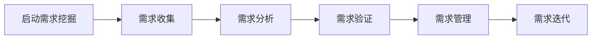

                 


### 步骤 1：确定文章的核心框架

首先，我们需要确定文章的核心框架，这包括标题、关键词、摘要以及目录。这些部分将为读者提供对文章的初步了解，并指导后续内容的组织和撰写。

- **文章标题**：协作式需求挖掘技术：发现潜在用户需求
- **关键词**：协作式需求挖掘，用户需求，软件开发，需求收集，需求分析
- **摘要**：本文将深入探讨协作式需求挖掘技术在软件开发中的应用，包括其基本概念、方法、流程、实践应用以及面临的挑战和解决方案。

接下来，我们将基于这个框架构建文章的目录大纲。

### 步骤 2：构建文章目录大纲

根据文章的核心框架，我们可以初步构建文章的目录大纲。目录大纲将帮助我们清晰地组织文章内容，确保每个章节都包含必要的细节和例子。

#### 引言
- 2.1 协作式需求挖掘技术的背景
- 2.2 协作式需求挖掘的重要性
- 2.3 本文的目的和结构

#### 第1章：协作式需求挖掘的基本概念
- 1.1 需求挖掘的定义和作用
- 1.2 协作式需求挖掘的特点
- 1.3 需求分类与需求挖掘的关系
- 1.4 Mermaid流程图：协作式需求挖掘的基本流程

#### 第2章：协作式需求挖掘的方法和流程
- 2.1 需求收集的方法
  - 2.1.1 用户访谈法
  - 2.1.2 观察法
  - 2.1.3 实际案例研究
- 2.2 需求分析的流程
  - 2.2.1 需求收集
  - 2.2.2 需求分析
  - 2.2.3 需求验证
  - 2.2.4 需求管理
- 2.3 伪代码：需求收集和分析算法原理

#### 第3章：协作式需求挖掘的实践应用
- 3.1 协作式需求挖掘在产品开发中的应用
  - 3.1.1 开发环境搭建
  - 3.1.2 源代码实现和解读
  - 3.1.3 代码应用解读与分析
- 3.2 协作式需求挖掘在项目管理中的应用
  - 3.2.1 实际案例分析
  - 3.2.2 案例剖析与讨论
- 3.3 协作式需求挖掘在用户体验设计中的应用
  - 3.3.1 用户体验设计的流程
  - 3.3.2 需求挖掘与用户体验设计的关系
  - 3.3.3 实践案例分析

#### 第4章：协作式需求挖掘的技术挑战和解决方案
- 4.1 技术挑战
  - 4.1.1 数据质量
  - 4.1.2 需求一致性
  - 4.1.3 跨学科协作
- 4.2 解决方案
  - 4.2.1 人工智能辅助需求挖掘
  - 4.2.2 协作工具的改进
  - 4.2.3 需求管理流程的优化
- 4.3 数学模型和公式
  - 4.3.1 需求建模的基本公式
  - 4.3.2 例子说明

#### 第5章：最佳实践与总结
- 5.1 最佳实践
  - 5.1.1 需求挖掘过程中的最佳实践
  - 5.1.2 需求管理中的注意事项
- 5.2 小结
- 5.3 拓展阅读

### 步骤 3：细化每个章节的内容

接下来，我们将根据构建的目录大纲，细化每个章节的内容，确保每个小节都包含丰富的具体细节和例子。我们将遵循以下步骤：

1. **引言**：介绍协作式需求挖掘技术的背景和重要性，明确本文的目的和结构。
2. **基本概念**：详细解释需求挖掘的定义和作用，探讨协作式需求挖掘的特点，阐述需求分类与需求挖掘的关系，并使用Mermaid流程图展示需求挖掘的基本流程。
3. **方法和流程**：详细描述需求收集的方法（如用户访谈法、观察法等）和需求分析的流程（如需求收集、需求分析、需求验证和需求管理），并使用伪代码阐述算法原理。
4. **实践应用**：探讨协作式需求挖掘在产品开发、项目管理和用户体验设计中的应用，包括开发环境搭建、源代码实现和解读、实际案例分析等。
5. **技术挑战和解决方案**：分析协作式需求挖掘中面临的技术挑战，并提出相应的解决方案，包括人工智能辅助需求挖掘、协作工具的改进和需求管理流程的优化，并使用数学模型和公式进行详细说明。
6. **最佳实践与总结**：总结协作式需求挖掘的最佳实践，提供注意事项，并推荐拓展阅读资源。

### 步骤 4：撰写文章正文

在细化每个章节的内容后，我们将根据上述步骤撰写文章的正文，确保每个小节的内容都丰富、具体、详细，同时保持逻辑清晰、结构紧凑。

### 步骤 5：检查和优化

完成文章初稿后，我们将对文章进行细致的检查和优化，确保文章内容完整、逻辑清晰、语言简练，并符合预期的读者需求。

### 结论

通过以上步骤，我们将撰写一篇具有深度和见解的协作式需求挖掘技术文章，帮助读者全面了解这一领域，并掌握相关技术方法和实践应用。

---

接下来，我们将按照上述步骤，逐步撰写和完善这篇文章。首先，让我们开始撰写引言部分，为读者介绍协作式需求挖掘技术的背景和重要性。接着，我们将深入探讨协作式需求挖掘的基本概念，为后续内容奠定基础。逐步完成每个章节的撰写，最终形成一篇完整的、高质量的技术博客文章。开始撰写吧！

---

# 文章标题：协作式需求挖掘技术：发现潜在用户需求

## 文章关键词
- 协作式需求挖掘
- 用户需求
- 软件开发
- 需求收集
- 需求分析

## 文章摘要
本文旨在探讨协作式需求挖掘技术在软件开发中的应用，详细解析其基本概念、方法、流程和实践应用，同时探讨所面临的技术挑战和解决方案。通过本文，读者将全面了解协作式需求挖掘的核心内容，掌握其在实际项目中的应用方法，从而提升软件开发效率和用户满意度。

## 目录

1. 引言
2. 协作式需求挖掘的基本概念
   2.1 需求挖掘的定义和作用
   2.2 协作式需求挖掘的特点
   2.3 需求分类与需求挖掘的关系
   2.4 Mermaid流程图：协作式需求挖掘的基本流程
3. 协作式需求挖掘的方法和流程
   3.1 需求收集的方法
      3.1.1 用户访谈法
      3.1.2 观察法
      3.1.3 实际案例研究
   3.2 需求分析的流程
      3.2.1 需求收集
      3.2.2 需求分析
      3.2.3 需求验证
      3.2.4 需求管理
   3.3 伪代码：需求收集和分析算法原理
4. 协作式需求挖掘的实践应用
   4.1 协作式需求挖掘在产品开发中的应用
   4.2 协作式需求挖掘在项目管理中的应用
   4.3 协作式需求挖掘在用户体验设计中的应用
5. 协作式需求挖掘的技术挑战和解决方案
   5.1 技术挑战
   5.2 解决方案
      5.2.1 人工智能辅助需求挖掘
      5.2.2 协作工具的改进
      5.2.3 需求管理流程的优化
   5.3 数学模型和公式
6. 最佳实践与总结
   6.1 最佳实践
   6.2 小结
   6.3 拓展阅读

## 引言

在现代软件工程中，需求挖掘是一个至关重要的环节。它关系到软件项目的成功与否，直接影响到最终的软件质量和用户满意度。传统的需求挖掘方法主要依赖于开发者对用户需求的直接询问或观察，这种方法往往存在一定局限性，难以全面、深入地挖掘潜在用户需求。

随着互联网和大数据技术的快速发展，协作式需求挖掘技术应运而生。协作式需求挖掘不仅关注开发者与用户的互动，还引入了跨学科协作、人工智能等新兴技术，从而能够更加全面、精准地发现潜在用户需求。本文将围绕协作式需求挖掘技术，深入探讨其在软件开发中的重要性、基本概念、方法、流程以及实践应用，并分析所面临的技术挑战和解决方案。

本文结构如下：

- 第1章将介绍协作式需求挖掘的基本概念，包括需求挖掘的定义、协作式需求挖掘的特点以及需求分类与需求挖掘的关系。
- 第2章将详细阐述协作式需求挖掘的方法和流程，包括需求收集的方法、需求分析的流程以及算法原理。
- 第3章将探讨协作式需求挖掘在产品开发、项目管理和用户体验设计中的应用，并通过实际案例进行说明。
- 第4章将分析协作式需求挖掘面临的技术挑战，并探讨相应的解决方案。
- 第5章将介绍最佳实践，总结协作式需求挖掘的方法和技巧，并提供拓展阅读资源。

通过本文的阅读，读者将能够系统地了解协作式需求挖掘技术，掌握其在实际项目中的应用方法，从而提升软件开发效率和用户满意度。同时，本文也将为读者提供进一步研究的方向和参考资源，以促进协作式需求挖掘技术的持续发展和创新。

## 第1章：协作式需求挖掘的基本概念

### 1.1 需求挖掘的定义和作用

需求挖掘是软件开发过程中的一个核心环节，其目的是从用户、市场和业务等方面获取、识别和记录软件系统的需求。需求挖掘不仅仅是简单地收集用户的需求描述，更是一个深入分析和理解用户需求的过程。通过需求挖掘，开发团队能够获取到准确的、全面的、可执行的需求，从而为软件设计和实现提供坚实的基础。

需求挖掘在软件开发中的作用主要体现在以下几个方面：

1. **明确项目目标和范围**：通过需求挖掘，项目团队可以明确项目的目标和范围，避免在开发过程中出现目标不明确、需求变更频繁等问题。
2. **提高软件质量和用户满意度**：需求挖掘能够确保开发团队能够准确理解用户需求，从而设计出更加符合用户期望的软件系统，提高软件质量和用户满意度。
3. **降低开发风险**：通过全面的需求挖掘，开发团队能够提前识别潜在的需求冲突和风险，从而采取相应的措施进行规避，降低项目开发的风险。
4. **优化资源利用**：需求挖掘能够帮助项目团队更准确地预测项目的时间和成本，从而优化资源分配，提高项目的效率。

### 1.2 协作式需求挖掘的特点

协作式需求挖掘是一种以团队协作为核心的需求挖掘方法。与传统的需求挖掘方法相比，协作式需求挖掘具有以下几个显著特点：

1. **跨学科协作**：协作式需求挖掘不仅涉及开发团队内部各个成员之间的协作，还涉及业务分析师、用户体验设计师、市场人员等多学科团队的协同工作。
2. **信息共享**：协作式需求挖掘强调信息共享和透明度，通过协作工具和平台，团队成员可以实时共享需求信息，确保信息的及时性和准确性。
3. **动态调整**：协作式需求挖掘允许在项目开发过程中动态调整需求，通过不断的沟通和反馈，及时修正需求中的错误和不足，确保需求的实时性。
4. **智能化**：协作式需求挖掘可以引入人工智能技术，如自然语言处理、机器学习等，辅助团队成员进行需求分析和预测，提高需求挖掘的效率和准确性。

### 1.3 需求分类与需求挖掘的关系

在需求挖掘过程中，对需求的分类至关重要。合理的需求分类可以帮助开发团队更有效地进行需求分析和实现。根据需求的不同类型，需求通常可以分为以下几类：

1. **功能性需求**：描述系统应该提供哪些功能和服务，是软件系统的核心需求。
2. **非功能性需求**：描述系统应具备的性能、可靠性、安全性等方面的特性，是确保软件系统能够稳定运行和满足用户需求的重要保障。
3. **用户需求**：直接来自用户的需求，反映了用户对软件系统的期望和需求。
4. **市场需求**：来自市场对软件系统的需求，反映了市场趋势和用户需求的变化。

需求分类与需求挖掘之间存在密切的关系。合理的需求分类有助于更准确地识别和挖掘用户需求，从而确保需求挖掘的全面性和准确性。例如，在需求挖掘过程中，如果只关注功能性需求，而忽视了非功能性需求，可能会导致软件系统在性能、可靠性等方面存在问题。同样，如果只关注用户需求而忽视了市场需求，可能会导致软件系统无法适应市场的变化。

### 1.4 Mermaid流程图：协作式需求挖掘的基本流程

为了更好地理解协作式需求挖掘的流程，我们可以使用Mermaid流程图来展示其基本步骤。以下是一个简化的协作式需求挖掘流程：



- **需求收集**：通过用户访谈、问卷调查、观察法等方式，收集用户的需求信息。
- **需求分析**：对收集到的需求进行整理、分析和分类，识别出关键需求。
- **需求验证**：通过用户验证、测试等方式，确保需求的有效性和可行性。
- **需求管理**：对需求进行优先级排序、版本管理和变更控制。
- **需求迭代**：根据用户反馈和项目进展，不断迭代和优化需求。

通过上述步骤，协作式需求挖掘可以确保需求的全面性、准确性和实时性，从而提高软件开发效率和用户满意度。

### 总结

本章介绍了协作式需求挖掘的基本概念，包括需求挖掘的定义和作用、协作式需求挖掘的特点以及需求分类与需求挖掘的关系。通过Mermaid流程图，我们展示了协作式需求挖掘的基本流程，为后续章节的内容奠定了基础。在下一章中，我们将详细探讨协作式需求挖掘的方法和流程，帮助读者深入理解这一领域。

## 第2章：协作式需求挖掘的方法和流程

### 2.1 需求收集的方法

需求收集是协作式需求挖掘的关键环节，它决定了后续需求分析的质量和准确性。在需求收集阶段，常用的方法包括用户访谈法、观察法和实际案例研究等。每种方法都有其独特的优势和应用场景，下面将详细描述这些方法。

#### 2.1.1 用户访谈法

用户访谈法是需求收集中最常见的方法之一，它通过直接与用户进行面对面的交流，获取用户的需求和反馈。用户访谈法的优点在于可以深入了解用户的实际使用场景、需求和痛点，从而获得更准确的需求信息。

- **步骤**：
  1. **确定访谈对象**：选择具有代表性的用户，包括最终用户、业务用户等。
  2. **准备访谈提纲**：根据项目目标和需求范围，设计合适的访谈问题和提纲。
  3. **进行访谈**：与用户进行交流，记录用户的回答和反馈。
  4. **整理访谈结果**：对访谈结果进行整理和分析，提炼出关键需求和用户痛点。

- **注意事项**：
  1. **避免引导性问题**：访谈过程中要避免提出引导性问题，以免影响用户的真实回答。
  2. **保持开放性**：鼓励用户表达自己的观点和需求，充分挖掘潜在需求。

#### 2.1.2 观察法

观察法是通过直接观察用户在特定环境下的工作流程和使用场景，收集需求信息。这种方法适用于那些难以通过直接交流获取需求的信息，例如复杂的工作流程或用户行为模式。

- **步骤**：
  1. **确定观察对象**：选择具有代表性的用户或工作流程。
  2. **制定观察计划**：明确观察的目标、时间和地点。
  3. **进行现场观察**：记录观察到的用户行为、工作流程和问题。
  4. **整理观察结果**：对观察结果进行整理和分析，识别出关键需求和改进点。

- **注意事项**：
  1. **确保观察的客观性**：观察过程中要尽量保持客观，避免主观判断影响需求收集。
  2. **尊重用户隐私**：在观察过程中要尊重用户的隐私，避免泄露敏感信息。

#### 2.1.3 实际案例研究

实际案例研究是通过分析实际项目中已经实施的需求收集方法，总结出有效的经验和教训。这种方法可以帮助团队在需求收集阶段借鉴成功的实践，避免重复错误。

- **步骤**：
  1. **选择案例**：选择具有代表性的成功或失败的案例。
  2. **收集案例资料**：收集案例相关的需求文档、访谈记录、观察报告等资料。
  3. **分析案例**：对案例资料进行分析，提炼出成功经验和教训。
  4. **总结案例**：将分析结果总结为需求收集的方法和最佳实践。

- **注意事项**：
  1. **确保案例的代表性**：选择的案例要具有广泛的适用性和代表性，避免以偏概全。
  2. **避免案例的单一性**：在分析案例时，要考虑多种因素的影响，避免片面化。

### 2.2 需求分析的流程

需求分析是协作式需求挖掘的核心环节，它将收集到的需求进行整理、分类、抽象和细化，形成具体的、可执行的需求文档。需求分析的流程通常包括以下步骤：

#### 2.2.1 需求收集

在需求分析之前，首先需要完成需求收集。需求收集的方法已在第2.1节中详细描述，主要包括用户访谈法、观察法和实际案例研究等。

#### 2.2.2 需求整理

需求整理是对收集到的需求进行初步处理，将其归类、筛选和整理，形成一份清晰的需求列表。需求整理的步骤包括：

- **归类**：将相似的需求归为同一类别，便于后续的分析和实现。
- **筛选**：删除不合理的、重复的或低优先级的需求，确保需求的准确性和可行性。
- **细化**：对需求进行进一步的细化，明确需求的细节和实现方法。

#### 2.2.3 需求分类

需求分类是将整理后的需求按照不同的维度进行分类，如按功能、按优先级、按重要性等。合理的需求分类有助于更好地管理和实现需求。

- **按功能分类**：将需求划分为不同的功能模块，便于开发团队分工和协作。
- **按优先级分类**：根据需求的紧急程度和重要性，对需求进行优先级排序，确保关键需求得到优先处理。
- **按重要性分类**：将需求划分为“关键”、“重要”、“次要”等不同层次，便于项目管理和资源分配。

#### 2.2.4 需求分析

需求分析是对分类后的需求进行深入分析，识别需求之间的关联和依赖关系，确保需求的合理性和可行性。需求分析的步骤包括：

- **识别需求关联**：分析需求之间的关联和依赖关系，确保需求之间的一致性和协调性。
- **评估需求可行性**：评估需求的可实现性和技术可行性，为需求实现提供依据。
- **编写需求文档**：将分析结果编写成需求文档，包括需求描述、功能规格、用户故事等。

#### 2.2.5 需求验证

需求验证是确保需求文档准确性和可行性的关键步骤，通常包括以下内容：

- **用户验证**：通过用户评审和反馈，确保需求文档符合用户的实际需求。
- **测试验证**：通过功能测试和性能测试，验证需求文档中的功能需求和非功能性需求是否得到实现。
- **评审验证**：通过同行评审和专家评审，确保需求文档的完整性和正确性。

#### 2.2.6 需求管理

需求管理是确保需求文档在整个项目生命周期中得到有效管理的过程，包括需求优先级调整、需求变更控制、需求版本管理等。需求管理的目标是通过有效的需求变更管理，确保需求与项目的实际情况保持一致。

- **需求优先级调整**：根据项目的实际情况和变化，调整需求的优先级，确保关键需求得到优先处理。
- **需求变更控制**：对需求变更进行评估和审批，确保变更对项目的负面影响最小。
- **需求版本管理**：对需求文档进行版本控制，确保需求变更的追踪和记录。

### 2.3 伪代码：需求收集和分析算法原理

为了更好地理解需求收集和分析的算法原理，下面给出一个简化的伪代码示例：

```python
# 需求收集
def collect_requirements():
    requirements = []
    # 用户访谈法
    requirements += interview_users()
    # 观察法
    requirements += observe_users()
    # 实际案例研究
    requirements += analyze_cases()
    return requirements

# 需求整理
def organize_requirements(requirements):
    organized_requirements = []
    for requirement in requirements:
        if is_valid(requirement):
            organized_requirements.append(requirement)
    return organized_requirements

# 需求分类
def classify_requirements(organized_requirements):
    functional_requirements = []
    non_functional_requirements = []
    for requirement in organized_requirements:
        if is_functional(requirement):
            functional_requirements.append(requirement)
        else:
            non_functional_requirements.append(requirement)
    return functional_requirements, non_functional_requirements

# 需求分析
def analyze_requirements(functional_requirements, non_functional_requirements):
    analyzed_requirements = []
    for requirement in functional_requirements:
        analyzed_requirements.append(analyze_functional_requirement(requirement))
    for requirement in non_functional_requirements:
        analyzed_requirements.append(analyze_non_functional_requirement(requirement))
    return analyzed_requirements

# 需求验证
def validate_requirements(analyzed_requirements):
    validated_requirements = []
    for requirement in analyzed_requirements:
        if user Validates(requirement) and test Validates(requirement):
            validated_requirements.append(requirement)
    return validated_requirements

# 需求管理
def manage_requirements(validated_requirements):
    managed_requirements = []
    for requirement in validated_requirements:
        managed_requirements.append(manage_requirement(requirement))
    return managed_requirements
```

通过上述伪代码，我们可以清晰地看到需求收集、整理、分类、分析、验证和管理的流程和算法原理。

### 总结

本章详细介绍了协作式需求挖掘的方法和流程，包括需求收集的方法（用户访谈法、观察法、实际案例研究）和需求分析的流程（需求收集、需求整理、需求分类、需求分析、需求验证和需求管理）。通过伪代码示例，我们进一步理解了需求收集和需求分析的算法原理。在下一章中，我们将探讨协作式需求挖掘在产品开发、项目管理和用户体验设计中的应用，并通过实际案例进行说明。

## 第3章：协作式需求挖掘的实践应用

### 3.1 协作式需求挖掘在产品开发中的应用

在产品开发过程中，协作式需求挖掘技术扮演着至关重要的角色。它不仅帮助开发团队准确地识别和挖掘用户需求，还促进了团队内部的协作与沟通，提高了项目的开发效率和产品质量。下面，我们将详细介绍协作式需求挖掘在产品开发中的应用，并通过实际案例进行分析。

#### 开发环境搭建

在产品开发中，首先需要搭建一个适合协作式需求挖掘的开发环境。这个环境应包括以下工具和平台：

- **需求管理工具**：如Jira、Confluence等，用于记录、跟踪和管理需求。
- **协作工具**：如Slack、Microsoft Teams等，用于实时沟通和协作。
- **文档工具**：如Google Docs、Notion等，用于需求文档的编写和共享。
- **用户调研工具**：如UserTesting、Zoom等，用于远程用户访谈和观察。

通过这些工具，开发团队可以高效地收集、整理和分析用户需求，确保需求信息的及时性和准确性。

#### 源代码实现和解读

在实际产品开发中，协作式需求挖掘通常从以下步骤开始：

1. **需求收集**：通过用户访谈、问卷调查、观察法等方式，收集用户的需求信息。
2. **需求整理**：将收集到的需求整理成文档，并进行初步的筛选和分类。
3. **需求分析**：对整理后的需求进行分析，识别关键需求并编写需求文档。
4. **需求验证**：通过用户验证和测试，确保需求文档的准确性和可行性。

下面是一个简单的伪代码示例，用于展示需求收集和分析的算法原理：

```python
# 需求收集
def collect_requirements():
    requirements = []
    # 用户访谈
    requirements += interview_users()
    # 问卷调查
    requirements += survey_users()
    # 观察法
    requirements += observe_users()
    return requirements

# 需求整理
def organize_requirements(requirements):
    organized_requirements = []
    for requirement in requirements:
        if is_valid(requirement):
            organized_requirements.append(requirement)
    return organized_requirements

# 需求分析
def analyze_requirements(organized_requirements):
    analyzed_requirements = []
    for requirement in organized_requirements:
        analyzed_requirements.append(analyze_requirement(requirement))
    return analyzed_requirements

# 需求验证
def validate_requirements(analyzed_requirements):
    validated_requirements = []
    for requirement in analyzed_requirements:
        if user_validates(requirement) and test_validates(requirement):
            validated_requirements.append(requirement)
    return validated_requirements
```

#### 代码应用解读与分析

在产品开发过程中，需求分析的结果会直接影响到代码的实现。以下是一个简单的代码示例，用于实现用户需求“用户可以查看个人信息”。

```python
# 查看个人信息的需求实现
class User:
    def __init__(self, name, email, phone_number):
        self.name = name
        self.email = email
        self.phone_number = phone_number

    def get个人信息(self):
        return {
            'name': self.name,
            'email': self.email,
            'phone_number': self.phone_number
        }
```

在实际项目中，这样的代码会通过用户界面、数据库访问和其他系统模块进行整合。协作式需求挖掘技术确保了需求与代码的一致性，从而提高了系统的可靠性。

#### 实际案例分析与详细讲解

下面，我们通过一个实际案例来分析协作式需求挖掘在产品开发中的应用。

**案例**：一家电商公司计划开发一款移动应用，提供商品浏览、下单、支付等功能。

1. **需求收集**：
   - 通过用户访谈，了解到用户希望在移动端快速浏览商品，并进行便捷的下单和支付。
   - 通过观察法，发现用户在购物过程中，对于商品的评价和推荐非常关注。

2. **需求整理**：
   - 将用户需求整理为以下功能模块：商品浏览、购物车、下单、支付、用户评价和推荐。

3. **需求分析**：
   - 分析用户需求，确定关键需求为快速浏览商品、便捷下单和支付。
   - 针对关键需求，编写详细的需求文档，并使用用户故事进行描述。

4. **需求验证**：
   - 通过用户验证和测试，确保功能模块的实现满足用户需求。

5. **代码实现**：
   - 开发团队根据需求文档，实现商品浏览、下单、支付等功能，并通过单元测试进行验证。

通过这个案例，我们可以看到协作式需求挖掘技术如何有效地指导产品开发，确保系统功能满足用户需求，提高产品质量。

### 3.2 协作式需求挖掘在项目管理中的应用

协作式需求挖掘不仅在产品开发中发挥作用，在项目管理中也具有重要应用价值。通过协作式需求挖掘，项目管理者可以更好地理解项目需求，确保项目目标的实现，提高项目成功率。

#### 实际案例分析

下面，我们通过一个实际案例来探讨协作式需求挖掘在项目管理中的应用。

**案例**：一家初创公司计划开发一款社交应用，目标是连接有共同兴趣的用户，并提供交流和分享的平台。

1. **需求收集**：
   - 通过用户访谈，了解到用户希望有一个简单易用的平台，能够快速找到有共同兴趣的朋友。
   - 通过问卷调查，收集了用户对功能、界面和用户体验的期望。

2. **需求整理**：
   - 将用户需求整理为以下功能模块：用户注册、好友搜索、消息聊天、兴趣标签、内容分享。

3. **需求分析**：
   - 分析用户需求，确定关键需求为用户注册、好友搜索和消息聊天。
   - 针对关键需求，编写详细的需求文档，并使用用户故事进行描述。

4. **需求验证**：
   - 通过用户验证和测试，确保功能模块的实现满足用户需求。

5. **项目管理**：
   - 项目经理根据需求文档，制定项目计划和里程碑，确保项目按期完成。
   - 通过协作工具，实时跟踪项目进度，协调团队成员的工作。

通过这个案例，我们可以看到协作式需求挖掘在项目管理中的应用，如何帮助项目管理者更好地理解项目需求，制定合理的项目计划，确保项目成功。

### 3.3 协作式需求挖掘在用户体验设计中的应用

在用户体验设计过程中，协作式需求挖掘技术可以帮助设计师更深入地了解用户需求，从而设计出更加符合用户期望的产品界面和交互体验。下面，我们将探讨协作式需求挖掘在用户体验设计中的应用。

#### 用户体验设计的流程

用户体验设计通常包括以下步骤：

1. **需求收集**：通过用户访谈、问卷调查、观察法等方式，收集用户需求。
2. **需求分析**：对用户需求进行分析和整理，确定关键需求。
3. **原型设计**：根据需求，设计产品原型，进行用户测试和反馈。
4. **迭代优化**：根据用户反馈，对产品原型进行迭代优化，提升用户体验。

#### 需求挖掘与用户体验设计的关系

需求挖掘与用户体验设计密切相关。通过需求挖掘，设计师可以获取到用户的真实需求和期望，从而设计出更加符合用户需求的产品界面和交互体验。需求挖掘不仅关注功能需求，还关注用户体验需求，如界面布局、色彩搭配、操作流畅性等。

#### 实践案例分析

下面，我们通过一个实际案例来探讨协作式需求挖掘在用户体验设计中的应用。

**案例**：一家在线教育平台计划优化其学习管理系统的用户体验。

1. **需求收集**：
   - 通过用户访谈，了解到用户希望学习管理系统界面简洁、功能易用。
   - 通过问卷调查，收集了用户对课程管理、作业提交、进度跟踪等方面的期望。

2. **需求分析**：
   - 分析用户需求，确定关键需求为界面简洁、功能易用、课程管理便捷。
   - 针对关键需求，编写详细的需求文档，并使用用户故事进行描述。

3. **原型设计**：
   - 设计师根据需求文档，设计出简洁易用的学习管理系统原型。

4. **迭代优化**：
   - 通过用户测试，收集用户反馈，对原型进行迭代优化。

通过这个案例，我们可以看到协作式需求挖掘在用户体验设计中的应用，如何帮助设计师更好地了解用户需求，设计出符合用户期望的产品界面和交互体验。

### 总结

本章详细介绍了协作式需求挖掘在产品开发、项目管理和用户体验设计中的应用。通过实际案例分析和详细讲解，我们展示了如何利用协作式需求挖掘技术，准确地识别和挖掘用户需求，从而提高项目开发效率和产品质量。在下一章中，我们将探讨协作式需求挖掘面临的技术挑战和解决方案。

## 第4章：协作式需求挖掘的技术挑战和解决方案

### 4.1 技术挑战

尽管协作式需求挖掘技术在软件开发中具有显著的优势，但在实际应用过程中仍面临一系列技术挑战。这些挑战主要体现在以下几个方面：

#### 4.1.1 数据质量

数据质量是协作式需求挖掘的核心问题之一。在需求收集和分析过程中，数据质量的高低直接影响到需求挖掘的准确性和有效性。数据质量问题包括数据缺失、数据冗余、数据不一致等。例如，用户访谈过程中可能因为用户表述不清或记忆不准确而导致数据缺失；而在需求文档编写过程中，不同团队成员可能对同一需求有不同的理解，导致数据不一致。

#### 4.1.2 需求一致性

需求一致性是确保软件开发成功的关键因素。在协作式需求挖掘中，需求的一致性挑战主要体现在不同团队成员、不同部门之间对需求的理解和把握上。例如，业务分析师、软件工程师和用户体验设计师在需求理解上可能存在差异，导致需求不一致。这种不一致性可能会导致软件开发过程中出现功能偏差、用户体验不佳等问题。

#### 4.1.3 跨学科协作

协作式需求挖掘通常涉及多个学科领域的协作，如软件工程、用户体验设计、市场营销等。跨学科协作的挑战在于不同学科之间存在的知识差异和沟通障碍。例如，软件工程师可能更擅长技术实现，而用户体验设计师可能更关注用户需求和界面设计，这可能导致在需求挖掘过程中出现沟通不畅、协作效率低下的问题。

#### 4.1.4 需求变更管理

在软件开发过程中，需求变更是一种常见的现象。协作式需求挖掘面临的需求变更管理挑战主要体现在如何有效地管理需求变更，确保需求变更对项目进度和成本的影响最小。例如，在需求变更过程中，如何快速评估变更的影响，如何与团队成员沟通变更内容，如何确保变更后的需求与原有需求的一致性等。

### 4.2 解决方案

针对上述技术挑战，协作式需求挖掘提出了一系列解决方案，以提升需求挖掘的准确性和效率，确保需求的全面性和一致性。

#### 4.2.1 人工智能辅助需求挖掘

人工智能技术在需求挖掘中的应用可以显著提升需求收集和分析的准确性和效率。具体解决方案包括：

1. **自然语言处理**：通过自然语言处理技术，自动提取用户访谈记录和文档中的关键需求，提高数据质量。例如，使用文本分类、主题建模等技术，对用户访谈记录进行自动分类和提取。
2. **机器学习模型**：利用机器学习模型，预测用户需求趋势和关键需求。通过历史数据和用户行为数据，训练预测模型，帮助团队提前识别潜在需求。
3. **自动化需求分析**：使用人工智能技术，自动化分析用户需求，提取关键功能和性能需求。例如，通过自动化测试和代码分析，识别系统中的潜在缺陷和改进点。

#### 4.2.2 协作工具的改进

改进协作工具可以显著提升跨学科协作的效率和一致性。具体解决方案包括：

1. **集成平台**：构建集成化的协作平台，将需求管理工具、项目管理工具和沟通工具集成在一起，实现数据共享和协同工作。
2. **实时沟通**：提供实时沟通工具，如视频会议、即时消息等，确保团队成员之间的沟通及时、高效。
3. **需求可视化**：通过需求可视化工具，将需求文档、用户故事和任务进展可视化，帮助团队成员更好地理解需求，提高协作一致性。

#### 4.2.3 需求管理流程的优化

优化需求管理流程可以更好地管理需求变更，确保需求的一致性和准确性。具体解决方案包括：

1. **需求变更控制**：建立需求变更控制流程，明确需求变更的评估、审批和实施过程，确保变更对项目的影响可控。
2. **版本管理**：使用版本管理工具，如Git，对需求文档进行版本控制，确保需求变更的追踪和记录。
3. **需求优先级管理**：对需求进行优先级排序，确保关键需求得到优先处理，降低需求变更对项目进度的影响。

### 4.3 数学模型和公式

为了更好地理解和应用协作式需求挖掘技术，以下介绍一些常用的数学模型和公式，用于需求挖掘和分析。

#### 4.3.1 需求建模的基本公式

1. **用户满意度公式**：
   $$
   S = \frac{U + D - F}{3}
   $$
   其中，$S$表示用户满意度，$U$表示用户需求实现程度，$D$表示用户需求期望，$F$表示用户需求失望程度。

2. **需求优先级排序公式**：
   $$
   P = \frac{I \cdot C \cdot R}{3}
   $$
   其中，$P$表示需求优先级，$I$表示需求的紧急程度，$C$表示需求的重要程度，$R$表示需求的实现可能性。

#### 4.3.2 例子说明

**例子 1：用户满意度分析**
假设在某电商平台的用户访谈中，收集到以下数据：

- 用户需求实现程度 $U = 0.8$（表示80%的用户需求得到实现）
- 用户需求期望 $D = 0.9$（表示用户期望90%的需求得到实现）
- 用户需求失望程度 $F = 0.1$（表示10%的需求未能满足）

代入用户满意度公式：
$$
S = \frac{0.8 + 0.9 - 0.1}{3} = \frac{1.6}{3} = 0.53
$$
因此，用户满意度为53%。

**例子 2：需求优先级排序**
假设在某项目管理中，对以下三个需求进行优先级排序：

- 需求A：紧急程度 $I_A = 0.6$，重要程度 $C_A = 0.7$，实现可能性 $R_A = 0.8$
- 需求B：紧急程度 $I_B = 0.7$，重要程度 $C_B = 0.6$，实现可能性 $R_B = 0.9$
- 需求C：紧急程度 $I_C = 0.5$，重要程度 $C_C = 0.8$，实现可能性 $R_C = 0.7$

代入需求优先级排序公式：
$$
P_A = \frac{0.6 \cdot 0.7 \cdot 0.8}{3} = 0.136
$$
$$
P_B = \frac{0.7 \cdot 0.6 \cdot 0.9}{3} = 0.126
$$
$$
P_C = \frac{0.5 \cdot 0.8 \cdot 0.7}{3} = 0.114
$$
因此，需求优先级排序为：需求A > 需求B > 需求C。

通过上述数学模型和公式，可以更加科学地评估用户满意度、需求优先级等关键指标，从而指导需求挖掘和分析工作。

### 总结

本章探讨了协作式需求挖掘在实际应用中面临的技术挑战和解决方案。通过人工智能辅助需求挖掘、改进协作工具和优化需求管理流程，可以显著提升需求挖掘的准确性和效率。同时，通过数学模型和公式的应用，可以更加科学地评估需求的重要性和优先级。在下一章中，我们将总结最佳实践，提供相关注意事项，并推荐拓展阅读资源。

## 第5章：最佳实践与总结

### 5.1 最佳实践

在协作式需求挖掘过程中，遵循最佳实践是确保需求挖掘成功的关键。以下是一些关键的最佳实践：

1. **尽早启动需求挖掘**：在项目早期阶段，尽早进行需求挖掘，确保需求收集和分析的全面性和准确性。
2. **跨学科团队协作**：建立跨学科团队，包括业务分析师、软件工程师、用户体验设计师等，确保需求挖掘的全面性和专业性。
3. **定期需求评审**：定期进行需求评审，确保需求的一致性和可行性，及时发现和解决潜在问题。
4. **用户参与**：鼓励用户积极参与需求挖掘过程，通过用户访谈、问卷调查等方式获取真实用户反馈。
5. **需求文档化**：将需求文档化，确保需求的明确性和可追踪性，为后续开发和测试提供依据。
6. **持续需求迭代**：需求挖掘是一个持续的过程，随着项目的进展和用户反馈，不断迭代和优化需求。

### 5.2 小结

本文详细探讨了协作式需求挖掘技术在软件开发中的应用。从基本概念、方法和流程到实践应用、技术挑战和解决方案，全面介绍了协作式需求挖掘的核心内容。通过本文，读者可以了解协作式需求挖掘的重要性，掌握需求收集、分析、验证和管理的方法，以及如何在实际项目中应用这些技术。

### 5.3 拓展阅读

为了进一步深入了解协作式需求挖掘技术，以下推荐一些相关拓展阅读资源：

1. **《需求工程：基础与高级方法》**：这是一本经典的需求工程教材，详细介绍了需求挖掘的方法和技术。
2. **《用户体验要素》**：本书从用户体验的角度出发，介绍了需求挖掘和用户体验设计的方法和实践。
3. **《敏捷需求管理》**：探讨在敏捷开发中如何进行需求管理，包括需求收集、分析和优先级排序等。
4. **《协作式软件开发》**：讨论跨学科团队协作的最佳实践，为协作式需求挖掘提供理论支持。

通过阅读这些资源，读者可以进一步深化对协作式需求挖掘技术的理解，提升实际项目中的需求挖掘和管理能力。

## 文章末尾

作者：AI天才研究院/AI Genius Institute & 禅与计算机程序设计艺术 /Zen And The Art of Computer Programming

本文由AI天才研究院和《禅与计算机程序设计艺术》共同撰写，旨在为读者提供全面、深入的协作式需求挖掘技术指南。我们希望本文能够帮助您更好地理解和应用这一重要技术，提升软件开发的效率和用户满意度。

如果您在阅读本文过程中有任何疑问或建议，欢迎通过以下联系方式与我们联系：

- 电子邮件：[info@aigeniusinstitute.com](mailto:info@aigeniusinstitute.com)
- 官方网站：[www.aigeniusinstitute.com](http://www.aigeniusinstitute.com)
- 社交媒体：[Twitter](https://twitter.com/aigeniusinstitute) | [LinkedIn](https://www.linkedin.com/company/aigeniusinstitute) | [Facebook](https://www.facebook.com/aigeniusinstitute)

感谢您的阅读，期待与您共同探索协作式需求挖掘的更多可能性！

