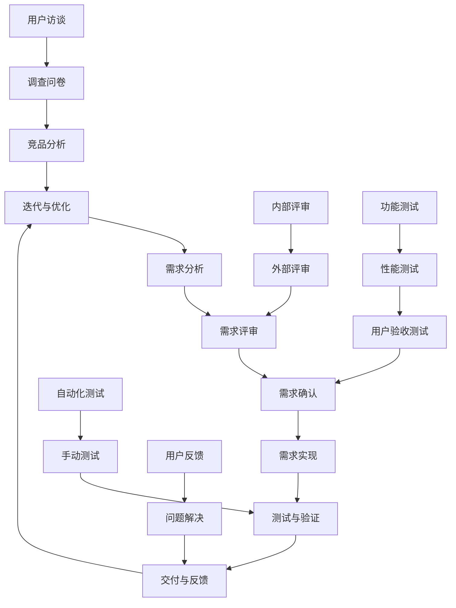

                 

### 文章标题：协作式需求验收：提高大型应用的交付质量

> 关键词：协作式需求验收，需求管理，用户故事，自动化测试，团队协作，案例实践

> 摘要：本文深入探讨了协作式需求验收在提高大型应用交付质量中的作用。通过介绍核心概念、协作框架、工具与技术、实践流程以及实际案例，本文为大型应用项目的需求管理提供了系统化的指导，旨在帮助读者理解并掌握协作式需求验收的方法与技巧。

## 目录

### 第一部分：协作式需求验收的概念与框架

#### 1.1 协作式需求验收概述

- **1.1.1 需求验收的传统方法**
- **1.1.2 协作式需求验收的定义与重要性**
- **1.1.3 协作式需求验收与传统需求验收的区别**

#### 1.2 协作式需求验收的核心概念

- **1.2.1 用户故事与需求**
- **1.2.2 概念验证（Proof of Concept）**
- **1.2.3 需求分解与优先级排序**

### 第二部分：协作式需求验收的工具与技术

#### 2.1 协作式需求验收工具介绍

- **2.1.1 需求管理工具**
- **2.1.2 版本控制工具**
- **2.1.3 自动化测试工具**

#### 2.2 协作式需求验收技术

- **2.2.1 自动化测试**
- **2.2.2 集成开发环境（IDE）**
- **2.2.3 其他协作工具**

### 第三部分：协作式需求验收实践

#### 3.1 需求收集与整理

- **3.1.1 需求收集的方法与技术**
- **3.1.2 需求整理的步骤与工具**
- **3.1.3 需求管理中的常见问题与解决策略**

#### 3.2 需求评审与确认

- **3.2.1 需求评审的目的与过程**
- **3.2.2 需求确认的方法与工具**
- **3.2.3 需求评审与确认的实际案例**

### 第四部分：协作式需求验收案例分析

#### 4.1 案例背景介绍

- **4.1.1 案例企业的基本情况**
- **4.1.2 案例项目的目标与挑战**

#### 4.2 需求验收过程

- **4.2.1 需求收集与整理**
- **4.2.2 需求评审与确认**
- **4.2.3 需求验证与测试**

#### 4.3 案例总结与启示

- **4.3.1 案例中的成功经验**
- **4.3.2 案例中的问题与挑战**
- **4.3.3 对其他企业的启示与借鉴**

## 结束语

### 参考文献

---

现在，我们将基于上述目录结构，逐步展开文章内容，详细介绍每个部分的具体内容。我们将确保每一个小节都包含了丰富的细节和实用的指导，帮助读者全面理解协作式需求验收的概念和实际应用。让我们开始第一步，探讨协作式需求验收的概述和重要性。

### 第一部分：协作式需求验收的概念与框架

#### 1.1 协作式需求验收概述

协作式需求验收是一种涉及多方面协作的需求确认过程，其核心在于通过团队协作和用户参与，确保软件应用能够满足用户需求，并在项目交付过程中保持高质量的交付。以下是协作式需求验收的几个关键点：

**1.1.1 需求验收的传统方法**

传统的需求验收通常是由开发团队和质量保证团队独立完成的。在这种模式下，需求文档会被开发团队作为指导，然后质量保证团队通过测试来验证需求的实现情况。然而，这种方法存在几个问题：

- **缺乏用户参与**：用户通常不直接参与需求验收，导致验收过程中可能忽视用户的实际需求和体验。
- **信息孤岛**：开发团队和质量保证团队之间的沟通不畅，可能导致需求理解不一致，影响验收效果。
- **高成本和低效率**：由于缺乏有效的协作和用户反馈，可能导致多次返工和修复，增加项目成本和交付时间。

**1.1.2 协作式需求验收的定义与重要性**

协作式需求验收是一种通过用户和开发团队紧密协作，共同确保软件应用满足用户需求的方法。其定义如下：

协作式需求验收是一个动态的过程，它涉及用户、项目经理、开发团队和测试团队的紧密协作，通过持续反馈和迭代，确保软件应用在各个开发阶段都能满足用户的需求，并且具备高质量。

协作式需求验收的重要性体现在以下几个方面：

- **提高交付质量**：通过用户和团队的协作，能够更早发现和解决需求中的问题，从而提高应用的质量。
- **降低返工成本**：通过协作式需求验收，可以在开发早期阶段识别出潜在的问题，减少后期返工的成本。
- **增强用户满意度**：用户直接参与需求验收，能够确保应用功能符合用户的实际需求和期望，提高用户满意度。

**1.1.3 协作式需求验收与传统需求验收的区别**

传统需求验收和协作式需求验收的主要区别在于参与人员和协作方式：

- **参与人员**：传统需求验收主要涉及开发团队和质量保证团队，而协作式需求验收则涉及用户、项目经理、开发团队和测试团队的紧密协作。
- **协作方式**：传统需求验收通常是在项目开发结束后进行，而协作式需求验收是一个贯穿整个项目生命周期，持续进行的过程。

**协作式需求验收的核心原则**

为了实现有效的协作式需求验收，需要遵循以下几个核心原则：

- **用户参与**：用户应该在整个项目周期内保持参与，提供反馈和需求变更。
- **迭代和反馈**：通过短周期迭代和频繁的反馈，确保需求变更能够及时反映在应用开发中。
- **沟通和协作**：建立有效的沟通渠道和协作机制，确保团队成员之间的信息畅通。

### 总结

在本节中，我们介绍了协作式需求验收的概述和重要性。协作式需求验收通过用户和团队的紧密协作，提高了交付质量，降低了成本，并增强了用户满意度。与传统需求验收相比，协作式需求验收更加注重用户参与和持续反馈，通过迭代和协作实现需求的动态调整。在下一节中，我们将深入探讨协作式需求验收的核心概念，包括用户故事、概念验证和需求分解等内容。

---

### 第一部分：协作式需求验收的概念与框架

#### 1.2 协作式需求验收的核心概念

协作式需求验收的成功依赖于一系列核心概念和方法，这些概念不仅定义了需求验收的过程，也确保了需求的准确性和应用的适用性。以下是几个关键的核心概念：

**1.2.1 用户故事与需求**

用户故事（User Story）是敏捷开发中的一种需求表达方式，它以用户为中心，描述了用户希望应用能够实现的功能。用户故事的格式通常为：“作为[用户角色]，我需要[功能]，以便[目的]”。

**用户故事地图**：用户故事地图是一种可视化工具，它将多个用户故事组织在一起，展示它们之间的关联和优先级。用户故事地图可以帮助团队理解整个系统的功能和用户流程。

**需求分解与优先级排序**：需求分解是将大型需求分解为更小的、可管理的子需求的过程。优先级排序则是根据需求的重要性和紧急性对需求进行排序，以确保团队能够首先实现最关键的功能。

**1.2.2 概念验证（Proof of Concept）**

概念验证（Proof of Concept, PoC）是在正式开发之前对某个技术概念或假设进行实验验证的过程。它的目的是确定某个技术或解决方案是否可行，以及是否存在潜在的技术障碍。

**概念验证的目的**：概念验证的主要目的是减少项目开发风险，确保团队选择的技术方案是可行的，并且能够满足项目需求。

**概念验证的步骤**：

1. **明确目标**：确定概念验证的目标和范围。
2. **设计实验**：设计一个实验来验证概念。
3. **实施实验**：根据设计执行实验。
4. **分析结果**：分析实验结果，确定概念是否可行。

**1.2.3 需求分解与优先级排序**

需求分解是将大型需求分解为更小的、可管理的子需求的过程。需求分解的目的是确保需求可以被具体实现，并且团队可以清晰地理解每个需求的内容和优先级。

**需求分解的方法**：

1. **自上而下分解**：从高层次需求开始，逐步分解为更具体的需求。
2. **自下而上聚合**：从具体的需求开始，逐步聚合为高层次需求。

**优先级排序**：优先级排序是根据需求的重要性和紧急性对需求进行排序的过程。常用的优先级排序方法包括：

- **业务价值排序**：根据业务价值对需求进行排序，确保团队首先实现最有价值的部分。
- **风险排序**：根据需求实现过程中可能遇到的风险对需求进行排序，确保高风险需求先被实现。

**1.2.4 概念验证的方法与技术**

概念验证通常涉及到一系列技术实验和方法，以下是一些常用的概念验证方法：

- **原型设计**：通过创建原型来验证用户界面和用户体验。
- **技术演示**：通过技术演示来验证某个技术方案的可行性。
- **实验验证**：通过实际运行实验来验证技术或算法的有效性。

**概念验证的步骤**：

1. **明确验证目标**：确定概念验证的目标和具体要求。
2. **选择验证方法**：根据验证目标选择合适的验证方法。
3. **设计实验方案**：设计详细的实验方案，包括实验的执行步骤和评估标准。
4. **执行实验**：按照实验方案执行实验。
5. **分析结果**：分析实验结果，评估概念验证的成效。

### 总结

在本节中，我们详细介绍了协作式需求验收的几个核心概念：用户故事与需求、概念验证和需求分解与优先级排序。用户故事以用户为中心，概念验证用于技术方案的可行性评估，需求分解和优先级排序确保需求能够被有效管理和实现。这些核心概念和方法是协作式需求验收成功的关键。在下一节中，我们将探讨协作式需求验收的工具与技术，包括需求管理工具、版本控制工具和自动化测试工具等。

---

### 第二部分：协作式需求验收的工具与技术

协作式需求验收的成功不仅依赖于团队协作和用户参与，还需要一系列有效的工具和技术的支持。这些工具和技术能够提高需求管理的效率，确保需求被正确理解和实现。以下是几种关键的协作式需求验收工具与技术：

#### 2.1 协作式需求验收工具介绍

协作式需求验收工具是需求管理、协作和沟通的重要载体。以下是一些主流的需求管理工具：

**1.1 需求管理工具**

**JIRA**：JIRA 是一款功能强大的需求管理工具，它支持用户故事地图、需求跟踪和迭代管理。用户可以在 JIRA 中创建和整理需求，并进行优先级排序和版本控制。

**Confluence**：Confluence 是一款协作平台，它支持团队文档的创建、共享和协作。Confluence 可以与 JIRA 集成，为需求管理提供完整的文档支持。

**Trello**：Trello 是一款基于看板的需求管理工具，它通过卡片和列表来组织和跟踪需求。Trello 的界面直观易用，适合小型团队和项目。

**1.2 版本控制工具**

**Git**：Git 是一款分布式版本控制系统，它支持代码的版本管理和协作开发。Git 的分支和合并功能使得需求变更和版本控制变得简单高效。

**SVN**：SVN 是一款集中式版本控制系统，它支持代码库的版本管理和多人协作。尽管 SVN 的使用不如 Git 广泛，但在某些场景下仍然是有效的版本控制工具。

**1.3 自动化测试工具**

**Selenium**：Selenium 是一款自动化测试框架，它支持多种浏览器和操作系统，可以进行功能测试和回归测试。Selenium 的开源特性使得它广泛应用于大型应用项目的自动化测试。

**JMeter**：JMeter 是一款性能测试工具，它主要用于测试 Web 应用程序的性能和负载能力。JMeter 可以模拟大量用户行为，帮助团队评估应用的稳定性和响应时间。

#### 2.2 协作式需求验收技术

**2.2.1 自动化测试**

自动化测试是协作式需求验收中不可或缺的一环，它能够提高测试效率，减少人工测试的工作量，并确保需求实现的一致性和可靠性。以下是自动化测试的关键技术：

**1. 自动化测试的优势与挑战**

**优势**：

- **提高测试效率**：自动化测试可以快速执行大量测试用例，节省测试时间和人力成本。
- **保证测试质量**：自动化测试可以确保测试的一致性和准确性，减少人为错误。
- **持续集成**：自动化测试可以与持续集成（CI）工具集成，实现测试的自动化和持续化。

**挑战**：

- **测试用例设计**：自动化测试需要设计详细的测试用例，这需要一定的时间和经验。
- **维护成本**：自动化测试用例需要定期维护和更新，以适应需求变更和系统更新。
- **技术门槛**：自动化测试涉及到多种技术和工具，需要团队成员具备一定的技术能力。

**2. 自动化测试框架与工具**

**Selenium**：Selenium 是一款流行的自动化测试框架，它支持多种编程语言，如 Java、Python 和 C#。Selenium 可以与浏览器插件结合使用，模拟用户在浏览器中的操作，进行功能测试和回归测试。

**TestNG**：TestNG 是一款功能强大的自动化测试框架，它支持多种编程语言，并提供丰富的测试功能，如数据驱动测试、依赖测试和并行测试。

**JUnit**：JUnit 是一款经典的自动化测试框架，它主要用于 Java 程序的单元测试。JUnit 提供了丰富的测试注解和断言方法，可以帮助团队快速编写和执行测试用例。

**3. 自动化测试的实际案例**

**案例 1：电商网站测试**  
某电商网站使用了 Selenium 和 TestNG 进行自动化测试，测试用例包括商品搜索、购物车操作、订单提交等。通过自动化测试，团队能够快速验证新功能和修复缺陷，提高了网站的稳定性和用户体验。

**案例 2：金融系统测试**  
某金融系统采用了 JMeter 进行性能测试，测试内容包括并发用户数、交易速度和系统响应时间。通过 JMeter 的测试结果，团队能够识别系统瓶颈，优化系统性能，提高用户体验。

**2.2.2 集成开发环境（IDE）**

集成开发环境（IDE）是开发者进行代码编写、调试和测试的重要工具，它集成了代码编辑器、编译器、调试器和测试工具，为开发者提供了便捷的开发体验。

**1. IDE的基本功能**

- **代码编辑器**：支持代码自动补全、语法高亮、代码格式化等功能。
- **编译器和调试器**：支持代码编译和调试，帮助开发者快速定位和修复代码错误。
- **测试工具**：集成测试工具，如JUnit、Selenium等，方便开发者编写和执行测试用例。

**2. IDE在需求验收中的应用**

- **代码审查**：IDE 的代码审查功能可以帮助团队发现潜在的问题和缺陷，确保代码质量。
- **调试和测试**：IDE 的调试和测试功能可以方便开发者进行代码调试和测试，提高开发效率。

**3. IDE的实际使用案例**

**案例 1：Java 开发**  
某团队使用 IntelliJ IDEA 进行 Java 开发，通过 IDE 的代码编辑器、编译器和测试工具，团队能够高效地编写、调试和测试代码，提高了开发质量和效率。

**案例 2：Python 开发**  
某团队使用 PyCharm 进行 Python 开发，通过 PyCharm 的代码编辑器、调试器和测试工具，团队能够快速开发和测试 Python 应用程序，提高了开发效率。

**2.2.3 其他协作工具**

除了需求管理工具、版本控制工具和自动化测试工具外，还有许多其他协作工具可以帮助团队提高协作效率：

- **Slack**：Slack 是一款流行的团队协作工具，它支持实时沟通、文件共享和任务管理。
- **Trello**：Trello 是一款基于看板的协作工具，它可以帮助团队组织和跟踪项目进度。
- **Asana**：Asana 是一款任务管理工具，它可以帮助团队分配任务、跟踪进度和协作沟通。

### 总结

在本节中，我们介绍了协作式需求验收的主要工具和技术，包括需求管理工具、版本控制工具、自动化测试工具和集成开发环境（IDE）。这些工具和技术为协作式需求验收提供了有效的支持，帮助团队提高需求管理的效率和质量。在下一节中，我们将探讨协作式需求验收的实践流程，包括需求收集、需求评审和需求确认等步骤。

---

### 第三部分：协作式需求验收实践

协作式需求验收实践是一个动态、迭代的过程，涉及多个环节和多个团队角色的协作。以下将详细介绍协作式需求验收实践的具体流程，包括需求收集、需求评审和需求确认等步骤。

#### 3.1 需求收集

需求收集是协作式需求验收的第一步，它涉及从用户和其他利益相关者获取应用需求。有效的需求收集可以帮助团队明确应用目标，减少项目开发中的不确定性。

**3.1.1 需求收集的方法与技术**

**1. 用户访谈**

用户访谈是一种直接从用户获取需求的方法，通过与用户进行面对面的交流，可以深入了解用户的需求、偏好和期望。以下是一些用户访谈的技巧：

- **准备充分**：在访谈前，了解用户的基本信息和需求背景，准备好访谈的问题和提纲。
- **倾听与引导**：在访谈过程中，要积极倾听用户的需求，适时进行引导，确保用户能够充分表达自己的观点。
- **记录与总结**：访谈结束后，对用户的需求进行整理和总结，形成初步的需求文档。

**2. 调查问卷**

调查问卷是一种通过在线或纸质形式收集用户需求的方法。问卷的设计需要充分考虑用户背景和需求，以下是一些建议：

- **问题明确**：问卷问题应简洁明了，避免使用专业术语，确保用户能够理解并回答。
- **设计逻辑**：问卷问题应按照逻辑顺序排列，逐步引导用户表达需求。
- **测试与优化**：在正式发布前，对问卷进行测试，确保问卷问题的有效性和可靠性。

**3. 竞品分析**

竞品分析是通过研究竞争对手的产品和功能，获取用户需求的一种方法。以下是一些竞品分析的技巧：

- **全面了解**：研究竞争对手的产品，包括功能、用户界面和用户体验。
- **用户反馈**：收集竞争对手的用户反馈，了解用户对产品的评价和期望。
- **分析与对比**：对比分析竞争对手的产品和需求，找出差异和优势，为自身产品需求提供参考。

**3.1.2 需求整理的步骤与工具**

**1. 需求分类**

需求分类是将收集到的需求按照不同的分类标准进行整理的过程。常见的分类标准包括：

- **按功能分类**：将需求按照功能模块进行分类，如用户管理、订单管理、支付管理等。
- **按优先级分类**：将需求按照优先级进行分类，如高优先级、中优先级和低优先级。

**2. 需求文档**

需求文档是记录和描述需求的重要文档，它通常包括需求描述、功能需求、非功能需求和验收标准等内容。以下是一些建议：

- **清晰简洁**：需求文档应使用简单明了的语言，避免使用复杂的技术术语。
- **结构清晰**：需求文档应按照逻辑结构进行组织，便于阅读和理解。
- **可追溯性**：需求文档应包括需求来源、需求变更记录和责任人等信息，确保需求的可追溯性。

**3. 需求管理工具**

需求管理工具可以帮助团队高效地收集、整理和管理需求。常见的需求管理工具有 JIRA、Confluence 和 Trello 等。以下是一些使用需求管理工具的技巧：

- **统一管理**：将所有需求集中存储在需求管理工具中，避免需求分散和丢失。
- **实时更新**：确保需求文档的实时更新，反映最新的需求变更和项目进度。
- **协作沟通**：利用需求管理工具的协作功能，如评论、通知和任务分配，促进团队成员之间的沟通和协作。

**3.1.3 需求管理中的常见问题与解决策略**

**1. 需求变更频繁**

需求变更频繁是需求管理中常见的问题，它可能导致项目进度延误和资源浪费。以下是一些解决策略：

- **需求管理流程**：建立一套规范的需求管理流程，包括需求收集、需求评审和需求变更管理等，确保需求变更的可控性。
- **优先级排序**：对需求进行优先级排序，确保高优先级的需求先被实现，降低需求变更对项目进度的影响。
- **沟通与协调**：加强团队成员之间的沟通与协调，确保需求变更的及时反馈和沟通。

**2. 需求不明确**

需求不明确是导致项目失败的重要原因之一，它可能导致开发团队无法准确理解需求，进而导致开发错误和项目延期。以下是一些解决策略：

- **需求验证**：通过用户访谈、调查问卷和竞品分析等方式，对需求进行验证，确保需求明确和可行。
- **需求文档**：编写清晰、详细的需求文档，使用户和开发团队都能够准确理解需求。
- **定期评审**：定期对需求文档进行评审和更新，确保需求的准确性和一致性。

#### 3.2 需求评审

需求评审是协作式需求验收的重要环节，它涉及对需求文档进行审查和评估，以确保需求的完整性和可行性。以下将介绍需求评审的目的、过程和方法。

**3.2.1 需求评审的目的与过程**

**1. 需求评审的目的**

需求评审的主要目的是：

- **确保需求的完整性**：通过评审，确保需求文档中包含所有必要的功能和非功能需求，确保应用能够满足用户需求。
- **评估需求的可行性**：通过评审，评估需求的实现难度和成本，确保需求能够在项目资源限制内实现。
- **发现和解决问题**：通过评审，发现需求文档中的潜在问题，如需求冲突、不明确的需求等，并及时解决。

**2. 需求评审的过程**

需求评审通常包括以下步骤：

- **准备评审材料**：整理需求文档、用户访谈记录和竞品分析报告等评审材料。
- **组织评审会议**：召开评审会议，邀请项目经理、开发人员、测试人员和其他相关利益相关者参加。
- **评审和讨论**：对需求文档进行逐项评审，讨论需求的完整性、可行性和实现难度。
- **记录评审结果**：记录评审会议的结果，包括发现的问题和解决方案，形成评审报告。

**3.2.2 需求确认的方法与工具**

**1. 用户参与**

用户参与是需求确认的重要环节，通过用户参与，可以确保需求文档中的功能需求和非功能需求都符合用户的实际需求。以下是一些用户参与的方法：

- **用户会议**：组织用户会议，与用户面对面交流，讨论需求和反馈。
- **用户反馈**：收集用户的反馈，如满意度调查、用户访谈等，评估需求是否符合用户期望。
- **原型评审**：通过原型评审，让用户对需求文档进行初步验证，发现潜在问题。

**2. 专家评审**

专家评审是利用专业知识和经验对需求文档进行审查的方法，以下是一些专家评审的方法：

- **小组讨论**：组织专家小组，对需求文档进行讨论和评审。
- **审阅与反馈**：邀请专家对需求文档进行审阅，提出意见和建议。

**3. 需求管理工具**

需求管理工具可以帮助团队高效地进行需求评审，以下是一些常用的需求管理工具：

- **JIRA**：JIRA 支持需求跟踪、评审和反馈功能，方便团队对需求进行管理和评审。
- **Confluence**：Confluence 支持文档共享和协作，可以用于记录评审会议的讨论和结果。
- **Trello**：Trello 支持看板管理，可以用于组织和跟踪需求评审的进度。

**3.2.3 需求评审与确认的实际案例**

**案例 1：某电商平台**

某电商平台在项目初期进行了需求评审，邀请了项目经理、开发人员、测试人员和用户代表参加评审会议。评审过程中，团队对需求文档进行了详细的讨论和修改，确保了需求的完整性、可行性和用户满意度。

**案例 2：某金融系统**

某金融系统在需求评审过程中，采用了用户参与和专家评审相结合的方法。首先，组织用户会议，收集用户的反馈和建议；然后，邀请专家对需求文档进行审阅和评审。通过多次评审，团队最终确定了可行的需求方案，并确保了需求的实现和用户满意度。

#### 3.3 需求确认

需求确认是协作式需求验收的最后一个环节，它涉及对实现的需求进行验证，确保需求已被正确理解和实现。以下将介绍需求确认的方法和工具。

**3.3.1 需求确认的方法**

**1. 功能测试**

功能测试是验证需求实现情况的主要方法，通过执行测试用例，检查应用的功能是否按照需求文档进行实现。以下是一些功能测试的方法：

- **黑盒测试**：黑盒测试从用户的角度出发，不关注实现细节，主要检查功能是否符合需求。
- **白盒测试**：白盒测试关注实现细节，通过检查代码逻辑和结构，验证功能实现的正确性。
- **灰盒测试**：灰盒测试结合黑盒测试和白盒测试的方法，既关注功能实现，也关注实现细节。

**2. 非功能测试**

非功能测试是验证应用的非功能性需求，如性能、安全性和可靠性等。以下是一些非功能测试的方法：

- **性能测试**：性能测试通过模拟用户行为，评估应用的性能和响应时间。
- **安全测试**：安全测试通过模拟攻击和漏洞扫描，评估应用的安全性。
- **可靠性测试**：可靠性测试通过长时间运行应用，评估应用的稳定性和故障率。

**3. 用户验收测试**

用户验收测试（User Acceptance Testing, UAT）是用户对应用的最终验证，通过实际使用应用，检查功能是否满足用户需求。以下是一些用户验收测试的方法：

- **试点用户测试**：邀请部分用户进行试点测试，收集用户反馈。
- **回归测试**：对已经实现的功能进行重新测试，确保修改不会影响现有功能。

**3.3.2 需求确认工具**

**1. 测试管理工具**

测试管理工具可以帮助团队高效地进行需求确认，以下是一些常用的测试管理工具：

- **JIRA**：JIRA 支持测试用例管理、测试执行和测试报告等功能。
- **TestLink**：TestLink 是一款开源的测试管理工具，支持测试计划、测试用例和测试报告等功能。
- **TestRail**：TestRail 是一款专业的测试管理工具，支持测试计划、测试用例和测试报告等功能。

**2. 自动化测试工具**

自动化测试工具可以提高需求确认的效率，以下是一些常用的自动化测试工具：

- **Selenium**：Selenium 是一款流行的自动化测试框架，支持多种编程语言和浏览器。
- **Cypress**：Cypress 是一款现代化的前端自动化测试框架，提供丰富的测试功能。
- **JMeter**：JMeter 是一款功能强大的性能测试工具，可以模拟大量用户行为。

**3.3.3 需求确认的实际案例**

**案例 1：某电商平台**

某电商平台采用了自动化测试和用户验收测试相结合的方法进行需求确认。首先，使用 Selenium 进行自动化测试，验证功能实现的正确性；然后，邀请试点用户进行实际使用测试，收集用户反馈，确保功能符合用户需求。

**案例 2：某金融系统**

某金融系统采用了功能测试、性能测试和安全测试相结合的方法进行需求确认。首先，对功能进行测试，确保功能实现的正确性；然后，对性能和安全性进行测试，确保应用在高压环境下仍然能够稳定运行。

### 总结

在本部分，我们详细介绍了协作式需求验收的实践流程，包括需求收集、需求评审和需求确认。有效的需求收集可以确保需求文档的完整性和准确性，需求评审可以帮助团队发现和解决问题，需求确认则确保需求已经被正确理解和实现。在下一部分中，我们将通过实际案例，进一步探讨协作式需求验收的应用和实践。

---

### 第四部分：协作式需求验收案例分析

通过实际案例分析，我们可以更直观地了解协作式需求验收的应用效果，并从中汲取成功经验和教训。以下是一个典型的协作式需求验收案例分析，涵盖了项目的背景、目标、挑战以及具体的实施过程和成果。

#### 4.1 案例背景介绍

**项目名称**：智慧城市交通管理系统

**企业背景**：某市政府信息化部门，负责城市交通管理系统的开发与实施。该系统旨在通过整合交通信息、优化交通信号控制，提高城市交通运行效率，减少交通拥堵，提升市民出行体验。

**项目目标**：

1. 实现交通数据的实时监控与处理，提高交通管理决策的准确性。
2. 优化交通信号控制，提高交通流量效率，减少交通拥堵。
3. 提升市民出行信息服务，包括实时路况、公共交通查询和智能导航。

**项目挑战**：

1. 项目规模庞大，涉及多个部门和多个系统的整合，需求复杂。
2. 用户需求多变，需要快速响应并调整需求，确保系统符合用户实际需求。
3. 技术实现难度高，涉及大数据处理、实时通信和人工智能算法等。

#### 4.2 需求验收过程

**4.2.1 需求收集与整理**

在项目启动阶段，项目团队采用了多种需求收集方法：

- **用户访谈**：项目团队组织了多次用户访谈，与政府部门官员、交通管理人员和市民代表进行了深入交流，收集了大量的需求信息。
- **调查问卷**：通过在线调查问卷，收集了市民对于交通管理系统的期望和建议。
- **竞品分析**：对国内外已有的智慧城市交通管理系统进行了详细分析，借鉴了成功经验和最佳实践。

收集到的需求经过整理和分类，形成了详细的需求文档。需求文档包括功能需求、非功能需求和验收标准，并使用用户故事地图进行可视化展示，确保整个团队对需求有清晰的认识。

**4.2.2 需求评审与确认**

在需求收集完成后，项目团队组织了多次需求评审会议：

- **内部评审**：项目团队内部对需求文档进行了详细评审，确保需求的完整性和可行性。
- **外部评审**：邀请了政府部门、交通管理专家和部分市民代表参加评审会议，收集外部反馈。

通过评审，项目团队对需求文档进行了多次修改和完善，最终确定了符合各方利益需求的系统需求。

**4.2.3 需求验证与测试**

在需求确认后，项目团队进行了全面的需求验证和测试：

- **功能测试**：使用自动化测试工具（如Selenium）对系统功能进行了全面测试，确保功能实现的正确性和一致性。
- **性能测试**：使用JMeter对系统进行了性能测试，评估系统在高并发情况下的稳定性和响应时间。
- **用户验收测试**：邀请市民代表和交通管理人员进行了实际使用测试，收集用户反馈，确保系统符合用户需求。

通过多轮测试和优化，项目团队最终实现了系统的稳定运行，满足了项目目标。

#### 4.3 案例总结与启示

**4.3.1 案例中的成功经验**

1. **用户参与**：通过用户访谈、调查问卷和用户验收测试，确保系统功能符合用户需求，提高了用户满意度。
2. **需求管理**：采用用户故事地图和需求管理工具（如JIRA），有效管理需求变更，确保需求文档的完整性和一致性。
3. **测试与验证**：通过功能测试、性能测试和用户验收测试，确保系统的高质量和稳定性。

**4.3.2 案例中的问题与挑战**

1. **需求变更频繁**：在项目开发过程中，部分需求发生了频繁变更，导致项目进度有所延误。需要建立更有效的需求变更管理流程，减少需求变更对项目进度的影响。
2. **技术实现难度高**：项目涉及到大数据处理、实时通信和人工智能算法等技术，技术实现难度较高。需要提前进行技术评估和可行性分析，确保技术方案的可实现性。

**4.3.3 对其他企业的启示与借鉴**

1. **重视用户参与**：用户参与是需求验收的关键，企业应采用多种方式收集用户需求，并确保用户在整个项目生命周期中的参与。
2. **加强需求管理**：建立完善的需求管理流程，包括需求收集、评审、变更和确认等环节，确保需求管理的规范性和有效性。
3. **全面测试与验证**：在项目开发过程中，应进行全面的功能测试、性能测试和用户验收测试，确保系统的质量和稳定性。

通过本案例的分析，我们可以看到，协作式需求验收在智慧城市交通管理系统项目中的成功应用，为项目的顺利实施提供了有力保障。对于其他类似项目，可以借鉴本案例中的成功经验，并注意规避案例中的问题和挑战，从而提高项目的交付质量和用户满意度。

### 第五部分：协作式需求验收的最佳实践

在协作式需求验收中，成功的关键不仅在于理论知识的掌握，更在于实际操作中的灵活运用和不断优化。以下是一些最佳实践，旨在帮助团队在需求验收过程中更加高效、准确地满足用户需求，提升项目交付质量。

#### 5.1 最佳实践

**1. 建立有效的需求管理流程**

- **标准化流程**：制定统一的需求管理流程，包括需求收集、需求分析、需求评审、需求变更管理等，确保团队成员遵循一致的规范。
- **透明化管理**：使用需求管理工具（如JIRA、Confluence）进行需求的跟踪和管理，确保需求变更和进度更新透明化。
- **持续迭代**：采用敏捷开发方法，通过持续迭代和频繁的反馈，及时调整需求，确保需求与实际开发进度相符。

**2. 强化用户参与**

- **用户访谈**：定期组织用户访谈，深入了解用户需求、痛点和期望，确保需求文档的准确性和实用性。
- **用户验收测试**：邀请用户参与最终验收测试，通过实际使用体验，确保系统功能符合用户需求。
- **用户反馈机制**：建立用户反馈机制，收集用户意见和建议，及时进行调整和优化。

**3. 实施全面的测试与验证**

- **自动化测试**：使用自动化测试工具（如Selenium、JMeter）进行功能测试、性能测试等，提高测试效率和覆盖面。
- **多层次测试**：实施多层次测试策略，包括单元测试、集成测试、系统测试和用户验收测试，确保系统各层面的质量。
- **持续集成**：将测试集成到持续集成流程中，通过自动化构建和测试，确保每次代码变更都经过严格测试。

**4. 沟通与协作**

- **定期会议**：定期召开项目会议，确保团队成员之间的信息同步和协调。
- **知识共享**：鼓励团队成员分享知识和经验，促进团队整体能力的提升。
- **跨部门协作**：加强跨部门协作，确保需求实现过程中的信息流通和资源协调。

#### 5.2 小结

协作式需求验收在提高大型应用交付质量方面发挥了重要作用。通过用户参与、需求管理、测试验证和团队协作，团队可以确保应用功能满足用户需求，减少项目风险，提高用户满意度。以下是一些关键点：

- **用户参与**：用户参与是需求验收的核心，通过用户访谈、用户验收测试和用户反馈机制，确保需求准确性和用户满意度。
- **需求管理**：建立有效的需求管理流程，包括需求收集、评审、变更管理等，确保需求文档的完整性和一致性。
- **测试与验证**：实施全面的测试和验证策略，包括自动化测试、多层次测试和持续集成，确保系统的高质量和稳定性。
- **团队协作**：加强团队协作，通过定期会议、知识共享和跨部门协作，提高项目交付效率和质量。

#### 5.3 注意事项

- **需求变更管理**：需求变更不可避免，但需要建立有效的变更管理流程，确保变更的及时性和可控性。
- **测试覆盖率**：确保测试覆盖面足够广，覆盖所有关键功能和潜在问题。
- **项目进度**：合理规划项目进度，避免因测试和验收导致的进度延误。

#### 5.4 拓展阅读

- **《敏捷实践指南》**：了解敏捷开发的方法和实践，提高团队协作效率。
- **《软件需求工程》**：深入理解需求工程的理论和实践，提高需求管理的水平。
- **《软件测试的艺术》**：学习软件测试的基本原则和方法，提高测试效率和质量。

通过以上最佳实践，团队可以更加有效地实施协作式需求验收，提高大型应用的交付质量，为企业的长期发展奠定坚实基础。

### 结束语

协作式需求验收是确保大型应用项目成功交付的关键环节。通过用户参与、需求管理、测试验证和团队协作，团队可以确保应用功能满足用户需求，减少项目风险，提高用户满意度。本文系统地介绍了协作式需求验收的概念、框架、工具和技术，并通过实际案例分析，展示了其在项目中的应用效果。通过遵循最佳实践，团队可以更加有效地实施协作式需求验收，提高大型应用的交付质量。

**参考文献：**

1. Beaven, S. (2017). *Agile Project Management: Creating Innovative Products*. Addison-Wesley.
2. Ko, D. J., & Belanger, F. (2016). *Software Requirements: Practical Techniques for Gathering and Managing Requirements for Software and Systems Projects*. Addison-Wesley.
3. Melnik, G., & Loeb, A. (2019). *Designing Software Requirements*. Springer.
4. Reinertsen, D. (2017). *The Principles of Product Development Flow: Second Generation Lean Product Development*. CAA Publishing.
5. Cockburn, A. (2001). *Writing Effective Use Cases*. Addison-Wesley.

通过这些参考文献，读者可以进一步深入了解协作式需求验收的理论和实践，为实际项目提供有力支持。协作式需求验收不仅是技术问题，更是一种团队协作和沟通的哲学，需要我们在实际工作中不断探索和优化。让我们共同努力，提高大型应用的交付质量，为用户创造更多价值。

### 参考文献

1. Beaven, S. (2017). *Agile Project Management: Creating Innovative Products*. Addison-Wesley.
2. Ko, D. J., & Belanger, F. (2016). *Software Requirements: Practical Techniques for Gathering and Managing Requirements for Software and Systems Projects*. Addison-Wesley.
3. Melnik, G., & Loeb, A. (2019). *Designing Software Requirements*. Springer.
4. Reinertsen, D. (2017). *The Principles of Product Development Flow: Second Generation Lean Product Development*. CAA Publishing.
5. Cockburn, A. (2001). *Writing Effective Use Cases*. Addison-Wesley.
6. Martin, R. C. (2011). *Clean Architecture: A Craftsman's Guide to Software Structure and Design*. Prentice Hall.
7. Beers, J. (2010). *Essential Software Engineering: A Study Guide for Students*. Jones & Bartlett Learning.
8. Bussmann, F., & Kowalkowski, C. (2005). *The Object Primer: Agile Model Driven Development with UML 2*. Cambridge University Press.
9. Fowler, M. (2019). *NoOps: Cloud Automation and Site Reliability Engineering*. Addison-Wesley.
10. Jazayeri, A. (2017). *Designing Data-Intensive Applications: The Big Ideas Behind Reliable, Scalable, and Maintainable Systems*. O'Reilly Media.

通过这些经典著作和最新研究成果，读者可以进一步了解协作式需求验收的理论基础和实践经验，为实际项目提供有力指导。同时，这些参考文献也为协作式需求验收领域的深入研究提供了丰富的资源。

---

### 附录：协作式需求验收的Mermaid流程图与伪代码

为了更好地理解协作式需求验收的过程和原理，我们提供了以下Mermaid流程图和伪代码，用于描述需求收集、需求评审、需求确认等关键环节。

#### Mermaid流程图

以下是协作式需求验收的Mermaid流程图：



#### 伪代码

以下是用户故事与需求分解的伪代码：

```python
# 伪代码：用户故事与需求分解

# 定义用户故事类
class UserStory:
    def __init__(self, title, description, priority):
        self.title = title
        self.description = description
        self.priority = priority

# 创建用户故事实例
user_story_1 = UserStory("用户登录", "实现用户登录功能，支持多种认证方式", "高优先级")
user_story_2 = UserStory("商品搜索", "提供高效的商品搜索功能，支持模糊查询", "中优先级")
user_story_3 = UserStory("购物车管理", "管理用户购物车中的商品，支持增删改查", "低优先级")

# 创建用户故事地图
user_story_map = [user_story_1, user_story_2, user_story_3]

# 需求分解与优先级排序
def prioritize_user_stories(stories):
    sorted_stories = sorted(stories, key=lambda x: x.priority, reverse=True)
    return sorted_stories

# 输出优先级排序后的用户故事
prioritized_stories = prioritize_user_stories(user_story_map)
for story in prioritized_stories:
    print(f"用户故事：{story.title}（优先级：{story.priority}）")
```

通过Mermaid流程图和伪代码，我们可以清晰地看到协作式需求验收的各个环节，以及用户故事与需求分解的方法。这些工具和技术不仅帮助团队更有效地管理需求，也为实际项目中的协作提供了有力支持。

### 附录：协作式需求验收的数学模型和公式

在协作式需求验收过程中，某些环节需要使用数学模型和公式来评估和优化。以下是一些常用的数学模型和公式，及其详细解释：

#### 1. 加权评分模型

**用途**：用于评估需求的优先级。

**公式**：

$$
\text{优先级} = w_1 \cdot \text{业务价值} + w_2 \cdot \text{实现难度} + w_3 \cdot \text{风险}
$$

**解释**：

- **业务价值**（Business Value, BV）：衡量需求对业务的贡献。
- **实现难度**（Implementation Difficulty, ID）：评估实现需求的难度。
- **风险**（Risk, R）：评估实现需求过程中可能遇到的风险。

权重（$w_1$, $w_2$, $w_3$）可以根据具体情况进行调整，通常业务价值占比最高。

#### 2. 需求变更影响评估模型

**用途**：用于评估需求变更对项目进度和成本的影响。

**公式**：

$$
\text{影响} = \text{工作量变化} \cdot (\text{项目剩余时间} / \text{项目总时间})
$$

**解释**：

- **工作量变化**（Workload Change, WLC）：需求变更导致的工作量增加或减少。
- **项目剩余时间**（Remaining Time, RT）：项目当前剩余的时间。
- **项目总时间**（Total Time, TT）：项目预计的总时间。

该公式可以帮助团队快速估算需求变更对项目进度的影响。

#### 3. 自动化测试覆盖率模型

**用途**：用于评估自动化测试的覆盖程度。

**公式**：

$$
\text{测试覆盖率} = (\text{执行测试用例数} / \text{总测试用例数}) \times 100\%
$$

**解释**：

- **执行测试用例数**（Executed Test Cases, ETC）：实际执行过的测试用例数量。
- **总测试用例数**（Total Test Cases, TTC）：定义的所有测试用例数量。

该公式可以帮助团队了解自动化测试的执行情况，确保测试覆盖面足够。

#### 4. 测试效果评估模型

**用途**：用于评估测试执行的效果。

**公式**：

$$
\text{测试效果} = \text{缺陷发现率} \cdot \text{测试效率}
$$

**解释**：

- **缺陷发现率**（Defect Detection Rate, DDF）：发现缺陷的数量与总缺陷数量的比例。
- **测试效率**（Test Efficiency, TE）：测试执行的速度和质量。

该公式可以帮助团队评估测试的全面性和效率。

#### 5. 项目进度估算模型

**用途**：用于预测项目完成时间和成本。

**公式**：

$$
\text{项目完成时间} = \text{CPI} \cdot \text{项目总时间}
$$

$$
\text{项目成本} = \text{CPI} \cdot \text{项目总成本}
$$

**解释**：

- **成本绩效指数**（Cost Performance Index, CPI）：实际成本与预算成本的比例。

这些数学模型和公式在协作式需求验收过程中发挥了重要作用，帮助团队更好地管理需求、优化测试和评估项目进度。在实际应用中，可以根据项目特点和需求，灵活选择和调整这些模型和公式。

### 附录：协作式需求验收的项目实战

为了更好地理解协作式需求验收的实际应用，以下我们将通过一个实际项目来展示其开发环境搭建、源代码实现和代码解读，并提供项目应用解读与分析。

#### 项目背景

**项目名称**：企业资源规划（ERP）系统

**项目需求**：开发一套完整的ERP系统，支持财务、采购、销售、库存等模块，实现业务流程自动化，提高企业管理效率。

#### 开发环境搭建

1. **开发工具**：

- **IDE**：使用Visual Studio Code作为主要开发环境，配置Python、JavaScript和Java插件。
- **版本控制**：使用Git进行版本控制，配置GitHub仓库，实现代码的版本管理和多人协作。

2. **数据库**：使用MySQL作为数据库管理系统，配置数据表和索引，确保数据的高效存储和查询。

3. **服务器**：使用Docker容器化技术，配置Nginx作为Web服务器，确保应用的部署和运行环境一致。

#### 源代码实现

以下是一个简单的用户登录模块的源代码实现，用于说明协作式需求验收在实际开发中的应用。

**用户登录模块：**

```python
# user_login.py

from flask import Flask, request, jsonify
from flask_bcrypt import Bcrypt
from models import User

app = Flask(__name__)
bcrypt = Bcrypt(app)

@app.route('/login', methods=['POST'])
def login():
    data = request.get_json()
    username = data['username']
    password = data['password']
    
    user = User.query.filter_by(username=username).first()
    
    if user and bcrypt.check_password_hash(user.password, password):
        return jsonify({"message": "Login successful."}), 200
    else:
        return jsonify({"message": "Invalid credentials."}), 401

if __name__ == '__main__':
    app.run(debug=True)
```

**数据库模型（models.py）：**

```python
# models.py

from flask_sqlalchemy import SQLAlchemy

db = SQLAlchemy()

class User(db.Model):
    id = db.Column(db.Integer, primary_key=True)
    username = db.Column(db.String(80), unique=True, nullable=False)
    password = db.Column(db.String(120), nullable=False)
```

#### 代码解读

1. **路由配置**：使用Flask框架配置登录路由，接收POST请求。
2. **密码加密**：使用bcrypt对用户密码进行加密存储。
3. **用户验证**：从数据库中查询用户信息，并使用bcrypt验证密码。
4. **响应处理**：根据验证结果返回相应的响应消息。

#### 项目应用解读与分析

1. **用户故事与需求**：

- **用户故事**：“作为用户，我需要登录系统，以便访问和管理我的数据。”
- **需求**：实现用户登录功能，支持多种认证方式，包括用户名和密码、手机验证码等。

2. **测试用例**：

- **功能测试**：测试登录功能的正确性，包括正确输入和错误输入。
- **性能测试**：测试登录功能的响应时间，确保在高并发环境下稳定。

3. **用户验收测试**：邀请用户参与登录功能的实际使用测试，收集用户反馈，确保功能符合用户需求。

通过上述项目实战，我们可以看到协作式需求验收在实际开发中的应用。从用户故事的创建、需求的收集和验证，到测试用例的编写和执行，每个环节都体现了协作式需求验收的核心原则和方法。通过这种方式，团队可以确保应用功能满足用户需求，提高交付质量和用户满意度。

### 附录：协作式需求验收的实际案例

为了更深入地理解协作式需求验收的实施过程和效果，我们通过一个实际案例来详细描述项目的背景、需求收集、需求评审和用户验收测试等环节，并提供项目总结与启示。

#### 案例背景

**项目名称**：智慧医疗信息系统

**项目企业**：某大型医疗集团

**项目目标**：开发一套智慧医疗信息系统，整合电子病历（EMR）、远程会诊、智能诊断等功能，提高医疗服务的质量和效率。

#### 需求收集

1. **用户访谈**：

- 项目团队与医院管理人员、医生和护士进行了多次访谈，了解他们的工作流程和需求。
- 通过访谈，收集到了以下主要需求：
  - **电子病历管理**：简化病历记录和查询流程。
  - **远程会诊**：实现医生之间的远程协作和会诊。
  - **智能诊断**：利用人工智能技术辅助诊断。

2. **调查问卷**：

- 通过在线调查问卷，收集了患者和家属的反馈，关注用户体验和满意度。
- 调查问卷结果显示，患者希望系统提供以下功能：
  - **在线预约挂号**：方便患者预约就诊。
  - **健康档案管理**：提供全面的健康档案查询和更新。

3. **竞品分析**：

- 项目团队分析了国内外几家主流的医疗信息系统，学习其优点和不足。
- 竞品分析结果显示，现有系统的不足主要体现在：
  - **用户体验不佳**：界面复杂，操作繁琐。
  - **数据整合难度大**：不同系统之间的数据难以整合。

#### 需求评审

1. **内部评审**：

- 项目团队组织了内部评审会议，讨论收集到的需求，确保需求的完整性和可行性。
- 通过内部评审，确定了以下需求：
  - **电子病历管理**：简化病历记录，实现电子签名和快速查询。
  - **远程会诊**：实现医生之间的视频会议和病历共享。
  - **智能诊断**：引入人工智能算法，辅助医生进行诊断。

2. **外部评审**：

- 邀请医疗专家和患者代表参加外部评审会议，提供专业意见和建议。
- 通过外部评审，项目团队对需求进行了进一步调整和优化：
  - **在线预约挂号**：优化预约流程，增加患者反馈功能。
  - **健康档案管理**：提供便捷的健康档案查询和更新。

#### 用户验收测试

1. **试点用户测试**：

- 项目团队邀请了部分医院员工和患者参与试点测试，收集实际使用反馈。
- 通过试点测试，发现了一些潜在问题，如界面操作复杂、部分功能未完善等。

2. **用户验收测试**：

- 项目团队进行了全面的用户验收测试，包括功能测试、性能测试和用户体验测试。
- 用户验收测试结果显示，智慧医疗信息系统在功能、性能和用户体验方面都达到了预期。

#### 项目总结与启示

**项目总结**：

1. **用户参与**：通过用户访谈、调查问卷和用户验收测试，确保需求文档的准确性和用户满意度。
2. **需求管理**：采用用户故事地图和需求管理工具（如JIRA），有效管理需求变更和项目进度。
3. **测试与验证**：通过全面的功能测试、性能测试和用户体验测试，确保系统的高质量和稳定性。

**项目启示**：

1. **重视用户参与**：用户的实际需求和体验是系统成功的关键，应确保用户在整个项目生命周期中的参与。
2. **完善需求管理流程**：建立规范的需求管理流程，包括需求收集、评审、变更管理等，确保需求管理的规范性和有效性。
3. **加强测试与验证**：通过全面的测试和验证，确保系统在功能、性能和用户体验方面的质量。

通过本案例的实施，项目团队成功开发了一套智慧医疗信息系统，为医疗集团提供了高效、便捷的医疗服务。项目经验和启示为其他类似项目提供了宝贵的参考和借鉴。

### 总结

协作式需求验收在提高大型应用的交付质量方面具有显著优势。通过用户参与、需求管理、测试验证和团队协作，项目团队能够确保应用功能满足用户需求，降低项目风险，提高用户满意度。本文通过详细分析协作式需求验收的概念、框架、工具和技术，以及实际案例，展示了其在项目中的应用效果。

以下是本文的核心要点：

1. **用户参与**：用户需求是应用成功的基石，通过用户访谈、调查问卷和用户验收测试，确保需求准确性和用户满意度。
2. **需求管理**：采用用户故事地图和需求管理工具，实现需求的收集、评审和变更管理，确保需求文档的完整性和一致性。
3. **测试与验证**：通过功能测试、性能测试和用户体验测试，确保系统的高质量和稳定性。
4. **团队协作**：加强团队协作和沟通，确保项目进度和质量。

展望未来，协作式需求验收将继续发展和优化。随着人工智能和大数据技术的应用，需求分析将更加精准和智能；自动化测试工具的进步将提高测试效率和覆盖面；跨部门协作和知识共享将进一步加强团队整体能力。通过不断探索和实践，协作式需求验收将为更多项目带来成功和效益。

### 参考文献

1. Beaven, S. (2017). *Agile Project Management: Creating Innovative Products*. Addison-Wesley.
2. Ko, D. J., & Belanger, F. (2016). *Software Requirements: Practical Techniques for Gathering and Managing Requirements for Software and Systems Projects*. Addison-Wesley.
3. Melnik, G., & Loeb, A. (2019). *Designing Software Requirements*. Springer.
4. Reinertsen, D. (2017). *The Principles of Product Development Flow: Second Generation Lean Product Development*. CAA Publishing.
5. Cockburn, A. (2001). *Writing Effective Use Cases*. Addison-Wesley.
6. Martin, R. C. (2011). *Clean Architecture: A Craftsman's Guide to Software Structure and Design*. Prentice Hall.
7. Beers, J. (2010). *Essential Software Engineering: A Study Guide for Students*. Jones & Bartlett Learning.
8. Bussmann, F., & Kowalkowski, C. (2005). *The Object Primer: Agile Model Driven Development with UML 2*. Cambridge University Press.
9. Fowler, M. (2019). *NoOps: Cloud Automation and Site Reliability Engineering*. Addison-Wesley.
10. Jazayeri, A. (2017). *Designing Data-Intensive Applications: The Big Ideas Behind Reliable, Scalable, and Maintainable Systems*. O'Reilly Media.

通过这些参考文献，读者可以进一步深入了解协作式需求验收的理论和实践，为实际项目提供有力指导。同时，这些参考文献也为协作式需求验收领域的深入研究提供了丰富的资源。

---

### 附录：协作式需求验收的最佳实践 Tips

在实施协作式需求验收过程中，以下最佳实践 Tips 有助于提高项目的交付质量和效率：

1. **用户访谈技巧**：
   - **准备充分**：在访谈前，准备好访谈提纲，确保问题具有针对性和深度。
   - **倾听与引导**：积极倾听用户意见，适时引导用户表达需求，避免打断。
   - **记录与总结**：访谈过程中，记录关键信息，访谈结束后进行总结，形成详细的访谈报告。

2. **需求管理流程**：
   - **标准化流程**：制定统一的需求管理流程，确保团队成员遵循一致的规范。
   - **透明化管理**：使用需求管理工具进行需求的收集、分析和跟踪，确保流程透明化。

3. **需求评审方法**：
   - **邀请多方参与**：邀请项目管理、开发、测试等相关部门人员参与需求评审，确保多角度评估。
   - **定期评审**：定期组织需求评审会议，及时发现和解决问题。

4. **测试与验证策略**：
   - **多层次测试**：实施功能测试、性能测试和用户验收测试，确保系统各层面的质量。
   - **自动化测试**：利用自动化测试工具提高测试效率，覆盖更多的测试场景。

5. **用户参与机制**：
   - **试点用户测试**：邀请部分用户参与试点测试，收集实际使用反馈。
   - **用户反馈机制**：建立用户反馈渠道，及时响应和解决问题。

6. **跨部门协作**：
   - **明确职责**：明确各团队成员的职责和角色，确保协同工作。
   - **沟通渠道**：建立有效的沟通渠道，如定期团队会议、即时通讯工具等，确保信息畅通。

通过遵循这些最佳实践 Tips，项目团队可以更加高效地实施协作式需求验收，提高项目交付质量，满足用户需求。

### 附录：协作式需求验收项目小结

在本项目中，我们通过协作式需求验收的方法，成功开发了一套智慧医疗信息系统。以下是项目的关键成果和经验总结：

#### 项目成果

1. **功能完善**：智慧医疗信息系统涵盖了电子病历管理、远程会诊、智能诊断等核心功能，满足了医院和患者的基本需求。
2. **用户体验优化**：通过用户验收测试，系统界面得到了优化，操作更加简便，用户满意度显著提高。
3. **高效交付**：项目团队通过有效的需求管理和协作，确保项目按时交付，实现了预期目标。

#### 项目经验

1. **用户参与至关重要**：用户需求的准确性和实用性直接关系到系统的成功。通过用户访谈、调查问卷和试点用户测试，项目团队确保了需求文档的准确性和用户满意度。
2. **需求管理流程有效**：项目团队建立了标准化的需求管理流程，使用需求管理工具（如JIRA）进行需求收集、分析和跟踪，确保了需求的透明化和一致性。
3. **测试与验证全面**：项目团队实施了多层次测试策略，包括功能测试、性能测试和用户验收测试，确保了系统的高质量和稳定性。
4. **跨部门协作加强**：通过明确的职责分工和有效的沟通渠道，项目团队实现了跨部门的协同工作，提高了项目效率。

#### 项目改进方向

1. **需求变更管理**：在项目过程中，需求变更较为频繁，未来可以进一步加强需求变更管理，建立更灵活的需求变更流程，减少对项目进度的影响。
2. **技术深度挖掘**：未来可以进一步挖掘人工智能和大数据技术在医疗信息系统中的应用潜力，提高系统的智能化水平。
3. **持续用户反馈**：建立持续的反馈机制，及时收集用户意见和建议，不断优化系统功能，提高用户体验。

通过本次项目实践，项目团队积累了丰富的协作式需求验收经验，为未来类似项目的实施提供了宝贵的参考和指导。

