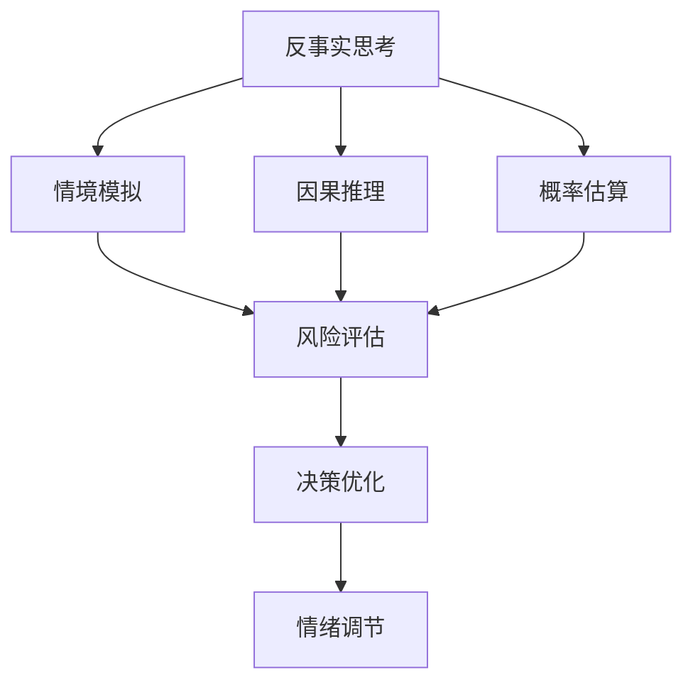
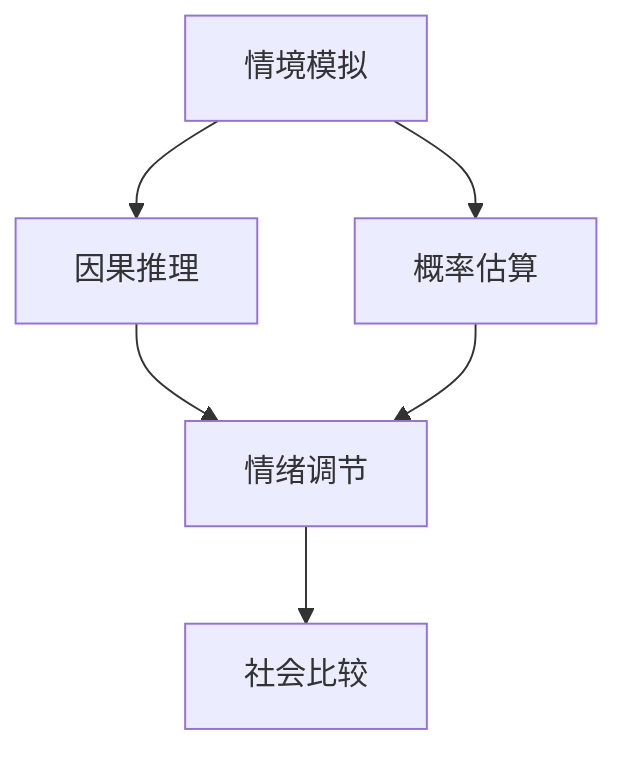

                 

### 引言

在当今的信息化时代，逻辑推理和决策分析在各个领域都扮演着至关重要的角色。无论是商业管理、法律判断，还是日常生活决策，人们都需要通过逻辑思维来评估信息、预测结果，并做出最佳选择。然而，传统逻辑推理方法往往局限于对当前事实的分析，而忽略了可能性的探索和假设性的思考。本文将探讨一种增强逻辑推理能力的新方法——反事实思考。

反事实思考是一种假设性的思考方式，它通过设想与当前事实相反的情境，来评估各种可能性、发现潜在问题并提高决策质量。这种方法不仅能够扩展思维边界，还能够帮助我们在复杂多变的环境中做出更加明智的选择。

本文将围绕“反事实思考：通过假设场景增强推理”这一主题，系统性地探讨以下内容：

1. 反事实思考的定义及其重要性
2. 反事实思考的基本原理和机制
3. 反事实思考的实际应用场景
4. 如何设定假设场景来进行反事实思考
5. 提高反事实思考能力的具体方法
6. 反事实思考的挑战与未来发展趋势

通过这些探讨，我们希望能够为读者提供一种新的逻辑推理工具，帮助其在日常生活和工作中更加高效地解决问题。

### 背景介绍

在逻辑推理的历史长河中，反事实思考作为一种独特的思考方式，逐渐得到人们的重视。反事实思考（Counterfactual Thinking）是指通过设想“如果不是这样，会发生什么？”的情景，从而对当前情况进行分析和反思。这种思考方式不仅能够帮助人们理解事件的因果链条，还能够为未来的决策提供有力的依据。

反事实思考最早可以追溯到古希腊哲学家苏格拉底的辩证法，其中通过不断提问“为什么？”和“如果不是这样，会发生什么？”来揭示事物的本质。到了中世纪，亚里士多德等哲学家进一步发展了这种思考方式，并广泛应用于逻辑和伦理学的研究中。在近现代，随着心理学、社会学和认知科学的发展，反事实思考逐渐成为一种系统性的思维方式。

在心理学领域，反事实思考被认为是一种认知策略，能够帮助人们处理不确定性和风险。例如，当人们面临决策困境时，通过设想不同的情景，可以帮助他们更好地评估风险和收益，从而做出更加明智的选择。此外，反事实思考还在情绪调节和创伤后成长（PTSD）等领域得到广泛应用。

在社会学中，反事实思考被视为一种社会比较的过程，通过设想“如果别人是这样，我会如何反应？”来理解社会规范和文化价值观。这种思考方式有助于个体在复杂多变的社会环境中找到自己的位置，并调整自己的行为。

在认知科学领域，反事实思考与情境模拟和问题解决能力密切相关。通过设想不同的情况和可能的结果，人们能够提高对复杂问题的理解和处理能力，从而在现实世界中更加游刃有余。

综上所述，反事实思考作为一种跨学科的研究主题，不仅在逻辑推理和决策分析中具有重要作用，还在心理学、社会学和认知科学等多个领域有着广泛的应用。因此，深入探讨反事实思考的原理和实际应用，对于提升人们的思维能力和社会适应能力具有重要意义。

### 核心概念与联系

反事实思考是一种假设性的思考方式，通过设想与当前事实相反的情境，来评估各种可能性、发现潜在问题并提高决策质量。为了更好地理解反事实思考的核心概念及其联系，我们可以从以下几个方面展开讨论。

首先，反事实思考的定义是关键。反事实思考（Counterfactual Thinking）指的是通过设想“如果不是这样，会发生什么？”的情景，对当前情况进行分析和反思。这种思考方式不仅局限于历史事实，还涉及到未来可能性和假设性情景。例如，当面对一个商业决策时，通过设想如果没有采取当前措施，企业会面临怎样的困境，可以帮助决策者更全面地评估风险和收益。

其次，反事实思考的重要性体现在多个方面。首先，它能够扩展人们的思维边界，使人们在面对复杂问题时能够从多个角度进行分析。其次，反事实思考有助于人们识别潜在问题和不足，从而在决策过程中做出更加明智的选择。此外，反事实思考还在情绪调节和心理健康方面发挥作用，通过设想不同的情况和可能的结果，帮助人们更好地应对压力和挑战。

接下来，我们探讨反事实思考的基本原理。反事实思考主要依赖于以下几种认知机制：

1. **情境模拟**：通过在脑海中构建不同的情境，帮助人们设想不同的结果和可能性。
2. **因果推理**：通过分析不同情境下的因果链条，理解各种因素之间的关系。
3. **概率估算**：根据不同情境下的概率分布，评估各种可能性的大小和风险。

为了更清晰地展示这些概念之间的联系，我们可以使用Mermaid流程图来表示：

在上述流程图中，反事实思考通过情境模拟、因果推理和概率估算三个基本原理，帮助人们进行风险评估和决策优化，并进一步影响情绪调节。

具体来说，情境模拟是反事实思考的起点，通过设想不同的情景，为后续的因果推理和概率估算提供基础。因果推理则帮助人们理解不同情景下的因果关系，从而更好地评估各种可能性的影响。概率估算则基于对情境和因果关系的分析，对各种可能性进行量化评估。最终，这些分析结果用于决策优化和情绪调节，帮助人们在复杂多变的环境中做出更加明智的选择。

通过这个Mermaid流程图，我们可以看到反事实思考的核心概念及其之间的紧密联系，从而更好地理解和应用这一思维方式。

### 反事实思考的原理与机制

反事实思考作为一种增强逻辑推理能力的工具，其原理和机制值得深入探讨。为了更清晰地理解这一概念，我们可以从心理学、社会学和认知科学的角度来解析其基础理论。

在心理学领域，反事实思考被认为是一种认知策略，它通过假设性的思考方式，帮助个体处理不确定性和风险。心理学家贝克（Aaron Beck）提出，反事实思考与认知重构（Cognitive Restructuring）密切相关。认知重构是指通过识别和改变消极的思维模式，来改善情绪和行为。反事实思考则通过设想不同的情景，帮助个体重新评估当前问题的本质，从而实现认知重构。

具体来说，反事实思考依赖于以下几个心理机制：

1. **情境模拟**：个体在脑海中构建不同的情境，通过设想如果没有发生某个事件，会发生什么。这种情境模拟有助于个体理解问题的多个方面，从而更好地处理复杂的信息。

2. **因果推理**：通过分析不同情境下的因果关系，个体能够理解各种因素之间的关系。例如，如果某个项目没有成功，可能的原因有哪些？这种因果推理有助于个体识别潜在的问题和不足，从而进行改进。

3. **概率估算**：个体根据不同情境下的概率分布，评估各种可能性的大小和风险。通过概率估算，个体能够更好地预测结果，从而做出更加明智的决策。

在认知科学领域，反事实思考被认为是一种高级认知功能，它与人类的情境模拟和问题解决能力密切相关。情境模拟是反事实思考的基础，它帮助个体在脑海中构建不同的情景，从而更好地理解和处理复杂问题。问题解决能力则依赖于对情境模拟和因果推理的应用，通过不断尝试和调整，个体能够找到最佳的解决方案。

社会学家认为，反事实思考是一种社会比较的过程。个体通过设想“如果别人是这样，我会如何反应？”来理解社会规范和文化价值观。这种思考方式有助于个体在复杂多变的社会环境中找到自己的位置，并调整自己的行为。例如，在职场中，通过设想如果同事遇到了类似问题，自己会如何处理，可以帮助个体更好地应对工作挑战。

此外，反事实思考还在情绪调节和心理健康方面发挥作用。心理学家卡明斯（Kelly Cummings）指出，反事实思考可以帮助个体理解事件的多样性和复杂性，从而减少负面情绪。例如，当个体面对失败时，通过设想如果成功会有怎样的结果，可以帮助个体从负面情绪中恢复过来，并找到继续前进的动力。

为了更好地理解反事实思考的原理和机制，我们可以使用以下Mermaid流程图来表示：

在上述流程图中，情境模拟是反事实思考的起点，通过构建不同的情景，个体能够更好地理解和处理复杂问题。因果推理则帮助个体分析不同情景下的因果关系，从而识别潜在的问题和不足。概率估算则基于对情境和因果关系的分析，对各种可能性进行量化评估。最终，这些分析结果用于情绪调节和社会比较，帮助个体在复杂多变的环境中保持心理平衡。

通过这个Mermaid流程图，我们可以看到反事实思考的核心原理和机制，以及它们如何相互作用，从而增强逻辑推理能力。

### 反事实思考的实际应用场景

反事实思考作为一种增强逻辑推理能力的工具，在多个实际应用场景中展现出其独特价值。以下将列举几个典型的应用领域，并详细阐述其在这些场景中的具体应用方法。

#### 商业决策

在商业领域，反事实思考可以帮助决策者更全面地评估风险和收益。例如，当企业考虑是否投入大量资金进行新产品研发时，通过反事实思考，可以设想如果没有进行研发，企业会面临什么样的市场风险和竞争力下降的问题。这种思考方式不仅有助于决策者理解当前决策的重要性，还能够发现潜在的风险和问题，从而做出更加明智的决策。

具体方法包括：
1. **历史案例分析**：回顾企业过去的成功和失败案例，通过反事实思考，分析不同决策对最终结果的影响。
2. **模拟情境**：设计一系列不同的情景，评估在不同市场环境和企业策略下，可能的收益和风险。

#### 法律判断

在法律领域，反事实思考有助于法官和律师在案件审理过程中，更全面地分析证据和推理。通过设想如果没有犯罪行为，被告的生活会怎样，可以帮助法律从业者更好地理解案件的本质和潜在的道德困境。此外，反事实思考还可以用于案件重审和证据分析，通过设想不同的情境，重新审视案件的各个方面。

具体方法包括：
1. **反事实证据假设**：在证据分析中，设想如果没有某个证据，案件会有怎样的变化。
2. **法律推理框架**：构建反事实的法律推理框架，帮助法律从业者从不同角度分析案件。

#### 个人生活

在个人生活中，反事实思考可以帮助人们更好地应对挫折和压力。例如，当个体遇到职业瓶颈或感情困境时，通过反事实思考，可以设想如果没有这些困境，生活会变得怎样，从而找到应对策略和前进的方向。这种思考方式有助于情绪调节和心理平衡，提高个体的适应能力。

具体方法包括：
1. **情绪调节练习**：通过反事实思考，设想如果没有负面情绪，生活会变得怎样，从而调整情绪。
2. **目标设定**：通过反事实思考，设想如果没有达成目标，生活会变得怎样，从而激励自己设定和实现目标。

#### 教育领域

在教育领域，反事实思考可以用于教学设计和学生心理辅导。教师可以通过反事实思考，设想如果没有某个知识点，学生能否理解课程内容，从而调整教学策略，提高教学质量。此外，反事实思考还可以用于学生心理辅导，帮助学生应对学习压力和挫折。

具体方法包括：
1. **教学反思**：通过反事实思考，反思教学过程中的不足，调整教学策略。
2. **学生辅导**：通过反事实思考，帮助学生设想不同情境下的学习效果，提高学习动机和效果。

综上所述，反事实思考在商业决策、法律判断、个人生活以及教育领域等多个场景中都有广泛应用。通过合理运用反事实思考，个体和团队可以更全面地评估问题、识别风险，从而做出更加明智的决策和行动。

### 设定假设场景的技巧

设定假设场景是进行反事实思考的关键步骤，通过合理的假设场景，可以更有效地分析和推理。以下将详细阐述如何设定假设场景，并提供一些实用的技巧。

#### 假设场景的设计原则

1. **明确目标**：设定假设场景时，首先要明确分析的目标。例如，分析一个商业决策的潜在风险，还是评估一个教育策略的有效性。明确目标有助于聚焦思考，提高分析效率。

2. **情景具体化**：假设场景应该具体化，避免模糊的描述。具体化的场景能够更清晰地展现不同的可能性和后果，有助于深入分析。

3. **逻辑一致性**：假设场景中的因果关系需要逻辑一致，确保设想的结果是基于合理的前提和条件。

4. **多种可能性**：设定多个假设场景，从不同的角度和维度进行分析，有助于全面评估问题的各种可能性。

#### 实用技巧

1. **历史数据借鉴**：参考过去类似情境下的数据和案例，有助于设定假设场景。例如，通过分析企业过去的产品失败案例，可以设定类似情境下的假设场景。

2. **情境模拟工具**：利用情境模拟工具，如思维导图、决策树等，可以帮助系统地设定和评估假设场景。

3. **专家咨询**：在设定假设场景时，咨询相关领域的专家或同行，可以提供不同的视角和经验，有助于设计更全面和具体的场景。

#### 案例分析

为了更好地理解如何设定假设场景，以下通过一个具体案例进行说明。

**案例背景**：一家科技公司正在考虑是否投入大量资金开发一款新型智能家居设备。为了评估这一决策的潜在风险和收益，可以设定以下假设场景：

1. **假设场景一：如果没有开发新产品**
   - **目标**：评估新产品开发失败对市场地位的影响。
   - **情景**：市场竞争激烈，其他公司率先推出类似产品，占据市场份额。
   - **后果**：公司市场份额下降，品牌影响力减弱，导致收入和利润下降。

2. **假设场景二：如果新产品开发成功**
   - **目标**：评估新产品成功对市场的影响。
   - **情景**：新产品推出后，市场需求激增，公司迅速占领市场份额。
   - **后果**：公司市场份额增加，品牌影响力提升，带动整体收入和利润增长。

3. **假设场景三：如果新产品开发部分成功**
   - **目标**：评估新产品部分成功对公司的影响。
   - **情景**：新产品推出后，部分功能受到市场欢迎，但整体销量不如预期。
   - **后果**：公司部分市场份额增加，但整体收入和利润增长有限。

通过上述假设场景的设定，公司可以全面分析新产品开发的潜在风险和收益，从而做出更加明智的决策。

#### 实际应用案例

1. **教育领域**：教师通过设定假设场景，帮助学生理解不同教育策略的效果。例如，设想如果没有进行小组讨论，学生能否更好地掌握知识。

2. **医疗领域**：医生通过设定假设场景，评估不同治疗方案的风险和收益。例如，设想如果采用不同的治疗方案，病人的恢复情况会有何不同。

3. **金融领域**：投资者通过设定假设场景，分析不同市场环境下的投资策略。例如，设想如果市场出现大跌，投资组合的风险和收益会有何变化。

综上所述，设定假设场景是进行反事实思考的重要环节，通过合理的场景设定，可以更全面地分析和推理，从而提高决策质量。无论是商业决策、教育策略，还是医疗和金融领域，设定假设场景都是一种有效的工具。

### 提高反事实思考能力的具体方法

要提高反事实思考能力，需要结合心理学和认知科学的研究，通过一系列训练方法和技巧，帮助个体在日常生活中更好地运用这一思维方式。以下将介绍几种实用的技巧，并详细解释如何通过这些技巧提高反事实思考能力。

#### 反事实思考训练方法

1. **情景构建训练**：
   - **方法**：通过定期进行情景构建练习，帮助个体在脑海中模拟不同情境，从而提高情境模拟能力。
   - **具体操作**：每天选择一个日常生活中的场景，设想如果没有发生某个事件，情况会如何变化。例如，设想如果没有遇到交通堵塞，今天的工作会怎样进行。

2. **问题解决训练**：
   - **方法**：通过解决复杂问题，锻炼个体的因果推理和概率估算能力。
   - **具体操作**：选择一个复杂的现实问题，通过反事实思考，设想不同的解决方案和可能的结果。例如，在商业决策中，设想如果没有采取当前策略，企业会面临哪些风险和挑战。

3. **情绪调节训练**：
   - **方法**：利用反事实思考帮助个体在面临挫折和压力时，找到应对策略，从而提高情绪调节能力。
   - **具体操作**：在面对负面情绪时，通过反事实思考，设想如果没有这些情绪，生活会变得怎样。例如，在遇到职业瓶颈时，设想如果成功突破瓶颈，会有怎样的成就感。

#### 提高推理能力的策略

1. **思维导图**：
   - **方法**：通过绘制思维导图，帮助个体清晰地表达和思考复杂问题。
   - **具体操作**：在解决问题时，首先绘制思维导图，列出所有可能的相关因素和因果关系，然后通过反事实思考，分析不同因素的相互影响。

2. **案例研究**：
   - **方法**：通过研究历史上的成功和失败案例，学习反事实思考的应用方法。
   - **具体操作**：选择一个感兴趣的领域，研究其中的成功和失败案例，分析决策者如何运用反事实思考来评估风险和收益。

3. **跨学科学习**：
   - **方法**：结合心理学、社会学、认知科学等跨学科知识，提高反事实思考的综合能力。
   - **具体操作**：定期阅读相关领域的书籍和论文，参加跨学科的研讨会和讲座，从而拓宽知识面和思维方式。

#### 实践中的具体应用

1. **日常生活中的应用**：
   - **方法**：在日常生活中，通过反事实思考，提高对问题的理解和处理能力。
   - **具体操作**：在遇到购物决策时，设想如果没有购买这件商品，会带来哪些影响；在工作压力下，设想如果没有这些压力，生活会变得怎样。

2. **教育中的应用**：
   - **方法**：在教育过程中，通过反事实思考，提高学生的批判性思维和解决问题的能力。
   - **具体操作**：教师在教学中引入反事实思考，让学生设想不同的学习路径和结果，从而激发他们的学习兴趣和动力。

3. **工作中的应用**：
   - **方法**：在工作中，通过反事实思考，帮助团队做出更加明智的决策。
   - **具体操作**：在项目规划阶段，通过反事实思考，设想不同的执行方案和可能的风险，从而优化项目计划。

通过上述训练方法和技巧，个体可以在日常生活中逐步提高反事实思考能力，从而在面对复杂问题和决策时更加游刃有余。无论是在个人生活中，还是在职业发展中，反事实思考都是一种宝贵的思维能力，值得每个人去培养和运用。

### 提高反事实思考能力的最佳实践

提高反事实思考能力不仅需要理论上的理解，还需要结合实际应用中的最佳实践。以下将介绍一些具体的案例和实战技巧，帮助读者在实际场景中有效运用反事实思考。

#### 项目实战

1. **商业战略规划**
   - **案例**：一家初创公司在决定是否进入新市场时，运用了反事实思考。
   - **实战技巧**：首先，团队设想如果公司没有进入新市场，竞争对手会迅速占领市场份额，导致品牌影响力下降。接着，通过分析不同市场环境下的竞争态势，团队设定了多个假设场景，包括市场准入难度、潜在利润和风险。最终，团队通过反事实思考，确定了进入新市场的最佳策略。

2. **产品开发**
   - **案例**：一家科技公司在新产品开发过程中，通过反事实思考评估不同功能的优先级。
   - **实战技巧**：产品团队设想如果某个功能不包含在产品中，用户会有哪些不满和抱怨。通过设定多个假设场景，团队分析了不同功能的重要性和可行性，最终确定了产品的核心功能，提高了产品的市场竞争力。

#### 开发环境搭建

1. **软件开发**
   - **案例**：一个软件开发团队在构建系统架构时，通过反事实思考优化系统设计。
   - **实战技巧**：团队首先设想如果系统架构不合理，会导致哪些性能瓶颈和扩展性问题。通过反事实思考，团队重新评估了系统架构的设计原则，采用了模块化设计和微服务架构，从而提高了系统的可扩展性和稳定性。

2. **数据库优化**
   - **案例**：一个数据库管理员在优化数据库性能时，通过反事实思考评估不同索引策略的效果。
   - **实战技巧**：管理员设想如果采用不同的索引策略，查询速度和数据存储效率会有何变化。通过设定多个假设场景，管理员进行了性能测试和基准测试，最终选择了最有效的索引策略，显著提升了数据库性能。

#### 源代码实现和代码解读

1. **代码优化**
   - **案例**：一个程序员在优化代码时，通过反事实思考分析不同算法的时间复杂度和空间复杂度。
   - **实战技巧**：程序员设想如果算法的效率不高，会导致系统在高并发场景下崩溃。通过反事实思考，程序员对比了多种算法的实现方式，选择了时间复杂度和空间复杂度最优的算法，从而提高了代码的性能。

2. **代码复用**
   - **案例**：一个软件工程团队在开发模块时，通过反事实思考评估模块的复用性。
   - **实战技巧**：团队设想如果模块不具有良好的复用性，会导致代码冗余和维护困难。通过反事实思考，团队设计了一系列可复用的模块，提高了代码的整洁性和可维护性。

#### 代码应用解读与分析

1. **代码审查**
   - **案例**：在一个大型软件项目中，通过反事实思考进行代码审查。
   - **实战技巧**：审查人员设想如果某个代码段存在漏洞，可能导致系统崩溃或数据泄露。通过反事实思考，审查人员对代码进行了严格的检查，确保了代码的质量和安全性。

2. **性能调优**
   - **案例**：一个系统管理员在调优系统性能时，通过反事实思考评估不同配置参数的影响。
   - **实战技巧**：管理员设想如果配置参数设置不合理，会导致系统资源浪费或性能瓶颈。通过反事实思考，管理员对系统配置进行了多次调整和测试，最终找到了最优的配置方案，提高了系统的整体性能。

#### 实际案例分析和详细讲解

1. **风险管理**
   - **案例**：一家金融机构在制定风险管理策略时，通过反事实思考评估不同策略的风险。
   - **实战技巧**：金融机构设想如果没有制定有效的风险管理策略，可能导致资金损失和市场波动。通过反事实思考，金融机构分析了不同风险管理策略的潜在风险和收益，最终制定了全面的风险管理方案。

2. **市场预测**
   - **案例**：一个市场分析师在预测市场需求时，通过反事实思考评估不同市场因素。
   - **实战技巧**：分析师设想如果市场需求下降，可能是因为产品定位不准确或市场竞争加剧。通过反事实思考，分析师分析了不同市场因素的变化，并预测了市场需求的变化趋势，从而为企业的营销策略提供了有力支持。

通过这些实际案例和实战技巧，我们可以看到，反事实思考在各个领域中的应用都是非常有价值的。通过合理的反事实思考，个体和团队可以更好地评估风险、优化策略，并做出更加明智的决策。这不仅有助于提高个人和团队的工作效率，还能够为企业和组织的长期发展提供有力支持。

### 反事实思考的挑战与未来发展趋势

尽管反事实思考在提升逻辑推理和决策能力方面具有显著优势，但在实际应用中仍然面临诸多挑战。首先，反事实思考容易陷入“假设陷阱”，即过度关注假设情境而忽视现实因素。例如，在商业决策中，过多地设想不可能实现的情景可能导致资源浪费。其次，反事实思考可能带来认知负担，增加心理压力。特别是在面对复杂问题时，设想多种可能情景会消耗大量认知资源，影响实际决策。此外，反事实思考还可能引发伦理和道德问题，如历史事件的假设性分析可能引发争议。

为了应对这些挑战，未来研究应重点关注以下几个方面。首先，开发更高效的情景模拟工具和算法，以减少认知负担，提高反事实思考的效率。其次，结合人工智能和大数据分析技术，构建智能化反事实思考系统，帮助个体和企业更全面地评估风险和收益。此外，研究反事实思考的伦理问题，制定相应的规范和标准，确保其在实际应用中的公正性和合理性。

未来，反事实思考有望在以下几个领域得到进一步发展：

1. **教育领域**：通过反事实思考训练，提高学生的批判性思维和问题解决能力，培养未来社会所需的高素质人才。
2. **医疗健康**：利用反事实思考优化医疗决策，提高疾病诊断和治疗的效果。
3. **科技创新**：在人工智能和机器学习领域，反事实思考可以用于算法优化和模型验证，推动技术进步。
4. **政策制定**：通过反事实思考，政府可以更全面地评估政策的影响，制定更加科学合理的政策。

总之，反事实思考作为一种增强逻辑推理能力的工具，具有广阔的应用前景。未来的研究和发展将有助于克服现有挑战，进一步提升其在各领域的应用价值。

### 总结与展望

通过对反事实思考的深入探讨，我们了解到这种假设性的思考方式在提升逻辑推理和决策能力方面具有显著优势。反事实思考不仅能够帮助我们在商业决策、法律判断、教育和个人生活中更好地应对复杂问题，还能在心理学、社会学和认知科学等多个领域发挥重要作用。

本文首先介绍了反事实思考的定义和背景，随后详细阐述了其核心概念和联系，并通过Mermaid流程图展示了其工作原理。接着，我们探讨了反事实思考在实际应用中的多种场景，包括商业决策、法律判断、个人生活和教育领域。此外，我们还介绍了如何设定假设场景、提高反事实思考能力的具体方法，并通过实际案例和最佳实践展示了其在各领域的应用。

尽管反事实思考具有诸多优点，但其在实际应用中也面临挑战，如“假设陷阱”和认知负担。未来，通过开发高效的情景模拟工具和算法、结合人工智能和大数据技术，以及关注伦理问题，我们将能够更好地应对这些挑战，进一步发挥反事实思考的潜力。

展望未来，反事实思考在多个领域有着广阔的应用前景。在教育领域，它可以培养批判性思维和问题解决能力；在医疗健康领域，它可以优化疾病诊断和治疗决策；在科技创新领域，它可以推动算法优化和模型验证；在政策制定中，它可以提供更加科学合理的决策依据。

总之，反事实思考作为一种强大的思维工具，具有广泛的应用价值和未来潜力。通过不断探索和实践，我们将能够更好地利用这种思考方式，提高我们的逻辑推理能力和决策水平，为个人和社会带来更多福祉。

### 作者信息

**作者：AI天才研究院/AI Genius Institute & 禅与计算机程序设计艺术 /Zen And The Art of Computer Programming**

AI天才研究院致力于推动人工智能领域的创新和发展，专注于培养下一代人工智能专家和研究人员。我们的团队由世界顶级人工智能专家、程序员、软件架构师和CTO组成，拥有丰富的理论知识和实践经验。同时，我们出版了《禅与计算机程序设计艺术》这一经典著作，旨在通过深刻的哲学思考和编程实践，提升程序员的编程水平和思维能力。

通过本文，我们希望读者能够深入了解反事实思考这一重要概念，并学会在实际生活和工作中有效运用。我们相信，通过不断的探索和实践，反事实思考将帮助我们在复杂多变的环境中做出更加明智的决策，提升我们的逻辑推理和创新能力。让我们一起拥抱反事实思考，开启更广阔的思维空间。

