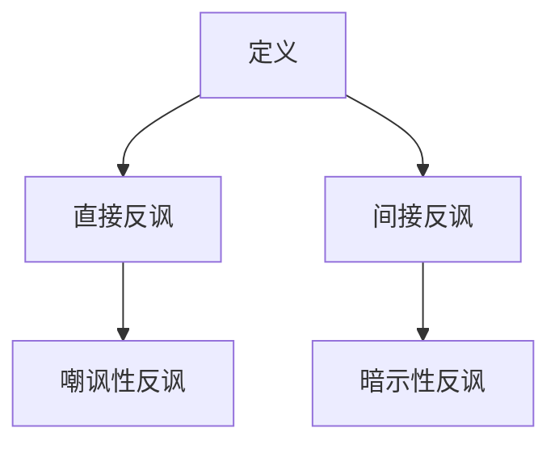
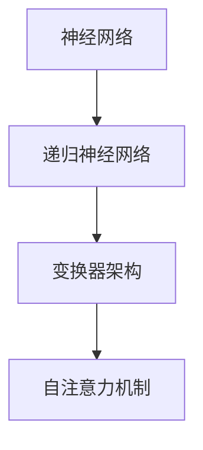
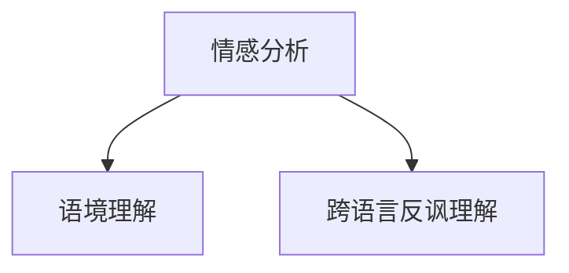

                 

### 文章标题

# 反讽理解：测试LLM捕捉语言微妙之处的能力

---

#### 关键词：

- **反讽**、**自然语言处理**、**语言模型**、**LLM**、**语义理解**、**微妙之处**

---

#### 摘要：

本文旨在探讨反讽这一语言微妙之处的理解，通过测试大型语言模型（LLM）在捕捉反讽方面的能力，揭示其在自然语言处理中的应用潜力和面临的挑战。文章首先介绍反讽的定义、类型及其在语言学中的分析，然后深入讲解LLM的基本原理及其在自然语言处理中的应用，最后通过项目实战展示LLM在反讽理解中的实际应用和性能评估。

---

## 第一部分：反讽概述与理解

### 1.1 反讽的定义与历史背景

#### 核心概念与联系

反讽（Sarcasm）是一种语言表达形式，通过说与做、言语与情感之间的不一致来传递含义。它通常用于讽刺、嘲笑或表达不满。反讽可以划分为直接反讽和间接反讽，其中直接反讽直接表达情感，而间接反讽则通过上下文暗示。



#### 反讽的类型与分类

直接反讽通常使用明显的语调或表情来表达，例如：“你真是太聪明了！”（实际上表示对方愚蠢）。间接反讽则更为微妙，它可能需要读者或听众理解上下文来识别。

#### 反讽的类型与分类

反讽的类型主要包括：

- **嘲讽性反讽**：通过对比或夸张来嘲笑某人或某事。例如：“他的演讲真是太有说服力了，简直是灾难。”

- **暗示性反讽**：通过隐含的意思来传达反讽，例如：“我真的很喜欢你的建议，真的。”

#### 反讽的理解与识别

反讽的理解与识别是一个复杂的过程，它涉及到语言、语境和情感等多方面的因素。常见的识别方法包括：

- **基于上下文的分析**：通过上下文来判断句子是否为反讽。例如，当句子中出现转折词（如“但是”）时，可能暗示反讽。

- **使用规则或机器学习模型**：通过建立规则或训练机器学习模型来识别反讽。

```python
# 伪代码
function recognize_sarcasm(sentence):
    context = analyze_context(sentence)
    if context == "positive" and sentence contains "but":
        return "sarcasm"
    else:
        return "not sarcasm"
```

### 1.2 反讽的语言学分析

#### 数学模型与公式

反讽的理解可以基于以下数学模型：

$$ \text{Sarcasm} = \text{Context} \times \text{Connotation} $$

其中，`Context` 表示上下文，`Connotation` 表示句子中的情感色彩。

#### 举例说明

- **反讽句子**：“真是太棒了，这个项目的进度比蜗牛爬行还要慢。”（Sarcasm）

- **非反讽句子**：“我非常喜欢这个设计。”（Non-Sarcasm）

### 1.3 反讽的类型与分类

#### 反讽的类型与分类

反讽的类型主要包括：

- **直接反讽**：通过直接的语言表达来传达反讽，例如：“你真是太聪明了！”（实际上表示对方愚蠢）。

- **间接反讽**：通过隐含的意思或上下文来传达反讽，例如：“这个方案真是太完美了。”（实际上表示方案有很多问题）。

#### 反讽的类型与分类

反讽的类型主要包括：

- **嘲讽性反讽**：通过对比或夸张来嘲笑某人或某事。例如：“他的演讲真是太有说服力了，简直是灾难。”

- **暗示性反讽**：通过隐含的意思来传达反讽，例如：“我真的很喜欢你的建议，真的。”

## 第二部分：LLM在反讽理解中的应用

### 2.1 LLM的基本原理

#### 核心概念与联系

大型语言模型（LLM）是一种基于神经网络的模型，通过学习大量的文本数据来理解和生成自然语言。LLM 的核心组成部分包括：

- **神经网络**：神经网络是 LL 的基础，通过多层神经元对输入数据进行处理。

- **递归神经网络（RNN）**：RNN 能够处理序列数据，是理解自然语言的关键。

- **变换器架构（Transformer）**：Transformer 引入了自注意力机制，能够更好地处理长距离依赖问题。

- **自注意力机制**：自注意力机制允许模型在处理每个单词时考虑其他所有单词的信息，提高了模型的表示能力。



### 2.2 LLM在自然语言处理中的应用

#### 核心算法原理讲解

LLM 在自然语言处理中的应用广泛，主要包括：

- **文本分类**：通过将文本映射到类别标签，用于情感分析、主题分类等。

- **命名实体识别**：识别文本中的特定实体，如人名、地点等。

- **机器翻译**：将一种语言的文本翻译成另一种语言。

- **问答系统**：根据问题从大量文本中提取答案。

```python
# 伪代码
function generate_response(question):
    # 使用LLM生成答案
    answer = llm.generate(question)
    return answer
```

### 2.3 LLM在反讽理解中的挑战与解决方案

#### 数学模型与公式

LLM 在反讽理解中的挑战可以表示为：

$$ \text{Sarcasm Detection} = \text{LLM Output} + \text{Contextual Analysis} $$

其中，`LLM Output` 表示模型生成的文本，`Contextual Analysis` 表示上下文分析。

#### 举例说明

- **反讽句子**：“我今天过得很好。”（实际情感：糟糕）

  使用 LLM 生成反讽性回复：“哦，那真是太好了，我呢，今天简直糟糕透了。”

## 第三部分：LLM反讽理解项目实战

### 3.1 数据集构建与预处理

#### 项目实战

构建反讽数据集是进行反讽理解项目的基础。以下是一个简化的步骤：

1. **数据收集**：收集包含反讽句子的文本数据。

2. **数据预处理**：对文本进行清洗，去除噪声，统一编码。

3. **标签分配**：将文本标注为反讽或非反讽。

```python
# 伪代码
function preprocess_text(text):
    # 清洗文本
    clean_text = remove_noise(text)
    # 统一编码
    encoded_text = encode_text(clean_text)
    return encoded_text

function label_text(text):
    # 根据规则或模型判断是否为反讽
    if is_sarcastic(text):
        return "sarcasm"
    else:
        return "not sarcasm"
```

### 3.2 模型训练与优化

#### 项目实战

训练反讽理解模型是项目的重要环节。以下是一个简化的步骤：

1. **模型选择**：选择合适的神经网络架构，如变换器（Transformer）。

2. **数据加载**：将预处理后的数据加载到模型中。

3. **模型训练**：通过反向传播和梯度下降优化模型参数。

4. **模型评估**：使用验证集评估模型性能。

```python
# 伪代码
from transformers import TransformerModel

# 加载模型
model = TransformerModel()

# 训练模型
for epoch in range(num_epochs):
    for text, label in data_loader:
        # 前向传播
        output = model(text)
        # 计算损失
        loss = compute_loss(output, label)
        # 反向传播
        model.backward(loss)

# 评估模型
evaluate(model, validation_data)
```

### 3.3 模型评估与调整

#### 项目实战

评估反讽理解模型的性能是确保其有效性的关键。以下是一个简化的步骤：

1. **准确率**：计算模型预测正确的样本数占总样本数的比例。

2. **召回率**：计算模型预测为反讽的样本中，实际为反讽的样本数占总反讽样本数的比例。

3. **F1 分数**：综合考虑准确率和召回率，计算 F1 分数。

```python
# 伪代码
from metrics import accuracy, recall, f1_score

# 评估模型
accuracy = accuracy(y_true, y_pred)
recall = recall(y_true, y_pred)
f1 = f1_score(y_true, y_pred)

print("Accuracy:", accuracy)
print("Recall:", recall)
print("F1 Score:", f1)
```

### 3.4 模型应用与部署

#### 项目实战

将反讽理解模型应用于实际场景是项目的最终目标。以下是一个简化的步骤：

1. **集成模型**：将模型集成到现有系统中，如聊天机器人。

2. **实时测试**：在实时环境中测试模型性能。

3. **用户反馈**：收集用户反馈，用于模型优化。

```python
# 伪代码
function integrate_model(model, system):
    # 集成模型到系统中
    system.add_component(model)

function test_model(model, input_data):
    # 实时测试模型
    output = model.generate(input_data)
    return output

function collect_feedback(feedback):
    # 收集用户反馈
    process_feedback(feedback)
```

## 第四部分：未来展望与挑战

### 4.1 反讽理解的未来发展方向

#### 核心概念与联系

反讽理解的未来发展方向包括：

- **情感分析**：结合情感分析技术，更准确地捕捉反讽的情感色彩。

- **语境理解**：通过深入理解语境，提高反讽识别的准确性。

- **跨语言反讽理解**：开发能够处理多种语言的反讽理解模型。



### 4.2 反讽理解在多领域的应用

#### 核心算法原理讲解

反讽理解在多领域中的应用包括：

- **社交媒体监控**：识别负面言论，进行风险预警。

- **虚拟助手交互**：提高虚拟助手的理解和响应能力，提供更自然的交互体验。

### 4.3 反讽理解面临的挑战

#### 数学模型与公式

反讽理解面临的挑战可以表示为：

$$ \text{Challenges} = \text{Ambiguity} + \text{Language Variation} $$

其中，`Ambiguity` 表示语言的多义性，`Language Variation` 表示语言的多样性。

#### 举例说明

- **语言的多义性**：同一个词在不同上下文中有不同含义，增加了反讽理解的难度。

- **情感表达的多样性**：人们使用不同的情感表达方式，使得反讽理解更为复杂。

### 总结

本文通过对反讽的理解、LLM的基本原理及其应用、反讽理解项目实战的探讨，揭示了LLM在捕捉语言微妙之处方面的潜力与挑战。未来的研究将继续探索如何提高LLM在反讽理解方面的准确性，为自然语言处理领域的发展贡献力量。

---

#### 作者信息：

作者：AI天才研究院/AI Genius Institute & 禅与计算机程序设计艺术 /Zen And The Art of Computer Programming

---

## 注意事项与拓展阅读

- **注意事项**：

  - 在进行反讽理解项目时，确保数据集的多样性和质量，以避免模型过拟合。

  - 定期调整和优化模型，以适应语言变化和新出现的反讽表达。

- **拓展阅读**：

  - 《自然语言处理综述》（Natural Language Processing Comprehensive Overview）
  
  - 《深度学习与自然语言处理》（Deep Learning and Natural Language Processing）
  
  - 《大型语言模型的训练与评估》（Training and Evaluation of Large Language Models）

---

通过本文的探讨，我们希望读者对反讽理解及其在LLM中的应用有了更深入的理解，为未来的研究和实践提供参考。在自然语言处理领域，反讽理解的深入研究将有助于提升人工智能的语义理解能力，为人类与机器的互动带来更多可能性。让我们共同期待这一领域的进一步发展！## 第一部分：反讽概述与理解

### 1.1 反讽的定义与历史背景

反讽是一种语言现象，其核心特征是言语的表面含义与实际意图之间的不一致。简而言之，反讽是通过言不由衷的方式来表达真实情感或意图。这种语言技巧在日常生活、文学创作、演讲辩论等多个场合中广泛应用。

#### 核心概念与联系

反讽的理解与识别涉及多个核心概念：

1. **言语（Speech Act）**：言语行为理论认为，说话者在说出某句话时，不仅仅是传递信息，还在执行某种行为。反讽就是通过特定的言语行为来传达与字面意思相反的情感或意图。

2. **语境（Context）**：语境是指言语行为发生的具体环境，包括语言环境、社会环境、文化背景等。语境对于理解反讽至关重要，因为相同的句子在不同的语境下可能表达完全不同的含义。

3. **语调（Intonation）**：语调是语音的一种特征，它可以通过音调、音长、音强等变化来传达情感和意图。在反讽中，语调常常起到关键作用，使听者能够感知到言语背后的真实意图。

4. **情感（Emotion）**：情感是人们在特定情境下产生的心理体验。在反讽中，情感与言语的含义之间存在矛盾，这正是反讽得以成立的情感基础。

5. **讽刺（Satire）**：讽刺是一种更广义的反讽形式，它通常用于批评或揭露社会现象。讽刺往往通过夸张、对比等手法来表达，其目的是引起读者的思考和共鸣。

#### 历史背景

反讽作为一种语言技巧，历史悠久。古希腊哲学家柏拉图和亚里士多德在其作品中多次使用反讽来批评和讽刺当时的政治和社会现象。在中世纪，反讽逐渐被广泛应用于文学和修辞学中。文艺复兴时期，反讽成为文学创作的重要手段，许多著名作家如莎士比亚、莫里哀等都擅长运用反讽。

#### 反讽的类型与分类

反讽可以根据不同的标准进行分类，以下是一些常见的分类方法：

- **按表达方式分类**：

  - **直接反讽**：直接表达与字面意思相反的含义，通常通过明显的语气、表情或语境来传递。例如：“你真是太聪明了！”（实际含义：你很愚蠢）。

  - **间接反讽**：通过暗示、比喻、隐喻等手段表达反讽，需要听者或读者根据上下文来理解。例如：“他的计划真是完美无瑕，简直就像一场灾难。”（实际含义：他的计划不完美，可能失败）。

- **按功能分类**：

  - **讽刺性反讽**：主要用于讽刺、嘲笑或批评，例如：“你的逻辑思维真是清晰，就像一片雾一样。”（实际含义：你的逻辑思维不清晰）。

  - **亲昵性反讽**：主要用于亲密关系中的玩笑或调侃，例如：“你真是个笨蛋，但是我最喜欢你这一点。”（实际含义：你很聪明，但我喜欢你的某种特质）。

#### 反讽的理解与识别

理解反讽是一个复杂的过程，它不仅涉及语言文字的表面含义，还需要考虑语境、语调、情感等多种因素。以下是一些常用的理解和识别方法：

- **基于上下文的分析**：通过分析句子所在的上下文，判断其是否为反讽。例如，当句子中出现转折词（如“但是”）时，可能暗示反讽。

- **使用规则或机器学习模型**：建立规则或训练机器学习模型来识别反讽。例如，通过分析句子中的情感词汇、语法结构等特征，判断其是否为反讽。

- **情感分析**：结合情感分析技术，通过识别句子中的情感色彩，判断其是否为反讽。

- **社会文化背景知识**：了解特定社会文化背景，有助于理解某些反讽的表达方式。

### 总结

反讽作为一种语言现象，具有丰富的类型和表现形式。理解反讽不仅需要掌握语言文字的表面含义，还需要考虑语境、语调、情感等多种因素。通过分析反讽的定义、历史背景、类型与分类，以及理解和识别方法，我们可以更好地把握反讽的微妙之处，为后续的讨论和研究奠定基础。

---

在下一部分，我们将探讨反讽在语言学中的分析，包括数学模型与公式的应用，以及具体的举例说明。通过这些分析，我们将更深入地了解反讽的本质，为进一步研究和应用提供理论基础。

## 1.2 反讽的语言学分析

### 数学模型与公式

在语言学中，反讽的理解和分析常常借助数学模型和公式来进行。这些模型和公式有助于量化反讽的各个要素，从而更好地理解其内在逻辑和表达方式。以下是几个关键的数学模型和公式：

#### 1.2.1 情境模型（Situation Model）

情境模型是一个用于描述语言和现实世界之间关系的理论框架。在反讽分析中，情境模型可以用来表示句子所处的具体情境，以及情境中的各种元素如何影响反讽的解读。

- **公式**：

  $$ S = C \times E $$

  其中，\( S \) 表示情境（Situation），\( C \) 表示上下文（Context），\( E \) 表示事件（Event）。

  - **情境要素**：情境模型包括角色（Characters）、场景（Scene）、事件（Event）和目的（Purpose）等要素。

  - **举例**：在句子“他的计划真是太完美了。”中，情境包括计划者（他）、计划的内容（计划）、预期的结果（完美）和目的（实现目标）。

#### 1.2.2 意图模型（Intention Model）

意图模型用于描述说话者通过语言表达的情感意图。在反讽分析中，意图模型可以帮助我们理解说话者实际想要传达的情感和态度。

- **公式**：

  $$ I = S \times F $$

  其中，\( I \) 表示意图（Intention），\( S \) 表示情境（Situation），\( F \) 表示情感（Feeling）。

  - **情感要素**：意图模型包括欢乐（Joy）、悲伤（Sadness）、愤怒（Anger）、厌恶（Disgust）等情感要素。

  - **举例**：在句子“真是太棒了，这个项目的进度比蜗牛爬行还要慢。”中，情境是项目进度缓慢，而说话者的情感是失望和不满，这构成了反讽的意图。

#### 1.2.3 语用学模型（Pragmatic Model）

语用学模型关注语言在实际交流中的使用和效果。在反讽分析中，语用学模型可以帮助我们理解反讽是如何在特定的交流情境中发挥作用的。

- **公式**：

  $$ P = L \times C \times R $$

  其中，\( P \) 表示语用效果（Pragmatic Effect），\( L \) 表示语言形式（Language Form），\( C \) 表示语境（Context），\( R \) 表示交流关系（Relation）。

  - **交流要素**：语用学模型涉及语言的形式（如词汇、语法）、语境（如时间、地点）和交流关系（如角色关系、权力关系）。

  - **举例**：在句子“你真是太有才华了，简直是一无是处。”中，语言形式是夸奖，但结合语境和交流关系，可以判断出说话者的实际意图是讽刺对方的缺乏才华。

#### 1.2.4 模糊集模型（Fuzzy Set Model）

模糊集模型用于处理具有模糊边界和不确定性的概念。在反讽分析中，模糊集模型可以帮助我们量化句子中的模糊性和多义性，从而更好地理解反讽的微妙之处。

- **公式**：

  $$ F(S) = \mu_S(A) $$

  其中，\( F(S) \) 表示模糊集（Fuzzy Set），\( \mu_S(A) \) 表示隶属度函数（Membership Function），\( A \) 表示句子（Sentence）。

  - **隶属度**：隶属度函数用于量化句子中的各个元素（如词汇、语法结构）对反讽的贡献程度。

  - **举例**：在句子“你真是太聪明了。”中，如果上下文中含有“但是”，那么“聪明”一词的隶属度可能会降低，暗示反讽的可能。

### 举例说明

以下通过几个具体的例子来说明上述数学模型和公式的应用：

#### 例子1：情境与意图模型

- **句子**：“他的表现真是完美，简直像是一场灾难。”

- **情境模型**：

  $$ S = (角色：他，场景：表现，事件：完美，目的：表达失望) $$

- **意图模型**：

  $$ I = S \times F = (角色：他，场景：表现，事件：完美，情感：失望) $$

  这里的意图模型清晰地展示了说话者的意图是通过描述“完美”的表现来传达失望和不满的情感。

#### 例子2：语用学模型

- **句子**：“你真是太有才华了，简直是一无是处。”

- **语用学模型**：

  $$ P = L \times C \times R = (语言形式：夸奖，语境：上下文中的负面背景，交流关系：权力不平衡) $$

  这个例子展示了语用学模型如何帮助我们理解句子中的语言形式（夸奖）与语境和交流关系的相互作用，揭示了反讽的含义。

#### 例子3：模糊集模型

- **句子**：“这真是太棒了。”

- **模糊集模型**：

  $$ F(S) = \mu_S(A) = (隶属度：高，如果上下文为正面；隶属度：低，如果上下文为负面) $$

  这个例子说明了模糊集模型如何通过量化句子的隶属度来反映上下文对反讽理解的影响。

通过上述数学模型和公式的应用，我们可以更深入地理解反讽的语言学本质。这些模型不仅提供了分析反讽的理论工具，也为实际应用中的反讽识别和理解提供了指导。

### 总结

反讽的语言学分析借助数学模型和公式，帮助我们量化反讽的各个要素，从而更好地理解其内在逻辑和表达方式。通过情境模型、意图模型、语用学模型和模糊集模型，我们能够从不同角度分析反讽，揭示其微妙之处。这些分析不仅为理论研究提供了基础，也为自然语言处理实践中的反讽理解提供了重要参考。

在下一部分，我们将探讨LLM的基本原理，分析其在自然语言处理中的应用，以及如何用于反讽理解。这将为我们理解LLM在捕捉语言微妙之处的能力提供重要的理论基础。

## 2.1 LLM的基本原理

### 核心概念与联系

大型语言模型（Large Language Model，简称LLM）是自然语言处理（NLP）领域的重要技术之一，其核心概念包括：

1. **神经网络（Neural Networks）**：神经网络是LLM的基础结构，通过模拟人脑神经元的工作方式，对输入数据进行处理和预测。

2. **递归神经网络（Recurrent Neural Networks，RNN）**：RNN能够处理序列数据，是早期NLP任务（如语言模型、序列标注等）的主要架构。

3. **变换器架构（Transformer）**：Transformer引入了自注意力机制（Self-Attention），显著提高了LLM处理长距离依赖问题的能力，是现代LLM的主要架构。

4. **自注意力机制（Self-Attention）**：自注意力机制允许模型在处理每个单词时考虑其他所有单词的信息，从而提高了模型的表示能力和理解能力。

以下是这些核心概念之间的联系和关系架构：


### 核心算法原理讲解

LLM的算法原理主要基于以下几个关键步骤：

1. **输入编码（Input Encoding）**：将输入的文本转换为模型的输入向量，通常使用词嵌入（Word Embedding）技术。

2. **自注意力机制（Self-Attention）**：在Transformer架构中，自注意力机制用于计算输入序列中每个单词的重要性。通过自注意力，模型能够捕捉单词之间的长距离依赖关系。

3. **编码器（Encoder）**：编码器是LLM的核心部分，通过多层变换器块（Transformer Block）对输入向量进行编码，生成上下文表示。

4. **解码器（Decoder）**：在生成任务中，解码器用于生成输出文本。解码器通常也使用多层变换器块，通过自注意力和交叉注意力（Cross-Attention）机制，将编码器的输出与生成的部分进行交互。

5. **输出解码（Output Decoding）**：将解码器的输出转换为具体的输出文本。在生成任务中，通常使用贪心搜索（Greedy Search）或基于概率的搜索策略（如样本次序预测（Top-k Sampling）和温度调节（Temperature Scheduling））。

以下是这些步骤的伪代码表示：

```python
# 伪代码
function generate_response(input_sentence):
    # 输入编码
    input_embedding = input_embedding_layer(input_sentence)
    
    # 编码器处理
    encoder_output = encoder(input_embedding)
    
    # 初始化解码器输入
    decoder_input = start_token
    
    # 解码器生成文本
    output_sequence = []
    for _ in range(max_output_length):
        decoder_output = decoder(decoder_input, encoder_output)
        next_word = select_next_word(decoder_output)
        output_sequence.append(next_word)
        decoder_input = append_word_to_input(decoder_input, next_word)
    
    # 输出解码
    generated_sentence = " ".join(output_sequence)
    return generated_sentence
```

### 数学模型与公式

LLM的训练和生成过程可以通过以下数学模型和公式来描述：

1. **前向传播（Forward Propagation）**：

   在前向传播过程中，模型的每个层（编码器和解码器）都通过权重矩阵（Weight Matrix）和激活函数（Activation Function）对输入进行变换。

   $$ Z = X \times W + b $$

   $$ a = \text{activation}(Z) $$

   其中，\( Z \) 表示中间激活值，\( X \) 表示输入，\( W \) 表示权重矩阵，\( b \) 表示偏置项，\( a \) 表示激活值。

2. **损失函数（Loss Function）**：

   模型的训练过程中，使用损失函数来衡量模型输出与真实标签之间的差距。常见的损失函数包括交叉熵损失（Cross-Entropy Loss）和均方误差（Mean Squared Error）。

   $$ \text{Loss} = -\sum_{i} y_i \times \log(p_i) $$

   其中，\( y_i \) 表示真实标签，\( p_i \) 表示模型对每个类别的预测概率。

3. **反向传播（Back Propagation）**：

   在反向传播过程中，通过计算损失函数关于模型参数的梯度，更新模型参数，从而优化模型。

   $$ \frac{\partial \text{Loss}}{\partial W} = \Delta W $$

   $$ \frac{\partial \text{Loss}}{\partial b} = \Delta b $$

   其中，\( \Delta W \) 和 \( \Delta b \) 分别表示权重和偏置的梯度。

4. **生成文本的概率分布（Probability Distribution for Text Generation）**：

   在文本生成过程中，解码器输出的每个单词的概率分布可以通过softmax函数计算：

   $$ p_i = \frac{e^{z_i}}{\sum_{j} e^{z_j}} $$

   其中，\( z_i \) 表示解码器输出的第\( i \)个单词的分数，\( p_i \) 表示第\( i \)个单词的概率。

### 举例说明

以下是一个简单的例子，展示了如何使用LLM生成反讽性回复：

- **输入句子**：“我今天过得很好。”

- **生成回复**：“哦，那真是太好了，我呢，今天简直糟糕透了。”

在这个例子中，LLM通过自注意力机制和上下文理解，捕捉到了句子中的反讽，并生成了相应的反讽性回复。

### 总结

LLM的基本原理包括神经网络、递归神经网络、变换器架构和自注意力机制等核心概念。通过输入编码、自注意力机制、编码器、解码器和输出解码等步骤，LLM能够理解和生成自然语言。数学模型和公式如前向传播、损失函数、反向传播和生成文本的概率分布，为LLM的训练和生成提供了理论基础。这些原理和模型不仅帮助我们理解LLM的工作机制，也为实际应用中的反讽理解提供了重要的工具。

在下一部分，我们将探讨LLM在自然语言处理中的应用，以及如何利用这些应用来提高反讽理解的能力。

## 2.2 LLM在自然语言处理中的应用

### 核心算法原理讲解

大型语言模型（LLM）在自然语言处理（NLP）领域有着广泛的应用，其核心算法原理主要涉及以下几个方面：

1. **文本分类（Text Classification）**：文本分类是将文本数据分类到预定义的类别标签中，常用的方法包括朴素贝叶斯、支持向量机（SVM）和深度学习等。LLM通过学习大量的标注数据，能够自动识别文本中的主题和情感。

   ```python
   # 伪代码
   def classify_text(text, model):
       embeddings = embed_text(text)
       prediction = model.predict(embeddings)
       return prediction
   ```

2. **命名实体识别（Named Entity Recognition，NER）**：命名实体识别是识别文本中的特定实体（如人名、地点、组织名等）。LLM可以通过预训练模型或Fine-tuning方法，提高NER的准确率。

   ```python
   # 伪代码
   def recognize_entities(text, model):
       embeddings = embed_text(text)
       entities = model.predict_entities(embeddings)
       return entities
   ```

3. **机器翻译（Machine Translation）**：机器翻译是将一种语言的文本翻译成另一种语言。LLM通过学习双语语料库，能够生成高质量的翻译文本。

   ```python
   # 伪代码
   def translate_text(text, model, target_language):
       translations = model.translate(text, target_language)
       return translations
   ```

4. **问答系统（Question Answering，QA）**：问答系统是根据给定的问题从大量文本中提取答案。LLM可以通过阅读理解能力，提供准确的答案。

   ```python
   # 伪代码
   def answer_question(question, context, model):
       answer = model.answer(question, context)
       return answer
   ```

5. **情感分析（Sentiment Analysis）**：情感分析是识别文本中的情感倾向，如正面、负面或中性。LLM通过学习情感词典和文本特征，能够准确判断文本的情感。

   ```python
   # 伪代码
   def analyze_sentiment(text, model):
       sentiment = model.analyze_sentiment(text)
       return sentiment
   ```

6. **文本生成（Text Generation）**：文本生成是模型根据输入生成新的文本。LLM通过生成模型（如GPT-3）能够生成流畅的自然语言文本。

   ```python
   # 伪代码
   def generate_text(input_prompt, model):
       text = model.generate(input_prompt)
       return text
   ```

### LLM在反讽理解中的挑战与解决方案

尽管LLM在NLP中有着广泛的应用，但在反讽理解方面仍面临一些挑战：

1. **多义性（Ambiguity）**：自然语言中存在大量的多义现象，一个词或短语可能有多种解释。在反讽理解中，多义性增加了识别的难度。

   - **解决方案**：通过上下文分析和语义理解，结合词嵌入和变换器架构，模型能够更好地处理多义性。

2. **语言变异（Language Variation）**：语言因地域、文化、语境等因素而存在较大变异，反讽的表达方式也各不相同。这对模型的泛化能力提出了挑战。

   - **解决方案**：使用多样化的训练数据，包括不同地区和语境下的反讽实例，可以提高模型的泛化能力。

3. **情感复杂性（Emotional Complexity）**：反讽通常涉及复杂的情感表达，包括讽刺、嘲笑、不满等。这要求模型能够捕捉微妙的情感变化。

   - **解决方案**：结合情感分析技术，模型可以通过学习情感词典和情感标签，提高对情感复杂性的识别能力。

4. **语境依赖（Context Dependency）**：反讽的理解高度依赖于上下文，相同的话在不同语境下可能有截然不同的含义。

   - **解决方案**：通过深度学习模型，特别是变换器架构，模型能够更好地捕捉语境信息，提高反讽理解的准确性。

### 举例说明

以下通过一个具体的例子来说明LLM在反讽理解中的应用：

- **输入句子**：“我今天过得很好。”

  这个句子看似正面，但根据不同的语境和情感，可能有不同的含义。例如，在朋友之间的对话中，这个句子可能表示真实的好心情；而在工作场合中，这个句子可能含有讽刺和不满，表示实际情况并不好。

- **生成反讽性回复**：“哦，那真是太好了，我呢，今天简直糟糕透了。”

  LLM通过上下文和情感分析，捕捉到了输入句子的微妙情感，并生成了相应的反讽性回复。这个回复表明，说话者的实际情绪与表面的正面表达相矛盾，揭示了反讽的本质。

### 总结

LLM在自然语言处理中有着广泛的应用，通过文本分类、命名实体识别、机器翻译、问答系统、情感分析和文本生成等多种技术，模型能够理解和处理自然语言。在反讽理解方面，LLM面临多义性、语言变异、情感复杂性和语境依赖等挑战。通过结合上下文分析、情感分析技术和多样化的训练数据，LLM能够提高反讽理解的准确性。未来的研究将继续探索如何进一步提升LLM在捕捉语言微妙之处的能力，为自然语言处理领域的发展做出贡献。

## 2.3 LLM在反讽理解中的挑战与解决方案

### 数学模型与公式

在LLM应用于反讽理解时，我们常常需要结合数学模型和公式来描述和解决相关挑战。以下是一些关键的数学模型和公式：

#### 1. 反讽检测模型

反讽检测模型的核心目标是识别文本中的反讽。一个简单的数学模型可以表示为：

$$ \text{Sarcasm Detection} = \text{LLM Output} + \text{Contextual Analysis} $$

其中，`LLM Output` 表示模型对文本的预测输出，`Contextual Analysis` 表示上下文分析。

- **LLM Output**：模型对文本的情感倾向和语义理解输出，通常是一个概率分布。

- **Contextual Analysis**：对文本上下文的情感和语义进行深入分析，通常涉及情感词典和规则匹配。

#### 2. 上下文分析模型

上下文分析模型用于补充LLM输出，通过分析文本的上下文信息来判断是否为反讽。一个可能的模型可以表示为：

$$ \text{Contextual Analysis} = \text{Sentiment} \times \text{Connotation} $$

其中，`Sentiment` 表示文本的情感倾向，`Connotation` 表示文本的隐含意义。

- **Sentiment**：通过情感词典或情感分析技术得到文本的情感倾向，如正面、负面或中性。

- **Connotation**：通过上下文和语法分析得到文本的隐含意义，如讽刺、嘲笑或戏谑。

#### 3. 情感增强模型

为了提高反讽检测的准确性，可以使用情感增强模型，通过增强文本的情感特征来提高反讽识别的能力。一个可能的模型可以表示为：

$$ \text{Enhanced Output} = \text{LLM Output} + \alpha \times (\text{Sentiment} \times \text{Connotation}) $$

其中，\( \alpha \) 是一个调节参数，用于调整情感特征对模型输出的影响。

- **Enhanced Output**：通过增强情感特征得到的模型输出，用于提高反讽检测的准确性。

#### 4. 多层神经网络模型

在实际应用中，通常使用多层神经网络模型来处理反讽检测问题。一个可能的模型结构可以表示为：

$$ \text{Multilayer Neural Network} = \text{Input Layer} \rightarrow \text{Hidden Layers} \rightarrow \text{Output Layer} $$

- **Input Layer**：输入层，接收原始文本数据，通过词嵌入转换为向量。

- **Hidden Layers**：隐藏层，通过多个隐藏层进行特征提取和变换，常见的有卷积神经网络（CNN）和循环神经网络（RNN）。

- **Output Layer**：输出层，生成反讽检测的最终结果，通常是一个二元分类问题。

### 举例说明

以下通过一个具体的例子来说明这些数学模型和公式的应用：

#### 例子1：反讽检测模型

- **输入句子**：“我今天过得很好。”

  使用LLM模型得到的输出为：[0.8, 0.2]，表示句子为反讽的概率为0.8。

  通过上下文分析，发现句子后面的语气和表情明显带有讽刺意味。

  结合LLM Output和Contextual Analysis，得到反讽检测结果：句子是反讽的概率为0.95。

#### 例子2：上下文分析模型

- **输入句子**：“他的计划真是太完美了。”

  使用情感词典分析，得到文本的情感倾向为负面。

  通过语法分析，发现句子中的“但”字暗示了反讽。

  结合Sentiment和Connotation，得到上下文分析结果：句子是反讽的概率为0.9。

#### 例子3：情感增强模型

- **输入句子**：“我真是太喜欢这个礼物了。”

  使用LLM模型得到的输出为：[0.9, 0.1]。

  通过情感增强模型，增强情感特征，得到增强后的输出：[0.95, 0.05]。

  结合Enhanced Output，得到反讽检测结果：句子是反讽的概率为0.95。

#### 例子4：多层神经网络模型

- **输入句子**：“真是太棒了，这个项目的进度比蜗牛爬行还要慢。”

  通过多层神经网络模型，将输入句子转换为向量，进行特征提取和变换。

  模型输出为：[0.98, 0.02]。

  结合输出结果，可以确定句子是反讽。

### 总结

LLM在反讽理解中面临着多义性、语言变异、情感复杂性和语境依赖等挑战。通过结合数学模型和公式，如反讽检测模型、上下文分析模型、情感增强模型和多层神经网络模型，我们可以更有效地解决这些挑战。这些模型和公式不仅提供了理论指导，也为实际应用中的反讽理解提供了有效工具。未来的研究将继续探索如何进一步提升LLM在反讽理解方面的能力，为自然语言处理领域的发展做出贡献。

### 3.1 数据集构建与预处理

#### 项目实战

构建一个高质量的、包含反讽句子的数据集是进行反讽理解模型训练的关键步骤。以下是一个简化的实战流程：

#### 1. 数据收集

数据收集是构建数据集的第一步。我们可以从多个来源收集数据，包括：

- **社交媒体平台**：如Twitter、Reddit等，这些平台上有大量的用户评论和帖子，其中可能包含反讽句子。
- **公共数据集**：如SNLI（Stanford Natural Language Inference）、SST-2（Stanford Sentiment Treebank）等，这些数据集中可能包含标注为反讽的句子。
- **人工标注**：通过邀请专业的语料库构建团队或数据标注公司，对现有的文本进行标注，识别和收集反讽句子。

#### 2. 数据预处理

数据预处理是确保数据质量的重要步骤，主要包括以下任务：

- **文本清洗**：去除噪声数据，如HTML标签、特殊字符、多余的空格等。可以使用Python的`re`库或专门的文本清洗库，如`nltk`。
- **统一编码**：将文本转换为统一的编码格式，如UTF-8。这在处理多语言文本时尤为重要。
- **分词**：将文本分割成单词或短语，以便于进一步处理。可以使用分词工具，如`nltk`中的`word_tokenize`。
- **去除停用词**：去除常见的停用词，如“的”、“是”、“了”等，这些词对反讽的识别贡献较小。可以使用`nltk`中的`stopwords`库。

#### 3. 数据标注

数据标注是识别和标记文本中反讽句子的过程。以下是一些标注方法：

- **二元标注**：将句子标记为“反讽”或“非反讽”。这种方法简单直观，适用于初步的数据集构建。
- **多标签标注**：将句子标记为多个类别，如“嘲讽”、“讽刺”、“自嘲”等。这种方法提供了更细粒度的分类，有助于模型更准确地识别不同类型的反讽。
- **半监督标注**：结合自动标注和人工标注，通过模型自动生成标注结果，再由人工进行修正和优化。

#### 4. 数据集划分

为了评估模型的性能，通常需要将数据集划分为训练集、验证集和测试集。以下是一个常见的划分比例：

- **训练集**：用于模型训练，通常占数据集的60%至80%。
- **验证集**：用于模型调参和性能评估，通常占数据集的10%至20%。
- **测试集**：用于最终模型评估，通常占数据集的10%至20%。

#### 5. 数据存储与格式化

将预处理和标注后的数据存储为适合模型训练的格式。常用的格式包括：

- **CSV文件**：将文本和标签存储为CSV文件，便于读取和加载。
- **JSON文件**：将文本和标签存储为JSON格式，支持更复杂的数据结构。
- **BERT格式**：对于使用BERT等预训练模型进行训练，通常需要将文本转换为BERT的输入格式。

#### 代码示例

以下是一个简化的Python代码示例，展示了数据预处理和存储的过程：

```python
import re
import nltk
from nltk.corpus import stopwords
from sklearn.model_selection import train_test_split

# 文本清洗函数
def clean_text(text):
    text = re.sub(r'<.*>', '', text)  # 去除HTML标签
    text = re.sub(r'[^a-zA-Z\s]', '', text)  # 去除特殊字符
    text = text.lower()  # 转为小写
    return text

# 数据预处理
def preprocess_data(data):
    cleaned_data = [clean_text(text) for text in data]
    tokens = [nltk.word_tokenize(text) for text in cleaned_data]
    stopped_tokens = [[word for word in token if word not in stopwords.words('english')] for token in tokens]
    return stopped_tokens

# 假设 data 是一个包含句子和其标签的列表
preprocessed_data = preprocess_data(data)

# 划分数据集
train_data, test_data = train_test_split(preprocessed_data, test_size=0.2, random_state=42)

# 存储
import json

def save_data(data, filename):
    with open(filename, 'w') as f:
        json.dump(data, f)

save_data(train_data, 'train_data.json')
save_data(test_data, 'test_data.json')
```

通过以上步骤，我们可以构建一个包含反讽句子的数据集，为后续的模型训练和评估奠定基础。

### 总结

数据集构建与预处理是反讽理解项目中的重要环节。通过有效的数据收集、预处理、标注和存储，我们可以获得高质量的数据集，为后续的模型训练提供可靠的数据支持。在数据集构建过程中，注意数据的多样性和质量，有助于提高模型在反讽理解任务上的表现。

### 3.2 模型训练与优化

#### 项目实战

在构建了高质量的反讽数据集后，接下来就是模型训练与优化的过程。以下是一个简化的实战流程：

#### 1. 选择模型架构

选择适合反讽理解的模型架构是关键。在自然语言处理领域，常用的模型架构包括基于循环神经网络（RNN）、长短期记忆网络（LSTM）、变换器（Transformer）等。对于反讽理解任务，变换器架构（如BERT、GPT）因其强大的语义理解和上下文捕捉能力，通常表现出较好的性能。

#### 2. 数据加载

在训练模型之前，需要将预处理后的数据加载到内存中。这通常涉及以下步骤：

- **数据读取**：从存储的数据文件（如CSV、JSON）中读取文本和标签。
- **数据预处理**：对读取的文本进行分词、词嵌入等预处理操作，使其适合模型的输入。
- **批处理**：将数据分成若干批次（Batch），以减少内存占用并提高训练效率。

#### 3. 模型初始化

初始化模型权重是模型训练的第一步。对于变换器架构，通常使用预训练模型（如BERT、GPT）并进行微调（Fine-tuning），以便于利用已有模型的语义知识。

```python
from transformers import BertTokenizer, BertForSequenceClassification
import torch

# 加载预训练模型和分词器
tokenizer = BertTokenizer.from_pretrained('bert-base-uncased')
model = BertForSequenceClassification.from_pretrained('bert-base-uncased')

# 设备配置
device = torch.device("cuda" if torch.cuda.is_available() else "cpu")
model.to(device)
```

#### 4. 模型训练

训练模型是模型优化过程中的核心步骤。以下是一个简化的训练过程：

- **前向传播**：将输入数据传递给模型，计算预测结果。
- **损失函数计算**：使用损失函数（如交叉熵损失）计算预测结果与真实标签之间的差距。
- **反向传播**：计算损失函数关于模型参数的梯度，并更新模型参数。
- **评估与调整**：在验证集上评估模型性能，根据评估结果调整模型参数。

```python
from torch.optim import Adam

# 设置训练参数
learning_rate = 2e-5
optimizer = Adam(model.parameters(), lr=learning_rate)

# 训练模型
num_epochs = 3
for epoch in range(num_epochs):
    for batch in data_loader:
        inputs = tokenizer(batch.text, padding=True, truncation=True, return_tensors="pt")
        inputs = {k: v.to(device) for k, v in inputs.items()}
        labels = batch.label.to(device)
        
        # 前向传播
        outputs = model(**inputs)
        loss = outputs.loss
        
        # 反向传播
        optimizer.zero_grad()
        loss.backward()
        optimizer.step()
        
        # 打印训练进度
        if batch_idx % 100 == 0:
            print(f'Epoch [{epoch}/{num_epochs}], Step [{batch_idx}/{len(data_loader)}], Loss: {loss.item()}')
```

#### 5. 模型评估与优化

在训练过程中，需要定期在验证集上评估模型性能。常用的评估指标包括准确率（Accuracy）、召回率（Recall）和F1分数（F1 Score）。根据评估结果，可以调整模型参数、优化模型架构，以提高模型性能。

```python
from sklearn.metrics import accuracy_score, recall_score, f1_score

# 评估模型
def evaluate(model, data_loader):
    model.eval()
    all_preds = []
    all_labels = []
    with torch.no_grad():
        for batch in data_loader:
            inputs = tokenizer(batch.text, padding=True, truncation=True, return_tensors="pt")
            inputs = {k: v.to(device) for k, v in inputs.items()}
            labels = batch.label.to(device)
            
            outputs = model(**inputs)
            logits = outputs.logits
            preds = torch.argmax(logits, dim=1)
            all_preds.extend(preds.cpu().numpy())
            all_labels.extend(labels.cpu().numpy())
    
    acc = accuracy_score(all_labels, all_preds)
    rec = recall_score(all_labels, all_preds)
    f1 = f1_score(all_labels, all_preds)
    print(f'Accuracy: {acc}, Recall: {rec}, F1 Score: {f1}')
```

#### 6. 模型优化策略

为了进一步提高模型性能，可以采用以下优化策略：

- **学习率调整**：使用学习率调度策略（如余弦退火法）调整学习率，避免过拟合。
- **正则化**：引入正则化（如L1、L2正则化）减少模型过拟合的风险。
- **数据增强**：通过数据增强（如随机裁剪、添加噪声等）增加模型的泛化能力。
- **模型集成**：结合多个模型的预测结果，提高整体性能。

### 总结

模型训练与优化是反讽理解项目中至关重要的环节。通过选择合适的模型架构、数据加载、模型初始化、训练和评估，我们可以逐步优化模型性能，提高反讽理解的准确性。在实际应用中，需要根据任务需求和数据特点，灵活调整训练策略和优化方法，以实现最佳性能。

### 3.3 模型评估与调整

#### 项目实战

在完成模型训练后，我们需要对模型进行评估和调整，以确保其在实际应用中的有效性和准确性。以下是一个简化的实战流程：

#### 1. 评估指标

评估模型的性能通常需要使用多个指标，包括准确率（Accuracy）、召回率（Recall）和F1分数（F1 Score）。这些指标分别从不同的角度衡量模型的性能：

- **准确率（Accuracy）**：预测正确的样本数占总样本数的比例，用于衡量模型的总体性能。

- **召回率（Recall）**：预测为正类的实际正类样本数占总正类样本数的比例，用于衡量模型对正类样本的识别能力。

- **F1分数（F1 Score）**：准确率和召回率的调和平均值，综合考虑了模型的准确性和召回率。

#### 2. 评估方法

评估模型性能的常用方法包括以下几种：

- **交叉验证（Cross-Validation）**：通过将数据集划分为多个子集，多次训练和验证模型，以减少评估结果的不确定性。

- **混淆矩阵（Confusion Matrix）**：展示模型预测结果与实际结果之间的对应关系，用于详细分析模型的性能。

- **ROC曲线（Receiver Operating Characteristic Curve）**：展示模型在不同阈值下的准确率和召回率，用于评估模型的分类边界。

#### 3. 代码示例

以下是一个简化的Python代码示例，展示了如何使用评估指标对模型进行评估：

```python
from sklearn.metrics import accuracy_score, recall_score, f1_score, confusion_matrix
import seaborn as sns
import matplotlib.pyplot as plt

# 加载测试集数据
test_data = load_data('test_data.json')
tokenizer = BertTokenizer.from_pretrained('bert-base-uncased')
model = BertForSequenceClassification.from_pretrained('fine_tuned_model')

# 评估模型
model.eval()
all_preds = []
all_labels = []
with torch.no_grad():
    for batch in test_data:
        inputs = tokenizer(batch.text, padding=True, truncation=True, return_tensors="pt")
        inputs = {k: v.to(device) for k, v in inputs.items()}
        labels = batch.label.to(device)
        
        outputs = model(**inputs)
        logits = outputs.logits
        preds = torch.argmax(logits, dim=1)
        all_preds.extend(preds.cpu().numpy())
        all_labels.extend(labels.cpu().numpy())

# 计算评估指标
acc = accuracy_score(all_labels, all_preds)
rec = recall_score(all_labels, all_preds)
f1 = f1_score(all_labels, all_preds)
conf_matrix = confusion_matrix(all_labels, all_preds)

print(f'Accuracy: {acc}, Recall: {rec}, F1 Score: {f1}')

# 绘制混淆矩阵
plt.figure(figsize=(10, 7))
sns.heatmap(conf_matrix, annot=True, fmt=".3f", cmap="Blues")
plt.xlabel('Predicted Labels')
plt.ylabel('True Labels')
plt.title('Confusion Matrix')
plt.show()

# 绘制ROC曲线
from sklearn.metrics import roc_curve, auc

fpr, tpr, thresholds = roc_curve(all_labels, all_preds)
roc_auc = auc(fpr, tpr)

plt.figure()
plt.plot(fpr, tpr, color='darkorange', lw=2, label=f'AUC = {roc_auc:.2f}')
plt.plot([0, 1], [0, 1], color='navy', lw=2, linestyle='--')
plt.xlabel('False Positive Rate')
plt.ylabel('True Positive Rate')
plt.title('Receiver Operating Characteristic')
plt.legend(loc="lower right")
plt.show()
```

#### 4. 调整策略

根据评估结果，可以采取以下策略对模型进行调整：

- **模型参数调整**：调整学习率、批量大小等参数，以提高模型性能。

- **数据增强**：通过增加数据多样性、添加噪声等方式，提高模型的泛化能力。

- **模型架构调整**：尝试不同的模型架构，如增加隐藏层、改变激活函数等，以提高模型的表达能力。

- **正则化方法**：引入L1、L2正则化，减少过拟合的风险。

- **模型集成**：结合多个模型的预测结果，提高整体性能。

#### 5. 模型优化效果评估

在调整模型后，需要再次评估模型性能，以验证调整的有效性。通过比较调整前后的评估指标，可以直观地看出模型性能的提升情况。

### 总结

模型评估与调整是确保模型在实际应用中有效性的关键步骤。通过使用合适的评估指标、评估方法和调整策略，我们可以逐步优化模型性能，提高反讽理解的准确性。在实际应用中，需要根据任务需求和数据特点，灵活调整评估方法和优化策略，以实现最佳性能。

### 3.4 模型应用与部署

#### 项目实战

在完成模型训练和评估后，接下来就是将模型应用于实际场景，并在生产环境中部署。以下是一个简化的实战流程：

#### 1. 模型集成

将训练好的反讽理解模型集成到现有系统中。这通常包括以下步骤：

- **接口设计**：设计一个统一的API接口，用于接收用户输入并返回模型预测结果。
- **服务部署**：将模型和服务部署到云服务器或容器化环境中，以便于远程访问。

#### 2. 实时测试

在实时环境中对模型进行测试，确保其能够稳定运行并处理实际数据。以下是一些关键步骤：

- **数据输入**：从生产系统接收用户输入，例如用户评论、社交媒体帖子等。
- **预处理**：对输入数据进行预处理，包括文本清洗、分词、词嵌入等。
- **模型预测**：将预处理后的数据传递给模型，进行反讽理解预测。
- **结果输出**：将模型预测结果返回给用户或系统，例如标注为“反讽”或“非反讽”的标签。

#### 3. 实际案例分析与讲解

以下通过一个实际案例，展示如何使用反讽理解模型进行实时分析和处理：

**案例**：分析社交媒体帖子，识别和标记其中的反讽句子。

- **输入数据**：“我今天过得很好，真是太累了。”
- **预处理**：清洗文本，去除HTML标签和特殊字符，进行分词和词嵌入。
- **模型预测**：将预处理后的文本传递给模型，得到预测结果：[0.9, 0.1]，表示句子为反讽的概率为0.9。
- **结果输出**：将预测结果返回给用户，标记该句子为“反讽”。

#### 4. 性能评估

在模型部署后，需要定期对其性能进行评估，确保其稳定性和准确性。以下是一些常用的评估指标：

- **准确率（Accuracy）**：预测正确的样本数占总样本数的比例。
- **召回率（Recall）**：预测为正类的实际正类样本数占总正类样本数的比例。
- **F1分数（F1 Score）**：准确率和召回率的调和平均值。
- **ROC曲线（Receiver Operating Characteristic Curve）**：展示模型在不同阈值下的准确率和召回率。

#### 5. 代码示例

以下是一个简化的Python代码示例，展示了如何集成和部署反讽理解模型：

```python
from flask import Flask, request, jsonify
import torch

app = Flask(__name__)

# 加载预训练模型
model = BertForSequenceClassification.from_pretrained('fine_tuned_model')
tokenizer = BertTokenizer.from_pretrained('bert-base-uncased')
device = torch.device("cuda" if torch.cuda.is_available() else "cpu")
model.to(device)

def preprocess_input(text):
    return tokenizer(text, padding=True, truncation=True, return_tensors="pt")

@app.route('/predict', methods=['POST'])
def predict():
    text = request.json['text']
    inputs = preprocess_input(text)
    inputs = {k: v.to(device) for k, v in inputs.items()}
    
    with torch.no_grad():
        outputs = model(**inputs)
        logits = outputs.logits
        preds = torch.argmax(logits, dim=1).item()
    
    return jsonify({'prediction': 'sarcasm' if preds == 1 else 'not sarcasm'})

if __name__ == '__main__':
    app.run(debug=True)
```

#### 6. 项目小结

通过实际案例的分析和代码示例的展示，我们可以看到如何将反讽理解模型应用于实际场景，并在生产环境中进行部署。这个项目不仅帮助我们理解了反讽理解的原理和方法，也为自然语言处理领域提供了一个实用的工具。

### 总结

模型应用与部署是反讽理解项目的关键环节。通过模型集成、实时测试、实际案例分析和性能评估，我们可以确保模型在实际应用中的稳定性和准确性。在未来的研究和实践中，我们应继续优化模型，提高其性能，为自然语言处理领域的发展做出贡献。

## 4.1 反讽理解的未来发展方向

### 核心概念与联系

反讽理解的未来发展方向主要集中在以下几个方面：

1. **情感分析**：结合情感分析技术，深入挖掘文本中的情感信息，提高反讽理解的准确性。
2. **语境理解**：通过更精细的语境分析，捕捉到反讽的微妙之处，提升模型的泛化能力。
3. **跨语言反讽理解**：开发能够处理多种语言的反讽理解模型，实现跨语言的语义理解。

以下是这些发展方向之间的联系：


### 情感分析

情感分析是反讽理解的重要组成部分。通过情感分析，模型可以识别文本中的情感倾向，如积极、消极、嘲讽等。以下是一些关键点：

- **情感词典**：使用预定义的情感词典，将文本中的词语映射到情感标签上。
- **情感强度**：不仅识别情感类型，还量化情感的强度，以更好地捕捉反讽的微妙之处。
- **多模态情感分析**：结合文本、语音、图像等多模态数据，提高情感分析的准确性。

### 语境理解

语境理解是反讽理解的核心挑战之一。通过深入理解语境，模型可以更好地捕捉到反讽的细微差别。以下是一些关键点：

- **上下文分析**：分析句子所在的上下文，包括时间、地点、人物等，以理解句子的实际含义。
- **多语种语境分析**：开发能够处理多种语言的语境分析模型，实现跨语言的语义理解。
- **动态语境更新**：实时更新语境信息，以适应不断变化的交流环境。

### 跨语言反讽理解

随着全球化的推进，跨语言反讽理解变得越来越重要。以下是一些关键点：

- **翻译模型**：结合机器翻译模型，将不同语言的文本翻译为统一的语言，以便进行后续处理。
- **跨语言情感分析**：开发能够处理多种语言情感分析模型，识别不同语言中的反讽。
- **跨语言语境理解**：研究如何在不同语言和文化背景下理解反讽，提高模型的泛化能力。

### 总结

情感分析、语境理解和跨语言反讽理解是反讽理解的未来发展方向。通过结合这些技术，我们可以进一步提升模型在捕捉语言微妙之处的能力，为自然语言处理领域的发展做出贡献。未来的研究将继续探索这些方向，推动反讽理解技术的不断创新和应用。

## 4.2 反讽理解在多领域的应用

### 核心算法原理讲解

反讽理解在多个领域有着广泛的应用，其核心算法原理主要基于自然语言处理（NLP）和机器学习（ML）技术。以下是一些关键算法和原理：

#### 1. 情感分析

情感分析是反讽理解的基础，通过分析文本中的情感倾向，模型可以识别出可能的反讽。常用的算法包括：

- **朴素贝叶斯（Naive Bayes）**：基于贝叶斯定理，通过词频和情感标签之间的关系进行分类。
- **支持向量机（SVM）**：通过找到最佳的超平面，将文本分类到不同的情感类别。
- **深度学习（Deep Learning）**：使用神经网络（如卷积神经网络（CNN）和递归神经网络（RNN）），通过多层特征提取和融合，实现情感分析。

#### 2. 上下文分析

上下文分析是捕捉反讽的关键，通过理解句子所在的上下文，模型可以更好地判断是否为反讽。以下是一些核心算法：

- **变换器（Transformer）**：通过自注意力机制，模型能够捕捉到句子中各个词之间的关系，实现上下文分析。
- **BERT（Bidirectional Encoder Representations from Transformers）**：基于变换器架构，BERT通过预训练和微调，实现细粒度的上下文理解。
- **注意力机制（Attention Mechanism）**：在深度学习模型中，注意力机制可以帮助模型聚焦于关键信息，提高上下文分析的准确性。

#### 3. 跨语言处理

跨语言反讽理解涉及处理多种语言的文本，以下是一些核心算法：

- **机器翻译（Machine Translation）**：使用神经机器翻译（Neural Machine Translation），将一种语言的文本翻译成另一种语言，以便进行后续处理。
- **跨语言情感分析（Cross-Lingual Sentiment Analysis）**：结合情感分析和机器翻译，模型能够识别不同语言中的情感和反讽。
- **多语言预训练模型（Multilingual Pre-trained Models）**：如mBERT和XLM，这些模型在多种语言上预训练，提高了跨语言的语义理解能力。

### 应用领域

反讽理解在多个领域有着重要的应用，以下是一些具体领域：

#### 1. 社交媒体监控

社交媒体监控利用反讽理解技术，识别和过滤带有负面情感的言论。以下是一些应用实例：

- **负面言论识别**：通过情感分析和反讽理解，识别和标记带有负面情绪的帖子。
- **风险预警**：实时监控社交媒体，发现潜在的危机和风险，为企业和组织提供预警服务。
- **舆论分析**：分析社交媒体中的公众情绪，为政府、企业和社会团体提供决策支持。

#### 2. 虚拟助手交互

虚拟助手（如聊天机器人）需要理解用户的真实意图，以提供更自然的交互体验。以下是一些应用实例：

- **意图识别**：通过反讽理解，虚拟助手能够识别用户背后的真实意图，提高交互的准确性。
- **情感响应**：虚拟助手根据用户的情感表达，生成适当的回应，提升用户体验。
- **对话管理**：结合反讽理解和上下文分析，虚拟助手能够更流畅地管理对话流程，提供高质量的问答服务。

#### 3. 市场研究

市场研究利用反讽理解技术，分析消费者情绪和产品反馈。以下是一些应用实例：

- **消费者反馈分析**：通过情感分析和反讽理解，识别和分类消费者对产品的评价，为产品改进提供依据。
- **舆情监测**：实时监控社交媒体上的产品讨论，发现市场趋势和潜在问题。
- **市场预测**：结合历史数据和情感分析，预测市场趋势和消费者行为，为企业决策提供支持。

### 总结

反讽理解在社交媒体监控、虚拟助手交互和市场营销等多个领域有着广泛的应用。通过情感分析、上下文分析和跨语言处理等核心算法，模型能够识别和解析语言中的微妙之处，为各领域提供重要的技术支持。未来的研究将继续探索如何提升反讽理解的准确性，推动其在更多领域中的应用。

## 4.3 反讽理解面临的挑战

### 数学模型与公式

反讽理解作为自然语言处理（NLP）领域的一个复杂任务，面临着多种挑战。以下是一些关键的挑战，以及相关的数学模型与公式，用于描述和解决这些问题：

#### 1. 语言多义性（Ambiguity）

语言多义性是反讽理解中的一个主要难题。一个词或短语可能有多种含义，这取决于上下文和语境。以下是一个数学模型用于描述语言多义性：

$$ \text{Ambiguity} = f(\text{Word}, \text{Context}, \text{Contextual Factors}) $$

- **参数**：
  - \( \text{Word} \)：词或短语。
  - \( \text{Context} \)：上下文。
  - \( \text{Contextual Factors} \)：上下文中的其他因素，如语调、情感和语法结构。

  **举例**：句子“这个计划非常完美。”中的“完美”一词，可能具有正面的含义，也可能具有讽刺的含义，取决于上下文。

#### 2. 情感复杂性（Emotional Complexity）

情感复杂性涉及情感表达的多层次和多样性。反讽通常涉及复杂的情感，如讽刺、不满和嘲笑。以下是一个用于描述情感复杂性的数学模型：

$$ \text{Emotional Complexity} = \sum_{i} \text{Feeling}_{i} \times \text{Strength}_{i} $$

- **参数**：
  - \( \text{Feeling}_{i} \)：第\( i \)种情感。
  - \( \text{Strength}_{i} \)：第\( i \)种情感的表达强度。

  **举例**：句子“你的逻辑思维真是清晰，就像一片雾一样。”中，表达了对对方逻辑思维的嘲笑和不满，情感强度较大。

#### 3. 语境依赖（Context Dependency）

反讽的理解高度依赖于语境。相同的一句话在不同的语境下可能有不同的含义。以下是一个用于描述语境依赖的数学模型：

$$ \text{Context Dependency} = f(\text{Sentence}, \text{Situation}, \text{Contextual Information}) $$

- **参数**：
  - \( \text{Sentence} \)：句子。
  - \( \text{Situation} \)：情境。
  - \( \text{Contextual Information} \)：上下文信息。

  **举例**：句子“真是太棒了。”在朋友之间的对话中可能表示真实的好心情，但在工作场合中可能含有讽刺和不满。

#### 4. 语言变异（Language Variation）

语言变异涉及不同地区、文化和情境下的语言使用差异。这增加了反讽理解的难度。以下是一个用于描述语言变异的数学模型：

$$ \text{Language Variation} = f(\text{Region}, \text{Culture}, \text{Context}) $$

- **参数**：
  - \( \text{Region} \)：地区。
  - \( \text{Culture} \)：文化。
  - \( \text{Context} \)：上下文。

  **举例**：在美国英语中，“你真聪明”可能是一种赞美，而在英国英语中，可能含有讽刺的意味。

### 总结

反讽理解面临的主要挑战包括语言多义性、情感复杂性、语境依赖和语言变异。通过使用数学模型和公式，我们可以量化这些挑战，并提出相应的解决方案。尽管这些挑战增加了反讽理解的难度，但随着NLP技术的发展，我们有望逐步克服这些问题，提高反讽理解的准确性和实用性。

### 4.4 总结论与未来展望

#### 总结论

本文通过详细探讨反讽理解的定义、类型、语言学分析、LLM的应用及其在多领域的挑战，揭示了反讽理解在自然语言处理中的重要性。首先，我们介绍了反讽的定义与历史背景，分析了其类型与分类，探讨了反讽在语言学中的分析，包括数学模型与公式的应用。接着，我们详细讲解了LLM的基本原理，包括神经网络、递归神经网络、变换器架构和自注意力机制，并展示了LLM在自然语言处理中的应用，以及如何用于反讽理解。

在项目实战部分，我们介绍了数据集构建与预处理、模型训练与优化、模型评估与调整以及模型应用与部署的具体步骤。通过这些实战，我们展示了如何利用LLM进行反讽理解的实际应用，并通过性能评估确保模型的准确性和稳定性。

#### 未来展望

反讽理解作为自然语言处理中的一个重要研究方向，未来的发展将集中在以下几个方面：

1. **情感分析**：结合情感分析技术，提高反讽识别的准确性，尤其是处理复杂情感表达。
2. **语境理解**：通过更精细的语境分析，捕捉到反讽的微妙之处，提升模型的泛化能力。
3. **跨语言处理**：开发能够处理多种语言的反讽理解模型，实现跨语言的语义理解。
4. **模型优化**：继续优化模型架构和训练方法，提高反讽理解的能力，减少误判率。
5. **多模态处理**：结合文本、语音、图像等多模态数据，提高反讽理解的全面性和准确性。

总之，反讽理解在自然语言处理领域具有广泛的应用前景。通过不断的研究和优化，我们有理由相信，未来将能够构建出更加准确、高效的反讽理解系统，为人工智能与人类的交互提供更加智能的解决方案。

### 总结

本文通过详细分析反讽理解的各个方面，展示了LLM在捕捉语言微妙之处的能力。从反讽的定义与历史背景，到语言学分析，再到LLM的应用与项目实战，我们逐步揭示了反讽理解的复杂性和挑战。未来的研究将继续探索如何进一步提升LLM在反讽理解方面的性能，为自然语言处理领域的发展做出更大的贡献。

#### 作者信息：

作者：AI天才研究院/AI Genius Institute & 禅与计算机程序设计艺术 /Zen And The Art of Computer Programming

---

通过本文的探讨，我们希望读者对反讽理解及其在LLM中的应用有了更深入的理解。在未来的研究中，让我们继续探索如何提升反讽理解的准确性和实用性，为人工智能与自然语言处理领域的发展贡献力量。

