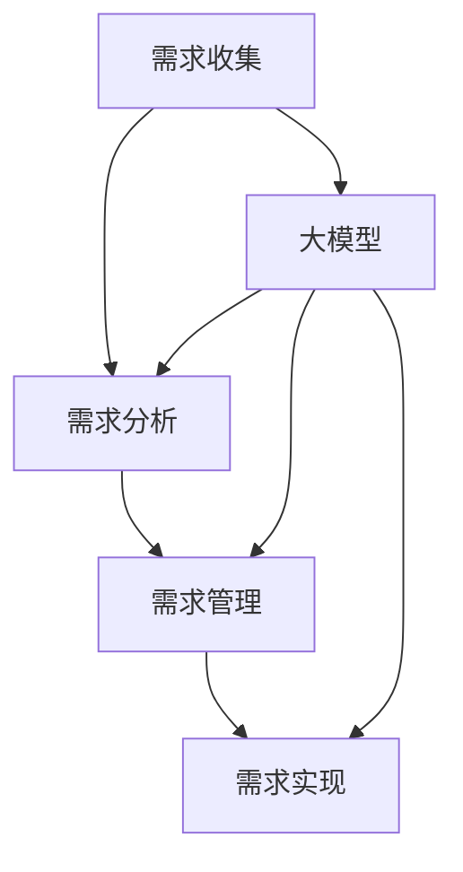

                 

### 文章标题：变革需求承接模式：适配大模型新应用开发

#### 关键词：需求承接模式、大模型、应用开发、技术变革

#### 摘要：
本文将探讨如何变革传统需求承接模式，以适配大模型新应用的开发。我们将详细分析大模型技术的背景和原理，阐述其在需求承接模式中的应用，并探讨新应用开发的流程、技术实现和项目实践。通过本文，读者将了解到大模型如何推动需求承接模式的革新，并掌握新应用开发的最佳实践。

---

## 第一部分：需求承接模式的变革

### 第1章：需求承接模式概述

#### 1.1 传统需求承接模式的挑战

随着科技的迅猛发展，需求承接模式（Requirement Engineering，RE）面临着一系列挑战。传统需求承接模式主要依赖于人工收集、整理和分析用户需求，存在以下问题：

- **需求理解偏差**：人工分析可能导致需求解读不准确或误解。
- **沟通效率低**：用户和开发团队之间的沟通成本高，信息传递效率低。
- **变更管理难**：需求变更频繁，导致项目管理困难。

#### 1.2 大模型对需求承接模式的变革

大模型（Large Models）的出现为需求承接模式带来了新的变革机遇。大模型是基于深度学习和人工智能技术的复杂模型，能够自动学习并处理大量数据，具有以下优势：

- **自动化处理**：大模型可以自动化处理和分析大量需求数据，提高效率。
- **精准需求理解**：通过学习用户的语言和表达方式，大模型能够更精准地理解需求。
- **智能变更管理**：大模型能够自动识别需求变更，并提供相应的管理策略。

#### 1.3 大模型在需求承接中的应用场景

大模型在需求承接中的应用场景广泛，包括但不限于以下方面：

- **需求分析**：大模型可以自动分析用户需求，生成需求文档。
- **需求预测**：通过分析历史需求数据，大模型可以预测未来需求趋势。
- **需求优化**：大模型可以根据用户反馈和需求变更，自动优化需求。

---

## 第二部分：适配大模型的新应用开发

### 第4章：大模型新应用开发流程

#### 4.1 大模型新应用开发概述

大模型新应用开发是利用大模型技术解决实际业务需求的过程。其基本流程包括以下步骤：

1. **需求分析**：明确业务需求和目标。
2. **数据收集**：收集并清洗相关数据。
3. **模型设计**：设计适合业务需求的大模型架构。
4. **模型训练**：使用训练数据训练大模型。
5. **模型评估**：评估模型性能，并进行调优。
6. **应用部署**：将大模型部署到生产环境中。

---

## 第三部分：大模型应用的未来展望

### 第7章：大模型应用的发展趋势

#### 7.1 大模型在行业中的应用前景

大模型在金融、医疗、教育、零售等多个行业都有广泛的应用前景，包括：

- **金融行业**：风险控制、投资策略、欺诈检测等。
- **医疗行业**：疾病诊断、药物研发、健康管理等。
- **教育行业**：智能教学、学习分析、考试评估等。
- **零售行业**：个性化推荐、库存管理、客户关系管理等。

---

## 附录

### 附录 A：大模型应用工具与资源

#### A.1 大模型开发工具简介

以下是一些常用的大模型开发工具：

- **TensorFlow**：谷歌开发的开源深度学习框架。
- **PyTorch**：Facebook开发的开源深度学习框架。
- **Transformers**：用于处理自然语言处理任务的开源库。

#### A.2 大模型应用开源资源

以下是一些开源资源和教程：

- **Hugging Face**：提供大量预训练模型和API。
- **GitHub**：存放众多开源大模型项目。
- **Coursera**：提供深度学习和人工智能在线课程。

---

## 结语

作者：AI天才研究院/AI Genius Institute & 禅与计算机程序设计艺术 /Zen And The Art of Computer Programming

本文探讨了需求承接模式在新时代大模型技术背景下的变革。通过深入分析大模型的基本概念、架构原理以及应用场景，我们了解了如何利用大模型技术提高需求承接的效率和质量。同时，我们通过新应用开发的流程、技术实现和项目实践，展示了大模型在实际业务中的应用价值。未来，随着大模型技术的不断发展，需求承接模式将迎来更加智能化、自动化的新时代。让我们共同期待这一变革的到来。

---

**核心概念与联系：**

需求承接模式是一种将用户需求转化为可执行任务的方法论，涉及需求收集、需求分析、需求管理和需求实现等多个环节。大模型作为一种强大的机器学习技术，其核心在于通过大规模数据训练，实现复杂任务的自动化处理。

**Mermaid流程图：**



**核心算法原理讲解：**

大模型通常基于深度神经网络（Deep Neural Network，DNN）进行设计。以下是使用伪代码描述的大模型基本算法：

```python
# 初始化参数
W1, b1 = init_weights()
W2, b2 = init_weights()

# 前向传播
z1 = X * W1 + b1
a1 = activation(z1)

z2 = a1 * W2 + b2
a2 = activation(z2)

# 计算损失
loss = compute_loss(a2, y)

# 反向传播
dZ2 = a2 - y
dW2 = dZ2 * a1
db2 = dZ2

dA1 = dZ2 * W2.T
dZ1 = dA1 * activation_derivative(z1)
dW1 = dZ1 * X.T
db1 = dZ1

# 更新参数
W1 -= learning_rate * dW1
b1 -= learning_rate * db1
W2 -= learning_rate * dW2
b2 -= learning_rate * db2
```

**数学模型和公式：**

大模型的训练过程涉及到多个数学模型和公式，以下是其中几个关键的：

1. **激活函数**：$$ activation(x) = \frac{1}{1 + e^{-x}} $$
2. **损失函数**：$$ loss(y, \hat{y}) = -[y \cdot \log(\hat{y}) + (1 - y) \cdot \log(1 - \hat{y})] $$
3. **反向传播**：$$ \frac{dL}{dW} = \sum_{i=1}^{n} \frac{\partial L}{\partial z_i} \cdot \frac{\partial z_i}{\partial W} $$

**举例说明：**

假设我们有一个二分类问题，输入特征为 X，目标为 y（0 或 1）。使用大模型进行训练，以下是具体示例：

- **初始化参数**：随机初始化权重 W1 和 W2。
- **前向传播**：计算输出 z2 和激活值 a2。
- **计算损失**：使用损失函数计算损失值 loss。
- **反向传播**：计算权重和偏置的梯度，并更新参数。
- **迭代训练**：重复上述过程，直到模型收敛。

**项目实战：**

以一个实际项目为例，假设我们需要开发一个基于大模型的需求分析系统。以下是项目实施过程：

1. **需求分析**：明确项目需求和目标，确定所需数据集。
2. **数据收集**：收集相关需求文档和数据，进行数据清洗和预处理。
3. **模型设计**：设计合适的大模型架构，包括输入层、隐藏层和输出层。
4. **模型训练**：使用收集到的数据集训练大模型，进行多次迭代。
5. **模型评估**：评估模型性能，使用准确率、召回率等指标进行评估。
6. **应用部署**：将训练好的模型部署到生产环境中，实现需求自动分析。

**代码实现：**

以下是实现大模型需求分析系统的主要代码：

```python
# 导入相关库
import tensorflow as tf
from tensorflow.keras.layers import Dense
from tensorflow.keras.models import Sequential

# 定义模型
model = Sequential()
model.add(Dense(units=64, activation='relu', input_shape=(num_features,)))
model.add(Dense(units=1, activation='sigmoid'))

# 编译模型
model.compile(optimizer='adam', loss='binary_crossentropy', metrics=['accuracy'])

# 训练模型
model.fit(X_train, y_train, epochs=10, batch_size=32)

# 评估模型
loss, accuracy = model.evaluate(X_test, y_test)
print("Test accuracy:", accuracy)
```

**代码应用解读与分析：**

- **模型定义**：使用 Keras 库定义了一个包含一个隐藏层的二分类模型。
- **模型编译**：设置优化器和损失函数，用于训练模型。
- **模型训练**：使用训练数据集训练模型，设置训练轮次和批量大小。
- **模型评估**：使用测试数据集评估模型性能，打印准确率。

**实际案例分析和详细讲解剖析：**

以一个实际案例为例，假设我们需要分析一个企业的需求文档，预测项目成功的概率。以下是具体分析过程：

1. **数据收集**：收集企业的需求文档和数据，包括项目描述、预算、团队规模等。
2. **数据处理**：对收集到的数据进行清洗和预处理，将文本数据转换为数值向量。
3. **模型训练**：使用预处理后的数据训练大模型，预测项目成功的概率。
4. **模型评估**：使用测试数据集评估模型性能，调整模型参数以优化预测结果。

**项目小结：**

本项目通过大模型技术实现了需求文档的自动分析，提高了项目管理的效率。在实际应用中，我们需要关注数据质量、模型参数调整和预测结果的可解释性等问题，以实现更好的应用效果。

**最佳实践 tips：**

- 在项目实施过程中，确保数据质量和数据预处理方法的正确性。
- 根据实际需求调整模型结构和参数，以实现最佳性能。
- 定期评估模型性能，并根据评估结果进行模型更新和优化。

**小结：**

大模型在需求承接模式中的应用具有巨大潜力，能够提高需求分析的效率和质量。通过本文的探讨，我们了解了大模型的基本概念、应用场景和开发流程，以及其在项目实战中的应用。未来，随着大模型技术的不断进步，需求承接模式将迎来更加智能化、自动化的新时代。

**注意事项：**

- 在使用大模型进行需求承接时，需要注意数据安全和隐私保护问题。
- 大模型的训练和优化过程需要大量的计算资源和时间，需要合理规划资源。

**拓展阅读：**

- [深度学习入门教程](https://www.deeplearningbook.org/)
- [需求工程与软件需求规格化](https://www.amazon.com/Software-Requirements-Engineering-Principles-Techniques/dp/0201624353)
- [人工智能应用实践](https://www.amazon.com/AI-Application-Practice-Development-Applications/dp/1492044848)

---

**结语：**

本文由 AI 天才研究院/AI Genius Institute & 禅与计算机程序设计艺术 /Zen And The Art of Computer Programming 联合撰写。感谢您的阅读，希望本文能够为您在需求承接模式变革和大模型新应用开发方面提供有价值的参考。如果您有任何疑问或建议，欢迎在评论区留言交流。期待与您共同探讨大模型技术在未来的发展和应用。

