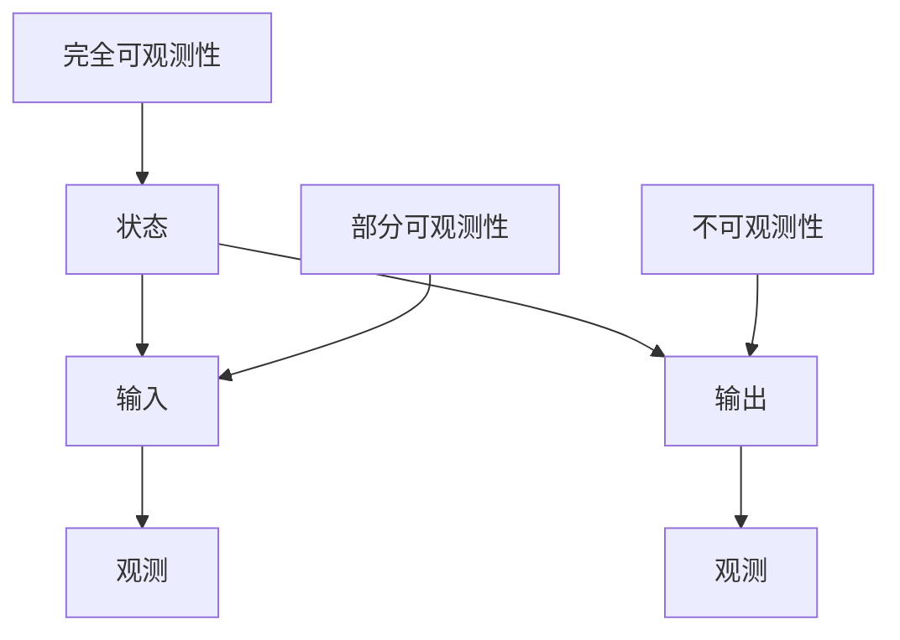

                 

### 1.2 可观测性的重要性

在LLM（大型语言模型）应用中，可观测性尤为重要，因为它直接影响模型的性能评估、故障排查和持续优化。

#### 1.2.1 在LLM中的应用场景

- **模型训练和评估**：通过可观测性，可以监控模型的训练过程，评估其性能。例如，可以使用各种指标如损失函数、准确率、F1分数等来衡量模型的训练效果。此外，还可以通过分析训练过程中的中间结果和梯度信息，了解模型的学习过程和可能的过拟合或欠拟合情况。

- **实时交互**：在用户交互中，可观测性可以帮助识别和解决用户遇到的问题。例如，通过监控模型的响应时间、输入输出数据、错误率等信息，可以快速定位并修复导致用户不满或系统崩溃的问题。

- **故障检测和恢复**：可观测性提供了工具来检测和响应模型故障。例如，通过监控模型的状态变量和关键性能指标，可以及时发现异常情况，如内存泄漏、计算错误或网络中断等，并采取相应的措施进行恢复。

#### 1.2.2 与机器学习模型的关联

- **可解释性**：可观测性为模型的可解释性提供了数据支持，有助于理解模型的决策过程。通过监控模型的中间计算过程和关键变量，可以揭示模型在处理输入数据时的逻辑和规则，从而增强模型的可解释性。

- **持续优化**：通过可观测性，可以持续监控模型表现，及时调整和优化模型的参数和结构。例如，通过分析模型在不同数据集上的性能，可以识别出模型的弱点和改进方向，从而指导后续的模型优化工作。

### 1.3 可观测性的核心概念

在深入探讨可观测性在LLM中的应用之前，有必要先了解一些核心概念和它们之间的关系。

#### 1.3.1 状态与观测

- **状态**：状态（State）是系统在某一时刻的完整描述，包括内部变量和外部环境的影响。对于LLM来说，状态可能包括词汇嵌入、上下文信息、模型参数等。

- **观测**：观测（Observation）是系统状态的一部分或全部属性的测量值。在LLM中，观测可以是模型对输入数据的预测结果、损失函数值、训练过程中的中间变量等。

#### 1.3.2 输入与输出

- **输入**：输入（Input）是影响系统状态的外部因素。在LLM中，输入可能是用户的查询、训练数据等。

- **输出**：输出（Output）是系统对输入的响应或处理结果。在LLM中，输出可能是模型的预测、生成的文本等。

#### 1.3.3 可观测性指标

- **可观测性指标**：用于评估系统可观测性的指标。常见的指标包括：

  - **完全可观测性**：系统状态可以完全通过输出观测得到。
  - **部分可观测性**：系统状态的一部分可以通过输出观测得到，另一部分则需要通过输入进行推测。
  - **不可观测性**：系统状态无法通过输出观测得到。

### 1.4 Mermaid 流程图

为了更直观地理解可观测性的核心概念和关系，我们可以使用Mermaid流程图来展示。以下是一个简单的Mermaid流程图示例：

- **状态**（A）受到**输入**（B）的影响，并通过**输出**（C）进行观测。
- **完全可观测性**（F）意味着系统的状态可以通过输出完全观测到。
- **部分可观测性**（G）表示部分状态可以通过输入观测到。
- **不可观测性**（H）意味着系统的某些状态无法通过输出或输入观测到。

通过上述流程图，我们可以更清晰地理解可观测性在LLM中的应用，以及它与状态、输入、输出之间的关系。

### 1.5 小结

本章介绍了可观测性的基本概念、重要性以及与机器学习模型的关联。我们通过Mermaid流程图展示了可观测性的核心概念和关系，为进一步探讨可观测性在LLM中的应用奠定了基础。在下一章中，我们将深入讨论可观测性的数学模型和实现原理。

---

接下来，我们将在第二章中深入探讨可观测性的数学模型，包括状态观测器设计和概率论与统计学基础。我们将通过伪代码和数学公式详细阐述这些概念，帮助读者更好地理解可观测性的实现原理。请继续关注下一章的内容。

