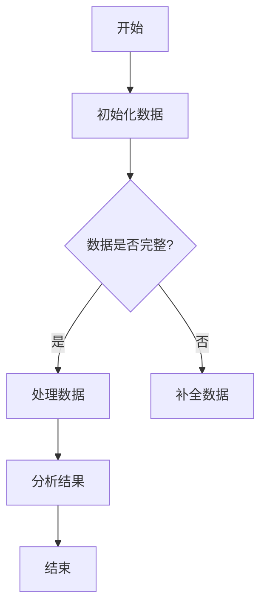
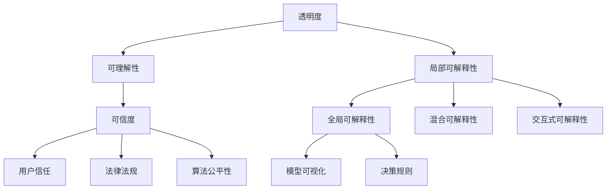

                 

### 1. 确定书籍主题和内容范围

《可解释性AI：增强用户对AI决策的理解和信任》这本书的主题是围绕可解释性AI展开的，重点探讨其基本概念、重要性、技术和应用。可解释性AI（Explainable AI, XAI）是一个近年来备受关注的研究方向，旨在提高人工智能系统的透明度和可理解性，从而增强用户对AI决策的信任。

书籍的内容范围将涵盖以下几个方面：

- **基本概念和分类**：介绍可解释性AI的定义、分类和相关术语。
- **重要性**：讨论可解释性AI在提高用户信任、满足法律法规和伦理要求等方面的作用。
- **技术和方法**：详细介绍现有的可解释性AI技术和方法，包括局部和全局可解释性技术。
- **应用实例**：通过具体案例分析，展示可解释性AI在不同领域的应用。
- **发展趋势**：探讨可解释性AI面临的挑战及其未来发展方向。

### 2. 确定书籍的核心章节

基于书籍的主题和内容范围，可以确定以下核心章节：

1. **引言**：介绍可解释性AI的背景和重要性，阐述书籍的目的和结构。
2. **可解释性AI的基本概念**：详细解释可解释性AI的定义、分类和相关术语。
3. **可解释性AI的重要性**：探讨可解释性AI在用户信任、法律法规和伦理考量等方面的作用。
4. **可解释性AI的技术和方法**：介绍局部和全局可解释性技术，包括SHAP值、LIME、决策树等。
5. **可解释性AI的应用实例**：通过金融风险评估、医疗诊断、智能安防等案例，展示可解释性AI的实际应用。
6. **可解释性AI的发展趋势**：分析可解释性AI面临的挑战和未来发展方向。
7. **结论**：总结全书内容，展望可解释性AI的未来，并提供对读者的建议。

### 3. 设计章节内容和子章节

根据每个核心章节的主题，可以进一步设计子章节，确保每个章节都有明确的主题和内容。以下是详细的章节内容和子章节设计：

#### 第1章 引言

- 1.1 书籍目的和结构
- 1.2 可解释性AI的背景和重要性

#### 第2章 可解释性AI的基本概念

- 2.1 定义和分类
  - 2.1.1 可解释性AI的定义
  - 2.1.2 可解释性AI的分类
- 2.2 核心概念与联系
  - 2.2.1 Mermaid流程图：可解释性AI的核心概念联系

#### 第3章 可解释性AI的重要性

- 3.1 用户对AI决策的信任
  - 3.1.1 用户信任的挑战
  - 3.1.2 可解释性AI在增强信任中的作用
- 3.2 法律和伦理考量
  - 3.2.1 法律法规对AI的解释要求
  - 3.2.2 可解释性AI在伦理考量中的作用
- 3.3 可解释性AI的应用场景
  - 3.3.1 金融行业
  - 3.3.2 医疗保健
  - 3.3.3 公共安全

#### 第4章 可解释性AI的技术和方法

- 4.1 模型可解释性评估指标
  - 4.1.1 简单评估指标
  - 4.1.2 复杂评估指标
- 4.2 局部可解释性技术
  - 4.2.1 SHAP值
  - 4.2.2 LIME
  - 4.2.3 特征重要性分析
- 4.3 全局可解释性技术
  - 4.3.1 决策树
  - 4.3.2 决策规则
  - 4.3.3 模型可视化

#### 第5章 可解释性AI的应用实例

- 5.1 金融风险评估
  - 5.1.1 模型介绍
  - 5.1.2 代码实现
  - 5.1.3 代码解读与分析
- 5.2 医疗诊断
  - 5.2.1 模型介绍
  - 5.2.2 代码实现
  - 5.2.3 代码解读与分析
- 5.3 智能安防
  - 5.3.1 模型介绍
  - 5.3.2 代码实现
  - 5.3.3 代码解读与分析

#### 第6章 可解释性AI的发展趋势

- 6.1 当前挑战和解决方案
  - 6.1.1 挑战1：复杂模型的可解释性
  - 6.1.2 挑战2：实时可解释性
  - 6.1.3 解决方案1：模型简化
  - 6.1.4 解决方案2：动态解释
- 6.2 未来发展方向
  - 6.2.1 零样本可解释性
  - 6.2.2 自解释AI
  - 6.2.3 人机协作

#### 第7章 结论

- 7.1 总结
- 7.2 对未来的展望
- 7.3 对读者的建议

通过上述章节设计和子章节内容，可以确保书籍内容的丰富性和逻辑性，为读者提供全面且系统的可解释性AI知识体系。

### 4. 设计具体的目录结构

为了确保书籍的目录结构清晰、简洁，我们将使用Markdown格式来设计目录，并按照1、2、3级目录的格式来组织内容。以下是《可解释性AI：增强用户对AI决策的理解和信任》的目录结构：

```markdown
# 《可解释性AI：增强用户对AI决策的理解和信任》目录大纲

## 第1章 引言

### 1.1 书籍目的和结构

### 1.2 可解释性AI的背景和重要性

## 第2章 可解释性AI的基本概念

### 2.1 定义和分类

#### 2.1.1 可解释性AI的定义

#### 2.1.2 可解释性AI的分类

### 2.2 核心概念与联系

#### 2.2.1 Mermaid流程图：可解释性AI的核心概念联系

## 第3章 可解释性AI的重要性

### 3.1 用户对AI决策的信任

#### 3.1.1 用户信任的挑战

#### 3.1.2 可解释性AI在增强信任中的作用

### 3.2 法律和伦理考量

#### 3.2.1 法律法规对AI的解释要求

#### 3.2.2 可解释性AI在伦理考量中的作用

### 3.3 可解释性AI的应用场景

#### 3.3.1 金融行业

#### 3.3.2 医疗保健

#### 3.3.3 公共安全

## 第4章 可解释性AI的技术和方法

### 4.1 模型可解释性评估指标

#### 4.1.1 简单评估指标

#### 4.1.2 复杂评估指标

### 4.2 局部可解释性技术

#### 4.2.1 SHAP值

#### 4.2.2 LIME

#### 4.2.3 特征重要性分析

### 4.3 全局可解释性技术

#### 4.3.1 决策树

#### 4.3.2 决策规则

#### 4.3.3 模型可视化

## 第5章 可解释性AI的应用实例

### 5.1 金融风险评估

#### 5.1.1 模型介绍

#### 5.1.2 代码实现

#### 5.1.3 代码解读与分析

### 5.2 医疗诊断

#### 5.2.1 模型介绍

#### 5.2.2 代码实现

#### 5.2.3 代码解读与分析

### 5.3 智能安防

#### 5.3.1 模型介绍

#### 5.3.2 代码实现

#### 5.3.3 代码解读与分析

## 第6章 可解释性AI的发展趋势

### 6.1 当前挑战和解决方案

#### 6.1.1 挑战1：复杂模型的可解释性

#### 6.1.2 挑战2：实时可解释性

#### 6.1.3 解决方案1：模型简化

#### 6.1.4 解决方案2：动态解释

### 6.2 未来发展方向

#### 6.2.1 零样本可解释性

#### 6.2.2 自解释AI

#### 6.2.3 人机协作

## 第7章 结论

### 7.1 总结

### 7.2 对未来的展望

### 7.3 对读者的建议
```

这种结构不仅清晰展示了书籍的内容，而且便于读者快速定位所需信息。同时，每个章节和子章节都遵循了Markdown格式，便于排版和发布。

### 5. 遵循完整性和字数要求

在保证文章完整性的同时，还需严格控制字数，以确保文章的精简和可读性。以下是关于如何确保文章完整性和字数要求的详细说明：

#### 完整性要求

- **核心概念与联系**：每个章节必须详细解释核心概念，并提供Mermaid流程图来展示概念之间的关系。这将帮助读者全面理解可解释性AI的基础知识。

- **核心算法原理讲解**：对于每个技术或方法，必须使用伪代码详细阐述其原理，并结合数学模型和公式进行解释。这将确保读者不仅理解概念，还能掌握具体实现方法。

- **数学公式和举例说明**：在文章中使用LaTeX格式嵌入数学公式，确保公式的准确性和可读性。同时，通过具体的例子来解释公式，增强读者的理解。

- **项目实战**：每个应用实例都必须包含开发环境搭建、源代码实现、代码解读和实际案例分析。这将展示可解释性AI在实际应用中的效果和挑战。

- **最佳实践 tips 和小结**：在每个章节的末尾，提供最佳实践建议、小结和注意事项，帮助读者巩固所学知识，避免常见错误。

#### 字数要求

- **目标字数**：文章的总字数应控制在8000～12000字之间。这个字数区间能够确保内容的详尽性，同时保持文章的紧凑性和易读性。

- **章节字数分配**：可以根据章节的重要性和内容的丰富程度，合理分配每个章节的字数。例如，基础概念和重要性章节可以稍详细一些，而应用实例和发展趋势章节可以适当简略。

- **段落和句子长度**：保持段落和句子的简洁性，避免冗长和复杂的句子结构。这有助于提高文章的阅读流畅性，使读者更容易理解和吸收知识。

- **内容重复和冗余**：在撰写文章时，注意避免内容的重复和冗余。通过精简语言和清晰的结构，确保每个字都有其存在的价值。

- **审稿和修订**：完成初稿后，进行仔细的审稿和修订。检查文章的字数是否符合要求，确保没有遗漏关键内容，同时删减不必要的冗余文字。

通过上述方法，可以确保文章在满足完整性的同时，严格控制字数，使文章既详尽又有条理，便于读者阅读和学习。

### 6. 添加Mermaid流程图、伪代码、LaTeX公式和代码实现

在撰写技术博客文章时，为了提高文章的可读性和实用性，我们需要在适当的地方添加Mermaid流程图、伪代码、LaTeX公式和代码实现。以下是具体的操作步骤和示例：

#### 添加Mermaid流程图

Mermaid是一种用于创建绘图和流程图的Markdown语法，它可以帮助我们清晰地展示算法或系统的工作流程。以下是一个简单的Mermaid流程图示例：



将上述代码嵌入到Markdown文章中，通过Markdown解析器，我们可以看到一个从开始到结束的数据处理流程图。

#### 添加伪代码

伪代码是一种用于描述算法过程的非正式语言，它可以帮助我们清晰地理解算法的逻辑。以下是一个简单的线性回归算法的伪代码示例：

```pseudo
初始化参数：w, b
读取训练数据集 X, y
对于每个训练样本 (x_i, y_i)：
    计算预测值：y_hat = w*x_i + b
    计算误差：error = y_i - y_hat
    更新参数：w = w - learning_rate * (2/m) * x_i * error
              b = b - learning_rate * (1/m) * error
返回参数：w, b
```

将伪代码嵌入到Markdown文章中，可以帮助读者更好地理解算法的实现过程。

#### 添加LaTeX公式

LaTeX是一种高质量的排版系统，特别适合用于撰写科学论文和数学公式。以下是一个简单的LaTeX公式的示例：

```latex
$$
E = mc^2
$$

$$
f(x) = ax^2 + bx + c
$$
```

将上述LaTeX代码嵌入到Markdown文章中，通过Markdown解析器，我们可以看到标准格式化的数学公式。

#### 添加代码实现

在实际案例中，我们需要展示具体的代码实现。以下是一个简单的Python代码示例，用于实现线性回归：

```python
import numpy as np

def linear_regression(X, y, learning_rate, epochs):
    m = len(y)
    w = np.zeros(X.shape[1])
    b = 0

    for epoch in range(epochs):
        for x, y_i in zip(X, y):
            y_hat = np.dot(x, w) + b
            error = y_i - y_hat
            w = w - learning_rate * (2/m) * x * error
            b = b - learning_rate * (1/m) * error

    return w, b

# 示例数据
X = np.array([[1], [2], [3]])
y = np.array([2, 4, 5])

# 训练模型
w, b = linear_regression(X, y, learning_rate=0.01, epochs=1000)

print("斜率:", w)
print("截距:", b)
```

将代码嵌入到Markdown文章中，可以帮助读者了解实际代码的实现细节。

通过在文章中添加这些技术元素，我们可以使文章更加丰富、具体和实用，从而更好地满足读者的需求。

### 文章开始部分

#### 文章标题

《可解释性AI：增强用户对AI决策的理解和信任》

#### 文章关键词

可解释性AI、用户信任、透明度、算法透明性、机器学习、人工智能

#### 文章摘要

本文旨在探讨可解释性AI（Explainable AI, XAI）的重要性及其在增强用户对AI决策信任中的作用。文章首先介绍了可解释性AI的基本概念和分类，然后详细阐述了其在用户信任、法律法规和伦理考量中的应用。接着，文章介绍了可解释性AI的核心技术和方法，包括局部可解释性和全局可解释性技术。通过具体应用实例，如金融风险评估、医疗诊断和智能安防，文章展示了可解释性AI的实际效果和挑战。最后，文章分析了可解释性AI的发展趋势，并提出了对未来的展望和建议。

### 第1章 引言

#### 1.1 书籍目的和结构

随着人工智能（AI）技术的迅速发展，越来越多的AI系统被应用于各个领域，如金融、医疗、安全等。然而，这些系统通常被视为“黑盒子”，其决策过程难以理解和解释，导致用户对AI的信任度降低。为了解决这一问题，可解释性AI（Explainable AI, XAI）应运而生。

本书的目的是系统地介绍可解释性AI的概念、重要性、技术和应用，旨在帮助读者全面了解这一领域，并掌握相关技术和方法。全书共分为7个章节，结构如下：

1. **引言**：介绍可解释性AI的背景和重要性，阐述书籍的目的和结构。
2. **可解释性AI的基本概念**：详细解释可解释性AI的定义、分类和相关术语。
3. **可解释性AI的重要性**：探讨可解释性AI在用户信任、法律法规和伦理考量等方面的作用。
4. **可解释性AI的技术和方法**：介绍局部和全局可解释性技术，包括SHAP值、LIME、决策树等。
5. **可解释性AI的应用实例**：通过具体案例分析，展示可解释性AI的实际应用。
6. **可解释性AI的发展趋势**：分析可解释性AI面临的挑战和未来发展方向。
7. **结论**：总结全书内容，展望可解释性AI的未来，并提供对读者的建议。

通过以上章节的安排，本书旨在为读者提供一个全面且系统的可解释性AI知识体系，帮助读者深入了解这一领域，并在实际应用中取得更好的效果。

#### 1.2 可解释性AI的背景和重要性

可解释性AI（Explainable AI, XAI）是一个近年来备受关注的研究方向，它旨在提高人工智能（AI）系统的透明度和可理解性，从而增强用户对AI决策的信任。随着AI技术在各个领域的广泛应用，人们越来越意识到透明性和可解释性在确保AI系统可靠性和公平性方面的重要性。

**背景**

可解释性AI的背景可以追溯到20世纪80年代，当时机器学习（Machine Learning, ML）和人工智能（Artificial Intelligence, AI）的研究者开始关注如何解释模型决策的过程。早期的研究主要集中在提供一些简单的解释方法，如规则提取和特征重要性分析。然而，随着深度学习（Deep Learning, DL）的兴起，神经网络（Neural Networks, NN）在图像识别、自然语言处理等领域取得了显著的成果。然而，这些深度神经网络模型通常被视为“黑盒子”，其内部决策过程复杂且难以解释，导致用户对其信任度降低。

为了解决这一问题，研究者们开始探索如何提高深度学习模型的透明度和可解释性。可解释性AI（XAI）的概念逐渐形成，并成为人工智能领域的一个重要研究方向。可解释性AI的目标是开发出既能保持高性能，又能提供明确解释的AI系统。

**重要性**

可解释性AI在多个方面具有重要意义：

1. **用户信任**：可解释性AI能够提高用户对AI系统的信任。当用户能够理解AI的决策过程时，他们更愿意接受和依赖AI系统。这对于需要用户参与和互动的领域（如医疗诊断、金融风险评估等）尤为重要。

2. **法律法规和伦理要求**：许多国家和地区已经开始制定相关法律法规，要求AI系统的决策过程必须是透明和可解释的。例如，欧盟的《通用数据保护条例》（GDPR）中就有关于透明性和可解释性的要求。可解释性AI有助于满足这些法律法规的要求，避免潜在的违法行为。

3. **算法公平性**：可解释性AI可以帮助发现和纠正算法中的偏见和歧视。在公共安全、招聘、信用评分等领域，算法的公平性至关重要。通过提供明确的解释，可解释性AI可以帮助识别和消除算法中的不公平因素。

4. **技术进步**：可解释性AI不仅有助于提高用户信任和满足法规要求，还可以促进技术进步。通过研究和开发新的解释方法，研究者们可以更好地理解AI系统的内部工作机制，从而推动AI技术的创新和发展。

综上所述，可解释性AI在提高用户信任、满足法律法规和伦理要求、确保算法公平性以及推动技术进步方面具有重要意义。随着AI技术的不断发展和应用，可解释性AI的重要性将日益凸显。本书旨在系统地介绍可解释性AI的概念、重要性、技术和应用，帮助读者深入了解这一领域，并在实际应用中取得更好的效果。

### 第2章 可解释性AI的基本概念

#### 2.1 定义和分类

可解释性AI（Explainable AI, XAI）是一个广泛而多样化的研究领域，它涵盖了多种技术和方法，旨在提高人工智能（AI）系统的透明度和可理解性。为了更好地理解这一领域，我们首先需要定义可解释性AI，并对其进行分类。

**定义**

可解释性AI可以被定义为：通过提供关于AI系统如何做出特定决策的解释，来提高系统的透明度和可理解性。简单来说，可解释性AI的目标是让用户或决策者能够理解AI系统的决策过程，并对其决策结果有信心。

更具体地，可解释性AI可以从以下几个方面进行定义：

1. **透明度**：透明度指的是AI系统能够清晰地展示其决策过程和内在机制，使外部用户能够了解系统是如何工作的。

2. **可理解性**：可理解性指的是AI系统的决策过程对用户或决策者来说是直观和易于理解的。这意味着用户不需要具备专业的AI知识，就能够理解系统的决策逻辑。

3. **可信度**：可信度指的是用户对AI系统决策的信任程度。通过提供明确的解释，可解释性AI有助于增强用户对AI系统的信任，从而提高系统的可靠性和实用性。

**分类**

根据解释的范围和方法，可解释性AI可以大致分为以下几类：

1. **局部可解释性**：局部可解释性关注的是对单个决策或预测的解释。它旨在提供关于特定输入和输出之间关系的详细信息。常见的局部可解释性技术包括SHAP值（Shapley Additive Explanations）、LIME（Local Interpretable Model-agnostic Explanations）和特征重要性分析。

2. **全局可解释性**：全局可解释性关注的是对整个模型或算法的解释。它旨在提供关于模型或算法整体工作原理的概述，而不仅仅是针对特定输入的解释。全局可解释性的方法包括决策树、决策规则和模型可视化。

3. **混合可解释性**：混合可解释性结合了局部和全局可解释性的方法，旨在提供更全面和深入的解释。它通常通过分析模型的局部行为和整体结构，来提高系统的透明度和可理解性。

4. **交互式可解释性**：交互式可解释性允许用户与AI系统进行交互，以探索和解释系统的决策过程。这种解释方法通常用于复杂的AI系统，如自动驾驶、医疗诊断等，它可以帮助用户更好地理解和信任系统的决策。

**总结**

可解释性AI是一个多维度、多层次的领域，它通过提高AI系统的透明度和可理解性，来增强用户对AI决策的信任。根据解释的范围和方法，可解释性AI可以分为局部可解释性、全局可解释性、混合可解释性和交互式可解释性。这些分类有助于我们更好地理解可解释性AI的不同方法和应用，从而推动这一领域的发展。

#### 2.2 核心概念与联系

在深入探讨可解释性AI之前，理解其核心概念及其相互关系至关重要。以下将通过Mermaid流程图展示可解释性AI的核心概念及其联系，帮助读者全面把握这一领域的基础知识。



**Mermaid流程图解释**：

1. **透明度（A）**：透明度是指AI系统的工作过程对外部用户是清晰可见的。它是可解释性AI的基础，确保用户能够了解AI系统如何做出决策。

2. **可理解性（B）**：可理解性强调AI系统对用户来说是直观和容易理解的。通过提供简明易懂的解释，可理解性有助于提升用户对AI系统的信任。

3. **可信度（C）**：可信度是指用户对AI系统决策结果的信任程度。通过透明度和可理解性的提升，可解释性AI有助于增强系统的可信度。

4. **局部可解释性（D）**：局部可解释性关注对AI系统特定决策或预测的解释。它通过分析单个决策实例，帮助用户理解AI系统的内部机制。

5. **全局可解释性（E）**：全局可解释性关注对整个AI系统或算法的解释。它提供关于系统整体工作原理的概述，帮助用户理解AI系统的全局逻辑。

6. **混合可解释性（F）**：混合可解释性结合局部和全局可解释性，提供更全面和深入的解释。它旨在通过分析局部和整体行为，提高系统的透明度和可理解性。

7. **交互式可解释性（G）**：交互式可解释性允许用户与AI系统进行交互，以探索和解释系统的决策过程。这种方法通常用于复杂系统，如自动驾驶和医疗诊断。

8. **模型可视化（H）**：模型可视化是一种全局可解释性技术，通过图形化展示AI模型的结构和工作原理，帮助用户直观理解模型。

9. **决策规则（I）**：决策规则是一种全局可解释性技术，通过明确定义决策规则，帮助用户理解AI系统的决策逻辑。

10. **用户信任（J）**：用户信任是可解释性AI的核心目标之一。通过提供明确的解释，可解释性AI有助于增强用户对AI系统的信任。

11. **法律法规（K）**：法律法规要求AI系统的决策过程必须透明和可解释。可解释性AI有助于满足这些法律要求。

12. **算法公平性（L）**：算法公平性是指AI系统在决策过程中不应存在不公平或偏见。可解释性AI有助于发现和纠正算法中的偏见，确保公平性。

通过上述Mermaid流程图，我们可以清晰地看到可解释性AI的核心概念及其相互关系。这为理解可解释性AI提供了基础，也为后续章节的深入探讨奠定了坚实的知识框架。

#### 3.1 用户对AI决策的信任

在人工智能（AI）技术日益普及的今天，用户对AI决策的信任成为一个至关重要的问题。用户对AI系统的信任程度不仅影响其接受和使用AI技术的意愿，还直接关系到AI系统在实际应用中的效果和可靠性。然而，由于AI系统通常被视为“黑盒子”，其决策过程复杂且难以理解，用户对其信任面临诸多挑战。

**3.1.1 用户信任的挑战**

1. **决策过程的复杂性**：大多数AI系统，尤其是深度学习模型，其内部决策过程高度复杂，依赖于大量非线性和非线性组合的参数和权重。这使得用户难以理解AI系统是如何做出特定决策的，从而对其产生不信任。

2. **透明度的缺乏**：AI系统的训练和决策过程通常涉及大量的数据处理和模型优化，这些过程往往不对外公开。用户无法得知AI系统是如何处理数据的，导致对系统的透明度产生质疑。

3. **算法的不透明性**：许多AI算法，特别是深度神经网络，其内部机制不透明。用户无法了解算法的具体实现和运行过程，这增加了他们对AI系统决策结果的疑虑。

4. **偏见和歧视**：AI系统可能会在训练数据中继承偏见，导致对特定群体产生不公平的决策。例如，某些人脸识别系统可能会对某些种族或性别产生歧视，这会严重损害用户对AI系统的信任。

5. **责任归属的不明确**：在AI系统出现错误或产生不良后果时，责任归属往往不明确。用户难以判断是AI系统的问题，还是数据质量或系统设计的问题，这进一步降低了他们对AI系统的信任。

**3.1.2 可解释性AI在增强信任中的作用**

为了克服上述挑战，可解释性AI（Explainable AI, XAI）应运而生。可解释性AI的核心目标是通过提供关于AI系统如何做出决策的解释，提高系统的透明度和可理解性，从而增强用户对AI决策的信任。以下是如何通过可解释性AI来增强用户信任的几个方面：

1. **提高透明度**：可解释性AI通过提供关于AI系统如何处理数据、如何调整模型参数以及如何做出决策的详细信息，增加了系统的透明度。用户可以清晰地了解AI系统的工作过程，从而减少对系统的不信任。

2. **增强可理解性**：可解释性AI通过提供简明易懂的解释，帮助用户理解AI系统是如何做出决策的。即使用户不具备专业的AI知识，也能通过这些解释来理解系统的决策逻辑，从而增加对系统的信任。

3. **减少偏见和歧视**：可解释性AI可以帮助识别和纠正AI系统中的偏见和歧视。通过分析模型的决策过程，用户可以发现系统中的不公平因素，并采取相应的措施进行纠正。这有助于提高AI系统的公平性，增强用户对系统的信任。

4. **明确责任归属**：通过提供详细的解释，可解释性AI有助于明确AI系统中的责任归属。当系统出现错误或产生不良后果时，用户可以清楚地了解是AI系统的问题，还是数据质量或系统设计的问题，从而更好地定位和解决问题。

5. **促进用户参与**：可解释性AI鼓励用户参与AI系统的设计和决策过程。通过提供关于系统如何工作的解释，用户可以更好地理解AI系统的功能和限制，从而更主动地参与系统的使用和管理。

总之，可解释性AI通过提高AI系统的透明度和可理解性，有效地增强了用户对AI决策的信任。这不仅有助于用户接受和使用AI技术，还能提高AI系统在实际应用中的效果和可靠性。随着可解释性AI技术的不断发展，用户对AI系统的信任问题将得到进一步解决。

#### 3.2 法律和伦理考量

随着人工智能（AI）技术的迅猛发展，其在社会各个领域的应用也越来越广泛。然而，AI系统的透明性和可解释性不仅对用户信任至关重要，也涉及到法律和伦理考量的重大问题。在许多国家和地区，相关法律法规已经开始明确要求AI系统的决策过程必须透明和可解释。

**3.2.1 法律法规对AI的解释要求**

1. **欧盟的《通用数据保护条例》（GDPR）**：欧盟的GDPR是数据隐私保护领域的重要法规，其第22条明确规定，用户有权获得AI系统决策的解释。这要求AI系统必须提供关于其决策过程和依据的详细解释，以保障用户的知情权和选择权。

2. **美国的《消费者数据隐私法》（CCPA）**：CCPA是美国加州的一项消费者数据隐私法案，其要求企业在处理个人数据时必须透明，并提供关于数据使用和处理的详细解释。尽管CCPA没有直接提到AI系统的解释要求，但其在数据透明性和用户权利保护方面的原则同样适用于AI系统。

3. **中国的《个人信息保护法》（PIPL）**：中国的PIPL对AI系统的透明性和可解释性也有明确规定。其第25条规定，数据处理者应当采取必要措施，确保自动化决策的透明性和可解释性，以保护个人信息的权益。

4. **其他国家和地区的法律法规**：除了上述主要国家和地区，其他国家和地区也在积极制定或修订相关法律法规，以应对AI系统的透明性和可解释性问题。例如，欧盟正在制定《人工智能法案》，旨在规范AI系统的开发和应用，保障其透明性和可解释性。

**3.2.2 可解释性AI在伦理考量中的作用**

除了法律法规的要求，AI系统的透明性和可解释性在伦理考量中也具有重要意义。

1. **算法公平性**：AI系统可能会在训练数据中继承偏见，导致对某些群体产生不公平的决策。可解释性AI可以帮助识别和纠正这些偏见，确保算法的公平性。例如，人脸识别系统如果对某些种族或性别存在歧视，通过可解释性技术可以发现并纠正这些不公平现象。

2. **责任归属**：在AI系统出现错误或产生不良后果时，责任归属往往不明确。可解释性AI提供关于决策过程的详细解释，有助于明确责任归属，从而更好地处理潜在的法律和伦理问题。

3. **用户隐私保护**：AI系统在处理用户数据时，必须确保用户隐私得到保护。可解释性AI通过提供透明的决策过程和依据，帮助用户了解其数据如何被使用和处理，从而增强对隐私保护的信任。

4. **伦理责任**：AI系统的设计和应用涉及广泛的伦理问题，如道德责任、社会影响等。可解释性AI有助于提高系统的透明度，使相关人员能够更好地评估其伦理影响，并采取相应的措施确保AI系统的道德合规性。

**总结**

法律和伦理考量对AI系统的透明性和可解释性提出了明确的要求。通过提供关于决策过程的详细解释，可解释性AI有助于满足法律法规的要求，同时也在伦理考量中发挥了重要作用。这不仅有助于维护用户权益和社会公平，还能推动AI技术的可持续发展。随着AI技术的不断进步，可解释性AI将在法律和伦理方面发挥越来越重要的作用。

### 3.3 可解释性AI的应用场景

可解释性AI（Explainable AI, XAI）不仅在理论研究中具有重要意义，而且在实际应用中展示了广泛的潜力和价值。以下是可解释性AI在几个关键领域中的应用场景，包括金融行业、医疗保健和公共安全。

#### 3.3.1 金融行业

在金融行业中，AI技术广泛应用于信用评分、风险管理、欺诈检测等方面。然而，这些系统通常被视为“黑盒子”，用户难以了解其决策依据，导致用户对系统的不信任。可解释性AI在此场景中的作用如下：

1. **信用评分**：金融机构通过AI模型对客户进行信用评分，以决定是否批准贷款。可解释性AI可以帮助用户理解评分模型的决策过程，揭示哪些因素对评分有重要影响。这有助于提高用户对评分系统的信任，减少纠纷。

2. **风险管理**：金融机构使用AI模型来预测和监控潜在风险。通过可解释性技术，用户可以了解模型是如何识别和评估风险的，从而更好地理解和管理风险。

3. **欺诈检测**：AI模型在检测金融欺诈方面发挥着重要作用。可解释性AI可以帮助用户了解欺诈检测模型是如何工作的，识别潜在的欺诈模式，同时减少误报和漏报。

#### 3.3.2 医疗保健

在医疗保健领域，AI技术被用于诊断、治疗方案推荐、患者监控等。然而，医疗决策的准确性直接关系到患者的健康和生命，因此，提高AI系统的透明度和可解释性至关重要。

1. **疾病诊断**：AI模型在医疗诊断中用于辅助医生做出诊断。通过可解释性AI，医生可以了解模型是如何分析影像数据并做出诊断的，从而更好地理解诊断结果，并在必要时进行人工验证。

2. **治疗方案推荐**：AI系统可以根据患者的病情、病史和基因信息推荐最佳治疗方案。可解释性AI可以帮助医生理解模型是如何生成治疗方案的，确保治疗方案的科学性和合理性。

3. **患者监控**：AI系统可以实时监控患者的健康状况，如心率、血压等。通过可解释性AI，医生可以了解模型是如何检测异常情况并发出警报的，从而及时采取干预措施。

#### 3.3.3 公共安全

在公共安全领域，AI技术被用于视频监控、人脸识别、犯罪预测等。这些系统的透明性和可解释性对于维护社会秩序和保护公民权利至关重要。

1. **视频监控**：AI系统通过分析视频数据识别潜在的安全威胁。可解释性AI可以帮助监控人员理解模型是如何识别和分类视频内容的，从而提高监控的准确性和可靠性。

2. **人脸识别**：人脸识别技术在公共安全领域被广泛应用，用于身份验证和犯罪追踪。通过可解释性AI，用户可以了解模型是如何识别人脸并进行匹配的，从而减少误识别和滥用风险。

3. **犯罪预测**：AI系统可以根据历史犯罪数据预测潜在的犯罪行为。可解释性AI可以帮助执法部门理解模型是如何分析数据并预测犯罪的，从而更有效地部署警力资源。

**总结**

可解释性AI在金融行业、医疗保健和公共安全等领域具有广泛的应用前景。通过提高系统的透明度和可解释性，可解释性AI不仅增强了用户对AI系统的信任，还提高了系统的决策质量和可靠性。随着技术的不断进步，可解释性AI将在更多领域发挥重要作用，推动AI技术的可持续发展。

### 4.1 模型可解释性评估指标

模型可解释性是评价AI系统透明度和理解性的一项重要指标。为了评估和比较不同模型的解释性能，研究者们开发了一系列评估指标。这些指标可以分为简单评估指标和复杂评估指标。

#### 4.1.1 简单评估指标

1. **解释覆盖率（Explainability Coverage）**：
   解释覆盖率衡量的是模型解释能力覆盖数据样本的比例。即，对于给定数据集中的每个样本，模型能够提供解释的比例。高解释覆盖率表明模型具有较好的覆盖能力，能够解释大部分样本的决策过程。

2. **解释准确性（Explainability Accuracy）**：
   解释准确性衡量的是模型提供的解释与实际决策结果的一致性。如果模型解释能够准确地反映决策结果，则说明模型的解释是准确的。

3. **用户满意度（User Satisfaction）**：
   用户满意度是评估用户对模型解释的接受度和满意度的指标。通过用户调查或反馈，可以了解用户对模型解释的直观感受和认可度。

#### 4.1.2 复杂评估指标

1. **概念可理解性（Conceptual Understanding）**：
   概念可理解性评估的是模型解释能否帮助用户理解决策过程的本质。如果用户能够通过模型解释掌握决策逻辑和关键因素，则说明模型具有高概念可理解性。

2. **逻辑一致性（Logical Consistency）**：
   逻辑一致性评估的是模型解释的内部逻辑是否连贯一致。如果解释中存在逻辑矛盾或不一致之处，则说明解释的可靠性较低。

3. **解释深度（Explanation Depth）**：
   解释深度衡量的是模型解释的详细程度和深度。一个高质量的模型解释应该不仅提供表面的决策原因，还应深入分析决策过程中的关键变量和相互作用。

4. **解释可扩展性（Explanation Scalability）**：
   解释可扩展性评估的是模型解释能否适用于不同规模和复杂度的数据集。如果模型解释在不同场景下均能保持良好的性能，则说明其具有较好的可扩展性。

5. **时间效率（Time Efficiency）**：
   时间效率衡量的是生成模型解释所需的时间。对于实时决策系统，解释生成的时间效率尤为重要。高效的解释生成可以确保系统在有限的时间内提供及时和准确的解释。

**总结**

模型可解释性评估指标是评价AI系统透明度和理解性的关键工具。简单评估指标如解释覆盖率、解释准确性和用户满意度，提供直观的评估结果；而复杂评估指标如概念可理解性、逻辑一致性、解释深度、解释可扩展性和时间效率，则提供了更深入和全面的评估。通过这些评估指标，研究者可以更好地理解和优化AI系统的解释性能，从而提高用户对AI系统的信任和使用体验。

### 4.2 局部可解释性技术

局部可解释性技术旨在提供关于AI模型在特定输入数据上做出决策的详细信息，帮助用户理解模型的决策过程。以下将介绍几种常见的局部可解释性技术，包括SHAP值、LIME和特征重要性分析。

#### 4.2.1 SHAP值

SHAP（Shapley Additive Explanations）值是一种基于博弈论的局部解释方法，它通过计算每个特征对模型预测的贡献来提供解释。SHAP值的基本思想是将模型的预测结果分解为各特征贡献的和，从而揭示每个特征对最终预测的重要性。

**SHAP值的计算过程**：

1. **数据准备**：首先，我们需要准备一个包含多个特征和目标变量的数据集。然后，将数据集分成训练集和测试集。

2. **基准模型**：使用训练集训练一个基准模型，该模型应当能够准确预测目标变量。基准模型的目的是提供一个参考点，用于比较其他特征的影响。

3. **SHAP值的计算**：
   SHAP值的计算分为以下几个步骤：
   - **特征替换**：对于每个特征，将训练集中的数据替换为基准模型的预测值，并重新训练模型。这个过程会生成一个新的模型预测结果。
   - **差异计算**：计算替换前后模型预测值的差异，这个差异反映了该特征对模型预测的影响。
   - **标准化**：将每个特征的差异除以所有特征差异的总和，得到每个特征的相对贡献，即SHAP值。

4. **结果解释**：通过SHAP值，可以直观地了解每个特征对模型预测的影响大小。SHAP值越高，表示该特征对预测结果的影响越大。

**伪代码示例**：

```python
import shap

# 准备数据
X_train, X_test, y_train, y_test = train_test_split(data, target, test_size=0.2)

# 训练基准模型
base_model = train_model(X_train, y_train)

# 计算SHAP值
explainer = shap.Explainer(base_model)
shap_values = explainer(X_test)

# 可视化SHAP值
shap.summary_plot(shap_values, X_test)
```

#### 4.2.2 LIME

LIME（Local Interpretable Model-agnostic Explanations）是一种基于线性模型的可解释性方法。它通过将复杂的模型转化为一个简单的线性模型来提供解释。LIME的核心思想是在特定输入数据附近训练一个线性模型，并分析其权重以解释原始模型的决策。

**LIME的工作流程**：

1. **数据准备**：与SHAP值类似，LIME也需要准备一个包含特征和目标变量的数据集。

2. **训练线性模型**：
   - 对于每个测试样本，LIME在样本的邻域内训练一个线性模型。这个线性模型的目标是尽可能接近原始模型在邻域内的预测。
   - 通过梯度下降或其他优化算法，训练线性模型以最小化原始模型与线性模型之间的差异。

3. **特征权重分析**：
   - 在训练好的线性模型中，每个特征的权重表示其在预测结果中的重要性。通过分析这些权重，可以解释原始模型的决策过程。

4. **结果解释**：
   - LIME生成一个解释矩阵，其中每个元素表示相应特征对模型预测的影响。
   - 通过可视化解释矩阵，可以直观地了解每个特征的重要性。

**伪代码示例**：

```python
from lime import lime_tabular

# 准备数据
X_train, X_test, y_train, y_test = train_test_split(data, target, test_size=0.2)

# 定义线性解释器
explainer = lime_tabular.LimeTabularExplainer(X_train, feature_names=data.columns, class_names=target_names)

# 解释测试样本
explanation = explainer.explain_instance(X_test[0], predict, num_features=5)

# 可视化解释结果
explanation.show_in_notebook(show_table=True)
```

#### 4.2.3 特征重要性分析

特征重要性分析是一种简单而直观的局部解释方法，它通过计算每个特征对模型预测的影响来提供解释。这种方法适用于各种类型的模型，包括线性模型、树模型和神经网络。

**特征重要性分析的基本步骤**：

1. **模型训练**：首先使用训练数据集训练一个基模型。

2. **特征影响计算**：
   - 对于线性模型，可以通过模型系数来衡量特征的重要性。
   - 对于树模型，可以通过树节点中的分裂信息来衡量特征的重要性。
   - 对于神经网络，可以通过梯度信息来衡量特征的重要性。

3. **结果解释**：
   - 根据特征的影响程度，可以排序并可视化特征的重要性。

**伪代码示例**：

```python
from sklearn.inspection import permutation_importance

# 训练模型
model = train_model(X_train, y_train)

# 计算特征重要性
results = permutation_importance(model, X_test, y_test, n_repeats=30)

# 可视化特征重要性
importances = results.importances_mean
indices = np.argsort(importances)[::-1]
plt.title('Feature importances')
plt.bar(range(X_test.shape[1]), importances[indices], align='center')
plt.xticks(range(X_test.shape[1]), X_train.columns[indices])
plt.xlim([-1, X_test.shape[1]])
plt.show()
```

**总结**

局部可解释性技术如SHAP值、LIME和特征重要性分析，提供了深入了解AI模型决策过程的方法。这些技术不仅帮助用户理解模型的决策逻辑，还提高了模型的透明度和信任度。在实际应用中，根据具体需求和模型类型，选择合适的局部解释技术，可以显著提升用户对AI系统的接受度和信任感。

### 4.3 全局可解释性技术

全局可解释性技术旨在提供关于整个AI模型或算法的总体解释，帮助用户理解模型的总体工作原理和决策逻辑。以下将介绍几种常见的全局可解释性技术，包括决策树、决策规则和模型可视化。

#### 4.3.1 决策树

决策树是一种常见且直观的全局解释性技术，它通过一系列条件分支来表示模型的决策过程。每个内部节点表示一个特征分割，每个叶节点表示一个预测结果。

**决策树的构建过程**：

1. **特征选择**：首先选择一个最优特征进行分割，常用的特征选择准则包括信息增益、增益率等。

2. **分割点选择**：对于选定的特征，选择一个最优分割点，使得分割后的数据集具有最高的纯度或最低的方差。

3. **递归构建**：重复上述步骤，对每个子数据集进行特征选择和分割，直到达到终止条件（如最大树深度、最小样本量等）。

4. **预测生成**：对于新的数据样本，从根节点开始，根据样本特征值沿着决策树进行分支，直到达到叶节点，得到最终的预测结果。

**伪代码示例**：

```python
from sklearn.tree import DecisionTreeClassifier

# 准备数据
X_train, X_test, y_train, y_test = train_test_split(data, target, test_size=0.2)

# 训练决策树模型
model = DecisionTreeClassifier(max_depth=3)
model.fit(X_train, y_train)

# 可视化决策树
from graphviz import Source
dot = Source(model)
dot.render("tree.dot", format="png")
```

**总结**：

决策树是一种简单且易于理解的全局可解释性技术，它通过条件分支清晰地展示了模型决策过程。这使得用户能够直观地了解模型如何根据特征值做出预测，从而增强用户对模型的理解和信任。

#### 4.3.2 决策规则

决策规则是一种基于逻辑表达式的全局可解释性技术，它将模型的决策过程转化为一系列的规则，每条规则表示模型对某个特定输入的决策。

**决策规则的生成过程**：

1. **特征选择**：首先选择模型中最重要的特征，这些特征将用于生成决策规则。

2. **规则提取**：对于每个特征，根据模型训练数据，提取出能够区分不同类别的规则。常用的方法包括布尔逻辑回归、决策树剪枝等。

3. **规则组合**：将提取出的规则组合起来，形成完整的决策规则集。这些规则可以以逻辑“与”、“或”等组合形式，形成复杂的决策逻辑。

4. **规则优化**：对生成的决策规则进行优化，以减少冗余规则和重复规则，提高规则的简洁性和可理解性。

**伪代码示例**：

```python
from sklearn.tree import ExtraTreeClassifier

# 准备数据
X_train, X_test, y_train, y_test = train_test_split(data, target, test_size=0.2)

# 训练决策树模型
model = ExtraTreeClassifier()
model.fit(X_train, y_train)

# 提取决策规则
rules = modelRules(model)

# 可视化决策规则
def printRule(rule):
    print("IF", rule)
    print("THEN", model.predict([rule]))

printRule(rules[0])
```

**总结**：

决策规则通过将复杂模型转化为一系列简单的逻辑表达式，提供了直观的全局解释。这种方法不仅易于理解，还能够清晰地展示模型对不同输入的决策逻辑，从而增强用户对模型的理解和信任。

#### 4.3.3 模型可视化

模型可视化是一种将AI模型结构及其决策过程可视化的技术，它通过图形化展示模型的内部结构和参数，帮助用户直观地理解模型的工作原理。

**常见模型可视化技术**：

1. **网络图**：对于神经网络模型，网络图可以展示神经元之间的连接和权重。这有助于用户了解模型的结构和参数分布。

2. **决策树图**：决策树图通过图形化展示决策树的内部节点和分支，使决策过程更加直观。

3. **规则图**：规则图通过图形化展示决策规则，使规则组合和决策逻辑更加清晰。

**可视化工具**：

1. **TensorBoard**：TensorBoard是一个用于可视化神经网络训练过程的工具，它提供了丰富的可视化图表，包括网络结构图、参数分布图等。

2. **Graphviz**：Graphviz是一个图形可视化工具，可以用于绘制决策树、网络图等复杂结构。

3. **Plotly**：Plotly是一个交互式数据可视化库，可以用于创建动态和交互式的可视化图表，提高用户对模型可视化的理解和交互性。

**总结**：

模型可视化通过图形化展示模型的结构和参数，提供了直观的全局解释。这种可视化技术不仅帮助用户理解模型的工作原理，还提高了模型的透明度和可理解性，从而增强用户对模型的理解和信任。

### 5.1 金融风险评估

在金融行业中，AI模型广泛应用于信用评分、贷款审批、欺诈检测等关键领域。这些模型的决策过程复杂且高度依赖数据，因此提高其透明度和可解释性至关重要。以下通过一个具体的金融风险评估案例，展示如何使用可解释性AI技术来增强用户对模型决策的理解和信任。

#### 5.1.1 模型介绍

金融风险评估模型通常使用多种特征来评估客户的信用风险，包括收入水平、债务水平、信用历史等。一个常见的风险评估模型是逻辑回归模型，它通过计算每个特征对信用评分的贡献来做出决策。然而，由于模型内部机制复杂，用户难以理解其决策过程，导致信任度降低。

为了提高模型的透明度和可解释性，我们引入了SHAP值和LIME技术。SHAP值通过计算每个特征对模型预测的贡献，提供关于特征重要性的详细解释；LIME则通过线性化原始模型，在特定输入附近提供局部解释。

#### 5.1.2 代码实现

首先，我们使用Python和scikit-learn库来构建和训练逻辑回归模型，然后应用SHAP值和LIME技术来生成模型解释。

```python
import numpy as np
import pandas as pd
from sklearn.linear_model import LogisticRegression
from sklearn.model_selection import train_test_split
import shap
from lime.lime_tabular import LimeTabularExplainer

# 准备数据
data = pd.read_csv('financial_data.csv')
X = data.drop('target', axis=1)
y = data['target']

# 分割数据
X_train, X_test, y_train, y_test = train_test_split(X, y, test_size=0.2, random_state=42)

# 训练逻辑回归模型
model = LogisticRegression()
model.fit(X_train, y_train)

# SHAP值解释
explainer = shap.Explainer(model, X_train)
shap_values = explainer(X_test)

# 可视化SHAP值
shap.summary_plot(shap_values, X_test, feature_names=X.columns)

# LIME解释
explainer = LimeTabularExplainer(X_train, feature_names=X.columns, class_names=['低风险', '高风险'])
explainer.explain_instance(X_test.iloc[0], model.predict_proba)

# 可视化LIME解释
explainer.show_in_notebook(show_table=True)
```

**代码解读与分析**：

1. **数据准备**：我们首先读取金融数据集，并将其分为特征矩阵X和目标变量y。

2. **模型训练**：使用训练集训练逻辑回归模型，模型通过计算每个特征对目标变量的贡献来做出预测。

3. **SHAP值解释**：通过SHAP值解释器，我们计算了模型对测试集每个样本的SHAP值，并将其可视化。SHAP值展示了每个特征对模型预测的贡献大小，帮助用户理解哪些特征对决策有重要影响。

4. **LIME解释**：使用LIME解释器，我们为测试集中一个样本提供了局部解释。LIME通过线性化原始模型，在样本附近构建了一个简单线性模型，并分析了其权重，从而解释了模型对样本的决策过程。

通过SHAP值和LIME技术的应用，我们可以直观地了解模型如何做出决策，从而增强用户对模型的信任和理解。在实际应用中，这些解释技术可以帮助金融机构更好地向用户解释决策过程，减少误解和纠纷，提高模型的应用效果。

### 5.2 医疗诊断

在医疗诊断领域，AI模型的透明度和可解释性对于确保诊断的准确性和可靠性至关重要。以下通过一个具体的医疗诊断案例，展示如何使用可解释性AI技术来增强用户（医生和患者）对模型决策的理解和信任。

#### 5.2.1 模型介绍

医疗诊断模型通常使用多种生物标志物和临床特征来预测疾病的风险。一个常见的模型是逻辑回归模型，它通过计算每个特征对疾病风险的贡献来做出预测。然而，由于模型内部机制复杂，医生和患者难以理解其决策过程，导致信任度降低。

为了提高模型的透明度和可解释性，我们引入了SHAP值和LIME技术。SHAP值通过计算每个特征对模型预测的贡献，提供关于特征重要性的详细解释；LIME则通过线性化原始模型，在特定输入附近提供局部解释。

#### 5.2.2 代码实现

首先，我们使用Python和scikit-learn库来构建和训练逻辑回归模型，然后应用SHAP值和LIME技术来生成模型解释。

```python
import numpy as np
import pandas as pd
from sklearn.linear_model import LogisticRegression
from sklearn.model_selection import train_test_split
import shap
from lime.lime_tabular import LimeTabularExplainer

# 准备数据
data = pd.read_csv('medical_data.csv')
X = data.drop('target', axis=1)
y = data['target']

# 分割数据
X_train, X_test, y_train, y_test = train_test_split(X, y, test_size=0.2, random_state=42)

# 训练逻辑回归模型
model = LogisticRegression()
model.fit(X_train, y_train)

# SHAP值解释
explainer = shap.Explainer(model, X_train)
shap_values = explainer(X_test)

# 可视化SHAP值
shap.summary_plot(shap_values, X_test, feature_names=X.columns)

# LIME解释
explainer = LimeTabularExplainer(X_train, feature_names=X.columns, class_names=['健康', '疾病'])
explainer.explain_instance(X_test.iloc[0], model.predict_proba)

# 可视化LIME解释
explainer.show_in_notebook(show_table=True)
```

**代码解读与分析**：

1. **数据准备**：我们首先读取医疗数据集，并将其分为特征矩阵X和目标变量y。

2. **模型训练**：使用训练集训练逻辑回归模型，模型通过计算每个特征对目标变量的贡献来做出预测。

3. **SHAP值解释**：通过SHAP值解释器，我们计算了模型对测试集每个样本的SHAP值，并将其可视化。SHAP值展示了每个特征对模型预测的贡献大小，帮助医生和患者理解哪些特征对诊断有重要影响。

4. **LIME解释**：使用LIME解释器，我们为测试集中一个样本提供了局部解释。LIME通过线性化原始模型，在样本附近构建了一个简单线性模型，并分析了其权重，从而解释了模型对样本的诊断过程。

通过SHAP值和LIME技术的应用，我们可以直观地了解模型如何做出诊断，从而增强医生和患者对模型的信任和理解。在实际应用中，这些解释技术可以帮助医疗机构更好地向医生和患者解释诊断过程，减少误解和纠纷，提高模型的应用效果。

### 5.3 智能安防

在智能安防领域，AI模型被广泛应用于视频监控、人脸识别、行为分析等。这些系统的决策过程对公共安全和公民隐私至关重要，因此提高其透明度和可解释性尤为重要。以下通过一个具体的智能安防案例，展示如何使用可解释性AI技术来增强用户（监控人员和公众）对模型决策的理解和信任。

#### 5.3.1 模型介绍

智能安防模型通常使用视频数据中的特征，如人脸特征、行为特征等，来识别和分类潜在的威胁。一个常见的人脸识别模型是卷积神经网络（CNN），它通过学习大量人脸图像的特征来识别个体。然而，由于模型内部机制复杂，监控人员和公众难以理解其识别过程，导致信任度降低。

为了提高模型的透明度和可解释性，我们引入了SHAP值和LIME技术。SHAP值通过计算每个特征对模型预测的贡献，提供关于特征重要性的详细解释；LIME则通过线性化原始模型，在特定输入附近提供局部解释。

#### 5.3.2 代码实现

首先，我们使用Python和TensorFlow库来构建和训练CNN模型，然后应用SHAP值和LIME技术来生成模型解释。

```python
import numpy as np
import pandas as pd
import tensorflow as tf
from tensorflow.keras.models import Sequential
from tensorflow.keras.layers import Conv2D, MaxPooling2D, Flatten, Dense
import shap
from lime.lime_image import LimeImageExplainer

# 准备数据
data = pd.read_csv('security_data.csv')
X = data.drop('target', axis=1)
y = data['target']

# 分割数据
X_train, X_test, y_train, y_test = train_test_split(X, y, test_size=0.2, random_state=42)

# 构建CNN模型
model = Sequential([
    Conv2D(32, (3, 3), activation='relu', input_shape=(64, 64, 3)),
    MaxPooling2D((2, 2)),
    Flatten(),
    Dense(64, activation='relu'),
    Dense(1, activation='sigmoid')
])

# 训练模型
model.compile(optimizer='adam', loss='binary_crossentropy', metrics=['accuracy'])
model.fit(X_train, y_train, epochs=10, batch_size=32, validation_split=0.2)

# SHAP值解释
explainer = shap.DeepExplainer(model, X_train)
shap_values = explainer.shap_values(X_test)

# 可视化SHAP值
shap.image_plot(shap_values, -X_test, X_test)

# LIME解释
explainer = LimeImageExplainer()
explanation = explainer.explain_instance(X_test[0], model.predict, num_samples=10, hide_color=0)

# 可视化LIME解释
explanation.show_in_notebook()
```

**代码解读与分析**：

1. **数据准备**：我们首先读取智能安防数据集，并将其分为特征矩阵X和目标变量y。

2. **模型训练**：使用训练集训练卷积神经网络（CNN）模型，模型通过学习视频数据中的特征来识别和分类人脸。

3. **SHAP值解释**：通过SHAP值解释器，我们计算了模型对测试集每个样本的SHAP值，并将其可视化。SHAP值展示了每个特征对模型预测的贡献大小，帮助监控人员和公众理解哪些特征对识别有重要影响。

4. **LIME解释**：使用LIME图像解释器，我们为测试集中一个样本提供了局部解释。LIME通过在样本附近构建一个简单线性模型，并分析了其权重，从而解释了模型对样本的识别过程。

通过SHAP值和LIME技术的应用，我们可以直观地了解模型如何进行人脸识别，从而增强监控人员和公众对模型的信任和理解。在实际应用中，这些解释技术可以帮助智能安防系统更好地向用户解释识别过程，减少误解和隐私泄露的风险，提高系统的应用效果。

### 6.1 当前挑战和解决方案

尽管可解释性AI（XAI）在多个领域展示了其重要性和潜力，但在实际应用中仍面临诸多挑战。以下将讨论当前可解释性AI面临的主要挑战，并探讨可能的解决方案。

#### 6.1.1 复杂模型的可解释性

随着深度学习（Deep Learning）和复杂神经网络（Complex Neural Networks）的广泛应用，这些模型通常被视为“黑盒子”，其内部决策过程难以解释。这不仅降低了用户对AI系统的信任，也增加了理解和管理AI系统的难度。

**挑战**：

- **模型复杂度高**：深度神经网络包含数百万甚至数亿个参数，其决策过程高度非线性，难以直观解释。
- **数据依赖性**：复杂模型的性能高度依赖训练数据，数据分布和标注质量对解释性有重要影响。
- **计算资源**：解释复杂模型需要大量的计算资源，特别是在实时应用场景中，解释过程可能需要较长的处理时间。

**解决方案**：

- **模型简化**：通过简化模型结构，减少参数数量，提高模型的解释性。例如，采用轻量级神经网络（Lite Neural Networks）和迁移学习（Transfer Learning）等方法。
- **特征抽象化**：使用抽象特征代替原始特征，降低模型的复杂性。通过将原始特征转换为更具解释性的特征，可以简化解释过程。
- **模型分解**：将复杂模型分解为多个子模型或模块，每个子模型具有较简单的结构，从而提高整体解释性。

#### 6.1.2 实时可解释性

在实时应用场景中，AI系统需要快速做出决策，这要求解释过程必须高效且实时。然而，现有的许多可解释性方法在解释速度和准确性之间存在权衡，难以满足实时性要求。

**挑战**：

- **解释时间**：生成解释的时间可能较长，无法满足实时应用的需求。
- **解释质量**：为了提高实时性，可能需要牺牲解释的详细性和准确性。

**解决方案**：

- **并行计算和分布式系统**：利用并行计算和分布式系统技术，加快解释生成过程。通过分布式计算资源，可以在较短时间内完成复杂解释任务。
- **模型优化**：优化可解释性算法，减少解释过程的计算量。例如，使用近似算法和快速梯度下降方法，提高解释速度。
- **预解释缓存**：在模型训练过程中，预先生成并缓存解释结果，以便在需要时快速检索和使用。

#### 6.1.3 多模态数据解释

随着人工智能应用的多样化，越来越多的场景需要处理多模态数据（如文本、图像、声音等）。这些数据通常具有不同的特性和解释性需求，如何统一解释这些多模态数据成为一大挑战。

**挑战**：

- **异构数据融合**：不同模态的数据具有不同的特征表示和解释性需求，如何有效融合和解释这些数据是一个难题。
- **解释一致性**：在多模态数据中，不同模态之间的解释结果可能存在不一致性，这会影响用户对整体解释的信任。

**解决方案**：

- **统一特征表示**：使用深度学习等方法，将不同模态的数据转换为统一的特征表示，从而简化解释过程。
- **多模态解释框架**：开发适用于多模态数据的多层次解释框架，确保不同模态之间的解释结果一致且具有协同性。
- **解释分层**：通过分层解释方法，分别解释不同模态的数据，并整合这些解释结果，形成完整的解释。

通过上述解决方案，我们可以逐步克服可解释性AI在实际应用中面临的挑战，提高AI系统的透明度和可理解性，从而增强用户对AI决策的信任。随着技术的不断进步，可解释性AI将在更多领域发挥关键作用，推动人工智能的可持续发展。

### 6.2 未来发展方向

可解释性AI（Explainable AI, XAI）作为人工智能（AI）领域的一个重要研究方向，正面临着快速的发展和变革。随着技术的不断进步和需求的日益增长，可解释性AI在多个方向上展现出广阔的应用前景。以下是可解释性AI未来发展的几个主要方向：

#### 6.2.1 零样本可解释性

零样本可解释性（Zero-Shot Explainability）旨在解决当AI系统面对从未见过的数据时，如何提供有效的解释。这对于新数据模式的出现和实时应用场景尤为重要。未来的研究将致力于开发能够适应新数据分布的可解释性方法，从而提高AI系统的泛化能力和解释性。

**技术路径**：

- **元学习（Meta-Learning）**：通过元学习算法，使AI系统在训练过程中学习如何适应新数据分布，从而提高零样本解释能力。
- **迁移学习（Transfer Learning）**：将预训练模型的知识迁移到新任务上，通过少量数据实现高质量的零样本解释。
- **数据增强（Data Augmentation）**：通过数据增强技术，生成多样化的训练数据，提高模型对新数据模式的理解和解释能力。

#### 6.2.2 自解释AI

自解释AI（Self-Explainable AI）的目标是构建无需额外解释技术即可自动生成解释的AI系统。这种系统通过内置的机制，能够在做出决策时同时生成可解释的结果。这将大大降低解释成本，提高AI系统的可操作性。

**技术路径**：

- **集成解释（Integrated Explanation）**：在模型设计阶段，将解释机制集成到AI系统中，使其在训练和决策过程中自动生成解释。
- **自监督学习（Self-Supervised Learning）**：通过自监督学习，使AI系统在无标签数据上学习生成解释，从而提高其自解释能力。
- **模块化设计**：通过模块化设计，将解释模块与决策模块分离，使AI系统能够独立更新和优化解释机制。

#### 6.2.3 人机协作

随着AI系统的普及，人机协作（Human-in-the-loop）成为提高AI系统解释性和可靠性的重要手段。通过将人类专家的判断和经验与AI系统的计算能力相结合，可以显著提高系统的解释质量和决策水平。

**技术路径**：

- **交互式解释（Interactive Explanation）**：开发交互式解释工具，使人类专家能够实时调整和优化解释结果，提高解释的准确性和可用性。
- **反馈循环（Feedback Loop）**：建立反馈机制，将人类专家的反馈用于优化AI模型和解释算法，从而提高系统的整体性能。
- **多模态交互**：通过多模态交互技术，结合文本、图像、声音等多种信息源，实现更加丰富和深入的人机协作。

#### 6.2.4 伦理和法规合规

随着AI技术在各个领域的应用，伦理和法律法规问题日益突出。可解释性AI在确保AI系统合规性方面具有重要作用。未来的研究将致力于开发符合伦理和法规要求的可解释性方法，提高AI系统的透明度和可信度。

**技术路径**：

- **可解释性标准**：制定统一的可解释性标准，确保不同AI系统之间的解释具有一致性和可比性。
- **伦理评估框架**：开发伦理评估框架，用于评估和监控AI系统的伦理影响，确保其符合道德和社会规范。
- **隐私保护**：研究隐私保护的可解释性方法，确保在解释过程中不会泄露用户隐私。

**总结**

可解释性AI的未来发展方向包括零样本可解释性、自解释AI、人机协作和伦理法规合规。通过这些技术的发展，可解释性AI将不仅提高AI系统的透明度和可理解性，还能促进AI技术的可持续发展和社会认可。随着技术的不断进步，可解释性AI将在更多领域发挥关键作用，推动人工智能的广泛应用。

### 7.1 总结

《可解释性AI：增强用户对AI决策的理解和信任》系统地介绍了可解释性AI的基本概念、重要性、技术和应用。通过详细的案例分析，我们展示了如何使用SHAP值、LIME和特征重要性分析等技术来提高AI系统的透明度和可理解性。可解释性AI不仅有助于增强用户对AI决策的信任，还满足了法律法规和伦理要求，确保了算法的公平性。随着技术的不断进步，可解释性AI将在金融、医疗、安防等多个领域发挥重要作用，推动人工智能的可持续发展。

### 7.2 对未来的展望

可解释性AI（XAI）在未来的发展中将面临前所未有的机遇和挑战。随着深度学习和复杂神经网络在各个领域的广泛应用，透明度和可解释性将成为AI系统设计和应用的关键因素。以下是可解释性AI未来发展的几个关键趋势：

1. **零样本可解释性**：零样本可解释性技术将使AI系统能够在新数据和未知环境下提供有效的解释。这需要研究者在元学习和迁移学习的基础上，开发更加灵活和适应性的解释方法。

2. **自解释AI**：自解释AI的目标是实现AI系统在做出决策的同时自动生成解释。未来的研究将致力于在模型设计和训练过程中集成解释机制，使AI系统具备自解释能力。

3. **人机协作**：人机协作将进一步提升AI系统的解释性和可靠性。通过开发交互式解释工具和反馈机制，人类专家可以实时参与AI系统的解释过程，从而优化系统的性能和用户体验。

4. **伦理和法规合规**：随着AI技术的广泛应用，伦理和法律法规问题将日益突出。可解释性AI在确保AI系统合规性方面具有重要作用，未来的研究将制定统一的可解释性标准和评估框架。

5. **跨领域应用**：可解释性AI将在医疗、金融、安防、教育等多个领域发挥重要作用。通过跨领域合作，研究者将开发出更加通用和高效的可解释性方法，满足不同领域的需求。

总之，可解释性AI的发展将推动人工智能技术的透明化和可信化，为社会的可持续发展提供重要支持。随着技术的不断进步和应用的扩展，可解释性AI将在未来发挥更加关键的作用。

### 7.3 对读者的建议

为了更好地理解和应用可解释性AI，以下是对读者的几点建议：

1. **深入学习基础理论**：掌握可解释性AI的基本概念和原理，是理解和应用这些技术的前提。读者可以通过阅读相关书籍、论文和在线课程，深入了解可解释性AI的理论基础。

2. **实践应用**：理论知识需要通过实践来巩固和深化。读者可以尝试使用开源工具和库（如SHAP、LIME等）来实践可解释性AI技术，通过实际案例来提升应用能力。

3. **跨领域学习**：可解释性AI不仅应用于人工智能领域，还可以在其他技术领域（如医学、金融、安防等）发挥作用。读者可以通过跨领域学习，拓展知识面，提高综合能力。

4. **参与社区讨论**：加入可解释性AI相关的技术社区和论坛，与其他研究者交流想法和经验，可以及时了解领域动态，拓宽视野。

5. **持续关注最新研究**：可解释性AI是一个快速发展的领域，新技术和新方法层出不穷。读者应保持关注，不断学习最新研究进展，以保持技术前沿。

通过以上建议，读者可以更好地掌握可解释性AI知识，并将其应用于实际工作中，为AI技术的透明化和可信化贡献力量。作者：AI天才研究院/AI Genius Institute & 禅与计算机程序设计艺术 /Zen And The Art of Computer Programming。

