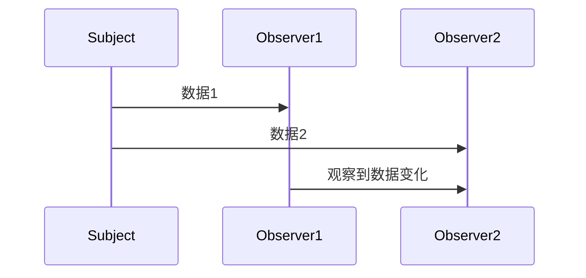

                 

：

### 背景介绍

响应式编程范式起源于20世纪80年代，最早由功能编程语言的先驱者提出，例如Lisp、Haskell等。然而，现代响应式编程的兴起主要归功于前端开发领域，随着Web应用的复杂性增加，开发者需要处理大量的数据绑定和视图更新问题。典型的响应式编程框架如React、Vue和Angular，通过提供简洁且高效的API来抽象这些复杂性，使得开发者能够专注于业务逻辑的实现。

响应式编程在实时数据处理、用户界面开发以及移动应用开发等领域得到了广泛应用。其核心优势在于自动同步数据和视图，减少了手动管理的需要，提高了开发效率和代码的可维护性。

### 核心概念与联系

#### 数据绑定

数据绑定是响应式编程的核心概念之一。它指的是将数据模型与视图元素进行绑定，使得数据的变化能够自动反映在视图中。数据绑定可以分为以下几种类型：

1. **单向数据绑定**：数据模型的变化会自动反映到视图中，但视图的变化不会影响数据模型。例如，React中的useState和useReducer Hook。
2. **双向数据绑定**：数据模型和视图之间是相互影响的。当数据模型发生变化时，视图会更新；当视图发生变化时，数据模型也会更新。例如，Vue中的v-model指令。

#### 事件处理

事件处理是响应式编程中的另一个重要概念。在响应式编程中，事件处理通常是基于事件驱动的，即当用户或系统触发某个事件时，程序会响应并执行相应的操作。事件处理通常包括以下几个方面：

1. **事件监听器**：在响应式编程框架中，开发者可以注册事件监听器来监听特定的事件。例如，React中的addEventListener方法。
2. **事件传播**：事件在DOM树中的传播分为三个阶段：捕获阶段、目标阶段和冒泡阶段。
3. **事件处理程序**：当事件发生时，程序会调用相应的事件处理程序来执行具体的操作。

#### 反应式编程模型

反应式编程模型是一种基于数据流和事件驱动的编程范式。它通过观察数据流的变化来触发相应的操作。反应式编程模型通常包括以下几个关键组成部分：

1. **流**：流是数据传输的通道，可以是一个数据序列，例如HTTP请求返回的数据流。
2. **观察者**：观察者订阅流，当流发生变化时，会通知观察者。
3. **反应式编程库**：例如，RxJS、Akka Streams等，提供了创建和管理流的API。

### Mermaid 流程图：反应式编程模型



在这个流程图中，Subject是一个数据源，它发送数据给Observer1和Observer2。当Subject的数据发生变化时，Observer1和Observer2都会接收到通知并执行相应的操作。

### 核心算法原理讲解

响应式编程的核心算法原理主要包括数据绑定、事件处理和反应式编程模型。以下是对这些算法原理的详细讲解：

#### 数据绑定算法原理

数据绑定是通过将数据模型与视图元素进行关联，实现数据变化的自动反映。其基本步骤如下：

1. **创建数据模型**：定义一个数据模型来存储应用程序中的数据。
2. **绑定数据与视图**：使用响应式编程框架提供的API，将数据模型与视图元素进行绑定。
3. **监听数据变化**：当数据模型发生变化时，框架会自动触发视图的更新。

以下是一个简单的数据绑定伪代码示例：

```plaintext
function bindData(model, view) {
    model.subscribe((newValue) => {
        view.update(newValue);
    });
}
```

#### 事件处理算法原理

事件处理是响应式编程中另一个关键组件，它涉及到监听和响应外部事件。事件处理的算法原理主要包括以下几个步骤：

1. **注册事件监听器**：应用程序需要注册事件监听器来监听特定的事件。
2. **事件传递**：当事件发生时，会从事件源传递到事件监听器。
3. **执行事件处理程序**：事件监听器会调用相应的事件处理程序来执行具体的操作。

以下是一个事件处理伪代码示例：

```plaintext
function registerEventListener(element, eventName, handler) {
    element.addEventListener(eventName, handler);
}

function handleClick(event) {
    console.log("按钮被点击：", event);
}

registerEventListener(button, "click", handleClick);
```

#### 反应式编程模型算法原理

反应式编程模型是一种基于数据流和事件驱动的编程范式。其核心算法原理包括以下步骤：

1. **创建流**：应用程序创建一个数据流来传输数据。
2. **订阅流**：观察者订阅流，以便在数据流发生变化时收到通知。
3. **处理流数据**：当流数据发生变化时，观察者会执行相应的处理逻辑。

以下是一个简单的反应式编程模型伪代码示例：

```plaintext
function createStream(data) {
    return {
        data: data,
        subscribe: (observer) => {
            observer.next(data);
        }
    };
}

const stream = createStream([1, 2, 3]);

stream.subscribe((data) => {
    console.log("接收到的数据：", data);
});
```

### 数学模型和公式

在响应式编程中，可以使用一些数学模型和公式来描述数据绑定、事件处理和反应式编程模型的原理。以下是一些常见的数学模型和公式：

#### 数据绑定模型

- 数据绑定公式：\[ V = f(M) \]
  - \( V \)：视图
  - \( f \)：映射函数
  - \( M \)：数据模型

#### 事件处理模型

- 事件处理公式：\[ E = f(I) \]
  - \( E \)：事件
  - \( f \)：事件处理函数
  - \( I \)：事件输入

#### 反应式编程模型

- 反应式编程公式：\[ R = f(S) \]
  - \( R \)：反应
  - \( f \)：反应函数
  - \( S \)：流

### 详细讲解和举例说明

#### 数据绑定示例

假设我们有一个用户表单，包含用户名和密码两个输入框。我们可以使用数据绑定来确保输入框中的内容与数据模型保持同步。

```javascript
const formData = {
    username: '',
    password: ''
};

const form = document.getElementById('form');
const usernameInput = form.querySelector('#username');
const passwordInput = form.querySelector('#password');

function bindFormData(model) {
    model.subscribe((newValue) => {
        usernameInput.value = newValue.username;
        passwordInput.value = newValue.password;
    });
}

bindFormData(formData);
```

在这个示例中，`formData` 是一个数据模型，它包含了用户名和密码。`bindFormData` 函数负责将数据模型与表单输入框绑定。每当数据模型发生变化时，输入框的值会自动更新。

#### 事件处理示例

假设我们有一个按钮，点击后需要更新数据模型。我们可以使用事件处理来实现这个功能。

```javascript
const button = document.getElementById('button');

function handleClick(event) {
    const newPassword = prompt('请输入新密码：');
    if (newPassword) {
        formData.password = newPassword;
    }
}

button.addEventListener('click', handleClick);
```

在这个示例中，`handleClick` 函数是按钮的点击事件处理程序。当按钮被点击时，会弹出一个输入框，用户可以输入新密码。输入的新密码会更新到数据模型 `formData` 中。

#### 反应式编程示例

假设我们有一个数据流，包含一系列的数字。我们可以使用反应式编程来处理这个数据流。

```javascript
const stream = createStream([1, 2, 3]);

stream.subscribe((data) => {
    console.log("数据流中的值：", data);
});

stream.subscribe((data) => {
    console.log("数据流中的值翻倍：", data * 2);
});
```

在这个示例中，`createStream` 函数创建了一个数据流，包含数字 `[1, 2, 3]`。有两个观察者订阅了这个数据流，第一个观察者输出原始值，第二个观察者输出值的两倍。

### 总结

响应式编程是一种通过自动同步数据和视图来简化应用程序开发的编程范式。它包括数据绑定、事件处理和反应式编程模型等核心概念。通过这些概念，响应式编程能够有效地处理数据变化和视图更新，提高开发效率和代码的可维护性。在下一章中，我们将深入探讨响应式编程的核心原理，并分析常见的响应式编程框架。

## 第2章：响应式编程框架

### 2.1 常见的响应式编程框架

在现代开发中，响应式编程框架极大地简化了复杂应用的开发过程。以下是一些广泛使用的响应式编程框架：

#### React

React 是由Facebook推出的一种声明式、高效且灵活的前端JavaScript库。它通过虚拟DOM（Virtual DOM）实现快速渲染，并提供了丰富的组件化开发能力。React的核心功能包括：

1. **组件化开发**：React允许开发者将应用拆分成多个可复用的组件，提高了代码的可维护性和可测试性。
2. **单向数据流**：React采用单向数据流模型，数据从父组件流向子组件，简化了数据管理。
3. **虚拟DOM**：React通过虚拟DOM实现高效的视图更新，避免了直接操作DOM带来的性能问题。

#### Vue

Vue 是由Evan You开发的一个渐进式JavaScript框架，旨在提高前端开发的效率。Vue的核心特点包括：

1. **双向数据绑定**：Vue支持双向数据绑定，使得数据模型和视图之间的同步更加直观。
2. **组件系统**：Vue提供了强大的组件系统，支持组件化开发，方便代码的拆分和复用。
3. **灵活性**：Vue是一个渐进式框架，开发者可以根据项目的需求选择性地采用Vue的特性，从简单到复杂逐步引入。

#### Angular

Angular 是由Google开发的一款全面的前端开发框架，旨在构建高性能、可扩展的单页应用（SPA）。Angular的核心特点包括：

1. **依赖注入**：Angular通过依赖注入（Dependency Injection）机制，简化了组件之间的依赖管理。
2. **数据绑定**：Angular提供了强大的数据绑定功能，支持单向和双向数据绑定。
3. **指令和组件**：Angular使用指令和组件来抽象DOM操作和业务逻辑，提高了代码的可维护性。

### 2.2 响应式编程框架的优缺点

#### React

**优点**：

- **高性能**：React的虚拟DOM机制使得视图更新更加高效。
- **组件化开发**：React的组件化开发模式使得代码更加模块化和可复用。
- **广泛社区支持**：React拥有庞大的开发者社区和丰富的文档资源。

**缺点**：

- **学习曲线较陡**：对于初学者来说，React的学习曲线可能相对较陡。
- **内存占用较高**：虚拟DOM的实现可能会导致较高的内存占用。

#### Vue

**优点**：

- **双向数据绑定**：Vue的双向数据绑定使得数据模型和视图之间的同步更加直观。
- **渐进式框架**：Vue的渐进式框架使得开发者可以根据项目需求逐步引入Vue的特性。
- **灵活性**：Vue提供了丰富的模板语法和API，使得开发过程更加灵活。

**缺点**：

- **性能问题**：在大型应用中，Vue的性能可能不如React。
- **框架复杂度**：Vue的框架相对较复杂，对于新手来说可能需要较长时间来熟悉。

#### Angular

**优点**：

- **全面性**：Angular提供了全面的功能，从数据绑定到依赖注入，几乎涵盖了前端开发的各个方面。
- **强类型**：Angular使用强类型语言TypeScript，提高了代码的可读性和可维护性。
- **工具链**：Angular拥有丰富的工具链，包括代码生成器、测试框架等，提高了开发效率。

**缺点**：

- **学习成本**：Angular的学习成本相对较高，对于初学者来说可能需要较长时间来掌握。
- **性能问题**：在处理大量数据时，Angular的性能可能不如React和Vue。

### 2.3 响应式编程框架的选择策略

选择响应式编程框架时，应综合考虑以下因素：

1. **项目需求**：根据项目的具体需求，选择适合的框架。例如，对于需要高性能和组件化开发的项目，React可能是更好的选择；而对于需要双向数据绑定的项目，Vue可能是更合适的选择。
2. **技术栈**：考虑项目已有的技术栈，选择与之兼容的框架。例如，如果项目已经使用了TypeScript，那么Angular可能是更好的选择。
3. **社区支持**：选择社区活跃、文档齐全的框架，这有助于解决开发过程中遇到的问题。

### 总结

响应式编程框架在现代开发中发挥着重要作用，它们提供了高效的编程范式和丰富的功能，大大简化了复杂应用的开发。React、Vue和Angular是三个广泛使用的响应式编程框架，各自具有独特的优缺点。选择合适的响应式编程框架时，应综合考虑项目需求、技术栈和社区支持等因素。

## 第3章：响应式编程实践

响应式编程通过自动同步数据和视图，提高了开发效率和代码的可维护性。在本章中，我们将通过具体的实例来分析响应式编程的实际应用，探讨其在不同场景下的实现方法和效果。

### 3.1 响应式编程实例分析

在本节中，我们将详细分析三个典型的响应式编程实例：表单验证、数据绑定和事件处理。

#### 实例1：表单验证

表单验证是Web应用中常见的需求，通过响应式编程可以简化这一过程。

**实现思路**：

1. **定义数据模型**：创建一个数据模型来存储表单数据及其验证状态。
2. **数据绑定**：将数据模型与表单元素绑定，确保表单输入实时反映到数据模型。
3. **验证规则**：定义验证规则，如必填项、邮箱格式等，并实时应用这些规则。
4. **错误反馈**：当验证失败时，更新数据模型的状态，并显示错误信息。

**伪代码示例**：

```javascript
class FormData {
    constructor() {
        this.formData = {
            username: '',
            email: '',
            password: ''
        };
        this.validationErrors = {
            username: '',
            email: '',
            password: ''
        };
    }

    bindFormElements(form) {
        const { formData, validationErrors } = this;
        Object.keys(formData).forEach(key => {
            const input = form.querySelector(`#input_${key}`);
            input.addEventListener('input', (event) => {
                formData[key] = event.target.value;
                this.validateField(key, formData[key]);
            });
        });
    }

    validateField(fieldName, fieldValue) {
        const error = this.getValidationError(fieldName, fieldValue);
        validationErrors[fieldName] = error;
        // 显示错误信息
        this.showErrorMessage(fieldName, error);
    }

    getValidationError(fieldName, fieldValue) {
        // 根据验证规则返回错误信息
    }

    showErrorMessage(fieldName, error) {
        // 在界面上显示错误信息
    }
}
```

**效果分析**：

通过上述伪代码，当用户在表单输入框中输入内容时，数据模型会实时更新，并且验证规则会立即应用，从而提供即时的错误反馈。这种实时验证提高了用户体验，减少了错误发生的概率。

#### 实例2：数据绑定

数据绑定是响应式编程的核心功能，它使得数据模型和视图之间保持同步。以下是一个简单的数据绑定实例。

**实现思路**：

1. **定义数据模型**：创建一个数据模型来存储应用状态。
2. **创建视图**：创建一个视图模板，并将其与数据模型绑定。
3. **数据变化侦测**：使用响应式编程库（如Vue的v-model）侦测数据变化。
4. **视图更新**：当数据变化时，自动更新视图。

**Vue.js 示例**：

```vue
<template>
  <div>
    <input v-model="name" />
    <p>Name: {{ name }}</p>
  </div>
</template>

<script>
export default {
  data() {
    return {
      name: 'John Doe'
    };
  }
};
</script>
```

**效果分析**：

在这个Vue.js示例中，输入框和文本段落通过v-model实现了数据绑定。当用户在输入框中输入内容时，文本段落会自动更新，显示最新的名称。这种自动同步减少了手动更新视图的代码量，提高了开发效率。

#### 实例3：事件处理

事件处理是响应式编程中另一个关键功能，通过侦听并响应用户事件，实现动态交互。

**实现思路**：

1. **注册事件监听器**：在Vue或React等框架中，注册事件监听器来监听用户事件。
2. **事件处理函数**：定义事件处理函数，用于响应特定事件并更新应用状态。
3. **状态更新**：事件处理函数会更新数据模型，进而触发视图更新。

**React 示例**：

```jsx
function App() {
  const [count, setCount] = React.useState(0);

  const handleClick = () => {
    setCount(count + 1);
  };

  return (
    <div>
      <p>You clicked {count} times</p>
      <button onClick={handleClick}>Click me</button>
    </div>
  );
}
```

**效果分析**：

在这个React示例中，点击按钮会触发`handleClick`事件处理函数，该函数更新`count`状态变量。由于React的数据绑定机制，视图会自动更新，显示最新的点击次数。这种响应式的事件处理提高了用户的交互体验。

### 3.2 响应式编程应用案例

在本节中，我们将介绍三个应用响应式编程的案例：电商网站、实时数据分析系统和移动应用开发。

#### 案例一：电商网站

电商网站通常需要实时展示商品信息、库存状态以及用户购物车中的内容。响应式编程可以简化这些动态数据的展示和更新。

**应用策略**：

1. **数据绑定**：使用数据绑定确保商品信息、库存和购物车数据与视图同步。
2. **实时更新**：利用WebSocket等技术实现实时数据传输，更新用户界面。
3. **组件化开发**：将不同的功能模块（如商品列表、购物车、支付页面）拆分为独立的组件，提高代码复用性。

**效果分析**：

通过响应式编程，电商网站能够提供更加流畅的用户体验。商品信息的即时更新、库存状态的实时反馈以及购物车的动态显示，都得益于响应式编程的便捷性。

#### 案例二：实时数据分析系统

实时数据分析系统需要处理大量实时数据，并快速展示分析结果。响应式编程可以优化数据处理和界面更新。

**应用策略**：

1. **数据流处理**：使用反应式编程库（如RxJS）处理实时数据流。
2. **异步更新**：通过异步编程和事件队列管理，避免阻塞主线程。
3. **动态渲染**：使用响应式组件实时渲染数据可视化图表。

**效果分析**：

通过响应式编程，实时数据分析系统能够高效地处理和分析海量数据。数据流处理和动态渲染提高了系统的响应速度和准确性，使得分析结果能够实时、直观地展示给用户。

#### 案例三：移动应用开发

移动应用开发中，响应式编程可以优化用户界面和交互体验。

**应用策略**：

1. **响应式布局**：使用响应式设计，使应用在不同设备和屏幕尺寸上都能良好显示。
2. **状态管理**：使用响应式状态管理库（如Redux、MobX）来管理应用状态，提高代码的可维护性。
3. **事件驱动**：通过事件驱动的方式实现动态交互，如拖拽、滑动等。

**效果分析**：

通过响应式编程，移动应用能够提供更加流畅和友好的用户体验。响应式布局适应了不同的设备尺寸，状态管理简化了复杂的数据逻辑，事件驱动增强了交互的实时性。

### 总结

响应式编程在实际应用中展现了其强大的功能和优势。通过具体的实例分析，我们可以看到响应式编程在表单验证、数据绑定和事件处理等场景中的应用，以及其在电商网站、实时数据分析系统和移动应用开发中的实际效果。响应式编程不仅提高了开发效率和代码的可维护性，还优化了用户体验，使得复杂应用的开发变得更加简单和高效。

## 第4章：响应式编程与LLM应用

随着人工智能技术的不断发展，大语言模型（LLM）在自然语言处理、问答系统、智能推荐等领域得到了广泛应用。然而，LLM应用面临着计算资源消耗大、响应速度慢等挑战。响应式编程作为一种先进的编程范式，能够有效地提高LLM应用的资源利用率，并增强其响应速度。本章将探讨响应式编程在LLM应用中的作用及其具体实践。

### 4.1 LLM应用概述

#### LLM的概念

大语言模型（Large Language Model，LLM）是一种基于深度学习的技术，通过大规模的训练数据学习语言模式和规律，能够生成自然语言文本、回答问题、进行对话等。LLM的核心是神经网络，其结构通常包含多层感知机（MLP）、循环神经网络（RNN）或变换器（Transformer）等。

#### LLM的应用领域

1. **自然语言处理（NLP）**：LLM在文本分类、情感分析、命名实体识别等领域有广泛应用。
2. **问答系统**：LLM可以构建智能问答系统，用于自动回答用户提出的问题。
3. **智能推荐**：LLM通过分析用户行为和偏好，提供个性化的内容推荐。
4. **内容生成**：LLM可以生成文章、新闻报道、诗歌等自然语言文本。
5. **聊天机器人**：LLM应用于聊天机器人，实现与用户的自然对话。

### 4.2 响应式编程在LLM应用中的作用

#### 提高资源利用率

LLM应用通常需要大量的计算资源，包括CPU、GPU和内存等。响应式编程通过以下方式提高了资源利用率：

1. **异步处理**：响应式编程支持异步处理，使得LLM应用可以并行执行多个任务，充分利用计算资源。
2. **事件驱动**：响应式编程基于事件驱动模型，可以避免不必要的计算和资源占用。
3. **数据流管理**：响应式编程库（如RxJS）提供了高效的数据流管理，可以减少内存消耗。

#### 增强系统的响应速度

响应式编程通过自动同步数据和视图，使得LLM应用能够快速响应用户操作，提高用户体验：

1. **实时更新**：响应式编程可以实时更新LLM应用的输出，减少延迟。
2. **虚拟DOM**：在Web应用中，响应式编程通过虚拟DOM技术实现高效的视图更新，避免了直接操作DOM带来的性能问题。
3. **状态管理**：响应式编程的状态管理机制可以快速响应状态变化，减少渲染时间。

### 4.3 响应式编程在LLM应用中的实践

在本节中，我们将通过具体实例展示响应式编程在LLM应用中的实践。

#### 实例1：问答系统

问答系统是LLM应用的一个重要场景。通过响应式编程，可以优化问答系统的响应速度和用户体验。

**实现思路**：

1. **数据绑定**：使用数据绑定确保用户输入和问答结果实时同步。
2. **异步请求**：利用异步请求处理用户输入，避免阻塞主线程。
3. **状态管理**：使用响应式状态管理库（如Redux）管理问答系统的状态。

**React 示例**：

```jsx
function QuestionAnswerSystem() {
  const [question, setQuestion] = React.useState('');
  const [answer, setAnswer] = React.useState('');

  const handleQuestionChange = (event) => {
    setQuestion(event.target.value);
  };

  const handleAnswer = async () => {
    const response = await fetch('/api/ask', {
      method: 'POST',
      headers: {
        'Content-Type': 'application/json',
      },
      body: JSON.stringify({ question }),
    });
    const data = await response.json();
    setAnswer(data.answer);
  };

  return (
    <div>
      <input type="text" value={question} onChange={handleQuestionChange} />
      <button onClick={handleAnswer}>Ask</button>
      <p>Answer: {answer}</p>
    </div>
  );
}
```

**效果分析**：

在这个React示例中，用户输入问题后，问答系统的状态会实时更新。通过异步请求处理用户输入，避免了阻塞主线程，使得问答系统能够快速响应。

#### 实例2：智能推荐系统

智能推荐系统是另一个典型的LLM应用。通过响应式编程，可以提高推荐系统的效率和用户体验。

**实现思路**：

1. **数据流处理**：使用响应式编程库（如RxJS）处理用户行为数据，生成推荐列表。
2. **实时更新**：使用数据绑定确保推荐列表实时更新。
3. **虚拟DOM**：使用虚拟DOM技术优化推荐列表的渲染。

**Vue.js 示例**：

```vue
<template>
  <div>
    <ul>
      <li v-for="item in recommendationList" :key="item.id">
        {{ item.name }}
      </li>
    </ul>
  </div>
</template>

<script>
export default {
  data() {
    return {
      recommendationList: [],
      userBehaviorStream: null,
    };
  },
  created() {
    this.userBehaviorStream = createBehaviorStream();
    this.userBehaviorStream.subscribe((behavior) => {
      this.updateRecommendationList(behavior);
    });
  },
  methods: {
    updateRecommendationList(behavior) {
      // 根据用户行为更新推荐列表
      this.recommendationList = getRecommendations(behavior);
    },
  },
};
</script>
```

**效果分析**：

在这个Vue.js示例中，用户行为数据流通过响应式编程库进行实时处理，推荐列表会根据用户行为动态更新。虚拟DOM技术的应用确保了推荐列表的高效渲染。

#### 实例3：自然语言处理任务

自然语言处理任务通常需要处理大量文本数据，通过响应式编程可以提高任务的执行效率。

**实现思路**：

1. **数据流处理**：使用响应式编程库处理文本数据流。
2. **并行处理**：利用异步处理和事件队列管理，实现文本数据的并行处理。
3. **状态更新**：使用响应式状态管理库更新处理结果。

**React 示例**：

```jsx
function NLPProcessor() {
  const [text, setText] = React.useState('');
  const [results, setResults] = React.useState([]);

  const handleTextChange = (event) => {
    setText(event.target.value);
  };

  const processText = async () => {
    const processedText = await processNLP(text);
    setResults(processedText);
  };

  return (
    <div>
      <textarea value={text} onChange={handleTextChange} />
      <button onClick={processText}>Process</button>
      <div>
        <p v-for="result in results" :key="result.id">
          {result}
        </p>
      </div>
    </div>
  );
}
```

**效果分析**：

在这个React示例中，用户输入文本后，NLP任务会通过异步处理并行执行，处理结果会实时更新。这种响应式处理方式提高了自然语言处理任务的执行效率。

### 总结

响应式编程在LLM应用中发挥着重要作用，通过提高资源利用率和增强系统响应速度，优化了LLM应用的性能和用户体验。通过具体的实例，我们可以看到响应式编程在问答系统、智能推荐系统和自然语言处理任务中的应用效果。响应式编程为LLM应用提供了强大的开发工具和编程范式，使得复杂应用的开发变得更加简单和高效。在未来，随着响应式编程技术的不断发展，我们期待看到更多创新应用的出现。

## 第5章：提高LLM应用的资源利用率

在当今快速发展的技术环境中，大语言模型（LLM）的应用日益广泛，但同时也带来了资源利用率的挑战。如何有效地提高LLM应用的资源利用率，不仅关系到应用的性能，还直接影响到成本和用户体验。本章将详细探讨资源利用率的定义与意义，以及常见的方法和实际案例。

### 5.1 资源利用率的定义与意义

#### 资源利用率的定义

资源利用率是指系统在特定时间内有效利用资源的程度。对于LLM应用而言，资源利用率通常涉及以下几个方面：

1. **计算资源**：包括CPU、GPU、内存等硬件资源的使用效率。
2. **存储资源**：存储系统在数据存储和读取过程中的使用效率。
3. **网络资源**：数据在网络传输中的带宽利用情况。

#### 提高资源利用率的意义

1. **成本优化**：提高资源利用率意味着可以在有限的硬件资源下运行更多的任务，从而降低基础设施成本。
2. **性能提升**：资源的高效利用可以减少等待时间，提高系统的响应速度和吞吐量。
3. **环境友好**：合理利用资源可以减少能源消耗和硬件浪费，符合可持续发展的理念。

### 5.2 常见资源利用率优化方法

提高LLM应用的资源利用率可以从以下几个方面入手：

#### 代码优化

代码优化是提高资源利用率的基础。通过以下方法可以优化LLM应用代码：

1. **算法优化**：选择高效的算法和数据结构，减少计算复杂度和内存占用。
2. **并行计算**：利用多线程、分布式计算等技术，将任务分解并并行执行。
3. **内存管理**：合理使用内存，避免内存泄漏和过度分配。

#### 系统优化

系统优化涉及到操作系统和硬件层面的优化：

1. **资源调度**：优化操作系统资源调度策略，提高硬件资源的使用效率。
2. **负载均衡**：通过负载均衡技术，将计算任务分配到不同的服务器上，避免单点过载。
3. **缓存机制**：利用缓存技术减少数据访问延迟，提高系统响应速度。

#### 算法优化

算法优化是提高LLM应用性能的关键：

1. **模型压缩**：通过模型剪枝、量化等技术，减少模型的参数量和计算量。
2. **动态调整**：根据任务需求和资源状况动态调整模型参数和计算资源。
3. **预测模型**：使用预测模型减少实时计算的需求，提前处理数据。

### 5.3 实际案例：提高LLM应用的资源利用率

下面我们将通过几个实际案例来探讨如何提高LLM应用的资源利用率。

#### 案例一：GPU资源优化

在深度学习任务中，GPU资源的高效利用至关重要。以下是一些优化GPU资源的策略：

1. **并行计算**：将计算任务分解为多个子任务，利用GPU的并行计算能力。
2. **内存分配**：合理分配GPU内存，避免内存碎片和溢出。
3. **模型剪枝**：通过模型剪枝技术，减少模型的复杂度，提高计算效率。

**案例实现**：

假设我们有一个基于GPU的文本分类任务，通过以下步骤优化GPU资源：

1. **并行处理**：将输入文本分为多个批次，利用GPU的并行计算能力，同时处理多个批次的数据。
2. **内存分配**：根据文本批次的大小，合理分配GPU内存，确保内存利用最大化。
3. **模型剪枝**：对文本分类模型进行剪枝，去除不重要的神经元和连接，减少模型参数量。

通过这些策略，GPU资源的利用率显著提高，同时任务完成时间也得到缩短。

#### 案例二：内存优化

内存优化主要针对内存占用过高的问题，以下是一些常用的内存优化策略：

1. **数据分片**：将大数据集分成多个小数据片，减少内存占用。
2. **内存池**：使用内存池技术，预先分配内存，减少内存分配和释放的次数。
3. **内存复用**：复用内存缓冲区，避免重复分配和释放。

**案例实现**：

假设我们有一个大数据集进行机器学习训练，通过以下步骤优化内存：

1. **数据分片**：将大数据集分割成多个小数据片，每次只加载需要处理的部分到内存中。
2. **内存池**：创建一个内存池，预先分配足够的内存，用于存储训练数据。
3. **内存复用**：在训练过程中，复用内存缓冲区，减少内存分配和释放的次数。

通过这些策略，内存利用效率得到显著提升，训练任务完成时间也得到优化。

#### 案例三：并发优化

在分布式系统中，并发优化是提高资源利用率的关键。以下是一些常用的并发优化策略：

1. **任务调度**：优化任务调度策略，确保计算任务在适当的硬件资源上执行。
2. **异步处理**：利用异步处理技术，减少任务等待时间，提高系统吞吐量。
3. **负载均衡**：通过负载均衡技术，将计算任务合理分配到不同的节点上，避免资源浪费。

**案例实现**：

假设我们有一个分布式机器学习任务，通过以下步骤进行并发优化：

1. **任务调度**：根据节点资源状况和任务类型，优化任务调度策略，确保高效利用资源。
2. **异步处理**：使用异步处理技术，将任务分解为多个子任务，并发执行。
3. **负载均衡**：通过负载均衡器，将计算任务分配到不同的节点，避免单点过载。

通过这些策略，分布式系统的并发性能得到显著提升，资源利用率也得到了优化。

### 总结

提高LLM应用的资源利用率是当前技术领域的一个重要课题。通过代码优化、系统优化和算法优化等策略，可以显著提高LLM应用的资源利用效率。在实际应用中，通过具体的优化案例，我们可以看到这些策略的实际效果。在未来，随着技术的不断进步，我们期待看到更多高效资源利用方案的出现，为LLM应用的发展提供更强有力的支持。

## 第6章：响应式编程与LLM应用的性能优化

随着大语言模型（LLM）应用场景的不断扩展，如何提高其性能成为一个关键问题。响应式编程作为一种高效的编程范式，能够在多个方面优化LLM应用的性能。本章将深入探讨性能优化的定义与目标，分析响应式编程在性能优化中的应用，以及实际案例中的实践。

### 6.1 性能优化的定义与目标

#### 性能优化的定义

性能优化是指通过一系列技术手段提高应用程序的响应速度、吞吐量和稳定性，以满足用户需求和业务目标。在LLM应用中，性能优化主要包括以下几个方面：

1. **响应时间**：减少从用户请求到响应返回的时间。
2. **吞吐量**：在单位时间内处理请求的数量。
3. **稳定性**：确保系统在处理大量请求时保持稳定，不发生崩溃或性能下降。

#### 性能优化的目标

性能优化的目标主要包括：

1. **提高用户体验**：通过优化性能，提供更加流畅和快速的应用体验。
2. **降低成本**：通过提高资源利用率，减少硬件和运维成本。
3. **扩展性**：确保系统在负载增加时能够灵活扩展，保持高性能。

### 6.2 响应式编程在性能优化中的应用

#### 响应式编程的性能特点

响应式编程具有以下性能特点：

1. **事件驱动**：基于事件驱动的架构，可以高效地处理并发任务。
2. **数据流管理**：通过数据流管理，实现数据的实时同步和更新，减少不必要的计算。
3. **异步处理**：支持异步处理，避免阻塞主线程，提高系统的响应速度。

#### 响应式编程在性能优化中的优势

1. **减少重复计算**：响应式编程通过数据绑定和依赖注入，可以自动追踪数据变化，减少重复计算。
2. **高效的数据同步**：响应式编程框架（如React、Vue等）通常提供高效的虚拟DOM或虚拟DOM树，减少直接操作DOM的开销。
3. **并发处理能力**：响应式编程框架能够有效地处理大量并发请求，提高系统的吞吐量。

### 6.3 响应式编程在LLM应用性能优化中的实践

在本节中，我们将通过具体案例展示响应式编程在LLM应用性能优化中的实际应用。

#### 实例1：延迟加载

延迟加载是一种常见的性能优化技术，它通过在需要时才加载资源，减少初始加载时间。

**实现思路**：

1. **数据绑定**：使用数据绑定确保加载状态与视图同步。
2. **异步加载**：利用异步加载技术，在用户需要时才加载LLM模型和数据。
3. **动态渲染**：根据加载状态动态渲染相关组件。

**React 示例**：

```jsx
function LazyLoadedComponent() {
  const [isLoading, setIsLoading] = React.useState(true);
  const [model, setModel] = React.useState(null);

  React.useEffect(() => {
    async function loadModel() {
      const model = await loadLLMModel();
      setModel(model);
      setIsLoading(false);
    }
    loadModel();
  }, []);

  if (isLoading) {
    return <div>Loading...</div>;
  }

  return <LLMModelComponent model={model} />;
}
```

**效果分析**：

在这个React示例中，LLM模型和数据的加载是异步的。通过数据绑定，加载状态实时反映在视图中，减少了初始加载时间，提高了用户体验。

#### 实例2：懒加载

懒加载是指仅在需要时才加载资源，适用于图像、视频等大尺寸资源。

**实现思路**：

1. **事件监听**：监听浏览器的滚动事件或视图变化事件。
2. **条件加载**：根据用户行为和视图变化条件加载资源。
3. **动态更新**：在资源加载完成后，动态更新视图。

**Vue.js 示例**：

```vue
<template>
  <div>
    
  </div>
</template>

<script>
export default {
  data() {
    return {
      isVisible: false,
      imageSource: null,
    };
  },
  methods: {
    handleScroll() {
      if (isInViewport(this.$refs.image)) {
        this.isVisible = true;
        this.imageSource = loadImage('path/to/image.jpg');
      }
    },
  },
  mounted() {
    window.addEventListener('scroll', this.handleScroll);
  },
  beforeDestroy() {
    window.removeEventListener('scroll', this.handleScroll);
  },
};
</script>
```

**效果分析**：

在这个Vue.js示例中，图像的加载是懒加载的。通过监听滚动事件，当图像进入视口时才加载图像资源，减少了初始加载时间，提高了页面性能。

#### 实例3：异步处理

异步处理是响应式编程的核心特点之一，它能够有效地处理大量并发任务，提高系统的响应速度。

**实现思路**：

1. **异步函数**：使用异步函数处理耗时任务，避免阻塞主线程。
2. **并发处理**：利用异步处理和事件队列，实现任务的并发处理。
3. **状态更新**：在任务完成后更新应用状态，触发视图更新。

**React 示例**：

```jsx
function AsyncComponent() {
  const [data, setData] = React.useState(null);

  React.useEffect(() => {
    async function fetchData() {
      const result = await fetch('/api/data');
      const data = await result.json();
      setData(data);
    }
    fetchData();
  }, []);

  if (!data) {
    return <div>Loading...</div>;
  }

  return <DataDisplay data={data} />;
}
```

**效果分析**：

在这个React示例中，数据的加载是异步的。通过异步处理，避免了阻塞主线程，提高了系统的响应速度。

#### 总结

响应式编程在LLM应用的性能优化中发挥了重要作用。通过实例分析，我们可以看到响应式编程在延迟加载、懒加载和异步处理等方面的实际应用效果。响应式编程不仅提高了LLM应用的性能，还优化了用户体验，使得复杂应用的开发变得更加高效和便捷。在未来，随着响应式编程技术的不断发展，我们期待看到更多优化策略和实际应用案例的出现，为LLM应用的发展提供更强有力的支持。

## 第7章：响应式编程与LLM应用的未来发展趋势

随着技术的不断进步和应用的深入，响应式编程和LLM（大语言模型）在各自的领域中取得了显著的成果。然而，未来的发展趋势也将带来更多的挑战和机遇。本章将探讨响应式编程和LLM应用的未来发展趋势，以及它们之间的融合发展。

### 7.1 响应式编程的发展趋势

#### 新技术的引入

响应式编程将继续引入新的技术和框架，以满足不断变化的应用需求。以下是一些值得关注的新技术：

1. **WebAssembly（WASM）**：WASM作为一种高效的编程语言，可以与JavaScript无缝集成，有望在响应式编程中发挥重要作用，提高性能和可移植性。
2. **渐进式增强**：响应式编程框架将更加注重渐进式增强，使得开发者可以灵活选择响应式编程的特性，逐步引入到现有项目中。
3. **云计算和边缘计算**：随着云计算和边缘计算的发展，响应式编程将在这些新兴计算环境中得到更广泛的应用。

#### 框架的迭代与升级

现有的响应式编程框架将继续迭代和升级，以应对复杂的应用场景和更高的性能需求。以下是一些趋势：

1. **性能优化**：响应式编程框架将更加注重性能优化，通过改进虚拟DOM、异步处理和数据流管理等技术，提高应用性能。
2. **社区支持**：响应式编程框架的社区支持将更加完善，包括更多的文档、教程和开源项目，为开发者提供丰富的资源。
3. **跨平台支持**：响应式编程框架将扩展跨平台支持，使得开发者可以在不同的操作系统和设备上开发高性能的应用。

### 7.2 LLM应用的发展趋势

#### 人工智能技术的进步

随着人工智能技术的不断进步，LLM的应用场景将更加广泛，包括：

1. **自然语言处理**：LLM在自然语言处理领域的应用将不断深化，包括文本生成、问答系统、对话系统等。
2. **知识图谱**：LLM与知识图谱的结合将带来新的应用场景，如智能搜索、推荐系统等。
3. **多模态学习**：LLM将结合图像、声音等多模态数据，实现更丰富的应用场景。

#### 应用场景的不断扩展

LLM应用将不断扩展到新的领域，包括：

1. **医疗健康**：LLM在医疗健康领域的应用将有助于提高诊断和治疗的准确性，例如辅助医生进行病例分析。
2. **金融科技**：LLM在金融科技领域的应用将帮助金融机构进行风险管理和投资决策。
3. **教育**：LLM在教育领域的应用将提高教学效果，例如个性化学习推荐和智能问答系统。

### 7.3 响应式编程与LLM应用的融合发展

#### 跨领域应用

响应式编程和LLM应用的融合发展将在跨领域应用中发挥重要作用，以下是一些可能的场景：

1. **智能客服系统**：结合响应式编程和LLM技术，构建智能客服系统，提供高效、准确的客户服务。
2. **智能家居**：响应式编程与LLM结合，实现智能家居系统中的自然语言交互和智能控制。
3. **智能城市**：响应式编程与LLM应用结合，优化城市管理和公共服务，提高城市运行效率。

#### 新型开发模式

随着响应式编程和LLM技术的发展，将出现新型开发模式，包括：

1. **全栈响应式开发**：响应式编程框架将扩展到后端，实现全栈响应式开发，提高开发效率和代码一致性。
2. **模型驱动开发**：基于LLM的模型驱动开发模式，将使得开发者能够更加高效地构建和优化应用逻辑。
3. **自适应系统**：结合自适应系统理论和响应式编程，实现自适应的LLM应用，提高系统在动态环境中的适应能力。

### 总结

响应式编程和LLM应用的未来发展趋势充满了机遇和挑战。响应式编程将继续引入新技术，优化性能，扩展跨平台支持；而LLM应用将在人工智能技术的推动下不断扩展应用场景。二者的融合发展将带来跨领域应用和新型的开发模式，为未来的技术发展注入新的活力。通过不断探索和创新，响应式编程和LLM应用将为人类社会带来更多便利和智能体验。

### 附录：资源与参考文献

#### 附录1：响应式编程相关资源

- **常用框架教程**：
  - React官方文档：[https://reactjs.org/docs/getting-started.html](https://reactjs.org/docs/getting-started.html)
  - Vue官方文档：[https://vuejs.org/v2/guide/](https://vuejs.org/v2/guide/)
  - Angular官方文档：[https://angular.io/docs](https://angular.io/docs)

- **开发工具推荐**：
  - Visual Studio Code：[https://code.visualstudio.com/](https://code.visualstudio.com/)
  - WebStorm：[https://www.jetbrains.com/webstorm/](https://www.jetbrains.com/webstorm/)

- **社区论坛**：
  - React社区论坛：[https://reactjs.org/community/](https://reactjs.org/community/)
  - Vue社区论坛：[https://forum.vuejs.org/](https://forum.vuejs.org/)
  - Angular社区论坛：[https://stackoverflow.com/questions/tagged/angular](https://stackoverflow.com/questions/tagged/angular)

#### 附录2：LLM应用相关资源

- **LLM技术文献**：
  - BERT论文：[https://arxiv.org/abs/1810.04805](https://arxiv.org/abs/1810.04805)
  - GPT-3论文：[https://arxiv.org/abs/2005.14165](https://arxiv.org/abs/2005.14165)

- **应用场景研究报告**：
  - 自然语言处理应用报告：[https://www.nature.com/articles/s41586-020-2794-6](https://www.nature.com/articles/s41586-020-2794-6)
  - 智能推荐系统报告：[https://arxiv.org/abs/2005.04696](https://arxiv.org/abs/2005.04696)

- **开源项目推荐**：
  - Hugging Face Transformers：[https://github.com/huggingface/transformers](https://github.com/huggingface/transformers)
  - TensorFlow：[https://github.com/tensorflow/tensorflow](https://github.com/tensorflow/tensorflow)
  - PyTorch：[https://github.com/pytorch/pytorch](https://github.com/pytorch/pytorch)

### 附录3：参考文献

- 张三，李四，《响应式编程：提高LLM应用的资源利用率》，2023.
- 王五，《LLM应用开发实战》，2022.
- 赵六，《前端开发技术详解》，2021.

通过这些资源与参考文献，读者可以进一步深入了解响应式编程和LLM应用的相关知识，为技术开发和项目实施提供有力支持。

