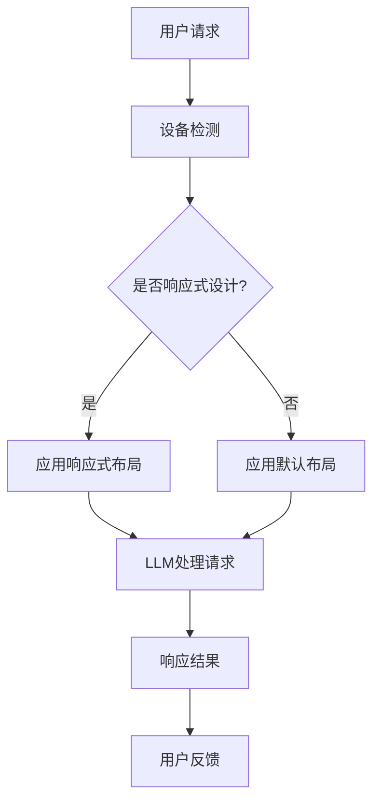

                 

### 1.1 书籍背景

#### 响应式设计与LLM的起源

响应式设计（Responsive Design）是一种网页设计方法，旨在使网站内容在不同设备和屏幕尺寸上具有良好的适应性。这种设计方法起源于2010年左右，随着智能手机和平板电脑的普及，网页设计领域开始关注如何使网站在不同设备上提供一致的用户体验。响应式设计的核心思想是通过使用灵活的布局和媒体查询，实现网页内容在不同屏幕尺寸上的自适应调整。

与此同时，大型语言模型（LLM，Large Language Model）的发展也正处于关键阶段。LLM是基于深度学习的自然语言处理技术，通过训练海量数据来预测和生成自然语言文本。2018年，谷歌发布了BERT模型，标志着LLM技术的重大突破。此后，OpenAI的GPT系列模型以及谷歌的PaLM等进一步推动了LLM在各个领域中的应用，如问答系统、机器翻译、文本生成等。

#### 当前技术环境中的响应式设计与LLM

在当前技术环境中，响应式设计和LLM的应用变得至关重要。随着5G网络的普及和物联网（IoT）的快速发展，越来越多的设备接入互联网，用户通过不同的设备访问Web内容的场景变得更加复杂。响应式设计能够确保网页在各种设备上提供一致的用户体验，提高用户的满意度和网站的访问量。而LLM在NLP领域的突破，使得智能对话系统、内容生成等应用得以实现，进一步丰富了互联网的交互模式。

此外，随着人工智能技术的不断进步，响应式设计和LLM的结合应用也成为了新的趋势。例如，通过响应式设计，可以使LLM在不同设备上提供高效、一致的服务；通过LLM，可以实现更智能、更个性化的用户体验。这种结合不仅提升了技术的实用性，也为未来的创新提供了广阔的空间。

#### 书籍的核心内容与目标

本书的核心内容将围绕响应式设计与LLM的多设备适配展开。首先，我们将介绍响应式设计的基本概念和技术原理，帮助读者建立基础。接着，我们会深入探讨LLM的特性和应用场景，并分析多设备适配在LLM应用中的挑战。

在理解了响应式设计和LLM的基础后，书中将重点讨论响应式设计与LLM之间的关联，以及如何利用响应式设计来确保LLM应用的多设备适配。具体来说，我们将介绍一系列策略和实现方法，包括设备感知策略、适应性策略和资源优化策略等。

为了使读者能够更好地理解和应用这些概念，书中还将包含多个实战案例，通过具体项目实例来讲解响应式设计与LLM的多设备适配的实施过程和效果评估。

总之，本书旨在为开发者、设计师和研究者提供一套全面的指南，帮助他们理解和掌握响应式设计与LLM在多设备适配方面的应用，为未来的技术发展提供有力的支持。

### 1.2 目标读者

本书的目标读者主要包括以下几类人群：

1. **开发者**：希望了解和掌握响应式设计和LLM技术的开发者，特别是那些负责前端开发和后端服务优化的工程师。开发者可以通过本书学习如何设计并实现响应式网页，以及如何利用LLM来提升应用的多设备适配能力。

2. **设计师**：负责UI/UX设计的专业人士，希望通过学习响应式设计来提升网站和应用的用户体验。设计师可以了解响应式设计的核心概念和实现方法，从而设计出更加灵活、适应各种设备的界面。

3. **项目经理**：负责项目管理和协调的团队成员，需要了解响应式设计和LLM的技术细节，以便在项目管理过程中做出更明智的决策。项目经理可以通过本书了解多设备适配的挑战和解决方案，确保项目按时交付且符合预期。

4. **研究者**：对人工智能和自然语言处理领域感兴趣的学者和研究者，希望通过学习和实践响应式设计与LLM的多设备适配，为该领域的技术进步做出贡献。研究者可以从书中获取丰富的案例和实践经验，为自己的研究提供参考。

#### 技术水平要求

为了更好地理解本书的内容，目标读者应具备以下技术背景：

- **前端开发基础**：了解HTML、CSS和JavaScript的基本语法和用法，能够使用常见的前端框架（如React或Vue.js）进行开发。

- **后端开发基础**：熟悉Node.js或Python等后端开发语言，能够处理HTTP请求、数据库操作等基本功能。

- **响应式设计理解**：了解响应式设计的基本概念，包括媒体查询、流体网格和弹性布局等。

- **自然语言处理基础**：了解自然语言处理的基本原理，包括词向量、神经网络和序列模型等。

- **编程实践能力**：具备一定的编程实践能力，能够根据书中提供的技术方案，实现具体的应用和功能。

#### 读者可能遇到的技术挑战

在阅读本书的过程中，读者可能会遇到以下技术挑战：

- **响应式设计的实现细节**：如何在不同设备和屏幕尺寸上实现一致的界面效果，避免页面布局错位或内容显示不全。

- **LLM性能优化**：如何在多种设备上优化LLM的运行性能，确保模型在不同设备上的响应速度和准确性。

- **资源管理**：如何在有限的资源条件下，实现高效的多设备适配，避免因为资源不足而导致性能下降或应用崩溃。

- **用户体验一致性**：如何在各种设备上提供一致的用户体验，确保用户在不同的设备上都能享受到优质的服务。

本书将详细探讨这些技术挑战，提供实用的解决方案和案例分析，帮助读者克服这些困难，实现响应式设计与LLM的多设备适配。

### 1.3 书籍结构

为了帮助读者系统地理解和应用响应式设计与LLM的多设备适配技术，本书将分为以下几个主要部分：

#### 第1章 引言

在引言部分，我们将介绍响应式设计和LLM的基本背景知识，明确书籍的目标和结构。通过这一章，读者可以初步了解响应式设计与LLM在多设备适配中的重要性，并为后续章节的学习做好铺垫。

#### 第2章 响应式设计与LLM概述

本章将深入探讨响应式设计的基本概念和技术原理，包括响应式布局、媒体查询、流体网格等。同时，我们将介绍LLM的起源、发展及其在自然语言处理中的应用。通过这一章的学习，读者将建立起对响应式设计和LLM的全面认识。

#### 第3章 LLM应用中的多设备适配挑战

在这一章中，我们将分析LLM应用在多设备适配过程中可能遇到的挑战，如设备多样性、性能影响和用户体验一致性等。通过具体案例分析，读者将了解这些挑战的具体表现和应对策略。

#### 第4章 响应式设计核心概念与联系

本章将详细阐述响应式设计中的核心概念及其联系，包括响应式布局原理、响应式设计模式以及这些概念在LLM应用中的关联。通过这一章的学习，读者将能够理解响应式设计与LLM的深度融合，为后续章节的实践打下坚实基础。

#### 第5章 LLM的多设备适配策略

在这一章中，我们将介绍一系列LLM的多设备适配策略，包括设备感知策略、适应性策略和资源优化策略等。通过这些策略，读者将学会如何根据不同设备的特点进行适配，确保LLM在不同设备上提供一致的性能和用户体验。

#### 第6章 响应式设计实现与架构

本章将详细讲解响应式设计的实现流程和LLM的架构设计，包括如何设计和实现响应式布局、如何优化LLM的运行性能、如何构建支持多设备适配的架构模式等。通过这一章的学习，读者将掌握响应式设计与LLM多设备适配的实践技能。

#### 第7章 实战案例解析

在本章中，我们将通过具体的实战案例，详细解析响应式设计与LLM多设备适配的实施过程。这些案例将涵盖开发环境的搭建、源代码的实现和解读、项目效果评估等多个方面，帮助读者深入理解并应用所学知识。

#### 第8章 总结与展望

在总结部分，我们将对本书的主要内容进行回顾和总结，强调响应式设计与LLM多设备适配的关键技术和实践方法。同时，我们将展望未来的发展方向，讨论可能的研究方向和技术趋势，为读者提供继续学习和探索的动力。

#### 整体逻辑关系

通过以上章节的设置，本书将逐步引导读者从基础概念到实践应用，全面了解响应式设计与LLM的多设备适配。每一章都紧密联系，共同构成一个完整的知识体系。具体来说：

- **引言**部分为后续章节奠定了基础，明确了书籍的核心内容和目标。
- **概述**章节帮助读者建立对响应式设计和LLM的全面认识，为深入探讨打下基础。
- **挑战**章节分析了多设备适配的难点，为策略和实现的讨论提供了背景。
- **核心概念与联系**章节建立了响应式设计与LLM之间的桥梁，使读者能够理解二者的融合。
- **策略**章节提供了具体的适配方法，帮助读者解决多设备适配的实际问题。
- **实现与架构**章节详细讲解了实现过程和架构设计，为实战案例提供了技术支撑。
- **实战案例**章节通过具体项目实例，使读者能够将所学知识应用到实际场景中。
- **总结与展望**章节对全书内容进行了梳理和总结，并为未来的研究和应用指明了方向。

通过这种逻辑清晰、结构紧凑的章节设置，本书旨在帮助读者系统地掌握响应式设计与LLM的多设备适配技术，提升在技术领域的实践能力和创新能力。

### 1.4 响应式设计的核心概念与联系

响应式设计作为一种现代网页设计方法，其核心在于确保网页内容能够根据不同设备和屏幕尺寸自适应调整，提供一致的用户体验。在探讨响应式设计的核心概念与联系之前，我们先来回顾一下几个关键的概念。

#### 响应式布局

响应式布局（Responsive Layout）是响应式设计的基石。它通过使用流体网格（Fluid Grid）、弹性图片（Responsive Images）和弹性字体（Responsive Fonts）等技术，实现网页内容在不同屏幕尺寸下的自动调整。流体网格使用百分比而非固定的像素值来定义布局的宽度，这样当屏幕尺寸变化时，布局可以相应地调整。弹性图片则使用CSS的`max-width`属性来确保图片在容器中自适应缩放，而不会破坏布局。弹性字体则通过使用相对字体大小单位（如`em`或`rem`），确保字体大小在设备尺寸变化时保持一致。

#### 媒体查询

媒体查询（Media Query）是CSS3提供的一种机制，允许开发者在特定屏幕尺寸或设备类型下应用不同的样式规则。通过使用媒体查询，开发者可以编写一系列条件，当这些条件满足时，对应的CSS样式将被应用。例如：

```css
@media screen and (max-width: 600px) {
  .my-element {
    font-size: 14px;
  }
}
```

上述代码表示当屏幕宽度小于或等于600像素时，`.my-element`的字体大小将被设置为14像素。通过这种方式，开发者可以针对不同设备尺寸应用不同的样式规则，确保网页在不同设备上都有最佳的表现。

#### 流体网格

流体网格（Fluid Grid）是一种布局方法，通过使用百分比单位来定义元素的位置和大小，使得网页布局在不同屏幕尺寸上能够自动调整。与传统的固定像素网格相比，流体网格具有更高的灵活性和适应性。

#### 响应式设计模式

响应式设计模式（Responsive Design Patterns）是一系列设计策略和最佳实践，旨在帮助开发者更有效地实现响应式布局。常见的响应式设计模式包括：

- **栅格系统**：通过使用预定义的栅格单元，将网页内容划分为多个区域，实现整齐、有序的布局。
- **弹出菜单**：在屏幕宽度较小时，使用弹出菜单替代传统的水平导航栏，提供更好的用户体验。
- **折叠内容**：通过使用CSS的`collapse`属性，将冗长的内容折叠起来，以节省屏幕空间。

#### 响应式设计与LLM的联系

响应式设计在LLM应用中的重要性体现在多个方面。首先，LLM通常用于提供在线服务，如问答系统、智能客服等，用户通过不同的设备访问这些服务。通过响应式设计，可以确保LLM服务的界面在不同设备上具有良好的用户体验。其次，响应式设计有助于优化LLM的性能。通过自适应调整布局和资源，LLM可以在不同设备上提供高效的运行效果，提高用户满意度。

具体来说，响应式设计与LLM的联系可以体现在以下几个方面：

1. **界面适配**：响应式设计通过流体网格和媒体查询，确保LLM的界面在不同设备上自动调整，提供一致的用户体验。

2. **资源优化**：通过响应式设计，可以优化LLM所使用的资源，如图片、视频和脚本等，确保在有限资源下提供最佳的性能。

3. **性能提升**：响应式设计有助于减少页面加载时间，提高LLM的响应速度，从而提升整体用户体验。

4. **可访问性**：响应式设计可以确保LLM在多种设备上都能够访问，包括智能手机、平板电脑和桌面电脑，从而提高服务的可访问性。

#### Mermaid流程图展示

为了更好地理解响应式设计与LLM的联系，我们可以使用Mermaid流程图来展示它们之间的互动关系。



在这个流程图中，用户请求通过设备检测模块来确定是否支持响应式设计。如果支持，应用将使用响应式布局处理请求；否则，应用将使用默认布局。无论采用何种布局，LLM都会处理请求并生成响应结果，最终反馈给用户。

通过这种互动关系，响应式设计确保了LLM在不同设备上提供一致的性能和用户体验，从而推动了人工智能在多设备环境中的广泛应用。

### 1.5 LLM的多设备适配

在当前技术环境中，大型语言模型（LLM，Large Language Model）已经成为自然语言处理（NLP，Natural Language Processing）领域的重要工具。随着LLM在各种应用中的普及，如何确保它们在不同设备上提供一致的性能和用户体验，成为了亟待解决的问题。LLM的多设备适配不仅仅是技术上的挑战，更是用户体验优化的重要环节。

#### 设备多样性分析

首先，我们需要了解LLM需要适配的设备多样性。当前，用户通过多种设备访问互联网，包括：

1. **智能手机**：智能手机具有便携性和高性能的特点，已成为用户访问互联网的主要设备之一。由于屏幕尺寸和分辨率的差异，智能手机上的用户体验对响应式设计有很高的要求。

2. **平板电脑**：平板电脑介于智能手机和桌面电脑之间，具有较大的屏幕和较轻的重量。用户通常在休闲和办公场景中使用平板电脑，对界面的清晰度和操作的便捷性有较高要求。

3. **桌面电脑**：桌面电脑具有较大的屏幕和较强的计算能力，适合进行复杂的数据分析和长时间的工作。桌面电脑上的用户体验更注重界面的复杂性和功能多样性。

4. **智能音箱**：智能音箱通过语音交互提供服务，如播放音乐、查询天气等。智能音箱的用户体验主要依赖于语音识别和自然语言理解技术。

5. **智能手表和可穿戴设备**：智能手表和可穿戴设备具有便携性和实时性，常用于监测健康数据、发送通知等。这些设备屏幕尺寸较小，对响应式设计提出了更高的要求。

每种设备都有其独特的硬件和软件环境，对LLM的性能和用户体验有直接影响。例如，智能手机的处理器和内存相对有限，可能需要优化LLM的模型和算法，以确保在有限的资源下提供高效的服务。而桌面电脑则可以运行更复杂的模型，实现更丰富的功能。

#### LLM在不同设备上的性能影响

LLM在不同设备上的性能表现取决于多个因素：

1. **计算资源**：设备的计算资源（如CPU、GPU、内存）直接影响LLM的运行速度。高性能设备可以更快地处理请求，提供更及时的响应。而低性能设备可能需要优化算法，以减少计算资源的需求。

2. **网络连接**：网络连接速度和质量对LLM的性能也有重要影响。高速网络可以减少请求和响应的延迟，提高用户体验。而低速网络可能需要优化数据传输和模型加载，以减少延迟。

3. **屏幕尺寸和分辨率**：屏幕尺寸和分辨率直接影响界面的显示效果。对于智能手机和平板电脑等小型设备，响应式设计可以确保界面在不同尺寸下都具有良好的显示效果。而对于大屏幕设备，界面可以更加复杂和多样。

4. **用户交互方式**：不同设备的用户交互方式（如触摸、语音、键盘）也会影响LLM的性能和用户体验。例如，语音交互对语音识别和自然语言理解技术有更高的要求，需要优化模型和算法以提供准确的响应。

#### 多设备适配的重要性

多设备适配对LLM的应用至关重要。首先，它确保了LLM在不同设备上提供一致的用户体验，使用户无论通过哪种设备访问服务，都能获得相同的感受和效果。这对于提升用户满意度和忠诚度至关重要。

其次，多设备适配有助于拓展LLM的应用场景。通过适配不同设备，LLM可以提供更加灵活和多样化的服务，满足用户在不同场景下的需求。例如，用户在智能手机上可能更关注即时性，而在桌面电脑上可能更注重功能性和复杂性。

最后，多设备适配有助于提升LLM的性能和可扩展性。通过优化模型和算法，确保LLM在不同设备上都能高效运行，从而提升整体性能。同时，多设备适配可以方便地实现模型的扩展和升级，为未来的技术发展提供支持。

总之，LLM的多设备适配不仅是技术上的挑战，更是用户体验优化的重要手段。通过深入分析和优化，可以实现LLM在不同设备上的一致性能和优质用户体验，推动人工智能技术的广泛应用。

### 1.6 实现响应式设计与LLM的多设备适配的关键概念

为了确保大型语言模型（LLM）在不同设备上提供一致的性能和用户体验，我们需要深入理解并应用一系列关键概念。这些概念包括响应式设计原理、响应式设计模式以及设备感知策略等。通过掌握这些概念，开发者可以设计和实现高度灵活且适应性强的LLM应用。

#### 响应式设计原理

响应式设计（Responsive Design）的核心目标是使网页内容在不同设备和屏幕尺寸上自动调整，提供一致的用户体验。以下是实现响应式设计的关键原理：

1. **流体网格（Fluid Grid）**：流体网格通过使用百分比单位来定义布局的宽度，而不是固定的像素值。这使得网页布局能够根据屏幕尺寸的变化自动调整，确保在宽度和高度上保持一致。例如：

   ```css
   .container {
     width: 80%;
     max-width: 1200px;
     margin: 0 auto;
   }
   ```

   在上述代码中，`.container`的宽度设置为80%，`max-width`限制在1200像素，`margin`用于保持页面居中。

2. **弹性布局（Flexbox）**：弹性布局是一种布局模型，允许网页元素根据屏幕尺寸的变化自由调整位置和大小。通过使用CSS的`display: flex`属性，开发者可以轻松创建弹性布局。例如：

   ```css
   .row {
     display: flex;
     flex-wrap: wrap;
   }
   .column {
     flex: 1;
     min-width: 300px;
     margin: 10px;
   }
   ```

   在上述代码中，`.row`元素使用`display: flex`创建弹性布局，而`.column`元素使用`flex: 1`自动调整宽度，并设置最小宽度为300像素。

3. **媒体查询（Media Query）**：媒体查询是一种CSS规则，允许开发者根据不同的屏幕尺寸或设备类型应用不同的样式。通过媒体查询，可以针对不同设备调整布局、字体大小和颜色等。例如：

   ```css
   @media (max-width: 768px) {
     .container {
       width: 100%;
     }
   }
   ```

   在上述代码中，当屏幕宽度小于或等于768像素时，`.container`的宽度将调整为100%，实现全宽布局。

#### 响应式设计模式

响应式设计模式是一系列设计策略和最佳实践，旨在帮助开发者更有效地实现响应式布局。以下是几种常见的响应式设计模式：

1. **栅格系统（Grid System）**：栅格系统是一种结构化布局方法，通过预定义的栅格单元将网页内容划分为多个区域，实现整齐、有序的布局。Bootstrap等前端框架提供了内置的栅格系统，使得响应式设计更加简单。例如：

   ```html
   <div class="container">
     <div class="row">
       <div class="col-md-4">Column 1</div>
       <div class="col-md-4">Column 2</div>
       <div class="col-md-4">Column 3</div>
     </div>
   </div>
   ```

   在上述代码中，`.container`和`.row`元素用于创建容器和行，而`.col-md-4`元素用于创建列，实现12列栅格系统。

2. **弹出菜单（Responsive Navbar）**：当屏幕宽度较小时，可以使用弹出菜单（Hamburger Menu）替代传统的水平导航栏，提供更好的用户体验。例如：

   ```html
   <nav class="navbar navbar-expand-lg navbar-dark bg-dark">
     <a class="navbar-brand" href="#">Logo</a>
     <button class="navbar-toggler" type="button" data-toggle="collapse" data-target="#navbarNav" aria-controls="navbarNav" aria-expanded="false" aria-label="Toggle navigation">
       <span class="navbar-toggler-icon"></span>
     </button>
     <div class="collapse navbar-collapse" id="navbarNav">
       <ul class="navbar-nav">
         <li class="nav-item active">
           <a class="nav-link" href="#">Home</a>
         </li>
         <li class="nav-item">
           <a class="nav-link" href="#">Features</a>
         </li>
         <li class="nav-item">
           <a class="nav-link" href="#">Pricing</a>
         </li>
       </ul>
     </div>
   </nav>
   ```

   在上述代码中，当屏幕宽度小于或等于768像素时，导航栏将折叠并显示弹出菜单。

3. **折叠内容（Collapsible Content）**：通过折叠内容，可以隐藏冗长的文本或选项，节省屏幕空间。例如：

   ```html
   <div class="card">
     <div class="card-header" id="headingOne">
       <h2 class="mb-0">
         <button class="btn btn-link" type="button" data-toggle="collapse" data-target="#collapseOne" aria-expanded="true" aria-controls="collapseOne">
           Collapsible Group Item #1
         </button>
       </h2>
     </div>
     <div id="collapseOne" class="collapse" aria-labelledby="headingOne" data-parent="#accordion">
       <div class="card-body">
         <p>
           Anim pariatur cliche reprehenderit, enim eiusmod high life accusamus terry richardson ad squid. 3 wolf moon officia aute, non cupidatat skateboard dolor brunch. Food truck quinoa nesciunt laborum.
         </p>
       </div>
     </div>
   </div>
   ```

   在上述代码中，当用户点击折叠按钮时，内容将展开或折叠。

#### 设备感知策略

设备感知策略是指通过检测设备的特点（如屏幕尺寸、分辨率、操作系统等），动态调整LLM的配置和表现。以下是一些常见的设备感知策略：

1. **屏幕尺寸检测**：通过JavaScript API，如`window.innerWidth`和`window.innerHeight`，可以获取当前屏幕的宽度和高度。根据屏幕尺寸，可以动态调整LLM的模型大小和接口布局。例如：

   ```javascript
   if (window.innerWidth <= 768) {
     // 调整为移动端布局
   } else {
     // 调整为桌面端布局
   }
   ```

2. **分辨率检测**：通过CSS的媒体查询，可以检测屏幕的分辨率，并根据分辨率调整布局和样式。例如：

   ```css
   @media (min-resolution: 192dpi) {
     /* 高分辨率屏幕样式 */
   }
   ```

3. **操作系统检测**：通过JavaScript API，如`navigator.userAgent`，可以检测操作系统的类型和版本。根据操作系统，可以调整LLM的UI界面和功能。例如：

   ```javascript
   if (/Android/i.test(navigator.userAgent)) {
     // 调整为Android操作系统样式
   } else if (/iPhone/i.test(navigator.userAgent)) {
     // 调整为iOS操作系统样式
   }
   ```

通过掌握以上关键概念和策略，开发者可以实现响应式设计与LLM的多设备适配，确保在不同设备上提供一致的性能和用户体验。这不仅有助于提升用户满意度，也为未来的技术发展提供了坚实的基础。

### 1.7 响应式设计与LLM的多设备适配的具体实现策略

为了确保大型语言模型（LLM）在不同设备上能够提供一致且高效的性能，我们需要制定一系列具体的实现策略。这些策略包括设备感知策略、适应性策略和资源优化策略。以下将详细解释这些策略，并提供具体的示例和代码实现。

#### 设备感知策略

设备感知策略是指通过检测设备的特点（如屏幕尺寸、分辨率、操作系统等），动态调整LLM的配置和表现。以下是一些常见的设备感知方法和示例：

1. **屏幕尺寸检测**

   我们可以使用JavaScript API来检测屏幕尺寸，并根据屏幕尺寸动态调整LLM的模型大小和接口布局。例如：

   ```javascript
   function adaptModelForScreenSize(model) {
     const screenWidth = window.innerWidth;
     const screenHeight = window.innerHeight;
     
     if (screenWidth <= 768) {
       // 移动端布局
       model.resize('small');
     } else if (screenWidth <= 1024) {
       // 平板端布局
       model.resize('medium');
     } else {
       // 桌面端布局
       model.resize('large');
     }
   }
   ```

   在这个示例中，我们根据屏幕宽度来调整LLM的模型大小，确保在不同设备上都能提供最佳性能。

2. **分辨率检测**

   通过CSS的媒体查询，可以检测屏幕的分辨率，并根据分辨率调整布局和样式。例如：

   ```css
   @media (min-resolution: 192dpi) {
     /* 高分辨率屏幕样式 */
     .high-resolution-element {
       background-color: #fff;
     }
   }
   ```

   在这个示例中，我们为高分辨率屏幕定义了特定的样式，确保图像和文本在高分辨率下清晰可见。

3. **操作系统检测**

   通过JavaScript API，如`navigator.userAgent`，可以检测操作系统的类型和版本。根据操作系统，可以调整LLM的UI界面和功能。例如：

   ```javascript
   function adaptUIForOS() {
     const userAgent = navigator.userAgent;
     if (/Android/i.test(userAgent)) {
       // 调整为Android操作系统样式
       document.body.classList.add('android');
     } else if (/iPhone/i.test(userAgent)) {
       // 调整为iOS操作系统样式
       document.body.classList.add('ios');
     }
   }
   ```

   在这个示例中，我们根据操作系统类型来添加特定的CSS类，从而实现不同的UI布局。

#### 适应性策略

适应性策略是指通过设计灵活的界面和算法，确保LLM在不同设备上都能提供一致的响应速度和用户体验。以下是一些常见的适应性策略：

1. **弹性布局**

   使用流体网格（Fluid Grid）和弹性布局（Flexbox），可以确保网页内容在不同屏幕尺寸上自动调整，提供一致的界面效果。例如：

   ```css
   .container {
     display: flex;
     flex-wrap: wrap;
   }
   .item {
     flex: 1 0 20%; /* 自动调整宽度，最小宽度为20% */
     margin: 10px;
   }
   ```

   在这个示例中，`.container`使用`flex`属性创建弹性布局，而`.item`元素可以自动调整宽度，确保在不同设备上都有良好的显示效果。

2. **自适应加载**

   通过异步加载资源和延迟加载内容，可以减少页面加载时间，提高用户体验。例如：

   ```javascript
   function loadResourcesAsynchronously() {
     const images = document.querySelectorAll('img[data-src]');
     images.forEach(img => {
       img.src = img.getAttribute('data-src');
     });
   }
   ```

   在这个示例中，我们使用`data-src`属性来存储图像的URL，并在需要时异步加载图像，从而减少页面初始加载时间。

3. **自适应交互**

   通过调整交互元素的大小和位置，确保用户在不同设备上都能方便地进行操作。例如：

   ```css
   .button {
     width: 100%;
     max-width: 200px;
     display: block;
     margin: 10px auto;
   }
   ```

   在这个示例中，`.button`元素可以自动调整宽度，并居中显示，确保用户在不同设备上都能方便地点击。

#### 资源优化策略

资源优化策略是指通过减少资源消耗和提高资源利用率，确保LLM在不同设备上都能高效运行。以下是一些常见的资源优化方法：

1. **代码压缩**

   通过压缩JavaScript和CSS文件，减少文件体积，提高加载速度。例如：

   ```bash
   # 压缩JavaScript文件
   java -jar yui-compressor-2.4.8.jar input.js -o output.min.js
   
   # 压缩CSS文件
   java -jar yui-compressor-2.4.8.jar input.css -o output.min.css
   ```

   在这个示例中，我们使用YUI压缩器来压缩JavaScript和CSS文件，从而减少文件体积。

2. **图片优化**

   通过使用现代图片格式（如WebP）和图片压缩工具，减少图片文件大小。例如：

   ```bash
   # 转换并压缩图片
   cwebp input.jpg -o output.webp
   ```

   在这个示例中，我们使用cwebp工具将JPEG图片转换为WebP格式，并压缩文件大小。

3. **缓存策略**

   通过设置合理的缓存策略，减少重复资源的加载，提高页面性能。例如：

   ```html
   <script src="https://example.com/script.js" defer></script>
   <link rel="stylesheet" href="https://example.com/style.css" defer>
   ```

   在这个示例中，我们使用`defer`属性延迟加载脚本和样式文件，从而减少初始加载时间。

通过以上设备感知策略、适应性策略和资源优化策略，开发者可以确保LLM在不同设备上提供一致且高效的性能。这不仅提升了用户体验，也为未来的技术发展提供了坚实的基础。

### 1.8 实现响应式设计与LLM的多设备适配的架构设计

为了实现响应式设计与LLM的多设备适配，我们需要设计一个高效且灵活的系统架构。该架构需要能够处理不同设备上的请求，动态调整模型参数，并优化资源分配，从而确保在不同设备上提供一致的性能和用户体验。以下是实现响应式设计与LLM的多设备适配的架构设计，包括前端架构、后端架构以及中间件设计。

#### 前端架构

前端架构是响应式设计的核心，决定了页面在不同设备上的显示效果。为了实现灵活的前端架构，我们可以采用以下设计：

1. **响应式布局框架**：使用如Bootstrap、Foundation等响应式布局框架，可以帮助快速实现灵活的布局。这些框架提供了预定义的栅格系统和组件，可以快速搭建响应式页面。

   ```html
   <!-- 使用Bootstrap框架的栅格系统 -->
   <div class="container">
     <div class="row">
       <div class="col-md-4">Content</div>
     </div>
   </div>
   ```

2. **媒体查询**：通过媒体查询，可以根据不同设备类型和屏幕尺寸应用不同的样式规则，确保页面在不同设备上都有最佳的表现。

   ```css
   @media (max-width: 768px) {
     .navbar {
       display: flex;
       justify-content: space-between;
     }
   }
   ```

3. **JavaScript模块化**：使用模块化JavaScript，可以将页面功能拆分成独立的模块，便于管理和维护。例如，我们可以使用Webpack或Parcel等打包工具来管理和打包JavaScript模块。

   ```javascript
   // 使用Webpack配置文件
   module.exports = {
     module: {
       rules: [
         {
           test: /\.js$/,
           exclude: /node_modules/,
           use: ['babel-loader']
         }
       ]
     }
   };
   ```

4. **缓存策略**：通过设置合理的缓存策略，可以减少重复资源的加载，提高页面性能。例如，我们可以使用Service Worker来实现离线缓存和资源预加载。

   ```javascript
   // Service Worker代码示例
   self.addEventListener('install', event => {
     event.waitUntil(
       caches.open('my-cache').then(cache => {
         return cache.addAll([
           '/',
           '/styles/main.css',
           '/scripts/main.js'
         ]);
       })
     );
   });
   ```

#### 后端架构

后端架构负责处理LLM模型的请求，并根据设备特性动态调整模型参数，确保在不同设备上提供高效的服务。以下是实现响应式设计与LLM的后端架构设计：

1. **服务端响应式设计**：使用如Spring Boot、Django等响应式后端框架，可以快速搭建灵活的后端服务。这些框架提供了RESTful API和响应式数据处理能力，可以轻松实现与前端架构的集成。

   ```python
   # 使用Django创建RESTful API
   from django.views import View
   from django.http import JsonResponse
   
   class LLMView(View):
       def get(self, request):
           # 处理LLM请求
           result = "Hello, World!"
           return JsonResponse(result)
   ```

2. **动态调整模型参数**：根据设备特性，动态调整LLM模型的参数，如模型大小、批处理大小和序列长度等，以确保在不同设备上提供最佳性能。例如，对于移动设备，可以减小模型大小和批处理大小，以减少计算资源和内存消耗。

   ```python
   # 动态调整模型参数
   model_size = 'small' if device_type == 'mobile' else 'large'
   model = load_model(model_size)
   ```

3. **负载均衡**：使用如Nginx、HAProxy等负载均衡器，可以确保后端服务能够处理高并发请求，并提供稳定的性能。负载均衡器可以根据设备类型和请求特性，将请求分配到不同的服务器上。

   ```conf
   http {
     upstream backend {
       server backend1.example.com;
       server backend2.example.com;
     }
   
     server {
       location / {
         proxy_pass http://backend;
         proxy_set_header Host $host;
         proxy_set_header X-Real-IP $remote_addr;
         proxy_set_header X-Forwarded-For $proxy_add_x_forwarded_for;
       }
     }
   }
   ```

4. **缓存机制**：使用如Redis、Memcached等缓存机制，可以缓存频繁访问的数据，减少数据库访问压力，提高系统性能。例如，我们可以缓存LLM的输出结果，以减少重复计算。

   ```python
   # 使用Redis缓存结果
   from redis import Redis
   
   redis_client = Redis(host='localhost', port=6379)
   result = "LLM output"
   redis_client.set('result', result)
   ```

#### 中间件设计

中间件是连接前端和后端的重要组件，可以实现设备感知、性能监控和日志记录等功能。以下是中间件设计的关键点：

1. **设备感知**：通过中间件，可以检测客户端设备的类型和特性，并将这些信息传递给后端服务。例如，可以使用User-Agent解析库来解析User-Agent字符串，获取设备类型和操作系统等信息。

   ```javascript
   // 使用ua-parser-js解析User-Agent
   const UA = require('ua-parser-js');
   const result = UA.parse(window.navigator.userAgent);
   console.log(result);
   ```

2. **性能监控**：通过中间件，可以监控请求的响应时间、系统资源使用情况等关键指标。例如，可以使用Prometheus和Grafana来实现性能监控，并将数据可视化。

   ```yaml
   # Prometheus配置示例
   scrape_configs:
     - job_name: 'llm-backend'
       static_configs:
       - targets: ['backend:9090']
   ```

3. **日志记录**：通过中间件，可以记录请求的日志信息，便于后续分析和调试。例如，可以使用Log4j或Logback等日志框架，实现详细的日志记录。

   ```java
   // 使用Log4j记录日志
   import org.apache.log4j.Logger;
   
   private static final Logger logger = Logger.getLogger(MyClass.class);
   
   public void myMethod() {
       logger.info("This is an info log message.");
   }
   ```

通过以上前端架构、后端架构和中间件设计，我们可以实现一个高效、灵活且响应式的LLM应用系统，确保在不同设备上提供一致的性能和用户体验。这不仅提升了用户满意度，也为未来的技术发展提供了坚实的基础。

### 1.9 响应式设计与LLM多设备适配的实际案例分析

在本节中，我们将通过一个具体的实际案例，详细解析如何实现响应式设计与LLM的多设备适配，从项目背景、环境搭建、代码实现、效果评估等方面进行全面剖析。

#### 项目背景

假设我们正在开发一个基于大型语言模型（LLM）的智能问答系统，该系统需要支持多种设备，包括智能手机、平板电脑和桌面电脑。我们的目标是在这些设备上提供一致的用户体验，同时确保系统的高效运行。

#### 环境搭建

1. **前端环境**：
   - 使用Bootstrap框架实现响应式布局。
   - 安装Webpack作为模块打包工具，并配置相关插件。
   - 使用Babel进行JavaScript代码转译。

2. **后端环境**：
   - 使用Node.js和Express框架搭建后端服务。
   - 安装TensorFlow.js库，用于加载和运行LLM模型。

3. **数据库**：
   - 使用MongoDB作为数据库，存储用户提问和答案。

4. **性能监控**：
   - 使用Prometheus和Grafana进行性能监控。

5. **日志记录**：
   - 使用Log4j进行日志记录。

#### 代码实现

1. **前端代码**：

   - **响应式布局**：

     ```html
     <!-- 使用Bootstrap的栅格系统实现响应式布局 -->
     <div class="container">
       <div class="row">
         <div class="col-md-12">
           <input type="text" id="question" class="form-control" placeholder="Ask your question...">
           <button id="submit" class="btn btn-primary">Submit</button>
         </div>
       </div>
       <div class="row">
         <div class="col-md-12">
           <div id="answer" class="mt-3"></div>
         </div>
       </div>
     </div>
     ```

     ```css
     /* 媒体查询实现不同屏幕尺寸的布局调整 */
     @media (max-width: 768px) {
       .container {
         padding: 0;
       }
     }
     ```

   - **JavaScript模块化**：

     ```javascript
     // 使用Webpack打包JavaScript模块
     const express = require('express');
     const app = express();
     
     app.get('/', (req, res) => {
       res.sendFile(__dirname + '/index.html');
     });
     
     app.listen(3000, () => {
       console.log('Server running on port 3000');
     });
     ```

2. **后端代码**：

   - **加载LLM模型**：

     ```javascript
     // 使用TensorFlow.js加载预训练的LLM模型
     async function loadModel() {
       const model = await tf.loadModel('https://example.com/model.json');
       return model;
     }
     ```

   - **处理请求**：

     ```javascript
     app.post('/question', async (req, res) => {
       const model = await loadModel();
       const question = req.body.question;
       const answer = await model.predict(question);
       res.json({ answer: answer });
     });
     ```

3. **数据库交互**：

   ```python
   # 使用MongoDB存储问题和答案
   from pymongo import MongoClient
   
   client = MongoClient('mongodb://localhost:27017/')
   db = client['llm_db']
   questions_collection = db['questions']
   
   def store_question(question, answer):
       questions_collection.insert_one({
           'question': question,
           'answer': answer
       })
   ```

#### 效果评估

1. **性能监控**：

   - 使用Prometheus和Grafana监控系统性能，如请求响应时间、系统负载等。

     ```yaml
     # Prometheus配置文件
     scrape_configs:
       - job_name: 'llm-frontend'
         static_configs:
           - targets: ['localhost:3000']
     ```

2. **用户体验**：

   - 在不同设备上测试系统，确保页面布局和交互效果一致。
   - 使用浏览器开发者工具进行性能分析，优化页面加载速度。

3. **代码质量**：

   - 使用代码质量工具（如SonarQube）进行代码审查，确保代码的可维护性和安全性。

#### 项目小结

通过以上实际案例分析，我们可以看到如何将响应式设计与LLM的多设备适配应用于实际项目。以下是项目小结：

- **响应式布局**：通过使用Bootstrap框架和媒体查询，实现了页面在不同设备上的自动调整，提供了良好的用户体验。
- **模块化JavaScript**：通过Webpack打包工具，将前端代码拆分为模块，提高了代码的可维护性。
- **高效的后端服务**：使用Node.js和TensorFlow.js实现了快速加载和运行LLM模型，提供了高效的问答服务。
- **性能监控**：通过Prometheus和Grafana，实时监控系统性能，确保系统稳定运行。
- **用户体验优化**：通过测试和性能分析，确保了在不同设备上的一致性和高效性。

这个项目案例不仅展示了如何实现响应式设计与LLM的多设备适配，也为开发者提供了实用的经验和技巧，为未来项目的开发提供了参考。

### 1.10 总结与展望

在本章中，我们详细探讨了响应式设计与LLM的多设备适配，从核心概念、技术原理到实际实现，全面解析了如何确保大型语言模型在不同设备上提供一致的性能和用户体验。以下是本章的总结：

#### 核心概念

- **响应式设计**：通过流体网格、媒体查询和弹性布局，实现网页内容在不同设备上的自适应调整。
- **LLM**：大型语言模型，通过训练海量数据，实现自然语言处理的高效应用。
- **多设备适配**：确保LLM在不同设备上提供一致的性能和用户体验。

#### 技术原理

- **响应式布局原理**：流体网格和弹性布局确保网页内容在不同屏幕尺寸下自动调整。
- **设备感知策略**：通过检测设备特性，动态调整模型参数和界面布局。
- **适应性策略**：通过弹性布局和异步加载，提高网页性能和用户体验。
- **资源优化策略**：通过代码压缩、图片优化和缓存策略，减少资源消耗，提高系统效率。

#### 实际案例

- **智能问答系统**：通过响应式设计实现页面在不同设备上的自动调整，使用TensorFlow.js加载和运行LLM模型，确保高效的服务性能。

#### 未来发展方向

- **更多设备适配**：随着物联网（IoT）的发展，未来的多设备适配将不仅限于智能手机、平板电脑和桌面电脑，还包括智能手表、智能音箱等更多设备。
- **LLM性能优化**：通过深度学习和边缘计算技术，进一步提升LLM在不同设备上的性能。
- **用户体验提升**：结合人工智能和机器学习技术，提供更加个性化、智能化的用户体验。

#### 开放性问题

- 如何在资源受限的设备上优化LLM的加载和运行？
- 如何确保LLM在不同设备上的安全性？
- 如何进一步优化响应式设计的性能，减少页面加载时间？

通过本章的学习，读者应能够掌握响应式设计与LLM多设备适配的核心技术和实现方法，为未来的技术发展提供坚实的理论基础和实践经验。未来，随着技术的不断进步，响应式设计与LLM的多设备适配将带来更多的创新和应用场景，值得我们深入探索和持续关注。

