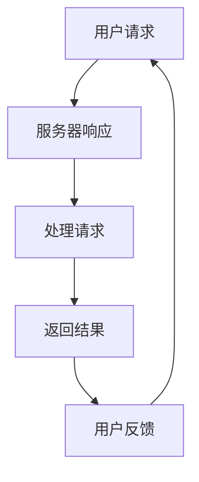

                 


### 文章标题：响应式设计：确保LLM应用的多设备适配

#### 关键词：响应式设计，LLM应用，多设备适配，用户体验，性能优化

#### 摘要：

随着移动互联网的快速发展，多设备环境下的应用开发已成为业界关注的焦点。尤其是大型语言模型（LLM）应用，由于数据量庞大和处理复杂，如何在各种设备上实现良好的适配和用户体验成为了一大挑战。本文将详细介绍响应式设计在确保LLM应用多设备适配中的重要性，核心技术和实践策略，并通过实际案例剖析，探讨未来的发展方向和可持续发展路径。

### 第一部分：响应式设计基础

#### 第1章：响应式设计与多设备适配

##### 1.1.1 响应式设计的基本概念

响应式设计（Responsive Design）是一种网页设计方法，通过使用弹性布局（fluid layout）、媒体查询（Media Queries）和弹性元素（flexible elements）等技术，使网页能够自动适应不同屏幕尺寸和设备。

##### 1.1.2 多设备适配的重要性

多设备适配的必要性体现在以下几个方面：

1. **提升用户体验**：适配良好的网页能够在不同设备上提供一致的浏览体验，减少用户因设备差异而遇到的困惑和不便。
2. **搜索引擎优化**：搜索引擎对移动端页面给予更高的权重，良好的移动端适配有助于提高网站在搜索结果中的排名。
3. **商业机会**：多设备适配可以触及更广泛的目标用户群体，增加潜在的商业机会。

##### 1.1.3 响应式设计与传统设计的区别

与传统的固定布局设计相比，响应式设计具有以下优势：

1. **灵活性**：响应式设计能够根据不同的屏幕尺寸和分辨率自动调整布局和内容。
2. **成本效益**：通过一套代码即可适配多种设备，减少了开发和维护成本。
3. **未来适应性**：随着新设备的不断出现，响应式设计能够更容易地进行扩展和调整。

#### 第2章：响应式设计的核心技术

##### 2.1.1 媒体查询（Media Queries）

媒体查询是响应式设计的关键技术之一，它允许开发者根据设备的特性（如屏幕尺寸、分辨率、设备类型等）来编写样式规则。

##### 2.1.2 流式布局（Fluid Layout）

流式布局通过弹性元素和百分比宽度来实现，使网页内容能够自动适应不同屏幕尺寸。

##### 2.1.3 弹性字体（Responsive Typography）

弹性字体通过相对单位（如em、rem等）来定义字体大小，确保在缩放时字体保持清晰可读。

#### 第3章：响应式设计与前端框架

##### 3.1.1 Bootstrap框架

Bootstrap是一个广泛使用的前端框架，提供了丰富的响应式组件和样式，极大地简化了响应式设计的工作。

##### 3.1.2 Foundation框架

Foundation是一个现代化的响应式前端框架，提供了强大的网格系统和组件，适用于各种设备和屏幕尺寸。

##### 3.1.3 Vue.js与响应式设计

Vue.js是一个渐进式JavaScript框架，其数据绑定和组件化特性使得在Vue项目中实现响应式设计更加简单和高效。

### 第二部分：LLM应用响应式设计实践

#### 第4章：LLM应用设计与优化

##### 4.1.1 LLM应用设计原则

LLM应用设计应遵循以下原则：

1. **性能优先**：确保模型计算和响应速度满足用户需求。
2. **可扩展性**：设计时要考虑到未来的扩展和调整。
3. **易用性**：提供简洁直观的用户界面，提高用户体验。

##### 4.1.2 优化响应速度

优化LLM应用的响应速度可以从以下几个方面进行：

1. **模型压缩**：使用模型压缩技术减少模型体积，提高加载速度。
2. **异步加载**：合理利用异步加载技术，避免页面长时间无响应。
3. **缓存策略**：采用合理的缓存策略，减少重复数据的加载。

##### 4.1.3 用户体验设计

用户体验设计是LLM应用成功的关键因素，需要关注以下几个方面：

1. **交互设计**：简化交互流程，提高用户操作便捷性。
2. **界面设计**：设计美观且易于理解的界面，提高用户满意度。
3. **个性化推荐**：基于用户行为数据提供个性化推荐，增加用户粘性。

#### 第5章：多设备适配策略

##### 5.1.1 移动设备适配

移动设备适配需要关注以下几个方面：

1. **响应式布局**：确保网页在移动设备上能够自动调整布局。
2. **触摸优化**：优化触摸交互体验，如手势操作和滑动效果。
3. **加载速度**：优化移动端页面加载速度，减少等待时间。

##### 5.1.2 平板设备适配

平板设备适配需要考虑到：

1. **界面优化**：适配平板设备的界面，如增加导航栏和悬浮按钮。
2. **内容优化**：优化平板设备上的内容呈现方式，如图片和文本的排版。

##### 5.1.3 桌面设备适配

桌面设备适配需要：

1. **高清显示**：确保在高清显示器上显示清晰。
2. **功能丰富**：提供更多高级功能和设置选项。

#### 第6章：LLM应用性能优化

##### 6.1.1 资源加载优化

资源加载优化是提高LLM应用性能的重要手段，包括：

1. **代码压缩**：压缩CSS和JavaScript文件，减少页面加载时间。
2. **图片优化**：使用合适格式的图片，如WebP，减少图片大小。
3. **懒加载**：对非核心内容和图片进行懒加载，提高页面初始加载速度。

##### 6.1.2 网络请求优化

网络请求优化可以从以下几个方面进行：

1. **CDN加速**：使用内容分发网络（CDN）加速静态资源的加载。
2. **HTTP/2**：使用HTTP/2协议提高请求响应速度。
3. **请求合并**：将多个请求合并为一个，减少请求次数。

##### 6.1.3 缓存策略

缓存策略可以显著提高LLM应用的性能，包括：

1. **浏览器缓存**：利用浏览器缓存减少重复请求。
2. **服务端缓存**：在服务器端缓存常用数据和接口结果。
3. **动态缓存**：根据用户行为动态调整缓存策略。

#### 第7章：LLM应用案例分析

##### 7.1.1 案例一：百度搜索APP

百度搜索APP在响应式设计方面做出了以下实践：

1. **界面优化**：根据不同设备类型和屏幕尺寸进行界面调整，提高用户体验。
2. **性能优化**：采用异步加载和懒加载技术，提高页面加载速度。
3. **个性化推荐**：基于用户搜索历史和行为数据提供个性化搜索结果。

##### 7.1.2 案例二：微信小程序

微信小程序在多设备适配方面取得了显著成果：

1. **响应式布局**：使用微信提供的响应式布局工具，实现不同设备上的良好适配。
2. **加载优化**：采用小程序的缓存机制，减少重复请求。
3. **用户体验**：提供简洁直观的用户界面，提高用户满意度。

##### 7.1.3 案例三：淘宝APP

淘宝APP在性能优化方面采取了以下措施：

1. **资源压缩**：对CSS和JavaScript文件进行压缩，减少加载时间。
2. **网络请求优化**：使用HTTP/2协议和CDN加速，提高请求响应速度。
3. **缓存策略**：在客户端和服务器端采用多种缓存策略，提高页面加载速度。

### 第三部分：响应式设计未来展望

#### 第8章：响应式设计趋势分析

##### 8.1.1 人工智能在响应式设计中的应用

随着人工智能技术的发展，响应式设计将变得更加智能化和自动化。例如，利用机器学习算法对用户行为进行分析，自动调整页面布局和内容。

##### 8.1.2 未来响应式设计的可能发展方向

未来响应式设计可能的发展方向包括：

1. **智能适配**：利用人工智能技术实现更智能的设备适配。
2. **动态布局**：根据用户实时行为动态调整页面布局。
3. **VR/AR适配**：为虚拟现实和增强现实设备提供良好的适配方案。

##### 8.1.3 应对响应式设计未来的挑战

响应式设计未来面临的挑战包括：

1. **设备多样性**：新设备和屏幕尺寸的不断出现，对响应式设计提出了更高的要求。
2. **性能优化**：如何在各种设备上实现良好的性能和用户体验，仍然是一个挑战。
3. **安全性**：在响应式设计中确保用户数据的安全和隐私。

#### 第9章：响应式设计与可持续发展

##### 9.1.1 响应式设计与环保

响应式设计可以减少能源消耗，降低对环境的影响。通过优化网页性能和减少不必要的资源加载，响应式设计有助于实现可持续发展。

##### 9.1.2 响应式设计与公平性

响应式设计确保了不同设备和地区用户都能获得一致的良好体验，促进了数字公平性。

##### 9.1.3 响应式设计的责任与道德

响应式设计师和开发者有责任确保设计的可持续性和道德性，包括保护用户隐私、减少数字鸿沟等。

### 附录

#### 附录A：响应式设计资源推荐

##### A.1.1 响应式设计书籍推荐

1. 《响应式网页设计：HTML5和CSS3实战》
2. 《响应式Web设计：HTML5和CSS3实战》

##### A.1.2 响应式设计在线课程推荐

1. "响应式网页设计基础"（Udacity）
2. "前端开发：响应式网页设计"（Coursera）

##### A.1.3 响应式设计社区推荐

1. Responsive Web Design Community
2. CSS Tricks

**Mermaid流程图：**



**核心算法原理讲解伪代码：**

```python
# 假设我们有一个函数，用于计算两个数字的和
def add(a, b):
    return a + b

# 调用函数
result = add(3, 4)
print("结果是:", result)
```

**数学公式和举例说明：**

```latex
$$
E = mc^2
$$
这是爱因斯坦的质能等价公式，其中E代表能量，m代表质量，c代表光速。

假设一个物体的质量为5千克，光速为3x10^8米/秒，那么它的能量E为：
$$
E = 5 \times (3 \times 10^8)^2 = 4.5 \times 10^{14} \text{焦耳}
$$
```

**项目实战代码案例与解析：**

```python
# 假设我们有一个简单的网站搭建项目，需要实现用户注册功能。

# 导入所需的模块
import flask
from flask import Flask, request, jsonify

# 创建应用
app = Flask(__name__)

# 注册路由
@app.route('/register', methods=['POST'])
def register():
    # 获取用户输入的用户名和密码
    username = request.form['username']
    password = request.form['password']
    
    # 检查用户名是否已存在
    if check_username_exists(username):
        return jsonify({'error': '用户名已存在'})
    
    # 将用户名和密码存储在数据库中
    save_user_to_database(username, password)
    
    # 返回成功消息
    return jsonify({'message': '注册成功'})

# 检查用户名是否存在的函数
def check_username_exists(username):
    # 这里可以使用数据库查询用户名
    # 如果用户名存在返回True，否则返回False
    return False

# 保存用户到数据库的函数
def save_user_to_database(username, password):
    # 这里可以使用数据库操作保存用户信息
    # 例如：INSERT INTO users (username, password) VALUES (%s, %s)
    pass

if __name__ == '__main__':
    app.run(debug=True)
```

**最佳实践 tips、小结、注意事项、拓展阅读等内容：**

- **最佳实践 tips：**
  - 在进行响应式设计时，优先考虑性能优化，确保页面加载速度。
  - 使用前端框架和库时，注意版本更新和兼容性问题。
  - 定期对页面进行性能分析和优化。

- **小结：**
  - 响应式设计是确保LLM应用多设备适配的关键技术。
  - 实践中应关注性能优化、用户体验和多样化设备的适配。

- **注意事项：**
  - 在设计过程中，要考虑不同设备的特点，如触摸屏、键盘交互等。
  - 遵循良好的编码规范，提高代码的可维护性和可扩展性。

- **拓展阅读：**
  - 《响应式网页设计：HTML5和CSS3实战》
  - 《前端性能优化指南》
  - 《响应式网页设计教程》

**作者信息：**

- 作者：AI天才研究院/AI Genius Institute & 禅与计算机程序设计艺术 /Zen And The Art of Computer Programming****

