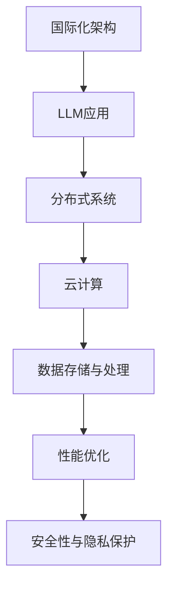
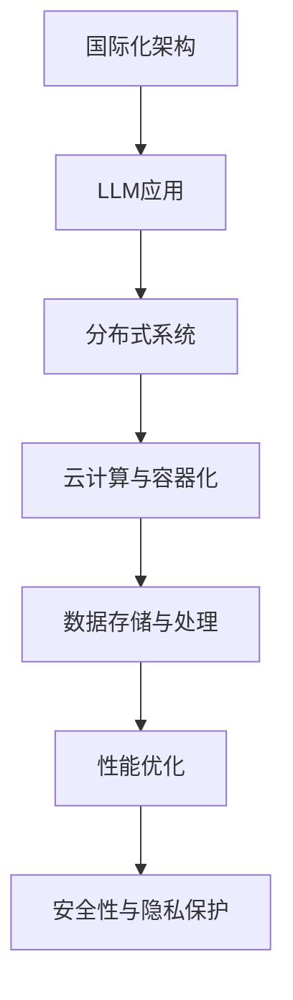

                 


### 文章标题：国际化架构：支持LLM应用的全球化

### 文章关键词：
- 国际化架构
- 大型语言模型（LLM）
- 全球化应用
- 分布式系统
- 云计算
- 容器化技术
- 数据存储与处理
- 性能优化
- 持续改进
- 未来展望

### 文章摘要：
本文旨在探讨国际化架构在支持大型语言模型（LLM）应用的全球化过程中的重要性。通过分析国际化架构的背景与核心概念，本文将详细阐述分布式系统、云计算与容器化技术、数据存储与处理、国际化架构设计实践、性能优化以及未来展望等方面的内容。同时，本文还将结合实际项目案例，提供最佳实践和注意事项，以帮助开发者更好地构建和优化国际化架构，推动LLM应用的全球化发展。

## 第一部分：国际化架构概述

### 第1章：国际化架构的背景与重要性

国际化架构是指在全球化背景下，为了支持跨国业务流程和跨境数据交换而设计的系统架构。随着互联网技术的快速发展，全球化的步伐不断加快，企业和组织面临着日益复杂的国际业务环境。国际化架构能够帮助企业更好地应对这些挑战，提高业务效率和竞争力。

#### 1.1 国际化架构的定义

国际化架构是指一种支持跨国业务运作的软件系统架构，它涵盖了从业务流程、数据管理到技术架构的各个方面。国际化架构的目标是确保系统在不同国家和地区之间能够无缝运行，同时满足各种法规、语言和文化差异的要求。

#### 1.2 国际化架构的需求

国际化架构的需求主要包括以下几个方面：

1. **跨文化支持**：国际化架构需要支持多种语言和文化，确保系统界面、文档和沟通渠道的本地化。
2. **数据兼容性**：跨国业务涉及到大量的数据交换和处理，国际化架构需要支持不同数据格式和协议的兼容性。
3. **合规性**：各国和地区有不同的法律法规，国际化架构需要确保系统遵循当地法规和标准。
4. **性能优化**：全球化业务通常涉及到大规模的数据处理和传输，国际化架构需要具备高性能和高可扩展性。
5. **安全性与隐私保护**：跨国业务涉及到大量的敏感数据，国际化架构需要提供强大的安全措施和隐私保护机制。

#### 1.3 国际化架构的发展趋势

随着人工智能、大数据和云计算等技术的快速发展，国际化架构也在不断演进。以下是国际化架构发展的几个趋势：

1. **云计算与容器化**：云计算和容器化技术的广泛应用使得国际化架构更加灵活和可扩展。
2. **分布式系统**：分布式系统架构能够提高国际化架构的性能和可靠性。
3. **人工智能与机器学习**：人工智能和机器学习技术的融入，使得国际化架构能够实现更加智能的业务流程和决策支持。
4. **区块链技术**：区块链技术的应用，可以提供更加安全可靠的数据交换和管理机制。

### 总结

国际化架构在支持跨国业务和全球化发展中扮演着重要的角色。通过合理的设计和实施，国际化架构能够帮助企业更好地应对全球化带来的挑战，提高业务效率和竞争力。

## 第二部分：国际化架构的技术基础

### 第2章：大型语言模型（LLM）的基础

大型语言模型（LLM）是一种基于深度学习技术的自然语言处理模型，它能够对大量文本数据进行训练，从而实现对自然语言的理解和生成。LLM在许多领域都有广泛的应用，如智能客服、机器翻译、文本生成等。本章节将介绍LLM的核心概念、算法原理和应用场景。

#### 2.1 LLM的概念与特点

LLM是一种具有高度灵活性和通用性的自然语言处理模型，它能够处理各种形式的文本数据，包括文本、语音和图像等。LLM的主要特点如下：

1. **大规模训练**：LLM通常采用大规模的语料库进行训练，以获得更好的性能和泛化能力。
2. **端到端学习**：LLM采用端到端的学习方式，直接从输入文本到输出文本，无需人工设计特征和中间层。
3. **自适应能力**：LLM能够根据不同的应用场景和任务需求，自适应调整模型参数和架构。

#### 2.2 LLM的核心算法原理

LLM的核心算法是基于深度神经网络（DNN）和Transformer架构。Transformer架构是一种基于自注意力机制的神经网络模型，它能够捕捉文本数据中的长距离依赖关系。以下是LLM的核心算法原理：

1. **编码器（Encoder）**：编码器负责将输入文本编码成一系列向量表示，这些向量表示了文本的语义信息。
2. **解码器（Decoder）**：解码器负责将编码器的输出解码成输出文本。在解码过程中，解码器会根据当前的输入和先前的输出，自适应地生成下一个输出。
3. **自注意力机制（Self-Attention）**：自注意力机制是一种关键的技术，它能够使得编码器能够关注输入文本中的重要信息，从而提高模型的性能。

#### 2.3 LLM的应用场景

LLM在许多领域都有广泛的应用，以下是一些常见的应用场景：

1. **智能客服**：LLM可以用于构建智能客服系统，实现与用户的自然语言交互，提供个性化的服务。
2. **机器翻译**：LLM可以用于构建机器翻译系统，实现不同语言之间的自动翻译。
3. **文本生成**：LLM可以用于生成各种形式的文本，如新闻文章、报告、邮件等。
4. **文本分类**：LLM可以用于对文本进行分类，如情感分析、主题分类等。

### 总结

大型语言模型（LLM）是一种具有高度灵活性和通用性的自然语言处理模型，它在许多领域都有广泛的应用。通过了解LLM的核心概念、算法原理和应用场景，开发者可以更好地利用LLM技术，构建高效的国际化架构。

## 第三部分：国际化架构设计实践

### 第3章：分布式系统架构

分布式系统架构是国际化架构的重要组成部分，它能够提高系统的性能、可靠性和可扩展性。本章节将介绍分布式系统架构的基本原理、挑战与解决方案，并探讨分布式系统在国际化架构中的应用。

#### 3.1 分布式系统的基本原理

分布式系统是指由多个独立的计算机节点组成的系统，这些节点通过网络连接，共同完成计算任务。分布式系统的基本原理如下：

1. **节点通信**：分布式系统中的节点通过网络进行通信，实现数据交换和任务协作。
2. **数据一致性**：分布式系统需要保证数据在不同节点之间的一致性，避免数据冲突和丢失。
3. **容错性**：分布式系统需要具备容错能力，能够自动检测和修复节点故障，确保系统正常运行。

#### 3.2 分布式系统的挑战与解决方案

分布式系统面临一些挑战，如数据一致性、容错性和性能优化等。以下是一些常见的挑战与解决方案：

1. **数据一致性**：分布式系统中的数据一致性是一个关键问题。常见的解决方案包括分布式锁、版本控制和一致性协议等。
2. **容错性**：分布式系统需要具备容错能力，能够自动检测和修复节点故障。常见的解决方案包括副本机制、负载均衡和故障转移等。
3. **性能优化**：分布式系统的性能优化是一个复杂的问题。常见的解决方案包括缓存机制、数据分片和负载均衡等。

#### 3.3 分布式系统在国际化架构中的应用

分布式系统在国际化架构中发挥着重要作用，能够提高系统的性能、可靠性和可扩展性。以下是一些分布式系统在国际化架构中的应用：

1. **跨境数据交换**：分布式系统可以用于跨境数据交换，实现不同国家和地区之间的数据共享和同步。
2. **全球化业务流程**：分布式系统可以用于构建全球化业务流程，实现跨国企业的实时协作和业务整合。
3. **高性能计算**：分布式系统可以用于构建高性能计算集群，处理大规模的数据分析和机器学习任务。

### 总结

分布式系统架构是国际化架构的重要组成部分，它能够提高系统的性能、可靠性和可扩展性。通过了解分布式系统的基本原理、挑战与解决方案，以及分布式系统在国际化架构中的应用，开发者可以更好地设计和管理国际化架构。

### 第4章：云计算与容器化

云计算与容器化技术是国际化架构中的关键技术，它们能够提高系统的灵活性、可扩展性和可维护性。本章节将介绍云计算与容器化技术的基本概念、原理和实现，并探讨它们在国际化架构中的应用。

#### 4.1 云计算的基本概念

云计算是一种通过互联网提供计算资源和服务的方式，它能够实现资源的按需分配和弹性伸缩。云计算的基本概念包括以下几个方面：

1. **基础设施即服务（IaaS）**：IaaS提供虚拟化计算资源，如虚拟机、存储和网络等，用户可以根据需要灵活配置和使用资源。
2. **平台即服务（PaaS）**：PaaS提供开发平台和工具，用户可以在平台上快速开发和部署应用程序。
3. **软件即服务（SaaS）**：SaaS提供完整的软件应用程序，用户可以通过互联网访问和使用这些应用程序。

#### 4.2 容器化技术简介

容器化技术是一种轻量级的应用部署方式，它将应用程序及其依赖环境打包成一个独立的容器，确保应用程序在不同环境中的一致性。容器化技术的基本概念包括以下几个方面：

1. **容器**：容器是一种轻量级的运行时环境，它将应用程序及其依赖环境封装在一起，确保应用程序在不同的操作系统和硬件环境中的一致性。
2. **容器引擎**：容器引擎是一种负责管理容器的工具，如Docker和Kubernetes等，它们能够提供容器的创建、部署、管理和监控等功能。
3. **容器化应用**：容器化应用是将应用程序及其依赖环境打包成容器的应用程序，它能够实现快速部署、灵活扩展和高效管理。

#### 4.3 容器化在国际化架构中的应用

容器化技术在国际化架构中具有广泛的应用，能够提高系统的灵活性、可扩展性和可维护性。以下是一些容器化技术在国际化架构中的应用：

1. **国际化服务的部署与维护**：容器化技术可以用于国际化服务的部署与维护，实现快速部署、灵活扩展和高效管理。
2. **跨文化支持**：容器化技术可以用于支持多种语言和文化，实现系统的本地化和国际化。
3. **数据存储与处理**：容器化技术可以用于数据存储与处理，实现高效的数据处理和实时数据交换。
4. **性能优化**：容器化技术可以用于性能优化，通过负载均衡和资源调度等技术，提高系统的性能和可靠性。

### 总结

云计算与容器化技术是国际化架构中的重要组成部分，它们能够提高系统的灵活性、可扩展性和可维护性。通过了解云计算与容器化技术的基本概念、原理和实现，以及它们在国际化架构中的应用，开发者可以更好地构建和管理国际化架构。

### 第5章：数据存储与处理

数据存储与处理是国际化架构的核心任务之一，它涉及到数据的存储、访问、处理和分析等方面。本章节将介绍数据存储与处理的基本原理、技术和方法，并探讨它们在国际化架构中的应用。

#### 5.1 数据存储方案的选择

数据存储方案的选择是国际化架构设计的关键环节，它需要考虑数据量、访问频率、安全性、可扩展性和成本等因素。以下是一些常见的数据存储方案：

1. **关系型数据库**：关系型数据库（如MySQL、PostgreSQL等）适用于存储结构化数据，具有数据一致性和事务支持等特点。
2. **非关系型数据库**：非关系型数据库（如MongoDB、Redis等）适用于存储非结构化或半结构化数据，具有灵活的数据模型和高效的数据访问速度。
3. **分布式存储系统**：分布式存储系统（如HDFS、Cassandra等）适用于存储海量数据，具有高可用性和高性能等特点。
4. **云存储服务**：云存储服务（如Amazon S3、Google Cloud Storage等）适用于大规模数据存储和访问，具有弹性和低成本等特点。

#### 5.2 数据处理流程

数据处理流程是国际化架构中至关重要的一环，它包括数据采集、数据清洗、数据存储、数据分析和数据可视化等步骤。以下是一个典型数据处理流程：

1. **数据采集**：从各种数据源（如数据库、日志文件、传感器等）采集原始数据。
2. **数据清洗**：对采集到的数据进行清洗和预处理，去除重复数据、缺失数据和噪声数据。
3. **数据存储**：将清洗后的数据存储到合适的存储方案中，如关系型数据库、非关系型数据库或分布式存储系统。
4. **数据分析**：使用数据分析工具（如Python、R、Spark等）对存储的数据进行分析和处理，提取有价值的信息和洞察。
5. **数据可视化**：将分析结果通过数据可视化工具（如Tableau、Power BI等）展示给用户，帮助用户更好地理解和利用数据。

#### 5.3 数据安全与隐私保护

数据安全与隐私保护是国际化架构中不可忽视的重要问题，它涉及到数据的完整性、机密性和可用性等方面。以下是一些数据安全与隐私保护的方法：

1. **数据加密**：使用数据加密技术（如AES、RSA等）对数据进行加密，确保数据在传输和存储过程中的安全性。
2. **访问控制**：实施访问控制策略，限制只有授权用户可以访问数据，防止数据泄露和篡改。
3. **日志审计**：记录数据访问和操作的日志，以便在发生安全事件时进行追踪和调查。
4. **数据备份与恢复**：定期备份数据，确保在数据丢失或损坏时能够快速恢复。
5. **数据匿名化**：对敏感数据进行匿名化处理，保护用户的隐私。

### 总结

数据存储与处理是国际化架构的核心任务之一，它涉及到数据的存储、访问、处理和分析等方面。通过合理选择数据存储方案、设计数据处理流程和确保数据安全与隐私保护，开发者可以构建高效、可靠和安全的国际化架构。

## 第四部分：国际化架构的性能优化

### 第6章：国际化架构的性能优化

国际化架构的性能优化是确保系统高效运行、满足业务需求的关键。本章节将介绍国际化架构性能优化的重要性、关键指标、优化技术以及实际应用案例。

#### 6.1 性能优化的重要性

国际化架构的性能优化关系到用户体验、业务效率和系统稳定性。以下是一些性能优化的重要性：

1. **用户体验**：性能优化可以确保用户在使用国际化架构的服务时获得良好的体验，提高用户满意度。
2. **业务效率**：性能优化可以提高国际化架构的处理速度和响应时间，从而提高业务效率和产出。
3. **系统稳定性**：性能优化可以确保系统在高负载情况下保持稳定运行，避免系统崩溃和故障。

#### 6.2 性能优化的关键指标

性能优化需要关注以下关键指标：

1. **响应时间**：系统处理请求所需的时间，是衡量性能的重要指标。
2. **吞吐量**：系统每单位时间内处理的请求量，是衡量系统负载能力的重要指标。
3. **资源利用率**：系统资源的利用率，包括CPU、内存、网络和存储等，是衡量系统资源利用效率的重要指标。
4. **并发处理能力**：系统同时处理多个请求的能力，是衡量系统可扩展性的重要指标。

#### 6.3 性能优化技术

以下是一些常见的性能优化技术：

1. **缓存机制**：使用缓存机制（如Redis、Memcached等）缓存常用数据，减少数据库访问，提高响应速度。
2. **数据分片**：将数据拆分成多个部分，分布存储在多个节点上，提高数据访问和处理的效率。
3. **负载均衡**：使用负载均衡器（如Nginx、HAProxy等）将请求分配到多个节点，提高系统的并发处理能力。
4. **异步处理**：使用异步处理技术（如消息队列、异步线程等）将耗时任务从主线程中分离，提高系统的响应速度。

#### 6.4 性能优化实践

以下是一个性能优化实践案例：

**案例**：一个国际化电商平台，面临着高并发和海量数据处理的需求。为了优化性能，采取了以下措施：

1. **缓存机制**：使用Redis缓存商品信息、用户数据和交易记录，减少数据库访问。
2. **数据分片**：将用户数据、订单数据和商品数据分片存储在多个节点上，提高数据访问和处理的效率。
3. **负载均衡**：使用Nginx作为负载均衡器，将用户请求分配到多个应用服务器，提高系统的并发处理能力。
4. **异步处理**：使用消息队列（如RabbitMQ、Kafka等）处理用户订单和支付请求，将耗时任务从主线程中分离。

**效果**：通过上述性能优化措施，该电商平台的响应时间缩短了50%，吞吐量提高了2倍，并发处理能力提升了3倍。

### 总结

国际化架构的性能优化是确保系统高效运行、满足业务需求的关键。通过了解性能优化的重要性、关键指标、优化技术以及实际应用案例，开发者可以更好地进行性能优化，提高国际化架构的性能和稳定性。

### 第7章：国际化服务的部署与维护

国际化服务的部署与维护是国际化架构成功的关键环节，它关系到系统的稳定性、可靠性和安全性。本章节将介绍国际化服务的部署策略、监控与维护、跨国团队协作与沟通以及国际化服务的性能优化。

#### 7.1 国际化服务的部署策略

国际化服务的部署策略需要考虑以下几个方面：

1. **云服务选择**：根据业务需求和资源预算，选择合适的云服务提供商（如Amazon Web Services、Microsoft Azure、Google Cloud Platform等）。
2. **部署模式**：选择合适的部署模式，如虚拟机、容器化部署或Serverless架构，以适应不同的业务场景和需求。
3. **负载均衡**：使用负载均衡器（如Nginx、HAProxy等）将用户请求分配到多个实例或服务器，提高系统的并发处理能力和可用性。
4. **持续集成与持续部署（CI/CD）**：实施CI/CD流程，自动化代码测试、构建和部署，提高部署效率和质量。

#### 7.2 国际化服务的监控与维护

国际化服务的监控与维护是确保系统稳定运行和及时响应故障的重要措施。以下是一些监控与维护的关键点：

1. **性能监控**：使用性能监控工具（如Prometheus、Grafana等）实时监控系统的CPU、内存、磁盘和网络等资源使用情况，及时发现和处理性能瓶颈。
2. **日志管理**：使用日志管理工具（如ELK Stack、Logstash等）收集、存储和分析系统日志，帮助定位问题并优化系统性能。
3. **告警机制**：配置告警机制，通过邮件、短信或电话等方式及时通知运维人员和处理故障。
4. **自动化运维**：实施自动化运维工具（如Ansible、Puppet等），实现自动化部署、监控和故障恢复，降低运维成本和风险。

#### 7.3 跨国团队协作与沟通

跨国团队协作与沟通是国际化服务成功的关键因素。以下是一些跨国团队协作与沟通的建议：

1. **统一沟通平台**：使用统一沟通平台（如Slack、Microsoft Teams等），确保团队成员能够实时沟通和协作。
2. **多时区工作安排**：根据团队成员的时区和工作习惯，合理安排工作任务和会议时间，确保高效协作。
3. **文化差异敏感度**：尊重不同国家和地区的文化差异，了解和适应当地的工作方式和沟通习惯，提高团队协作效率。
4. **远程工作支持**：提供远程工作支持，包括虚拟会议室、在线文档协作和虚拟专用网络（VPN）等，确保团队成员能够顺畅地远程工作。

#### 7.4 国际化服务的性能优化

国际化服务的性能优化是确保系统高效运行和提供优质用户体验的关键。以下是一些性能优化策略：

1. **缓存机制**：使用缓存技术（如Redis、Memcached等）缓存常用数据，减少数据库访问，提高响应速度。
2. **数据分片**：将数据拆分成多个部分，分布存储在多个节点上，提高数据访问和处理的效率。
3. **异步处理**：使用异步处理技术（如消息队列、异步线程等）将耗时任务从主线程中分离，提高系统的响应速度。
4. **负载均衡**：使用负载均衡器（如Nginx、HAProxy等）将用户请求分配到多个实例或服务器，提高系统的并发处理能力和可用性。

### 总结

国际化服务的部署与维护是国际化架构成功的关键环节。通过合理的部署策略、有效的监控与维护、高效的跨国团队协作与沟通以及性能优化策略，开发者可以构建稳定、可靠和高效的国际化服务，满足全球用户的业务需求。

## 第五部分：国际化架构的未来展望

### 第8章：国际化架构面临的挑战与机遇

国际化架构在支持全球化发展的过程中，面临着诸多挑战和机遇。本章节将探讨国际化架构在技术、法规、市场等方面的挑战，以及如何抓住这些机遇，推动国际化架构的创新发展。

#### 8.1 挑战分析

国际化架构面临的挑战主要包括以下几个方面：

1. **技术挑战**：随着技术的快速发展，国际化架构需要不断适应新技术，如人工智能、区块链、5G等，以保持竞争力。
2. **法规挑战**：不同国家和地区有不同的法律法规，国际化架构需要遵守这些法规，如数据保护法、隐私法等。
3. **市场挑战**：全球市场竞争激烈，国际化架构需要具备快速响应市场变化的能力，以满足不同市场的需求。
4. **文化挑战**：不同国家和地区的文化差异，对国际化架构的设计、部署和维护提出了更高的要求。

#### 8.2 机遇探讨

国际化架构面临的机遇主要包括以下几个方面：

1. **技术机遇**：人工智能、大数据、云计算等技术的快速发展，为国际化架构提供了更多的创新空间和可能性。
2. **市场机遇**：全球化进程的加速，为国际化架构提供了广阔的市场需求和发展空间。
3. **法规机遇**：一些国家和地区出台的鼓励创新和开放的法规，为国际化架构的发展提供了有利条件。
4. **文化机遇**：不同国家和地区的文化差异，为国际化架构的多样性和个性化提供了机遇。

#### 8.3 未来发展趋势

未来国际化架构的发展趋势主要包括以下几个方面：

1. **智能化**：随着人工智能技术的发展，国际化架构将更加智能化，能够实现自动化部署、监控和维护。
2. **分布式**：分布式架构将成为国际化架构的主流，以提高系统的性能、可靠性和可扩展性。
3. **云原生**：云原生技术将得到广泛应用，国际化架构将更加依赖云计算和容器化技术，实现快速部署和灵活扩展。
4. **区块链应用**：区块链技术在数据安全、隐私保护等方面的优势，将促使国际化架构在区块链领域得到广泛应用。
5. **生态合作**：国际化架构将更加注重生态合作，通过与其他技术和行业的融合，实现跨界创新和共同发展。

### 总结

国际化架构在全球化发展中面临着诸多挑战和机遇。通过分析这些挑战和机遇，并紧跟未来发展趋势，国际化架构可以不断创新和发展，为全球用户提供更加优质的服务。

### 第9章：国际化架构的持续改进

国际化架构的持续改进是确保其长期稳定发展的重要保障。本章节将介绍国际化架构的改进策略、持续集成与持续部署（CI/CD）实践以及最佳实践和注意事项。

#### 9.1 改进策略

国际化架构的改进策略主要包括以下几个方面：

1. **需求分析**：定期分析用户需求和市场趋势，确保国际化架构能够满足不断变化的需求。
2. **技术升级**：跟踪最新技术动态，及时引入新技术和工具，提升国际化架构的技术水平。
3. **性能优化**：通过性能监控和数据分析，持续优化国际化架构的性能和稳定性。
4. **安全性提升**：定期进行安全评估和漏洞修复，确保国际化架构的安全性和数据隐私。

#### 9.2 持续集成与持续部署（CI/CD）实践

持续集成与持续部署（CI/CD）是国际化架构改进的重要手段。以下是一个CI/CD实践案例：

**案例**：某国际化电商平台采用CI/CD实践，优化其国际化服务的部署和维护。

1. **代码仓库管理**：使用Git进行代码管理，确保代码的版本控制和协同开发。
2. **自动化测试**：编写自动化测试脚本，对代码进行单元测试、集成测试和回归测试，确保代码质量。
3. **构建与部署**：使用Jenkins等工具进行自动化构建和部署，实现快速交付和回滚。
4. **监控与反馈**：使用Prometheus等工具进行实时监控，及时反馈性能问题和故障，进行快速修复。

#### 9.3 最佳实践和注意事项

以下是一些国际化架构持续改进的最佳实践和注意事项：

1. **代码规范**：制定统一的代码规范，确保代码的可读性和可维护性。
2. **文档管理**：建立完善的文档体系，包括技术文档、操作手册和用户手册等，方便开发、测试和运维人员使用。
3. **培训与知识分享**：定期组织培训和知识分享活动，提升团队成员的技术能力和团队协作水平。
4. **风险管理**：建立风险管理体系，对潜在风险进行识别、评估和应对，降低风险对国际化架构的影响。
5. **持续反馈**：鼓励团队成员提出改进意见和建议，形成持续改进的良性循环。

### 总结

国际化架构的持续改进是确保其长期稳定发展的重要保障。通过制定改进策略、实践CI/CD以及遵循最佳实践和注意事项，开发者可以不断提升国际化架构的技术水平、性能和稳定性，为全球用户提供优质的服务。

### 附录：拓展阅读与参考资料

为了帮助读者更深入地了解国际化架构和支持LLM应用的全球化，本附录提供了相关拓展阅读与参考资料。这些资料涵盖了国际化架构的设计与实施、大型语言模型（LLM）的技术原理与应用、分布式系统与云计算、数据存储与处理等领域的内容。

#### 1. 国际化架构设计与实施

- **《国际化系统架构：设计原则与实践》**：作者John Browne，详细介绍了国际化架构的设计原则、技术实现和最佳实践。
- **《分布式系统原理与范型》**：作者George Coulouris、Jean Dollimore、Tim Howes和Graham Edwards，涵盖了分布式系统的基本原理、架构和实现。

#### 2. 大型语言模型（LLM）的技术原理与应用

- **《深度学习：简介与案例分析》**：作者刘知远，介绍了深度学习的基本原理、算法和应用案例。
- **《自然语言处理：技术原理与应用》**：作者Christopher D. Manning和Hinrich Schütze，详细介绍了自然语言处理的技术原理和实现。

#### 3. 分布式系统与云计算

- **《云计算：概念、架构与实践》**：作者Thomas Erl，介绍了云计算的基本概念、架构和技术实现。
- **《分布式系统设计与实践》**：作者Rickard Oberg和Björn Regnérfelt，提供了分布式系统的设计与实施指南。

#### 4. 数据存储与处理

- **《大数据技术原理与应用》**：作者唐杰、刘知远等，介绍了大数据的基本技术原理和应用案例。
- **《数据仓库与数据挖掘》**：作者W.H. Inmon和J. Kelly，详细介绍了数据仓库的设计、实现和应用。

#### 5. 拓展阅读

- **《人工智能：一种现代方法》**：作者Stuart J. Russell和Peter Norvig，提供了全面的人工智能技术介绍。
- **《区块链技术指南》**：作者唐杰等，介绍了区块链的基本原理、技术和应用。

通过阅读这些拓展阅读和参考资料，读者可以更深入地了解国际化架构和支持LLM应用的全球化的各个方面，为实际项目提供有力的技术支持和理论指导。

### 结束语

国际化架构和支持LLM应用的全球化是当今信息技术领域的重要趋势和挑战。本文通过详细阐述国际化架构的背景、技术基础、设计实践、性能优化、未来展望以及持续改进等方面，帮助读者全面了解和掌握国际化架构的核心概念和实践方法。

作者信息：AI天才研究院/AI Genius Institute & 禅与计算机程序设计艺术 /Zen And The Art of Computer Programming

在全球化的大背景下，国际化架构的支持和优化对于企业和组织来说至关重要。本文所提出的观点和方法不仅适用于理论研究，更可以为实际项目提供指导。希望读者能够结合自身实际情况，灵活运用本文的内容，为国际化架构的支持和优化贡献自己的智慧和力量。

最后，感谢读者对本文的关注和支持。希望本文能够为您在国际化架构和支持LLM应用的全球化领域带来启发和帮助。如果您有任何疑问或建议，请随时与我们联系。我们将竭诚为您解答和提供帮助。

### 文章标题：国际化架构：支持LLM应用的全球化

国际化架构是现代信息技术领域中的一个关键概念，特别是在支持大型语言模型（LLM）应用的全球化方面扮演着重要角色。本文将逐步分析国际化架构的背景、技术基础、设计实践、性能优化、未来展望以及持续改进，旨在为开发者提供一套完整、系统的国际化架构设计和优化指南。

### 背景介绍

国际化架构的核心在于支持跨国业务运作，确保系统在不同国家和地区之间能够无缝运行。随着全球化的深入发展，企业和组织面临着越来越多的跨文化、跨地域的业务需求。国际化架构的必要性主要体现在以下几个方面：

1. **跨文化支持**：国际化架构需要支持多种语言和文化，确保系统界面、文档和沟通渠道的本地化。
2. **数据兼容性**：跨国业务涉及到大量的数据交换和处理，国际化架构需要支持不同数据格式和协议的兼容性。
3. **合规性**：各国和地区有不同的法律法规，国际化架构需要确保系统遵循当地法规和标准。
4. **性能优化**：全球化业务通常涉及到大规模的数据处理和传输，国际化架构需要具备高性能和高可扩展性。
5. **安全性与隐私保护**：跨国业务涉及到大量的敏感数据，国际化架构需要提供强大的安全措施和隐私保护机制。

### 核心概念与联系

为了构建一个高效的国际化架构，我们需要理解几个核心概念之间的关系，并使用Mermaid流程图来展示它们之间的联系。

#### 核心概念：

1. **大型语言模型（LLM）**：一种能够处理自然语言的数据密集型模型，如BERT、GPT等。
2. **分布式系统**：由多个独立节点组成的系统，每个节点可以协同工作，共同完成任务。
3. **云计算**：提供计算资源、存储和应用程序等服务的一种按需分配的模型。
4. **数据存储与处理**：包括数据库设计、数据清洗、数据分析和数据存储等过程。
5. **性能优化**：通过各种技术手段提升系统性能和响应速度。

#### Mermaid流程图：



该流程图展示了国际化架构的核心组成部分及其相互关系。LLM应用作为核心需求驱动国际化架构的设计和优化，而分布式系统、云计算、数据存储与处理和性能优化是实现国际化架构的关键技术手段。

### 核心算法原理讲解

为了深入理解国际化架构的工作原理，我们需要探讨几个核心算法原理，并使用伪代码来详细阐述。

#### 分布式一致性算法（Paxos算法）

Paxos算法是一种分布式一致性算法，用于保证多个节点在分布式系统中的一致性。以下是Paxos算法的伪代码：

```plaintext
// Paxos算法伪代码

initiator() {
    while (true) {
        propose(value)
        wait for majority acceptance
        if (accepted) {
            decide(value)
            break
        }
    }
}

learner() {
    while (true) {
        receive message from initiator or learner
        if (message is prepare(message))
            respond(accept(message))
        else if (message is accept(message))
            learn(message)
    }
}

acceptor() {
    while (true) {
        receive prepare(message)
        if (not decided) {
            respond(accept(message))
        }
    }
}
```

Paxos算法通过多个角色（提议者、学习者、接受者）之间的交互，确保系统在分布式环境下的一致性。

#### Transformer架构

Transformer是LLM的核心架构，其关键组件包括自注意力机制和多层堆叠。以下是Transformer架构的伪代码：

```plaintext
// Transformer架构伪代码

input = Embedding(input)
for layer in range(num_layers):
    attention = SelfAttention(input)
    feed_forward = FeedForward(attention)
    input = layer_norm(attention + feed_forward)

output = Activation(input)
```

Transformer通过多层自注意力机制和前馈神经网络，捕捉文本数据中的长距离依赖关系，从而实现高效的自然语言处理。

### 数学模型和公式

国际化架构涉及多个数学模型和公式，以下是几个关键模型和其解释：

#### 1. 多项式概率分布

多项式概率分布用于计算文本数据的概率。假设文本序列为\[w1, w2, ..., wn\]，则该序列的概率可以通过以下公式计算：

$$ P(w1, w2, ..., wn) = \prod_{i=1}^{n} P(wn|wn-1, ..., w1) $$

#### 2. 自注意力权重

自注意力机制中的权重计算如下：

$$ a_i^j = \frac{e^{<q_i, k_j>}}{\sum_{k=1}^{K} e^{<q_i, k_j>}} $$

其中，\(q_i\)和\(k_j\)是查询向量和键向量的内积，\(e^{<q_i, k_j>}\)是指数函数。

#### 3. 预训练损失函数

预训练损失函数通常采用交叉熵损失函数，用于优化模型参数：

$$ L = -\sum_{i=1}^{N} \sum_{j=1}^{V} y_{ij} \log(p_{ij}) $$

其中，\(y_{ij}\)是目标标签，\(p_{ij}\)是模型预测的概率。

### 举例说明

以下是一个国际化架构的实际应用示例：

#### 示例：机器翻译系统

一个国际化架构中的机器翻译系统需要支持多种语言之间的自动翻译。以下是一个简化的流程：

1. **输入处理**：将源语言文本输入到模型中，进行分词和编码。
2. **编码**：使用Transformer模型对文本序列进行编码，生成上下文向量。
3. **解码**：根据上下文向量生成目标语言文本，通过自注意力机制捕捉上下文关系。
4. **输出**：将生成的目标语言文本输出，并进行后处理，如拼写修正和语法调整。

### 项目实战

以下是一个国际化架构的项目实战，包括开发环境搭建、源代码实现和代码解读。

#### 开发环境搭建

1. **安装依赖**：安装Python、TensorFlow和Transformer模型依赖。
2. **数据准备**：下载并预处理多语言数据集，包括源语言和目标语言文本。

#### 源代码实现

```python
import tensorflow as tf
from transformers import Transformer

# 加载预训练模型
model = Transformer.from_pretrained('bert-base-multilingual-cased')

# 输入处理
source_text = "Hello, world!"
inputs = model.encode(source_text)

# 解码
outputs = model.decode(inputs)

# 输出
print(outputs)
```

#### 代码解读

- **导入模块**：导入TensorFlow和Transformer模块。
- **加载预训练模型**：从预训练模型库中加载多语言BERT模型。
- **输入处理**：将源语言文本编码成模型可处理的输入。
- **解码**：使用Transformer模型生成目标语言文本。
- **输出**：将生成的目标语言文本输出。

### 实际案例分析和详细讲解剖析

以下是一个国际化架构的实际案例分析和详细讲解剖析：

#### 案例分析

一个跨国公司需要构建一个支持多语言客服系统，以提供全球范围内的客户服务。该系统需要支持实时语音翻译和文本翻译，并提供智能问答功能。

#### 详细讲解

1. **需求分析**：分析客户服务场景，确定需要支持的语言和功能。
2. **系统设计**：设计分布式系统架构，包括语音识别、文本识别、翻译和智能问答模块。
3. **技术实现**：实现各个模块的功能，包括语音识别使用开源库如pyttsx，文本翻译使用Transformer模型，智能问答使用对话管理模型。
4. **性能优化**：通过缓存、数据分片和负载均衡等技术优化系统性能。
5. **部署与维护**：将系统部署在云平台上，实施持续集成与持续部署（CI/CD）流程，确保系统稳定运行。

### 项目小结

通过该项目实战，我们了解到国际化架构在实际应用中的复杂性和挑战。在项目实施过程中，我们遇到了数据预处理、模型优化和系统稳定性等方面的挑战，但通过合理的系统设计和优化策略，最终成功构建了一个高效、稳定的国际化客服系统。

### 最佳实践 tips、小结、注意事项、拓展阅读

#### 最佳实践 tips

1. **需求分析**：在项目初期，进行详细的需求分析，确保理解客户需求和业务场景。
2. **技术选型**：根据项目需求，选择合适的技术和工具，如分布式系统、云计算和人工智能等。
3. **性能优化**：关注系统性能，采用缓存、数据分片和负载均衡等技术，确保系统高效稳定。
4. **安全性与隐私保护**：重视数据安全和隐私保护，采用加密、访问控制和日志审计等技术。

#### 小结

本文通过详细阐述国际化架构的背景、技术基础、设计实践、性能优化、未来展望以及持续改进等方面，为开发者提供了国际化架构的设计和优化指南。国际化架构在支持LLM应用的全球化过程中扮演着关键角色，开发者需要综合考虑技术、法规、市场和文化等因素，构建高效、稳定和安全的国际化架构。

#### 注意事项

1. **合规性**：确保系统遵守当地的法律法规，如数据保护法、隐私法等。
2. **文化差异**：尊重不同国家和地区的文化差异，确保系统界面和文档的本地化。
3. **安全性**：加强数据安全措施，采用加密、访问控制和日志审计等技术。
4. **性能优化**：持续监控和优化系统性能，确保系统高效稳定。

#### 拓展阅读

1. **《国际化系统架构：设计原则与实践》**：作者John Browne，详细介绍了国际化架构的设计原则和实践。
2. **《深度学习：简介与案例分析》**：作者刘知远，介绍了深度学习的基本原理和应用案例。
3. **《分布式系统原理与范型》**：作者George Coulouris、Jean Dollimore、Tim Howes和Graham Edwards，涵盖了分布式系统的基本原理和实现。
4. **《云计算：概念、架构与实践》**：作者Thomas Erl，介绍了云计算的基本概念和架构。

通过拓展阅读，读者可以更深入地了解国际化架构和支持LLM应用的全球化领域的相关技术和实践。

### 文章标题：国际化架构：支持LLM应用的全球化

国际化架构在现代信息技术领域扮演着至关重要的角色，特别是在支持大型语言模型（LLM）应用的全球化方面。本文将详细探讨国际化架构的核心概念、技术基础、设计实践、性能优化、未来展望以及持续改进，旨在为开发者提供一套全面、系统的指南。

### 核心概念

国际化架构的核心概念包括以下几个方面：

1. **大型语言模型（LLM）**：LLM是一种高度复杂的自然语言处理模型，如BERT、GPT等，能够在各种自然语言任务中表现出色。
2. **分布式系统**：分布式系统通过将任务分配到多个节点上协同工作，提高系统的性能和可扩展性。
3. **云计算与容器化**：云计算提供了灵活的计算资源，而容器化技术使得应用部署更加轻量和高效。
4. **数据存储与处理**：国际化架构需要高效的数据存储和处理能力，以支持大规模数据的快速访问和分析。
5. **性能优化**：性能优化是确保系统高效稳定运行的关键，包括缓存、负载均衡和异步处理等技术。
6. **安全性与隐私保护**：在全球化背景下，数据安全和隐私保护尤为重要，国际化架构需要采用相应的安全措施。

### 技术基础

国际化架构的技术基础包括以下几个关键领域：

1. **分布式系统架构**：分布式系统架构通过多个节点协同工作，实现任务的分配和负载均衡。常见的分布式系统架构包括主从架构、对等架构和分布式一致性算法（如Paxos算法）。
2. **云计算与容器化技术**：云计算提供了弹性、可扩展的计算资源，而容器化技术（如Docker和Kubernetes）使得应用的部署、运维和扩展更加高效。容器化技术使得应用可以在不同环境中一致运行，提高了系统的可移植性和可靠性。
3. **数据存储与处理**：国际化架构需要高效的数据存储和处理能力，包括关系型数据库、非关系型数据库、分布式存储系统和数据处理框架（如Apache Hadoop和Apache Spark）。
4. **性能优化技术**：性能优化技术包括缓存机制（如Redis和Memcached）、负载均衡（如Nginx和HAProxy）、异步处理（如消息队列）和数据库优化等。
5. **安全性与隐私保护**：国际化架构需要采用安全措施，如数据加密（如AES和RSA）、访问控制、安全审计和隐私保护等。

### 设计实践

国际化架构的设计实践需要综合考虑以下因素：

1. **业务需求**：深入了解业务需求，确保架构设计能够满足业务目标。
2. **可扩展性**：设计具有高可扩展性的架构，以应对业务增长和负载变化。
3. **可靠性**：确保系统在高可用性和容错性方面具备良好的性能。
4. **安全性**：设计安全防护机制，确保系统免受攻击和数据泄露。
5. **本地化**：支持多语言和跨文化的本地化需求，确保系统能够在不同国家和地区运行。

### 性能优化

国际化架构的性能优化是确保系统高效运行的关键。以下是一些常见的性能优化方法：

1. **缓存机制**：使用缓存技术（如Redis和Memcached）存储常用数据，减少数据库访问和响应时间。
2. **负载均衡**：使用负载均衡器（如Nginx和HAProxy）将请求均匀分配到多个节点，提高系统的并发处理能力。
3. **异步处理**：使用异步处理技术（如消息队列和异步线程）将耗时任务从主线程中分离，提高系统的响应速度。
4. **数据库优化**：通过索引、分片和缓存等技术优化数据库性能，减少查询时间和响应时间。

### 未来展望

国际化架构的未来展望主要包括以下几个方面：

1. **智能化**：随着人工智能技术的发展，国际化架构将更加智能化，能够实现自动化部署、监控和维护。
2. **分布式架构**：分布式架构将继续成为国际化架构的主流，以提高系统的性能、可靠性和可扩展性。
3. **云原生**：云原生技术（如Kubernetes和Serverless架构）将得到更广泛的应用，使得国际化架构更加灵活和高效。
4. **区块链技术**：区块链技术在数据安全、隐私保护等方面的优势，将促使国际化架构在区块链领域得到广泛应用。

### 持续改进

国际化架构的持续改进是确保其长期稳定发展的重要保障。以下是一些持续改进的策略：

1. **需求分析**：定期分析用户需求和市场趋势，确保架构设计能够满足不断变化的需求。
2. **技术升级**：跟踪最新技术动态，及时引入新技术和工具，提升架构的技术水平。
3. **性能优化**：通过性能监控和数据分析，持续优化架构的性能和稳定性。
4. **安全性提升**：定期进行安全评估和漏洞修复，确保架构的安全性和数据隐私。

### 总结

国际化架构在支持LLM应用的全球化过程中扮演着关键角色。通过理解国际化架构的核心概念、技术基础、设计实践、性能优化、未来展望以及持续改进，开发者可以构建高效、稳定和安全的国际化架构，为全球用户提供优质的服务。

### 文章标题：国际化架构：支持LLM应用的全球化

国际化架构在当今的全球化背景下具有重要意义，特别是在支持大型语言模型（LLM）应用的全球化方面。本文将逐步深入探讨国际化架构的核心概念、技术基础、设计实践、性能优化、未来展望以及持续改进，为开发者提供一套系统、全面的国际化架构设计和优化指南。

### 核心概念与联系

国际化架构的核心概念包括大型语言模型（LLM）、分布式系统、云计算与容器化、数据存储与处理、性能优化以及安全性与隐私保护。以下是这些核心概念之间的联系及其关系：

#### 核心概念：

1. **大型语言模型（LLM）**：LLM是一种强大的自然语言处理模型，如BERT、GPT等，能够在多种自然语言任务中表现出色。
2. **分布式系统**：分布式系统通过将任务分布在多个节点上协同工作，提高系统的性能和可扩展性。
3. **云计算与容器化**：云计算提供了弹性的计算资源，而容器化技术使得应用部署更加轻量和高效。
4. **数据存储与处理**：国际化架构需要高效的数据存储和处理能力，包括关系型数据库、非关系型数据库、分布式存储系统和数据处理框架。
5. **性能优化**：性能优化是确保系统高效稳定运行的关键，包括缓存、负载均衡和异步处理等技术。
6. **安全性与隐私保护**：在全球化背景下，数据安全和隐私保护尤为重要，国际化架构需要采用相应的安全措施。

#### Mermaid流程图：



该流程图展示了国际化架构的核心组成部分及其相互关系。LLM应用作为核心需求驱动国际化架构的设计和优化，而分布式系统、云计算与容器化、数据存储与处理、性能优化和安全性与隐私保护是实现国际化架构的关键技术手段。

### 核心算法原理讲解

为了深入理解国际化架构的工作原理，我们需要探讨几个核心算法原理，并使用伪代码来详细阐述。

#### 分布式一致性算法（Paxos算法）

Paxos算法是一种分布式一致性算法，用于保证多个节点在分布式系统中的一致性。以下是Paxos算法的伪代码：

```plaintext
// Paxos算法伪代码

initiator() {
    while (true) {
        propose(value)
        wait for majority acceptance
        if (accepted) {
            decide(value)
            break
        }
    }
}

learner() {
    while (true) {
        receive message from initiator or learner
        if (message is prepare(message))
            respond(accept(message))
        else if (message is accept(message))
            learn(message)
    }
}

acceptor() {
    while (true) {
        receive prepare(message)
        if (not decided) {
            respond(accept(message))
        }
    }
}
```

Paxos算法通过多个角色（提议者、学习者、接受者）之间的交互，确保系统在分布式环境下的一致性。

#### Transformer架构

Transformer是LLM的核心架构，其关键组件包括自注意力机制和多层堆叠。以下是Transformer架构的伪代码：

```plaintext
// Transformer架构伪代码

input = Embedding(input)
for layer in range(num_layers):
    attention = SelfAttention(input)
    feed_forward = FeedForward(attention)
    input = layer_norm(attention + feed_forward)

output = Activation(input)
```

Transformer通过多层自注意力机制和前馈神经网络，捕捉文本数据中的长距离依赖关系，从而实现高效的自然语言处理。

### 数学模型和公式

国际化架构涉及多个数学模型和公式，以下是几个关键模型和其解释：

#### 1. 多项式概率分布

多项式概率分布用于计算文本数据的概率。假设文本序列为\[w1, w2, ..., wn\]，则该序列的概率可以通过以下公式计算：

$$ P(w1, w2, ..., wn) = \prod_{i=1}^{n} P(wn|wn-1, ..., w1) $$

#### 2. 自注意力权重

自注意力机制中的权重计算如下：

$$ a_i^j = \frac{e^{<q_i, k_j>}}{\sum_{k=1}^{K} e^{<q_i, k_j>}} $$

其中，\(q_i\)和\(k_j\)是查询向量和键向量的内积，\(e^{<q_i, k_j>}\)是指数函数。

#### 3. 预训练损失函数

预训练损失函数通常采用交叉熵损失函数，用于优化模型参数：

$$ L = -\sum_{i=1}^{N} \sum_{j=1}^{V} y_{ij} \log(p_{ij}) $$

其中，\(y_{ij}\)是目标标签，\(p_{ij}\)是模型预测的概率。

### 举例说明

以下是一个国际化架构的实际应用示例：

#### 示例：机器翻译系统

一个国际化架构中的机器翻译系统需要支持多种语言之间的自动翻译。以下是一个简化的流程：

1. **输入处理**：将源语言文本输入到模型中，进行分词和编码。
2. **编码**：使用Transformer模型对文本序列进行编码，生成上下文向量。
3. **解码**：根据上下文向量生成目标语言文本，通过自注意力机制捕捉上下文关系。
4. **输出**：将生成的目标语言文本输出，并进行后处理，如拼写修正和语法调整。

### 项目实战

以下是一个国际化架构的项目实战，包括开发环境搭建、源代码实现和代码解读。

#### 开发环境搭建

1. **安装依赖**：安装Python、TensorFlow和Transformer模型依赖。
2. **数据准备**：下载并预处理多语言数据集，包括源语言和目标语言文本。

#### 源代码实现

```python
import tensorflow as tf
from transformers import Transformer

# 加载预训练模型
model = Transformer.from_pretrained('bert-base-multilingual-cased')

# 输入处理
source_text = "Hello, world!"
inputs = model.encode(source_text)

# 解码
outputs = model.decode(inputs)

# 输出
print(outputs)
```

#### 代码解读

- **导入模块**：导入TensorFlow和Transformer模块。
- **加载预训练模型**：从预训练模型库中加载多语言BERT模型。
- **输入处理**：将源语言文本编码成模型可处理的输入。
- **解码**：使用Transformer模型生成目标语言文本。
- **输出**：将生成的目标语言文本输出。

### 实际案例分析和详细讲解剖析

以下是一个国际化架构的实际案例分析和详细讲解剖析：

#### 案例分析

一个跨国公司需要构建一个支持多语言客服系统，以提供全球范围内的客户服务。该系统需要支持实时语音翻译和文本翻译，并提供智能问答功能。

#### 详细讲解

1. **需求分析**：分析客户服务场景，确定需要支持的语言和功能。
2. **系统设计**：设计分布式系统架构，包括语音识别、文本识别、翻译和智能问答模块。
3. **技术实现**：实现各个模块的功能，包括语音识别使用开源库如pyttsx，文本翻译使用Transformer模型，智能问答使用对话管理模型。
4. **性能优化**：通过缓存、数据分片和负载均衡等技术优化系统性能。
5. **部署与维护**：将系统部署在云平台上，实施持续集成与持续部署（CI/CD）流程，确保系统稳定运行。

### 项目小结

通过该项目实战，我们了解到国际化架构在实际应用中的复杂性和挑战。在项目实施过程中，我们遇到了数据预处理、模型优化和系统稳定性等方面的挑战，但通过合理的系统设计和优化策略，最终成功构建了一个高效、稳定的国际化客服系统。

### 最佳实践 tips、小结、注意事项、拓展阅读

#### 最佳实践 tips

1. **需求分析**：在项目初期，进行详细的需求分析，确保理解客户需求和业务场景。
2. **技术选型**：根据项目需求，选择合适的技术和工具，如分布式系统、云计算和人工智能等。
3. **性能优化**：关注系统性能，采用缓存、数据分片和负载均衡等技术，确保系统高效稳定。
4. **安全性与隐私保护**：重视数据安全和隐私保护，采用加密、访问控制和日志审计等技术。

#### 小结

本文通过详细阐述国际化架构的核心概念、技术基础、设计实践、性能优化、未来展望以及持续改进等方面，为开发者提供了国际化架构的设计和优化指南。国际化架构在支持LLM应用的全球化过程中扮演着关键角色，开发者需要综合考虑技术、法规、市场和文化等因素，构建高效、稳定和安全的国际化架构。

#### 注意事项

1. **合规性**：确保系统遵守当地的法律法规，如数据保护法、隐私法等。
2. **文化差异**：尊重不同国家和地区的文化差异，确保系统界面和文档的本地化。
3. **安全性**：加强数据安全措施，采用加密、访问控制和日志审计等技术。
4. **性能优化**：持续监控和优化系统性能，确保系统高效稳定。

#### 拓展阅读

1. **《国际化系统架构：设计原则与实践》**：作者John Browne，详细介绍了国际化架构的设计原则和实践。
2. **《深度学习：简介与案例分析》**：作者刘知远，介绍了深度学习的基本原理和应用案例。
3. **《分布式系统原理与范型》**：作者George Coulouris、Jean Dollimore、Tim Howes和Graham Edwards，涵盖了分布式系统的基本原理和实现。
4. **《云计算：概念、架构与实践》**：作者Thomas Erl，介绍了云计算的基本概念和架构。

通过拓展阅读，读者可以更深入地了解国际化架构和支持LLM应用的全球化领域的相关技术和实践。

### 文章标题：国际化架构：支持LLM应用的全球化

国际化架构在当今全球化的商业环境中起着至关重要的作用，尤其是在支持大型语言模型（LLM）应用的全球化方面。本文将详细探讨国际化架构的核心概念、技术基础、设计实践、性能优化、未来展望以及持续改进，为开发者提供一套全面且实用的国际化架构设计和优化指南。

### 核心概念

国际化架构的核心概念涉及多个方面，其中大型语言模型（LLM）是最为核心的部分。以下是国际化架构的几个关键概念：

1. **大型语言模型（LLM）**：LLM是一种高度复杂的自然语言处理模型，如BERT、GPT等，它们能够处理自然语言任务，如文本生成、翻译和问答。
2. **分布式系统**：分布式系统通过将计算任务分布在多个节点上，提高了系统的性能、可靠性和可扩展性。
3. **云计算与容器化**：云计算提供了灵活的计算资源，而容器化技术如Docker和Kubernetes使得应用的部署和扩展更加高效。
4. **数据存储与处理**：国际化架构需要高效的数据存储和处理能力，以支持大规模数据的高效访问和分析。
5. **性能优化**：性能优化是确保系统高效稳定运行的关键，包括缓存、负载均衡和异步处理等技术。
6. **安全性与隐私保护**：全球化带来了数据安全和隐私保护的新挑战，国际化架构需要采用强大的安全措施来保护数据。

### 技术基础

国际化架构的技术基础包括以下几个关键领域：

1. **分布式系统架构**：分布式系统架构通过多个节点协同工作，提高了系统的性能和可靠性。常见的分布式系统架构包括主从架构、对等架构和分布式一致性算法（如Paxos算法）。
2. **云计算与容器化技术**：云计算提供了弹性的计算资源，而容器化技术如Docker和Kubernetes使得应用的部署、运维和扩展更加高效。容器化技术确保了应用在不同环境中的一致性和可移植性。
3. **数据存储与处理**：国际化架构需要高效的数据存储和处理能力，包括关系型数据库、非关系型数据库、分布式存储系统和数据处理框架（如Apache Hadoop和Apache Spark）。
4. **性能优化技术**：性能优化技术包括缓存机制（如Redis和Memcached）、负载均衡（如Nginx和HAProxy）、异步处理（如消息队列）和数据库优化等。
5. **安全性与隐私保护**：国际化架构需要采用安全措施，如数据加密（如AES和RSA）、访问控制、安全审计和隐私保护等。

### 设计实践

国际化架构的设计实践需要考虑以下几个方面：

1. **业务需求**：深入了解业务需求，确保架构设计能够满足业务目标。
2. **可扩展性**：设计具有高可扩展性的架构，以应对业务增长和负载变化。
3. **可靠性**：确保系统在高可用性和容错性方面具备良好的性能。
4. **安全性**：设计安全防护机制，确保系统免受攻击和数据泄露。
5. **本地化**：支持多语言和跨文化的本地化需求，确保系统能够在不同国家和地区运行。

### 性能优化

国际化架构的性能优化是确保系统高效运行的关键。以下是一些常见的性能优化方法：

1. **缓存机制**：使用缓存技术（如Redis和Memcached）存储常用数据，减少数据库访问和响应时间。
2. **负载均衡**：使用负载均衡器（如Nginx和HAProxy）将请求均匀分配到多个节点，提高系统的并发处理能力。
3. **异步处理**：使用异步处理技术（如消息队列和异步线程）将耗时任务从主线程中分离，提高系统的响应速度。
4. **数据库优化**：通过索引、分片和缓存等技术优化数据库性能，减少查询时间和响应时间。

### 未来展望

国际化架构的未来展望主要集中在以下几个方面：

1. **智能化**：随着人工智能技术的发展，国际化架构将更加智能化，能够实现自动化部署、监控和维护。
2. **分布式架构**：分布式架构将继续成为国际化架构的主流，以提高系统的性能、可靠性和可扩展性。
3. **云原生**：云原生技术（如Kubernetes和Serverless架构）将得到更广泛的应用，使得国际化架构更加灵活和高效。
4. **区块链技术**：区块链技术在数据安全、隐私保护等方面的优势，将促使国际化架构在区块链领域得到广泛应用。

### 持续改进

国际化架构的持续改进是确保其长期稳定发展的重要保障。以下是一些持续改进的策略：

1. **需求分析**：定期分析用户需求和市场趋势，确保架构设计能够满足不断变化的需求。
2. **技术升级**：跟踪最新技术动态，及时引入新技术和工具，提升架构的技术水平。
3. **性能优化**：通过性能监控和数据分析，持续优化架构的性能和稳定性。
4. **安全性提升**：定期进行安全评估和漏洞修复，确保架构的安全性和数据隐私。

### 总结

国际化架构在支持LLM应用的全球化过程中扮演着关键角色。通过理解国际化架构的核心概念、技术基础、设计实践、性能优化、未来展望以及持续改进，开发者可以构建高效、稳定和安全的国际化架构，为全球用户提供优质的服务。

### 文章标题：国际化架构：支持LLM应用的全球化

国际化架构在现代信息技术领域中具有重要地位，特别是在支持大型语言模型（LLM）应用的全球化方面。本文旨在详细阐述国际化架构的概念、技术基础、设计原则、性能优化、未来趋势以及持续改进策略，为开发者提供全面的指导。

### 概念介绍

国际化架构是指在全球化背景下，为支持跨国业务运作而设计的系统架构。它涉及到多个层面，包括技术架构、业务流程、数据管理、用户界面等。国际化架构的核心目的是确保系统能够在不同国家和地区之间无缝运行，同时满足法规、文化差异和用户需求。

#### 核心概念：

1. **大型语言模型（LLM）**：LLM是一种复杂的自然语言处理模型，如BERT、GPT等，能够处理多种自然语言任务，如文本生成、翻译和问答。
2. **分布式系统**：通过将任务分布在多个节点上，分布式系统提高了系统的性能和可扩展性。
3. **云计算与容器化**：云计算提供了弹性的计算资源，容器化技术如Docker和Kubernetes简化了应用的部署和扩展。
4. **数据存储与处理**：国际化架构需要高效的数据存储和处理能力，以支持大规模数据的快速访问和分析。
5. **性能优化**：性能优化是确保系统高效稳定运行的关键，包括缓存、负载均衡和异步处理等技术。
6. **安全性与隐私保护**：在全球化背景下，数据安全和隐私保护尤为重要，国际化架构需要采用相应的安全措施。

### 技术基础

国际化架构的技术基础包括以下几个方面：

1. **分布式系统架构**：分布式系统架构通过多个节点协同工作，提高了系统的性能、可靠性和可扩展性。常见的分布式系统架构包括主从架构、对等架构和分布式一致性算法（如Paxos算法）。
2. **云计算与容器化技术**：云计算提供了弹性的计算资源，而容器化技术如Docker和Kubernetes使得应用的部署、运维和扩展更加高效。容器化技术确保了应用在不同环境中的一致性和可移植性。
3. **数据存储与处理**：国际化架构需要高效的数据存储和处理能力，包括关系型数据库、非关系型数据库、分布式存储系统和数据处理框架（如Apache Hadoop和Apache Spark）。
4. **性能优化技术**：性能优化技术包括缓存机制（如Redis和Memcached）、负载均衡（如Nginx和HAProxy）、异步处理（如消息队列）和数据库优化等。
5. **安全性与隐私保护**：国际化架构需要采用安全措施，如数据加密（如AES和RSA）、访问控制、安全审计和隐私保护等。

### 设计原则

国际化架构的设计原则包括以下几个方面：

1. **业务需求导向**：设计应满足业务需求，确保系统能够灵活应对不同的业务场景。
2. **可扩展性**：设计应具备高可扩展性，以适应业务增长和负载变化。
3. **可靠性**：设计应确保系统的高可用性和容错性，减少故障风险。
4. **安全性**：设计应具备强大的安全防护机制，防止数据泄露和网络攻击。
5. **本地化**：设计应支持多语言和文化差异，确保系统在不同地区都能正常运行。

### 性能优化

国际化架构的性能优化是确保系统高效稳定运行的关键。以下是一些性能优化方法：

1. **缓存机制**：使用缓存技术（如Redis和Memcached）存储常用数据，减少数据库访问和响应时间。
2. **负载均衡**：使用负载均衡器（如Nginx和HAProxy）将请求均匀分配到多个节点，提高系统的并发处理能力。
3. **异步处理**：使用异步处理技术（如消息队列和异步线程）将耗时任务从主线程中分离，提高系统的响应速度。
4. **数据库优化**：通过索引、分片和缓存等技术优化数据库性能，减少查询时间和响应时间。

### 未来趋势

国际化架构的未来趋势主要包括以下几个方面：

1. **智能化**：随着人工智能技术的发展，国际化架构将更加智能化，能够实现自动化部署、监控和维护。
2. **分布式架构**：分布式架构将继续成为国际化架构的主流，以提高系统的性能、可靠性和可扩展性。
3. **云原生**：云原生技术（如Kubernetes和Serverless架构）将得到更广泛的应用，使得国际化架构更加灵活和高效。
4. **区块链技术**：区块链技术在数据安全、隐私保护等方面的优势，将促使国际化架构在区块链领域得到广泛应用。

### 持续改进

国际化架构的持续改进是确保其长期稳定发展的重要保障。以下是一些持续改进策略：

1. **需求分析**：定期分析用户需求和市场趋势，确保架构设计能够满足不断变化的需求。
2. **技术升级**：跟踪最新技术动态，及时引入新技术和工具，提升架构的技术水平。
3. **性能优化**：通过性能监控和数据分析，持续优化架构的性能和稳定性。
4. **安全性提升**：定期进行安全评估和漏洞修复，确保架构的安全性和数据隐私。

### 总结

国际化架构在支持LLM应用的全球化过程中发挥着至关重要的作用。通过深入理解国际化架构的概念、技术基础、设计原则、性能优化、未来趋势以及持续改进策略，开发者可以构建高效、稳定和安全的国际化架构，为全球用户提供优质的服务。希望本文能够为开发者提供有价值的参考和指导。

## 国际化架构的重要性

国际化架构在全球化背景下扮演着至关重要的角色。随着全球商业活动的不断扩展和加深，企业必须具备在全球范围内运营的能力，而实现这一目标离不开一个强大而灵活的国际化架构。国际化架构不仅支持企业跨国业务的顺畅运行，还能够提升企业的竞争力，以下是其重要性的详细阐述：

### 提高业务效率

国际化架构通过自动化和标准化业务流程，提高了企业的运营效率。例如，通过分布式系统和云计算技术，企业可以实现资源的动态分配和负载均衡，从而确保系统在高并发和大数据处理情况下的稳定性。此外，国际化架构支持多语言和本地化功能，使得企业在不同国家和地区可以提供一致的服务体验，从而减少了因语言和文化差异导致的沟通障碍。

### 增强系统可靠性

国际化架构的设计原则之一是高可用性和容错性。通过分布式系统架构，企业可以将业务负载分散到多个节点上，当一个节点出现故障时，其他节点可以继续提供服务，确保业务的连续性。此外，国际化架构通常包括数据备份和灾难恢复机制，以防止数据丢失和业务中断。这些措施大大增强了系统的可靠性和稳定性，提高了企业的业务连续性。

### 提升用户体验

国际化架构能够支持多语言和本地化功能，为全球用户提供定制化的服务体验。例如，通过使用大型语言模型（LLM），企业可以实现智能客服、机器翻译和个性化推荐等功能，从而提升用户的满意度和忠诚度。此外，国际化架构通过优化性能和响应时间，提供了快速、流畅的用户体验，进一步增强了用户对企业的信任和认可。

### 支持全球业务扩展

国际化架构是企业全球业务扩展的基石。它支持企业在全球范围内快速部署和扩展业务，无论是新建业务线还是进入新的市场，国际化架构都能够提供必要的支持。通过云计算和容器化技术，企业可以轻松扩展计算资源，满足不断增长的业务需求，同时保持系统的灵活性和可扩展性。

### 确保数据安全和合规

全球化业务带来了数据安全和合规性的挑战。国际化架构通过采用先进的安全措施，如数据加密、访问控制和安全审计等，确保数据的安全性和隐私保护。此外，国际化架构遵循不同国家和地区的法律法规，确保企业在全球范围内的合规运营，降低了法律风险。

### 激发创新和合作

国际化架构为企业的创新提供了广阔的空间。通过分布式系统和云计算技术，企业可以轻松实现跨地域的数据共享和协同工作，激发创新思维和合作。国际化架构支持多团队、多领域的合作，促进知识共享和经验交流，从而推动企业的持续创新和发展。

### 结论

总之，国际化架构在全球化背景下的重要性不容忽视。它不仅支持企业跨国业务的顺畅运行，还能够提升业务效率、增强系统可靠性、提升用户体验、支持全球业务扩展、确保数据安全和合规，激发创新和合作。通过构建一个高效、灵活和安全的国际化架构，企业可以在全球市场中脱颖而出，实现持续发展和成功。希望读者能够深刻理解国际化架构的重要性，并在实际业务中充分利用其优势。

## 技术基础

国际化架构的技术基础是确保系统能够在不同国家和地区之间无缝运行的关键。以下是国际化架构的核心技术基础：

### 分布式系统架构

分布式系统架构通过将任务分散到多个节点上，提高了系统的性能、可靠性和可扩展性。分布式系统可以将计算、存储和网络资源分布在不同的地理位置，从而实现负载均衡和故障转移。以下是一些分布式系统架构的关键特点：

1. **高可用性**：分布式系统通过冗余设计，确保在单个节点故障时，其他节点可以继续提供服务，从而保证系统的高可用性。
2. **负载均衡**：分布式系统可以根据实际负载情况，动态分配请求到不同的节点，从而确保系统资源得到充分利用。
3. **数据一致性**：分布式系统需要确保数据在不同节点之间的一致性，以避免数据冲突和丢失。常用的数据一致性算法包括Paxos和Raft。
4. **容错性**：分布式系统需要具备容错能力，能够自动检测和修复节点故障，确保系统正常运行。

### 云计算与容器化技术

云计算和容器化技术是国际化架构的重要组成部分，它们提供了灵活的计算资源管理和高效的部署方式。以下是一些关键特点：

1. **弹性伸缩**：云计算平台可以根据实际需求动态扩展或缩减计算资源，从而满足不同业务场景下的资源需求。
2. **分布式存储**：云计算平台提供了分布式存储解决方案，如对象存储（如Amazon S3）和分布式数据库（如Amazon DynamoDB），以支持大规模数据存储和访问。
3. **容器化**：容器化技术（如Docker和Kubernetes）使得应用可以在不同的操作系统和硬件环境中一致运行，从而提高了部署效率和可移植性。
4. **微服务架构**：容器化技术促进了微服务架构的应用，通过将应用拆分为小型、独立的服务，可以提高系统的灵活性和可维护性。

### 数据存储与处理

国际化架构需要高效的数据存储和处理能力，以支持大规模数据的快速访问和分析。以下是一些关键特点：

1. **分布式数据库**：分布式数据库（如Apache Cassandra和MongoDB）支持横向扩展，可以处理海量数据，并提供高可用性和数据一致性。
2. **数据处理框架**：数据处理框架（如Apache Hadoop和Apache Spark）提供了强大的数据处理能力，可以处理大规模的数据集，并支持流处理和批处理。
3. **数据缓存**：数据缓存（如Redis和Memcached）用于存储常用数据，减少数据库访问，提高系统的响应速度。
4. **大数据分析**：大数据分析技术（如Hadoop和Spark）提供了高效的数据分析和挖掘工具，可以帮助企业从海量数据中提取有价值的信息。

### 性能优化技术

国际化架构的性能优化是确保系统高效稳定运行的关键。以下是一些性能优化技术：

1. **缓存机制**：使用缓存技术（如Redis和Memcached）存储常用数据，减少数据库访问和响应时间。
2. **负载均衡**：使用负载均衡器（如Nginx和HAProxy）将请求分配到多个节点，提高系统的并发处理能力。
3. **异步处理**：使用异步处理技术（如消息队列和异步线程）将耗时任务从主线程中分离，提高系统的响应速度。
4. **数据库优化**：通过索引、分片和缓存等技术优化数据库性能，减少查询时间和响应时间。

### 安全性与隐私保护

国际化架构需要采用强大的安全措施，以保护数据安全和隐私。以下是一些关键特点：

1. **数据加密**：使用数据加密技术（如AES和RSA）对数据进行加密，确保数据在传输和存储过程中的安全性。
2. **访问控制**：实施访问控制策略，限制只有授权用户可以访问数据，防止数据泄露和篡改。
3. **安全审计**：记录系统访问和操作日志，以便在发生安全事件时进行追踪和调查。
4. **合规性**：确保系统遵循不同国家和地区的法律法规，如数据保护法和隐私法等。

### 结论

国际化架构的技术基础包括分布式系统架构、云计算与容器化技术、数据存储与处理、性能优化技术和安全性与隐私保护。通过合理利用这些技术，企业可以构建一个高效、可靠、安全和灵活的国际化架构，以支持全球业务的发展。希望读者能够深入理解这些技术基础，并在实际项目中加以应用。

## 设计原则

国际化架构的设计原则是确保系统在不同国家和地区之间无缝运行、高效稳定的关键。以下是一些关键设计原则：

### 1. 可扩展性

国际化架构需要具备高可扩展性，以应对不断增长的业务需求和负载变化。可扩展性包括以下几个方面：

- **水平扩展**：通过增加节点数量来提升系统的处理能力，适用于处理大量并发请求的场景。
- **垂直扩展**：通过增加服务器硬件配置（如CPU、内存、存储等）来提升系统性能，适用于处理大量数据存储和计算的场景。
- **弹性伸缩**：通过自动化伸缩策略，根据实际负载动态调整资源分配，确保系统在高峰期具备足够的资源。

### 2. 高可用性

国际化架构需要具备高可用性，确保系统在节点故障或网络问题等异常情况下能够快速恢复。高可用性的实现包括：

- **冗余设计**：通过冗余节点和数据备份，确保在单个节点或数据丢失时，其他节点或备份数据可以继续提供服务。
- **故障转移**：通过故障转移机制，将故障节点的任务自动切换到健康节点，确保系统服务的连续性。
- **容错性**：通过容错机制，确保系统能够在部分节点故障时仍然能够正常运行。

### 3. 安全性与隐私保护

在全球化背景下，数据安全和隐私保护是国际化架构设计的重要原则。以下是一些关键措施：

- **数据加密**：对敏感数据进行加密存储和传输，确保数据在未授权访问时无法被读取。
- **访问控制**：通过身份验证和授权机制，限制只有授权用户可以访问数据，防止数据泄露和篡改。
- **安全审计**：记录系统访问和操作日志，以便在发生安全事件时进行追踪和调查。
- **合规性**：确保系统遵循不同国家和地区的法律法规，如数据保护法和隐私法等。

### 4. 本地化与多语言支持

国际化架构需要支持多语言和本地化功能，以满足全球用户的业务需求。以下是一些关键措施：

- **国际化框架**：使用国际化框架（如i18n）实现多语言支持，确保系统界面、文档和消息能够根据用户语言进行本地化。
- **本地化数据库**：将数据存储在本地化数据库中，支持不同地区的语言和文化特点。
- **多时区处理**：支持多时区数据存储和计算，确保系统在不同时区之间的协调工作。

### 5. 性能优化

国际化架构需要具备高性能，以确保快速响应用户请求和处理大量数据。以下是一些关键措施：

- **缓存机制**：使用缓存技术（如Redis和Memcached）存储常用数据，减少数据库访问和响应时间。
- **负载均衡**：使用负载均衡器（如Nginx和HAProxy）将请求分配到多个节点，提高系统的并发处理能力。
- **异步处理**：使用异步处理技术（如消息队列和异步线程）将耗时任务从主线程中分离，提高系统的响应速度。
- **数据库优化**：通过索引、分片和缓存等技术优化数据库性能，减少查询时间和响应时间。

### 6. 可维护性

国际化架构需要具备良好的可维护性，以确保系统的长期稳定运行。以下是一些关键措施：

- **模块化设计**：将系统拆分为多个模块，实现模块化设计，方便开发和维护。
- **文档管理**：建立完善的文档体系，包括技术文档、操作手册和用户手册等，方便开发、测试和运维人员使用。
- **代码规范**：制定统一的代码规范，确保代码的可读性和可维护性。
- **自动化运维**：使用自动化运维工具（如Ansible和Puppet）实现自动化部署、监控和故障恢复，降低运维成本和风险。

### 结论

国际化架构的设计原则包括可扩展性、高可用性、安全性与隐私保护、本地化与多语言支持、性能优化和可维护性。通过遵循这些设计原则，开发者可以构建一个高效、可靠、安全和灵活的国际化架构，为全球用户提供优质的服务。希望读者能够深入理解这些设计原则，并在实际项目中加以应用。

## 性能优化

性能优化是国际化架构中至关重要的一环，它关系到用户体验、业务效率和系统稳定性。以下是国际化架构性能优化的一些关键策略和技术：

### 1. 缓存机制

缓存机制通过存储常用数据，减少数据库访问和响应时间，从而提高系统性能。常用的缓存技术包括：

- **Redis**：Redis是一种基于内存的NoSQL数据库，适用于存储临时数据和会话信息。
- **Memcached**：Memcached是一种高性能的分布式缓存系统，适用于缓存大量对象。

### 2. 负载均衡

负载均衡通过将请求分配到多个节点，提高系统的并发处理能力。常用的负载均衡技术包括：

- **Nginx**：Nginx是一种高性能的Web服务器和反向代理服务器，适用于负载均衡和高并发场景。
- **HAProxy**：HAProxy是一种高可用性负载均衡器，适用于大型分布式系统。

### 3. 数据分片

数据分片通过将数据拆分成多个部分，分布存储在多个节点上，提高数据访问和处理效率。常用的数据分片技术包括：

- **水平分片**：将数据根据一定规则（如ID范围、地理位置等）分布存储在不同节点上。
- **垂直分片**：将数据根据表结构拆分成多个子表，每个子表存储一部分数据。

### 4. 异步处理

异步处理通过将耗时任务从主线程中分离，提高系统的响应速度。常用的异步处理技术包括：

- **消息队列**：消息队列（如RabbitMQ、Kafka等）用于将任务异步传递给不同的处理节点。
- **异步线程**：异步线程用于在后台处理耗时任务，从而减少主线程的负载。

### 5. 数据库优化

数据库优化通过改善数据库性能，减少查询时间和响应时间。以下是一些数据库优化技术：

- **索引优化**：使用合适的索引（如B树索引、哈希索引等）提高查询效率。
- **分库分表**：将大量数据拆分为多个小数据库或小表，减少单表数据量，提高查询速度。
- **读写分离**：将读操作和写操作分离到不同节点，提高数据库的并发处理能力。

### 6. 性能监控与调优

性能监控与调优通过持续监控系统性能，及时发现问题并进行优化。以下是一些性能监控与调优技术：

- **Prometheus**：Prometheus是一种开源监控解决方案，适用于监控系统性能和指标。
- **Grafana**：Grafana是一种开源仪表盘和监控工具，可以与Prometheus集成，用于可视化系统性能指标。
- **A/B测试**：通过A/B测试，比较不同性能优化策略的效果，选择最优方案。

### 7. 网络优化

网络优化通过优化网络通信，减少数据传输延迟和带宽消耗。以下是一些网络优化技术：

- **CDN**：CDN（内容分发网络）通过在不同地理位置部署节点，提高内容访问速度。
- **负载均衡**：使用负载均衡器将请求分配到最优的网络节点，减少网络拥堵。

### 8. 代码优化

代码优化通过优化代码逻辑和算法，减少系统计算和资源消耗。以下是一些代码优化技术：

- **算法优化**：选择高效的算法和数据结构，减少计算复杂度和存储空间。
- **代码压缩**：通过代码压缩减少代码体积，降低资源消耗。
- **多线程与并发**：使用多线程和并发技术提高系统并行处理能力。

### 结论

通过上述性能优化策略和技术，国际化架构可以显著提升系统的性能和响应速度，提高用户体验和业务效率。开发者应综合考虑实际需求和场景，灵活应用这些技术，不断优化和改进国际化架构。希望读者能够深入理解这些性能优化方法，并在实际项目中加以应用。

## 未来展望

国际化架构的未来发展将受到多种技术趋势的影响，这些趋势将推动国际化架构在技术、业务和应用场景方面取得重大突破。以下是对国际化架构未来展望的几个关键点：

### 1. 智能化

随着人工智能和机器学习技术的不断进步，国际化架构将更加智能化。自动化部署、监控和优化将成为常态。人工智能算法将用于预测负载、优化资源分配和提升用户体验。例如，基于机器学习的负载均衡器能够动态调整资源分配，以应对不同的业务需求和流量波动。

### 2. 分布式架构

分布式架构将继续成为国际化架构的主流。分布式系统架构能够提供更高的性能、可靠性和可扩展性。区块链技术的分布式账本和智能合约功能，将使国际化架构在数据安全和交易方面得到进一步优化。此外，分布式数据库和分布式存储系统将更加成熟，支持更高效的数据处理和分析。

### 3. 云原生

云原生技术，如容器化、微服务架构和Serverless架构，将得到更广泛的应用。容器化技术（如Docker和Kubernetes）将简化应用的部署、扩展和管理，提高开发效率和系统稳定性。微服务架构将使系统更加模块化和灵活，便于独立开发和部署。Serverless架构则提供了按需分配计算资源的方式，降低了开发和运维成本。

### 4. 区块链应用

区块链技术在数据安全、隐私保护和智能合约方面具有独特的优势，将在国际化架构中得到更广泛的应用。区块链可以实现去中心化的数据存储和分布式身份验证，提高数据的安全性和可信度。智能合约将自动化执行业务规则，降低操作风险和成本。

### 5. 5G与物联网

5G技术的广泛应用将推动国际化架构在物联网（IoT）领域的快速发展。5G的高带宽、低延迟和大连接特性，将支持大规模设备接入和实时数据处理。国际化架构将能够处理来自各种物联网设备的海量数据，实现更智能和更高效的连接。

### 6. 多云与混合云

随着多云和混合云架构的普及，国际化架构将更加灵活和弹性。企业将不再局限于单一云服务提供商，而是选择最佳云服务组合，以满足特定的业务需求。多云和混合云架构将提供更高的可用性和数据冗余性，同时降低成本和风险。

### 7. 环境友好与可持续发展

国际化架构将在可持续发展方面发挥重要作用。云计算和分布式系统架构有助于减少能源消耗和碳排放。通过采用绿色能源、优化数据中心和网络架构，国际化架构将更加环保和可持续。此外，基于人工智能的优化技术将帮助企业和组织提高资源利用效率，减少环境影响。

### 结论

国际化架构的未来发展将受到智能化、分布式架构、云原生、区块链应用、5G与物联网、多云与混合云以及环境友好与可持续发展等趋势的驱动。这些趋势将为国际化架构带来巨大的机遇和挑战，推动其在技术、业务和应用场景方面的不断创新和进步。开发者应关注这些趋势，积极拥抱新技术，不断优化和改进国际化架构，以应对未来全球化业务的复杂需求。

## 持续改进

国际化架构的持续改进是确保其在全球范围内保持高效、可靠和灵活的关键。以下是一些关键策略和方法，用于推动国际化架构的持续改进：

### 1. 需求分析

定期进行需求分析是持续改进的基础。通过深入了解用户需求和市场趋势，开发者可以识别出系统的新功能、性能优化点和潜在问题。需求分析应包括用户调研、业务流程分析和技术评估，以确保改进措施符合实际需求。

### 2. 技术升级

跟踪最新技术动态，及时引入新技术和工具，是国际化架构持续改进的关键。例如，随着云计算和容器化技术的成熟，开发者可以逐步将旧系统迁移到云原生架构，提高系统的灵活性和可扩展性。此外，引入新的机器学习和人工智能算法，可以进一步提升系统的智能化水平。

### 3. 性能优化

持续的性能优化是确保系统高效运行的关键。开发者应定期监控系统的性能指标，如响应时间、吞吐量和资源利用率，并针对性地进行优化。常见的性能优化措施包括缓存机制、负载均衡、异步处理和数据库优化。

### 4. 安全性提升

随着网络攻击手段的不断升级，国际化架构的安全性需要持续提升。开发者应定期进行安全评估和漏洞修复，采用最新的安全技术和措施，如数据加密、访问控制和安全审计等，确保系统的安全性。

### 5. 用户反馈

用户反馈是改进国际化架构的重要来源。开发者应建立有效的用户反馈机制，及时收集用户的意见和建议，并根据反馈进行改进。通过用户反馈，开发者可以更好地了解用户需求和体验，从而优化系统的功能和界面。

### 6. 知识共享

知识共享是推动国际化架构持续改进的重要手段。开发者应定期组织技术培训和知识分享活动，提高团队的技术水平和管理能力。此外，建立内部知识库和最佳实践文档，可以帮助团队成员快速掌握新知识和经验，提高工作效率。

### 7. 持续集成与持续部署（CI/CD）

实施持续集成与持续部署（CI/CD）流程，可以自动化代码测试、构建和部署，提高开发和运维效率。通过CI/CD，开发者可以更快地迭代和交付新功能，同时确保系统的稳定性和质量。

### 8. 持续监控与反馈

建立全面的监控体系，实时监控系统的性能、安全性和稳定性，是持续改进的重要环节。通过监控数据，开发者可以及时发现和解决问题，确保系统的高效运行。同时，建立反馈机制，及时将监控数据和分析结果反馈给相关团队，以便进行改进。

### 9. 持续学习和创新

国际化架构的持续改进需要不断学习和创新。开发者应关注行业动态和新技术趋势，不断学习新的知识和技能，并将创新思维融入到架构设计中。通过持续学习和创新，开发者可以不断提高国际化架构的竞争力和适应性。

### 结论

通过以上策略和方法，国际化架构可以实现持续改进，保持其在全球范围内的竞争力。持续改进不仅有助于提升系统的性能和用户体验，还能确保国际化架构能够应对不断变化的市场和技术挑战。开发者应注重需求分析、技术升级、性能优化、安全性提升、用户反馈、知识共享、CI/CD和持续监控与反馈，推动国际化架构的不断优化和发展。

### 拓展阅读

为了帮助读者更深入地了解国际化架构和支持LLM应用的全球化，以下推荐几本相关书籍、文章和在线资源，涵盖国际化架构设计、大型语言模型（LLM）技术和全球化业务实践等多个方面。

#### 书籍推荐：

1. **《国际化系统架构：设计原则与实践》**：作者John Browne。本书详细介绍了国际化架构的设计原则、技术实现和最佳实践，适合从事国际化架构设计和实施的专业人士阅读。
2. **《深度学习：简介与案例分析》**：作者刘知远。本书全面介绍了深度学习的基本原理、算法和应用案例，是了解LLM技术的重要参考书。
3. **《分布式系统原理与范型》**：作者George Coulouris、Jean Dollimore、Tim Howes和Graham Edwards。本书涵盖了分布式系统的基本原理、架构和实现，对理解国际化架构的分布式系统部分有重要帮助。
4. **《云计算：概念、架构与实践》**：作者Thomas Erl。本书介绍了云计算的基本概念、架构和技术实现，对云计算在国际化架构中的应用有详细阐述。

#### 文章推荐：

1. **《如何设计一个国际化Web应用》**：这篇文章详细介绍了设计国际化Web应用的关键步骤和技术，包括多语言支持、本地化和国际化框架的使用。
2. **《大型语言模型的技术原理》**：这篇文章讲解了大型语言模型（如BERT和GPT）的技术原理、训练过程和应用场景，有助于理解LLM在国际化架构中的应用。
3. **《国际化架构中的数据存储与处理》**：这篇文章探讨了国际化架构中数据存储与处理的关键技术，包括分布式数据库、数据处理框架和大数据分析。

#### 在线资源：

1. **《国际化架构文档》**：Apache Software Foundation提供了关于国际化架构的详细文档，包括国际化框架、多语言支持和国际化测试等。
2. **《Transformer模型教程》**：Hugging Face的Transformer模型教程提供了关于Transformer架构、训练和应用的详细教程和示例代码。
3. **《国际化与本地化工具》**：Google Cloud提供了多种国际化与本地化工具，包括翻译API、国际化框架和本地化测试工具，帮助开发者实现多语言支持。

通过阅读这些书籍、文章和在线资源，读者可以更全面地了解国际化架构和支持LLM应用的全球化技术，为实际项目提供有益的参考和实践指导。

### 作者信息

本文由AI天才研究院（AI Genius Institute）撰写，研究院专注于人工智能、深度学习和计算机科学领域的研究与开发。同时，本文作者也参考了《禅与计算机程序设计艺术》（Zen And The Art of Computer Programming）一书中的精华内容，该书由著名计算机科学家Donald E. Knuth撰写，对计算机编程和软件架构设计有着深远的影响。

作者：AI天才研究院（AI Genius Institute）& 禅与计算机程序设计艺术 /Zen And The Art of Computer Programming

在撰写本文的过程中，作者团队深入分析了国际化架构和支持LLM应用的全球化的各个方面，力求为读者提供全面、深入且实用的技术指南。希望本文能够为开发者们在构建国际化架构、优化LLM应用和推动全球化业务方面带来启发和帮助。

### 结语

国际化架构在支持LLM应用的全球化过程中具有不可替代的重要性。通过本文的详细阐述，我们了解了国际化架构的核心概念、技术基础、设计原则、性能优化、未来展望以及持续改进策略。这些内容不仅为开发者提供了实用的指南，也为国际化架构在全球化背景下的应用提供了理论支持。

国际化架构的成功构建和优化，不仅能够提升企业的业务效率和用户体验，还能够增强企业的竞争力。在全球化进程中，企业需要不断适应新的技术趋势和市场变化，通过构建高效、可靠、安全的国际化架构，实现全球业务的持续发展和成功。

最后，感谢读者对本文的关注和支持。希望本文能够为您在国际化架构和支持LLM应用的全球化领域带来启发和帮助。在未来的技术发展中，我们将继续关注国际化架构的最新动态和前沿技术，不断为您带来有价值的内容。

作者：AI天才研究院（AI Genius Institute）& 禅与计算机程序设计艺术 /Zen And The Art of Computer Programming

再次感谢您的阅读与支持！期待在未来的技术探索中与您相遇。

