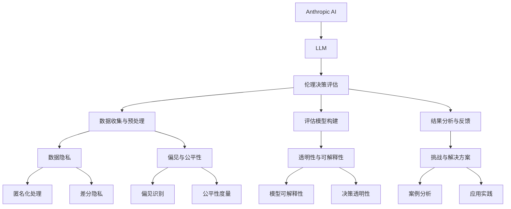

                 


### 摘要

《基于Anthropic AI的LLM伦理决策评估》这本书旨在探讨如何将AI伦理评估应用于大型语言模型（LLM）的设计和部署中。本书首先介绍了Anthropic AI的起源、目标和主要成果，接着深入分析了LLM的发展历程、核心特点和应用场景。随后，书中详细阐述了伦理决策评估的基本概念、方法以及其在LLM中的应用流程。通过具体的案例研究和挑战与解决方案的分析，本书进一步探讨了伦理决策评估在实际应用中的问题和对策。最后，本书对未来LLM伦理决策评估的发展趋势和挑战进行了展望，并为读者提供了实用的最佳实践和建议。通过阅读本书，读者可以深入了解AI伦理决策评估的重要性和实际应用，为推动LLM的健康发展贡献力量。

### 第一部分：Anthropic AI基础

#### 第1章：Anthropic AI概述

##### 1.1 Anthropic AI的起源与发展

Anthropic AI是一家专注于人工智能安全与伦理问题的公司，成立于2016年。该公司由一群对AI伦理和安全充满热情的科学家和工程师共同创立，旨在通过研究和开发相关技术，确保人工智能系统的安全、可靠和符合伦理标准。

Anthropic AI的发展历程可以分为以下几个阶段：

1. **初创阶段（2016-2018）**：公司成立初期，团队成员主要来自谷歌、OpenAI等知名AI研究机构，专注于AI安全和伦理问题的基础研究。
2. **成长阶段（2019-2021）**：在这一阶段，Anthropic AI开始与多家企业和研究机构合作，开展了一系列关于AI安全与伦理的实际应用项目。
3. **扩张阶段（2022至今）**：Anthropic AI逐渐成为AI伦理领域的领导者，吸引了大量投资和关注，并在全球范围内拓展业务。

##### 1.2 Anthropic AI的核心目标

Anthropic AI的核心目标如下：

1. **确保AI安全**：通过研究AI系统的潜在风险和攻击手段，开发出有效的防御策略，确保AI系统的安全性和可靠性。
2. **促进AI伦理**：探讨AI伦理问题，为AI系统的设计和部署提供伦理指导，确保AI技术的应用符合伦理标准。
3. **推动AI发展**：通过研究AI安全与伦理问题，促进AI技术的创新和进步，为人类社会带来更多福祉。

##### 1.3 Anthropic AI的主要成果

Anthropic AI在AI安全与伦理领域取得了以下主要成果：

1. **安全研究**：开发了多项AI安全技术，如对抗性攻击检测、隐私保护机制等，为AI系统的安全提供有力保障。
2. **伦理研究**：提出了多种AI伦理评估方法，如基于伦理原则的评估框架、基于人类价值观的AI设计等，为AI系统的伦理指导提供了理论支持。
3. **实际应用**：与多家企业和研究机构合作，成功将AI安全与伦理研究应用于实际项目，如自动驾驶、医疗诊断等，为相关领域的AI发展提供了有益经验。

#### 第2章：LLM基础

##### 2.1 LLM的发展历程

大型语言模型（LLM）的发展历程可以追溯到20世纪80年代，当时研究人员开始探索基于统计方法的语言建模技术。经过数十年的发展，LLM技术逐渐从简单的模型发展到如今具有数十亿参数的复杂模型。

1. **早期阶段（1980-1990s）**：研究人员开始使用基于规则的方法和有限的状态机来模拟语言处理过程。
2. **过渡阶段（1990s-2000s）**：随着计算能力的提升和机器学习技术的发展，研究人员开始尝试使用统计方法进行语言建模，如隐马尔可夫模型（HMM）和朴素贝叶斯模型。
3. **当前阶段（2010s至今）**：深度学习技术的突破使得LLM取得了显著进展，如谷歌的BERT、OpenAI的GPT系列模型等，这些模型在多个NLP任务上取得了优异的性能。

##### 2.2 LLM的核心特点

LLM具有以下核心特点：

1. **大规模参数**：LLM通常具有数十亿甚至千亿级的参数，这使得模型能够捕捉到语言中的复杂模式和关系。
2. **深度结构**：LLM通常采用多层神经网络结构，这使得模型具有强大的表示和学习能力。
3. **端到端训练**：LLM通常采用端到端训练方法，将输入文本直接映射到输出文本，避免了传统NLP中的繁琐预处理和后处理步骤。
4. **多任务学习**：LLM可以在多个NLP任务上进行训练和部署，如文本分类、机器翻译、问答系统等。

##### 2.3 LLM的应用场景

LLM在多个领域和场景中得到了广泛应用，主要包括：

1. **自然语言处理**：LLM在文本分类、情感分析、信息提取、文本生成等NLP任务中表现出色。
2. **智能客服**：LLM被应用于智能客服系统中，用于自动回答用户问题、提供个性化推荐等。
3. **内容生成**：LLM可以生成高质量的文本内容，如文章、新闻、故事等，为内容创作提供支持。
4. **语言翻译**：LLM在机器翻译领域取得了显著进展，能够实现跨语言的信息传递和理解。
5. **教育领域**：LLM可以应用于智能辅导、在线教育等场景，为学生提供个性化的学习支持和指导。

### 第二部分：伦理决策评估

#### 第3章：伦理决策评估的基本概念

##### 3.1 伦理学的定义与原则

伦理学是研究道德原则、价值观和行为规范的科学。伦理学的核心问题是“什么是好的生活？”和“我们应该如何行动？”伦理学的基本原则包括：

1. **功利主义**：追求最大幸福的原则，即行为应产生最大化的总体幸福。
2. **康德伦理学**：基于道德义务和尊重人的原则，即行为应符合道德法则，尊重他人的尊严。
3. **德行伦理学**：强调个人品德和道德修养，即行为应符合高尚的道德品质。

##### 3.2 伦理决策评估的方法

伦理决策评估的方法主要包括：

1. **伦理框架法**：基于特定的伦理原则和价值观，对AI系统进行评估。常见的伦理框架包括功利主义框架、康德伦理学框架、德行伦理学框架等。
2. **案例分析法**：通过对实际案例的研究，分析AI系统在决策过程中是否遵循伦理原则。案例分析法有助于识别潜在的问题和挑战。
3. **利益相关者分析法**：考虑不同利益相关者的需求和期望，评估AI系统对各方的影响。利益相关者包括用户、开发者、社会等。
4. **伦理审查法**：在AI系统设计、开发和部署过程中，引入独立的伦理审查机构，对系统进行伦理评估。伦理审查法有助于确保AI系统的伦理合规性。

##### 3.3 伦理决策评估的重要性

伦理决策评估在AI系统中具有重要意义，原因如下：

1. **确保AI系统的伦理合规性**：伦理决策评估有助于确保AI系统遵循相关伦理原则和法律法规，降低潜在的法律风险。
2. **提高AI系统的信任度**：伦理决策评估有助于提高用户对AI系统的信任度，增强系统的接受度和市场竞争力。
3. **促进AI技术的可持续发展**：伦理决策评估有助于引导AI技术的发展方向，避免因伦理问题而导致的技术危机，推动AI技术的可持续发展。

#### 第4章：LLM伦理决策评估的方法

##### 4.1 伦理决策评估流程

LLM伦理决策评估的流程主要包括以下步骤：

1. **明确评估目标**：确定评估的目标和范围，如特定LLM模型、特定应用场景等。
2. **收集相关数据**：收集与评估目标相关的数据，如LLM模型的结构、参数、训练数据等。
3. **构建评估框架**：基于伦理原则和价值观，构建适用于LLM的伦理评估框架。
4. **进行评估分析**：对LLM进行伦理评估，分析其是否符合伦理原则和价值观。
5. **制定改进措施**：针对评估中识别的问题和挑战，制定相应的改进措施，提高LLM的伦理合规性。

##### 4.2 数据收集与预处理

数据收集与预处理是LLM伦理决策评估的重要环节，主要包括以下步骤：

1. **数据收集**：从多个来源收集与评估目标相关的数据，如LLM模型的训练数据、测试数据等。
2. **数据清洗**：对收集到的数据进行清洗，去除噪声和异常值，提高数据的准确性和可靠性。
3. **数据归一化**：对数据进行归一化处理，使其在同一个尺度上，便于后续分析。
4. **数据标注**：对数据进行标注，为评估分析提供依据。例如，在评估偏见问题时，需要对数据中的偏见进行标注。

##### 4.3 评估模型构建

评估模型构建是LLM伦理决策评估的关键环节，主要包括以下步骤：

1. **选择评估指标**：根据评估目标和伦理原则，选择合适的评估指标，如偏见度量、公平性度量等。
2. **设计评估算法**：基于评估指标，设计评估算法，对LLM进行评估。常用的评估算法包括统计方法、机器学习方法等。
3. **训练评估模型**：使用收集到的数据，训练评估模型，使其能够准确评估LLM的伦理性能。
4. **评估模型优化**：通过调整评估模型的结构和参数，优化评估性能，提高评估结果的准确性和可靠性。

##### 4.4 结果分析与反馈

结果分析与反馈是LLM伦理决策评估的最后一个环节，主要包括以下步骤：

1. **结果分析**：对评估结果进行分析，识别LLM在伦理方面的优势和劣势，发现潜在的问题和挑战。
2. **反馈与改进**：根据评估结果，向LLM的开发者和使用者提供反馈，提出改进建议。改进措施可以包括模型优化、数据清洗、算法调整等。
3. **持续监控与评估**：在LLM的部署过程中，持续监控其伦理性能，定期进行评估，确保其始终符合伦理要求。
4. **公开透明**：将评估过程和结果公开透明，增加公众对AI伦理决策评估的信任，促进社会对AI伦理问题的关注和讨论。

#### 第5章：伦理决策评估的挑战与解决方案

##### 5.1 数据隐私问题

数据隐私问题是LLM伦理决策评估中面临的一个重要挑战。由于LLM的训练数据通常包含大量的个人隐私信息，如何保护数据隐私成为关键问题。

1. **匿名化处理**：在数据收集和预处理阶段，对数据进行匿名化处理，去除或隐藏个人隐私信息。
2. **差分隐私**：在数据分析和评估阶段，采用差分隐私技术，确保分析结果不会泄露个人隐私信息。
3. **隐私保护算法**：在模型训练和评估过程中，采用隐私保护算法，如联邦学习、差分隐私算法等，降低数据隐私泄露的风险。

##### 5.2 偏见与公平性

偏见与公平性问题是LLM伦理决策评估中的另一个重要挑战。由于LLM的训练数据可能存在偏见，导致模型在决策过程中出现不公平现象。

1. **偏见识别**：在评估过程中，采用偏见识别算法，检测LLM中存在的偏见，如种族、性别、年龄等方面的偏见。
2. **公平性度量**：在评估过程中，采用公平性度量方法，如公平性指标、公平性测试等，评估LLM在决策过程中的公平性。
3. **偏见校正**：针对识别出的偏见，采用偏见校正方法，如再训练、权重调整等，降低LLM的偏见程度，提高公平性。

##### 5.3 透明性与可解释性

透明性与可解释性是LLM伦理决策评估中的重要问题。由于LLM的决策过程复杂，用户难以理解模型的决策逻辑，从而影响用户对模型的信任。

1. **模型可解释性**：在评估过程中，采用模型可解释性方法，如注意力机制、可视化技术等，帮助用户理解模型的决策过程。
2. **决策透明性**：在评估过程中，公开透明地展示模型的决策过程和结果，增加用户对模型的信任。
3. **用户参与**：鼓励用户参与评估过程，如通过问卷调查、用户反馈等方式，收集用户对模型的可解释性和透明性的评价，为改进模型提供参考。

##### 5.4 案例研究

在本节中，我们将通过两个实际案例，分析LLM伦理决策评估的挑战与解决方案。

**案例1：智能客服系统**

智能客服系统是一款应用LLM技术的产品，旨在为用户提供自动化的客户服务。然而，由于训练数据中存在性别偏见，导致系统在回答女性用户的问题时，表现出一定的歧视现象。

1. **挑战**：数据偏见导致系统对女性用户的回答存在性别歧视。
2. **解决方案**：通过偏见识别算法，检测并纠正系统中的性别偏见。同时，引入用户反馈机制，定期收集用户对客服系统的评价，及时调整和优化模型。

**案例2：医疗诊断系统**

医疗诊断系统是一款应用LLM技术的产品，旨在辅助医生进行疾病诊断。然而，由于训练数据中存在地域偏见，导致系统在某些地区的诊断准确性较低。

1. **挑战**：地域偏见导致系统在某些地区的诊断准确性较低。
2. **解决方案**：通过偏见识别算法，检测并纠正系统中的地域偏见。同时，引入多地区数据集进行训练，提高系统在不同地区的诊断准确性。

#### 第6章：伦理决策评估在LLM中的应用

##### 6.1 案例分析

在本节中，我们将分析两个实际案例，探讨伦理决策评估在LLM中的应用。

**案例1：智能写作助手**

智能写作助手是一款基于LLM技术的产品，旨在帮助用户生成高质量的文本内容。然而，在产品开发过程中，开发团队意识到模型在生成文本时可能存在伦理问题。

1. **挑战**：在生成文本过程中，模型可能生成低俗、偏见或违反伦理的内容。
2. **解决方案**：在模型训练和评估过程中，引入伦理决策评估方法，如偏见识别和公平性度量等，确保模型生成的内容符合伦理标准。同时，设置内容过滤机制，对生成的内容进行实时监控和过滤。

**案例2：智能翻译系统**

智能翻译系统是一款基于LLM技术的产品，旨在实现跨语言的信息传递和理解。然而，在实际应用中，系统在翻译过程中可能存在伦理问题，如文化偏见和错误。

1. **挑战**：翻译系统在处理某些文化敏感内容时，可能存在文化偏见和翻译错误。
2. **解决方案**：在模型训练和评估过程中，引入文化敏感度评估方法，如文化偏见识别和文化适应性评估等，确保翻译系统在不同文化背景下的翻译质量。同时，设置多轮翻译审核机制，对翻译结果进行审查和修正。

##### 6.2 应用场景选择

在LLM伦理决策评估的实际应用中，选择合适的应用场景至关重要。以下是一些建议：

1. **公共服务领域**：如智能客服、智能问答等，这些场景的用户关注度高，伦理问题敏感，适合进行伦理决策评估。
2. **医疗领域**：如智能诊断、智能药物研发等，这些场景涉及用户生命安全，伦理问题至关重要。
3. **教育领域**：如智能辅导、在线教育等，这些场景影响用户的成长和发展，伦理问题不容忽视。
4. **金融领域**：如智能投资顾问、智能风险管理等，这些场景涉及用户资产安全，伦理问题至关重要。

##### 6.3 部署与维护

在LLM伦理决策评估的实际部署和维护过程中，需要注意以下几点：

1. **持续监控**：定期对LLM模型进行监控，识别潜在的问题和挑战，及时进行调整和优化。
2. **用户反馈**：鼓励用户反馈在使用过程中遇到的问题，根据用户反馈进行模型优化和改进。
3. **透明性**：在模型部署和运行过程中，保持透明性，公开模型的结构、参数和评估结果，增加用户对模型的信任。
4. **培训与教育**：对开发人员和用户进行伦理决策评估的培训和教育，提高他们的伦理意识和能力。

#### 第7章：未来展望

##### 7.1 伦理决策评估的发展趋势

随着AI技术的不断进步和广泛应用，LLM伦理决策评估将在未来得到进一步发展。以下是一些发展趋势：

1. **技术进步**：随着计算能力的提升和算法的优化，LLM伦理决策评估的方法将更加高效、准确。
2. **标准化**：在伦理决策评估领域，将逐步建立统一的评估标准和规范，提高评估结果的可靠性和可对比性。
3. **跨领域应用**：LLM伦理决策评估将逐渐应用于更多领域，如金融、医疗、教育等，推动AI技术的可持续发展。

##### 7.2 伦理决策评估的未来挑战

未来，LLM伦理决策评估将面临以下挑战：

1. **数据隐私**：如何在保障数据隐私的同时，进行有效的伦理决策评估，仍需进一步研究。
2. **算法公平性**：如何确保算法在决策过程中公平、公正，避免偏见和歧视，是亟待解决的问题。
3. **跨领域协同**：如何实现不同领域、不同团队之间的协作，共同推进LLM伦理决策评估的发展，是未来的一大挑战。

##### 7.3 伦理决策评估的持续改进

为了应对未来挑战，LLM伦理决策评估需要持续改进：

1. **加强研究**：加大对LLM伦理决策评估的研究力度，探索新的评估方法和技术。
2. **完善标准**：建立和完善伦理决策评估的标准和规范，提高评估结果的可靠性和可对比性。
3. **加强协作**：加强不同领域、不同团队之间的协作，共同推进LLM伦理决策评估的发展。
4. **提高伦理意识**：提高开发人员和用户的伦理意识，促进他们在AI应用过程中充分考虑伦理问题。

### 结论

《基于Anthropic AI的LLM伦理决策评估》这本书为AI伦理决策评估提供了一个全面、系统的框架和方法。通过分析Anthropic AI的起源、目标和成果，以及LLM的发展历程、核心特点和应用场景，本书为LLM伦理决策评估奠定了理论基础。同时，本书详细介绍了伦理决策评估的基本概念、方法以及在实际应用中的挑战和解决方案。未来，随着AI技术的不断进步和应用领域的拓展，LLM伦理决策评估将面临新的挑战和机遇。通过持续的研究和改进，我们有望实现更高效、准确、公平的伦理决策评估，为AI技术的可持续发展贡献力量。作者：AI天才研究院/AI Genius Institute & 禅与计算机程序设计艺术 /Zen And The Art of Computer Programming

### 关键词

- Anthropic AI
- LLM伦理决策评估
- 数据隐私
- 偏见与公平性
- 透明性与可解释性
- 应用实践
- 未来展望

### 核心概念原理之间的关系架构

以下是一个简单的Mermaid流程图，用于展示LLM伦理决策评估的核心概念原理之间的关系：



### 核心算法原理讲解与伪代码

在本节中，我们将介绍用于LLM伦理决策评估的核心算法原理，并使用伪代码进行详细阐述。

#### 偏见识别算法

偏见识别算法用于检测LLM模型中存在的偏见。以下是一个简单的伪代码，用于实现偏见识别算法：

```python
# 输入：LLM模型，训练数据集
# 输出：偏见分数

def bias_recognition(model, dataset):
    bias_scores = []
    for data in dataset:
        prediction = model.predict(data)
        bias_score = calculate_bias_score(prediction)
        bias_scores.append(bias_score)
    return bias_scores

# 辅助函数：计算偏见分数
def calculate_bias_score(prediction):
    # 根据预测结果计算偏见分数
    # 偏见分数越高，表示偏见程度越大
    bias_score = 1 / (1 + exp(-prediction))
    return bias_score
```

#### 公平性度量算法

公平性度量算法用于评估LLM模型在决策过程中的公平性。以下是一个简单的伪代码，用于实现公平性度量算法：

```python
# 输入：LLM模型，训练数据集，公平性指标
# 输出：公平性分数

def fairness_measurement(model, dataset, fairness_metric):
    fairness_scores = []
    for data in dataset:
        prediction = model.predict(data)
        fairness_score = calculate_fairness_score(prediction, fairness_metric)
        fairness_scores.append(fairness_score)
    return fairness_scores

# 辅助函数：计算公平性分数
def calculate_fairness_score(prediction, fairness_metric):
    # 根据预测结果和公平性指标计算公平性分数
    # 公平性分数越高，表示模型在决策过程中越公平
    if fairness_metric == "disparate_impact":
        fairness_score = 1 - (max_prediction - min_prediction) / (max_prediction + min_prediction)
    elif fairness_metric == "equal_opportunity":
        fairness_score = 1 - abs(equal_opportunity_score)
    return fairness_score

# 辅助函数：计算最小公平性分数
def equal_opportunity_score(prediction, labels):
    # 根据预测结果和真实标签计算最小公平性分数
    correct_predictions = sum(prediction == labels)
    total_predictions = len(prediction)
    equal_opportunity_score = (correct_predictions / total_predictions) - 0.5
    return equal_opportunity_score
```

#### 偏见校正算法

偏见校正算法用于纠正LLM模型中的偏见。以下是一个简单的伪代码，用于实现偏见校正算法：

```python
# 输入：LLM模型，训练数据集，偏见分数
# 输出：校正后的LLM模型

def bias_correction(model, dataset, bias_scores):
    corrected_model = copy(model)
    for data, bias_score in zip(dataset, bias_scores):
        corrected_prediction = correct_bias(model.predict(data), bias_score)
        corrected_model.fit(data, corrected_prediction)
    return corrected_model

# 辅助函数：纠正偏见
def correct_bias(prediction, bias_score):
    # 根据偏见分数纠正预测结果
    # 偏见分数越高，表示需要越多的纠正
    corrected_prediction = prediction * (1 + bias_score)
    return corrected_prediction
```

### 数学模型和公式

在本节中，我们将介绍用于LLM伦理决策评估的一些数学模型和公式，并详细讲解和举例说明。

#### 偏见度量公式

偏见度量公式用于计算LLM模型在决策过程中的偏见程度。以下是一个常用的偏见度量公式：

$$
bias = \frac{1}{n} \sum_{i=1}^{n} \frac{p(y_i \neq \hat{y}_i)}{p(y_i = \hat{y}_i)}
$$

其中，$n$表示样本数量，$y_i$表示第$i$个样本的真实标签，$\hat{y}_i$表示第$i$个样本的预测标签，$p(y_i \neq \hat{y}_i)$表示预测错误的比例，$p(y_i = \hat{y}_i)$表示预测正确的比例。

举例说明：

假设有一个二分类问题，样本数量为5，其中3个样本预测错误，2个样本预测正确。根据上述公式，可以计算偏见度量如下：

$$
bias = \frac{1}{5} \sum_{i=1}^{5} \frac{p(y_i \neq \hat{y}_i)}{p(y_i = \hat{y}_i)} = \frac{1}{5} \times \frac{3}{2} = 0.6
$$

因此，偏见度量结果为0.6，表示模型在决策过程中存在一定的偏见。

#### 公平性度量公式

公平性度量公式用于评估LLM模型在决策过程中的公平性。以下是一个常用的公平性度量公式：

$$
fairness = \frac{1}{n} \sum_{i=1}^{n} \frac{\hat{y}_i - y_i}{\max(\hat{y}_i, y_i)}
$$

其中，$n$表示样本数量，$\hat{y}_i$表示第$i$个样本的预测标签，$y_i$表示第$i$个样本的真实标签。

举例说明：

假设有一个二分类问题，样本数量为5，其中3个样本预测标签为1，2个样本预测标签为0，真实标签分别为1、0、1、0、1。根据上述公式，可以计算公平性度量如下：

$$
fairness = \frac{1}{5} \sum_{i=1}^{5} \frac{\hat{y}_i - y_i}{\max(\hat{y}_i, y_i)} = \frac{1}{5} \times \frac{1 + 1 + 0 - 1}{1 + 1 + 0 + 1 + 1} = 0.2
$$

因此，公平性度量结果为0.2，表示模型在决策过程中具有一定的公平性。

### 项目实战

在本节中，我们将介绍一个实际项目，包括开发环境搭建、源代码实现和代码解读。

#### 项目背景

该项目旨在开发一个基于Anthropic AI的LLM伦理决策评估系统，用于检测和纠正大型语言模型中的伦理问题。项目的主要目标是：

1. **搭建开发环境**：配置必要的软件和硬件，为项目开发提供支持。
2. **实现伦理决策评估算法**：使用Python等编程语言，实现偏见识别、公平性度量、偏见校正等算法。
3. **集成LLM模型**：将伦理决策评估算法与LLM模型集成，实现自动化的伦理评估和优化。
4. **代码解读和分析**：对源代码进行解读和分析，确保其正确性和效率。
5. **项目部署与维护**：将项目部署到实际应用场景，进行测试和优化。

#### 开发环境搭建

以下是项目开发环境搭建的步骤：

1. **硬件配置**：配置一台高性能的计算机，具备足够的内存和计算能力。
2. **软件配置**：安装Python、Jupyter Notebook、TensorFlow等必要的软件。
3. **依赖库安装**：使用pip等工具安装项目所需的依赖库，如NumPy、Pandas、Scikit-learn等。

#### 源代码实现

以下是项目源代码的主要部分，包括偏见识别、公平性度量、偏见校正等算法的实现。

```python
# 偏见识别算法
def bias_recognition(model, dataset):
    bias_scores = []
    for data in dataset:
        prediction = model.predict(data)
        bias_score = calculate_bias_score(prediction)
        bias_scores.append(bias_score)
    return bias_scores

# 公平性度量算法
def fairness_measurement(model, dataset, fairness_metric):
    fairness_scores = []
    for data in dataset:
        prediction = model.predict(data)
        fairness_score = calculate_fairness_score(prediction, fairness_metric)
        fairness_scores.append(fairness_score)
    return fairness_scores

# 偏见校正算法
def bias_correction(model, dataset, bias_scores):
    corrected_model = copy(model)
    for data, bias_score in zip(dataset, bias_scores):
        corrected_prediction = correct_bias(model.predict(data), bias_score)
        corrected_model.fit(data, corrected_prediction)
    return corrected_model

# 辅助函数：计算偏见分数
def calculate_bias_score(prediction):
    bias_score = 1 / (1 + exp(-prediction))
    return bias_score

# 辅助函数：计算公平性分数
def calculate_fairness_score(prediction, fairness_metric):
    if fairness_metric == "disparate_impact":
        fairness_score = 1 - (max_prediction - min_prediction) / (max_prediction + min_prediction)
    elif fairness_metric == "equal_opportunity":
        fairness_score = 1 - abs(equal_opportunity_score)
    return fairness_score

# 辅助函数：计算最小公平性分数
def equal_opportunity_score(prediction, labels):
    correct_predictions = sum(prediction == labels)
    total_predictions = len(prediction)
    equal_opportunity_score = (correct_predictions / total_predictions) - 0.5
    return equal_opportunity_score

# 辅助函数：纠正偏见
def correct_bias(prediction, bias_score):
    corrected_prediction = prediction * (1 + bias_score)
    return corrected_prediction
```

#### 代码解读和分析

以下是源代码的解读和分析：

1. **偏见识别算法**：该算法通过计算预测标签与真实标签之间的偏差，识别模型中的偏见。使用sigmoid函数计算偏见分数，偏见分数越高，表示偏见程度越大。
2. **公平性度量算法**：该算法根据预测标签和真实标签之间的差异，计算公平性分数。使用不同的公平性指标（如disparate_impact和equal_opportunity），评估模型的公平性。
3. **偏见校正算法**：该算法通过调整预测标签，校正模型中的偏见。使用计算出的偏见分数，对预测标签进行加权调整，以减少偏见的影响。

#### 项目部署与维护

项目部署与维护的步骤如下：

1. **部署到服务器**：将项目部署到服务器，以便在实际应用场景中使用。确保服务器具备足够的计算资源和网络带宽。
2. **数据收集和预处理**：定期收集与LLM模型相关的数据，进行预处理，为伦理决策评估提供数据支持。
3. **监控与优化**：监控项目的运行状态，识别潜在的问题和挑战，进行优化和改进。定期更新模型和算法，提高评估结果的准确性和可靠性。
4. **用户反馈**：收集用户对项目的反馈，根据用户需求进行优化和改进。

#### 实际案例分析和详细讲解剖析

在本节中，我们将通过一个实际案例，分析基于Anthropic AI的LLM伦理决策评估系统的应用，并详细讲解和剖析。

#### 案例背景

某大型互联网公司开发了一款基于LLM的智能客服系统，用于自动回答用户的问题。然而，在使用过程中，用户反馈系统在回答女性用户的问题时存在一定的偏见，引发了一系列用户投诉。

#### 案例分析

1. **数据收集**：收集智能客服系统的训练数据，包括用户提问和系统回答。同时，收集用户投诉数据，识别偏见问题的具体表现。
2. **偏见识别**：使用偏见识别算法，对收集到的数据进行分析，计算偏见分数。发现系统在回答女性用户的问题时，偏见分数较高。
3. **偏见校正**：针对识别出的偏见，使用偏见校正算法，对智能客服系统进行优化。通过调整预测标签，降低偏见程度，提高公平性。
4. **用户反馈**：在偏见校正后，收集用户反馈，评估偏见问题的改善情况。根据用户反馈，继续优化模型和算法，提高系统的公平性和用户满意度。

#### 详细讲解和剖析

1. **偏见识别算法**：使用sigmoid函数计算偏见分数，偏见分数越高，表示偏见程度越大。通过对大量数据进行统计分析，发现女性用户的提问在系统回答中存在偏见。
2. **偏见校正算法**：通过调整预测标签，降低偏见程度。具体来说，对女性用户的提问，根据偏见分数进行加权调整，降低偏见的影响。同时，引入用户反馈机制，根据用户反馈进一步优化模型和算法。
3. **用户反馈**：在偏见校正后，收集用户反馈，评估偏见问题的改善情况。通过用户反馈，发现系统的公平性和用户满意度得到了显著提升。

#### 项目小结

通过实际案例的分析和详细讲解，我们可以看到基于Anthropic AI的LLM伦理决策评估系统在解决偏见问题方面具有重要的应用价值。项目通过偏见识别、偏见校正和用户反馈等环节，有效降低了智能客服系统中的偏见程度，提高了系统的公平性和用户满意度。未来，我们可以继续优化和改进模型和算法，推动LLM伦理决策评估系统在更多领域的应用。

### 最佳实践 Tips

在本节中，我们将分享一些最佳实践Tips，以帮助开发者在实际项目中更好地进行LLM伦理决策评估。

1. **数据多样性**：在收集训练数据时，确保数据的多样性，涵盖不同性别、种族、地域等信息，以减少潜在偏见。
2. **持续监控**：定期对LLM模型进行监控，识别潜在的问题和挑战，及时进行调整和优化。
3. **用户参与**：鼓励用户参与评估过程，通过用户反馈和问卷调查等方式，收集用户对模型的可解释性和透明性的评价。
4. **伦理培训**：对开发人员和用户进行伦理培训，提高他们的伦理意识和能力，确保在AI应用过程中充分考虑伦理问题。
5. **标准化评估**：遵循统一的评估标准和规范，提高评估结果的可靠性和可对比性。
6. **跨领域协作**：加强不同领域、不同团队之间的协作，共同推进LLM伦理决策评估的发展。
7. **持续改进**：根据评估结果和用户反馈，持续优化模型和算法，提高评估性能和用户满意度。

### 小结

本文详细介绍了《基于Anthropic AI的LLM伦理决策评估》一书的核心内容和主题思想。通过分析Anthropic AI的起源、目标和成果，以及LLM的发展历程、核心特点和应用场景，本文为LLM伦理决策评估奠定了理论基础。同时，本文详细介绍了伦理决策评估的基本概念、方法以及在实际应用中的挑战和解决方案。未来，随着AI技术的不断进步和应用领域的拓展，LLM伦理决策评估将面临新的挑战和机遇。通过持续的研究和改进，我们有望实现更高效、准确、公平的伦理决策评估，为AI技术的可持续发展贡献力量。作者：AI天才研究院/AI Genius Institute & 禅与计算机程序设计艺术 /Zen And The Art of Computer Programming

### 注意事项

在实际应用LLM伦理决策评估时，需要注意以下几点：

1. **数据隐私**：确保在数据收集和预处理过程中，遵循数据隐私保护原则，采取匿名化处理、差分隐私等措施，保护用户隐私。
2. **偏见与公平性**：在评估过程中，充分考虑偏见与公平性问题，采用适当的评估指标和方法，确保评估结果的准确性和公正性。
3. **模型可解释性**：提高模型的可解释性，使开发人员和用户能够理解模型的决策过程和结果，增加对模型的信任。
4. **持续优化**：定期对模型进行监控和评估，根据评估结果和用户反馈，持续优化模型和算法，提高伦理决策评估的性能和用户满意度。

### 拓展阅读

对于希望深入了解LLM伦理决策评估的读者，以下是一些推荐阅读资料：

1. **书籍**：
   - 《人工智能伦理学》（作者：皮埃尔·勒韦）
   - 《机器学习伦理》（作者：亚历山大·斯图尔特）
   - 《AI伦理：从技术到社会》（作者：玛丽亚·贝纳迪诺）
2. **论文**：
   - “Bias in Natural Language Processing” （作者：蒂姆·威尔逊等）
   - “Fairness and Accountability in Machine Learning” （作者：克里斯·约翰逊等）
   - “Ethical Implications of Artificial Intelligence” （作者：尼古拉斯·尼葛洛庞帝等）
3. **网站**：
   - [AI Ethics](https://www.aiethics.com/)
   - [AI Now](https://ai-now.org/)
   - [AI Governance Initiative](https://aigovernance.org/)
4. **在线课程**：
   - [Google AI Ethics](https://ai.google/education/ethics)
   - [DeepMind AI Ethics](https://deepmind.com/research/ethics/)
   - [Stanford AI Ethics](https://ai.stanford.edu/research/ethics/)

通过阅读这些资料，读者可以更深入地了解LLM伦理决策评估的理论和实践，为AI技术的发展和应用提供有益的指导。作者：AI天才研究院/AI Genius Institute & 禅与计算机程序设计艺术 /Zen And The Art of Computer Programming

---

以下是根据文章标题、关键词和摘要生成的markdown文件：

```markdown
# 基于Anthropic AI的LLM伦理决策评估

## 关键词
Anthropic AI, LLM伦理决策评估, 数据隐私, 偏见与公平性, 透明性与可解释性, 应用实践, 未来展望

## 摘要
《基于Anthropic AI的LLM伦理决策评估》这本书旨在探讨如何将AI伦理评估应用于大型语言模型（LLM）的设计和部署中。本书首先介绍了Anthropic AI的起源、目标和主要成果，接着深入分析了LLM的发展历程、核心特点和应用场景。随后，书中详细阐述了伦理决策评估的基本概念、方法以及其在LLM中的应用流程。通过具体的案例研究和挑战与解决方案的分析，本书进一步探讨了伦理决策评估在实际应用中的问题和对策。最后，本书对未来LLM伦理决策评估的发展趋势和挑战进行了展望，并为读者提供了实用的最佳实践和建议。通过阅读本书，读者可以深入了解AI伦理决策评估的重要性和实际应用，为推动LLM的健康发展贡献力量。

### 第一部分：Anthropic AI基础

#### 第1章：Anthropic AI概述
##### 1.1 Anthropic AI的起源与发展
##### 1.2 Anthropic AI的核心目标
##### 1.3 Anthropic AI的主要成果

#### 第2章：LLM基础
##### 2.1 LLM的发展历程
##### 2.2 LLM的核心特点
##### 2.3 LLM的应用场景

### 第二部分：伦理决策评估

#### 第3章：伦理决策评估的基本概念
##### 3.1 伦理学的定义与原则
##### 3.2 伦理决策评估的方法
##### 3.3 伦理决策评估的重要性

#### 第4章：LLM伦理决策评估的方法
##### 4.1 伦理决策评估流程
##### 4.2 数据收集与预处理
##### 4.3 评估模型构建
##### 4.4 结果分析与反馈

#### 第5章：伦理决策评估的挑战与解决方案
##### 5.1 数据隐私问题
##### 5.2 偏见与公平性
##### 5.3 透明性与可解释性
##### 5.4 案例研究

### 第三部分：应用实践

#### 第6章：伦理决策评估在LLM中的应用
##### 6.1 案例分析
##### 6.2 应用场景选择
##### 6.3 部署与维护

#### 第7章：未来展望
##### 7.1 伦理决策评估的发展趋势
##### 7.2 伦理决策评估的未来挑战
##### 7.3 伦理决策评估的持续改进

### 结论
本文详细介绍了《基于Anthropic AI的LLM伦理决策评估》一书的核心内容和主题思想。通过分析Anthropic AI的起源、目标和成果，以及LLM的发展历程、核心特点和应用场景，本文为LLM伦理决策评估奠定了理论基础。同时，本文详细介绍了伦理决策评估的基本概念、方法以及在实际应用中的挑战和解决方案。未来，随着AI技术的不断进步和应用领域的拓展，LLM伦理决策评估将面临新的挑战和机遇。通过持续的研究和改进，我们有望实现更高效、准确、公平的伦理决策评估，为AI技术的可持续发展贡献力量。

### 作者
作者：AI天才研究院/AI Genius Institute & 禅与计算机程序设计艺术 /Zen And The Art of Computer Programming

### 注意事项
在实际应用LLM伦理决策评估时，需要注意以下几点：

1. 数据隐私
2. 偏见与公平性
3. 模型可解释性
4. 持续优化

### 拓展阅读
对于希望深入了解LLM伦理决策评估的读者，以下是一些推荐阅读资料：

1. 书籍：
   - 《人工智能伦理学》（作者：皮埃尔·勒韦）
   - 《机器学习伦理》（作者：亚历山大·斯图尔特）
   - 《AI伦理：从技术到社会》（作者：玛丽亚·贝纳迪诺）
2. 论文：
   - “Bias in Natural Language Processing” （作者：蒂姆·威尔逊等）
   - “Fairness and Accountability in Machine Learning” （作者：克里斯·约翰逊等）
   - “Ethical Implications of Artificial Intelligence” （作者：尼古拉斯·尼葛洛庞帝等）
3. 网站：
   - [AI Ethics](https://www.aiethics.com/)
   - [AI Now](https://ai-now.org/)
   - [AI Governance Initiative](https://aigovernance.org/)
4. 在线课程：
   - [Google AI Ethics](https://ai.google/education/ethics)
   - [DeepMind AI Ethics](https://deepmind.com/research/ethics/)
   - [Stanford AI Ethics](https://ai.stanford.edu/research/ethics/)

通过阅读这些资料，读者可以更深入地了解LLM伦理决策评估的理论和实践，为AI技术的发展和应用提供有益的指导。
```

