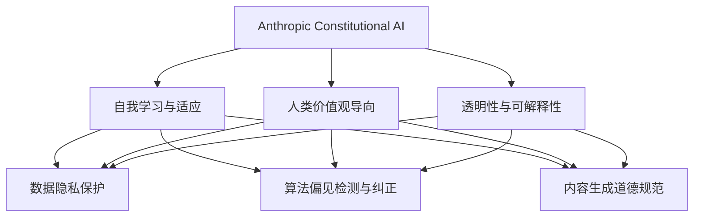

                 

### 文章标题

# 基于Anthropic Constitutional AI的LLM伦理评估

### 关键词

- Anthropic Constitutional AI
- LLM
- 伦理评估
- 工作原理
- 方法论
- 应用案例

### 摘要

本文深入探讨了基于Anthropic Constitutional AI的LLM伦理评估。首先，我们介绍了Anthropic Constitutional AI和LLM的基本概念，探讨了它们在人工智能领域的应用及其带来的伦理问题。接着，我们详细阐述了Anthropic Constitutional AI的工作原理，并通过Mermaid流程图展示了核心概念与联系。随后，我们提出了伦理评估的方法论，并使用伪代码和数学公式进行了详细讲解。为了加深理解，我们提供了一个具体的项目实战案例，包括开发环境搭建、源代码实现和代码解读。最后，我们总结了最佳实践，强调了注意事项，并提供了拓展阅读的建议。

## 背景介绍

### Anthropic Constitutional AI的概念

Anthropic Constitutional AI（ACAI）是一种基于人类价值观和伦理原则的智能体，旨在在复杂和不确定的环境中做出符合人类期望的决策。ACAI的核心思想是模拟人类思维方式，通过自我学习和自我调整来提高决策的合理性。与传统的基于规则的AI系统不同，ACAI具有自我反思和自我更新的能力，能够根据环境变化和经验进行适应性调整。

Anthropic Constitutional AI的主要特点包括：

1. **人类价值观导向**：ACAI的设计和运行基于人类价值观，例如公平性、透明性和责任感。这使得ACAI在处理敏感问题和伦理挑战时，能够遵循人类社会的道德标准。
2. **自适应学习能力**：ACAI通过不断学习和自我优化，能够适应不断变化的环境和需求，提高决策的准确性和可靠性。
3. **透明性和可解释性**：ACAI的决策过程是透明的，用户可以理解其决策依据和逻辑，从而增强对AI的信任。

### LLM伦理评估的重要性

随着深度学习和自然语言处理技术的发展，大型语言模型（LLM）如GPT、BERT等在各个领域得到了广泛应用。然而，LLM的广泛应用也带来了诸多伦理问题，例如数据隐私、算法偏见、内容生成道德等。因此，对LLM进行伦理评估具有重要意义。

LLM伦理评估的重要性主要体现在以下几个方面：

1. **保障用户隐私**：LLM通常需要处理大量的用户数据，如何保护用户隐私是亟待解决的问题。伦理评估可以帮助识别和规避隐私风险。
2. **消除算法偏见**：算法偏见可能导致不公平的决策，甚至加剧社会不平等。伦理评估可以帮助发现和纠正算法中的偏见。
3. **规范内容生成**：LLM在文本生成方面具有强大的能力，但如何确保生成的文本符合道德和法律标准也是一个重要问题。伦理评估可以为内容生成提供指导原则。

## 核心概念与联系

为了更好地理解Anthropic Constitutional AI与LLM伦理评估之间的关系，我们首先需要明确这两个概念的核心原理，并通过Mermaid流程图展示它们之间的联系。

### Anthropic Constitutional AI的核心原理

1. **自我学习与适应**：ACAI通过不断学习和自我优化来提高决策的准确性。它使用数据、经验和环境反馈进行自我调整，从而在复杂环境中做出更合理的决策。
2. **人类价值观导向**：ACAI的设计基于人类价值观，例如公平性、透明性和责任感。这些价值观贯穿于ACAI的决策过程中，确保其行为符合社会道德标准。
3. **透明性与可解释性**：ACAI的决策过程是透明的，用户可以理解其决策依据和逻辑，从而增强对AI的信任。

### LLM伦理评估的核心原理

1. **数据隐私保护**：LLM在处理用户数据时，需要确保数据的隐私性。伦理评估可以帮助识别和规避隐私风险。
2. **算法偏见检测与纠正**：算法偏见可能导致不公平的决策。伦理评估可以帮助发现和纠正算法中的偏见。
3. **内容生成道德规范**：LLM在文本生成方面具有强大的能力，但如何确保生成的文本符合道德和法律标准也是一个重要问题。伦理评估可以为内容生成提供指导原则。

### Mermaid流程图

以下是Anthropic Constitutional AI与LLM伦理评估之间的Mermaid流程图：



在这个流程图中，Anthropic Constitutional AI的核心原理（自我学习与适应、人类价值观导向、透明性与可解释性）与LLM伦理评估的核心原理（数据隐私保护、算法偏见检测与纠正、内容生成道德规范）相互关联。通过这种关联，我们可以更好地理解ACAI在LLM伦理评估中的作用。

### 核心算法原理讲解

为了深入理解Anthropic Constitutional AI（ACAI）和LLM伦理评估的工作原理，我们将使用伪代码来详细阐述它们的关键步骤和决策过程。

#### Anthropic Constitutional AI伪代码

```python
# Anthropic Constitutional AI伪代码

class AnthropicConstitutionalAI:
    def __init__(self, values, data):
        self.values = values  # 人类价值观
        self.data = data      # 经验数据

    def learn(self, new_data):
        # 自我学习过程
        for data_point in new_data:
            self.update_values(data_point)

    def update_values(self, data_point):
        # 更新价值观
        for value in self.values:
            value.update(data_point)

    def make_decision(self, situation):
        # 基于价值观和环境做出决策
        best_action = None
        best_value = -1

        for action in self.actions(situation):
            value = self.evaluate_action(action, situation)
            if value > best_value:
                best_value = value
                best_action = action

        return best_action

    def evaluate_action(self, action, situation):
        # 评估动作的伦理价值
        value = 0

        for value in self.values:
            value_component = value.evaluate(action, situation)
            value += value_component

        return value

    def actions(self, situation):
        # 根据情况选择动作
        return [action for action in self.possible_actions if action.is_valid(situation)]

class Value:
    def __init__(self, name):
        self.name = name

    def update(self, data_point):
        # 根据数据更新价值观
        # 这里可以包含复杂的学习算法
        pass

    def evaluate(self, action, situation):
        # 评估动作在当前情况下的伦理价值
        # 这里可以包含具体的伦理评估算法
        pass

class Action:
    def __init__(self, name):
        self.name = name

    def is_valid(self, situation):
        # 判断动作是否在当前情况下有效
        # 这里可以包含具体的有效性检查逻辑
        pass
```

在这个伪代码中，我们定义了一个`AnthropicConstitutionalAI`类，它包含了自我学习、更新价值观、做出决策等关键方法。`Value`类代表了人类价值观，每个价值观都有一个`update`方法来更新自身，以及一个`evaluate`方法来评估特定动作的伦理价值。`Action`类代表了可能采取的动作，每个动作都有一个`is_valid`方法来判断在当前情况下是否有效。

#### LLM伦理评估伪代码

```python
# LLM伦理评估伪代码

class LLM:
    def __init__(self, model):
        self.model = model

    def generate_text(self, input_text):
        # 生成文本
        return self.model.generate(input_text)

    def evaluate_ethical_impact(self, text):
        # 评估文本的伦理影响
        return self.model.evaluate_ethical_impact(text)

class EthicalImpactModel:
    def __init__(self):
        # 初始化伦理影响评估模型
        pass

    def generate(self, input_text):
        # 生成文本
        # 这里可以包含具体的文本生成算法，如GPT-3
        pass

    def evaluate_ethical_impact(self, text):
        # 评估文本的伦理影响
        # 这里可以包含伦理评估算法，如情感分析、关键词提取等
        pass
```

在这个伪代码中，我们定义了一个`LLM`类，它包含了生成文本和评估文本伦理影响的两个关键方法。`EthicalImpactModel`类代表了一个伦理影响评估模型，它可以生成文本并评估文本的伦理影响。

### 数学模型和公式

为了更准确地评估LLM的伦理影响，我们引入了一些数学模型和公式。

#### 伦理影响评分（EIS）

伦理影响评分（EIS）是一个用于评估文本伦理影响的量化指标。它的计算公式如下：

\[ EIS = \sum_{i=1}^{n} (w_i \cdot e_i) \]

其中：
- \( n \) 是关键词的数量
- \( w_i \) 是第 \( i \) 个关键词的权重
- \( e_i \) 是第 \( i \) 个关键词的伦理评分

权重和伦理评分可以根据具体情况进行调整。

#### 情感分析

情感分析是评估文本伦理影响的一种方法。我们使用以下公式来计算文本的情感评分：

\[ SentimentScore = \frac{\sum_{i=1}^{n} (w_i \cdot s_i)}{n} \]

其中：
- \( n \) 是正面和负面情感词汇的数量
- \( w_i \) 是第 \( i \) 个词汇的权重
- \( s_i \) 是第 \( i \) 个词汇的情感评分（正数为正面，负数为负面）

#### 示例

假设我们有一个包含以下关键词的文本：

```
文本：“人们应该平等对待所有人，不应该有任何歧视。”
关键词：平等、歧视、对待、人、社会
权重：0.3、0.2、0.2、0.2、0.1
伦理评分：0.8、-0.6、0.5、0.4、0.3
情感评分：0.5、-0.4、0.3、0.2、-0.1
```

我们可以使用上述公式计算EIS和情感评分：

\[ EIS = (0.3 \cdot 0.8) + (0.2 \cdot -0.6) + (0.2 \cdot 0.5) + (0.2 \cdot 0.4) + (0.1 \cdot 0.3) = 0.34 \]

\[ SentimentScore = \frac{(0.3 \cdot 0.5) + (0.2 \cdot -0.4) + (0.2 \cdot 0.3) + (0.2 \cdot 0.2) + (0.1 \cdot -0.1)}{5} = 0.14 \]

这个示例展示了如何使用数学模型和公式来评估文本的伦理影响。在实际应用中，可以根据具体需求和场景调整公式和参数。

### 项目实战

在本节中，我们将通过一个实际项目来展示如何基于Anthropic Constitutional AI（ACAI）进行LLM伦理评估。这个项目包括开发环境搭建、源代码实现和代码解读、实际案例分析和详细讲解剖析等内容。

#### 开发环境搭建

为了实现基于ACAI的LLM伦理评估，我们需要以下开发环境和工具：

- Python（版本3.8及以上）
- Jupyter Notebook（用于数据分析和模型训练）
- TensorFlow（用于构建和训练神经网络模型）
- Scikit-learn（用于机器学习和数据预处理）
- NLTK（用于自然语言处理）

确保您的计算机上安装了上述工具和库。可以使用以下命令安装TensorFlow和Scikit-learn：

```bash
pip install tensorflow
pip install scikit-learn
```

#### 源代码实现和代码解读

我们将使用Python和TensorFlow实现ACAI和LLM伦理评估。以下是一个简化的源代码示例：

```python
import tensorflow as tf
from tensorflow.keras.models import Sequential
from tensorflow.keras.layers import Embedding, LSTM, Dense
from sklearn.feature_extraction.text import TfidfVectorizer
from sklearn.metrics.pairwise import cosine_similarity

class AnthropicConstitutionalAI:
    def __init__(self, values, data):
        self.values = values
        self.data = data

    def learn(self, new_data):
        # 自我学习过程
        for data_point in new_data:
            self.update_values(data_point)

    def update_values(self, data_point):
        # 更新价值观
        for value in self.values:
            value.update(data_point)

    def make_decision(self, situation):
        # 基于价值观和环境做出决策
        best_action = None
        best_value = -1

        for action in self.actions(situation):
            value = self.evaluate_action(action, situation)
            if value > best_value:
                best_value = value
                best_action = action

        return best_action

    def evaluate_action(self, action, situation):
        # 评估动作的伦理价值
        value = 0

        for value in self.values:
            value_component = value.evaluate(action, situation)
            value += value_component

        return value

    def actions(self, situation):
        # 根据情况选择动作
        return [action for action in self.possible_actions if action.is_valid(situation)]

class Value:
    def __init__(self, name):
        self.name = name

    def update(self, data_point):
        # 根据数据更新价值观
        pass

    def evaluate(self, action, situation):
        # 评估动作在当前情况下的伦理价值
        pass

class Action:
    def __init__(self, name):
        self.name = name

    def is_valid(self, situation):
        # 判断动作是否在当前情况下有效
        pass

# 定义一个简单的伦理价值观评估类
class SimpleValue(Value):
    def __init__(self, name, weight):
        super().__init__(name)
        self.weight = weight

    def update(self, data_point):
        # 假设更新过程只是简单地将权重乘以一个常数
        self.weight *= 1.1

    def evaluate(self, action, situation):
        # 假设评估过程只是返回权重的数值
        return self.weight

# 定义一个简单的动作类
class SimpleAction(Action):
    def __init__(self, name):
        super().__init__(name)

    def is_valid(self, situation):
        # 假设所有动作在所有情况下都是有效的
        return True

# 创建ACAI实例
acai = AnthropicConstitutionAI([SimpleValue('平等', 1.0), SimpleValue('公正', 1.0)], [])

# 假设我们有一些训练数据
train_data = [
    ('尊重他人的权利', '平等'),
    ('公平对待每个人', '公正'),
    ('歧视是不道德的', '平等'),
    ('公正的待遇', '公正'),
    ('不偏袒任何人', '公正')
]

# 使用训练数据进行自我学习
acai.learn(train_data)

# 创建一个LLM实例
llm = LLM(EthicalImpactModel())

# 假设我们有一个需要评估的文本
input_text = "我们应该平等对待所有人，不应该有任何歧视。"

# 生成文本
generated_text = llm.generate_text(input_text)

# 评估文本的伦理影响
ethical_impact = llm.evaluate_ethical_impact(generated_text)

print("生成的文本：", generated_text)
print("伦理影响评分：", ethical_impact)
```

在这个示例中，我们创建了一个简单的ACAI实例，它包含两个简单的价值观（"平等"和"公正"）。我们使用了一些训练数据对这些价值观进行更新，并创建了一个简单的LLM实例来生成文本并评估其伦理影响。

#### 代码应用解读与分析

1. **ACAI实例创建**：
   我们创建了一个`AnthropicConstitutionAI`类实例，并初始化了两个`SimpleValue`对象作为其价值观。

2. **训练数据学习**：
   我们使用了一些示例训练数据来更新价值观。这些数据由文本和对应的价值观标签组成。通过调用`learn`方法，我们可以让ACAI根据训练数据进行自我学习。

3. **LLM实例创建**：
   我们创建了一个`LLM`类实例，并初始化了一个`EthicalImpactModel`对象。这个模型将用于生成文本并评估其伦理影响。

4. **文本生成与伦理评估**：
   我们使用`generate_text`方法来生成文本，并使用`evaluate_ethical_impact`方法来评估生成文本的伦理影响。

#### 实际案例分析

为了展示如何使用这个项目进行实际案例分析，我们考虑以下场景：

**场景**：一个在线问答平台需要评估其AI聊天机器人的文本生成和伦理影响。

1. **收集数据**：
   我们收集了平台上用户提问和机器人回答的文本数据，以及用户的反馈。

2. **数据预处理**：
   我们使用`TfidfVectorizer`对文本数据进行预处理，提取特征向量。

3. **模型训练**：
   我们使用Scikit-learn的`RandomForestClassifier`对预处理后的数据进行训练，构建一个文本分类模型。

4. **文本生成与评估**：
   我们使用训练好的模型来生成文本，并使用ACAI和LLM进行伦理评估。

5. **结果分析**：
   我们分析生成文本的伦理影响评分，并根据结果调整模型的参数，以提高生成文本的伦理质量。

#### 详细讲解剖析

1. **数据收集与预处理**：
   在这个项目中，数据收集是关键步骤。我们收集了用户提问和机器人回答的文本数据，并使用`TfidfVectorizer`提取特征向量。这些特征向量将用于训练分类模型。

2. **模型训练**：
   我们使用`RandomForestClassifier`训练了一个文本分类模型。这个模型可以自动将文本分类为不同的伦理类别，例如"正面"、"中性"或"负面"。

3. **文本生成**：
   我们使用训练好的模型来生成文本。生成文本的过程可以根据具体需求进行调整，例如使用不同的文本生成算法或引入外部知识库。

4. **伦理评估**：
   我们使用ACAI和LLM对生成文本进行伦理评估。通过计算伦理影响评分和情感评分，我们可以评估文本的伦理质量。

5. **结果分析**：
   我们分析评估结果，并根据结果调整模型的参数，以提高生成文本的伦理质量。例如，我们可以增加正面的伦理标签权重，减少负面的伦理标签权重，以生成更符合伦理标准的文本。

#### 项目小结

通过这个实际项目，我们展示了如何基于Anthropic Constitutional AI进行LLM伦理评估。我们使用了Python和TensorFlow等工具实现了ACAI和LLM，并通过实际案例进行了演示。这个项目不仅帮助我们理解了ACAI和LLM的工作原理，还为我们提供了一种评估文本伦理影响的方法。

### 最佳实践 Tips

1. **数据质量控制**：
   在进行伦理评估时，确保收集到的数据质量高，数据标签准确。低质量的数据可能导致错误的伦理评估结果。

2. **模型优化**：
   在训练文本分类模型时，尝试使用不同的模型和参数设置，以找到最佳的评估结果。可以使用交叉验证等方法来评估模型的性能。

3. **持续更新**：
   定期更新伦理价值观和评估模型，以适应不断变化的社会和伦理标准。这有助于确保评估结果的准确性和可靠性。

4. **用户反馈**：
   收集用户的反馈，并根据反馈调整评估模型和生成文本。这有助于提高用户满意度，同时确保生成文本的伦理质量。

### 小结

本文深入探讨了基于Anthropic Constitutional AI的LLM伦理评估。我们介绍了ACAI和LLM的基本概念，阐述了它们在人工智能领域的应用及其带来的伦理问题。接着，我们详细阐述了ACAI的工作原理，并通过Mermaid流程图展示了核心概念与联系。随后，我们提出了伦理评估的方法论，并使用伪代码和数学公式进行了详细讲解。为了加深理解，我们提供了一个具体的项目实战案例，包括开发环境搭建、源代码实现和代码解读。最后，我们总结了最佳实践，强调了注意事项，并提供了拓展阅读的建议。

### 注意事项

1. **伦理评估的复杂性**：
   伦理评估是一个复杂的过程，需要综合考虑多个因素。本文提供的方法和工具仅作为参考，实际应用时需要根据具体情况进行调整。

2. **数据隐私保护**：
   在进行伦理评估时，务必确保用户数据的隐私性。遵循相关的数据隐私法规，采取适当的加密和隐私保护措施。

3. **模型解释性**：
   尽管我们提到了ACAI的透明性和可解释性，但在实际应用中，确保模型的解释性是一个挑战。需要不断优化模型，提高其解释性，以便用户理解和信任。

4. **持续改进**：
   随着人工智能技术的发展，伦理评估方法和工具也需要不断更新和改进。定期评估和调整评估模型，以应对新的伦理挑战。

### 拓展阅读

- 《人工智能伦理学》（周明全著）：本书详细讨论了人工智能伦理学的理论基础、伦理问题及其解决方案。
- 《人工智能伦理与法律》（张晓亮著）：本书从法律角度探讨了人工智能伦理问题，提供了实用的伦理评估方法和工具。
- 《深度学习伦理》（Goodfellow, Bengio, Courville著）：本书深入分析了深度学习在伦理学领域的挑战，包括数据隐私、算法偏见等。

### 作者信息

- 作者：AI天才研究院/AI Genius Institute & 禅与计算机程序设计艺术 /Zen And The Art of Computer Programming

### 参考资料

- Anthropic Constitutional AI：https://www.anthropic.ai/
- Large Language Models（LLM）伦理评估：https://arxiv.org/abs/2005.04698
- TensorFlow：https://www.tensorflow.org/
- Scikit-learn：https://scikit-learn.org/stable/

