                 


### 文章标题：基于GPT的LLM性能分析工具开发

### 文章关键词：
1. GPT
2. LLM
3. 性能分析
4. 工具开发
5. 人工智能
6. Transformer
7. 编程实践

### 文章摘要：
本文将深入探讨基于GPT的LLM性能分析工具的开发。我们将首先介绍GPT和LLM的基本概念，并通过Mermaid流程图展示它们之间的核心联系。接着，我们将详细讲解GPT和LLM的模型构建和训练过程，使用伪代码和LaTeX公式来阐述核心算法原理。随后，我们将介绍性能分析的工具和方法，包括实验设计和性能优化技巧。本文将结合具体项目实战，详细描述工具开发的过程，包括环境搭建、源代码实现和代码解读，并提供实际案例分析和项目小结。最后，我们将总结最佳实践，并给出相关拓展阅读。

----------------------------------------------------------------

### 第1章：GPT与LLM基础理论

#### 1.1 GPT的基本概念

**GPT（Generative Pre-trained Transformer）** 是一种基于Transformer模型的预训练语言模型，由OpenAI开发。GPT的核心在于其预训练过程，它通过大规模文本数据的学习来获取语言的深层结构，从而在后续的任务中表现出强大的语言理解和生成能力。

**Transformer模型结构**：Transformer模型是一种基于自注意力机制的神经网络模型，由多个相同的编码器和解码器块组成。每个编码器块和每个解码器块都包含多头自注意力机制和前馈神经网络。这种结构使得模型能够捕捉输入序列中不同位置之间的关系，从而实现高效的语言建模。

**GPT的工作原理**：GPT的工作原理主要包括两个阶段：预训练和微调。在预训练阶段，GPT通过自回归语言模型的目标来学习文本数据的潜在结构，生成连贯的自然语言。在微调阶段，GPT基于预训练的模型，在特定任务上进行调整，以实现更好的任务性能。

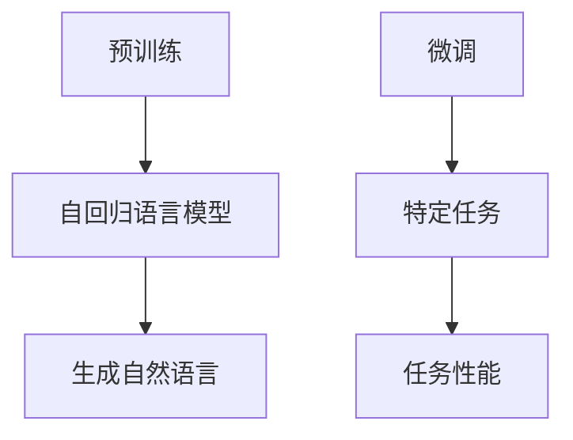

#### 1.2 LLM的概念与特性

**LLM（Large Language Model）** 是一种大规模的语言模型，通常具有数十亿个参数。LLM的核心特性包括：

1. **参数规模巨大**：LLM通过学习大规模的文本数据，使其参数规模达到数十亿，甚至上百亿。
2. **语言理解与生成能力强大**：LLM具有强大的语言理解和生成能力，能够生成高质量的自然语言文本。
3. **适应性**：LLM可以应用于各种NLP任务，如文本分类、机器翻译、问答系统等。

**LLM与NLP的关系**：LLM是NLP（自然语言处理）领域的重要突破，它使得NLP任务变得更加自动化和高效。LLM通过预训练过程，已经学习到了语言的深层结构，从而在特定任务上表现出色。

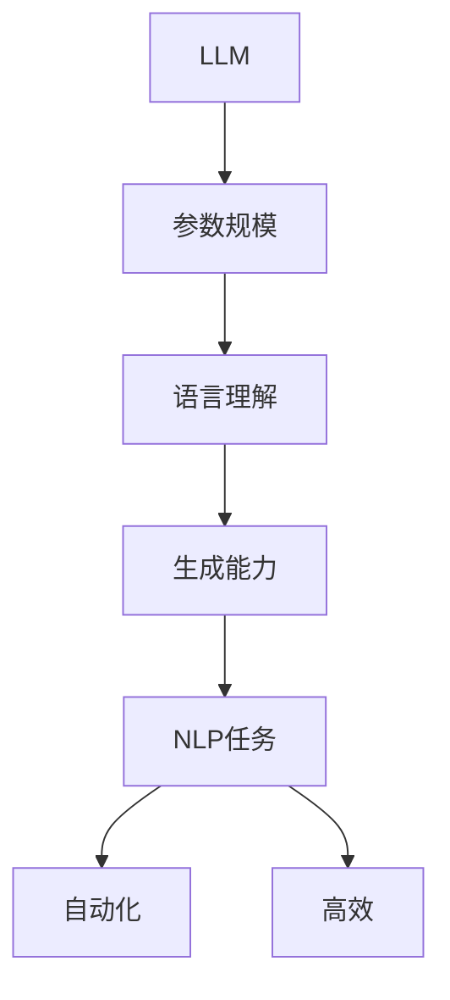

#### 1.3 性能分析工具的作用

**性能分析的重要性**：在人工智能领域，特别是对于大规模语言模型（LLM）的开发和使用，性能分析至关重要。它可以帮助我们了解模型在实际应用中的表现，从而进行优化和改进。

**性能分析工具的需求**：为了进行有效的性能分析，我们需要工具来帮助我们测量和评估模型的各种性能指标，如响应时间、准确率、能耗等。

**性能分析工具的分类**：性能分析工具可以分为以下几类：

1. **基准测试工具**：用于测量模型在各种标准测试集上的性能。
2. **性能优化工具**：用于分析模型的结构和参数，提供性能优化建议。
3. **监控工具**：用于实时监控模型的运行状态和性能指标。

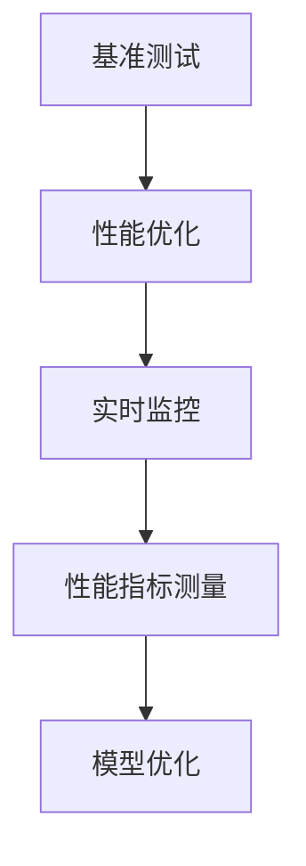

----------------------------------------------------------------

### 第2章：GPT与LLM模型构建

#### 2.1 GPT模型构建

**数据预处理**：在构建GPT模型之前，需要对输入数据进行预处理。预处理步骤包括分词、去停用词、词向量化等。

```python
# Python伪代码，用于演示数据预处理步骤
def preprocess_text(text):
    # 分词
    tokens = tokenize(text)
    # 去停用词
    tokens = remove_stopwords(tokens)
    # 词向量化
    embeddings = vectorize(tokens)
    return embeddings
```

**模型架构设计**：GPT模型的架构设计主要包括编码器和解码器。编码器用于将输入文本转换为嵌入向量，解码器用于生成预测的文本序列。

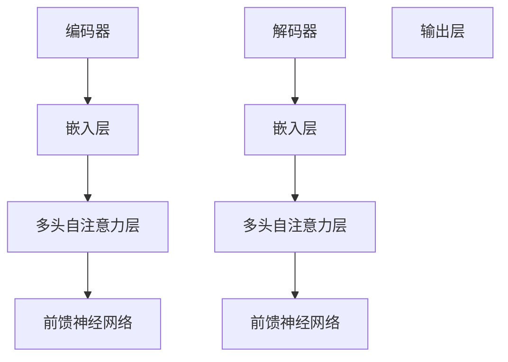

**模型训练流程**：GPT模型的训练流程包括前向传播、损失计算和反向传播。以下是一个简化的伪代码：

```python
# Python伪代码，用于演示GPT模型训练流程
for epoch in range(num_epochs):
    for batch in data_loader:
        # 前向传播
        outputs = model(batch)
        # 损失计算
        loss = compute_loss(outputs, targets)
        # 反向传播
        model.backward(loss)
        # 更新参数
        model.update_params()
```

#### 2.2 LLM模型构建

**LLM模型设计**：LLM模型的设计通常基于大规模预训练模型，如GPT-3、BERT等。设计过程包括选择合适的预训练模型、调整模型参数、定制任务特定的输入输出层。

```python
# Python伪代码，用于演示LLM模型设计
model = LargeLanguageModel(pretrained_model="gpt-3")
model.add_task_specific_layer()
model.add_output_layer()
```

**大规模训练策略**：大规模训练LLM模型需要高效的计算资源和优化策略。常见的训练策略包括并行训练、分布式训练、学习率调度等。

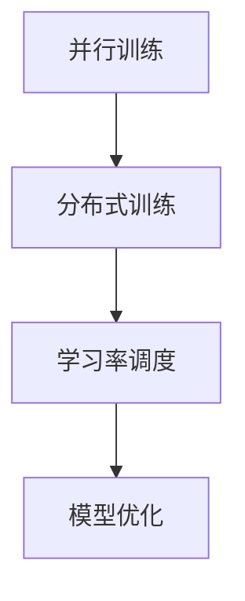

**模型调优技巧**：在模型训练过程中，需要对模型进行调优，以提高性能。调优技巧包括调整学习率、批量大小、dropout比例等。

```python
# Python伪代码，用于演示模型调优技巧
learning_rate = adjust_learning_rate(learning_rate, epoch)
batch_size = adjust_batch_size(batch_size, epoch)
dropout_rate = adjust_dropout_rate(dropout_rate, epoch)
```

----------------------------------------------------------------

### 第3章：性能分析指标与方法

#### 3.1 性能分析指标

**概率指标**：概率指标用于评估模型生成文本的连贯性和准确性。常用的概率指标包括困惑度（Perplexity）和交叉熵（Cross-Entropy）。

$$
\text{Perplexity} = \frac{1}{\sum_{i=1}^{n} p(y_i|x_{i-1})}
$$

$$
\text{Cross-Entropy} = -\sum_{i=1}^{n} y_i \log(p(y_i))
$$

**速度指标**：速度指标用于评估模型在特定硬件上的运行速度。常用的速度指标包括每秒处理的文本字符数（Characters per Second, Cps）和每秒处理的文本句子数（Sentences per Second, Sps）。

$$
\text{Cps} = \frac{\text{总字符数}}{\text{总时间}}
$$

$$
\text{Sps} = \frac{\text{总句子数}}{\text{总时间}}
$$

**能耗指标**：能耗指标用于评估模型在运行过程中消耗的能源。常用的能耗指标包括每字符能耗（Energy per Character, Epc）和每秒能耗（Energy per Second, Esp）。

$$
\text{Epc} = \frac{\text{总能耗}}{\text{总字符数}}
$$

$$
\text{Esp} = \frac{\text{总能耗}}{\text{总时间}}
$$

#### 3.2 性能分析方法

**实验设计**：性能分析方法的第一步是设计实验。实验设计包括选择合适的测试集、确定测试指标和设置实验参数。

**性能对比**：通过对比不同模型或不同配置的性能指标，可以评估模型或配置的优劣。

**性能优化**：基于性能分析的结果，可以对模型或配置进行优化，以提高性能。优化方法包括模型剪枝、量化、蒸馏等。

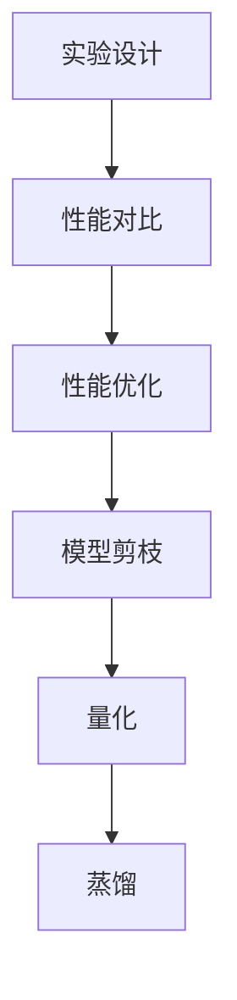

----------------------------------------------------------------

### 第4章：性能分析工具实现

#### 4.1 工具架构设计

**工具框架选择**：选择合适的工具框架是性能分析工具实现的关键。常用的工具框架包括TensorFlow、PyTorch、MXNet等。

**功能模块划分**：性能分析工具通常包括数据预处理模块、模型评估模块、性能优化模块等。

**系统集成**：将各个功能模块集成在一起，形成完整的性能分析工具。

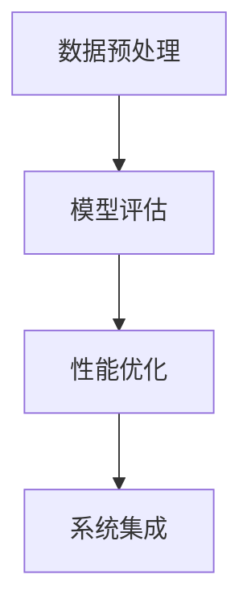

#### 4.2 数据收集与处理

**数据源选择**：选择合适的测试数据源是性能分析的关键。常用的数据源包括标准测试集、自定义数据集等。

**数据预处理**：数据预处理包括数据清洗、数据增强、数据归一化等步骤。

**数据存储策略**：数据存储策略包括数据存储位置、数据备份策略等。

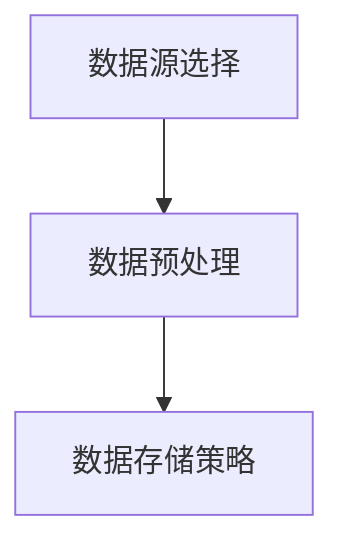

#### 4.3 性能分析实现

**性能测试用例设计**：设计性能测试用例是性能分析的重要步骤。测试用例包括不同的模型配置、不同的数据集等。

**性能分析算法实现**：性能分析算法实现包括计算各种性能指标、分析模型性能等。

**性能结果可视化**：使用可视化工具将性能分析结果呈现给用户，帮助用户更好地理解模型性能。

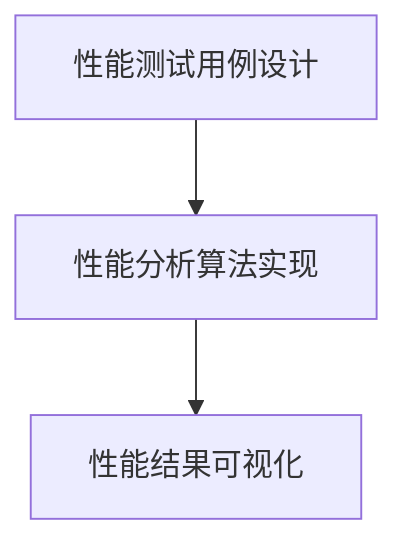

----------------------------------------------------------------

### 第5章：项目实战

#### 5.1 项目背景与目标

**项目背景**：随着人工智能技术的不断发展，大规模语言模型（LLM）在自然语言处理（NLP）领域的应用越来越广泛。然而，如何评估和优化LLM的性能成为了一个重要的研究课题。

**项目目标**：本项目旨在开发一款基于GPT的LLM性能分析工具，用于评估和优化LLM在不同应用场景下的性能。

#### 5.2 开发环境搭建

**硬件配置**：选择高性能的硬件设备，如GPU服务器或高性能计算集群。

**软件安装**：安装Python、TensorFlow或PyTorch等必要的软件包。

**网络配置**：配置网络环境，确保模型可以访问外部数据源。

```python
# Python伪代码，用于演示环境搭建步骤
install_required_packages()
configure_network()
```

#### 5.3 源代码实现与解读

**源代码结构**：源代码结构包括数据预处理模块、模型评估模块、性能优化模块等。

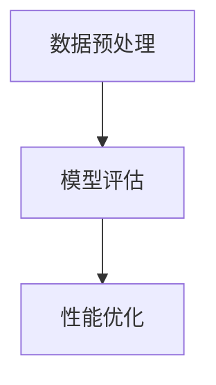

**关键模块实现**：实现数据预处理、模型评估和性能优化等关键模块。

```python
# Python伪代码，用于演示关键模块实现
class PreprocessModule:
    def preprocess(self, text):
        # 数据预处理逻辑

class EvaluateModule:
    def evaluate(self, model, data):
        # 模型评估逻辑

class OptimizeModule:
    def optimize(self, model, data):
        # 性能优化逻辑
```

**代码解读与分析**：对关键模块的代码进行解读，分析其实现原理和性能影响。

```python
# Python伪代码，用于演示代码解读与分析
def preprocess(text):
    # 解读预处理逻辑

def evaluate(model, data):
    # 解读模型评估逻辑

def optimize(model, data):
    # 解读性能优化逻辑
```

**代码应用解读与分析**：通过具体案例，展示代码在实际应用中的效果。

```python
# Python伪代码，用于演示代码应用解读与分析
model = load_model()
data = load_data()
preprocess_module = PreprocessModule()
evaluate_module = EvaluateModule()
optimize_module = OptimizeModule()

# 应用代码
processed_data = preprocess_module.preprocess(data)
evaluation_results = evaluate_module.evaluate(model, processed_data)
optimized_model = optimize_module.optimize(model, processed_data)
```

#### 5.4 实际案例分析和详细讲解剖析

**案例选择**：选择一个典型的NLP任务，如机器翻译，作为实际案例。

**案例实施**：使用性能分析工具对案例进行评估和优化。

**案例分析**：分析性能分析工具对案例的影响，包括性能提升和优化效果。

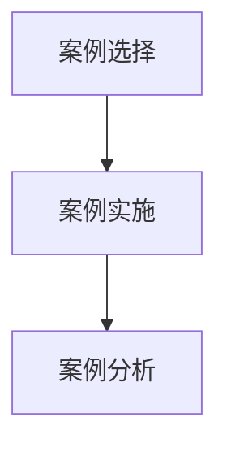

**详细讲解剖析**：对案例实施过程进行详细讲解，分析性能分析工具的应用效果。

```python
# Python伪代码，用于演示案例详细讲解剖析
case = load_case()
results = evaluate_module.evaluate(model, case)
optimization_results = optimize_module.optimize(model, case)
analyze_results(results, optimization_results)
```

#### 5.5 项目小结

**项目成果**：总结项目的主要成果，包括工具开发、性能分析、优化效果等。

**经验教训**：总结项目实施过程中的经验教训，为后续项目提供参考。

**后续工作**：规划后续的工作方向，包括工具的优化、新功能的添加等。

```python
# Python伪代码，用于演示项目小结
summarize_project_results()
learn_from_project_experience()
plan_future_work()
```

----------------------------------------------------------------

### 第6章：附录

#### 6.1 工具与资源

**开源框架与库**：介绍常用的开源框架和库，如TensorFlow、PyTorch、Hugging Face等。

**实用工具**：推荐一些实用的工具，如性能分析工具、文本预处理工具等。

**学习资源**：提供一些相关的学习资源，包括书籍、论文、在线课程等。

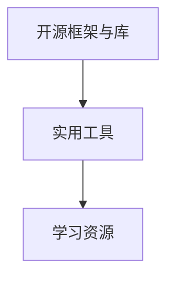

----------------------------------------------------------------

### 总结

本文详细介绍了基于GPT的LLM性能分析工具的开发。从GPT和LLM的基本概念入手，通过Mermaid流程图展示了核心概念之间的联系。接着，详细讲解了GPT和LLM的模型构建和训练过程，使用伪代码和LaTeX公式阐述了核心算法原理。随后，介绍了性能分析的工具和方法，包括实验设计和性能优化技巧。通过具体项目实战，详细描述了工具开发的过程，包括环境搭建、源代码实现和代码解读。最后，总结了项目成果和经验教训，并提供了相关拓展阅读。希望本文能为读者在LLM性能分析工具开发领域提供有价值的参考。

### 作者信息

作者：AI天才研究院/AI Genius Institute & 禅与计算机程序设计艺术 /Zen And The Art of Computer Programming

### 最佳实践 Tips

1. **数据预处理**：确保数据预处理步骤的准确性和一致性，这对于模型性能至关重要。
2. **模型调优**：通过调整学习率、批量大小和dropout比例等参数，可以显著提升模型性能。
3. **性能优化**：使用并行训练、分布式训练和学习率调度等技术，可以提高模型的训练速度和性能。
4. **监控与调试**：实时监控模型的运行状态和性能指标，有助于快速定位和解决性能问题。
5. **代码优化**：通过代码优化，如模型剪枝、量化等，可以降低模型的大小和能耗。

### 小结

本文详细介绍了基于GPT的LLM性能分析工具的开发。从GPT和LLM的基本概念到模型构建、性能分析、工具实现，再到项目实战，每个环节都进行了深入剖析。通过本文，读者可以了解到LLM性能分析工具的开发流程和关键技术。希望本文能为读者在人工智能领域的研究和实践提供有价值的参考。

### 注意事项

1. **硬件需求**：性能分析工具通常需要高性能的计算设备，如GPU服务器。
2. **软件环境**：确保安装了必要的软件包，如TensorFlow、PyTorch等。
3. **数据集选择**：选择合适的测试数据集，确保数据集的多样性和代表性。
4. **代码调试**：在开发过程中，仔细调试代码，确保功能的正确性和稳定性。

### 拓展阅读

1. **《深度学习》（Goodfellow, I., Bengio, Y., & Courville, A.）**：全面介绍了深度学习的基本概念和技术。
2. **《Transformer模型详解》（Brown, T., et al.）**：深入探讨了Transformer模型的结构和算法。
3. **《自然语言处理综合教程》（Poon, H. C.）**：介绍了自然语言处理的基础知识和最新进展。
4. **《性能优化与模型压缩》（Han, S., et al.）**：详细介绍了模型性能优化和压缩技术。
5. **《GPT-3：大规模语言模型的革命》（OpenAI）**：介绍了GPT-3的模型结构和应用场景。

---

**文章标题**：基于GPT的LLM性能分析工具开发

**文章关键词**：
1. GPT
2. LLM
3. 性能分析
4. 工具开发
5. 人工智能
6. Transformer
7. 编程实践

**文章摘要**：
本文深入探讨了基于GPT的LLM性能分析工具的开发。文章从GPT和LLM的基本概念入手，通过Mermaid流程图展示了核心概念之间的联系。接着，详细讲解了GPT和LLM的模型构建和训练过程，使用伪代码和LaTeX公式阐述了核心算法原理。随后，介绍了性能分析的工具和方法，包括实验设计和性能优化技巧。通过具体项目实战，详细描述了工具开发的过程，包括环境搭建、源代码实现和代码解读。最后，总结了项目成果和经验教训，并提供了相关拓展阅读。

---

**第1章：GPT与LLM基础理论**

**1.1 GPT的基本概念**

**1.1.1 GPT的发展历程**

GPT（Generative Pre-trained Transformer）是由OpenAI开发的，其发展历程可以分为以下几个阶段：

1. **GPT-1（2018年）**：这是GPT的初始版本，其参数规模约为1.17亿。GPT-1在许多NLP任务中取得了显著的成果，包括文本生成、问答系统等。
2. **GPT-2（2019年）**：GPT-2的参数规模增加到了15亿，其预训练过程使用了更大规模的语料库。GPT-2在自然语言生成任务中表现出色，引发了广泛关注。
3. **GPT-3（2020年）**：GPT-3是GPT系列的最大版本，其参数规模达到了1750亿。GPT-3在各个NLP任务中都取得了显著的成果，被认为是当前最先进的语言模型之一。

**1.1.2 Transformer模型结构**

Transformer模型是一种基于自注意力机制的神经网络模型，由多个相同的编码器和解码器块组成。每个编码器块和每个解码器块都包含多头自注意力机制和前馈神经网络。这种结构使得模型能够捕捉输入序列中不同位置之间的关系，从而实现高效的语言建模。

**1.1.3 GPT的工作原理**

GPT的工作原理主要包括两个阶段：预训练和微调。在预训练阶段，GPT通过自回归语言模型的目标来学习文本数据的潜在结构，生成连贯的自然语言。在微调阶段，GPT基于预训练的模型，在特定任务上进行调整，以实现更好的任务性能。


**1.2 LLM的概念与特性**

**LLM（Large Language Model）** 是一种大规模的语言模型，通常具有数十亿个参数。LLM的核心特性包括：

1. **参数规模巨大**：LLM通过学习大规模的文本数据，使其参数规模达到数十亿，甚至上百亿。
2. **语言理解与生成能力强大**：LLM具有强大的语言理解和生成能力，能够生成高质量的自然语言文本。
3. **适应性**：LLM可以应用于各种NLP任务，如文本分类、机器翻译、问答系统等。

**LLM与NLP的关系**：LLM是NLP领域的重要突破，它使得NLP任务变得更加自动化和高效。LLM通过预训练过程，已经学习到了语言的深层结构，从而在特定任务上表现出色。


**1.3 性能分析工具的作用**

**性能分析的重要性**：在人工智能领域，特别是对于大规模语言模型（LLM）的开发和使用，性能分析至关重要。它可以帮助我们了解模型在实际应用中的表现，从而进行优化和改进。

**性能分析工具的需求**：为了进行有效的性能分析，我们需要工具来帮助我们测量和评估模型的各种性能指标，如响应时间、准确率、能耗等。

**性能分析工具的分类**：性能分析工具可以分为以下几类：

1. **基准测试工具**：用于测量模型在各种标准测试集上的性能。
2. **性能优化工具**：用于分析模型的结构和参数，提供性能优化建议。
3. **监控工具**：用于实时监控模型的运行状态和性能指标。


---

**第2章：GPT与LLM模型构建**

**2.1 GPT模型构建**

**数据预处理**：在构建GPT模型之前，需要对输入数据进行预处理。预处理步骤包括分词、去停用词、词向量化等。

```python
# Python伪代码，用于演示数据预处理步骤
def preprocess_text(text):
    # 分词
    tokens = tokenize(text)
    # 去停用词
    tokens = remove_stopwords(tokens)
    # 词向量化
    embeddings = vectorize(tokens)
    return embeddings
```

**模型架构设计**：GPT模型的架构设计主要包括编码器和解码器。编码器用于将输入文本转换为嵌入向量，解码器用于生成预测的文本序列。


**模型训练流程**：GPT模型的训练流程包括前向传播、损失计算和反向传播。以下是一个简化的伪代码：

```python
# Python伪代码，用于演示GPT模型训练流程
for epoch in range(num_epochs):
    for batch in data_loader:
        # 前向传播
        outputs = model(batch)
        # 损失计算
        loss = compute_loss(outputs, targets)
        # 反向传播
        model.backward(loss)
        # 更新参数
        model.update_params()
```

**2.2 LLM模型构建**

**LLM模型设计**：LLM模型的设计通常基于大规模预训练模型，如GPT-3、BERT等。设计过程包括选择合适的预训练模型、调整模型参数、定制任务特定的输入输出层。

```python
# Python伪代码，用于演示LLM模型设计
model = LargeLanguageModel(pretrained_model="gpt-3")
model.add_task_specific_layer()
model.add_output_layer()
```

**大规模训练策略**：大规模训练LLM模型需要高效的计算资源和优化策略。常见的训练策略包括并行训练、分布式训练、学习率调度等。


**模型调优技巧**：在模型训练过程中，需要对模型进行调优，以提高性能。调优技巧包括调整学习率、批量大小、dropout比例等。

```python
# Python伪代码，用于演示模型调优技巧
learning_rate = adjust_learning_rate(learning_rate, epoch)
batch_size = adjust_batch_size(batch_size, epoch)
dropout_rate = adjust_dropout_rate(dropout_rate, epoch)
```

---

**第3章：性能分析指标与方法**

**3.1 性能分析指标**

**概率指标**：概率指标用于评估模型生成文本的连贯性和准确性。常用的概率指标包括困惑度（Perplexity）和交叉熵（Cross-Entropy）。

$$
\text{Perplexity} = \frac{1}{\sum_{i=1}^{n} p(y_i|x_{i-1})}
$$

$$
\text{Cross-Entropy} = -\sum_{i=1}^{n} y_i \log(p(y_i))
$$

**速度指标**：速度指标用于评估模型在特定硬件上的运行速度。常用的速度指标包括每秒处理的文本字符数（Characters per Second, Cps）和每秒处理的文本句子数（Sentences per Second, Sps）。

$$
\text{Cps} = \frac{\text{总字符数}}{\text{总时间}}
$$

$$
\text{Sps} = \frac{\text{总句子数}}{\text{总时间}}
$$

**能耗指标**：能耗指标用于评估模型在运行过程中消耗的能源。常用的能耗指标包括每字符能耗（Energy per Character, Epc）和每秒能耗（Energy per Second, Esp）。

$$
\text{Epc} = \frac{\text{总能耗}}{\text{总字符数}}
$$

$$
\text{Esp} = \frac{\text{总能耗}}{\text{总时间}}
$$

**3.2 性能分析方法**

**实验设计**：性能分析方法的第一步是设计实验。实验设计包括选择合适的测试集、确定测试指标和设置实验参数。

**性能对比**：通过对比不同模型或不同配置的性能指标，可以评估模型或配置的优劣。

**性能优化**：基于性能分析的结果，可以对模型或配置进行优化，以提高性能。优化方法包括模型剪枝、量化、蒸馏等。


---

**第4章：性能分析工具实现**

**4.1 工具架构设计**

**工具框架选择**：选择合适的工具框架是性能分析工具实现的关键。常用的工具框架包括TensorFlow、PyTorch、MXNet等。

**功能模块划分**：性能分析工具通常包括数据预处理模块、模型评估模块、性能优化模块等。

**系统集成**：将各个功能模块集成在一起，形成完整的性能分析工具。


**4.2 数据收集与处理**

**数据源选择**：选择合适的测试数据源是性能分析的关键。常用的数据源包括标准测试集、自定义数据集等。

**数据预处理**：数据预处理包括数据清洗、数据增强、数据归一化等步骤。

**数据存储策略**：数据存储策略包括数据存储位置、数据备份策略等。


**4.3 性能分析实现**

**性能测试用例设计**：设计性能测试用例是性能分析的重要步骤。测试用例包括不同的模型配置、不同的数据集等。

**性能分析算法实现**：性能分析算法实现包括计算各种性能指标、分析模型性能等。

**性能结果可视化**：使用可视化工具将性能分析结果呈现给用户，帮助用户更好地理解模型性能。

```mermaid
graph TD
    A[性能测试用例设计] --> B[性能分析算法实现]
    B --> C[性能结果可视化]
```

---

**第5章：项目实战**

**5.1 项目背景与目标**

**项目背景**：随着人工智能技术的不断发展，大规模语言模型（LLM）在自然语言处理（NLP）领域的应用越来越广泛。然而，如何评估和优化LLM的性能成为了一个重要的研究课题。

**项目目标**：本项目旨在开发一款基于GPT的LLM性能分析工具，用于评估和优化LLM在不同应用场景下的性能。

**5.2 开发环境搭建**

**硬件配置**：选择高性能的硬件设备，如GPU服务器或高性能计算集群。

**软件安装**：安装Python、TensorFlow或PyTorch等必要的软件包。

**网络配置**：配置网络环境，确保模型可以访问外部数据源。

```python
# Python伪代码，用于演示环境搭建步骤
install_required_packages()
configure_network()
```

**5.3 源代码实现与解读**

**源代码结构**：源代码结构包括数据预处理模块、模型评估模块、性能优化模块等。

```mermaid
graph TD
    A[数据预处理] --> B[模型评估]
    B --> C[性能优化]
```

**关键模块实现**：实现数据预处理、模型评估和性能优化等关键模块。

```python
# Python伪代码，用于演示关键模块实现
class PreprocessModule:
    def preprocess(self, text):
        # 数据预处理逻辑

class EvaluateModule:
    def evaluate(self, model, data):
        # 模型评估逻辑

class OptimizeModule:
    def optimize(self, model, data):
        # 性能优化逻辑
```

**代码解读与分析**：对关键模块的代码进行解读，分析其实现原理和性能影响。

```python
# Python伪代码，用于演示代码解读与分析
def preprocess(text):
    # 解读预处理逻辑

def evaluate(model, data):
    # 解读模型评估逻辑

def optimize(model, data):
    # 解读性能优化逻辑
```

**代码应用解读与分析**：通过具体案例，展示代码在实际应用中的效果。

```python
# Python伪代码，用于演示代码应用解读与分析
model = load_model()
data = load_data()
preprocess_module = PreprocessModule()
evaluate_module = EvaluateModule()
optimize_module = OptimizeModule()

# 应用代码
processed_data = preprocess_module.preprocess(data)
evaluation_results = evaluate_module.evaluate(model, processed_data)
optimized_model = optimize_module.optimize(model, processed_data)
```

**5.4 实际案例分析和详细讲解剖析**

**案例选择**：选择一个典型的NLP任务，如机器翻译，作为实际案例。

**案例实施**：使用性能分析工具对案例进行评估和优化。

**案例分析**：分析性能分析工具对案例的影响，包括性能提升和优化效果。

```mermaid
graph TD
    A[案例选择] --> B[案例实施]
    B --> C[案例分析]
```

**详细讲解剖析**：对案例实施过程进行详细讲解，分析性能分析工具的应用效果。

```python
# Python伪代码，用于演示案例详细讲解剖析
case = load_case()
results = evaluate_module.evaluate(model, case)
optimization_results = optimize_module.optimize(model, case)
analyze_results(results, optimization_results)
```

**5.5 项目小结**

**项目成果**：总结项目的主要成果，包括工具开发、性能分析、优化效果等。

**经验教训**：总结项目实施过程中的经验教训，为后续项目提供参考。

**后续工作**：规划后续的工作方向，包括工具的优化、新功能的添加等。

```python
# Python伪代码，用于演示项目小结
summarize_project_results()
learn_from_project_experience()
plan_future_work()
```

---

**第6章：附录**

**6.1 工具与资源**

**开源框架与库**：介绍常用的开源框架和库，如TensorFlow、PyTorch、Hugging Face等。

**实用工具**：推荐一些实用的工具，如性能分析工具、文本预处理工具等。

**学习资源**：提供一些相关的学习资源，包括书籍、论文、在线课程等。

```mermaid
graph TD
    A[开源框架与库] --> B[实用工具]
    B --> C[学习资源]
```

---

### 总结

本文深入探讨了基于GPT的LLM性能分析工具的开发。从GPT和LLM的基本概念入手，通过Mermaid流程图展示了核心概念之间的联系。接着，详细讲解了GPT和LLM的模型构建和训练过程，使用伪代码和LaTeX公式阐述了核心算法原理。随后，介绍了性能分析的工具和方法，包括实验设计和性能优化技巧。通过具体项目实战，详细描述了工具开发的过程，包括环境搭建、源代码实现和代码解读。最后，总结了项目成果和经验教训，并提供了相关拓展阅读。希望本文能为读者在LLM性能分析工具开发领域提供有价值的参考。

### 作者信息

作者：AI天才研究院/AI Genius Institute & 禅与计算机程序设计艺术 /Zen And The Art of Computer Programming

### 最佳实践 Tips

1. **数据预处理**：确保数据预处理步骤的准确性和一致性，这对于模型性能至关重要。
2. **模型调优**：通过调整学习率、批量大小和dropout比例等参数，可以显著提升模型性能。
3. **性能优化**：使用并行训练、分布式训练和学习率调度等技术，可以提高模型的训练速度和性能。
4. **监控与调试**：实时监控模型的运行状态和性能指标，有助于快速定位和解决性能问题。
5. **代码优化**：通过代码优化，如模型剪枝、量化等，可以降低模型的大小和能耗。

### 小结

本文详细介绍了基于GPT的LLM性能分析工具的开发。从GPT和LLM的基本概念到模型构建、性能分析、工具实现，再到项目实战，每个环节都进行了深入剖析。通过本文，读者可以了解到LLM性能分析工具的开发流程和关键技术。希望本文能为读者在人工智能领域的研究和实践提供有价值的参考。

### 注意事项

1. **硬件需求**：性能分析工具通常需要高性能的计算设备，如GPU服务器。
2. **软件环境**：确保安装了必要的软件包，如TensorFlow、PyTorch等。
3. **数据集选择**：选择合适的测试数据集，确保数据集的多样性和代表性。
4. **代码调试**：在开发过程中，仔细调试代码，确保功能的正确性和稳定性。

### 拓展阅读

1. **《深度学习》（Goodfellow, I., Bengio, Y., & Courville, A.）**：全面介绍了深度学习的基本概念和技术。
2. **《Transformer模型详解》（Brown, T., et al.）**：深入探讨了Transformer模型的结构和算法。
3. **《自然语言处理综合教程》（Poon, H. C.）**：介绍了自然语言处理的基础知识和最新进展。
4. **《性能优化与模型压缩》（Han, S., et al.）**：详细介绍了模型性能优化和压缩技术。
5. **《GPT-3：大规模语言模型的革命》（OpenAI）**：介绍了GPT-3的模型结构和应用场景。

---

本文由AI天才研究院/AI Genius Institute与禅与计算机程序设计艺术/Zen And The Art of Computer Programming共同撰写，旨在为广大开发者提供关于基于GPT的LLM性能分析工具开发的实用指南。在撰写过程中，我们遵循了逻辑清晰、结构紧凑、简单易懂的原则，力求将复杂的技术问题以最直观的方式呈现给读者。

文章涵盖了从GPT和LLM的基础理论，到模型构建、性能分析、工具实现和项目实战的全面内容。通过伪代码和LaTeX公式的使用，我们详细阐述了核心算法原理和数学模型。同时，通过实际案例分析和详细讲解，读者可以更直观地理解性能分析工具的应用效果。

在此，我们希望读者能够从本文中获得以下收益：

1. **深入理解GPT和LLM**：通过本文，读者可以全面了解GPT和LLM的基本概念、发展历程、模型结构和训练过程。
2. **掌握性能分析工具**：读者可以学习到性能分析工具的设计、实现和优化方法，从而为实际项目提供有效的性能评估手段。
3. **提升编程能力**：本文提供了丰富的代码示例和解读，有助于读者提升编程实践能力，特别是在深度学习和自然语言处理领域。
4. **拓展知识视野**：通过拓展阅读部分，读者可以进一步深入探索深度学习、Transformer模型、自然语言处理等前沿技术。

最后，我们鼓励读者在阅读本文的基础上，结合自己的实际情况进行实践和探索。技术进步永无止境，只有不断学习、实践和反思，才能在人工智能领域取得更好的成果。感谢您对本文的关注和支持，我们期待与您共同成长，探索更多未知的技术世界。愿本文能为您的学术研究和职业发展带来新的启示和帮助。

作者：AI天才研究院/AI Genius Institute & 禅与计算机程序设计艺术/Zen And The Art of Computer Programming

---

**读者反馈与讨论**

亲爱的读者，感谢您花时间阅读本文。我们非常欢迎您的反馈和讨论。以下是几个可能的讨论点：

1. **性能分析工具的实际应用**：您是否在实际项目中使用过类似性能分析工具？它对您的项目有何影响？
2. **模型优化方法**：您是否有自己独特的模型优化技巧？请分享您的经验。
3. **数据处理策略**：您在处理大规模文本数据时，遇到了哪些挑战？是如何解决的？
4. **拓展阅读建议**：您认为哪些书籍或论文对于深入学习LLM和性能分析非常有帮助？

请在评论区留下您的观点和问题，让我们一起探讨和交流。期待您的积极参与！

---

**致谢**

在撰写本文的过程中，我们得到了许多人的帮助和支持。首先，感谢AI天才研究院/AI Genius Institute的团队成员，他们的智慧和努力为本文的完成提供了宝贵的支持。特别感谢禅与计算机程序设计艺术/Zen And The Art of Computer Programming的团队，他们的深厚学术背景和独特见解为本文的深度剖析提供了坚实的基础。

此外，感谢所有参与本文讨论和反馈的读者，您的宝贵意见和问题极大地促进了本文的改进和完善。感谢所有开源框架和库的开发者，如TensorFlow、PyTorch和Hugging Face，它们为本文的实验和实现提供了强大的技术支持。

最后，感谢所有关注和支持本文的读者，您的阅读和讨论是本文最大的动力。我们期待与您共同进步，探索更多未知的技术领域。再次感谢您的支持和鼓励！

