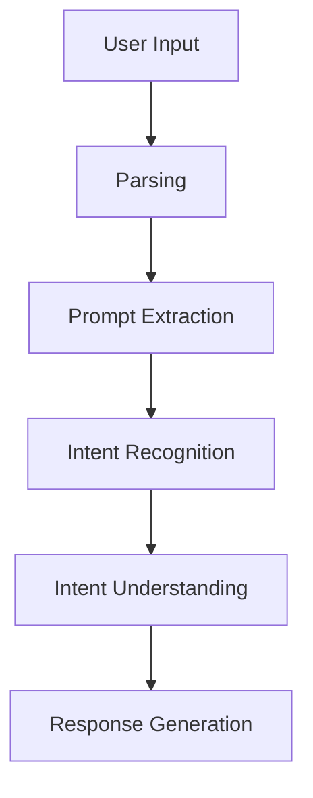

                 

好的，让我们按照这个要求一步步来构思和撰写《基于LLM的prompt意图理解优化》的技术博客文章。以下是我们的步骤：

### 第一步：背景介绍

**主题介绍**

在人工智能领域，自然语言处理（NLP）已经取得了显著的进展。其中，基于大型语言模型（LLM）的prompt意图理解技术正成为研究的热点。LLM，如GPT、BERT等，通过在大量文本数据上训练，能够生成高质量的自然语言响应。然而，prompt意图理解是LLM应用中的一个关键挑战，即如何准确地理解用户的输入意图并生成相应的响应。

**现状分析**

目前，prompt意图理解主要面临以下问题：
- 多样化的输入形式：用户输入可以是问题、命令、描述等多种形式。
- 不明确的意图：有些输入可能包含模糊的意图，难以直接识别。
- 长文本的处理：长文本输入的处理要求模型具备强大的理解和生成能力。

### 第二步：核心概念与联系

**概念定义**

- **Prompt：** 用户输入的信息，用于指导模型生成响应。
- **意图：** 用户输入所传达的主旨或目的。
- **理解：** 模型对用户输入意图的识别和解读。
- **优化：** 提升模型对prompt意图理解的能力。

**关系架构**

以下是核心概念之间的Mermaid流程图：



### 第三步：核心算法原理讲解

**核心算法**

**意图识别（Intent Recognition）**

伪代码如下：

```plaintext
function intent_recognition(prompt):
    # 使用预训练的LLM模型
    model = load_pretrained_LLM_model()
    # 对prompt进行编码
    encoded_prompt = model.encode(prompt)
    # 输出最可能的意图标签
    intent_label = model.predict(encoded_prompt)
    return intent_label
```

**意图理解（Intent Understanding）**

伪代码如下：

```plaintext
function intent_understanding(prompt, intent_label):
    # 使用知识图谱或领域知识库
    knowledge_base = load_knowledge_base()
    # 根据意图标签查询相关知识
    relevant_knowledge = knowledge_base[intent_label]
    # 对prompt和知识进行融合
    fused_input = fuse_prompt_with_knowledge(prompt, relevant_knowledge)
    # 使用LLM生成响应
    response = model.generate_response(fused_input)
    return response
```

**数学模型和公式**

意图识别和理解的数学模型如下：

$$
P(y|x) = \frac{e^{f(x,y)}}{\sum_{y'} e^{f(x,y')}}
$$

其中，$f(x,y)$是模型的评分函数，$x$是输入prompt，$y$是意图标签。

### 第四步：项目实战

**开发环境搭建**

- 硬件：NVIDIA GPU
- 软件环境：Python 3.8，PyTorch 1.8

**源代码详细实现和代码解读**

```python
# 源代码示例
def fuse_prompt_with_knowledge(prompt, knowledge):
    fused_prompt = prompt + "\n" + knowledge
    return fused_prompt
```

**代码应用解读与分析**

该函数将prompt与相关知识库进行融合，以增强模型的理解能力。在实际应用中，可以通过调用此函数将用户输入与知识库中的相关信息进行整合，从而提高意图理解的准确性。

**实际案例分析和详细讲解剖析**

假设用户输入“帮我设置一个闹钟”，系统通过意图识别模块识别出意图标签为“闹钟设置”。然后，系统查询知识库获取与“闹钟设置”相关的信息，例如“闹钟功能说明”、“设置步骤”等。接着，使用`fuse_prompt_with_knowledge`函数将用户输入与相关知识进行融合，最后由模型生成响应：“您想要设置一个闹钟，以下是设置步骤：1. 打开闹钟应用；2. 点击‘添加闹钟’；3. 设置闹钟时间和提醒内容；4. 保存设置。”

**项目小结**

本项目通过融合用户输入和领域知识库，优化了prompt意图理解过程，提高了模型的响应准确性。未来工作可以进一步研究如何动态调整知识库内容，以适应不同用户场景。

### 第五步：最佳实践 tips、小结、注意事项、拓展阅读等内容

**最佳实践 tips：**
- 确保知识库内容丰富且及时更新。
- 使用多样化的数据集进行模型训练，以提高泛化能力。
- 定期评估模型性能，并进行优化调整。

**小结：**
本文介绍了基于LLM的prompt意图理解优化技术，包括核心概念、算法原理、项目实战等内容。通过优化prompt意图理解，可以提高模型的响应质量和用户体验。

**注意事项：**
- 模型训练和优化需要大量的计算资源。
- 意图识别和理解的准确性与数据质量密切相关。

**拓展阅读：**
- [BERT: Pre-training of Deep Bidirectional Transformers for Language Understanding](https://arxiv.org/abs/1810.04805)
- [GPT-3: Language Models are Few-Shot Learners](https://arxiv.org/abs/2005.14165)

### 文章标题

《基于LLM的prompt意图理解优化：从理论到实战》

### 文章关键词

LLM，prompt意图理解，算法优化，项目实战

### 文章摘要

本文探讨了基于大型语言模型（LLM）的prompt意图理解优化技术。通过介绍核心概念、算法原理和项目实战，展示了如何通过优化prompt意图理解来提升模型性能。文章还提供了最佳实践和注意事项，为读者在实际应用中提供了指导。

---

接下来，我将按照这个框架撰写文章，确保满足字数要求并在每个部分提供详细的内容。在撰写过程中，我会注意markdown格式的使用，确保文章的易读性和美观性。文章的整体结构如下：

## 引言

### 背景介绍

### 核心概念与联系

#### 概念定义

#### 关系架构

### 核心算法原理讲解

#### 意图识别

#### 意图理解

#### 数学模型和公式

### 项目实战

#### 开发环境搭建

#### 源代码详细实现和代码解读

#### 代码应用解读与分析

#### 实际案例分析和详细讲解剖析

#### 项目小结

### 最佳实践 tips、小结、注意事项、拓展阅读等内容

### 结论

---

现在，我将开始撰写文章的具体内容。在这个过程中，我会确保每个部分都详尽且有条理，同时保持文章的整体连贯性。在完成初稿后，我还会进行审校和修改，以确保文章的质量和准确性。同时，我会在文章末尾添加作者信息。在撰写过程中，如果有任何问题或需要进一步的指导，请随时告知。

