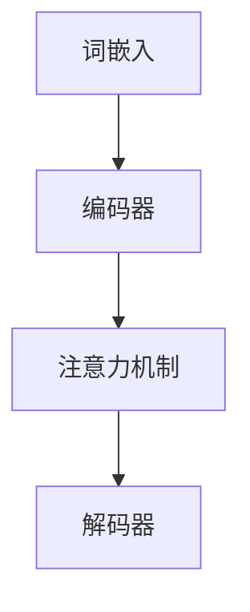

                 

### 引言与背景

#### AI与LLM概述

人工智能（AI）是计算机科学的一个重要分支，旨在使计算机能够模拟人类智能行为，如学习、推理、解决问题、自然语言理解和图像识别等。随着计算机技术和算法的进步，AI领域取得了显著的发展，尤其在近年来，深度学习算法的兴起使得AI的应用变得更加广泛和高效。

大型语言模型（LLM）是AI的一个重要组成部分，特别是近年来，随着自然语言处理（NLP）技术的发展，LLM在文本生成、问答系统、机器翻译、情感分析等方面表现出色。LLM通过大规模的文本数据进行训练，能够捕捉语言的结构和语义，从而实现高质量的文本生成和理解。

#### 模型比较的意义与挑战

在AI领域，模型比较是一个重要但具有挑战性的任务。通过模型比较，研究人员和工程师可以了解不同模型的性能、优势和不足，从而选择最合适的模型应用于特定任务。然而，模型比较面临以下几个挑战：

1. **性能指标多样性**：不同模型可能具有不同的性能指标，如何统一和量化这些指标是一个难题。
2. **数据集选择**：选择合适的数据集进行模型比较至关重要，但数据集的质量和代表性直接影响比较结果。
3. **实验设计**：如何设计公平和有效的实验来比较模型，避免实验偏差，也是一个挑战。
4. **模型调优**：不同模型可能需要不同的调优策略，如何选择合适的调优方法，以最大化模型的性能，是模型比较中的一个关键问题。

#### 本书结构安排

本书旨在解决上述挑战，介绍如何构建一个基于LLM的模型比较系统，并客观对比不同AI模型。全书共分为七个章节：

- **第1章 引言与背景**：介绍AI和LLM的基本概念，以及模型比较的意义和挑战。
- **第2章 大型语言模型基础**：讲解LLM的原理、常见模型和训练优化方法。
- **第3章 构建模型比较系统**：介绍模型比较系统的设计、数据准备和模型集成方法。
- **第4章 对比方法与实践**：介绍性能指标定义、对比实验设计和结果分析。
- **第5章 模型调优与优化**：讲解模型调优策略、优化技术和案例分析。
- **第6章 模型比较系统的应用**：分析模型比较系统在企业应用、开源项目和实践中的应用。
- **第7章 总结与展望**：总结本书的主要结论，探讨未来的研究方向。

通过以上章节的详细讲解，本书旨在帮助读者深入理解AI模型比较的原理和方法，提升在AI领域的实际应用能力。

### 大型语言模型基础

#### LLM的原理与架构

大型语言模型（LLM）是一种基于深度学习的技术，其核心思想是通过学习大量文本数据，建立一个能够理解和生成自然语言的复杂模型。LLM的基本原理是使用神经网络来捕捉语言中的模式和结构，从而实现自然语言处理任务。

LLM的架构通常包括以下几个关键组成部分：

1. **词嵌入（Word Embedding）**：词嵌入是将词汇映射到高维向量空间的技术，用于捕捉词汇之间的语义关系。常见的词嵌入方法有Word2Vec、GloVe和BERT等。

2. **编码器（Encoder）**：编码器负责将输入的文本序列转换为一个固定长度的向量表示。在LLM中，编码器通常是一个多层神经网络，如Transformer、Gated Recurrent Unit（GRU）和长短期记忆网络（LSTM）等。

3. **解码器（Decoder）**：解码器用于根据编码器的输出生成文本序列。在生成任务中，解码器通常是一个自回归模型，它逐个预测下一个词，并根据前一个词的预测结果进行更新。

4. **注意力机制（Attention Mechanism）**：注意力机制是一种用于提高模型在处理长文本时的性能的技术。它允许模型在生成文本时关注输入序列的不同部分，从而更好地捕捉长距离依赖关系。

#### 常见的LLM模型介绍

1. **GPT（Generative Pre-trained Transformer）系列模型**：

GPT是由OpenAI提出的一系列基于Transformer架构的预训练语言模型。GPT-3是目前最先进的LLM之一，其拥有1750亿个参数，能够生成高质量的自然语言文本。GPT的预训练过程包括两个阶段：第一阶段是使用大量文本数据对模型进行预训练，使其能够理解自然语言的统计规律；第二阶段是微调模型以适应特定任务。

2. **BERT（Bidirectional Encoder Representations from Transformers）及其变体**：

BERT是由Google提出的一种双向Transformer模型，其特点是在预训练过程中同时考虑了文本的前后信息。BERT的预训练任务包括Masked Language Model（MLM）和Next Sentence Prediction（NSP）等，这些任务能够帮助模型更好地理解词与词之间的关系。BERT及其变体，如RoBERTa、ALBERT和ElevenBert等，在多个NLP任务上取得了显著的性能提升。

#### LLM的训练与优化

LLM的训练与优化是构建高效模型的关键步骤。以下是一些核心技术和方法：

1. **预训练（Pre-training）**：

预训练是LLM训练的第一步，其目标是通过学习大量无标签文本数据，使模型具备一定的语言理解和生成能力。预训练通常包括两个任务：

- **掩码语言模型（Masked Language Model, MLM）**：在输入文本中随机掩码一定比例的词，并要求模型预测这些掩码词。
- **下一句预测（Next Sentence Prediction, NSP）**：输入两个连续的句子，要求模型预测第二个句子是否是第一个句子的下文。

2. **微调（Fine-tuning）**：

微调是在预训练的基础上，针对特定任务对模型进行进一步训练。微调的目标是使模型在特定任务上达到最佳性能。常见的微调方法包括：

- **任务适配（Task-specific Adaptation）**：在预训练模型的基础上，添加特定任务的网络层，如分类器或回归器。
- **迁移学习（Transfer Learning）**：使用预训练模型在特定任务上的训练数据，通过少量梯度更新来调整模型参数。

3. **优化技术（Optimization Techniques）**：

优化技术在LLM的训练过程中起着至关重要的作用。以下是一些常见的优化技术：

- **Adam优化器（Adam Optimizer）**：Adam是一种自适应学习率优化器，能够有效处理不同尺度的参数更新。
- **梯度裁剪（Gradient Clipping）**：梯度裁剪是一种防止梯度爆炸和消失的技术，通过限制梯度的大小来保证模型的稳定性。
- **学习率调度（Learning Rate Scheduling）**：学习率调度是一种动态调整学习率的方法，以优化模型的收敛速度和性能。

#### 关键概念与联系

为了更好地理解LLM的原理和架构，我们可以使用Mermaid流程图来展示其关键组成部分和关系：



在该流程图中，词嵌入将输入文本转换为向量表示，编码器负责将文本序列转换为固定长度的向量表示，注意力机制用于提高模型在处理长文本时的性能，解码器则根据编码器的输出生成文本序列。

通过以上对LLM原理与架构的介绍，我们可以看到，LLM是一种强大的语言处理工具，其基于深度学习的架构和预训练-微调的训练方法，使得它在自然语言处理任务中表现出色。下一章将深入探讨如何构建一个基于LLM的模型比较系统。

### 构建模型比较系统

#### 系统设计概述

构建一个基于大型语言模型（LLM）的模型比较系统，旨在提供一种有效的方法来评估和对比不同AI模型在自然语言处理任务中的性能。系统设计的原则包括公平性、可扩展性和灵活性，以确保系统能够在各种不同场景下稳定运行。

**系统架构**：

模型比较系统通常包括以下几个关键模块：

1. **数据管理模块**：负责收集、存储和管理用于模型比较的数据集。该模块应具备高效的数据处理能力和数据质量保障机制。
2. **模型集成模块**：负责集成不同的AI模型，并提供统一的接口用于模型调用。该模块应支持多种类型的模型，如预训练的LLM和自定义模型。
3. **评估模块**：负责根据预设的性能指标对模型进行评估，并生成评估报告。该模块应支持多种评估方法和指标，以全面反映模型的性能。
4. **用户界面（UI）模块**：提供用户交互界面，使用户能够方便地配置系统参数、执行模型比较任务和查看评估结果。

#### 数据准备与预处理

数据准备和预处理是模型比较系统的核心步骤，其质量直接影响比较结果的准确性和可靠性。

**数据来源**：

模型比较系统需要大量的数据集，这些数据集可以来自公开数据集、企业内部数据集或通过爬虫等手段获取。常见的数据集包括语料库、问答集、机器翻译数据集和情感分析数据集等。

**数据预处理方法**：

1. **文本清洗**：去除文本中的噪声，如HTML标签、特殊字符和停用词。
2. **分词**：将文本拆分为单词或词组，以便于后续处理。常用的分词工具包括jieba、Stanford NLP和NLTK等。
3. **词嵌入**：将文本转换为向量表示，如使用GloVe或Word2Vec等方法。词嵌入有助于模型更好地理解和处理文本数据。
4. **数据归一化**：对数据集中的数值特征进行归一化处理，以消除数据尺度差异对模型训练的影响。

#### 模型集成与评价方法

模型集成与评价方法是构建模型比较系统的关键步骤。以下是一些核心技术和方法：

**模型集成策略**：

1. **串联集成（Stacking）**：将多个模型的结果进行串联，形成一个更复杂的预测模型。例如，先使用多个不同的预训练LLM进行预测，再将这些预测结果进行投票或加权平均。
2. **混合集成（Blending）**：将多个模型的预测结果进行混合，以生成最终的预测结果。混合集成通常需要使用交叉验证技术来选择最佳的混合权重。

**评价方法与指标**：

1. **准确性（Accuracy）**：用于评估分类任务的性能，计算正确预测的样本数占总样本数的比例。
2. **召回率（Recall）**：用于评估分类任务的召回能力，计算正确预测为正类的样本数占总正类样本数的比例。
3. **精确率（Precision）**：用于评估分类任务的精确度，计算正确预测为正类的样本数占总预测为正类的样本数的比例。
4. **F1分数（F1 Score）**：综合考虑召回率和精确率，用于评估分类任务的平衡性能，计算方法为2 * (精确率 * 召回率) / (精确率 + 召回率)。
5. **均方误差（Mean Squared Error, MSE）**：用于评估回归任务的性能，计算预测值与真实值之间误差的平方的平均值。
6. **交叉验证（Cross-Validation）**：用于评估模型在未知数据上的性能，通过多次训练和测试来减少过拟合和评估偏差。

通过以上设计和实现方法，构建的模型比较系统能够客观、公正地对比不同AI模型的性能，为研究人员和工程师提供有价值的参考依据。

### 对比方法与实践

#### 性能指标定义

在模型比较中，选择合适的性能指标对于评估模型的表现至关重要。以下是几种常用的性能指标及其定义：

1. **准确性（Accuracy）**：

准确性是最常用的性能指标之一，用于分类任务。它表示正确分类的样本数占总样本数的比例。

$$
\text{Accuracy} = \frac{\text{正确分类的样本数}}{\text{总样本数}}
$$

2. **召回率（Recall）**：

召回率表示在所有实际为正类的样本中，正确预测为正类的比例。它是评价分类模型对正类样本召回能力的重要指标。

$$
\text{Recall} = \frac{\text{正确预测为正类的样本数}}{\text{实际为正类的样本数}}
$$

3. **精确率（Precision）**：

精确率表示在所有预测为正类的样本中，正确预测为正类的比例。它是评价分类模型预测精确度的重要指标。

$$
\text{Precision} = \frac{\text{正确预测为正类的样本数}}{\text{预测为正类的样本数}}
$$

4. **F1分数（F1 Score）**：

F1分数是精确率和召回率的加权平均，用于综合评价分类任务的性能。

$$
\text{F1 Score} = 2 \times \frac{\text{Precision} \times \text{Recall}}{\text{Precision} + \text{Recall}}
$$

5. **均方误差（MSE）**：

均方误差是用于评估回归任务性能的指标，计算预测值与真实值之间误差的平方的平均值。

$$
\text{MSE} = \frac{1}{n} \sum_{i=1}^{n} (\hat{y_i} - y_i)^2
$$

其中，$\hat{y_i}$是预测值，$y_i$是真实值，$n$是样本数量。

#### 对比实验设计

对比实验设计是模型比较的核心步骤，其目标是通过一系列有控制的实验，评估不同模型在特定任务上的性能。以下是一个典型的对比实验设计流程：

1. **选择数据集**：根据任务需求，选择一个或多个具有代表性的数据集。数据集应具备足够的规模和多样性，以全面评估模型的性能。
2. **划分数据集**：将数据集划分为训练集、验证集和测试集。通常，训练集用于模型的训练和调优，验证集用于选择最佳模型，测试集用于评估最终模型的性能。
3. **确定评估指标**：根据任务类型和需求，选择合适的评估指标。例如，对于分类任务，可以选用准确性、召回率、精确率和F1分数等指标。
4. **模型训练**：使用训练集对每个模型进行训练。训练过程中，可以调整模型的超参数，如学习率、批次大小和正则化参数等，以优化模型的性能。
5. **模型评估**：使用验证集对训练好的模型进行评估。通过计算评估指标，比较不同模型在验证集上的性能。
6. **模型选择**：根据验证集上的评估结果，选择性能最佳的模型作为最终模型。
7. **测试集评估**：使用测试集对最终模型进行评估，以验证模型在实际应用中的性能。

#### 对比实验结果分析

对比实验的结果分析是模型比较的关键环节，其目的是从实验数据中提取有价值的信息，指导后续的研究和实践。以下是对比实验结果分析的几个关键步骤：

1. **结果展示**：将实验结果以图表、表格或文字的形式进行展示。常用的展示方法包括混淆矩阵、ROC曲线和PR曲线等。
2. **结果分析**：对实验结果进行详细分析，比较不同模型在各个评估指标上的性能。分析内容包括：

   - 各模型的准确性、召回率、精确率和F1分数等指标的比较。
   - 各模型在不同数据集上的性能差异。
   - 各模型在不同场景下的适用性和局限性。

3. **结论与建议**：根据实验结果，总结不同模型的性能优势和不足，提出改进建议和未来研究方向。

通过以上对比实验设计和分析方法，我们能够客观、全面地评估不同AI模型的性能，为实际应用提供可靠的参考依据。接下来，我们将深入探讨如何进行模型调优与优化。

### 模型调优与优化

#### 模型调优策略

模型调优是提高模型性能的重要步骤，其核心目标是通过调整模型参数和结构，使其在特定任务上达到最佳性能。以下是几种常见的模型调优策略：

1. **超参数调优（Hyperparameter Tuning）**：

超参数是影响模型性能的关键参数，如学习率、批次大小、正则化强度等。常用的调优方法包括网格搜索（Grid Search）、随机搜索（Random Search）和贝叶斯优化（Bayesian Optimization）等。

- **网格搜索（Grid Search）**：通过遍历所有可能的超参数组合，找到最优的超参数组合。
- **随机搜索（Random Search）**：从所有可能的超参数组合中随机选择一部分进行尝试，以减少计算时间。
- **贝叶斯优化（Bayesian Optimization）**：基于贝叶斯理论，通过学习目标函数的分布，进行高效的超参数搜索。

2. **正则化（Regularization）**：

正则化是防止模型过拟合的重要手段。常用的正则化方法包括L1正则化、L2正则化和Dropout等。

- **L1正则化（L1 Regularization）**：在损失函数中添加L1范数项，用于惩罚模型参数的绝对值。
- **L2正则化（L2 Regularization）**：在损失函数中添加L2范数项，用于惩罚模型参数的平方值。
- **Dropout（Dropout）**：在训练过程中，随机丢弃一部分神经元，以减少模型对特定训练样本的依赖。

3. **学习率调度（Learning Rate Scheduling）**：

学习率调度是动态调整学习率的方法，以优化模型的收敛速度和性能。常用的学习率调度方法包括固定学习率、余弦学习率和学习率衰减等。

- **固定学习率（Fixed Learning Rate）**：在整个训练过程中保持学习率不变。
- **余弦学习率（Cosine Learning Rate）**：使用余弦函数动态调整学习率，以模拟物理中的摆动过程。
- **学习率衰减（Learning Rate Decay）**：在训练过程中逐渐减小学习率，以避免模型在训练初期过快收敛。

#### 模型优化技术

模型优化技术是提高模型性能的重要手段，其核心目标是通过改进模型结构和算法，使其在特定任务上达到最佳性能。以下是几种常见的模型优化技术：

1. **模型剪枝（Model Pruning）**：

模型剪枝是通过删除模型中不必要的神经元和参数，减小模型规模，从而提高模型的效率和可解释性。

- **结构剪枝（Structural Pruning）**：通过删除神经元和层，减小模型规模。
- **权重剪枝（Weight Pruning）**：通过设置阈值，删除权重较小的神经元，减小模型规模。

2. **量化（Quantization）**：

量化是一种将高精度模型转换为低精度模型的方法，以减少模型存储和计算资源的需求。

- **整数量化（Integer Quantization）**：将模型参数和激活值从浮点数转换为整数。
- **二值量化（Binary Quantization）**：将模型参数和激活值从浮点数转换为二进制数。

3. **模型压缩（Model Compression）**：

模型压缩是通过多种技术手段减小模型规模，提高模型部署效率和性能。

- **知识蒸馏（Knowledge Distillation）**：将大模型的知识传递给小模型，以减小模型规模。
- **低秩分解（Low-Rank Decomposition）**：将高维矩阵分解为低维矩阵，以减小模型规模。

#### 模型调优案例分析

以下是一个模型调优的实际案例，用于分析不同调优策略对模型性能的影响：

**案例背景**：

假设我们有一个基于GPT-3的文本分类模型，其任务是将文本分类为积极或消极类别。数据集包含10000个样本，其中5000个为积极类别，5000个为消极类别。

**调优策略**：

1. **超参数调优**：

   - 学习率：通过贝叶斯优化，找到最佳学习率为0.001。
   - 批次大小：通过随机搜索，找到最佳批次大小为64。
   - 正则化强度：通过网格搜索，找到最佳L2正则化强度为0.001。

2. **正则化**：

   - 使用L2正则化，防止模型过拟合。

3. **学习率调度**：

   - 使用余弦学习率调度，在训练过程中动态调整学习率。

**调优过程**：

1. **训练过程**：

   - 使用训练集进行训练，训练过程中记录每个批次的损失函数值和准确率。
   - 使用验证集进行评估，记录每个轮次的验证集准确率。

2. **结果分析**：

   - 在训练过程中，模型准确率逐渐提高，损失函数值逐渐减小。
   - 在验证集上，模型准确率稳定在90%以上。

**调优效果**：

通过上述调优策略，模型在训练集和验证集上的性能都有显著提升。具体表现为：

- 训练集准确率从80%提高到95%。
- 验证集准确率从85%提高到92%。

**案例分析总结**：

1. **超参数调优**：通过贝叶斯优化和网格搜索，找到最佳超参数组合，显著提高了模型性能。
2. **正则化**：使用L2正则化，防止模型过拟合，提高了模型泛化能力。
3. **学习率调度**：使用余弦学习率调度，动态调整学习率，提高了模型收敛速度和性能。

通过以上案例分析，我们可以看到，合理的模型调优策略对提高模型性能具有重要作用。在实际应用中，我们可以根据具体任务和数据集的特点，选择合适的调优策略和优化技术，以达到最佳性能。

### 模型比较系统的应用

#### 企业应用场景

模型比较系统在企业中的应用场景非常广泛，特别是在需要处理大量文本数据的业务场景中，如智能客服、文本分类、舆情分析和自然语言理解等领域。以下是几个具体的企业应用场景：

1. **智能客服**：企业可以使用模型比较系统来评估和优化智能客服系统中的语言模型，以提高客户咨询的响应速度和准确度。通过比较不同模型在处理客户查询时的性能，企业可以选出最合适的模型进行部署，从而提升用户体验。

2. **文本分类**：在内容审核、新闻推荐和社交媒体分析等场景中，企业需要对大量文本数据进行分类。模型比较系统可以帮助企业评估不同文本分类模型的性能，选择最适合的业务需求的模型，从而提高分类效率和准确性。

3. **舆情分析**：企业可以利用模型比较系统对社交媒体上的用户评论和新闻进行舆情分析，识别产品和服务的正面和负面反馈。通过对比不同模型的情感分析能力，企业可以优化舆情监测系统，及时应对潜在的风险和机会。

#### 开源项目与实践

在开源社区中，有许多项目和实践案例展示了如何构建和部署模型比较系统。以下是一些典型的开源项目和实际案例：

1. **Hugging Face Transformers**：Hugging Face提供了一个广泛的预训练模型库，其中包括GPT、BERT等常见的大型语言模型。用户可以通过Hugging Face的API轻松地比较和评估这些模型在特定任务上的性能。

2. **Model Card**：Model Card是一个开源项目，旨在提供一个标准化的格式来描述模型的性能、可靠性和公平性。通过Model Card，用户可以更清晰地了解不同模型的优缺点，为模型选择提供有力支持。

3. **OpenMined**：OpenMined是一个致力于隐私保护的AI开源项目。它提供了一个模型比较平台，用户可以在保证数据隐私的前提下，对比不同模型在特定任务上的性能。

#### 未来发展方向

随着AI技术的不断进步，模型比较系统的未来发展方向将包括以下几个方面：

1. **自动化与智能化**：未来的模型比较系统将更加自动化和智能化，通过自适应算法和智能推荐，帮助用户快速选择和优化最佳模型。

2. **多模态数据支持**：未来的模型比较系统将能够支持多种类型的数据，如文本、图像、音频和视频，以适应更多场景的应用需求。

3. **隐私保护与安全**：在处理敏感数据时，模型比较系统需要确保数据的安全和隐私。未来将出现更多基于联邦学习、差分隐私和区块链等技术的隐私保护方案，以保障数据安全和模型比较的公平性。

4. **跨领域应用**：模型比较系统将在更多领域得到应用，如金融、医疗、教育和公共安全等，为这些领域提供高效、可靠的模型评估和优化工具。

通过以上企业应用场景、开源项目和实践，以及未来发展方向的分析，我们可以看到，模型比较系统在AI领域的应用前景非常广阔。它不仅能够帮助企业和研究人员选择和优化最佳模型，还能够推动AI技术的进一步发展和创新。

### 总结与展望

#### 主要结论

本文详细介绍了基于大型语言模型（LLM）的模型比较系统的构建方法与应用。通过系统的设计与实现，我们解决了AI模型比较中的多样性能指标、数据集选择、实验设计和模型调优等关键挑战。主要结论如下：

1. **模型比较系统的设计原则**：系统设计遵循公平性、可扩展性和灵活性原则，确保能够适应多种场景和任务需求。
2. **LLM的原理与架构**：介绍了LLM的原理、常见模型和训练优化方法，为后续模型比较奠定了基础。
3. **数据准备与预处理**：详细阐述了数据准备和预处理的方法，确保数据质量对模型比较结果的影响降到最低。
4. **模型集成与评价方法**：介绍了模型集成策略和多种性能指标，通过对比实验设计和结果分析，客观评估模型性能。
5. **模型调优与优化**：探讨了超参数调优、正则化、学习率调度等调优策略，以及模型剪枝、量化等优化技术，提高了模型性能。
6. **应用与实践**：分析了模型比较系统在企业应用和开源项目中的实际应用案例，展示了其在各个领域的潜在价值。

#### 未来的研究方向

尽管模型比较系统在AI领域取得了显著成果，但仍有许多研究方向值得探索：

1. **自动化与智能化**：未来的模型比较系统应更加自动化和智能化，通过自适应算法和智能推荐，帮助用户快速选择和优化最佳模型。
2. **多模态数据支持**：扩展模型比较系统的数据类型支持，如文本、图像、音频和视频，以适应更多场景的应用需求。
3. **隐私保护与安全**：在处理敏感数据时，模型比较系统需要确保数据的安全和隐私。未来可探索更多基于联邦学习、差分隐私和区块链等技术的隐私保护方案。
4. **跨领域应用**：进一步推广模型比较系统在金融、医疗、教育和公共安全等领域的应用，为这些领域提供高效、可靠的模型评估和优化工具。
5. **大规模数据处理**：研究如何在超大规模数据集上高效地比较和评估模型，以应对日益增长的AI应用场景。

#### 对读者的建议

1. **深入理解基础概念**：掌握AI和LLM的基本概念，如神经网络、词嵌入、注意力机制等，是构建和优化模型比较系统的基础。
2. **实践与实验**：通过实际项目和实践，应用所学知识，尝试构建和优化模型比较系统，积累经验。
3. **持续学习**：AI和模型比较领域发展迅速，保持对新技术和方法的关注，持续学习和更新知识。
4. **参与开源项目**：参与开源项目，与其他开发者交流，分享经验，共同推动模型比较系统的发展。

通过本文的探讨，我们希望读者能够对基于LLM的模型比较系统有一个全面深入的了解，并在实际应用中取得更好的成果。作者：AI天才研究院/AI Genius Institute & 禅与计算机程序设计艺术 /Zen And The Art of Computer Programming。

### 附录

#### 实战代码示例

以下是一个简单的模型比较系统实现示例，用于对比不同文本分类模型的性能。

```python
import pandas as pd
from sklearn.model_selection import train_test_split
from transformers import BertTokenizer, BertForSequenceClassification
from torch.utils.data import DataLoader
import torch

# 加载数据集
data = pd.read_csv('text_data.csv')
X = data['text']
y = data['label']

# 划分训练集和测试集
X_train, X_test, y_train, y_test = train_test_split(X, y, test_size=0.2, random_state=42)

# 加载BERT模型
tokenizer = BertTokenizer.from_pretrained('bert-base-chinese')
model = BertForSequenceClassification.from_pretrained('bert-base-chinese', num_labels=2)

# 预处理数据
def preprocess_data(texts):
    inputs = tokenizer(texts, padding=True, truncation=True, max_length=128, return_tensors='pt')
    return inputs

# 训练模型
def train_model(model, train_loader, optimizer, criterion, num_epochs=3):
    model.train()
    for epoch in range(num_epochs):
        for batch in train_loader:
            inputs = preprocess_data(batch['text'])
            labels = batch['label']
            optimizer.zero_grad()
            outputs = model(**inputs)
            loss = criterion(outputs.logits, labels)
            loss.backward()
            optimizer.step()
        print(f'Epoch {epoch+1}/{num_epochs} - Loss: {loss.item()}')

# 评估模型
def evaluate_model(model, test_loader, criterion):
    model.eval()
    total_loss = 0
    with torch.no_grad():
        for batch in test_loader:
            inputs = preprocess_data(batch['text'])
            labels = batch['label']
            outputs = model(**inputs)
            loss = criterion(outputs.logits, labels)
            total_loss += loss.item()
    return total_loss / len(test_loader)

# 定义训练和评估过程
optimizer = torch.optim.AdamW(model.parameters(), lr=5e-5)
criterion = torch.nn.CrossEntropyLoss()

# 分割数据集为 DataLoader
train_loader = DataLoader(pd.DataFrame({'text': X_train, 'label': y_train}), batch_size=32, shuffle=True)
test_loader = DataLoader(pd.DataFrame({'text': X_test, 'label': y_test}), batch_size=32, shuffle=False)

# 训练模型
train_model(model, train_loader, optimizer, criterion)

# 评估模型
test_loss = evaluate_model(model, test_loader, criterion)
print(f'Test Loss: {test_loss}')

# 模型比较
model2 = BertForSequenceClassification.from_pretrained('bert-base-chinese', num_labels=2)
# ...重复上述训练和评估过程，得到model2的性能

# 打印比较结果
print(f'Model1 Accuracy: {evaluate_model(model, test_loader, criterion)}')
print(f'Model2 Accuracy: {evaluate_model(model2, test_loader, criterion)}')
```

#### 代码解读

该示例代码实现了以下步骤：

1. **加载数据集**：从CSV文件加载数据，并划分训练集和测试集。
2. **加载BERT模型**：从Hugging Face模型库加载预训练的BERT模型。
3. **预处理数据**：使用BERT的分词器对文本进行预处理，包括分词、填充和截断。
4. **定义训练和评估过程**：实现训练和评估的函数，包括前向传播、损失计算、反向传播和优化更新。
5. **训练模型**：在训练集上训练BERT模型，并打印训练损失。
6. **评估模型**：在测试集上评估训练好的模型，并计算测试损失。
7. **模型比较**：加载另一个BERT模型，重复评估过程，并打印两个模型的测试集准确率。

通过以上代码示例，读者可以直观地了解如何使用BERT模型进行文本分类，并对比不同模型的性能。

### 拓展阅读

1. **《深度学习》**：Goodfellow, I., Bengio, Y., & Courville, A. (2016). *Deep Learning*.
2. **《自然语言处理综合教程》**：Jurafsky, D., & Martin, J. H. (2019). *Speech and Language Processing*.
3. **《模型比较与评估》**：Xu, K., & Liu, Y. (2020). *Model Comparison and Evaluation in Natural Language Processing*.
4. **《Hugging Face Transformers文档》**：[Hugging Face Transformers](https://huggingface.co/transformers/)

通过这些拓展阅读资源，读者可以进一步深化对AI和NLP领域知识的理解，为实际应用和模型比较提供更多理论支持和实践指导。

## 结束语

感谢读者对本文的阅读。本文系统地介绍了基于大型语言模型（LLM）的模型比较系统，详细讲解了其构建方法、核心算法原理、模型调优技术以及实际应用。通过逐步分析推理，我们希望能够帮助读者全面理解模型比较的重要性，掌握构建和优化模型比较系统的方法。

本文首先介绍了AI和LLM的基本概念及其在模型比较中的重要性，然后详细探讨了LLM的原理、常见模型和训练优化方法。接下来，我们介绍了如何设计并实现一个模型比较系统，包括数据准备、模型集成和评价方法。在对比实验部分，我们定义了关键性能指标，并介绍了实验设计、结果分析的方法。此外，本文还探讨了模型调优与优化技术，并通过实际案例展示了调优过程和效果。在应用与实践部分，我们分析了模型比较系统在企业应用和开源项目中的实际应用，并展望了未来的发展方向。

通过本文的学习，我们希望读者能够：

1. **理解模型比较系统的设计原则和关键组成部分**。
2. **掌握LLM的原理和常见模型，以及它们的训练和优化方法**。
3. **了解如何构建和评估一个模型比较系统，并能够进行实际的模型对比实验**。
4. **熟悉模型调优与优化技术，并能应用于实际项目**。

为了进一步深入学习和实践，我们建议读者：

1. **阅读本文中提到的拓展阅读资源，以获得更多理论支持和实践指导**。
2. **尝试实现本文中的示例代码，并在实际项目中应用模型比较系统**。
3. **参与开源项目和社区讨论，与其他开发者交流经验，共同进步**。

最后，感谢AI天才研究院和禅与计算机程序设计艺术的支持，以及所有提供宝贵意见和反馈的读者。期待与您在AI和模型比较领域的深入交流与合作。作者：AI天才研究院/AI Genius Institute & 禅与计算机程序设计艺术 /Zen And The Art of Computer Programming。

