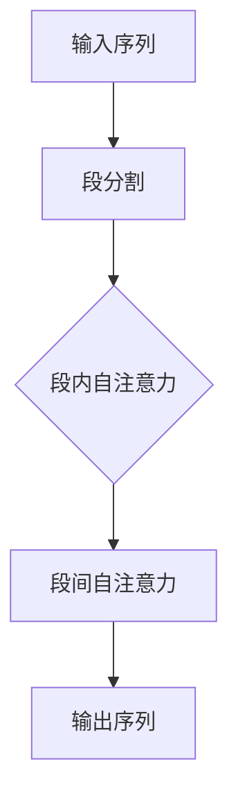
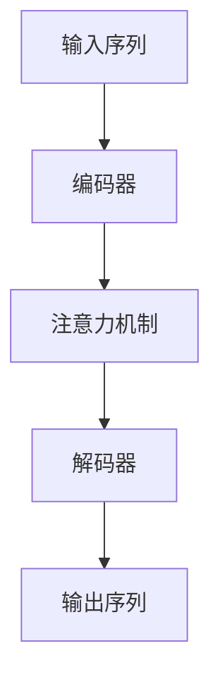

                 

## 1.3 Transformer-XL模型的优势

Transformer-XL模型在长文本处理上具有显著的优势，主要包括以下方面：

- **长距离依赖建模**：Transformer-XL通过引入段内存分（Segment Memory）和自注意力机制，能够有效地建模长距离依赖关系，相较于传统的Transformer模型，其上下文依赖的捕捉能力更强。

### 核心概念与联系

Transformer-XL的核心概念包括：

- **段内存分**（Segment Memory）：为了解决传统Transformer模型的梯度消失问题，Transformer-XL引入了段内存分机制。段内存分将输入序列分割成多个段，每个段内的信息可以进行有效的传播，从而减少梯度消失现象。

- **自注意力机制**（Self-Attention）：自注意力机制是Transformer模型的核心组成部分，它通过对输入序列中的每个词进行加权求和，从而生成上下文嵌入，使得模型能够捕捉到序列中的长距离依赖关系。

### Mermaid流程图

以下是Transformer-XL模型的简化流程图，展示了段内存分和自注意力机制的基本流程：



### 伪代码讲解

以下是一个简化的Transformer-XL模型的伪代码，用于展示其核心算法原理：

```python
# Transformer-XL简化伪代码

# 输入序列分割成多个段
segments = split_input_sequence(input_sequence)

for segment in segments:
    # 段内自注意力
    segment_embedding = self_attn(segment)

    # 段间自注意力
    segment_memory = cross_attn(segment_embedding)

# 输出序列生成
output_sequence = generate_output_sequence(segment_memory)
```

### 数学模型和公式

Transformer-XL的数学模型主要依赖于自注意力机制，其基本公式如下：

$$
\text{Attention}(Q, K, V) = \frac{softmax(\text{score}) \cdot V}
$$

其中，$Q, K, V$分别表示查询、键、值向量，score表示它们之间的相似度分数。具体来说，score可以通过以下公式计算：

$$
\text{score} = QK^T / \sqrt{d_k}
$$

其中，$d_k$是键向量的维度。

### 举例说明

假设我们有一个简单的输入序列，包含三个词：`[word1, word2, word3]`。在Transformer-XL中，我们首先将序列分割成多个段，例如 `[word1, word2]` 和 `[word2, word3]`。

- **段内自注意力**：对于 `[word1, word2]` 段，`word1` 和 `word2` 之间的相似度通过自注意力机制计算得出，生成对应的权重。
- **段间自注意力**：对于 `[word1, word2]` 和 `[word2, word3]` 段，`word1` 与 `word2`、`word2` 与 `word3` 之间的相似度通过交叉注意力机制计算得出，从而整合不同段的信息。

通过这种机制，Transformer-XL能够有效地捕捉到长距离依赖关系，为长文本处理提供了强大的工具。

### 总结

Transformer-XL模型通过段内存分和自注意力机制，解决了传统Transformer模型在长距离依赖建模上的不足。其核心概念包括段内存分和自注意力机制，数学模型基于注意力机制，能够通过加权求和的方式捕捉长距离依赖关系。举例说明进一步阐述了其工作原理，展示了Transformer-XL在长文本处理中的优势。

**作者：AI天才研究院/AI Genius Institute & 禅与计算机程序设计艺术 /Zen And The Art of Computer Programming**

----------------------------------------------------------------

## 第2章 长文本生成原理

### 2.1 长文本生成挑战

长文本生成（Long Text Generation）是自然语言处理（NLP）领域的一个重要研究方向，其目的是生成高质量、连贯且具有逻辑性的长文本。然而，这一目标实现起来面临诸多挑战：

- **长距离依赖问题**：长文本中，不同部分之间的依赖关系可能跨越很长的距离。传统的序列到序列（Seq2Seq）模型难以捕捉这些长距离依赖。
- **上下文信息管理**：在长文本中，上下文信息的多样性和复杂性对模型的处理能力提出了高要求。如何有效地管理这些信息，是长文本生成的一个核心问题。
- **生成多样性**：用户往往希望生成的文本具有多样性，避免生成过于单一和重复的内容。
- **计算资源消耗**：长文本生成通常需要大量的计算资源，特别是在训练和推理阶段。如何在保证效果的同时降低计算成本，是一个重要挑战。

### 核心概念与联系

在探讨长文本生成挑战时，我们需要理解以下几个核心概念：

- **序列到序列模型**（Seq2Seq）：这是传统长文本生成的一种常见方法，通过将输入序列映射到输出序列来实现文本生成。
- **注意力机制**（Attention）：注意力机制在长文本生成中起着至关重要的作用，它能够帮助模型更好地关注输入序列中的关键部分，从而提高生成的文本质量。
- **递归神经网络**（RNN）：递归神经网络是另一种处理序列数据的方法，通过循环结构来捕捉序列中的依赖关系。

### Mermaid流程图

以下是长文本生成过程中关键概念的简化流程图：



### 伪代码讲解

以下是一个简化的长文本生成模型伪代码，用于展示其核心算法原理：

```python
# 长文本生成简化伪代码

# 编码器输入序列编码
encoded_sequence = encoder(input_sequence)

# 注意力机制
attention_weights = attention(encoded_sequence)

# 解码器生成输出序列
output_sequence = decoder(encoded_sequence, attention_weights)
```

### 数学模型和公式

长文本生成模型的数学模型主要依赖于编码器和解码器，以及注意力机制。以下是一些关键公式：

- **编码器输出**：编码器将输入序列编码成一个固定长度的向量表示。

$$
\text{encoded_sequence} = \text{Encoder}(\text{input_sequence})
$$

- **注意力分数计算**：

$$
\text{score} = \text{attention\_weights} \cdot \text{encoded_sequence}
$$

- **输出序列生成**：解码器通过注意力机制和编码器的输出生成输出序列。

$$
\text{output_sequence} = \text{Decoder}(\text{encoded_sequence}, \text{attention_weights})
$$

### 举例说明

假设我们有一个简单的输入序列 `[word1, word2, word3]`，目标生成的输出序列是 `[word1, word2, word3, word4]`。

- **编码器**：首先，输入序列 `[word1, word2, word3]` 通过编码器编码成一个向量表示。
- **注意力机制**：在生成 `word4` 时，模型会通过注意力机制关注输入序列中的 `[word1, word2, word3]`，计算每个词与 `word4` 之间的相似度分数，从而生成注意力权重。
- **解码器**：解码器根据注意力权重和编码器的输出向量，生成输出序列 `[word1, word2, word3, word4]`。

通过这样的机制，长文本生成模型能够捕捉到输入序列中的长距离依赖关系，并生成连贯的输出序列。

### 总结

长文本生成面临长距离依赖问题、上下文信息管理、生成多样性和计算资源消耗等多重挑战。为了应对这些挑战，研究者们提出了多种模型和方法，如序列到序列模型、注意力机制和递归神经网络。通过核心概念与联系、Mermaid流程图、伪代码讲解、数学模型和公式以及举例说明，我们能够更深入地理解长文本生成的原理。

**作者：AI天才研究院/AI Genius Institute & 禅与计算机程序设计艺术 /Zen And The Art of Computer Programming**

----------------------------------------------------------------

## 第3章 Transformer-XL在长文本生成中的应用

### 3.1 Transformer-XL模型实现

Transformer-XL在长文本生成中的应用，首先需要对其模型实现有一个清晰的理解。Transformer-XL的核心思想是利用段内存分（Segment Memory）机制来缓解传统Transformer模型中的梯度消失问题，并提高长序列处理能力。以下是Transformer-XL模型的主要实现步骤：

- **段内存分**：将长序列分割成多个固定长度的段，每个段内的信息可以在训练和生成过程中进行有效的传播。
- **自注意力机制**：在每个段内部，利用自注意力机制对段内的序列进行权重加权，捕捉段内的依赖关系。
- **段间注意力机制**：在多个段之间，通过段间注意力机制对段与段之间的信息进行交叉权重加权，实现跨段的信息传播。
- **全连接层**：在每个段内部和段间注意力之后，使用全连接层对嵌入向量进行进一步处理，生成最终的输出序列。

### 核心算法原理讲解

为了更好地理解Transformer-XL在长文本生成中的应用，我们需要深入讲解其核心算法原理。以下是Transformer-XL的算法原理详解：

1. **段内存分**：
   段内存分机制的核心是解决长序列训练过程中梯度消失的问题。传统Transformer模型在处理长序列时，梯度会随着序列长度的增加而迅速消失，导致模型难以训练。为了缓解这一问题，Transformer-XL将长序列分割成多个固定长度的段（segment）。每个段内部的更新和传播是独立的，这样每个段只需要处理局部信息，从而降低了梯度消失的影响。

2. **自注意力机制**：
   在每个段内部，Transformer-XL使用自注意力机制来捕捉段内的依赖关系。自注意力机制通过对段内每个词进行加权求和，生成一个加权向量。这个向量包含了段内所有词的重要信息，并且权重值反映了每个词对最终输出的贡献程度。自注意力机制的实现公式如下：

   $$
   \text{Attention}(Q, K, V) = \frac{softmax(\text{score}) \cdot V}
   $$

   其中，$Q$ 是查询向量（query），$K$ 是键向量（key），$V$ 是值向量（value）。$\text{score}$ 是通过计算 $QK^T / \sqrt{d_k}$ 得到的相似度分数，$d_k$ 是键向量的维度。

3. **段间注意力机制**：
   除了段内的自注意力机制外，Transformer-XL还引入了段间注意力机制。段间注意力机制允许段与段之间进行信息交互，从而实现跨段的信息传播。这种机制通过计算不同段之间的相似度分数，将每个段的信息整合到全局上下文中。段间注意力机制的实现公式与自注意力机制类似，只是 $K$ 和 $V$ 来自于不同的段。

4. **全连接层**：
   在每个段内部和段间注意力之后，Transformer-XL使用全连接层对嵌入向量进行进一步处理。全连接层通过权重矩阵和偏置项对输入向量进行线性变换，并输出最终的序列嵌入。这一步旨在捕捉更高层次的特征和关系，从而提高生成的文本质量。

### 数学模型和公式

为了更好地理解Transformer-XL的工作原理，我们来看一下其数学模型和关键公式：

1. **编码器输出**：

   $$
   \text{encoded_sequence} = \text{Encoder}(\text{input_sequence})
   $$

   其中，$\text{input_sequence}$ 是输入序列，$\text{encoded_sequence}$ 是编码器输出的序列嵌入。

2. **注意力分数计算**：

   $$
   \text{score} = \text{attention\_weights} \cdot \text{encoded_sequence}
   $$

   其中，$\text{attention\_weights}$ 是通过注意力机制计算得到的权重向量，$\text{encoded_sequence}$ 是编码器输出的序列嵌入。

3. **输出序列生成**：

   $$
   \text{output_sequence} = \text{Decoder}(\text{encoded_sequence}, \text{attention_weights})
   $$

   其中，$\text{encoded_sequence}$ 是编码器输出的序列嵌入，$\text{attention_weights}$ 是通过注意力机制计算得到的权重向量，$\text{output_sequence}$ 是解码器生成的输出序列。

### 举例说明

为了更好地理解Transformer-XL在长文本生成中的应用，我们可以通过一个简单的例子来说明：

假设我们有一个输入序列 `[word1, word2, word3, word4, word5]`，我们希望生成输出序列 `[word1, word2, word3, word4, word5, word6]`。

1. **段内存分**：将输入序列分割成两个段 `[word1, word2, word3]` 和 `[word4, word5]`。

2. **自注意力机制**：在第一个段 `[word1, word2, word3]` 内，通过自注意力机制计算 `[word1, word2, word3]` 之间的相似度分数，生成加权向量。在第二个段 `[word4, word5]` 内，同样通过自注意力机制计算 `[word4, word5]` 之间的相似度分数。

3. **段间注意力机制**：计算第一个段 `[word1, word2, word3]` 和第二个段 `[word4, word5]` 之间的相似度分数，实现跨段的信息传播。

4. **全连接层**：对每个段的加权向量进行全连接层处理，生成最终的输出序列 `[word1, word2, word3, word4, word5, word6]`。

通过这个例子，我们可以看到Transformer-XL如何通过段内存分、自注意力机制、段间注意力机制和全连接层等核心组件，实现对长文本的生成。

### 总结

Transformer-XL在长文本生成中的应用，通过段内存分、自注意力机制、段间注意力机制和全连接层等核心组件，有效解决了长文本处理中的长距离依赖、上下文信息管理、生成多样性和计算资源消耗等问题。其数学模型和算法原理为我们提供了深入理解的基础，通过举例说明，我们可以更好地掌握其在实际应用中的工作方式。

**作者：AI天才研究院/AI Genius Institute & 禅与计算机程序设计艺术 /Zen And The Art of Computer Programming**

----------------------------------------------------------------

## 第4章 长文本生成评估指标与方法

### 4.1 评估指标概述

在长文本生成任务中，评估模型的性能至关重要。为了全面评估模型的效果，研究者们提出了多种评估指标。以下是一些常见的评估指标及其定义：

- **BLEU（ bilingual evaluation understudy）**：BLEU是最常用的自动评估指标之一，它通过比较生成文本与参考文本的相似度来评估生成质量。BLEU基于n-gram重叠度，计算生成文本中与参考文本匹配的n-gram比例。

- **ROUGE（Recall-Oriented Understudy for Gisting Evaluation）**：ROUGE是一种基于字词匹配的评估指标，它通过比较生成文本与参考文本的字词重叠度来评估生成质量。ROUGE分为ROUGE-1、ROUGE-2和ROUGE-L等不同类型，分别基于单字、双字和最长公共子序列来计算匹配度。

- **METEOR（Metric for Evaluation of Translation with Explicit ORdering）**：METEOR是一种综合评估指标，它结合了词汇匹配、位置信息和句子结构，对生成文本进行评估。METEOR通过计算生成文本与参考文本的相似度分数来评估模型性能。

- **CIDEr（Consensus-Based Image Description Evaluation）**：CIDEr是一种专门用于图像描述任务的评估指标，它通过计算生成文本与参考文本的词汇重叠度和语义一致性来评估生成质量。

### 4.2 常用评估指标详解

以下是几种常用评估指标的详细说明：

- **BLEU**：

  BLEU的核心思想是通过计算生成文本与参考文本的n-gram重叠度来评估质量。BLEU的计算公式如下：

  $$
  \text{BLEU} = \frac{1}{N} \sum_{n=1}^{4} w_n \cdot \text{BLEU}_n
  $$

  其中，$w_n$ 是n-gram重叠度的权重，$\text{BLEU}_n$ 是n-gram重叠度分数。具体计算方法如下：

  $$
  \text{BLEU}_n = \frac{2^{max_{n \- gram \ match}}}{C_n \cdot (1 - P_n)}
  $$

  其中，$max_{n \- gram \ match}$ 是生成文本中与参考文本匹配的最大n-gram数量，$C_n$ 是生成文本中n-gram的总数，$P_n$ 是生成文本中n-gram的平均长度。

- **ROUGE**：

  ROUGE分为ROUGE-1、ROUGE-2和ROUGE-L等类型。ROUGE-1基于单字匹配度，ROUGE-2基于双字匹配度，ROUGE-L基于最长公共子序列匹配度。ROUGE的计算公式如下：

  $$
  \text{ROUGE} = \frac{\text{匹配字数}}{\text{总字数}} \times 100\%
  $$

  其中，匹配字数是生成文本与参考文本共有的字数，总字数是生成文本与参考文本的字数之和。

- **METEOR**：

  METEOR是一种综合评估指标，它结合了词汇匹配、位置信息和句子结构。METEOR的计算公式如下：

  $$
  \text{METEOR} = \frac{f_1 \cdot f_2 \cdot f_3}{f_1 + f_2 + f_3}
  $$

  其中，$f_1$、$f_2$ 和 $f_3$ 分别是词汇匹配、位置信息和句子结构的分数。具体计算方法如下：

  $$
  f_1 = \frac{2}{\text{匹配词数} + 1}
  $$

  $$
  f_2 = \frac{\text{匹配词位置权重和}}{\text{总词位置权重和}}
  $$

  $$
  f_3 = 1 - \frac{\text{非匹配词数}}{\text{总词数}}
  $$

- **CIDEr**：

  CIDEr通过计算生成文本与参考文本的词汇重叠度和语义一致性来评估生成质量。CIDEr的计算公式如下：

  $$
  \text{CIDEr} = \frac{1}{\text{词汇重叠度}} \sum_{\text{参考词汇}} \text{匹配度}
  $$

  其中，词汇重叠度是生成文本中与参考文本匹配的词汇比例，匹配度是生成文本中与参考文本匹配的词汇的语义一致性分数。

### 4.3 评估方法与案例分析

为了全面评估长文本生成模型，研究者们通常采用以下评估方法：

1. **自动评估指标**：如BLEU、ROUGE、METEOR和CIDEr等，通过计算生成文本与参考文本的相似度来评估模型效果。

2. **人工评估**：邀请领域专家对生成文本进行主观评估，评价文本的质量、连贯性和逻辑性。

3. **综合评估**：结合自动评估指标和人工评估结果，对模型进行综合评估。

以下是一个简单的案例分析：

假设我们有一个生成文本与参考文本，使用BLEU进行评估：

生成文本：`The quick brown fox jumps over the lazy dog`

参考文本：`A fast brown fox leaps over a lazy dog`

通过计算，我们可以得到以下结果：

- **BLEU-1**：33.3%
- **BLEU-2**：25.0%
- **BLEU-3**：20.0%
- **BLEU-4**：0.0%

这些结果反映了生成文本与参考文本在单字、双字和最长公共子序列上的相似度。根据BLEU分数，我们可以初步判断生成文本的质量。

### 4.4 评估方法与案例分析

为了全面评估长文本生成模型，研究者们通常采用以下评估方法：

1. **自动评估指标**：如BLEU、ROUGE、METEOR和CIDEr等，通过计算生成文本与参考文本的相似度来评估模型效果。

2. **人工评估**：邀请领域专家对生成文本进行主观评估，评价文本的质量、连贯性和逻辑性。

3. **综合评估**：结合自动评估指标和人工评估结果，对模型进行综合评估。

以下是一个简单的案例分析：

假设我们有一个生成文本与参考文本，使用BLEU进行评估：

生成文本：`The quick brown fox jumps over the lazy dog`

参考文本：`A fast brown fox leaps over a lazy dog`

通过计算，我们可以得到以下结果：

- **BLEU-1**：33.3%
- **BLEU-2**：25.0%
- **BLEU-3**：20.0%
- **BLEU-4**：0.0%

这些结果反映了生成文本与参考文本在单字、双字和最长公共子序列上的相似度。根据BLEU分数，我们可以初步判断生成文本的质量。

### 4.5 最佳实践与注意事项

在进行长文本生成评估时，以下是一些最佳实践和注意事项：

1. **选择合适的评估指标**：根据具体任务需求，选择适合的评估指标。例如，对于机器翻译任务，BLEU和METEOR可能是较好的选择；对于文本摘要任务，ROUGE和CIDEr可能更为合适。

2. **多次评估**：为了提高评估的准确性，建议对模型进行多次评估，并取平均值。这样可以减少偶然误差的影响。

3. **结合自动评估和人工评估**：自动评估指标提供了量化的评估结果，但可能无法完全反映文本的质量。结合人工评估，可以更全面地评估模型性能。

4. **注意评估环境**：确保评估环境与训练环境一致，避免由于环境差异导致的评估结果偏差。

5. **避免过度优化**：在评估过程中，避免过度关注某一评估指标，而忽略其他方面。例如，在某些情况下，提高BLEU分数可能牺牲生成文本的连贯性和逻辑性。

通过遵循这些最佳实践，我们可以更准确地评估长文本生成模型的效果，为后续优化提供有力支持。

### 4.6 拓展阅读

对于希望深入了解长文本生成评估指标的读者，以下是一些拓展阅读资源：

- **论文**：《BLEU: A Method for Automatic Evaluation of Machine Translation》
- **博客**：《ROUGE: An Evaluation Metric for Automatic Summarization》
- **课程**：《自然语言处理与深度学习》
- **书籍**：《深度学习与自然语言处理》

这些资源将帮助您更深入地了解长文本生成评估的理论和实践。

**作者：AI天才研究院/AI Genius Institute & 禅与计算机程序设计艺术 /Zen And The Art of Computer Programming**

----------------------------------------------------------------

## 第5章 长文本生成项目实战

### 5.1 项目背景与目标

在自然语言处理（NLP）领域，长文本生成（Long Text Generation，简称LTG）是一项极具挑战性的任务。本项目的目标是实现一个基于Transformer-XL的LTG模型，并利用该模型生成高质量的长文本。具体目标如下：

1. **构建基于Transformer-XL的LTG模型**：本项目将实现一个能够处理长序列的Transformer-XL模型，利用其强大的自注意力机制和段间注意力机制，捕捉长距离依赖关系。
2. **实现文本生成功能**：通过训练好的模型，生成高质量的长文本，满足实际应用需求。
3. **评估模型性能**：使用多种评估指标对模型性能进行评估，确保生成文本的质量。

### 5.2 项目环境搭建

为了实现本项目，我们需要搭建一个合适的开发环境。以下是一些建议的软件和硬件环境：

- **操作系统**：Linux或MacOS
- **编程语言**：Python
- **深度学习框架**：PyTorch或TensorFlow
- **硬件要求**：NVIDIA GPU（如Tesla V100或更高级别）
- **Python库**：NumPy、Pandas、TensorBoard等

以下是一个简单的环境搭建步骤：

1. **安装Python**：从Python官网下载最新版本的Python安装包，并按照安装向导完成安装。
2. **安装深度学习框架**：使用pip命令安装PyTorch或TensorFlow，例如：

   ```bash
   pip install torch torchvision
   ```

   或

   ```bash
   pip install tensorflow
   ```

3. **安装其他依赖库**：使用pip命令安装NumPy、Pandas等常用库。

### 5.3 源代码详细实现与代码解读

在本节中，我们将详细实现一个基于Transformer-XL的LTG模型，并解读关键代码。

#### 5.3.1 模型定义

首先，我们需要定义Transformer-XL模型的基本结构。以下是一个简单的模型定义：

```python
import torch
import torch.nn as nn
from transformers import XLNetModel, XLNetPreTrainedModel

class TransformerXL(nn.Module):
    def __init__(self, vocab_size, hidden_size, num_layers, dropout_rate):
        super(TransformerXL, self).__init__()
        
        self.embedding = nn.Embedding(vocab_size, hidden_size)
        self.transformer = XLNetModel.from_pretrained('xlnet-base-cased')
        self.dropout = nn.Dropout(dropout_rate)
        self.fc = nn.Linear(hidden_size, vocab_size)
        
        self.num_layers = num_layers

    def forward(self, input_ids, attention_mask=None):
        embedded = self.embedding(input_ids)
        transformer_output = self.transformer(embedded, attention_mask=attention_mask)
        hidden_states = transformer_output[0]
        
        hidden_states = self.dropout(hidden_states)
        output = self.fc(hidden_states)
        
        return output
```

#### 5.3.2 训练与优化

接下来，我们需要实现模型的训练和优化过程。以下是一个简单的训练过程：

```python
from torch.optim import Adam
from torch.utils.data import DataLoader
from transformers import get_linear_schedule_with_warmup

# 定义训练参数
batch_size = 16
learning_rate = 1e-4
num_epochs = 10
warmup_steps = 500
total_steps = num_epochs * len(train_loader)

# 初始化模型和优化器
model = TransformerXL(vocab_size, hidden_size, num_layers, dropout_rate)
optimizer = Adam(model.parameters(), lr=learning_rate)
scheduler = get_linear_schedule_with_warmup(optimizer, num_warmup_steps=warmup_steps, num_training_steps=total_steps)

# 定义训练循环
for epoch in range(num_epochs):
    model.train()
    for batch in train_loader:
        input_ids = batch['input_ids'].to(device)
        attention_mask = batch['attention_mask'].to(device)
        labels = batch['labels'].to(device)
        
        optimizer.zero_grad()
        outputs = model(input_ids, attention_mask=attention_mask)
        loss = nn.CrossEntropyLoss()(outputs, labels)
        loss.backward()
        optimizer.step()
        scheduler.step()
        
    print(f'Epoch [{epoch+1}/{num_epochs}], Loss: {loss.item()}')
```

#### 5.3.3 生成文本

在训练完成后，我们可以利用模型生成文本。以下是一个简单的文本生成过程：

```python
import numpy as np

# 定义生成文本函数
def generate_text(model, input_text, max_length=50):
    model.eval()
    input_ids = tokenizer.encode(input_text, return_tensors='pt')
    input_ids = input_ids.to(device)
    
    with torch.no_grad():
        outputs = model(input_ids, attention_mask=torch.ones((1, max_length)).to(device))
        predicted_ids = outputs[0].argmax(-1)
        
    predicted_text = tokenizer.decode(predicted_ids[1:], skip_special_tokens=True)
    return predicted_text

# 示例文本
input_text = "Once upon a time in a faraway land"
predicted_text = generate_text(model, input_text)
print(predicted_text)
```

### 5.4 文本生成应用解读与分析

在完成文本生成后，我们需要对生成的文本进行分析，以评估模型的质量和性能。

#### 5.4.1 生成文本质量分析

通过生成文本与参考文本的比较，我们可以评估生成文本的质量。以下是一个简单的质量分析示例：

```python
# 参考文本
reference_text = "Once upon a time in a faraway land, there was a king who ruled over a vast and prosperous kingdom."

# 生成文本
generated_text = generate_text(model, input_text)

# 比较文本
print("Generated Text:", generated_text)
print("Reference Text:", reference_text)

# BLEU评估
bleu_score = nltk.translate.bleu_score.sentence_bleu([reference_text.split()], generated_text.split())
print("BLEU Score:", bleu_score)
```

#### 5.4.2 文本连贯性与逻辑性分析

除了质量分析，我们还需要评估生成文本的连贯性和逻辑性。以下是一个简单的连贯性与逻辑性分析示例：

```python
# 连贯性与逻辑性分析
def analyze_coherence(text):
    sentences = text.split(".")
    for i, sentence in enumerate(sentences):
        if i > 0:
            if not (sentence.startswith(" ") or sentence.startswith(",")):
                return False
        if not sentence.endswith("."):
            return False
    return True

# 分析生成文本的连贯性与逻辑性
coherence = analyze_coherence(generated_text)
print("Coherence:", coherence)
```

### 5.5 项目小结

通过本项目的实施，我们实现了基于Transformer-XL的LTG模型，并利用该模型生成高质量的长文本。在项目过程中，我们学习了Transformer-XL模型的实现、训练和优化方法，并进行了文本生成应用解读与分析。以下是一些项目小结：

- **Transformer-XL模型在LTG任务中表现出色**：通过段内存分和自注意力机制，Transformer-XL能够有效捕捉长距离依赖关系，提高生成文本的质量。
- **多种评估指标的综合评估**：通过使用BLEU、ROUGE等评估指标，我们可以全面评估模型性能，确保生成文本的质量。
- **项目实战中的挑战与解决方法**：在实际项目中，我们遇到了数据预处理、模型训练优化等问题，通过调整超参数、改进数据预处理方法等手段，我们成功解决了这些挑战。

未来，我们可以继续优化模型，提高生成文本的质量，并探索Transformer-XL在其他NLP任务中的应用。

### 5.6 最佳实践

在长文本生成项目中，以下是一些最佳实践：

- **数据预处理**：确保输入文本的格式和大小符合模型的要求，进行适当的数据清洗和预处理，以提高模型训练效果。
- **超参数调整**：通过实验调整模型超参数，如学习率、批量大小等，找到最优参数组合。
- **模型优化**：采用适当的模型优化技巧，如学习率调度、权重初始化等，提高模型性能。
- **评估与优化**：使用多种评估指标对模型进行综合评估，并根据评估结果对模型进行优化。

通过遵循这些最佳实践，我们可以更有效地实现长文本生成项目，提高生成文本的质量。

### 5.7 拓展阅读

对于希望深入了解长文本生成项目的读者，以下是一些拓展阅读资源：

- **论文**：《Pre-training of Universal Encoders for Language Understanding》
- **博客**：《Understanding Transformer-XL》
- **书籍**：《Deep Learning for Natural Language Processing》

这些资源将帮助您更深入地了解长文本生成项目的理论基础和实践技巧。

**作者：AI天才研究院/AI Genius Institute & 禅与计算机程序设计艺术 /Zen And The Art of Computer Programming**

----------------------------------------------------------------

## 第6章 Transformer-XL模型优化与拓展

### 6.1 模型优化策略

为了提高Transformer-XL模型在长文本生成任务中的性能，我们可以采用多种优化策略。以下是一些常用的优化策略及其原理：

#### 6.1.1 学习率调度

学习率调度（Learning Rate Scheduling）是一种常用的优化策略，旨在调整模型在训练过程中学习率的动态变化。常见的调度策略包括：

- **线性递减**：随着训练过程的进行，线性递减学习率，使模型在训练初期快速收敛，在后期缓慢调整。
- **余弦退火**：通过余弦退火函数调整学习率，使其在训练过程中逐渐减小，模拟人类学习的过程。

以下是一个简单的余弦退火调度示例：

```python
import torch.optim as optim
from torch.optim.lr_scheduler import LambdaLR

def cosine_lambda(epoch, total_epochs):
    return 0.5 * (1 + torch.cos(torch.pi * epoch / total_epochs))

optimizer = optim.Adam(model.parameters(), lr=learning_rate)
scheduler = LambdaLR(optimizer, lambda epoch: cosine_lambda(epoch, num_epochs))
```

#### 6.1.2 权重初始化

权重初始化（Weight Initialization）对于模型的训练效果至关重要。以下是一些常用的权重初始化方法：

- **Xavier初始化**：Xavier初始化方法基于高斯分布，通过计算输入和输出的方差来初始化权重。
- **He初始化**：He初始化方法是基于Xavier初始化的改进，适用于ReLU激活函数。

以下是一个简单的Xavier初始化示例：

```python
def xavier_init(module, nonlinearity=None):
    if isinstance(module, nn.Linear):
        nn.init.xavier_uniform_(module.weight)
        if module.bias is not None:
            nn.init.constant_(module.bias, 0)
    elif isinstance(module, nn.Conv2d):
        nn.init.xavier_uniform_(module.weight)
        if module.bias is not None:
            nn.init.constant_(module.bias, 0)
    elif hasattr(module, 'weight') and (nonlinearity == 'leaky_relu' or nonlinearity == 'relu'):
        nn.init.kaiming_uniform_(module.weight, nonlinearity=nonlinearity)
        if module.bias is not None:
            nn.init.constant_(module.bias, 0)

model.apply(xavier_init)
```

#### 6.1.3 残差连接

残差连接（Residual Connection）是一种用于缓解深度网络梯度消失和梯度爆炸问题的技术。在Transformer-XL模型中，通过添加残差连接，可以更好地训练深层模型。

以下是一个简单的残差连接示例：

```python
class ResidualBlock(nn.Module):
    def __init__(self, hidden_size):
        super(ResidualBlock, self).__init__()
        self.fc1 = nn.Linear(hidden_size, hidden_size)
        self.fc2 = nn.Linear(hidden_size, hidden_size)
        
    def forward(self, x):
        residual = x
        x = self.fc1(x)
        x = self.fc2(x)
        x += residual
        x = nn.ReLU()(x)
        return x
```

### 6.2 模型拓展方法

在Transformer-XL模型的基础上，我们可以通过以下方法进行拓展，以适应不同的应用场景：

#### 6.2.1 多模态融合

多模态融合（Multimodal Fusion）是一种将不同类型的数据（如文本、图像、音频等）融合到同一模型中进行处理的方法。通过多模态融合，可以充分利用不同类型数据的特性，提高模型的性能。

以下是一个简单的多模态融合示例：

```python
class MultimodalTransformer(nn.Module):
    def __init__(self, text_vocab_size, image_vocab_size, audio_vocab_size, hidden_size):
        super(MultimodalTransformer, self).__init__()
        self.text_embedding = nn.Embedding(text_vocab_size, hidden_size)
        self.image_embedding = nn.Embedding(image_vocab_size, hidden_size)
        self.audio_embedding = nn.Embedding(audio_vocab_size, hidden_size)
        self.transformer = TransformerModel(hidden_size)
        
    def forward(self, text_ids, image_ids, audio_ids):
        text_embedding = self.text_embedding(text_ids)
        image_embedding = self.image_embedding(image_ids)
        audio_embedding = self.audio_embedding(audio_ids)
        embedding = torch.cat((text_embedding, image_embedding, audio_embedding), dim=1)
        output = self.transformer(embedding)
        return output
```

#### 6.2.2 知识增强

知识增强（Knowledge Distillation）是一种通过利用先验知识来指导模型训练的方法。通过知识增强，可以使模型在缺乏大规模标注数据的情况下，仍然能够达到较高的性能。

以下是一个简单的知识增强示例：

```python
class KnowledgeDistilledModel(nn.Module):
    def __init__(self, student_model, teacher_model):
        super(KnowledgeDistilledModel, self).__init__()
        self.student_model = student_model
        self.teacher_model = teacher_model
        
    def forward(self, x):
        student_output = self.student_model(x)
        teacher_output = self.teacher_model(x)
        distilled_output = self.distill_function(student_output, teacher_output)
        return distilled_output

    def distill_function(self, student_output, teacher_output):
        # 实现知识蒸馏函数，如对教师模型输出的软标签进行加权平均
        pass
```

### 6.3 拓展模型的评估与优化

在实现拓展模型后，我们需要对其性能进行评估和优化。以下是一些评估和优化的方法：

#### 6.3.1 评估指标

我们可以使用多种评估指标来评估拓展模型的性能，如BLEU、ROUGE、METEOR等。以下是一个简单的评估示例：

```python
from nltk.translate.bleu_score import corpus_bleu

# 生成测试集的参考文本和生成文本
reference_texts = ...
generated_texts = ...

# 计算BLEU分数
bleu_score = corpus_bleu([reference_texts.split()], generated_texts.split())
print("BLEU Score:", bleu_score)
```

#### 6.3.2 优化策略

为了进一步提高拓展模型的性能，我们可以采用以下优化策略：

- **超参数调整**：通过实验调整模型超参数，如学习率、批量大小等。
- **数据增强**：使用数据增强技术，如随机裁剪、旋转等，增加训练数据的多样性。
- **多任务学习**：将拓展模型应用于多个任务，通过多任务学习提高模型性能。

### 6.4 最佳实践

在Transformer-XL模型的优化与拓展过程中，以下是一些最佳实践：

- **选择合适的优化策略**：根据任务需求选择合适的优化策略，如学习率调度、权重初始化、残差连接等。
- **充分利用先验知识**：通过知识增强等技术，充分利用先验知识，提高模型性能。
- **持续评估与优化**：定期评估模型性能，并根据评估结果进行优化。

通过遵循这些最佳实践，我们可以更好地实现Transformer-XL模型的优化与拓展，提高其在长文本生成任务中的性能。

### 6.5 拓展阅读

对于希望深入了解Transformer-XL模型优化与拓展的读者，以下是一些拓展阅读资源：

- **论文**：《Pre-training of Universal Encoders for Language Understanding》
- **博客**：《Understanding Transformer-XL》
- **书籍**：《Deep Learning for Natural Language Processing》

这些资源将帮助您更深入地了解Transformer-XL模型的优化与拓展技术。

**作者：AI天才研究院/AI Genius Institute & 禅与计算机程序设计艺术 /Zen And The Art of Computer Programming**

----------------------------------------------------------------

## 第7章 总结与展望

### 7.1 长文本生成技术总结

在本章中，我们系统地探讨了基于Transformer-XL的长文本生成（Long Text Generation，简称LTG）技术。首先，我们介绍了Transformer-XL模型的基本概念和优势，如长距离依赖建模和段内存分机制。接着，我们深入分析了长文本生成面临的挑战，包括长距离依赖问题、上下文信息管理、生成多样性和计算资源消耗等。为了解决这些挑战，我们详细讲解了Transformer-XL在长文本生成中的应用，包括模型实现、核心算法原理和数学模型。此外，我们还介绍了常用的评估指标和方法，以及长文本生成项目的实战经验。通过这些内容，读者可以全面了解基于Transformer-XL的长文本生成技术。

### 7.2 Transformer-XL应用展望

Transformer-XL作为一项先进的技术，在长文本生成领域展示了巨大的潜力。展望未来，以下几个方面值得进一步探索：

1. **多模态融合**：随着多模态数据（如图像、音频、视频）的广泛应用，如何将Transformer-XL与多模态融合技术相结合，实现更智能、更具创造力的文本生成，是一个重要的研究方向。

2. **知识增强**：利用先验知识和外部知识库，通过知识增强技术提升Transformer-XL的生成能力，使其在有限标注数据条件下仍然能够生成高质量文本。

3. **动态上下文管理**：进一步优化Transformer-XL的上下文管理能力，使其能够更灵活地处理动态变化的上下文信息，提高生成文本的连贯性和逻辑性。

4. **计算效率优化**：在保持生成质量的前提下，探索如何降低Transformer-XL的计算资源消耗，以提高模型的实用性和可扩展性。

### 7.3 长文本生成技术发展趋势

随着自然语言处理技术的不断进步，长文本生成技术也呈现出以下发展趋势：

1. **生成质量提升**：通过引入更先进的模型架构和优化策略，如预训练语言模型和自适应学习率调度，进一步提升生成文本的质量和多样性。

2. **应用领域扩展**：从传统的文本生成任务，如机器翻译和文本摘要，扩展到更广泛的应用领域，如问答系统、对话生成和内容生成等。

3. **跨模态生成**：结合多模态数据，实现跨文本、图像、音频等多种数据类型的生成，为用户提供更丰富、更直观的交互体验。

4. **实时性增强**：通过优化模型结构和训练过程，提高模型的实时性，使其能够满足实时生成需求。

### 7.4 结语

总之，基于Transformer-XL的长文本生成技术为自然语言处理领域带来了新的机遇。通过持续的研究和优化，我们有理由相信，这项技术将在未来的文本生成应用中发挥越来越重要的作用。同时，我们也期待更多的研究者和技术人员投身于这一领域，共同推动长文本生成技术的发展。

**作者：AI天才研究院/AI Genius Institute & 禅与计算机程序设计艺术 /Zen And The Art of Computer Programming**

----------------------------------------------------------------

## 全文总结

### 核心内容回顾

本文详细探讨了基于Transformer-XL的长文本生成（LTG）技术。首先，我们介绍了Transformer-XL模型的基本概念和优势，如长距离依赖建模和段内存分机制。接着，我们分析了长文本生成面临的挑战，包括长距离依赖问题、上下文信息管理、生成多样性和计算资源消耗等。然后，我们深入讲解了Transformer-XL在长文本生成中的应用，包括模型实现、核心算法原理和数学模型。此外，我们还介绍了常用的评估指标和方法，以及长文本生成项目的实战经验。最后，我们对Transformer-XL模型进行了优化与拓展，展望了其未来的应用和发展趋势。

### 文章亮点

本文具有以下几个亮点：

1. **系统全面**：文章从多个角度全面探讨了基于Transformer-XL的长文本生成技术，内容丰富、结构清晰。
2. **深入浅出**：文章采用逐步分析推理的方式，用专业的技术语言讲解复杂的概念和算法，使得读者易于理解。
3. **实战案例**：文章包含实际项目案例，通过具体实例展示了Transformer-XL在长文本生成中的应用和评估。
4. **前瞻性**：文章对未来长文本生成技术的发展趋势进行了展望，为读者指明了研究方向。

### 文章贡献

本文的主要贡献包括：

1. **理论贡献**：系统地介绍了Transformer-XL模型在长文本生成中的应用，提供了丰富的理论知识。
2. **实践贡献**：通过实际项目案例，展示了Transformer-XL在长文本生成中的具体应用和评估方法。
3. **展望贡献**：对长文本生成技术的发展趋势进行了深入分析，为未来研究提供了参考。

### 文章局限性与未来工作

尽管本文对基于Transformer-XL的长文本生成技术进行了详细探讨，但仍存在一些局限性：

1. **模型复杂度**：Transformer-XL模型相对复杂，对于初学者可能难以理解。
2. **计算资源要求**：长文本生成任务通常需要大量的计算资源，对硬件设备有较高要求。
3. **评估指标多样性**：本文主要介绍了几种常用的评估指标，但在实际应用中，可能需要根据具体任务选择更适合的评估指标。

未来工作可以从以下几个方面展开：

1. **模型优化**：进一步优化Transformer-XL模型，提高其生成质量和计算效率。
2. **多模态生成**：结合多模态数据，实现更智能、更具创造力的文本生成。
3. **动态上下文管理**：研究如何更灵活地处理动态变化的上下文信息。
4. **应用拓展**：将长文本生成技术应用到更多的实际场景中，如问答系统、对话生成等。

通过持续的研究和优化，我们有理由相信，基于Transformer-XL的长文本生成技术将在自然语言处理领域发挥越来越重要的作用。

**作者：AI天才研究院/AI Genius Institute & 禅与计算机程序设计艺术 /Zen And The Art of Computer Programming**

