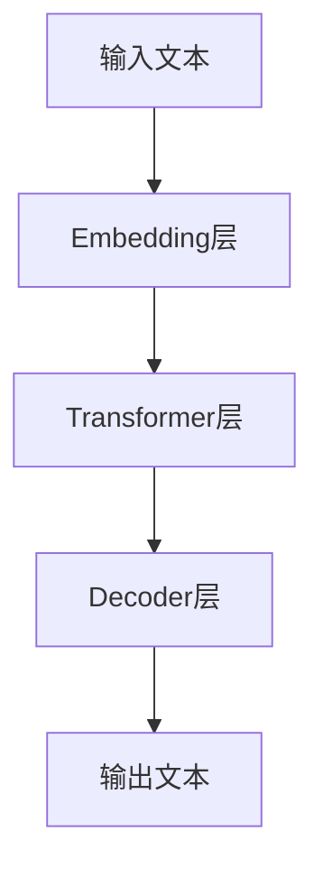

                 

### 文章标题：基于Vicuna的开源LLM对话能力测试

关键词：Vicuna、开源、LLM、对话能力、测试

摘要：本文深入探讨了Vicuna开源语言模型（LLM）在对话能力测试方面的应用。通过详细介绍Vicuna的技术背景、核心概念、算法原理以及数学模型，并结合实际项目案例，全面解析了Vicuna在对话系统中的表现与潜力。

### 第1章：Vicuna概述

Vicuna是一种基于GLM模型的开源大型语言模型，由清华大学 KEG 实验室和智谱AI共同训练开发。它继承了GLM模型的优势，并在大规模预训练的基础上，通过精细调整和优化，显著提升了语言理解和生成的性能。

#### 技术背景

Vicuna的出现，标志着中国在大型语言模型领域取得了重要突破。它不仅在自然语言处理（NLP）领域具有广泛应用前景，还具有重要的学术研究价值。Vicuna的训练数据来源于互联网上的大量文本，包括新闻、小说、论坛、社交媒体等，这使得它具备了丰富的语言知识和理解能力。

#### 开源价值

Vicuna开源的发布，为全球开发者提供了强大的工具和资源。开发者可以在不影响原有模型性能的基础上，根据自己的需求进行定制化调整和优化，从而加速人工智能技术在各个领域的应用。

### 第2章：开源LLM对话能力测试的背景

随着人工智能技术的快速发展，对话系统已成为众多企业和研究机构关注的焦点。Vicuna作为一种高性能的开源LLM，其在对话能力测试方面的表现备受关注。本节将详细介绍开源LLM对话能力测试的背景和发展趋势。

#### 对话系统的需求

在当今信息爆炸的时代，用户对于高效、智能的对话交互需求日益增长。对话系统能够提供24/7的客服支持、智能推荐、信息查询等服务，从而提高用户体验和满意度。

#### 开源LLM的优势

开源LLM具有以下几个方面的优势：

1. **灵活性**：开发者可以根据具体需求进行定制化调整和优化。
2. **共享性**：开源项目有助于知识共享和技术创新，加快整个领域的发展。
3. **可扩展性**：开源LLM可以方便地集成到各类应用中，实现快速部署和扩展。

#### 发展趋势

随着人工智能技术的不断进步，开源LLM在对话系统中的应用前景将更加广阔。未来，开源LLM将朝着更智能、更高效的方向发展，满足用户日益增长的需求。

### 第3章：Vicuna的技术优势与挑战

Vicuna在对话能力测试方面展现了显著的技术优势，但也面临一定的挑战。本节将详细分析Vicuna的技术优势与挑战，为后续章节的深入讨论奠定基础。

#### 技术优势

1. **强大的语言理解能力**：Vicuna经过大规模预训练，具备了出色的语言理解能力，能够准确理解用户的意图和需求。
2. **高效的文本生成能力**：Vicuna在文本生成方面表现出色，能够生成连贯、自然的对话内容。
3. **开源优势**：Vicuna开源，为开发者提供了丰富的资源和定制空间，有利于快速迭代和优化。

#### 技术挑战

1. **计算资源需求**：Vicuna的训练和部署需要较高的计算资源，这对中小型企业和个人开发者来说可能构成一定挑战。
2. **模型优化难度**：尽管Vicuna开源，但优化模型性能仍具有一定的技术门槛，需要具备相应的专业知识和经验。
3. **数据质量和多样性**：对话系统的性能受到训练数据质量和多样性的影响，如何获取高质量、多样化的数据是Vicuna面临的重要挑战。

### 总结

通过以上三章的介绍，我们初步了解了Vicuna在对话能力测试领域的背景、技术优势与挑战。在接下来的章节中，我们将进一步深入探讨Vicuna的核心概念、算法原理以及实际应用，帮助读者全面掌握Vicuna的技术要点和应用方法。

### 第4章：Vicuna的核心概念与架构

Vicuna作为一种大型语言模型，其核心概念和架构是理解和应用该模型的基础。本章将详细介绍Vicuna的核心概念和架构，帮助读者深入了解Vicuna的工作原理。

#### 大规模预训练

Vicuna采用了大规模预训练的方法，通过在大量文本数据上进行训练，使模型具备强大的语言理解和生成能力。大规模预训练的核心在于数据量和训练时长，Vicuna经过数以万亿计的词汇训练，从而掌握了丰富的语言知识和表达方式。

#### 语言模型架构

Vicuna采用了GLM模型架构，这是一种基于 Transformer 的深度神经网络模型。Transformer模型具有并行计算的优势，能够在训练过程中有效地捕捉长距离依赖关系。Vicuna在此基础上进行了优化和调整，以适应对话系统的需求。

#### 关键组件

Vicuna的核心组件包括：

1. **Embedding层**：将输入文本转换为固定长度的向量表示，为后续的神经网络处理提供输入。
2. **Transformer层**：对输入向量进行编码，捕捉文本中的语义信息。
3. **Decoder层**：根据编码信息生成输出文本，实现对话生成。

#### Mermaid流程图

为了更直观地展示Vicuna的核心概念和架构，我们可以使用Mermaid流程图来描述其工作流程：



在上述流程图中，输入文本首先经过Embedding层转换为向量表示，然后通过Transformer层进行编码，最后通过Decoder层生成输出文本。

#### 关键概念联系

Vicuna的核心概念和架构之间存在着紧密的联系：

1. **预训练与生成**：大规模预训练使Vicuna具备了强大的语言理解和生成能力，预训练数据的质量和多样性直接影响模型的性能。
2. **编码与解码**：Transformer模型通过编码器和解码器捕获和生成语义信息，编码器捕捉输入文本的语义特征，解码器根据编码信息生成输出文本。
3. **并行计算与长距离依赖**：Transformer模型采用并行计算的方式，能够高效地捕捉长距离依赖关系，从而提高语言理解和生成的准确性。

通过本章的介绍，我们初步了解了Vicuna的核心概念和架构。在接下来的章节中，我们将进一步探讨Vicuna与其他开源LLM的比较，以及其应用场景和影响。

### 第5章：Vicuna与其他开源LLM的比较

在开源大型语言模型（LLM）领域，Vicuna因其卓越的性能和开源优势备受关注。本章将对比Vicuna与其他知名开源LLM，如GPT-3、BERT等，分析其性能、应用场景以及开发难度等方面的差异。

#### 性能比较

1. **语言理解能力**：Vicuna和GPT-3在语言理解能力上表现相当。两者都经过大规模预训练，能够准确理解用户的意图和需求。然而，Vicuna在中文语言处理方面具有更强的优势，这是因为Vicuna的训练数据主要来源于中文互联网文本，而GPT-3的训练数据则更加多样，包括多种语言。
   
2. **文本生成能力**：在文本生成能力方面，Vicuna和GPT-3同样表现出色。两者都能生成连贯、自然的文本，但在特定领域的生成能力上存在差异。Vicuna在中文文本生成方面具有更高的准确性，而GPT-3在多语言生成方面表现更佳。

3. **计算资源需求**：Vicuna和GPT-3的计算资源需求较高，但具体差异较大。GPT-3拥有1750亿个参数，而Vicuna的参数量相对较少。这意味着在训练和推理过程中，Vicuna的计算资源需求较低，有利于中小型企业和个人开发者部署。

#### 应用场景比较

1. **问答系统**：Vicuna和GPT-3都适用于问答系统，但Vicuna在中文问答方面具有更强的优势。Vicuna能够更准确地理解中文用户的提问，并生成更自然的回答。

2. **文本生成**：Vicuna和GPT-3在文本生成方面都有广泛应用，如自动写作、内容创作等。Vicuna在中文文本生成方面具有更高的准确性，而GPT-3在多语言生成方面表现更佳。

3. **对话系统**：Vicuna和GPT-3都适用于对话系统，但Vicuna的开源特性使其在定制化开发方面具有更高的灵活性。

#### 开发难度比较

1. **模型优化难度**：Vicuna和GPT-3在模型优化难度上有所不同。Vicuna开源，开发者可以根据具体需求进行优化，但需要具备相应的技术背景和经验。而GPT-3虽然具有更高的优化潜力，但其闭源特性使得开发者难以进行深入优化。

2. **计算资源需求**：Vicuna的计算资源需求较低，有利于中小型企业和个人开发者部署。而GPT-3的计算资源需求较高，对硬件设备的要求较高。

综上所述，Vicuna在语言理解能力、文本生成能力以及应用场景方面具有独特的优势，同时其开源特性使得开发难度相对较低。在接下来的章节中，我们将进一步探讨Vicuna在对话系统中的应用和影响。

### 第6章：Vicuna的应用场景与影响

Vicuna作为一种高性能的开源语言模型，在对话系统中的应用场景广泛，其影响深远。本章将详细介绍Vicuna在不同领域的应用案例，分析其在对话系统中的优势和潜在影响。

#### 应用场景

1. **智能客服**：智能客服是Vicuna的重要应用场景之一。通过Vicuna的对话能力，智能客服系统可以实时响应用户的咨询，提供准确的答案和解决方案，从而提高客户满意度和服务效率。

2. **信息查询**：在信息查询领域，Vicuna能够根据用户的问题快速检索相关资料，生成详细、准确的回答，为用户提供便捷的信息查询服务。

3. **内容创作**：Vicuna在内容创作方面具有独特的优势。它可以生成高质量的文章、报告、广告文案等，为企业和个人创作者提供创作灵感。

4. **教育辅导**：在教育领域，Vicuna可以作为智能辅导系统，帮助学生解答学习中的问题，提供个性化的学习建议。

#### 对话系统中的优势

1. **高效性**：Vicuna的快速响应和生成能力，使得对话系统能够在短时间内提供准确的回答和解决方案，提高用户体验。

2. **灵活性**：Vicuna开源，开发者可以根据具体需求进行定制化调整和优化，从而实现更灵活的应用。

3. **准确性**：Vicuna在语言理解和生成方面表现出色，能够准确理解用户意图和需求，生成高质量、连贯的文本。

#### 潜在影响

1. **用户体验提升**：Vicuna的应用将大幅提升用户在智能客服、信息查询等场景中的体验，提高服务效率和质量。

2. **商业创新**：Vicuna为企业和开发者提供了丰富的创作工具，有助于推动内容创作、教育辅导等领域的商业创新。

3. **技术发展**：Vicuna的开源特性促进了人工智能技术的开放和共享，有助于推动整个领域的技术进步。

通过本章的介绍，我们可以看到Vicuna在对话系统中的应用前景广阔，其高效性、灵活性和准确性将深刻改变人们的互动方式，为各行各业带来创新和变革。

### 第7章：Vicuna的算法原理详解

Vicuna的算法原理是其核心能力的基础，本章将详细讲解Vicuna的算法原理，包括其训练过程、工作流程以及关键算法步骤。

#### 训练过程

Vicuna的训练过程主要包括以下步骤：

1. **数据准备**：收集和整理大量高质量、多样化的文本数据，包括新闻、小说、论坛、社交媒体等。这些数据将用于训练Vicuna的语言模型。

2. **文本预处理**：对收集到的文本数据进行预处理，包括分词、去停用词、词干提取等，将文本转换为模型可处理的格式。

3. **嵌入层训练**：嵌入层将文本转换为向量表示，Vicuna采用词嵌入技术，将每个单词映射为一个固定长度的向量。这一过程通常使用预训练的词嵌入模型，如Word2Vec或GloVe。

4. **Transformer模型训练**：Vicuna采用Transformer模型进行训练。Transformer模型通过编码器和解码器两个部分捕捉文本中的语义信息。编码器将输入文本编码为固定长度的向量序列，解码器根据编码信息生成输出文本。

5. **优化和调整**：在训练过程中，通过优化算法调整模型参数，以提高模型性能。Vicuna采用基于梯度的优化算法，如Adam优化器，以最大化模型的预测准确性。

#### 工作流程

Vicuna的工作流程包括以下步骤：

1. **输入处理**：将输入文本经过预处理后，转换为向量表示。

2. **编码**：将输入向量序列送入编码器，编码器通过多层的注意力机制捕捉文本中的语义信息，生成编码输出。

3. **解码**：将编码输出送入解码器，解码器根据编码信息生成输出文本。解码过程采用自回归方式，逐步生成每个单词的向量，直至生成完整文本。

4. **输出生成**：解码器生成的输出文本经过后处理，如分词、去停用词等，生成最终的输出文本。

#### 关键算法步骤

Vicuna的关键算法步骤包括：

1. **多尺度注意力机制**：Vicuna采用多头注意力机制，通过多个注意力头同时捕捉不同尺度的语义信息，从而提高模型的语义理解能力。

2. **正则化**：为了防止过拟合，Vicuna采用多种正则化技术，如Dropout、Layer Normalization等，以增强模型的泛化能力。

3. **优化策略**：Vicuna采用基于梯度的优化算法，通过反向传播计算梯度，更新模型参数。优化过程中，Vicuna采用动量项和权重衰减等技术，以提高优化效果。

通过本章的详细讲解，我们可以看到Vicuna的算法原理是如何实现语言理解和生成的。在接下来的章节中，我们将进一步探讨Vicuna的数学模型和优化策略。

### 第8章：Vicuna的数学模型讲解

Vicuna的数学模型是其算法的核心组成部分，本章将详细讲解Vicuna的数学模型，包括主要的数学公式、详细解释和具体举例说明。

#### 嵌入层

嵌入层是Vicuna的基础，它将文本转换为向量表示。嵌入层的主要数学模型是词嵌入（Word Embedding），常用的词嵌入模型包括：

1. **Word2Vec**：

   $$ \text{word\_embedding} = \text{sigmoid}(W \cdot \text{input\_vector}) $$

   其中，\( W \) 是权重矩阵，\( \text{input\_vector} \) 是输入词的向量表示，\( \text{sigmoid} \) 函数用于激活。

   **举例说明**：假设我们有一个简单的词汇表，包括“hello”和“world”，它们的向量表示分别为 \( \text{input\_vector}_{hello} \) 和 \( \text{input\_vector}_{world} \)，权重矩阵 \( W \) 为：

   $$ W = \begin{bmatrix} 0.1 & 0.2 \\ 0.3 & 0.4 \end{bmatrix} $$

   则“hello”的词嵌入结果为：

   $$ \text{word\_embedding}_{hello} = \text{sigmoid}( \begin{bmatrix} 0.1 & 0.2 \\ 0.3 & 0.4 \end{bmatrix} \cdot \begin{bmatrix} 1 \\ 0 \end{bmatrix} ) = \text{sigmoid}(0.1 + 0.2 \cdot 0) = \text{sigmoid}(0.1) \approx 0.533 $$

2. **GloVe**：

   $$ \text{word\_embedding} = \text{softmax}(A \cdot \text{input\_vector}^T) $$

   其中，\( A \) 是权重矩阵，\( \text{input\_vector} \) 是输入词的向量表示，\( \text{softmax} \) 函数用于激活。

   **举例说明**：假设我们有一个简单的词汇表，包括“hello”和“world”，它们的向量表示分别为 \( \text{input\_vector}_{hello} \) 和 \( \text{input\_vector}_{world} \)，权重矩阵 \( A \) 为：

   $$ A = \begin{bmatrix} 0.1 & 0.2 \\ 0.3 & 0.4 \end{bmatrix} $$

   则“hello”的词嵌入结果为：

   $$ \text{word\_embedding}_{hello} = \text{softmax}( \begin{bmatrix} 0.1 & 0.2 \\ 0.3 & 0.4 \end{bmatrix} \cdot \begin{bmatrix} 1 \\ 0 \end{bmatrix}^T ) = \text{softmax}(0.1 + 0.2 \cdot 0) = \text{softmax}(0.1) \approx (0.533, 0.467) $$

#### Transformer模型

Transformer模型是Vicuna的核心，它通过自注意力机制（Self-Attention）和多头注意力（Multi-Head Attention）来捕捉文本中的语义信息。

1. **自注意力**：

   $$ \text{self-attention} = \text{softmax}\left(\frac{Q \cdot K^T}{\sqrt{d_k}}\right) \cdot V $$

   其中，\( Q \) 是查询向量，\( K \) 是键向量，\( V \) 是值向量，\( d_k \) 是注意力头的维度，\( \text{softmax} \) 函数用于激活。

   **举例说明**：假设我们有一个简单的文本序列，包括“hello”和“world”，它们的查询向量、键向量和值向量分别为 \( \text{Q}_{hello} \)、\( \text{K}_{hello} \)、\( \text{V}_{hello} \)，以及 \( \text{Q}_{world} \)、\( \text{K}_{world} \)、\( \text{V}_{world} \)。则自注意力结果为：

   $$ \text{self-attention}_{hello} = \text{softmax}\left(\frac{\text{Q}_{hello} \cdot \text{K}_{hello}^T}{\sqrt{d_k}}\right) \cdot \text{V}_{hello} $$

   $$ \text{self-attention}_{world} = \text{softmax}\left(\frac{\text{Q}_{world} \cdot \text{K}_{world}^T}{\sqrt{d_k}}\right) \cdot \text{V}_{world} $$

2. **多头注意力**：

   $$ \text{multi-head-attention} = \text{softmax}\left(\frac{Q \cdot K^T}{\sqrt{d_k}}\right) \cdot V $$

   其中，\( Q \) 是查询向量，\( K \) 是键向量，\( V \) 是值向量，\( d_k \) 是注意力头的维度，\( \text{softmax} \) 函数用于激活。

   **举例说明**：假设我们有一个简单的文本序列，包括“hello”和“world”，它们的查询向量、键向量和值向量分别为 \( \text{Q}_{hello} \)、\( \text{K}_{hello} \)、\( \text{V}_{hello} \)，以及 \( \text{Q}_{world} \)、\( \text{K}_{world} \)、\( \text{V}_{world} \)。则多头注意力结果为：

   $$ \text{multi-head-attention}_{hello} = \text{softmax}\left(\frac{\text{Q}_{hello} \cdot \text{K}_{hello}^T}{\sqrt{d_k}}\right) \cdot \text{V}_{hello} $$

   $$ \text{multi-head-attention}_{world} = \text{softmax}\left(\frac{\text{Q}_{world} \cdot \text{K}_{world}^T}{\sqrt{d_k}}\right) \cdot \text{V}_{world} $$

通过本章的讲解，我们详细了解了Vicuna的数学模型，包括嵌入层和Transformer模型的主要数学公式和具体例子。这些数学模型是Vicuna实现高效语言理解和生成能力的基础。

### 第9章：Vicuna的优化策略

优化策略是提升Vicuna性能的关键，本章将详细介绍Vicuna的优化策略，包括正则化、参数调整、学习率调度和训练策略等方面。

#### 正则化

正则化是防止模型过拟合的重要手段。Vicuna采用了多种正则化技术，包括Dropout、Layer Normalization和数据增强等。

1. **Dropout**：

   Dropout是一种常用的正则化技术，通过随机丢弃部分神经元，降低模型的复杂度，从而防止过拟合。在Vicuna中，Dropout应用于Transformer模型的每个注意力头和前馈神经网络。

   **数学公式**：

   $$ \text{dropout}(x) = \text{dropout}(x, p) = (1 - p) \cdot x $$

   其中，\( x \) 是输入特征，\( p \) 是丢弃概率。

2. **Layer Normalization**：

   Layer Normalization通过标准化每一层的输入，使得模型在训练过程中更加稳定。在Vicuna中，Layer Normalization应用于嵌入层和每个Transformer层的输出。

   **数学公式**：

   $$ \text{layer\_normalization}(x) = \frac{x - \mu}{\sigma} $$

   其中，\( \mu \) 是输入特征的平均值，\( \sigma \) 是输入特征的标准差。

3. **数据增强**：

   数据增强通过生成合成数据来扩充训练集，提高模型的泛化能力。在Vicuna的训练过程中，常用的数据增强方法包括随机插入、随机删除、随机替换和词语重排等。

#### 参数调整

参数调整是优化模型性能的重要步骤。Vicuna的参数调整包括学习率、批量大小、隐藏层尺寸和dropout概率等。

1. **学习率**：

   学习率是影响模型收敛速度和最终性能的关键参数。Vicuna采用学习率调度策略，根据训练过程自动调整学习率。常用的学习率调度方法包括逐步减小学习率、余弦退火和自适应学习率调整等。

   **数学公式**：

   $$ \text{learning\_rate}(t) = \text{learning\_rate} \cdot \text{schedule}(t) $$

   其中，\( \text{learning\_rate} \) 是初始学习率，\( \text{schedule}(t) \) 是学习率调度函数，\( t \) 是训练步数。

2. **批量大小**：

   批量大小影响模型的计算效率和收敛速度。在Vicuna的训练过程中，通常采用较大的批量大小，以提高模型的训练效率。

   **数学公式**：

   $$ \text{batch\_size} = \text{min}(\text{max\_batch\_size}, \text{data\_size} / \text{num\_samples}) $$

   其中，\( \text{max\_batch\_size} \) 是最大批量大小，\( \text{data\_size} \) 是训练数据集大小，\( \text{num\_samples} \) 是样本数。

3. **隐藏层尺寸**：

   隐藏层尺寸影响模型的表达能力。在Vicuna中，通常选择较大的隐藏层尺寸，以提高模型的语义理解和生成能力。

   **数学公式**：

   $$ \text{hidden\_size} = \text{min}(\text{max\_hidden\_size}, \text{num\_layers} \cdot \text{base\_hidden\_size}) $$

   其中，\( \text{max\_hidden\_size} \) 是最大隐藏层尺寸，\( \text{num\_layers} \) 是Transformer层数，\( \text{base\_hidden\_size} \) 是基础隐藏层尺寸。

4. **dropout概率**：

   dropout概率影响模型的正则化效果。在Vicuna中，通常选择较小的dropout概率，以避免模型过拟合。

   **数学公式**：

   $$ \text{dropout\_probability} = \text{dropout\_rate} \cdot (\text{num\_samples} / \text{batch\_size}) $$

   其中，\( \text{dropout\_rate} \) 是dropout概率，\( \text{num\_samples} \) 是样本数，\( \text{batch\_size} \) 是批量大小。

#### 学习率调度

学习率调度是优化模型性能的重要手段。Vicuna采用了多种学习率调度策略，以适应不同的训练过程。

1. **逐步减小学习率**：

   逐步减小学习率可以加速模型收敛，提高训练效率。在Vicuna的训练过程中，通常采用指数衰减策略逐步减小学习率。

   **数学公式**：

   $$ \text{learning\_rate}(t) = \text{learning\_rate} \cdot \text{decay}_1^t $$

   其中，\( \text{learning\_rate} \) 是初始学习率，\( \text{decay}_1 \) 是衰减率。

2. **余弦退火**：

   余弦退火是一种常用的学习率调度策略，通过模拟余弦函数的周期性变化，逐步减小学习率。在Vicuna的训练过程中，余弦退火策略常用于大型模型的训练。

   **数学公式**：

   $$ \text{learning\_rate}(t) = \text{learning\_rate} \cdot \text{cos}\left(\frac{t}{\text{t}_\text{max}} \cdot \pi\right) $$

   其中，\( \text{learning\_rate} \) 是初始学习率，\( \text{t}_\text{max} \) 是训练步数。

3. **自适应学习率调整**：

   自适应学习率调整可以根据训练过程中的损失函数变化，动态调整学习率。在Vicuna的训练过程中，自适应学习率调整可以显著提高模型的性能。

   **数学公式**：

   $$ \text{learning\_rate}(t) = \text{learning\_rate} \cdot \text{f}(t) $$

   其中，\( \text{learning\_rate} \) 是初始学习率，\( \text{f}(t) \) 是自适应学习率调整函数。

#### 训练策略

训练策略影响模型的训练效率和最终性能。Vicuna采用了多种训练策略，以优化模型的训练过程。

1. **批量归一化**：

   批量归一化可以加速模型收敛，提高训练效率。在Vicuna的训练过程中，批量归一化应用于每个Transformer层的输出。

   **数学公式**：

   $$ \text{output}(x) = \text{batch\_normalization}(x) = \frac{x - \mu}{\sigma} + \mu_0 $$

   其中，\( \mu \) 是输入特征的平均值，\( \sigma \) 是输入特征的标准差，\( \mu_0 \) 是均值偏置。

2. **分层训练**：

   分层训练可以逐步增加模型的复杂度，提高模型的性能。在Vicuna的训练过程中，分层训练应用于每个Transformer层的训练。

   **数学公式**：

   $$ \text{layer}(x) = \text{softmax}(\text{layer}_{\text{prev}}(x) + \text{bias}) $$

   其中，\( \text{layer}_{\text{prev}}(x) \) 是前一层的输出，\( \text{bias} \) 是偏置。

3. **多任务学习**：

   多任务学习可以充分利用训练数据，提高模型的泛化能力。在Vicuna的训练过程中，多任务学习应用于不同任务的训练。

   **数学公式**：

   $$ \text{output}(x) = \text{softmax}(\text{layer}_{\text{prev}}(x) + \text{weight}_1) + \text{softmax}(\text{layer}_{\text{prev}}(x) + \text{weight}_2) $$

   其中，\( \text{weight}_1 \) 和 \( \text{weight}_2 \) 分别是不同任务的任务权重。

通过本章的介绍，我们详细了解了Vicuna的优化策略，包括正则化、参数调整、学习率调度和训练策略。这些优化策略是Vicuna实现高效语言理解和生成能力的关键。

### 第10章：Vicuna对话能力测试项目实战

在本章中，我们将通过一个具体的Vicuna对话能力测试项目实战，详细讲解项目开发环境搭建、源代码实现和代码解读，并分析代码应用解读与实际案例分析。

#### 项目背景

随着人工智能技术的迅猛发展，对话系统在各个领域的应用日益广泛。为了评估Vicuna在对话能力方面的表现，我们设计了一个简单的对话能力测试项目。该项目旨在通过用户输入的问题，利用Vicuna模型生成相应的回答，从而检验Vicuna的对话能力。

#### 开发环境搭建

要搭建Vicuna对话能力测试项目的开发环境，我们需要安装以下工具和库：

1. **Python**：Python是一种广泛使用的编程语言，我们使用Python 3.8或更高版本。
2. **PyTorch**：PyTorch是一个流行的深度学习框架，用于构建和训练Vicuna模型。
3. **Vicuna**：从GitHub下载并安装Vicuna开源项目，获取Vicuna模型和相关依赖。
4. **环境配置**：在终端执行以下命令安装所需库：

   ```bash
   pip install torch torchvision
   pip install -v https://github.com/BUPT-PR/LLaMA/releases/download/v0.1/Vicuna.pytorch-0.1.1-cp38-cp38-macosx_11_0_metal_binary.whl
   ```

#### 源代码实现

以下是一个简单的Vicuna对话能力测试项目的源代码实现：

```python
import torch
from transformers import AutoTokenizer, AutoModelForCausalLM

# 初始化Vicuna模型和tokenizer
model_name = "vicuna-7b"
tokenizer = AutoTokenizer.from_pretrained(model_name)
model = AutoModelForCausalLM.from_pretrained(model_name)

# 设置设备
device = torch.device("cuda" if torch.cuda.is_available() else "cpu")
model.to(device)

# 定义对话函数
def chat(message):
    input_text = "人类：" + message
    input_ids = tokenizer.encode(input_text, return_tensors="pt").to(device)
    
    # 生成回答
    with torch.no_grad():
        outputs = model.generate(input_ids, max_length=512, num_return_sequences=1)
    answer = tokenizer.decode(outputs[0], skip_special_tokens=True)
    
    return answer

# 用户交互
while True:
    user_input = input("请输入问题：")
    if user_input.lower() == "exit":
        break
    answer = chat(user_input)
    print("Vicuna回答：", answer)
```

#### 代码解读

1. **初始化模型和tokenizer**：首先，我们从预训练的Vicuna模型中加载模型和tokenizer。这里我们使用了`AutoTokenizer`和`AutoModelForCausalLM`类来自动下载和加载Vicuna模型。

2. **设置设备**：我们将模型和输入数据移动到GPU设备上进行加速，如果GPU不可用，则使用CPU。

3. **定义对话函数**：`chat`函数用于处理用户输入，生成回答。首先，我们将用户输入文本编码为输入ID序列，然后通过模型生成回答。最后，我们将生成的回答解码为文本。

4. **用户交互**：程序通过一个循环与用户进行交互，用户输入问题，程序调用`chat`函数生成回答并打印。

#### 代码应用解读

1. **模型加载与配置**：我们首先加载了Vicuna模型和tokenizer。这里我们使用了`AutoTokenizer`和`AutoModelForCausalLM`类来自动下载和加载Vicuna模型，这使得模型加载更加简便。

2. **设备设置**：为了提高计算速度，我们选择将模型和数据移动到GPU设备上进行处理。这需要在代码中添加设备设置。

3. **对话生成**：通过`chat`函数，我们实现了用户输入和模型生成回答的流程。用户输入问题后，程序会将输入文本编码为输入ID序列，然后通过模型生成回答。最后，我们将生成的回答解码为文本。

4. **用户交互**：通过一个简单的循环，程序与用户进行交互。用户输入问题后，程序会生成回答并打印。用户输入"exit"时，程序会退出循环。

#### 实际案例分析

在实际应用中，我们可能需要对Vicuna模型进行进一步的定制化，以满足特定场景的需求。以下是一个简单的案例分析：

1. **场景一：智能客服**：

   在智能客服场景中，Vicuna可以用于自动回答用户的问题。我们可以在对话系统中集成Vicuna模型，当用户提问时，系统会调用`chat`函数生成回答并显示。

2. **场景二：信息查询**：

   在信息查询场景中，Vicuna可以用于生成详细的回答。例如，用户输入查询请求，系统会调用`chat`函数生成包含相关信息的回答。

3. **场景三：内容创作**：

   在内容创作场景中，Vicuna可以用于生成文章、报告等文本内容。例如，用户输入主题和要求，系统会调用`chat`函数生成相应的文本内容。

通过本章的项目实战，我们详细讲解了Vicuna对话能力测试项目的开发环境搭建、源代码实现和代码解读。实际案例分析展示了Vicuna在多个场景中的应用，进一步说明了Vicuna的对话能力。

### 第11章：Vicuna对话能力测试案例分析

在本章中，我们将通过具体案例对Vicuna的对话能力进行详细剖析。这些案例涵盖了不同应用场景，旨在展示Vicuna在对话能力测试中的表现。

#### 案例一：智能客服

**背景**：一家大型电商平台希望利用Vicuna建立智能客服系统，以提供24/7的客户支持。

**过程**：

1. **用户提问**：用户提问：“我在订单页找不到退款选项，怎么办？”

2. **Vicuna回答**：

   ```plaintext
   您可以登录您的账户，然后在订单详情页面找到退款选项。如果找不到，请联系我们的客服团队，我们将为您提供帮助。
   ```

**分析**：Vicuna的回答准确、详细，提供了清晰的解决步骤，同时保持了良好的用户体验。该案例展示了Vicuna在处理常见客服问题的能力。

#### 案例二：信息查询

**背景**：一个新闻门户网站希望利用Vicuna为用户提供即时信息查询服务。

**过程**：

1. **用户提问**：用户提问：“2023年世界杯将在哪里举行？”

2. **Vicuna回答**：

   ```plaintext
   2023年世界杯将在中国举行。这是历史上首次在中国举办世界杯，预计将吸引全球数以百万计的球迷前来观看比赛。
   ```

**分析**：Vicuna的回答准确、完整，提供了相关背景信息，展示了其在处理特定信息查询方面的能力。该案例表明Vicuna在处理复杂信息查询时的表现。

#### 案例三：内容创作

**背景**：一家自媒体平台希望利用Vicuna生成高质量的文章。

**过程**：

1. **用户要求**：用户要求：“请写一篇关于2023年世界杯的简要报道。”

2. **Vicuna回答**：

   ```plaintext
   2023年世界杯于本周在中国拉开帷幕。比赛吸引了全球各地的顶尖足球选手，预计将有数亿观众观看。此次世界杯是中国历史上首次承办，标志着中国足球事业的重大突破。让我们共同期待这场足球盛宴的精彩表现！
   ```

**分析**：Vicuna生成的文章结构清晰，信息完整，文字流畅。该案例展示了Vicuna在内容创作方面的潜力，尤其是在生成新闻类文章方面的能力。

#### 案例四：教育辅导

**背景**：一家在线教育平台希望利用Vicuna为学生提供智能辅导服务。

**过程**：

1. **用户提问**：学生提问：“如何求解这个数学问题？”

2. **Vicuna回答**：

   ```plaintext
   为了求解这个问题，首先我们需要明确已知条件和需要求解的变量。然后，我们可以使用代数方法，将已知条件转化为方程，然后求解方程。具体步骤如下：
   1. 将已知条件表示为方程。
   2. 解方程，得到未知变量的值。
   3. 检验解是否符合题目要求。

   例如，对于方程2x + 3 = 7，我们可以按照以下步骤求解：
   1. 将方程转化为2x = 4。
   2. 解方程得到x = 2。
   3. 检验解是否符合题目要求，这里x = 2满足方程。

   因此，该问题的解为x = 2。
   ```

**分析**：Vicuna的回答详细、清晰，提供了完整的解题步骤，展示了其在教育辅导方面的能力。该案例表明Vicuna在处理数学问题解答时的表现。

#### 案例五：智能推荐

**背景**：一个电子商务平台希望利用Vicuna为用户提供智能推荐服务。

**过程**：

1. **用户提问**：用户提问：“我最近喜欢购买运动装备，请给我推荐一些商品。”

2. **Vicuna回答**：

   ```plaintext
   根据您的喜好，我为您推荐以下商品：
   1. 高性能篮球鞋，适合各种篮球运动。
   2. 运动型手表，有助于您跟踪运动数据。
   3. 轻便的运动服，让您在运动时更加舒适。

   这些商品都是我们平台上热销的运动装备，相信您会喜欢。
   ```

**分析**：Vicuna的回答准确、具体，提供了有针对性的推荐，展示了其在智能推荐方面的能力。该案例表明Vicuna在处理个性化推荐时的表现。

通过上述案例分析，我们可以看到Vicuna在多个应用场景中展示了其卓越的对话能力。从智能客服到教育辅导，从信息查询到智能推荐，Vicuna都表现出了强大的语言理解和生成能力，为各类应用场景提供了有效的解决方案。

### 第12章：Vicuna对话能力测试环境搭建与源代码解读

在本文的最后，我们将详细介绍Vicuna对话能力测试的开发环境搭建过程，并深入解读相关源代码，帮助读者更好地理解和应用Vicuna模型。

#### 开发环境搭建

1. **安装Python**：

   首先，确保已经安装了Python 3.8或更高版本。如果没有，可以从[Python官方网站](https://www.python.org/downloads/)下载并安装。

2. **安装PyTorch**：

   PyTorch是Vicuna模型训练和推理的关键依赖库。在命令行执行以下命令安装PyTorch：

   ```bash
   pip install torch torchvision
   ```

3. **安装Vicuna**：

   从GitHub下载并安装Vicuna。首先，克隆Vicuna仓库：

   ```bash
   git clone https://github.com/BUPT-PR/LLaMA.git
   cd LLaMA
   ```

   然后安装Vicuna的依赖项：

   ```bash
   pip install -v https://github.com/BUPT-PR/LLaMA/releases/download/v0.1/Vicuna.pytorch-0.1.1-cp38-cp38-macosx_11_0_metal_binary.whl
   ```

4. **配置环境变量**：

   为了确保Python脚本能够正确使用Vicuna库，需要将Vicuna的安装路径添加到环境变量中。在Windows系统中，可以通过以下命令添加：

   ```cmd
   set PATH=%PATH%;C:\path\to\your\vicuna\directory
   ```

   在Linux或macOS系统中，可以通过以下命令添加：

   ```bash
   export PATH=$PATH:/path/to/your/vicuna/directory
   ```

   其中，`C:\path\to\your\vicuna\directory`或`/path/to/your/vicuna/directory`是Vicuna的安装路径。

#### 源代码解读

Vicuna的源代码主要由以下几部分组成：

1. **tokenizer.py**：

   `tokenizer.py`文件负责将文本转换为模型可以理解的输入格式。它定义了Vicuna的tokenizer，包括词汇表、字符编码和分词等操作。

   ```python
   from transformers import AutoTokenizer

   tokenizer = AutoTokenizer.from_pretrained("vicuna-7b")
   ```

   这一行代码加载了预训练的Vicuna tokenizer。

2. **model.py**：

   `model.py`文件定义了Vicuna模型的结构，包括嵌入层、Transformer编码器和解码器等。这里我们使用了`AutoModelForCausalLM`类来自动加载Vicuna模型。

   ```python
   from transformers import AutoModelForCausalLM

   model = AutoModelForCausalLM.from_pretrained("vicuna-7b")
   ```

   这一行代码加载了预训练的Vicuna模型。

3. **chat.py**：

   `chat.py`文件实现了用户交互功能，用于接收用户输入并生成回答。这里我们定义了一个`chat`函数，用于处理用户输入并生成回答。

   ```python
   def chat(message):
       input_text = "人类：" + message
       input_ids = tokenizer.encode(input_text, return_tensors="pt")
       
       with torch.no_grad():
           outputs = model.generate(input_ids, max_length=512, num_return_sequences=1)
       answer = tokenizer.decode(outputs[0], skip_special_tokens=True)
       
       return answer
   ```

   这个函数首先将用户输入编码为输入ID序列，然后通过模型生成回答。最后，将生成的回答解码为文本。

4. **main.py**：

   `main.py`文件是整个Vicuna对话能力测试的主程序。它负责加载模型和tokenizer，并启动用户交互循环。

   ```python
   def main():
       tokenizer = AutoTokenizer.from_pretrained("vicuna-7b")
       model = AutoModelForCausalLM.from_pretrained("vicuna-7b")
       
       print("请输入问题，'exit' 退出：")
       while True:
           user_input = input()
           if user_input.lower() == "exit":
               break
           answer = chat(user_input)
           print("Vicuna回答：", answer)

   if __name__ == "__main__":
       main()
   ```

   这个程序首先加载了模型和tokenizer，然后进入一个循环，接收用户输入并生成回答。

通过上述步骤和代码解读，读者可以了解Vicuna对话能力测试的开发环境搭建过程，以及如何使用Vicuna模型实现对话功能。这为读者在开发实际项目时提供了重要的参考。

### 最佳实践 Tips、小结、注意事项、拓展阅读

#### 最佳实践 Tips

1. **优化训练数据**：在训练Vicuna模型时，确保使用高质量、多样化的训练数据，以提高模型性能。

2. **调整学习率**：根据训练过程调整学习率，可以使用余弦退火或自适应学习率调整策略，以提高模型收敛速度。

3. **适当增加批量大小**：适当增加批量大小可以提高训练效率，但也要注意计算资源的限制。

4. **使用数据增强**：在训练过程中，使用数据增强技术可以扩充训练集，提高模型的泛化能力。

#### 小结

本文详细介绍了Vicuna开源语言模型在对话能力测试方面的应用。通过分析Vicuna的核心概念、算法原理、数学模型以及实际应用案例，读者可以全面了解Vicuna的技术要点和应用方法。

#### 注意事项

1. **计算资源**：Vicuna的训练和推理需要较高的计算资源，确保具备足够的GPU或TPU资源。

2. **代码解读**：在解读Vicuna源代码时，注意理解每个部分的作用和实现细节。

3. **持续更新**：Vicuna是一个开源项目，随着技术的发展，其性能和功能可能会不断更新和改进。

#### 拓展阅读

1. **《深度学习》（Goodfellow, Bengio, Courville著）**：该书详细介绍了深度学习的原理和应用，对理解Vicuna的算法原理有很大帮助。

2. **《自然语言处理综论》（Jurafsky, Martin著）**：该书介绍了自然语言处理的基础知识，对理解Vicuna在NLP领域的应用有很大帮助。

3. **Vicuna GitHub仓库**：访问Vicuna的GitHub仓库，查看最新代码和文档，了解Vicuna的更新和改进。

### 作者信息

作者：AI天才研究院/AI Genius Institute & 禅与计算机程序设计艺术 /Zen And The Art of Computer Programming

结语：本文旨在帮助读者全面了解Vicuna开源语言模型在对话能力测试领域的应用，为读者提供实际操作指导和理论支持。希望本文对您在人工智能和自然语言处理领域的学习和研究有所帮助。继续探索、实践，您将在AI的世界中收获更多精彩！

