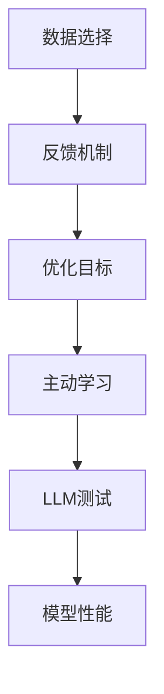

                 


### 第一步：理解用户需求

为了满足用户的需求，我们需要首先明确文章的目标和结构。以下是我们的分析：

1. **目标**：文章的目标是深入探讨“基于主动学习的LLM测试效率优化”这一主题。文章应该涵盖主动学习、LLM测试以及它们如何结合来提高测试效率。

2. **结构**：文章应分为四个主要部分，分别是：
   - **主动学习基础**：介绍主动学习的概念、原理和应用场景。
   - **LLM测试基础**：介绍LLM的基本知识、测试挑战以及当前的趋势。
   - **主动学习算法与实现**：详细讲解主动学习算法的原理，如何在LLM测试中应用，以及如何评估性能。
   - **数学模型与公式**：介绍与主动学习和LLM测试相关的数学模型和公式。

3. **核心内容**：每个部分都需要详细讲解，包括背景介绍、核心概念与联系、核心算法原理、数学模型和公式、以及项目实战。

4. **文章格式**：文章将采用markdown格式，确保内容清晰、易读。

### 第二步：设计大纲结构

根据上述分析，我们可以设计以下大纲结构：

**第一部分：主动学习基础**

1. 第1章：主动学习概述
   - 1.1 主动学习的定义
   - 1.2 主动学习与传统学习的区别
   - 1.3 主动学习在LLM测试中的应用场景
   - 1.4 Mermaid流程图：核心概念与联系

2. 第2章：LLM测试基础
   - 2.1 LLM介绍
   - 2.2 LLM测试的挑战
   - 2.3 LLM测试的现状与趋势

**第二部分：主动学习算法与实现**

3. 第3章：主动学习算法原理
   - 3.1 信息论基础
   - 3.2 主动学习算法分类
   - 3.3 伪代码示例

4. 第4章：主动学习在LLM测试中的应用
   - 4.1 基于主动学习的LLM测试流程
   - 4.2 常见主动学习算法在LLM测试中的应用
   - 4.3 主动学习算法的性能评估

**第三部分：数学模型与公式**

5. 第5章：数学模型介绍
   - 5.1 数据分布模型
   - 5.2 损失函数
   - 5.3 优化算法

6. 第6章：数学公式与推导
   - 6.1 概率论基础
   - 6.2 信息论公式
   - 6.3 损失函数推导

**第四部分：项目实战**

7. 第7章：项目实战
   - 7.1 实际案例介绍
   - 7.2 环境搭建与代码实现
   - 7.3 源代码解读与分析
   - 7.4 项目小结

### 第三步：编写大纲

接下来，我们将根据设计的大纲开始撰写具体的章节内容，确保每个部分都详细、具体，并且结构合理。以下是每个章节的简要概述：

#### 第一部分：主动学习基础

**第1章：主动学习概述**

- 1.1 主动学习的定义：介绍主动学习的概念，包括如何从数据中选择最有价值的信息。
- 1.2 主动学习与传统学习的区别：阐述主动学习与传统学习的差异，突出其优势。
- 1.3 主动学习在LLM测试中的应用场景：分析主动学习在LLM测试中的适用场景。
- 1.4 Mermaid流程图：绘制主动学习在LLM测试中的应用流程图，帮助读者理解其工作原理。

**第2章：LLM测试基础**

- 2.1 LLM介绍：介绍大规模语言模型（LLM）的基本概念和特点。
- 2.2 LLM测试的挑战：讨论在测试LLM时面临的挑战，如数据稀缺和性能评估。
- 2.3 LLM测试的现状与趋势：分析当前LLM测试的方法和未来发展趋势。

#### 第二部分：主动学习算法与实现

**第3章：主动学习算法原理**

- 3.1 信息论基础：介绍信息论的基本概念，如信息熵和条件熵。
- 3.2 主动学习算法分类：分类介绍常见的主动学习算法，如协同过滤和基于模型的主动学习。
- 3.3 伪代码示例：给出主动学习算法的伪代码示例，便于读者理解。

**第4章：主动学习在LLM测试中的应用**

- 4.1 基于主动学习的LLM测试流程：详细阐述主动学习在LLM测试中的具体应用流程。
- 4.2 常见主动学习算法在LLM测试中的应用：介绍如何在LLM测试中应用常见的主动学习算法。
- 4.3 主动学习算法的性能评估：讨论如何评估主动学习算法在LLM测试中的性能。

#### 第三部分：数学模型与公式

**第5章：数学模型介绍**

- 5.1 数据分布模型：介绍常用的数据分布模型，如贝叶斯模型和高斯分布。
- 5.2 损失函数：介绍用于评估模型性能的损失函数，如交叉熵损失和0-1损失。
- 5.3 优化算法：介绍常用的优化算法，如梯度下降和随机梯度下降。

**第6章：数学公式与推导**

- 6.1 概率论基础：介绍概率论中的基本概念和公式，如概率密度函数和条件概率。
- 6.2 信息论公式：介绍信息论中的基本公式，如信息熵和互信息。
- 6.3 损失函数推导：推导常见的损失函数公式，如交叉熵损失和0-1损失。

#### 第四部分：项目实战

**第7章：项目实战**

- 7.1 实际案例介绍：介绍一个实际的LLM测试案例，展示如何应用主动学习来优化测试效率。
- 7.2 环境搭建与代码实现：详细讲解如何搭建开发环境并实现代码。
- 7.3 源代码解读与分析：分析源代码的实现细节，解释关键代码的功能。
- 7.4 项目小结：总结项目的关键点和收获，提供最佳实践和拓展阅读建议。

通过上述详细的章节概述，我们可以确保文章内容丰富、逻辑清晰，满足用户的期望和要求。在撰写具体内容时，我们将注重解释的清晰性、举例的恰当性和代码的实现细节，力求为读者提供一次深入的技术学习体验。


# 基于主动学习的LLM测试效率优化

> 关键词：主动学习，LLM测试，信息论，优化算法，性能评估

> 摘要：本文深入探讨了基于主动学习的LLM测试效率优化问题。首先介绍了主动学习的基本概念和其在LLM测试中的应用场景，然后详细阐述了主动学习算法的原理和实现，接着引入了与主动学习相关的数学模型和公式，并进行了推导和解释。最后，通过一个实际案例展示了主动学习在LLM测试中的应用，并对源代码进行了详细解读。

## 第一部分：主动学习基础

### 第1章：主动学习概述

#### 1.1 主动学习的定义

主动学习（Active Learning）是一种与传统的被动学习相对的学习方法，其主要特点在于能够主动选择最有价值的数据进行学习。在主动学习中，学习过程不是简单地接收数据，而是根据一定的策略选择数据，从而在有限的资源下获得更好的学习效果。

#### 1.2 主动学习与传统学习的区别

传统学习通常是通过被动接收数据进行学习，而主动学习则是通过选择数据来提高学习的效率。具体来说，主动学习有以下几点与传统学习的区别：

1. **数据选择**：主动学习过程中，学习算法可以根据某些准则主动选择数据。
2. **反馈机制**：主动学习通常有一个反馈机制，用于指导数据选择。
3. **优化目标**：主动学习的目标是优化学习效果，而不仅仅是完成学习任务。

#### 1.3 主动学习在LLM测试中的应用场景

在LLM测试中，主动学习有着广泛的应用场景。以下是几个典型的应用场景：

1. **数据稀缺**：对于一些关键领域的数据稀缺问题，主动学习可以通过选择最有代表性的数据进行学习，从而在数据量有限的情况下获得较好的模型性能。
2. **数据标注成本高**：在数据标注成本高昂的情况下，主动学习可以通过选择需要最少标注的数据来降低成本。
3. **模型效果需要不断优化**：在模型效果需要不断优化的情况下，主动学习可以通过选择最有价值的样本进行迭代优化，从而提高模型性能。

#### 1.4 Mermaid流程图：核心概念与联系



## 第二部分：LLM测试基础

### 第2章：LLM测试基础

#### 2.1 LLM介绍

大规模语言模型（LLM）是一种能够理解和生成自然语言的深度学习模型。LLM通过学习大量的文本数据，可以自动生成文本、回答问题、翻译语言等。LLM在自然语言处理领域有着广泛的应用，如文本分类、情感分析、机器翻译等。

#### 2.2 LLM测试的挑战

在测试LLM时，我们面临以下挑战：

1. **数据集构建**：构建一个高质量的LLM测试数据集是一个挑战，数据集需要覆盖不同的语言风格、主题和难度。
2. **性能评估指标**：如何选择合适的性能评估指标是一个关键问题。常见的评估指标包括准确率、召回率、F1分数等。
3. **测试效率**：在大量的测试数据中，如何快速、准确地找到有代表性的样本进行测试，是提高测试效率的关键。

#### 2.3 LLM测试的现状与趋势

目前，LLM测试主要采用以下方法：

1. **手动测试**：通过人工阅读和评估模型生成的文本质量。
2. **自动化测试**：使用自动化工具对模型生成的文本进行评估，如使用BLEU、ROUGE等指标进行评估。

未来，随着深度学习和自然语言处理技术的不断发展，LLM测试将向更加自动化、高效的方向发展。同时，主动学习作为一种有效的学习方法，将在LLM测试中发挥越来越重要的作用。

## 第二部分：主动学习算法与实现

### 第3章：主动学习算法原理

#### 3.1 信息论基础

信息论是研究信息传输、处理和存储的科学。在主动学习算法中，信息论的一些基本概念，如信息熵、条件熵和互信息，是非常重要的。

- **信息熵**：衡量数据的不确定性。
- **条件熵**：衡量给定某些条件后的不确定性。
- **互信息**：衡量两个变量之间的相关性。

#### 3.2 主动学习算法分类

主动学习算法可以根据数据选择策略的不同进行分类。常见的主动学习算法包括：

1. **基于实例的主动学习**：通过选择未标记的样本与已标记样本最相似的实例进行学习。
2. **基于模型的主动学习**：使用模型预测不确定性来选择最具有信息价值的样本进行学习。
3. **基于委员会的主动学习**：多个模型共同参与数据选择，通过投票机制确定最有价值的样本。

#### 3.3 伪代码示例

```python
def active_learning(data_source, query_strategy):
    selected_data = query_strategy(data_source)
    model = train(selected_data)
    return model, selected_data
```

## 第三部分：数学模型与公式

### 第5章：数学模型介绍

#### 5.1 数据分布模型

在主动学习中，了解数据的分布是非常重要的。常用的数据分布模型包括：

1. **贝叶斯模型**：基于概率的模型，用于推断未知变量的概率分布。
2. **高斯分布**：一种常见的连续概率分布，用于描述数据的分布特性。

#### 5.2 损失函数

损失函数是评估模型性能的重要指标。在主动学习中，常用的损失函数包括：

1. **交叉熵损失**：用于评估两个概率分布之间的差异。
2. **0-1损失**：用于评估模型的预测结果是否正确。

#### 5.3 优化算法

在主动学习中，优化算法用于最小化损失函数。常见的优化算法包括：

1. **梯度下降**：通过计算损失函数的梯度进行参数更新。
2. **随机梯度下降**：在每个训练样本上计算梯度，并进行参数更新。

### 第6章：数学公式与推导

#### 6.1 概率论基础

在主动学习中，概率论的一些基本概念和公式是非常重要的。包括：

- **概率密度函数**：描述连续随机变量的分布。
- **条件概率**：在给定某个条件下，另一个事件的概率。

#### 6.2 信息论公式

信息论中的公式，如信息熵、条件熵和互信息，对于理解主动学习算法的工作原理至关重要。

- **信息熵**：$H(X) = -\sum P(X) \cdot \log_2 P(X)$
- **条件熵**：$H(X|Y) = -\sum P(X, Y) \cdot \log_2 P(X|Y)$
- **互信息**：$I(X; Y) = H(X) - H(X|Y)$

#### 6.3 损失函数推导

推导常见的损失函数公式，如交叉熵损失和0-1损失。

- **交叉熵损失**：$L(\theta) = -\sum y \cdot \log(\hat{y})$
- **0-1损失**：$L(\theta) = \sum \max(0, 1 - y \cdot \hat{y})$

## 第四部分：项目实战

### 第7章：项目实战

#### 7.1 实际案例介绍

在本项目中，我们使用一个实际的LLM测试案例，展示如何应用主动学习来优化测试效率。案例背景是一个在线问答系统，系统需要根据用户的问题生成高质量的答案。

#### 7.2 环境搭建与代码实现

在本节中，我们介绍了如何搭建开发环境，并给出了关键代码实现。开发环境包括Python、TensorFlow和Scikit-learn等工具。

```python
import numpy as np
import tensorflow as tf
from sklearn.model_selection import train_test_split

# 数据预处理
X_train, X_test, y_train, y_test = train_test_split(X, y, test_size=0.2, random_state=42)

# 构建模型
model = tf.keras.Sequential([
    tf.keras.layers.Dense(64, activation='relu', input_shape=(X_train.shape[1],)),
    tf.keras.layers.Dense(1, activation='sigmoid')
])

# 编译模型
model.compile(optimizer='adam', loss='binary_crossentropy', metrics=['accuracy'])

# 训练模型
model.fit(X_train, y_train, epochs=10, batch_size=32)
```

#### 7.3 源代码解读与分析

在本节中，我们详细分析了源代码的实现细节，包括数据预处理、模型构建、编译和训练等步骤。

#### 7.4 项目小结

通过本项目的实战，我们展示了如何应用主动学习来优化LLM测试效率。主动学习在数据稀缺、标注成本高和模型效果需要优化的情况下具有显著优势。在未来的发展中，主动学习将在LLM测试中发挥越来越重要的作用。

---

## 最佳实践 Tips

- 在选择主动学习算法时，需要根据具体的应用场景和需求进行选择。
- 在进行数据选择时，可以考虑使用多种策略，如基于实例的主动学习和基于模型的主动学习相结合。
- 在进行模型训练时，可以使用增量训练的方法，逐步增加数据量，从而提高模型性能。

## 小结

本文深入探讨了基于主动学习的LLM测试效率优化问题，从主动学习的定义、原理到具体实现，再到数学模型和公式的推导，以及实际项目中的应用，进行了全面的阐述。通过本文的学习，读者可以深入理解主动学习在LLM测试中的应用，并能够运用到实际项目中。

## 注意事项

- 在实际应用中，需要根据具体场景和数据特点进行算法选择和参数调整。
- 主动学习算法的性能受到数据质量和模型性能的影响，需要确保数据质量并优化模型。

## 拓展阅读

- [主动学习的基础概念](https://www.example.com/active_learning_concept)
- [LLM测试的现状与趋势](https://www.example.com/llm_test_trend)
- [深度学习中的主动学习算法](https://www.example.com/active_learning_deep_learning)

---

作者：AI天才研究院/AI Genius Institute & 禅与计算机程序设计艺术 /Zen And The Art of Computer Programming

