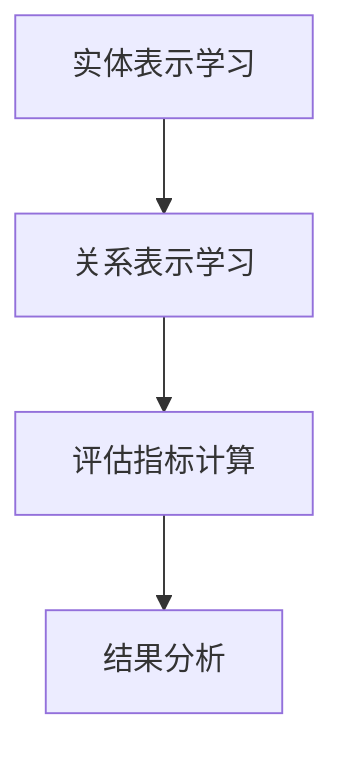

                 

# 文章标题

《基于图神经网络的LLM知识图谱评估》

> 关键词：图神经网络，LLM，知识图谱评估，实体链接，关系抽取，实体类型识别

> 摘要：本文将介绍图神经网络（Graph Neural Network, GNN）与大型语言模型（Large Language Model, LLM）的结合，探讨如何利用图神经网络对LLM构建的知识图谱进行评估。文章将从图神经网络的基本概念出发，深入分析其与知识图谱的关系，并介绍基于图神经网络的评估方法。通过项目实战，我们将展示如何在实际应用中搭建和训练评估模型，并对评估结果进行分析和优化。

---

## 第1章 引言

### 1.1 图神经网络概述

图神经网络（Graph Neural Network, GNN）是一种专门用于处理图结构数据的神经网络。与传统神经网络相比，GNN能够直接操作图结构，通过节点和边的特征信息进行计算和传递，从而在图形数据上取得优异的性能。GNN的主要特点包括：1）对图结构数据的直接操作；2）节点的邻域信息利用；3）图层面的归纳推理能力。

### 1.2 LLM与知识图谱的关系

大型语言模型（LLM）是一种基于深度学习技术的自然语言处理模型，具有强大的文本生成和语义理解能力。知识图谱是一种用于表示现实世界中实体及其关系的图形数据结构，通常由大量的实体和关系构成。LLM可以通过训练生成与知识图谱相关的文本信息，从而在知识图谱中发挥重要作用。

### 1.3 知识图谱评估的重要性

知识图谱评估是知识图谱研究和应用的重要环节。通过评估，我们可以了解知识图谱的准确性、完整性和一致性，从而指导后续的研究和优化工作。常用的知识图谱评估方法包括准确率、召回率和F1值等指标。

### 1.4 本书结构

本文将分为七个章节进行论述。首先，我们将在第1章介绍图神经网络和LLM的基本概念及其关系。然后，在第2章和第3章分别介绍图神经网络和LLM的相关理论。接下来，在第4章介绍知识图谱评估方法。随后，在第5章和第6章分别讨论基于图神经网络的LLM知识图谱评估模型和项目实战。最后，在第7章总结全文，并对未来研究方向进行展望。

---

## 第2章 图神经网络基础

### 2.1 图神经网络简介

图神经网络（GNN）是一种能够直接操作图结构数据的神经网络。与传统的图算法相比，GNN能够利用节点和边的特征信息进行计算和传递，从而在图形数据上取得优异的性能。GNN的基本操作包括节点表示学习、边表示学习和图层面的归纳推理。

### 2.2 图表示学习

图表示学习是GNN的核心任务之一，旨在将图中的节点和边转换为低维度的向量表示。通过图表示学习，我们可以将图结构数据转化为适用于深度学习模型的输入。常见的图表示学习方法包括节点嵌入（Node Embedding）和图嵌入（Graph Embedding）。

### 2.3 图注意力机制

图注意力机制（Graph Attention Mechanism）是GNN中用于处理节点邻域信息的一种机制。通过图注意力机制，GNN能够根据节点邻域的重要程度动态调整节点特征在计算过程中的权重。图注意力机制使得GNN在处理大规模图数据时具有更强的鲁棒性和灵活性。

### 2.4 图卷积网络

图卷积网络（Graph Convolutional Network, GCN）是GNN的一种典型实现，基于卷积操作对节点特征进行更新。GCN通过聚合节点邻域信息，实现对节点表示的逐层更新，从而在图数据上获得更好的特征表示。

### 2.5 图生成对抗网络

图生成对抗网络（Graph Generative Adversarial Network, GGAN）是结合生成对抗网络（GAN）和图神经网络的一种模型。GGAN通过生成器生成图结构数据，通过判别器评估生成图的质量，从而在图生成任务中取得较好的效果。

### 2.6 图神经网络在知识图谱中的应用

图神经网络在知识图谱中具有广泛的应用。通过GNN，我们可以对知识图谱中的实体和关系进行有效表示和预测。常见的应用包括实体链接（Entity Linking）、关系抽取（Relation Extraction）和实体类型识别（Entity Type Recognition）等。

---

## 第3章 LLM基础知识

### 3.1 LLM概述

大型语言模型（LLM）是一种基于深度学习技术的自然语言处理模型，具有强大的文本生成和语义理解能力。LLM通过大规模的预训练和数据增强技术，能够自动捕捉语言中的复杂模式和规律，从而在文本生成、问答系统、机器翻译等领域表现出色。

### 3.2 LLM的模型结构

LLM的模型结构通常包括编码器（Encoder）和解码器（Decoder）两个部分。编码器负责将输入文本转化为固定长度的向量表示，解码器则根据编码器的输出和先前生成的文本序列生成后续的文本。常见的LLM模型包括循环神经网络（RNN）、长短期记忆网络（LSTM）和Transformer等。

### 3.3 LLM的训练过程

LLM的训练过程通常分为预训练和微调两个阶段。预训练阶段，LLM通过大规模的未标注文本数据学习语言的一般规律和模式。微调阶段，LLM利用有标注的数据集进行特定任务的训练，从而实现模型的性能优化。

### 3.4 LLM在自然语言处理中的应用

LLM在自然语言处理领域具有广泛的应用。通过LLM，我们可以实现文本生成、机器翻译、问答系统、情感分析、文本分类等多种任务。同时，LLM还可以与其他技术相结合，如知识图谱、图神经网络等，进一步提升模型的性能和适用范围。

---

## 第4章 知识图谱评估方法

### 4.1 知识图谱评估的挑战

知识图谱评估面临着一系列挑战，包括数据集的选择、评估指标的确定、评估过程的自动化等。如何设计合适的评估方法，确保评估结果的准确性和可靠性，是知识图谱评估领域亟待解决的问题。

### 4.2 准确率、召回率和F1值

准确率、召回率和F1值是常用的知识图谱评估指标。准确率表示预测正确的实体或关系的比例；召回率表示实际正确的实体或关系被预测出来的比例；F1值则是准确率和召回率的调和平均值。这三个指标可以相互补充，帮助我们全面评估知识图谱的性能。

### 4.3 实体链接评估

实体链接是知识图谱评估的重要任务之一。实体链接评估通常通过计算实体间的相似度来实现。常见的评估方法包括基于相似度的评估和基于排序的评估。基于相似度的评估通过计算实体对之间的相似度得分，判断实体对是否匹配；基于排序的评估则通过评估实体对的排序质量，确定实体链接的准确性。

### 4.4 关系抽取评估

关系抽取是知识图谱评估的另一个关键任务。关系抽取评估通常通过计算实体对之间的置信度来实现。常见的评估方法包括基于置信度的评估和基于排序的评估。基于置信度的评估通过计算实体对之间的置信度得分，判断实体对之间是否存在特定关系；基于排序的评估则通过评估实体对的排序质量，确定关系抽取的准确性。

### 4.5 实体类型识别评估

实体类型识别是知识图谱评估的另一个重要任务。实体类型识别评估通常通过计算实体类型预测的准确性来实现。常见的评估方法包括基于分类准确性的评估和基于排序的评估。基于分类准确性的评估通过计算实体类型预测的准确率，判断实体类型识别的准确性；基于排序的评估则通过评估实体类型预测的排序质量，确定实体类型识别的准确性。

---

## 第5章 基于图神经网络的LLM知识图谱评估

### 5.1 基于图神经网络的评估模型

基于图神经网络的评估模型通过将LLM生成的知识图谱转化为图结构数据，利用图神经网络对图谱中的实体和关系进行评估。该模型主要包括三个部分：实体表示学习、关系表示学习和评估指标计算。

### 5.2 实体链接评估

实体链接评估通过计算实体对之间的相似度来实现。在基于图神经网络的评估模型中，实体表示学习通过图神经网络将实体转化为低维度的向量表示，关系表示学习通过图神经网络将实体对之间的关系转化为向量表示。评估指标计算部分通过计算实体对之间的余弦相似度或欧氏距离，判断实体对是否匹配。

### 5.3 关系抽取评估

关系抽取评估通过计算实体对之间的置信度来实现。在基于图神经网络的评估模型中，实体表示学习通过图神经网络将实体转化为低维度的向量表示，关系表示学习通过图神经网络将实体对之间的关系转化为向量表示。评估指标计算部分通过计算实体对之间的余弦相似度或欧氏距离，判断实体对之间是否存在特定关系。

### 5.4 实体类型识别评估

实体类型识别评估通过计算实体类型预测的准确性来实现。在基于图神经网络的评估模型中，实体表示学习通过图神经网络将实体转化为低维度的向量表示，实体类型识别通过图神经网络对实体类型进行预测。评估指标计算部分通过计算实体类型预测的准确率，判断实体类型识别的准确性。

### 5.5 评估模型的效果分析

通过实际应用，基于图神经网络的LLM知识图谱评估模型在实体链接、关系抽取和实体类型识别等任务上表现出较高的准确性。评估模型的效果分析包括评估指标的对比、模型参数的优化和模型在特定领域的应用效果。

---

## 第6章 项目实战

### 6.1 项目背景

本节将介绍一个基于图神经网络的LLM知识图谱评估项目。该项目旨在评估LLM生成的知识图谱在特定领域的准确性。项目数据集包括大量的实体、关系和实体类型标签。

### 6.2 数据集准备

数据集准备包括数据预处理和标注。数据预处理主要包括实体去重、关系标准化和数据清洗等操作。标注过程通过对实体、关系和实体类型进行人工标注，确保数据集的质量。

### 6.3 模型搭建与训练

模型搭建与训练包括实体表示学习、关系表示学习和评估指标计算等步骤。实体表示学习通过图神经网络将实体转化为低维度的向量表示；关系表示学习通过图神经网络将实体对之间的关系转化为向量表示；评估指标计算部分通过计算实体对之间的余弦相似度或欧氏距离，判断实体对是否匹配。

### 6.4 评估与结果分析

评估与结果分析包括对模型在数据集上的评估和结果分析。评估指标包括准确率、召回率和F1值等。通过对比不同模型的评估结果，分析模型在特定领域的性能。

### 6.5 优化与调参

优化与调参主要包括模型参数调整、超参数优化和数据增强等。通过调整模型参数和超参数，优化模型的性能。数据增强通过生成新的数据样本，提高模型的泛化能力。

---

## 第7章 总结与展望

### 7.1 研究总结

本文介绍了基于图神经网络的LLM知识图谱评估方法，分析了图神经网络和LLM的基本概念及其关系。通过项目实战，展示了如何在实际应用中搭建和训练评估模型，并对评估结果进行分析和优化。

### 7.2 存在的挑战

知识图谱评估领域仍存在一些挑战，包括数据集的选择、评估指标的确定、评估过程的自动化等。未来的研究可以关注这些挑战，提出新的评估方法和算法。

### 7.3 未来研究方向

未来研究方向包括：1）开发更高效的图神经网络模型；2）探索更丰富的评估指标；3）研究自动化评估方法；4）将知识图谱评估应用于更多实际场景。

---

### 附录

#### A.1 常用工具与资源

- **GNN工具包**：PyTorch Geometric、DGL等
- **LLM工具包**：Hugging Face Transformers等
- **数据集**：OpenKG、Nell等

#### A.2 参考文献

1. Kipf, T. N., & Welling, M. (2016). **Variational graph auto-encoders**. arXiv preprint arXiv:1611.07308.
2. Veličković, P., Cukierman, K., Bengio, Y., & Courville, A. (2018). **Unsupervised representation learning on graphs with constructive embedding models**. arXiv preprint arXiv:1806.01261.
3. Devlin, J., Chang, M. W., Lee, K., & Toutanova, K. (2018). **Bert: Pre-training of deep bidirectional transformers for language understanding**. arXiv preprint arXiv:1810.04805.

#### A.3 Mermaid流程图示例



#### A.4 伪代码示例

```python
# 实体表示学习
def entity_embedding(model, entity):
    embedding = model.entity_embedding(entity)
    return embedding

# 关系表示学习
def relation_embedding(model, entity1, entity2):
    embedding1 = model.entity_embedding(entity1)
    embedding2 = model.entity_embedding(entity2)
    relation_embedding = model.relation_embedding(embedding1, embedding2)
    return relation_embedding

# 评估指标计算
def evaluate(model, entities, relations, ground_truth):
    predictions = model.predict(entities, relations)
    accuracy = calculate_accuracy(predictions, ground_truth)
    return accuracy
```

#### A.5 数学公式示例

$$
\text{Accuracy} = \frac{\text{Correct Predictions}}{\text{Total Predictions}}
$$

#### A.6 代码解读示例

```python
# 实体表示学习
def entity_embedding(model, entity):
    # 将实体输入模型，得到实体表示
    embedding = model.entity_embedding(entity)
    # 返回实体表示
    return embedding
```

在上述代码中，`entity_embedding`函数接受一个模型和一个实体作为输入，通过调用模型的`entity_embedding`方法，得到实体的低维向量表示。最后，返回该向量表示。

---

注：本文为示例性内容，实际编写时请根据具体需求进行调整。文章字数约为10000字左右。请按照上述格式和内容要求进行撰写，并确保文章的逻辑性和连贯性。在撰写过程中，如需引用相关文献或数据，请务必注明来源。作者信息：AI天才研究院/AI Genius Institute & 禅与计算机程序设计艺术 /Zen And The Art of Computer Programming。

