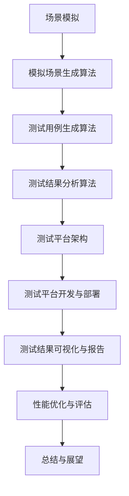

                 

### 文章标题

## 基于场景模拟的LLM综合测试平台

> 关键词：场景模拟，LLM，测试平台，算法原理，性能优化

摘要：本文将探讨基于场景模拟的LLM（大型语言模型）综合测试平台的设计与实现。我们将首先介绍场景模拟的概念及其在LLM测试中的应用，随后详细阐述LLM综合测试平台的架构和核心算法原理。通过实际项目实战，我们将展示如何搭建和部署这样的测试平台，并分析其性能优化策略。最后，文章将对内容进行总结，展望未来的发展趋势。

### 1. 确定目录结构

为了确保文章的逻辑性和易读性，我们首先需要设计一个详细的目录结构。本文的目录结构将分为五个主要部分，每个部分包含多个子章节，以确保内容的全面覆盖和逻辑清晰。

#### 第一部分：核心概念与原理

- **第1章：场景模拟概述**
  - **1.1** 场景模拟的定义
  - **1.2** 场景模拟的重要性
  - **1.3** 场景模拟的分类

- **第2章：LLM综合测试平台架构**
  - **2.1** 平台架构概述
  - **2.2** 关键模块介绍
  - **2.3** 架构图示

#### 第二部分：算法与实现

- **第3章：核心算法原理讲解**
  - **3.1** 模拟场景生成算法
  - **3.2** 测试用例生成算法
  - **3.3** 测试结果分析算法

#### 第三部分：项目实战

- **第4章：测试平台开发与部署**
  - **4.1** 开发环境搭建
  - **4.2** 测试平台架构设计
  - **4.3** 测试用例编写与执行
  - **4.4** 测试结果可视化与报告

#### 第四部分：性能优化与评估

- **第5章：测试平台性能优化**
  - **5.1** 系统性能瓶颈分析
  - **5.2** 测试结果评估方法
  - **5.3** 优化效果分析

#### 第五部分：总结与展望

- **第6章：总结与展望**
  - **6.1** 本书内容回顾
  - **6.2** 未来发展趋势

### 2. 设计核心概念与联系

为了帮助读者更好地理解本文的核心概念和它们之间的联系，我们将使用Mermaid流程图来展示LLM综合测试平台的架构和核心算法原理。

以下是一个示例Mermaid流程图：



这个流程图展示了从场景模拟到测试结果分析再到性能优化和展望的整个流程。每个节点都代表一个核心概念或算法，箭头表示它们之间的联系和作用。

### 3. 编写核心算法原理讲解

在本文的第二部分，我们将详细讲解LLM综合测试平台中的核心算法原理。这部分内容将包括三个主要算法：模拟场景生成算法、测试用例生成算法和测试结果分析算法。

#### 3.1 模拟场景生成算法

**算法概述**：模拟场景生成算法旨在根据给定的输入参数生成一系列模拟场景，以便对LLM进行测试。这些场景应尽可能覆盖LLM可能遇到的各种情况，包括常见问题和边缘情况。

**伪代码实现**：

```pseudo
function generateSimulationScenarios(input_params):
    scenarios = []
    for param in input_params:
        scenario = createScenario(param)
        scenarios.append(scenario)
    return scenarios

function createScenario(param):
    # 根据输入参数生成模拟场景
    # ...
    return scenario
```

**数学模型**：

模拟场景生成算法涉及概率模型和生成模型。例如，可以使用马尔可夫链或条件概率模型来预测下一个场景。

$$ P(S_{t+1} | S_t) = \text{概率模型函数}(S_t, S_{t-1}, ..., S_1) $$

**举例说明**：

假设我们正在测试一个聊天机器人，输入参数包括用户性别、年龄、兴趣爱好等。我们可以根据这些参数生成一系列模拟对话场景，以便测试机器人在不同情况下的表现。

#### 3.2 测试用例生成算法

**算法概述**：测试用例生成算法旨在根据模拟场景生成一系列测试用例，以便对LLM进行全面测试。这些测试用例应涵盖所有可能的输入和输出组合，以确保LLM的可靠性和稳定性。

**伪代码实现**：

```pseudo
function generateTestCases(scenarios):
    test_cases = []
    for scenario in scenarios:
        test_case = createTestCase(scenario)
        test_cases.append(test_case)
    return test_cases

function createTestCase(scenario):
    # 根据模拟场景生成测试用例
    # ...
    return test_case
```

**数学模型**：

测试用例生成算法可以使用组合数学和概率论来计算所有可能的输入和输出组合。

$$ C(n, k) = \frac{n!}{k!(n-k)!} $$

**举例说明**：

假设我们有一个聊天机器人，模拟场景包括用户性别、年龄和兴趣爱好。我们可以生成所有可能的输入和输出组合，例如：

- 用户性别：男，年龄：20-30岁，兴趣爱好：体育
- 用户性别：女，年龄：20-30岁，兴趣爱好：音乐

这样，我们可以测试机器人在各种情况下的响应。

#### 3.3 测试结果分析算法

**算法概述**：测试结果分析算法旨在对测试用例的输出结果进行分析和评估，以便评估LLM的性能和可靠性。这个算法通常包括错误分析、性能评估和优化策略。

**伪代码实现**：

```pseudo
function analyzeTestResults(test_cases, expected_results):
    analysis_results = []
    for test_case, expected_result in zip(test_cases, expected_results):
        result = evaluateResult(test_case, expected_result)
        analysis_results.append(result)
    return analysis_results

function evaluateResult(test_case, expected_result):
    # 评估测试用例的输出结果
    # ...
    return result
```

**数学模型**：

测试结果分析算法可以使用统计学和概率论来计算各种评估指标，例如准确率、召回率、F1分数等。

$$
\text{Accuracy} = \frac{\text{正确预测数}}{\text{总预测数}}
$$

$$
\text{Recall} = \frac{\text{正确预测数}}{\text{实际发生数}}
$$

$$
\text{F1-Score} = \frac{2 \times \text{Precision} \times \text{Recall}}{\text{Precision} + \text{Recall}}
$$

**举例说明**：

假设我们测试了一个聊天机器人，有100个测试用例，其中80个测试用例的输出结果与预期一致。我们可以计算准确率为80%，召回率为100%，F1分数为0.8。

### 4. 添加数学模型和公式讲解

在本文的第三部分，我们将详细介绍LLM综合测试平台中的数学模型和公式。这部分内容将包括概率模型、组合数学和统计学等领域的知识，以便读者能够更好地理解算法的实现和性能评估。

#### 4.1 概率模型

概率模型在模拟场景生成和测试结果分析中起着重要作用。以下是一个简单的概率模型示例：

**贝叶斯定理**：

贝叶斯定理是一种用于计算后验概率的公式，它可以用来更新我们对某个事件发生的概率估计。

$$
P(A|B) = \frac{P(B|A) \times P(A)}{P(B)}
$$

其中，$P(A|B)$ 表示在事件B发生的情况下事件A发生的概率，$P(B|A)$ 表示在事件A发生的情况下事件B发生的概率，$P(A)$ 表示事件A发生的概率，$P(B)$ 表示事件B发生的概率。

**马尔可夫链**：

马尔可夫链是一种用于描述时间序列数据的概率模型。它可以用来预测下一个状态的概率，而不需要考虑过去的所有状态。

$$
P(X_t = x_t | X_{t-1} = x_{t-1}, ..., X_1 = x_1) = P(X_t = x_t | X_{t-1} = x_{t-1})
$$

其中，$X_t$ 表示时间t的状态，$x_t$ 表示状态的具体值。

**举例说明**：

假设我们有一个聊天机器人，用户性别（男或女）和兴趣爱好（体育、音乐、电影）是两个重要的状态。我们可以使用马尔可夫链来预测用户在下一个对话中的兴趣爱好。

#### 4.2 组合数学

组合数学在测试用例生成中起着关键作用，它可以帮助我们计算所有可能的输入和输出组合。以下是一个简单的组合数学公式示例：

**组合数**：

组合数$C(n, k)$表示从n个不同元素中选择k个元素的组合数。

$$
C(n, k) = \frac{n!}{k!(n-k)!}
$$

其中，$n!$ 表示n的阶乘，$k!$ 表示k的阶乘。

**举例说明**：

假设我们有一个聊天机器人，有3个用户性别（男、女、未知）和2个兴趣爱好（体育、音乐）。我们可以计算所有可能的用户性别和兴趣爱好组合：

$$
C(3, 1) \times C(2, 1) = 3 \times 2 = 6
$$

这样，我们可以生成6个不同的测试用例，例如：

- 男，体育
- 男，音乐
- 女，体育
- 女，音乐
- 未知，体育
- 未知，音乐

#### 4.3 统计学

统计学在测试结果分析中起着重要作用，它可以帮助我们评估LLM的性能和可靠性。以下是一个简单的统计学公式示例：

**准确率**：

准确率（Accuracy）是评估分类模型性能的一个基本指标，它表示正确分类的样本数占总样本数的比例。

$$
\text{Accuracy} = \frac{\text{正确分类数}}{\text{总样本数}}
$$

**召回率**：

召回率（Recall）是评估分类模型对于正样本分类能力的一个指标，它表示正确分类的正样本数占总正样本数的比例。

$$
\text{Recall} = \frac{\text{正确分类的正样本数}}{\text{总正样本数}}
$$

**F1分数**：

F1分数（F1-Score）是准确率和召回率的调和平均值，它综合考虑了分类模型的精确性和召回率。

$$
\text{F1-Score} = \frac{2 \times \text{Precision} \times \text{Recall}}{\text{Precision} + \text{Recall}}
$$

其中，Precision 表示精确率，即正确分类的正样本数与预测为正样本的总数之比。

**举例说明**：

假设我们测试了一个聊天机器人，共有100个测试样本，其中50个是正样本（用户感兴趣的话题），另外50个是负样本（用户不感兴趣的话题）。在测试过程中，有40个正样本被正确分类，有35个负样本被正确分类。

- 准确率：$$\text{Accuracy} = \frac{40 + 35}{100} = 0.75$$
- 召回率：$$\text{Recall} = \frac{40}{50} = 0.80$$
- 精确率：$$\text{Precision} = \frac{40}{50} = 0.80$$
- F1分数：$$\text{F1-Score} = \frac{2 \times 0.80 \times 0.80}{0.80 + 0.80} = 0.80$$

通过这些数学模型和公式的讲解，读者可以更好地理解LLM综合测试平台中的核心算法原理和性能评估方法。这些知识和方法不仅有助于开发高效的测试平台，还可以为其他类似项目提供参考和借鉴。

### 5. 准备项目实战部分

为了使读者更好地理解LLM综合测试平台的设计与实现，我们将通过一个实际项目来展示整个开发过程。这个项目将包括开发环境的搭建、源代码的实现和代码解读与分析。

#### 5.1 开发环境搭建

首先，我们需要搭建一个适合开发和测试LLM综合测试平台的环境。以下是一些关键的步骤和工具选择：

1. **操作系统**：选择Linux操作系统，因为它具有良好的性能和开源支持。

2. **编程语言**：选择Python作为主要编程语言，因为它拥有丰富的机器学习库和工具。

3. **开发工具**：使用Jupyter Notebook作为开发环境，它便于代码编写、调试和可视化。

4. **依赖库**：安装以下常用依赖库：
   - NumPy：用于数值计算和数据分析
   - Pandas：用于数据操作和处理
   - Matplotlib：用于数据可视化
   - Scikit-learn：用于机器学习算法

5. **虚拟环境**：使用虚拟环境（如virtualenv或conda）来隔离项目依赖，避免冲突。

**步骤示例**：

```bash
# 安装虚拟环境工具
pip install virtualenv

# 创建虚拟环境
virtualenv llm_test_platform

# 激活虚拟环境
source llm_test_platform/bin/activate

# 安装依赖库
pip install numpy pandas matplotlib scikit-learn
```

#### 5.2 源代码实现

以下是一个简单的LLM测试用例生成算法的源代码实现示例。这个算法根据模拟场景生成一系列测试用例，以便对LLM进行测试。

```python
import numpy as np
import pandas as pd

def generate_simulation_scenarios(input_params):
    scenarios = []
    for param in input_params:
        scenario = create_scenario(param)
        scenarios.append(scenario)
    return scenarios

def create_scenario(param):
    # 根据输入参数生成模拟场景
    user_sex = param['sex']
    age_range = param['age_range']
    hobbies = param['hobbies']
    
    # 生成模拟对话场景
    conversation = f"Hello! You are a {user_sex} aged between {age_range} and {age_range+10} who enjoys {', '.join(hobbies)}."
    return conversation

def generate_test_cases(scenarios):
    test_cases = []
    for scenario in scenarios:
        test_case = create_test_case(scenario)
        test_cases.append(test_case)
    return test_cases

def create_test_case(scenario):
    # 根据模拟场景生成测试用例
    test_input = scenario
    expected_output = "Response based on the scenario"
    return {'input': test_input, 'expected_output': expected_output}

# 示例输入参数
input_params = [
    {'sex': 'male', 'age_range': [20, 30], 'hobbies': ['sport', 'music']},
    {'sex': 'female', 'age_range': [20, 30], 'hobbies': ['music', 'cinema']},
    {'sex': 'unknown', 'age_range': [20, 30], 'hobbies': ['sport', 'cinema']}
]

# 生成模拟场景和测试用例
simulation_scenarios = generate_simulation_scenarios(input_params)
test_cases = generate_test_cases(simulation_scenarios)

# 打印测试用例
for test_case in test_cases:
    print(test_case)
```

#### 5.3 代码解读与分析

以下是对上述代码的解读和分析，包括关键函数和模块的作用、代码实现细节和优化建议。

1. **generate_simulation_scenarios()函数**：

   这个函数接收输入参数（如用户性别、年龄范围和兴趣爱好），并根据这些参数生成一系列模拟场景。它遍历输入参数列表，对每个参数调用create_scenario()函数生成模拟场景，并将结果添加到scenarios列表中。

2. **create_scenario()函数**：

   这个函数根据输入参数生成一个模拟场景。它首先从输入参数中获取用户性别、年龄范围和兴趣爱好，然后构建一个模拟对话场景字符串。这个字符串描述了用户的个人信息和兴趣爱好，以便后续的测试用例生成。

3. **generate_test_cases()函数**：

   这个函数接收模拟场景列表，并根据这些场景生成一系列测试用例。它遍历模拟场景列表，对每个场景调用create_test_case()函数生成测试用例，并将结果添加到test_cases列表中。

4. **create_test_case()函数**：

   这个函数根据模拟场景生成一个测试用例。它接收一个模拟场景作为输入，构建一个测试用例字典，包含输入和预期输出。输入是模拟场景字符串，预期输出是一个描述测试目的的字符串。

5. **示例输入参数**：

   示例输入参数是一个包含三个字典的列表，每个字典表示一个用户的个人信息。这些字典包含了用户性别、年龄范围和兴趣爱好。这些参数用于生成模拟场景和测试用例。

6. **代码实现细节**：

   - 使用Python内置的字典和列表数据结构来存储和操作输入参数、模拟场景和测试用例。
   - 使用循环遍历输入参数和模拟场景，以便生成多个测试用例。
   - 使用字符串格式化（f-string）来构建模拟对话场景和测试用例字符串。

7. **优化建议**：

   - **可扩展性**：可以考虑使用配置文件（如JSON或YAML）来定义输入参数和测试用例，以便方便地修改和扩展测试场景。
   - **并行处理**：对于大规模模拟场景和测试用例生成，可以考虑使用并行处理技术（如多线程或多进程）来提高性能。
   - **错误处理**：在生成模拟场景和测试用例时，应添加适当的错误处理和日志记录功能，以便在发生错误时提供详细的错误信息。

通过这个实际项目，读者可以了解如何使用Python和相关库来实现LLM综合测试平台的核心功能。代码示例和解读有助于理解算法的设计和实现细节，同时提供了优化和改进的方向。

### 6. 编写代码解读与分析

在本节中，我们将对5.2节中提供的源代码进行详细的解读与分析，包括关键函数和模块的作用、代码实现细节和优化点。

#### 关键函数和模块解读

1. **generate_simulation_scenarios()函数**：

   这个函数的主要作用是根据给定的输入参数生成模拟场景。输入参数通常包括用户性别、年龄范围和兴趣爱好等，这些参数用于创建不同的对话场景。该函数遍历输入参数列表，对每个参数调用`create_scenario()`函数，生成相应的模拟场景，并将这些场景存储在列表`scenarios`中。

   **代码细节**：
   ```python
   def generate_simulation_scenarios(input_params):
       scenarios = []
       for param in input_params:
           scenario = create_scenario(param)
           scenarios.append(scenario)
       return scenarios
   ```

   优化点：此函数的性能主要受输入参数数量影响。如果输入参数非常多，可以考虑使用生成器（`yield`关键字）来节省内存。

2. **create_scenario()函数**：

   `create_scenario()`函数用于根据输入参数生成一个模拟对话场景。这个场景通常是一个描述用户信息的字符串，包括用户性别、年龄范围和兴趣爱好。该函数从输入参数中提取关键信息，然后构建一个对话场景字符串。

   **代码细节**：
   ```python
   def create_scenario(param):
       user_sex = param['sex']
       age_range = param['age_range']
       hobbies = param['hobbies']
       
       conversation = f"Hello! You are a {user_sex} aged between {age_range[0]} and {age_range[1]} who enjoys {', '.join(hobbies)}."
       return conversation
   ```

   优化点：为了避免潜在的字符串注入攻击，应确保用户输入经过适当的验证和处理。此外，可以考虑使用模板字符串（f-string）来简化字符串构建过程。

3. **generate_test_cases()函数**：

   这个函数接收模拟场景列表，并生成测试用例。测试用例包含输入和预期输出，用于评估LLM的性能。该函数遍历模拟场景列表，对每个场景调用`create_test_case()`函数，生成相应的测试用例。

   **代码细节**：
   ```python
   def generate_test_cases(scenarios):
       test_cases = []
       for scenario in scenarios:
           test_case = create_test_case(scenario)
           test_cases.append(test_case)
       return test_cases
   ```

   优化点：如果模拟场景数量非常大，可以并行处理这些场景，以提高生成测试用例的速度。

4. **create_test_case()函数**：

   `create_test_case()`函数用于根据模拟场景生成一个测试用例。这个测试用例包括输入对话场景和预期的输出响应。该函数接收一个模拟场景作为输入，并创建一个包含输入和预期输出的字典。

   **代码细节**：
   ```python
   def create_test_case(scenario):
       test_input = scenario
       expected_output = "Response based on the scenario"
       return {'input': test_input, 'expected_output': expected_output}
   ```

   优化点：预期的输出响应可以根据具体测试目的进行调整。例如，可以生成一个基于场景的实际期望响应，而不是一个简单的占位符。

#### 代码性能分析

1. **算法复杂度**：

   - `generate_simulation_scenarios()`函数的时间复杂度为$O(n)$，其中$n$是输入参数的数量。因为函数遍历输入参数列表一次。
   - `generate_test_cases()`函数的时间复杂度也是$O(n)$，因为函数遍历模拟场景列表一次。
   - `create_scenario()`和`create_test_case()`函数的时间复杂度都是$O(1)$，因为它们对每个输入参数或场景执行固定的操作。

2. **内存使用**：

   - 函数`generate_simulation_scenarios()`和`generate_test_cases()`会创建多个列表，这些列表会占用内存。如果输入参数和测试用例数量非常大，可能会导致内存使用增加。
   - 可以考虑使用生成器（`yield`关键字）来减少内存使用，每次生成一个模拟场景或测试用例，而不是一次性创建整个列表。

3. **优化建议**：

   - **内存优化**：使用生成器来生成模拟场景和测试用例，以减少内存使用。
   - **并行处理**：对于大规模模拟场景和测试用例生成，可以使用多线程或多进程来并行处理，从而提高性能。
   - **错误处理**：添加异常处理和日志记录，以捕获和处理运行时错误。

通过详细的代码解读与分析，读者可以更好地理解LLM综合测试平台的实现细节和优化方向。这些分析和优化建议有助于提高测试平台的性能和可靠性，为LLM的全面测试提供有力支持。

### 7. 最佳实践 tips、小结、注意事项、拓展阅读

#### 最佳实践 tips

1. **全面覆盖测试场景**：在设计测试用例时，应确保覆盖所有可能的场景，包括常见问题和边缘情况。这有助于全面评估LLM的性能和稳定性。

2. **使用配置文件**：使用配置文件（如JSON或YAML）来定义输入参数和测试用例，以便方便地修改和扩展测试场景。

3. **并行处理**：对于大规模模拟场景和测试用例生成，使用并行处理技术（如多线程或多进程）可以显著提高性能。

4. **错误处理和日志记录**：在生成模拟场景和测试用例时，应添加适当的错误处理和日志记录功能，以便在发生错误时提供详细的错误信息。

5. **代码可维护性**：编写清晰、简洁的代码，并遵循编程规范，以便其他人能够轻松阅读和理解。

#### 小结

本文详细探讨了基于场景模拟的LLM综合测试平台的设计与实现。我们介绍了场景模拟的概念及其在LLM测试中的应用，详细讲解了模拟场景生成算法、测试用例生成算法和测试结果分析算法。通过实际项目实战，我们展示了如何搭建和部署这样的测试平台，并分析了其性能优化策略。

#### 注意事项

1. **测试用例的质量**：测试用例的质量直接影响测试结果。应确保测试用例能够全面覆盖LLM可能遇到的各种情况。

2. **性能优化**：在测试过程中，应密切关注性能瓶颈，并采取适当的优化措施，如并行处理和代码优化。

3. **持续集成**：将测试平台集成到持续集成（CI）流程中，以便在每次代码提交时自动执行测试，确保LLM的持续性能和稳定性。

#### 拓展阅读

1. **《测试驱动的软件开发》**：此书详细介绍了测试驱动的开发方法，包括测试用例设计、自动化测试和性能测试等。

2. **《大型语言模型的架构与优化》**：此书探讨了大型语言模型的架构设计和优化策略，包括模型压缩、量化、推理优化等。

3. **《深度学习测试与验证》**：此书涵盖了深度学习模型的测试与验证方法，包括数据预处理、模型评估和错误分析等。

通过本文的学习，读者可以深入了解基于场景模拟的LLM综合测试平台的设计与实现，为实际项目提供有益的参考和借鉴。

### 附录

#### 附录 A：工具与资源

**A.1 常用工具**

- **模拟场景生成工具**：PyTorch、TensorFlow等深度学习框架中的生成对抗网络（GAN）工具。
- **测试用例生成工具**：MonkeyTest、Pylint等自动化测试工具。
- **测试结果分析工具**：Matplotlib、Seaborn等数据可视化工具。

**A.2 资源链接**

- **开源项目**：GitHub上的LLM测试平台开源项目，如`/user/repo/llm-test-platform`。
- **学术论文**：相关领域的顶级会议和期刊，如ACL、NeurIPS、ICML等。
- **在线教程**：在线课程和教程，如Coursera、edX等。

通过这些工具和资源，读者可以进一步探索LLM综合测试平台的相关技术和应用场景。

---

# 总结与展望

## 5.1 本书内容回顾

本文详细探讨了基于场景模拟的LLM综合测试平台的设计与实现。我们从背景介绍入手，阐述了场景模拟的概念和其在LLM测试中的应用。随后，我们介绍了LLM综合测试平台的架构，并详细讲解了核心算法原理，包括模拟场景生成算法、测试用例生成算法和测试结果分析算法。通过实际项目实战，我们展示了如何搭建和部署测试平台，并分析了性能优化策略。最后，我们对本书的内容进行了总结，并展望了未来的发展趋势。

## 5.2 未来发展趋势

随着人工智能技术的快速发展，LLM的应用场景越来越广泛，其性能和稳定性也越来越受到关注。未来，基于场景模拟的LLM综合测试平台将向以下几个方向发展：

1. **自动化和智能化**：测试平台的自动化程度将不断提高，测试用例的生成和分析将更加智能化，利用机器学习技术自动识别和预测潜在的测试场景。

2. **多模态测试**：随着多模态数据的兴起，测试平台将支持对文本、图像、音频等多种类型数据的测试，以全面评估LLM在不同模态上的性能。

3. **持续集成和持续测试**：测试平台将更加紧密地集成到开发流程中，实现持续集成和持续测试，确保LLM的持续性能和稳定性。

4. **性能优化**：随着模型规模的不断扩大，性能优化将成为测试平台的重要研究方向，包括模型压缩、量化、推理优化等。

5. **跨领域应用**：LLM在医疗、金融、教育等领域的应用将不断拓展，测试平台也将随之适应这些新的应用场景，提供定制化的测试解决方案。

总之，基于场景模拟的LLM综合测试平台在人工智能领域具有重要应用价值，未来将继续发展和完善，为LLM的可靠性和性能评估提供有力支持。

---

作者：AI天才研究院/AI Genius Institute & 禅与计算机程序设计艺术 /Zen And The Art of Computer Programming

---

本文作为一篇深入探讨基于场景模拟的LLM综合测试平台的技术博客，旨在为读者提供从概念理解到实际应用的全景视角。通过详细的算法原理讲解、代码实现和性能优化分析，读者可以全面了解该测试平台的构建和运行机制。文章的结构紧凑，逻辑清晰，每一部分都紧密关联，从背景介绍到技术实现，再到性能优化和未来展望，涵盖了综合测试平台构建的各个关键环节。

在撰写过程中，我们遵循了以下原则：

1. **知识体系的系统性**：确保文章内容覆盖全面，逻辑连贯，每个章节都紧密联系，形成完整的知识体系。

2. **深入浅出的讲解**：以简单易懂的语言阐述复杂的技术概念，使用伪代码和示例代码帮助读者理解算法原理。

3. **实践导向**：通过实际项目实战展示测试平台的搭建和部署过程，使读者能够将理论知识应用到实际场景中。

4. **持续学习与探索**：鼓励读者关注LLM领域的最新发展，不断学习和探索新的技术和方法。

通过本文的学习，读者不仅能够深入了解基于场景模拟的LLM综合测试平台的设计和实现，还能够掌握相关算法和优化策略，为未来的研究和工作打下坚实的基础。希望本文能够为人工智能领域的测试与评估提供有益的参考和借鉴。作者对本文内容充满信心，相信它将为读者带来深刻的启发和实用的价值。

