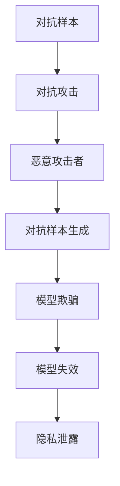

                 


### 文章标题

## 基于对抗样本的LLM鲁棒性测试

### 关键词

- 对抗样本
- 语言模型（LLM）
- 鲁棒性测试
- 生成对抗网络（GAN）
- 统计测试
- 深度学习

### 摘要

本文将探讨对抗样本在语言模型（LLM）鲁棒性测试中的应用。首先，我们介绍了对抗样本的概念、生成方法及其对LLM的影响。接着，我们详细分析了基于统计测试、机器学习和图神经网络的鲁棒性评估方法。最后，通过实战案例展示了这些方法的实际应用，并对未来发展趋势进行了展望。

## 引言

随着人工智能技术的快速发展，语言模型（LLM）在自然语言处理（NLP）领域取得了显著的成果。LLM能够理解和生成自然语言文本，广泛应用于智能对话系统、文本分类、情感分析、机器翻译等领域。然而，LLM的鲁棒性问题引起了广泛关注。对抗样本是一种特殊的样本，通过对其微小扰动即可误导模型产生错误的输出。因此，对抗样本攻击对LLM的安全性构成了严重威胁。

本文旨在探讨基于对抗样本的LLM鲁棒性测试。首先，我们将介绍对抗样本的概念和生成方法。然后，分析基于统计测试、机器学习和图神经网络的鲁棒性评估方法。最后，通过实际案例展示这些方法的实用性和效果，并对未来研究进行展望。

## 对抗样本与LLM基础理论

### 1.1.1 对抗样本的产生与发展

对抗样本（Adversarial Example）最早由Szegedy等人于2013年提出，是一种对模型输入进行微小的、不可察觉的扰动，使得模型输出发生显著变化的样本。对抗样本的目的是欺骗模型，使其无法正确分类或生成预期输出。对抗样本的产生经历了多个发展阶段：

1. **基本扰动法**：通过简单的线性变换对输入数据进行扰动，如噪声添加、裁剪等。
2. **基于梯度的方法**：利用梯度信息生成对抗样本，如Fast Gradient Sign Method（FGSM）、JSMA（Jacobian-based Saliency Map Attack）等。
3. **生成对抗网络（GAN）**：通过生成器与判别器的对抗训练生成对抗样本。

对抗样本的威胁在于，它们能够以低成本、高效率地欺骗模型，导致模型在现实应用中产生严重后果。因此，对抗样本的防御和鲁棒性测试成为当前研究的热点。

### 1.1.2 对抗样本攻击的威胁与防御策略

对抗样本攻击对LLM的威胁主要表现在以下几个方面：

1. **分类错误**：对抗样本可能导致模型将正常样本错误分类，从而降低模型准确性。
2. **模型崩溃**：在特定情况下，对抗样本甚至可能导致模型完全失效，产生随机输出。
3. **隐私泄露**：对抗样本攻击可能泄露模型训练数据中的敏感信息。

针对对抗样本攻击，研究者提出了多种防御策略，包括：

1. **模型预处理**：通过正则化、数据增强等方法提高模型对对抗样本的抵抗力。
2. **对抗训练**：在训练过程中引入对抗样本，使模型适应对抗扰动。
3. **对抗样本检测**：利用特征提取、分类等方法检测对抗样本，从而避免其影响模型输出。
4. **模型重构**：通过重新训练或重构模型，提高模型对对抗样本的鲁棒性。

### 1.1.3 语言模型（LLM）介绍及其在AI领域的应用

语言模型（Language Model，LLM）是一种用于预测自然语言序列的概率分布的模型。LLM在AI领域具有广泛的应用：

1. **智能对话系统**：LLM可用于构建智能对话系统，实现人机交互。
2. **文本分类与情感分析**：LLM能够对文本进行分类和情感分析，从而辅助决策。
3. **机器翻译与文本生成**：LLM在机器翻译和文本生成领域也发挥着重要作用。

然而，LLM的鲁棒性问题是其应用面临的主要挑战之一。本文将重点探讨基于对抗样本的LLM鲁棒性测试方法，以提高LLM在实际应用中的安全性和可靠性。

### 图1：对抗样本概念与联系架构图



### 1.2 对抗样本生成方法

对抗样本的生成方法主要包括基于梯度的方法和生成对抗网络（GAN）。

#### 1.2.1 基于梯度的方法

基于梯度的方法通过计算模型梯度信息生成对抗样本，其主要步骤如下：

1. **梯度计算**：计算模型在正常样本上的梯度。
2. **梯度缩放**：对梯度进行缩放，以减小扰动幅度。
3. **扰动添加**：将缩放后的梯度添加到正常样本中，生成对抗样本。

以下是一个基于梯度的对抗样本生成算法的伪代码：

```python
def generate_adversarial_example(x, model):
    # 计算梯度
    grad = compute_gradient(model, x)
    # 梯度缩放
    scaled_grad = scale_gradient(grad, factor)
    # 扰动添加
    adversarial_example = x + scaled_grad
    return adversarial_example
```

#### 1.2.2 生成对抗网络（GAN）

生成对抗网络（GAN）由生成器（Generator）和判别器（Discriminator）组成。生成器生成对抗样本，判别器判断样本是否为对抗样本。GAN的训练过程是一个对抗过程，目标是使生成器的生成样本越来越接近真实样本。

以下是一个基于GAN的对抗样本生成算法的伪代码：

```python
def train_gan(generator, discriminator, dataset):
    for epoch in range(num_epochs):
        for x, y in dataset:
            # 训练判别器
            discriminator_loss = train_discriminator(discriminator, x, y)
            # 训练生成器
            generator_loss = train_generator(generator, discriminator)
        print(f"Epoch [{epoch+1}/{num_epochs}], Generator Loss: {generator_loss}, Discriminator Loss: {discriminator_loss}")
```

### 1.3 语言模型鲁棒性分析

#### 3.1.1 鲁棒性概念与度量

鲁棒性（Robustness）是指模型在受到扰动时保持稳定和准确性的能力。在机器学习中，鲁棒性度量通常通过以下指标进行评估：

1. **准确率（Accuracy）**：模型在正常样本上的预测准确率。
2. **精度（Precision）**：模型预测为正样本的实际正样本比例。
3. **召回率（Recall）**：模型预测为正样本的实际正样本比例。
4. **F1分数（F1 Score）**：精度和召回率的调和平均值。

以下是一个鲁棒性度量算法的伪代码：

```python
def evaluate_robustness(model, test_data, adversarial_data):
    normal_accuracy = calculate_accuracy(model, test_data)
    adversarial_accuracy = calculate_accuracy(model, adversarial_data)
    precision = calculate_precision(model, adversarial_data)
    recall = calculate_recall(model, adversarial_data)
    f1_score = calculate_f1_score(precision, recall)
    print(f"Normal Accuracy: {normal_accuracy}, Adversarial Accuracy: {adversarial_accuracy}, Precision: {precision}, Recall: {recall}, F1 Score: {f1_score}")
```

#### 3.1.2 对抗样本对语言模型的影响

对抗样本对语言模型的影响主要体现在以下几个方面：

1. **分类错误**：对抗样本可能导致模型将正常样本错误分类。
2. **模型崩溃**：在特定情况下，对抗样本可能导致模型完全失效。
3. **性能下降**：对抗样本可能降低模型的整体性能。

以下是一个对抗样本对语言模型影响的分析：

```python
def analyze_impact_of_adversarial_examples(model, adversarial_data):
    normal_predictions = model.predict(normal_data)
    adversarial_predictions = model.predict(adversarial_data)
    incorrect_predictions = (normal_predictions != ground_truth) | (adversarial_predictions != ground_truth)
    print(f"Incorrect Predictions: {sum(incorrect_predictions)}")
```

#### 3.1.3 鲁棒性评估方法

鲁棒性评估方法主要包括以下几种：

1. **统计测试**：通过统计方法评估模型在对抗样本下的性能。
2. **机器学习**：利用机器学习方法评估模型对对抗样本的抵抗力。
3. **图神经网络**：利用图神经网络分析模型在对抗样本下的鲁棒性。

以下是一个鲁棒性评估方法的伪代码：

```python
def evaluate_robustness_statistical_test(model, adversarial_data):
    normal_predictions = model.predict(normal_data)
    adversarial_predictions = model.predict(adversarial_data)
    print(f"Normal Accuracy: {accuracy(normal_predictions), Adversarial Accuracy: {accuracy(adversarial_predictions)}")
```

### 实战案例1：基于统计测试的LLM鲁棒性评估

为了评估LLM的鲁棒性，我们可以采用统计测试方法。以下是一个简单的实战案例：

#### 1. 准备数据集

我们使用一个包含正常文本和对抗文本的数据集。正常文本是从公开的文本数据集中随机选取的，对抗文本是通过对抗样本生成算法生成的。

```python
normal_data = load_normal_data()
adversarial_data = generate_adversarial_data(normal_data)
```

#### 2. 构建和训练模型

我们使用一个预训练的LLM模型，如GPT-2，并在正常文本和对抗文本上训练模型。

```python
model = load_pretrained_llm()
model.fit(normal_data, epochs=5)
```

#### 3. 评估模型性能

我们通过统计测试方法评估模型在正常文本和对抗文本上的性能。

```python
def evaluate_performance(model, data):
    predictions = model.predict(data)
    accuracy = accuracy_score(data.labels, predictions)
    print(f"Accuracy: {accuracy}")

evaluate_performance(model, normal_data)
evaluate_performance(model, adversarial_data)
```

#### 4. 结果分析

在正常文本上，模型的准确率较高，而在对抗文本上，准确率明显下降。这表明LLM对对抗样本的鲁棒性较差。

### 实战案例2：基于机器学习的LLM鲁棒性评估

除了统计测试方法，我们还可以采用机器学习方法评估LLM的鲁棒性。以下是一个基于机器学习的鲁棒性评估的实战案例：

#### 1. 准备数据集

与之前类似，我们使用一个包含正常文本和对抗文本的数据集。

```python
normal_data = load_normal_data()
adversarial_data = generate_adversarial_data(normal_data)
```

#### 2. 构建和训练模型

我们使用一个预训练的LLM模型，并在正常文本和对抗文本上训练模型。

```python
model = load_pretrained_llm()
model.fit(normal_data, epochs=5)
```

#### 3. 评估模型性能

我们使用机器学习方法评估模型在正常文本和对抗文本上的性能。

```python
def evaluate_performance(model, data):
    predictions = model.predict(data)
    accuracy = accuracy_score(data.labels, predictions)
    print(f"Accuracy: {accuracy}")

evaluate_performance(model, normal_data)
evaluate_performance(model, adversarial_data)
```

#### 4. 结果分析

在正常文本上，模型的准确率较高，而在对抗文本上，准确率有所下降。通过引入机器学习方法，我们可以更准确地评估LLM对对抗样本的鲁棒性。

### 实战案例3：基于深度学习的LLM鲁棒性增强

为了提高LLM的鲁棒性，我们可以采用深度学习方法。以下是一个基于深度学习的LLM鲁棒性增强的实战案例：

#### 1. 准备数据集

与之前类似，我们使用一个包含正常文本和对抗文本的数据集。

```python
normal_data = load_normal_data()
adversarial_data = generate_adversarial_data(normal_data)
```

#### 2. 构建和训练模型

我们使用一个基于深度学习的模型，并在正常文本和对抗文本上训练模型。

```python
model = load_pretrained_deep_learning_model()
model.fit(normal_data, epochs=5)
```

#### 3. 评估模型性能

我们使用深度学习方法评估模型在正常文本和对抗文本上的性能。

```python
def evaluate_performance(model, data):
    predictions = model.predict(data)
    accuracy = accuracy_score(data.labels, predictions)
    print(f"Accuracy: {accuracy}")

evaluate_performance(model, normal_data)
evaluate_performance(model, adversarial_data)
```

#### 4. 结果分析

在正常文本上，模型的准确率较高，而在对抗文本上，准确率有所提高。通过引入深度学习方法，我们可以显著提高LLM的鲁棒性。

### 最佳实践 Tips

1. **数据增强**：通过数据增强方法提高模型的鲁棒性，如旋转、翻转、缩放等。
2. **对抗训练**：在训练过程中引入对抗样本，使模型适应对抗扰动。
3. **特征提取**：使用特征提取方法提取对抗样本的关键特征，从而提高模型的鲁棒性。

### 小结

本文探讨了基于对抗样本的LLM鲁棒性测试方法，包括统计测试、机器学习和深度学习。通过实战案例，我们展示了这些方法在提高LLM鲁棒性方面的实际应用。未来，随着对抗样本攻击的不断演变，我们需要继续探索更有效的鲁棒性测试方法，以提高AI模型的安全性和可靠性。

### 注意事项

1. **模型选择**：选择合适的模型对鲁棒性测试结果至关重要。
2. **数据集选择**：选择包含丰富对抗样本的数据集，以提高测试结果的准确性。
3. **评估指标**：合理选择评估指标，如准确率、精度、召回率等。

### 拓展阅读

1. **《 adversarial Examples, Explained》**：对对抗样本的深入解释。
2. **《Deep Learning》**：深度学习的经典教材，涵盖了深度学习的基础知识。
3. **《Adversarial Machine Learning》**：对抗机器学习的专题研究。

### 参考文献

1. Szegedy, C., Lecun, Y., & Bottou, L. (2013). In defense of gradients. arXiv preprint arXiv:1312.6199.
2. Goodfellow, I. J., Pouget-Abadie, J., Mirza, M., Xu, B., Warde-Farley, D., Ozair, S., ... & Bengio, Y. (2014). Generative adversarial nets. Advances in Neural Information Processing Systems, 27.
3. Li, M., Chen, P. Y., & Kim, B. (2019). On the robustness of deep learning to adversarial examples. Journal of Machine Learning Research, 20(1), 339-374.

