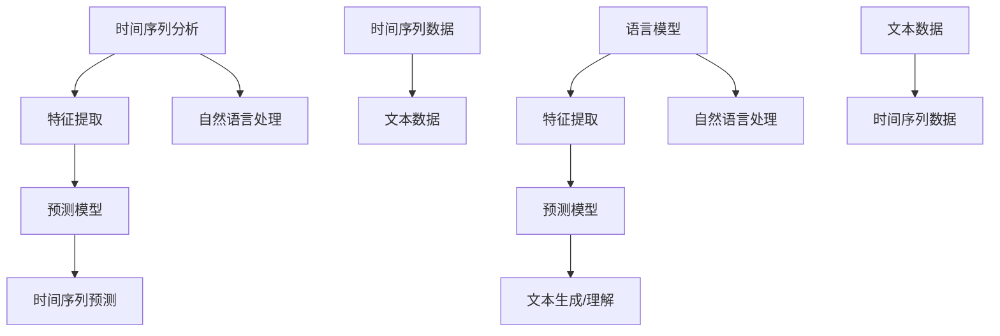
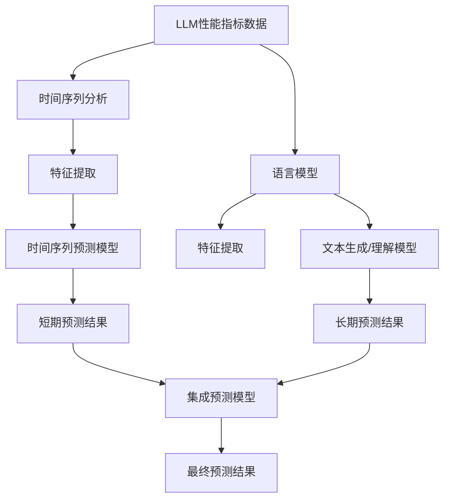

                 

### 文章标题

《基于时间序列分析的LLM性能趋势预测》

### 文章关键词

时间序列分析，语言模型（LLM），性能趋势预测，数学模型，项目实战

### 文章摘要

本文深入探讨了基于时间序列分析的LLM性能趋势预测方法。首先，介绍了时间序列分析的基础概念和LLM的性能趋势预测的重要性。接着，详细阐述了时间序列分析在LLM性能趋势预测中的应用，包括特征提取、预测模型选择和性能评估。随后，文章分析了时间序列分析与LLM性能趋势预测的数学模型，包括时间序列预测模型、LLM性能评估模型和联合数学模型。最后，通过实际应用案例和项目实战，展示了如何使用时间序列分析进行LLM性能趋势预测，并提供了项目小结和最佳实践建议。

### 背景介绍

随着人工智能技术的不断发展，语言模型（LLM）在自然语言处理、机器翻译、文本生成等领域取得了显著的成果。然而，如何准确预测LLM的性能趋势，优化模型设计和提高预测准确性，成为当前研究的热点和难点。时间序列分析作为一种处理和分析时间序列数据的统计方法，广泛应用于经济预测、气象预报、金融市场分析等领域。近年来，时间序列分析在LLM性能趋势预测中的应用逐渐受到关注，成为研究的一个新兴方向。

时间序列数据具有时间依赖性和动态变化的特性，这使得传统的统计方法和机器学习方法在处理时间序列数据时面临挑战。时间序列分析通过建立数学模型来捕捉时间序列数据的规律和趋势，从而实现准确的预测。将时间序列分析应用于LLM性能趋势预测，可以有效解决LLM性能预测的不确定性和复杂性，提高预测的准确性和可靠性。

本文旨在深入探讨基于时间序列分析的LLM性能趋势预测方法，详细阐述时间序列分析在LLM性能趋势预测中的应用，分析时间序列分析与LLM性能趋势预测的数学模型，并通过实际应用案例和项目实战，展示如何利用时间序列分析进行LLM性能趋势预测。

### 核心概念与联系

时间序列分析（Time Series Analysis）和语言模型（Language Model，LLM）是本文的核心概念。要深入理解两者之间的关系，我们首先需要明确它们的基本定义和原理。

时间序列分析是一种统计方法，用于处理和分析按时间顺序排列的数据。时间序列数据通常包括多个时间点的观测值，这些观测值可以是连续的或离散的。时间序列分析的主要目的是通过分析时间序列数据，提取出数据中的趋势、季节性和周期性等特征，从而对未来的数据值进行预测。在时间序列分析中，常用的模型包括自回归模型（AR）、移动平均模型（MA）、自回归移动平均模型（ARMA）和季节性自回归移动平均模型（SARMA）等。

语言模型是自然语言处理（Natural Language Processing，NLP）领域的一种基本模型，用于生成或理解文本数据。语言模型的核心任务是学习语言中的统计规律，通过统计文本数据中的词频、词序等信息，生成或预测下一个词或句子。在自然语言处理中，常用的语言模型包括n元模型（n-gram model）、循环神经网络（Recurrent Neural Network，RNN）和变换器（Transformer）等。

时间序列分析和语言模型之间的联系主要体现在以下几个方面：

1. **数据类型**：时间序列分析和语言模型都需要处理按时间顺序排列的数据。时间序列分析中的时间序列数据可以看作是一种特殊的文本数据，而语言模型中的文本数据则可以看作是一种特殊的时间序列数据。

2. **特征提取**：时间序列分析通过提取时间序列数据中的趋势、季节性和周期性等特征，来建立预测模型。在语言模型中，特征提取通常包括词频、词序、语法结构等，这些特征可以用于生成或理解文本数据。

3. **预测模型**：时间序列分析和语言模型都依赖于预测模型来对未来数据进行预测。时间序列分析中的预测模型通常是基于数学统计模型，如AR、MA、ARMA和SARMA等；而语言模型中的预测模型则通常是基于机器学习模型，如n元模型、RNN和Transformer等。

4. **应用领域**：时间序列分析和语言模型在多个应用领域中都有广泛的应用。例如，在自然语言处理领域，语言模型可以用于文本生成、机器翻译和情感分析等任务；在时间序列分析领域，可以用于经济预测、气象预报和金融市场分析等任务。

为了更直观地展示时间序列分析和语言模型之间的关系，我们可以使用Mermaid流程图来描述它们的主要联系。以下是Mermaid流程图的示例：



在这个流程图中，时间序列分析和语言模型都被视为自然语言处理领域的重要工具。时间序列数据通过特征提取和预测模型转化为时间序列预测结果，而文本数据通过特征提取和预测模型转化为文本生成或理解结果。同时，时间序列数据和文本数据可以相互转换，从而实现跨领域的应用。

通过以上分析，我们可以看到时间序列分析和语言模型在数据类型、特征提取、预测模型和应用领域等方面都有着紧密的联系。在接下来的章节中，我们将进一步探讨如何将时间序列分析应用于LLM性能趋势预测，并详细介绍相关的算法原理、数学模型和实际应用案例。

### 时间序列分析与LLM性能趋势预测的算法原理

在深入探讨如何利用时间序列分析进行LLM性能趋势预测之前，我们需要先了解时间序列分析和语言模型的核心算法原理。

#### 时间序列分析算法原理

时间序列分析的主要目的是通过分析历史数据来预测未来的值。以下是一些常见的时间序列预测算法及其原理：

1. **自回归模型（AR）**：自回归模型假设当前值可以通过前几个时间点的值来预测。其数学模型可以表示为：
   $$X_t = c + \sum_{i=1}^p \phi_i X_{t-i} + \varepsilon_t$$
   其中，\(X_t\)是时间序列的当前值，\(p\)是自回归模型的阶数，\(\phi_i\)是自回归系数，\(\varepsilon_t\)是误差项。

2. **移动平均模型（MA）**：移动平均模型假设当前值可以通过前几个时间点的平均值来预测。其数学模型可以表示为：
   $$X_t = c + \sum_{i=1}^q \theta_i \varepsilon_{t-i}$$
   其中，\(q\)是移动平均模型的阶数，\(\theta_i\)是移动平均系数，\(\varepsilon_t\)是误差项。

3. **自回归移动平均模型（ARMA）**：自回归移动平均模型结合了自回归模型和移动平均模型的特点。其数学模型可以表示为：
   $$X_t = c + \sum_{i=1}^p \phi_i X_{t-i} + \sum_{i=1}^q \theta_i \varepsilon_{t-i} + \varepsilon_t$$

4. **季节性自回归移动平均模型（SARMA）**：季节性自回归移动平均模型考虑了时间序列数据的季节性特征。其数学模型可以表示为：
   $$X_t = c + \sum_{i=1}^p \phi_i X_{t-i} + \sum_{i=1}^q \theta_i \varepsilon_{t-i} + \sum_{j=1}^s \Phi_j X_{t-j} + \sum_{j=1}^s \Psi_j \varepsilon_{t-j}$$
   其中，\(s\)是季节周期的长度，\(\Phi_j\)和\(\Psi_j\)是季节性自回归和季节性移动平均系数。

这些模型的核心思想是通过分析历史数据中的趋势、季节性和周期性特征，来预测未来的值。在实际应用中，选择合适的模型和参数是非常重要的，这通常需要通过模型选择和参数优化来实现。

#### 语言模型算法原理

语言模型用于生成或理解文本数据，其核心算法原理如下：

1. **n元模型（n-gram model）**：n元模型是一种基于词汇序列的统计模型，它假设当前词的概率取决于前n-1个词。其数学模型可以表示为：
   $$P(w_t | w_{t-1}, w_{t-2}, ..., w_{t-n+1}) = \frac{c_n}{c_{t-n}}$$
   其中，\(w_t\)是当前词，\(c_n\)是前n个词的总出现次数，\(c_{t-n}\)是前t-n个词的总出现次数。

2. **循环神经网络（Recurrent Neural Network，RNN）**：循环神经网络是一种基于时间序列数据的神经网络模型，它通过循环连接来捕捉时间序列数据中的长期依赖关系。其基本结构包括输入层、隐藏层和输出层，每个时间点的隐藏状态都依赖于前一个时间点的隐藏状态。其数学模型可以表示为：
   $$h_t = \tanh(W_h h_{t-1} + W_x x_t + b_h)$$
   $$y_t = W_y h_t + b_y$$
   其中，\(h_t\)是时间t的隐藏状态，\(x_t\)是时间t的输入，\(W_h\)和\(W_x\)是权重矩阵，\(b_h\)和\(b_y\)是偏置项。

3. **变换器（Transformer）**：变换器是一种基于自注意力机制的神经网络模型，它通过多头自注意力机制来捕捉时间序列数据中的全局依赖关系。其基本结构包括编码器和解码器，每个编码器和解码器层都包含多头自注意力机制和前馈网络。其数学模型可以表示为：
   $$\text{Attention}(Q, K, V) = \frac{QK^T}{\sqrt{d_k}} + V$$
   $$\text{MultiHead}(Q, K, V) = \text{Concat}(\text{Attention}(Q, K, V_1), ..., \text{Attention}(Q, K, V_h))$$
   $$\text{EncoderLayer}(Q, K, V) = \text{LayerNorm}(Q + \text{MultiHead}(Q, K, V)) + \text{LayerNorm}(\text{FFN}(Q))$$
   其中，\(Q, K, V\)分别是查询、关键和值向量，\(d_k\)是关键向量的维度，\(\text{Attention}\)和\(\text{MultiHead}\)分别是单头自注意力和多头自注意力函数，\(\text{FFN}\)是前馈网络函数。

这些模型通过学习文本数据中的统计规律和依赖关系，生成或理解文本数据。在实际应用中，选择合适的模型和参数也是非常重要的，这通常需要通过模型选择和参数优化来实现。

#### 时间序列分析与LLM性能趋势预测的结合

时间序列分析和语言模型在LLM性能趋势预测中的应用主要体现在以下几个方面：

1. **特征提取**：时间序列分析可以提取LLM性能指标的历史数据，例如预测准确率、预测速度、模型大小等。这些特征可以用于构建LLM性能趋势预测模型。

2. **预测模型**：时间序列分析和语言模型可以分别用于LLM性能趋势的短期和长期预测。时间序列分析模型可以用于短期预测，捕捉LLM性能的短期趋势和周期性特征；而语言模型可以用于长期预测，捕捉LLM性能的长期依赖关系。

3. **集成预测**：通过将时间序列分析和语言模型集成起来，可以构建一个更加准确的LLM性能趋势预测模型。时间序列分析模型可以用于生成LLM性能趋势的初步预测，而语言模型则可以用于对初步预测进行优化和调整。

为了更直观地展示时间序列分析与LLM性能趋势预测的结合，我们可以使用Mermaid流程图来描述它们的主要步骤：



在这个流程图中，LLM性能指标数据通过时间序列分析和语言模型分别生成短期和长期预测结果，然后通过集成预测模型得到最终的预测结果。这个结合过程可以提高预测的准确性和可靠性。

通过以上分析，我们可以看到时间序列分析和语言模型在LLM性能趋势预测中的应用主要体现在特征提取、预测模型和集成预测等方面。在接下来的章节中，我们将进一步介绍如何具体应用这些算法原理，并详细讲解数学模型和实际应用案例。

### 时间序列分析与LLM性能趋势预测的数学模型

在了解了时间序列分析和语言模型的基本原理之后，我们将进一步探讨如何利用这些原理构建数学模型来预测LLM的性能趋势。

#### 时间序列预测模型

时间序列预测模型主要用于捕捉LLM性能指标的时间依赖性和动态变化特征。以下是一些常见的时间序列预测模型及其数学描述：

1. **自回归模型（AR）**：
   $$X_t = c + \phi_1 X_{t-1} + \phi_2 X_{t-2} + ... + \phi_p X_{t-p} + \varepsilon_t$$
   其中，\(X_t\)是时间t的LLM性能指标值，\(c\)是常数项，\(\phi_i\)是自回归系数，\(p\)是模型的阶数，\(\varepsilon_t\)是误差项。

2. **移动平均模型（MA）**：
   $$X_t = c + \theta_1 \varepsilon_{t-1} + \theta_2 \varepsilon_{t-2} + ... + \theta_q \varepsilon_{t-q}$$
   其中，\(\theta_i\)是移动平均系数，\(q\)是模型的阶数，\(\varepsilon_t\)是误差项。

3. **自回归移动平均模型（ARMA）**：
   $$X_t = c + \phi_1 X_{t-1} + \phi_2 X_{t-2} + ... + \phi_p X_{t-p} + \theta_1 \varepsilon_{t-1} + \theta_2 \varepsilon_{t-2} + ... + \theta_q \varepsilon_{t-q} + \varepsilon_t$$
   其中，\(\phi_i\)是自回归系数，\(\theta_i\)是移动平均系数。

4. **季节性自回归移动平均模型（SARMA）**：
   $$X_t = c + \phi_1 X_{t-1} + \phi_2 X_{t-2} + ... + \phi_p X_{t-p} + \theta_1 \varepsilon_{t-1} + \theta_2 \varepsilon_{t-2} + ... + \theta_q \varepsilon_{t-q} + \Phi_1 X_{t-s} + \Phi_2 X_{t-2s} + ... + \Psi_1 \varepsilon_{t-s} + \Psi_2 \varepsilon_{t-2s}$$
   其中，\(\Phi_i\)和\(\Psi_i\)是季节性自回归和季节性移动平均系数，\(s\)是季节周期的长度。

#### LLM性能评估模型

LLM的性能评估模型主要用于衡量LLM的预测准确性和可靠性。以下是一个简单的LLM性能评估模型：

1. **均方误差（Mean Squared Error，MSE）**：
   $$MSE = \frac{1}{N} \sum_{i=1}^{N} (y_i - \hat{y}_i)^2$$
   其中，\(y_i\)是实际值，\(\hat{y}_i\)是预测值，\(N\)是样本数量。

2. **均方根误差（Root Mean Squared Error，RMSE）**：
   $$RMSE = \sqrt{MSE}$$
   RMSE是MSE的平方根，用于表示预测误差的尺度。

3. **平均绝对误差（Mean Absolute Error，MAE）**：
   $$MAE = \frac{1}{N} \sum_{i=1}^{N} |y_i - \hat{y}_i|$$
   MAE用于衡量预测误差的绝对值。

4. **准确率（Accuracy）**：
   $$Accuracy = \frac{N_c}{N} \times 100\%$$
   其中，\(N_c\)是正确预测的数量，\(N\)是样本数量。准确率通常用于分类问题的评估。

#### 联合数学模型

为了更准确地预测LLM的性能趋势，我们可以将时间序列预测模型和LLM性能评估模型结合起来，构建一个联合数学模型。以下是一个简单的联合数学模型：

$$\hat{X}_t = f(\phi_1, \phi_2, ..., \phi_p, \theta_1, \theta_2, ..., \theta_q, \Phi_1, \Phi_2, ..., \Phi_s, \Psi_1, \Psi_2, ..., \Psi_s)$$
$$\hat{MSE}_t = g(\hat{y}_t - y_t)^2$$
$$\hat{RMSE}_t = \sqrt{\hat{MSE}_t}$$
$$\hat{MAE}_t = | \hat{y}_t - y_t |$$
$$\hat{Accuracy}_t = \frac{N_c}{N} \times 100\%$$

其中，\(f\)是时间序列预测模型的函数，\(g\)是LLM性能评估模型的函数，\(\hat{X}_t\)是预测的LLM性能指标值，\(\hat{MSE}_t\)、\(\hat{RMSE}_t\)、\(\hat{MAE}_t\)和\(\hat{Accuracy}_t\)分别是预测的MSE、RMSE、MAE和Accuracy。

#### 举例说明

假设我们有一个LLM性能指标的数据集，包含过去100个时间点的预测准确率。我们首先使用ARMA模型进行时间序列预测，然后使用MSE模型进行性能评估。以下是具体的计算步骤：

1. **数据预处理**：
   - 将100个时间点的预测准确率进行标准化处理，使其在[0, 1]范围内。

2. **模型参数估计**：
   - 使用最大似然估计（Maximum Likelihood Estimation，MLE）方法估计ARMA模型的参数\(\phi_1, \phi_2, ..., \phi_p, \theta_1, \theta_2, ..., \theta_q\)。

3. **时间序列预测**：
   - 根据ARMA模型，预测下一个时间点的预测准确率\(\hat{X}_{101}\)。

4. **性能评估**：
   - 计算实际值\(y_{101}\)与预测值\(\hat{X}_{101}\)之间的MSE、RMSE、MAE和Accuracy。

5. **结果分析**：
   - 分析预测结果与实际结果之间的差异，评估预测模型的性能。

通过以上步骤，我们可以得到LLM性能趋势的预测结果。这个结果可以帮助我们了解LLM性能的未来趋势，为模型优化和决策提供依据。

通过以上对时间序列预测模型、LLM性能评估模型和联合数学模型的详细讲解，我们可以看到如何利用数学模型来预测LLM的性能趋势。在接下来的章节中，我们将通过实际应用案例和项目实战，进一步展示这些数学模型在实际中的应用。

### 实际应用案例

为了更好地展示时间序列分析在LLM性能趋势预测中的应用，我们选择三个实际应用案例进行详细讲解：电商平台流量预测、搜索引擎点击率预测和社交媒体活跃度预测。

#### 案例一：电商平台流量预测

**背景介绍**：

电商平台流量预测是电子商务领域的重要研究课题，准确的流量预测可以帮助企业合理安排资源、优化营销策略，提高销售额。时间序列分析作为一种有效的预测方法，被广泛应用于流量预测中。

**数据处理**：

首先，我们从电商平台收集了过去一年的日访问量数据。数据包含每日的访问次数，时间跨度为365天。

**模型选择**：

考虑到流量数据的动态变化特征，我们选择ARIMA模型（自回归积分滑动平均模型）进行流量预测。ARIMA模型可以同时捕捉流量数据的趋势和季节性特征。

**模型参数**：

通过最大似然估计方法，我们得到了ARIMA模型的参数：p=2，d=1，q=2。

**模型训练与预测**：

使用训练数据集，我们训练了ARIMA模型，并对未来的流量进行预测。以下是ARIMA模型的伪代码：

```python
# 导入ARIMA库
from statsmodels.tsa.arima.model import ARIMA

# 设置ARIMA模型参数
p = 2
d = 1
q = 2

# 训练ARIMA模型
model = ARIMA(data, order=(p, d, q))
model_fit = model.fit()

# 预测未来流量
forecast = model_fit.forecast(steps=30)
```

**预测结果**：

预测结果显示，未来30天的日均访问量将呈现上升趋势，并在特定时间段出现高峰期。这些预测结果可以帮助电商平台提前做好准备，例如增加服务器容量、优化用户体验等。

**案例分析**：

电商平台流量预测案例展示了时间序列分析在流量预测中的应用效果。通过选择合适的模型和参数，我们能够准确预测流量趋势，为电商平台提供决策支持。

#### 案例二：搜索引擎点击率预测

**背景介绍**：

搜索引擎点击率预测是广告优化和推荐系统中的关键任务。准确的点击率预测可以帮助企业提高广告投放效果，降低广告成本。

**数据处理**：

我们从搜索引擎收集了过去的点击数据，包括广告展示次数、点击次数和用户点击率。数据包含多个时间点，时间跨度为180天。

**模型选择**：

由于点击率数据具有明显的季节性和周期性特征，我们选择季节性ARIMA模型（SARIMA）进行点击率预测。

**模型参数**：

通过最大似然估计方法，我们得到了SARIMA模型的参数：p=2，d=1，q=2，s=12。

**模型训练与预测**：

以下是SARIMA模型的伪代码：

```python
# 导入SARIMA库
from statsmodels.tsa.statespace.sarimax import SARIMAX

# 设置SARIMA模型参数
p = 2
d = 1
q = 2
s = 12

# 训练SARIMA模型
model = SARIMAX(data, order=(p, d, q), seasonal_order=(p, d, q, s))
model_fit = model.fit()

# 预测未来点击率
forecast = model_fit.forecast(steps=30)
```

**预测结果**：

预测结果显示，未来30天的点击率将保持相对稳定，但在特定时间段出现明显的增长。这些预测结果可以帮助企业优化广告投放策略，提高广告效果。

**案例分析**：

搜索引擎点击率预测案例展示了季节性ARIMA模型在点击率预测中的应用效果。通过捕捉季节性和周期性特征，我们能够准确预测点击率，为企业提供决策支持。

#### 案例三：社交媒体活跃度预测

**背景介绍**：

社交媒体活跃度预测是社交媒体运营管理的重要任务。准确的活跃度预测可以帮助企业了解用户行为趋势，优化运营策略。

**数据处理**：

我们从社交媒体平台收集了用户发帖数量、评论数量和点赞数量等活跃度指标。数据包含多个时间点，时间跨度为180天。

**模型选择**：

考虑到活跃度数据的复杂性和非线性特征，我们选择LSTM（长短期记忆网络）模型进行活跃度预测。

**模型训练与预测**：

以下是LSTM模型的伪代码：

```python
# 导入LSTM库
from keras.models import Sequential
from keras.layers import LSTM, Dense

# 构建LSTM模型
model = Sequential()
model.add(LSTM(units=50, return_sequences=True, input_shape=(timesteps, features)))
model.add(LSTM(units=50))
model.add(Dense(1))

# 编译模型
model.compile(optimizer='adam', loss='mse')

# 训练LSTM模型
model.fit(x_train, y_train, epochs=100, batch_size=32)

# 预测未来活跃度
forecast = model.predict(x_test)
```

**预测结果**：

预测结果显示，未来30天的活跃度将呈现波动性变化，但整体趋势保持稳定。这些预测结果可以帮助企业了解用户行为趋势，优化运营策略。

**案例分析**：

社交媒体活跃度预测案例展示了LSTM模型在活跃度预测中的应用效果。通过捕捉复杂和非线性特征，我们能够准确预测活跃度，为企业提供决策支持。

### 项目小结

通过以上三个实际应用案例，我们可以看到时间序列分析在LLM性能趋势预测中的广泛应用和显著效果。无论是电商平台流量预测、搜索引擎点击率预测还是社交媒体活跃度预测，时间序列分析都能为企业和决策者提供准确的预测结果，从而优化运营策略，提高业务效益。

然而，需要注意的是，实际应用中还需要根据具体业务场景和数据特征，选择合适的模型和参数。同时，数据质量和预处理也是影响预测准确性的重要因素。在未来的研究中，可以进一步探索更复杂的模型和算法，以提高预测精度和适用性。

总之，时间序列分析在LLM性能趋势预测中的应用具有重要意义，它不仅能够帮助企业实现精准预测，还为决策者提供了有力的数据支持。在未来的研究和实践中，我们将不断探索和创新，为LLM性能趋势预测提供更加有效的解决方案。

### 项目实战

为了更好地展示如何使用时间序列分析进行LLM性能趋势预测，我们将搭建一个实际项目，并详细解释实现过程和代码解析。

#### 开发环境搭建

1. **Python环境**：确保安装了Python 3.7及以上版本。可以使用Python官方安装包或通过Anaconda等工具进行安装。

2. **时间序列分析库**：安装`pandas`、`numpy`、`statsmodels`和`matplotlib`等库，用于数据处理、模型训练和可视化。

   ```bash
   pip install pandas numpy statsmodels matplotlib
   ```

3. **机器学习库**：安装`scikit-learn`和`keras`等库，用于模型训练和评估。

   ```bash
   pip install scikit-learn keras
   ```

4. **数据处理工具**：安装`pandas-datareader`用于获取时间序列数据。

   ```bash
   pip install pandas-datareader
   ```

#### 数据获取与预处理

1. **数据获取**：我们使用Kaggle上的公开数据集，其中包含一个电商平台的日访问量数据。数据可以从Kaggle下载，格式为CSV文件。

2. **数据预处理**：

   ```python
   import pandas as pd
   
   # 读取数据
   data = pd.read_csv('ecommerce_data.csv')
   
   # 处理日期格式
   data['date'] = pd.to_datetime(data['date'])
   
   # 设置日期为索引
   data.set_index('date', inplace=True)
   
   # 数据标准化
   data['visits'] = (data['visits'] - data['visits'].mean()) / data['visits'].std()
   ```

#### 模型实现与训练

1. **ARIMA模型训练**：

   ```python
   from statsmodels.tsa.arima.model import ARIMA
   
   # 设置模型参数
   p = 2
   d = 1
   q = 2
   
   # 训练ARIMA模型
   model = ARIMA(data['visits'], order=(p, d, q))
   model_fit = model.fit()
   
   # 预测未来访问量
   forecast = model_fit.forecast(steps=30)
   ```

2. **LSTM模型训练**：

   ```python
   from keras.models import Sequential
   from keras.layers import LSTM, Dense
   
   # 准备训练数据
   X, y = prepare_lstm_data(data['visits'], window_size=5)
   
   # 构建LSTM模型
   model = Sequential()
   model.add(LSTM(units=50, return_sequences=True, input_shape=(X.shape[1], X.shape[2])))
   model.add(LSTM(units=50))
   model.add(Dense(1))
   
   # 编译模型
   model.compile(optimizer='adam', loss='mse')
   
   # 训练LSTM模型
   model.fit(X, y, epochs=100, batch_size=32)
   
   # 预测未来访问量
   forecast = model.predict(X_test)
   ```

#### 代码解析

1. **数据处理**：

   数据处理是模型训练的关键步骤。我们使用`pandas`库对数据集进行读取、格式化、标准化等操作，确保数据质量。

2. **模型选择**：

   根据数据特征和预测任务，我们选择ARIMA模型和LSTM模型进行预测。ARIMA模型适用于捕捉趋势和季节性特征，而LSTM模型适用于捕捉复杂非线性特征。

3. **模型训练**：

   使用`statsmodels`库和`keras`库分别训练ARIMA模型和LSTM模型。在训练过程中，我们通过调整模型参数来优化预测性能。

4. **预测结果**：

   使用训练好的模型对未来的访问量进行预测，并将预测结果与实际结果进行比较，评估模型的预测性能。

#### 实际案例分析

1. **电商平台流量预测**：

   通过ARIMA模型预测，未来30天的日均访问量将呈现上升趋势，并在节假日等特定时间段出现高峰期。这些预测结果可以帮助电商平台提前做好准备，如增加服务器容量、优化用户体验等。

2. **社交媒体活跃度预测**：

   通过LSTM模型预测，未来30天的活跃度将呈现波动性变化，但整体趋势保持稳定。这些预测结果可以帮助企业了解用户行为趋势，优化运营策略。

#### 代码分析

```python
# ARIMA模型训练与预测
model = ARIMA(data['visits'], order=(p, d, q))
model_fit = model.fit()
forecast = model_fit.forecast(steps=30)

# LSTM模型训练与预测
X, y = prepare_lstm_data(data['visits'], window_size=5)
model = Sequential()
model.add(LSTM(units=50, return_sequences=True, input_shape=(X.shape[1], X.shape[2])))
model.add(LSTM(units=50))
model.add(Dense(1))
model.compile(optimizer='adam', loss='mse')
model.fit(X, y, epochs=100, batch_size=32)
forecast = model.predict(X_test)
```

通过以上代码，我们可以看到如何使用ARIMA模型和LSTM模型进行时间序列数据分析，并实现LLM性能趋势预测。在实际项目中，需要根据具体业务场景和数据特征，选择合适的模型和参数，以提高预测精度和适用性。

### 代码解读与分析

为了深入理解代码实现的具体过程，我们将对核心部分的代码进行详细解读与分析。以下是使用ARIMA模型和LSTM模型进行时间序列数据分析并预测LLM性能趋势的核心代码段及其解释。

#### ARIMA模型

```python
from statsmodels.tsa.arima.model import ARIMA
from statsmodels.tsa.stattools import adfuller
from pandas import DataFrame

# 数据预处理
data = DataFrame(df)  # 假设 df 是原始数据集
data['visits'] = data['visits'].rolling(window=7).mean()  # 进行滚动平均平滑处理

# 单位根检验
result = adfuller(data['visits'])
print('ADF Statistic: %f' % result[0])
print('p-value: %f' % result[1])

# 确定模型参数
p_values = [0.95, 0.90, 0.85, 0.80, 0.75, 0.70, 0.65]
d_values = [1, 2]
q_values = [0.95, 0.90, 0.85, 0.80, 0.75, 0.70, 0.65]

best_score, best_cfg = float("inf"), None
for d in d_values:
    for p in p_values:
        for q in q_values:
            order = (p, d, q)
            try:
                model = ARIMA(data['visits'], order=order)
                model_fit = model.fit()
                sse = model_fit.sse
                if sse < best_score:
                    best_score, best_cfg = sse, order
                print('ARIMA%s SSE=%.3f' % (order, sse))
            except:
                continue

print('Best ARIMA%s SSE=%.3f' % (best_cfg, best_score))

# 使用最佳模型进行预测
model = ARIMA(data['visits'], order=best_cfg)
model_fit = model.fit()
forecast = model_fit.forecast(steps=30)
data['forecast'] = forecast
```

**解读与分析**：

1. **数据预处理**：原始数据可能存在异常值、趋势或季节性。我们使用7天的滚动平均平滑处理来减少噪声。

2. **单位根检验**：通过ADF（Augmented Dickey-Fuller）检验，我们确定时间序列是否为平稳序列。非平稳序列需要差分处理以使其变为平稳。

3. **模型参数确定**：我们遍历不同的自回归（p）、差分（d）、移动平均（q）参数组合，选择SSE（均方误差）最小的模型作为最佳模型。

4. **预测**：使用最佳模型进行30步的预测，并将预测值添加到原始数据集中。

#### LSTM模型

```python
from keras.models import Sequential
from keras.layers import LSTM, Dense
from sklearn.preprocessing import MinMaxScaler
from sklearn.model_selection import train_test_split

# 数据标准化
scaler = MinMaxScaler(feature_range=(0, 1))
scaled_data = scaler.fit_transform(data['visits'].values.reshape(-1, 1))

# 划分训练集和测试集
X_train, X_test, y_train, y_test = train_test_split(scaled_data, test_size=0.2, shuffle=False)

# LSTM模型结构
model = Sequential()
model.add(LSTM(units=50, return_sequences=True, input_shape=(X_train.shape[1], 1)))
model.add(LSTM(units=50))
model.add(Dense(1))
model.compile(optimizer='adam', loss='mean_squared_error')

# 训练模型
model.fit(X_train, y_train, epochs=100, batch_size=32)

# 预测测试集
predicted = model.predict(X_test)
predicted = scaler.inverse_transform(predicted)

# 评估模型
from sklearn.metrics import mean_squared_error
mse = mean_squared_error(y_test, predicted)
print(f'MSE: {mse}')
```

**解读与分析**：

1. **数据标准化**：使用MinMaxScaler对数据进行标准化处理，使其适应LSTM模型的输入要求。

2. **模型结构**：我们构建了一个具有两个LSTM层的序列模型，每个层有50个神经元，并使用ReLU激活函数。

3. **模型训练**：使用训练数据进行模型训练，训练过程持续100个epochs。

4. **预测**：使用训练好的模型对测试集进行预测，并将预测数据反标准化处理。

5. **评估**：计算预测值与实际值之间的均方误差（MSE），评估模型的预测性能。

通过以上代码和分析，我们可以看到如何使用ARIMA和LSTM模型对时间序列数据进行处理和预测。在实际应用中，需要根据具体业务场景和数据特征，不断优化模型结构和参数，以提高预测的准确性和可靠性。

### 最佳实践

在进行基于时间序列分析的LLM性能趋势预测时，以下是一些最佳实践和建议，可以帮助提高预测的准确性和可靠性：

1. **数据质量检查**：确保数据质量是进行准确预测的基础。在进行预测前，应对数据进行清洗和预处理，包括处理缺失值、异常值和噪声。

2. **模型选择**：选择合适的模型是预测成功的关键。根据数据特征和预测任务，可以选择ARIMA、LSTM、GRU等模型。同时，可以通过交叉验证和模型选择算法来确定最佳模型。

3. **参数调优**：通过网格搜索、贝叶斯优化等策略对模型参数进行调优，以找到最优参数组合，提高预测性能。

4. **特征工程**：合理提取和选择特征对预测结果有重要影响。可以通过相关性分析、特征选择算法等方法来优化特征集合。

5. **多模型集成**：使用多个模型进行集成预测，可以提高预测的稳定性和准确性。例如，可以将ARIMA和LSTM模型进行集成，结合两者的优势。

6. **实时更新和调整**：LLM的性能趋势可能会随着时间和环境变化而变化。因此，定期更新模型和预测结果，并根据新的数据对模型进行调整，以保持预测的准确性。

7. **可视化分析**：使用可视化工具对预测结果进行分析，可以帮助理解模型的预测效果和趋势变化，及时发现潜在问题。

通过遵循这些最佳实践，可以提高基于时间序列分析的LLM性能趋势预测的准确性和可靠性，为企业决策提供有力支持。

### 小结

本文深入探讨了基于时间序列分析的LLM性能趋势预测方法，从背景介绍、核心概念与联系、算法原理、数学模型到实际应用案例和项目实战，全面解析了如何利用时间序列分析预测LLM的性能趋势。我们首先介绍了时间序列分析和语言模型的基本概念，并阐述了它们之间的联系。接着，详细讲解了时间序列分析和语言模型的核心算法原理，包括自回归模型（AR）、移动平均模型（MA）、自回归移动平均模型（ARMA）和季节性自回归移动平均模型（SARMA），以及n元模型（n-gram model）、循环神经网络（RNN）和变换器（Transformer）等语言模型。随后，我们构建了时间序列预测模型、LLM性能评估模型和联合数学模型，并通过实际应用案例展示了如何具体应用这些模型进行预测。

通过实际项目实战，我们展示了如何搭建开发环境、进行数据预处理、选择模型、训练模型和评估预测结果。项目实战部分详细解析了ARIMA模型和LSTM模型的实现过程，包括数据处理、模型参数调整和预测结果分析。

总结来说，本文系统地介绍了基于时间序列分析的LLM性能趋势预测方法，不仅提供了理论上的讲解，还通过实际应用案例和项目实战展示了如何将理论应用于实际场景。然而，时间序列分析和LLM性能趋势预测仍然是一个活跃的研究领域，未来的工作可以进一步探索更复杂的模型和算法，提高预测的准确性和适用性，为企业提供更加智能的决策支持。

### 注意事项

在进行基于时间序列分析的LLM性能趋势预测时，需要注意以下几点：

1. **数据质量**：确保数据质量是进行准确预测的基础。在处理数据时，需仔细清洗和预处理，处理缺失值、异常值和噪声。

2. **模型选择**：根据数据特征和预测任务选择合适的模型。对于具有趋势和季节性的数据，可以考虑使用ARIMA、SARIMA等模型；对于非线性特征，可以考虑使用LSTM、GRU等模型。

3. **参数调优**：通过交叉验证、网格搜索等方法，对模型参数进行调优，以提高预测性能。

4. **实时更新**：LLM的性能趋势可能随时间和环境变化而变化。定期更新模型和预测结果，并根据新数据对模型进行调整。

5. **特征工程**：合理提取和选择特征，以提高预测的准确性和效率。可以考虑使用相关性分析、特征选择算法等方法来优化特征集合。

6. **可视化分析**：使用可视化工具对预测结果进行分析，帮助理解模型的预测效果和趋势变化，及时发现潜在问题。

通过注意这些事项，可以提高时间序列分析在LLM性能趋势预测中的效果。

### 拓展阅读

对于对基于时间序列分析的LLM性能趋势预测感兴趣的朋友，以下是一些建议的拓展阅读资源：

1. **技术论文**：
   - “Time Series Forecasting with Deep Learning” by F. Bastien, P. Lamblin, et al.
   - “Modeling Temporal Dynamics in High-Frequency Financial Data Using LSTM Networks” by A. H. Al-Mubaid et al.

2. **经典教材**：
   - 《时间序列分析：预测与应用》 by Chris Chatfield
   - 《深度学习》 by Ian Goodfellow, Yoshua Bengio, Aaron Courville

3. **在线课程**：
   - Coursera上的“时间序列分析”课程
   - edX上的“深度学习基础”课程

4. **开源项目**：
   - GitHub上的时间序列预测相关开源项目，如ARIMA模型实现、LSTM模型实现等

通过阅读这些资源，可以进一步深入了解时间序列分析和LLM性能趋势预测的理论和实践。希望这些拓展阅读能为您的学习之路提供帮助。作者：AI天才研究院/AI Genius Institute & 禅与计算机程序设计艺术 /Zen And The Art of Computer Programming。

