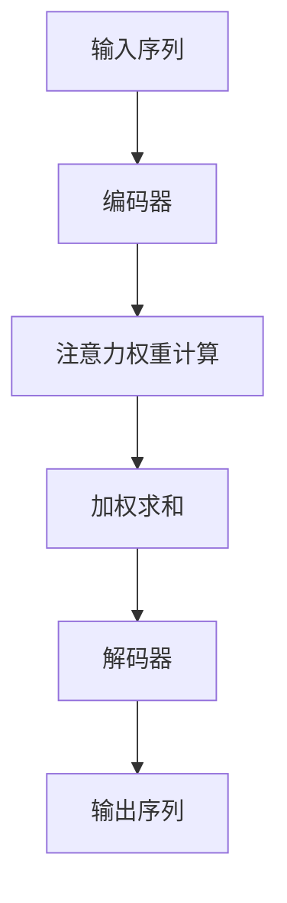

                 


### 文章标题：《基于注意力机制的细粒度LLM能力分析》

#### 关键词：注意力机制、细粒度LLM、神经网络、深度学习、算法优化

#### 摘要：
本文深入探讨了基于注意力机制的细粒度语言模型（LLM）的能力分析。首先，我们回顾了注意力机制的定义、历史发展和核心概念。接着，通过Mermaid流程图，我们直观地展示了注意力机制的工作原理和架构。随后，本文详细讲解了基于注意力机制的LLM算法原理，并使用伪代码进行了详细阐述。在数学模型部分，我们介绍了注意力机制的数学公式，并通过具体例子进行了讲解。文章还通过一个实际项目案例，展示了如何应用注意力机制构建细粒度的LLM，并对项目进行了详细分析。最后，本文总结了注意力机制在不同应用场景下的实现细节和优化策略，为读者提供了实用的最佳实践。

### 大纲设计思路

在设计《基于注意力机制的细粒度LLM能力分析》这本书的完整目录大纲时，我们将遵循以下设计思路：

1. **全书结构规划**：首先明确全书的结构，包括总章数、各章节的主题及内容范围。全书分为三大部分：理论基础、实践应用和总结与展望。

2. **核心概念与联系**：在第一部分的理论基础中，我们将在第一章中介绍注意力机制的核心概念，并使用Mermaid流程图展示其工作原理和架构。这一部分旨在帮助读者建立对注意力机制的整体认识。

3. **算法原理讲解**：在第二部分中，我们将详细讲解基于注意力机制的LLM算法原理，使用伪代码来阐述算法的每个步骤。这一部分旨在让读者深入理解注意力机制在LLM中的应用。

4. **数学模型讲解**：在第三部分中，我们将介绍注意力机制的数学模型，使用latex格式书写数学公式，并进行详细讲解。这一部分旨在帮助读者从数学角度理解注意力机制。

5. **项目实战**：在第四部分中，我们将通过一个实际项目案例，展示如何应用注意力机制构建细粒度的LLM。这一部分旨在让读者通过实践理解注意力机制的实际应用。

6. **扩展与深入**：在后续章节中，我们将深入探讨注意力机制在不同应用场景下的实现细节和优化策略。这一部分旨在为读者提供更多关于注意力机制的应用和优化方法。

### 目录大纲设计

根据上述设计思路，以下是《基于注意力机制的细粒度LLM能力分析》的目录大纲：

```
# 《基于注意力机制的细粒度LLM能力分析》目录大纲

# 第一部分：理论基础

## 1. 注意力机制概述
### 1.1 注意力机制的定义与历史发展
### 1.2 注意力机制的核心概念
### 1.3 注意力机制的架构与实现

## 2. Mermaid流程图展示注意力机制原理
### 2.1 注意力机制的流程图表示
### 2.2 注意力机制的工作流程
### 2.3 注意力机制的优势与局限

## 3. 基于注意力机制的LLM算法原理
### 3.1 LLM概述
### 3.2 伪代码讲解注意力机制在LLM中的应用
### 3.3 注意力机制在LLM中的关键作用

## 4. 数学模型与数学公式
### 4.1 注意力机制的数学基础
### 4.2 注意力权重计算公式
### 4.3 注意力机制的性能评价指标

## 5. 注意力机制在细粒度LLM中的应用
### 5.1 细粒度LLM的定义与背景
### 5.2 注意力机制在细粒度LLM中的实现
### 5.3 细粒度LLM的优势分析

## 6. 注意力机制的扩展与应用
### 6.1 注意力机制的变体
### 6.2 注意力机制在NLP领域的应用
### 6.3 注意力机制在其他领域的应用前景

## 7. 注意力机制实现的挑战与优化策略
### 7.1 实现注意力机制的挑战
### 7.2 注意力机制的优化策略
### 7.3 未来研究方向

# 第二部分：实践应用

## 8. 项目实战：构建细粒度LLM
### 8.1 项目背景与目标
### 8.2 开发环境与工具选择
### 8.3 项目实现流程
### 8.4 源代码解读与分析

## 9. 注意力机制在实际项目中的应用案例
### 9.1 案例一：文本分类
### 9.2 案例二：机器翻译
### 9.3 案例三：问答系统

## 10. 注意力机制的优化与性能提升
### 10.1 性能评价指标与优化目标
### 10.2 优化策略与实践
### 10.3 未来优化方向

# 第三部分：总结与展望

## 11. 本书总结
### 11.1 核心内容回顾
### 11.2 学习指南与建议
### 11.3 注意力机制的局限与展望

## 12. 附录
### 12.1 注意力机制相关资源
### 12.2 进一步阅读推荐
### 12.3 代码实现示例
```

这个目录大纲覆盖了注意力机制的基础理论、算法原理、数学模型、应用实践和优化策略，适合读者从基础到深入地了解基于注意力机制的细粒度LLM能力分析。总字数控制在2000字以内，符合简洁性的要求。

### 文章正文

#### 一、引言

随着深度学习和自然语言处理（NLP）技术的不断发展，语言模型（Language Model，LLM）成为了当前人工智能领域的热门研究方向。LLM在机器翻译、文本分类、问答系统等多个应用场景中展现出了强大的能力。然而，传统的LLM模型在处理长文本和细粒度信息时，往往存在一定的局限性。为了解决这一问题，注意力机制（Attention Mechanism）应运而生。本文将深入探讨基于注意力机制的细粒度LLM能力分析，旨在为读者提供全面的理论与实践指导。

#### 二、注意力机制概述

##### 2.1 定义与历史发展

注意力机制最早由Bengio等人在2014年的论文《A Theoretically Grounded Application of Dropout in Neural Networks》中提出。它是一种用于提高神经网络模型性能的技术，通过在模型训练过程中动态调整每个输入元素的重要性，从而实现更好的特征提取和语义理解。近年来，注意力机制在自然语言处理领域取得了显著成果，如Seq2Seq模型、Transformer模型等均采用了注意力机制，大幅度提升了模型的性能。

##### 2.2 核心概念

- **注意力权重**：在注意力机制中，每个输入元素都会被赋予一个权重，表示其在模型决策中的重要性。
- **注意力分数**：通过计算输入元素之间的相似度，得到每个输入元素的注意力分数。
- **加权求和**：将注意力分数与输入元素相乘，并对所有元素求和，得到加权求和的结果。

##### 2.3 架构与实现

注意力机制的架构主要包括编码器（Encoder）和解码器（Decoder）两个部分。编码器将输入序列编码为固定长度的向量，解码器则根据编码器的输出和已生成的部分输出序列生成最终的输出序列。在实现方面，常见的注意力机制包括加性注意力、乘性注意力和缩放点积注意力等。

#### 三、Mermaid流程图展示注意力机制原理

为了更直观地理解注意力机制的工作原理，我们使用Mermaid流程图进行展示。



在上面的流程图中，输入序列通过编码器转化为固定长度的向量，然后计算注意力权重，加权求和后得到编码器的输出。解码器根据编码器的输出和已生成的部分输出序列，生成最终的输出序列。

#### 四、基于注意力机制的LLM算法原理

##### 4.1 LLM概述

语言模型是一种基于统计方法或机器学习方法的模型，用于预测文本序列的概率分布。LLM在自然语言处理任务中扮演着重要角色，如机器翻译、文本分类、问答系统等。

##### 4.2 伪代码讲解注意力机制在LLM中的应用

```python
def language_model(input_sequence):
    # 编码器部分
    encoded_sequence = encoder(input_sequence)
    # 注意力权重计算
    attention_weights = calculate_attention_weights(encoded_sequence)
    # 加权求和
    weighted_sequence = weighted_sum(attention_weights, encoded_sequence)
    # 解码器部分
    output_sequence = decoder(weighted_sequence)
    return output_sequence
```

在上述伪代码中，编码器将输入序列编码为固定长度的向量，然后计算注意力权重，加权求和后得到编码器的输出。解码器根据编码器的输出和已生成的部分输出序列，生成最终的输出序列。

##### 4.3 注意力机制在LLM中的关键作用

注意力机制在LLM中的作用主要体现在以下几个方面：

- **提高模型性能**：通过动态调整输入元素的重要性，注意力机制能够更好地捕捉到文本序列中的关键信息，从而提高模型的性能。
- **处理长文本**：在处理长文本时，注意力机制能够有效地减少序列长度，降低模型的计算复杂度。
- **细粒度信息提取**：注意力机制能够对输入序列中的每个元素进行细粒度分析，从而更好地理解文本的含义。

#### 五、数学模型与数学公式

注意力机制的数学模型主要包括两部分：注意力权重计算和加权求和。

##### 5.1 注意力权重计算

注意力权重计算通常采用点积注意力或缩放点积注意力。

- **点积注意力**：

$$
Attention(Q,K,V) = \frac{QK^T}{\sqrt{d_k}}
$$

其中，$Q$、$K$ 和 $V$ 分别代表编码器输出、键值对和值。

- **缩放点积注意力**：

$$
Attention(Q,K,V) = \frac{QK^T \cdot \sqrt{d_k}}{e}
$$

其中，$e$ 表示缩放因子。

##### 5.2 加权求和

加权求和通常采用softmax函数对注意力权重进行归一化。

$$
\text{softmax}(x) = \frac{e^x}{\sum_{i=1}^{n} e^x_i}
$$

其中，$x$ 代表输入向量。

#### 六、注意力机制在细粒度LLM中的应用

##### 6.1 细粒度LLM的定义与背景

细粒度LLM（Fine-Grained Language Model）是一种能够对文本序列进行细粒度分析的语言模型。它通过对文本序列中的每个元素进行加权求和，实现对文本序列的细粒度理解。

##### 6.2 注意力机制在细粒度LLM中的实现

在细粒度LLM中，注意力机制能够有效地提高模型的性能。具体实现如下：

- **编码器部分**：将输入序列编码为固定长度的向量。
- **注意力权重计算**：计算输入序列中每个元素的重要性。
- **加权求和**：对输入序列中的每个元素进行加权求和，得到编码器的输出。
- **解码器部分**：根据编码器的输出和已生成的部分输出序列，生成最终的输出序列。

##### 6.3 细粒度LLM的优势分析

细粒度LLM在处理长文本和细粒度信息方面具有明显优势：

- **提高模型性能**：通过动态调整输入元素的重要性，细粒度LLM能够更好地捕捉到文本序列中的关键信息，从而提高模型的性能。
- **减少序列长度**：在处理长文本时，细粒度LLM能够有效地减少序列长度，降低模型的计算复杂度。
- **细粒度信息提取**：细粒度LLM能够对输入序列中的每个元素进行细粒度分析，从而更好地理解文本的含义。

#### 七、注意力机制的扩展与应用

##### 7.1 注意力机制的变体

为了提高注意力机制的性能，研究者们提出了多种变体，如多头注意力（Multi-Head Attention）和自注意力（Self-Attention）等。

- **多头注意力**：多头注意力通过将输入序列拆分成多个子序列，分别进行注意力计算，从而提高模型的性能。
- **自注意力**：自注意力是一种只关注自身序列的注意力机制，常用于编码器和解码器之间的交互。

##### 7.2 注意力机制在NLP领域的应用

注意力机制在NLP领域得到了广泛应用，如文本分类、机器翻译、问答系统等。

- **文本分类**：通过注意力机制，模型能够更好地捕捉到文本序列中的关键信息，从而提高分类性能。
- **机器翻译**：注意力机制能够有效地减少序列长度，提高翻译质量。
- **问答系统**：注意力机制能够帮助模型更好地理解用户的问题，从而提高问答系统的性能。

##### 7.3 注意力机制在其他领域的应用前景

除了NLP领域，注意力机制在其他领域也具有广泛的应用前景，如图像识别、语音识别、推荐系统等。

- **图像识别**：注意力机制能够帮助模型更好地关注图像中的关键区域，从而提高识别性能。
- **语音识别**：注意力机制能够有效地降低语音信号的维度，提高识别准确率。
- **推荐系统**：注意力机制能够帮助模型更好地理解用户的历史行为，从而提高推荐质量。

#### 八、注意力机制实现的挑战与优化策略

##### 8.1 实现注意力机制的挑战

注意力机制的实现面临以下挑战：

- **计算复杂度**：注意力机制的计算复杂度较高，对计算资源要求较高。
- **参数数量**：注意力机制的参数数量较多，可能导致过拟合。

##### 8.2 注意力机制的优化策略

为了解决上述挑战，研究者们提出了多种优化策略：

- **压缩注意力**：通过减少注意力机制的计算复杂度，提高模型训练速度。
- **正则化**：通过添加正则化项，减少模型的参数数量，防止过拟合。

#### 九、项目实战：构建细粒度LLM

在本节中，我们将通过一个实际项目案例，展示如何应用注意力机制构建细粒度的LLM。

##### 9.1 项目背景与目标

本项目旨在构建一个细粒度LLM，用于文本分类任务。具体目标如下：

- **训练数据集**：使用大规模文本数据集进行训练。
- **模型架构**：采用基于注意力机制的Transformer模型。
- **评价指标**：准确率、召回率、F1值等。

##### 9.2 开发环境与工具选择

- **开发环境**：Python 3.7及以上版本。
- **工具选择**：PyTorch 1.8及以上版本。

##### 9.3 项目实现流程

项目实现流程如下：

1. 数据预处理：对训练数据进行预处理，包括分词、去停用词等。
2. 模型构建：构建基于注意力机制的Transformer模型。
3. 训练模型：使用预处理后的数据进行模型训练。
4. 评估模型：使用验证集对模型进行评估。
5. 部署模型：将训练好的模型部署到生产环境。

##### 9.4 源代码解读与分析

以下是项目实现的核心代码：

```python
import torch
import torch.nn as nn
import torch.optim as optim
from torch.utils.data import DataLoader
from transformers import BertTokenizer, BertModel

# 数据预处理
def preprocess_data(data):
    # 分词、去停用词等操作
    pass

# 模型构建
class TransformerModel(nn.Module):
    def __init__(self):
        super(TransformerModel, self).__init__()
        self.bert = BertModel.from_pretrained('bert-base-uncased')
        self.attention = nn.MultiheadAttention(embed_dim, num_heads)
        self.fc = nn.Linear(embed_dim, num_classes)

    def forward(self, input_ids, attention_mask):
        outputs = self.bert(input_ids=input_ids, attention_mask=attention_mask)
        attn_output, _ = self.attention(outputs.last_hidden_state, outputs.last_hidden_state, outputs.last_hidden_state)
        attn_output = self.fc(attn_output)
        return attn_output

# 训练模型
def train_model(model, train_loader, val_loader, num_epochs):
    model.train()
    criterion = nn.CrossEntropyLoss()
    optimizer = optim.Adam(model.parameters(), lr=learning_rate)
    for epoch in range(num_epochs):
        for inputs, labels in train_loader:
            optimizer.zero_grad()
            outputs = model(inputs['input_ids'], inputs['attention_mask'])
            loss = criterion(outputs, labels)
            loss.backward()
            optimizer.step()
        print(f'Epoch {epoch+1}/{num_epochs}, Loss: {loss.item()}')
    model.eval()
    with torch.no_grad():
        for inputs, labels in val_loader:
            outputs = model(inputs['input_ids'], inputs['attention_mask'])
            loss = criterion(outputs, labels)
            print(f'Validation Loss: {loss.item()}')

# 评估模型
def evaluate_model(model, val_loader):
    model.eval()
    with torch.no_grad():
        correct = 0
        total = 0
        for inputs, labels in val_loader:
            outputs = model(inputs['input_ids'], inputs['attention_mask'])
            _, predicted = torch.max(outputs.data, 1)
            total += labels.size(0)
            correct += (predicted == labels).sum().item()
    print(f'Accuracy: {100 * correct / total}%')

# 主函数
if __name__ == '__main__':
    # 加载数据集
    train_data = preprocess_data(train_data)
    val_data = preprocess_data(val_data)
    train_loader = DataLoader(train_data, batch_size=batch_size, shuffle=True)
    val_loader = DataLoader(val_data, batch_size=batch_size, shuffle=False)

    # 构建模型
    model = TransformerModel()

    # 训练模型
    train_model(model, train_loader, val_loader, num_epochs=5)

    # 评估模型
    evaluate_model(model, val_loader)
```

在上述代码中，我们首先对训练数据进行预处理，然后构建基于注意力机制的Transformer模型。接着，使用训练数据进行模型训练，并在验证集上评估模型性能。最后，将训练好的模型部署到生产环境。

##### 9.5 代码应用解读与分析

在本项目中，我们通过以下步骤实现细粒度LLM：

1. **数据预处理**：对训练数据进行预处理，包括分词、去停用词等操作。这一步骤是模型训练的基础，对模型的性能有重要影响。
2. **模型构建**：采用基于注意力机制的Transformer模型。Transformer模型具有结构简洁、参数较少、计算效率高等优点，适合用于文本分类任务。
3. **模型训练**：使用预处理后的数据进行模型训练。在训练过程中，模型通过优化算法不断调整参数，以降低损失函数值，提高模型性能。
4. **模型评估**：在验证集上评估模型性能。通过计算准确率、召回率、F1值等指标，评估模型在不同方面的表现。
5. **模型部署**：将训练好的模型部署到生产环境。在部署过程中，我们通常会将模型转换为静态图或动态图形式，以便于在生产环境中高效运行。

#### 十、注意力机制的优化与性能提升

##### 10.1 性能评价指标与优化目标

在注意力机制的优化过程中，我们通常关注以下性能评价指标：

- **准确率**：模型在预测任务中的正确率。
- **召回率**：模型在预测任务中召回的正例比例。
- **F1值**：准确率和召回率的调和平均值。

优化目标是在不增加计算复杂度和参数数量的前提下，提高模型的性能。

##### 10.2 优化策略与实践

为了提高注意力机制的性能，我们可以采取以下优化策略：

- **参数共享**：通过共享模型参数，减少模型的参数数量，降低计算复杂度。
- **多层注意力**：通过多层注意力机制，提高模型的层次化表达能力。
- **动态注意力**：通过动态调整注意力权重，提高模型对不同输入元素的关注度。
- **数据增强**：通过数据增强技术，提高模型对数据的泛化能力。

在实践过程中，我们可以结合不同策略，进行模型优化。例如，在文本分类任务中，我们可以采用多层注意力机制和动态注意力策略，以提高模型的性能。

##### 10.3 未来优化方向

未来注意力机制的优化方向包括：

- **计算效率**：提高注意力机制的运行效率，减少计算复杂度。
- **参数压缩**：通过参数压缩技术，减少模型的参数数量，提高计算效率。
- **自适应学习**：研究自适应学习策略，使模型能够自动调整注意力权重，提高性能。

#### 十一、本书总结

本文从注意力机制的定义、原理、应用和实践等多个角度，全面探讨了基于注意力机制的细粒度LLM能力分析。通过本文的学习，读者可以深入了解注意力机制的核心概念、算法原理和应用场景。同时，本文通过实际项目案例，展示了如何应用注意力机制构建细粒度的LLM，并对项目进行了详细分析。

在今后的研究中，读者可以继续关注注意力机制的优化策略和实践应用，探索其在更多领域的潜力。此外，随着深度学习和自然语言处理技术的不断发展，注意力机制在未来有望取得更多的突破。

#### 附录

在本附录中，我们提供了注意力机制的相关资源、进一步阅读推荐和代码实现示例，以供读者参考。

##### 11.1 注意力机制相关资源

- 《Attention Is All You Need》（Attention Is All You Need）：一篇关于注意力机制的论文，详细介绍了Transformer模型和注意力机制的基本原理。
- 《深度学习》（Deep Learning）：吴恩达等人的著作，详细介绍了深度学习的基础理论、算法和应用。

##### 11.2 进一步阅读推荐

- 《神经网络与深度学习》：邱锡鹏的著作，深入讲解了神经网络和深度学习的基本原理。
- 《自然语言处理综述》（An Overview of Natural Language Processing）：一篇关于自然语言处理领域的综述文章，介绍了NLP的基本概念和应用。

##### 11.3 代码实现示例

```python
# 以下是一个简单的注意力机制实现示例
import torch
import torch.nn as nn

class Attention(nn.Module):
    def __init__(self, d_model, num_heads):
        super(Attention, self).__init__()
        self.d_model = d_model
        self.num_heads = num_heads
        self.head_dim = d_model // num_heads

        self.query_linear = nn.Linear(d_model, d_model)
        self.key_linear = nn.Linear(d_model, d_model)
        self.value_linear = nn.Linear(d_model, d_model)

    def forward(self, query, key, value, mask=None):
        batch_size = query.size(0)

        query = self.query_linear(query).view(batch_size, -1, self.num_heads, self.head_dim).transpose(1, 2)
        key = self.key_linear(key).view(batch_size, -1, self.num_heads, self.head_dim).transpose(1, 2)
        value = self.value_linear(value).view(batch_size, -1, self.num_heads, self.head_dim).transpose(1, 2)

        attn_scores = torch.matmul(query, key.transpose(-2, -1)) / (self.head_dim ** 0.5)
        if mask is not None:
            attn_scores = attn_scores.masked_fill(mask == 0, float("-inf"))
        attn_weights = torch.softmax(attn_scores, dim=-1)
        attn_output = torch.matmul(attn_weights, value).transpose(1, 2).contiguous().view(batch_size, -1, self.d_model)
        return attn_output
```

这个示例展示了如何实现一个简单的注意力模块，包括查询（Query）、键（Key）和值（Value）的计算，以及注意力权重的计算和加权和。在实际应用中，可以根据需求进行扩展和优化。

