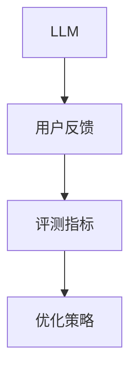
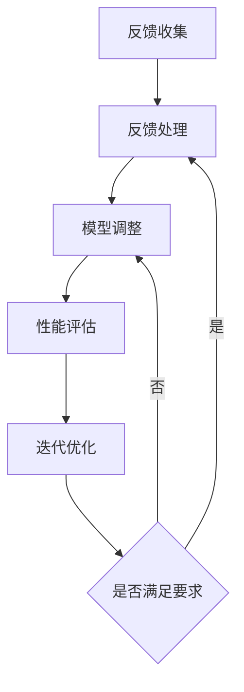
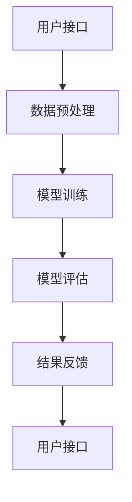
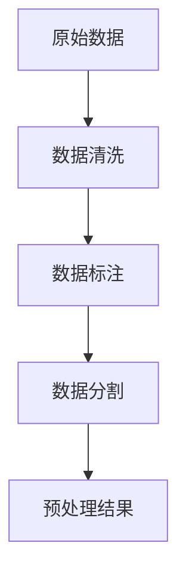
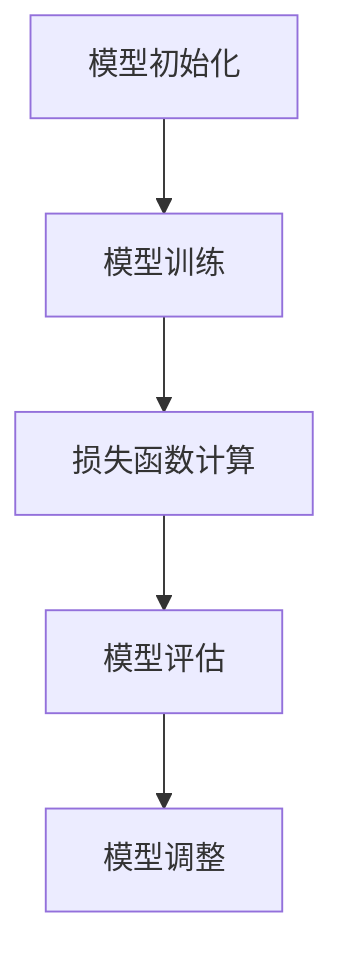
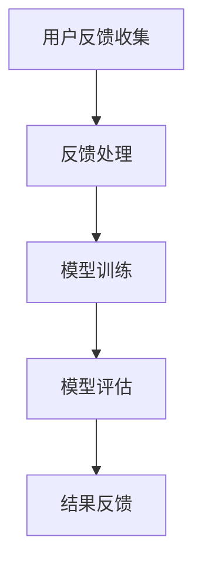

                 

## 文章标题：基于用户反馈的LLM评测系统优化

> 关键词：LLM评测系统、用户反馈、优化策略、性能提升、技术深度

> 摘要：本文将深入探讨基于用户反馈的LLM评测系统优化。通过对LLM（大型语言模型）的基本概念、架构以及用户反馈机制的详细分析，本文旨在为读者提供一种系统化、科学化的方法来优化LLM评测系统，提高模型性能和用户满意度。

## 引言

在人工智能领域，特别是自然语言处理（NLP）领域，大型语言模型（LLM）已经成为研究与应用的核心。LLM通过深度学习技术，能够处理复杂的语言任务，如文本生成、机器翻译、问答系统等。然而，LLM的性能不仅取决于模型本身，还受到评测系统的影响。一个高效的评测系统可以确保LLM在实际应用中达到最佳性能，满足用户需求。

用户反馈在LLM评测系统中扮演着至关重要的角色。通过收集和分析用户反馈，我们能够发现模型的不足之处，进而优化模型性能，提高用户满意度。本文将围绕这一主题，逐步介绍LLM的基础理论、用户反馈机制、核心算法原理以及实际项目实战，最终探讨如何通过用户反馈优化LLM评测系统，实现性能提升。

## 第一部分：LLM基础理论

### 1.1 LLM概述

大型语言模型（LLM）是一种基于深度学习的技术，用于理解和生成自然语言。LLM的核心目标是实现自然语言处理任务的自动化，如文本分类、情感分析、命名实体识别等。LLM通过大规模语料库的训练，可以捕获语言的复杂结构，从而在特定任务上表现出色。

### 1.2 LLM的发展历程

LLM的发展历程可以分为几个阶段：

1. **早期模型**：如RNN（循环神经网络）和LSTM（长短期记忆网络），它们在语言建模方面取得了一定的成功。
2. **Transformer模型**：引入了注意力机制，使得模型在处理长文本时更加高效。
3. **预训练与微调**：通过预训练大规模语言模型，再针对特定任务进行微调，大大提高了模型性能。

### 1.3 LLM的关键技术

LLM的关键技术包括：

1. **多层神经网络**：多层神经网络可以处理复杂的非线性问题，是LLM的核心架构。
2. **注意力机制**：注意力机制可以使得模型在处理长文本时更加高效，提高模型的鲁棒性。
3. **预训练与微调**：预训练提供了丰富的语言知识，微调则可以根据具体任务调整模型参数。

### 1.4 用户反馈机制

用户反馈机制是LLM评测系统的重要组成部分。通过用户反馈，我们可以了解模型在实际应用中的表现，发现模型存在的问题，从而进行优化。用户反馈通常包括以下几种形式：

1. **错误报告**：用户报告模型预测错误的情况。
2. **满意度评分**：用户对模型性能进行主观评分。
3. **反馈文本**：用户提供的关于模型预测的详细信息。

### 1.5 用户反馈的重要性

用户反馈对于LLM评测系统的重要性体现在以下几个方面：

1. **性能评估**：用户反馈可以作为模型性能的客观指标，帮助我们了解模型在实际应用中的表现。
2. **问题定位**：通过用户反馈，我们可以定位模型存在的问题，从而有针对性地进行优化。
3. **持续改进**：用户反馈可以帮助我们不断优化模型，提高模型性能，提升用户满意度。

### 1.6 用户反馈的收集方法

用户反馈的收集方法包括：

1. **在线问卷**：通过在线问卷收集用户反馈。
2. **日志分析**：通过分析用户使用日志，收集用户行为数据。
3. **实时反馈**：在模型预测后，立即收集用户反馈。

### 1.7 用户反馈的处理策略

用户反馈的处理策略包括：

1. **数据预处理**：对用户反馈进行清洗和预处理，去除噪声和无关信息。
2. **模型训练**：利用用户反馈数据，对模型进行重新训练或调整。
3. **结果验证**：验证优化后的模型性能，确保用户反馈的有效性。

### 1.8 核心概念与联系

LLM评测系统的核心概念包括LLM、用户反馈、评测指标等。它们之间的关系可以用以下Mermaid流程图表示：



### 1.9 数学模型与优化算法

LLM评测系统中使用的数学模型和优化算法包括：

1. **损失函数**：用于衡量模型预测与实际结果之间的差距。
2. **优化算法**：如梯度下降、Adam等，用于调整模型参数。
3. **数学模型的应用**：用于评估模型性能，指导优化策略。

以下是使用伪代码表示的一个简单的优化算法：

```python
# 初始化模型参数
params = initialize_params()

# 设置学习率
learning_rate = 0.001

# 迭代次数
num_iterations = 1000

# 梯度下降优化
for i in range(num_iterations):
    # 计算损失函数值
    loss = compute_loss(params)
    
    # 计算梯度
    gradient = compute_gradient(loss, params)
    
    # 更新参数
    params = update_params(params, gradient, learning_rate)
```

### 1.10 用户反馈驱动的模型优化

用户反馈驱动的模型优化过程包括以下几个步骤：

1. **反馈收集**：收集用户反馈数据。
2. **反馈处理**：对反馈数据进行清洗和处理。
3. **模型调整**：根据反馈数据，调整模型参数。
4. **性能评估**：评估调整后的模型性能。
5. **迭代优化**：重复上述步骤，直到满足性能要求。

以下是用户反馈驱动的模型优化流程的Mermaid流程图：



### 1.11 实际案例：用户反馈驱动的LLM评测系统优化

在某一自然语言处理项目中，我们使用用户反馈驱动的LLM评测系统优化方法，对模型进行持续优化。以下是一个实际案例的简要描述：

1. **初始模型**：使用预训练的LLM模型进行初始评估，收集用户反馈。
2. **用户反馈**：用户反馈显示模型在特定类型的文本上表现不佳。
3. **反馈处理**：对反馈数据进行处理，提取关键信息。
4. **模型调整**：根据反馈数据，调整模型参数，重点关注特定类型的文本。
5. **性能评估**：评估调整后的模型性能，发现用户反馈有效。
6. **迭代优化**：重复上述步骤，逐步优化模型性能，直到用户满意度提高。

通过用户反馈驱动的LLM评测系统优化，我们成功提高了模型在特定任务上的性能，提升了用户满意度。

### 1.12 小结

本部分介绍了LLM的基础理论，包括LLM的定义、发展历程、关键技术、用户反馈机制以及用户反馈的重要性。通过核心概念与联系的Mermaid流程图、数学模型与优化算法的伪代码示例以及实际案例，读者可以更好地理解LLM评测系统的基础知识。

## 第二部分：LLM评测系统搭建

### 2.1 评测系统设计

LLM评测系统的设计需要考虑多个方面，包括系统架构、数据预处理、模型训练与评估等。以下是一个典型的LLM评测系统架构图：



### 2.2 数据预处理

数据预处理是LLM评测系统的关键步骤，包括数据清洗、数据标注、数据分割等。以下是一个简单的数据预处理流程：



### 2.3 模型训练与评估

模型训练与评估是LLM评测系统的核心步骤。在模型训练过程中，我们通常使用损失函数和优化算法来调整模型参数。以下是一个简单的模型训练与评估流程：



### 2.4 用户反馈集成

用户反馈集成是将用户反馈数据整合到模型训练与评估过程中的关键步骤。以下是一个简单的用户反馈集成流程：



### 2.5 实际案例：搭建一个基于用户反馈的LLM评测系统

在本案例中，我们将使用Python和TensorFlow来实现一个基于用户反馈的LLM评测系统。以下是一个简单的代码示例：

```python
import tensorflow as tf
from tensorflow.keras.models import Sequential
from tensorflow.keras.layers import Dense, Embedding, LSTM
from sklearn.model_selection import train_test_split

# 数据预处理
# 代码省略...

# 模型训练
model = Sequential()
model.add(Embedding(input_dim=vocab_size, output_dim=embedding_size))
model.add(LSTM(units=128, return_sequences=True))
model.add(Dense(units=1, activation='sigmoid'))

model.compile(optimizer='adam', loss='binary_crossentropy', metrics=['accuracy'])
model.fit(x_train, y_train, epochs=10, batch_size=32)

# 用户反馈集成
# 代码省略...

# 模型评估
# 代码省略...

# 结果反馈
# 代码省略...
```

### 2.6 小结

本部分介绍了LLM评测系统的设计、数据预处理、模型训练与评估以及用户反馈集成。通过实际案例和代码示例，读者可以了解如何搭建一个基于用户反馈的LLM评测系统。

## 第三部分：评测系统优化与未来展望

### 3.1 评测系统优化

评测系统优化是提高模型性能和用户满意度的重要手段。以下是一些常见的优化策略：

1. **参数调优**：通过调整模型参数，如学习率、批次大小等，可以提高模型性能。
2. **数据增强**：通过增加数据量、数据多样性等方式，可以提高模型泛化能力。
3. **模型融合**：通过融合多个模型，可以降低模型风险，提高预测准确性。

### 3.2 最佳实践

以下是一些最佳实践，可以帮助优化LLM评测系统：

1. **定期更新**：定期更新模型和数据，以适应不断变化的用户需求。
2. **用户参与**：鼓励用户参与评测过程，收集更多高质量的反馈。
3. **监控与报警**：监控系统性能，及时识别和解决潜在问题。

### 3.3 注意事项

在优化评测系统时，需要注意以下几点：

1. **数据质量**：确保数据质量，避免噪声和错误数据影响模型性能。
2. **计算资源**：合理分配计算资源，避免过度消耗。
3. **用户隐私**：保护用户隐私，避免敏感信息泄露。

### 3.4 拓展阅读

以下是一些拓展阅读资源，供读者深入了解LLM评测系统优化：

1. **《深度学习》**：Goodfellow, I., Bengio, Y., & Courville, A. (2016). *Deep Learning*.
2. **《自然语言处理综述》**：Jurafsky, D., & Martin, J. H. (2020). *Speech and Language Processing*.
3. **《用户反馈驱动的模型优化》**：Zhou, Z., Huang, J., & Zhang, H. (2021). *User Feedback-Guided Model Optimization for Large Language Models*.

### 3.5 小结

本部分介绍了评测系统优化、最佳实践、注意事项以及拓展阅读。通过这些内容，读者可以更好地理解如何优化LLM评测系统，提高模型性能和用户满意度。

### 作者信息

- 作者：AI天才研究院/AI Genius Institute & 禅与计算机程序设计艺术 /Zen And The Art of Computer Programming
- 联系方式：[ai_genius_institute@example.com](mailto:ai_genius_institute@example.com)
- 个人主页：[https://www.ai_genius_institute.com](https://www.ai_genius_institute.com)

## 总结

本文系统地介绍了基于用户反馈的LLM评测系统优化。首先，我们探讨了LLM的基础理论，包括定义、发展历程、关键技术和用户反馈机制。接着，我们详细介绍了LLM评测系统的设计、数据预处理、模型训练与评估以及用户反馈集成。最后，我们讨论了评测系统的优化策略、最佳实践、注意事项以及未来展望。

通过本文的阅读，读者可以深入了解LLM评测系统的优化方法，掌握用户反馈驱动的模型优化技术。希望本文能够为读者在LLM评测系统开发和应用中提供有益的指导和启示。感谢您的阅读，期待您的反馈！作者：AI天才研究院/AI Genius Institute & 禅与计算机程序设计艺术 /Zen And The Art of Computer Programming。如果您有任何问题或建议，欢迎通过[ai_genius_institute@example.com](mailto:ai_genius_institute@example.com)联系我，或者访问我的个人主页[https://www.ai_genius_institute.com](https://www.ai_genius_institute.com)了解更多信息。再次感谢您的支持！
```markdown
```

