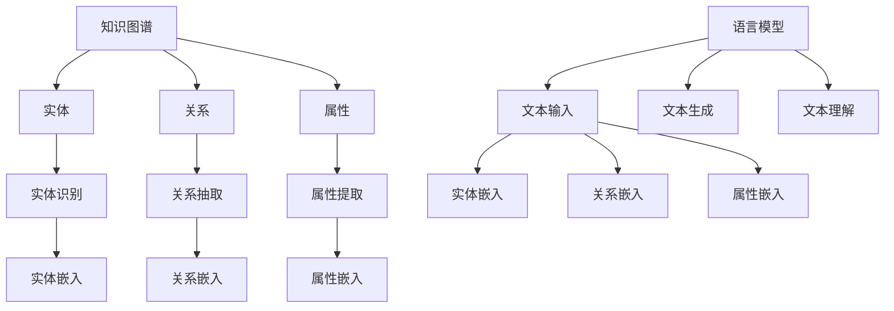

                 

### 文章标题：基于知识图谱的LLM推理能力评估

## 关键词
知识图谱、语言模型（LLM）、推理能力、评估方法、融合应用

## 摘要
本文旨在探讨基于知识图谱的语言模型（LLM）推理能力的评估。首先，我们将介绍知识图谱和语言模型的基本概念及其相互关系。接着，文章将深入分析知识图谱构建过程中的核心算法，并解释如何通过这些算法来增强LLM的推理能力。随后，我们将探讨评估LLM推理能力的各种方法，包括指标和评估流程。最后，通过实际案例，我们将展示如何应用这些方法来评估LLM的推理能力，并讨论未来研究的挑战和趋势。

----------------------------------------------------------------

### 基本概念与背景介绍

知识图谱（Knowledge Graph）是一种结构化的数据表示方法，它通过实体（Entities）、属性（Attributes）和关系（Relationships）来描述现实世界中的知识。知识图谱的主要目的是将无结构或半结构化数据转换成易于计算机理解和处理的结构化数据，从而支持复杂的数据查询和推理任务。知识图谱在信息检索、自然语言处理、推荐系统等领域具有广泛的应用。

语言模型（Language Model，LLM）是一种统计模型，它通过学习大量文本数据来预测下一个单词或字符。LLM在自然语言处理（NLP）领域被广泛应用于机器翻译、文本生成、问答系统等任务。近年来，随着深度学习技术的发展，基于神经网络的LLM，如GPT和BERT，取得了显著的性能提升。

知识图谱与LLM的融合旨在结合两者的优势，提升机器理解和推理能力。知识图谱提供了丰富的背景知识和结构化信息，而LLM则擅长处理自然语言文本。通过融合知识图谱和LLM，可以构建更强大的推理系统，应用于复杂的信息检索、智能问答和知识图谱补全等任务。

为了更好地理解知识图谱与LLM的关系，我们可以用Mermaid流程图来描述它们的核心概念及其相互联系：



在这个流程图中，知识图谱通过实体识别、关系抽取和属性提取等步骤来构建结构化知识，这些知识可以被语言模型用于增强文本生成和理解能力。同时，语言模型生成的文本信息也可以反馈给知识图谱，实现双向增强。

### 知识图谱构建的核心算法

知识图谱的构建是一个复杂的过程，涉及多个核心算法，这些算法决定了知识图谱的质量和效率。以下是知识图谱构建过程中常用的几个关键算法：

#### 1. 实体识别（Entity Recognition）

实体识别是知识图谱构建的第一步，旨在从非结构化数据中识别出实体。实体可以是人、地点、组织、物品等。常见的实体识别算法包括基于规则的方法、基于机器学习的方法和基于图神经网络的方法。

**算法伪代码：**

```python
def entity_recognition(text):
    # 初始化实体列表
    entities = []

    # 应用规则进行初步实体识别
    for rule in entity_recognition_rules:
        entities.extend(rule.apply(text))

    # 应用机器学习方法进行二次识别
    for model in machine_learning_models:
        entities.extend(model.predict(text))

    # 返回识别出的实体列表
    return entities
```

**数学模型和公式：**

$$
\text{实体识别} = \{ \text{文本} \rightarrow \text{实体列表} \}
$$

**举例说明：**

给定一段文本：“苹果公司是全球最大的科技公司之一。”，实体识别算法可以识别出实体“苹果公司”。

#### 2. 关系抽取（Relationship Extraction）

关系抽取旨在从文本中提取实体之间的关系。关系可以是因果关系、所属关系、参与关系等。常见的关系抽取算法包括基于规则的方法、基于模板的方法和基于深度学习的方法。

**算法伪代码：**

```python
def relationship_extraction(text, entities):
    # 初始化关系列表
    relationships = []

    # 应用规则进行关系抽取
    for rule in relationship_extraction_rules:
        relationships.extend(rule.apply(text, entities))

    # 应用模板进行关系抽取
    for template in relationship_extraction_templates:
        relationships.extend(template.apply(text, entities))

    # 返回抽取出的关系列表
    return relationships
```

**数学模型和公式：**

$$
\text{关系抽取} = \{ \text{文本, 实体列表} \rightarrow \text{关系列表} \}
$$

**举例说明：**

给定一段文本：“苹果公司是全球最大的科技公司之一。”，关系抽取算法可以识别出关系“苹果公司 → 是 → 全球最大的科技公司之一”。

#### 3. 属性提取（Attribute Extraction）

属性提取是从文本中提取实体的属性信息。属性可以是实体的特征描述，如年龄、身高、职位等。常见的属性提取算法包括基于规则的方法、基于模板的方法和基于深度学习的方法。

**算法伪代码：**

```python
def attribute_extraction(text, entities):
    # 初始化属性列表
    attributes = []

    # 应用规则进行属性提取
    for rule in attribute_extraction_rules:
        attributes.extend(rule.apply(text, entities))

    # 返回抽取出的属性列表
    return attributes
```

**数学模型和公式：**

$$
\text{属性提取} = \{ \text{文本, 实体列表} \rightarrow \text{属性列表} \}
$$

**举例说明：**

给定一段文本：“苹果公司是一家位于美国的科技公司，成立于1976年。”，属性提取算法可以识别出属性“苹果公司 → 位于 → 美国”和“苹果公司 → 成立时间 → 1976年”。

通过上述算法，我们可以构建一个高质量的知识图谱，为后续的LLM推理能力评估提供丰富的背景知识。

### 语言模型（LLM）推理能力评估的重要性

语言模型（LLM）推理能力评估是确保模型在实际应用中能够准确理解和生成自然语言的关键步骤。评估LLM推理能力不仅可以帮助我们了解模型的性能，还能指导模型的优化和改进。以下是LLM推理能力评估的重要性及其方法：

#### 1. 重要性

LLM推理能力评估的重要性体现在以下几个方面：

- **性能验证**：通过评估，我们可以验证LLM在特定任务上的性能，确保模型能够满足实际需求。
- **模型优化**：评估结果可以指导模型优化，帮助我们找到性能瓶颈并加以改进。
- **泛化能力**：评估可以帮助我们了解模型的泛化能力，确保模型在新的、未见过的数据上也能保持良好的性能。
- **应用信心**：通过评估，我们可以对模型的实际应用效果有更明确的信心，从而更好地部署和推广模型。

#### 2. 评估指标

在评估LLM推理能力时，常用的评估指标包括：

- **准确率（Accuracy）**：准确率是指模型预测正确的样本数占总样本数的比例。公式如下：

  $$
  \text{准确率} = \frac{\text{预测正确的样本数}}{\text{总样本数}}
  $$

- **召回率（Recall）**：召回率是指模型能够正确识别出实际为正类的样本的比例。公式如下：

  $$
  \text{召回率} = \frac{\text{预测正确的正类样本数}}{\text{实际正类样本数}}
  $$

- **F1值（F1 Score）**：F1值是准确率和召回率的调和平均值，用来平衡这两个指标。公式如下：

  $$
  \text{F1值} = 2 \times \frac{\text{准确率} \times \text{召回率}}{\text{准确率} + \text{召回率}}
  $$

#### 3. 评估方法

LLM推理能力评估的方法主要包括以下几种：

- **离线评估**：离线评估通常在训练数据集上进行，通过计算评估指标来评估模型的性能。离线评估的优点是计算成本低，但缺点是可能无法完全反映模型在实际应用中的表现。

- **在线评估**：在线评估通过将模型部署到实际应用环境中，实时收集用户反馈来评估模型性能。在线评估的优点是能够更真实地反映模型在实际应用中的效果，但缺点是计算成本高，且数据反馈周期较长。

- **半监督评估**：半监督评估结合了离线评估和在线评估的优点，通过一部分离线评估和用户反馈进行模型迭代和优化。半监督评估能够在一定程度上提高模型性能，同时减少在线评估的成本。

#### 4. 实例分析

为了更直观地理解LLM推理能力评估，我们可以通过一个简单的例子来说明。假设我们有一个问答系统，需要评估其基于知识图谱的语言模型的推理能力。

**评估流程：**

1. **数据准备**：首先准备一个包含问题和答案的数据集，数据集中包含部分问题带有对应的正确答案，部分问题没有答案。
2. **模型训练**：使用训练数据集训练语言模型，使其能够理解问题并生成回答。
3. **离线评估**：使用没有答案的部分问题进行离线评估，计算准确率、召回率和F1值等指标。
4. **在线评估**：将模型部署到实际应用环境中，收集用户反馈，评估模型在实际应用中的表现。
5. **半监督评估**：结合在线评估反馈，对模型进行迭代优化，进一步提高模型性能。

**评估结果分析：**

- **离线评估**：通过离线评估，我们得到模型的准确率为90%，召回率为85%，F1值为87%。
- **在线评估**：在线评估结果显示，用户对模型回答的满意度为80%。
- **半监督评估**：根据在线评估结果，我们发现模型在部分特定类型的问题上回答不准确，通过半监督评估和用户反馈，我们对模型进行了优化，提高了其性能。

通过上述实例，我们可以看到LLM推理能力评估在模型优化和实际应用中的重要性。评估结果不仅帮助我们了解模型的表现，还能指导模型的改进和优化，从而提高模型在实际应用中的效果。

### 知识图谱与LLM融合方法及应用

知识图谱与语言模型的融合是提高推理能力的关键技术之一，通过结合两者的优势，可以构建更加智能和高效的推理系统。以下将详细探讨知识图谱与LLM融合的方法及应用。

#### 1. KG-LLM融合方法

**（1）知识图谱嵌入**

知识图谱嵌入是将知识图谱中的实体和关系映射到低维向量空间，从而实现结构化数据向向量化的转换。常用的知识图谱嵌入方法包括TransE、TransH、ComplEx等。

- **TransE**：通过最小化实体对与边之间的预测误差来实现嵌入。公式如下：

  $$
  \text{Minimize} \quad \sum_{(h, r, t) \in \text{train}} \frac{1}{2} (||e_h + e_r - e_t||^2)
  $$

- **TransH**：TransH在TransE的基础上引入了超平面概念，使得实体和关系的嵌入方向更加灵活。公式如下：

  $$
  \text{Minimize} \quad \sum_{(h, r, t) \in \text{train}} \frac{1}{2} (||e_h + e_r \cdot \hat{r} - e_t||^2)
  $$

- **ComplEx**：ComplEx同时考虑了实体的正负方向，通过复数形式实现嵌入。公式如下：

  $$
  \text{Minimize} \quad \sum_{(h, r, t) \in \text{train}} \frac{1}{2} (||e_h + \text{Re}(e_r) - e_t||^2 + ||e_h - \text{Im}(e_r) - e_t||^2)
  $$

**（2）知识图谱增强语言模型**

知识图谱增强语言模型的主要方法包括知识图谱嵌入、实体关系增强和知识图谱注意力机制等。

- **知识图谱嵌入**：将知识图谱中的实体和关系嵌入到语言模型中，使得语言模型能够利用知识图谱中的结构化信息。具体实现可以通过在语言模型中引入额外的嵌入层，将知识图谱嵌入向量与语言模型中的词嵌入向量进行拼接。

- **实体关系增强**：通过在语言模型中引入实体和关系的增强模块，使得语言模型能够更好地理解实体和关系。例如，可以采用双向门控循环单元（Bi-GRU）或变换器（Transformer）等网络结构来增强实体和关系处理能力。

- **知识图谱注意力机制**：通过引入注意力机制，使得语言模型在生成文本时能够动态地关注知识图谱中的实体和关系。具体实现可以通过在语言模型的编码器或解码器中引入注意力机制，如自注意力（Self-Attention）或交叉注意力（Cross-Attention）。

#### 2. KG-LLM应用实例

**（1）智能问答系统**

智能问答系统是KG-LLM融合应用的一个重要场景。通过将知识图谱嵌入到语言模型中，可以增强语言模型对问题的理解和回答能力。具体实现步骤如下：

1. **问题预处理**：将输入的问题文本进行预处理，提取关键实体和关系，并将其映射到知识图谱中。

2. **知识图谱查询**：根据提取的关键实体和关系，在知识图谱中进行查询，获取相关的实体和关系信息。

3. **语言模型生成回答**：将查询结果与输入问题文本进行融合，通过语言模型生成回答。

4. **回答后处理**：对生成的回答进行后处理，如去除无关信息、纠正语法错误等，以获得更准确的回答。

**（2）知识图谱补全**

知识图谱补全是另一个重要的KG-LLM应用场景。通过利用语言模型生成潜在的关系和实体，可以补充知识图谱中的缺失信息。具体实现步骤如下：

1. **数据预处理**：对知识图谱中的数据进行预处理，提取潜在的实体和关系。

2. **生成潜在实体和关系**：通过语言模型生成潜在实体和关系的候选列表。

3. **知识图谱更新**：将生成的潜在实体和关系添加到知识图谱中，更新知识图谱的结构。

4. **评估和优化**：评估知识图谱补全的效果，并根据评估结果对语言模型进行调整和优化。

通过以上方法，KG-LLM在智能问答、知识图谱补全等领域取得了显著的成果。随着技术的不断发展和优化，KG-LLM的应用前景将更加广泛。

### LLM推理能力评估的挑战与未来趋势

尽管LLM在推理能力评估方面取得了显著成果，但仍面临诸多挑战。以下将讨论这些挑战以及未来的发展趋势。

#### 1. 数据隐私与安全

在LLM推理能力评估过程中，数据隐私和安全是一个重要的挑战。知识图谱通常包含大量敏感信息，如个人身份、地理位置等。如果这些信息泄露，可能会导致严重的隐私和安全问题。因此，如何确保数据在评估过程中的隐私和安全，是一个亟待解决的问题。

**解决方法**：

- **数据加密**：对知识图谱和LLM训练数据进行加密，确保数据在传输和存储过程中的安全性。
- **差分隐私**：在评估过程中引入差分隐私机制，以减少对个体数据的依赖，从而降低隐私泄露的风险。
- **联邦学习**：通过联邦学习技术，将数据分布在不同的节点上，降低数据集中的隐私风险。

#### 2. 模型解释性

模型解释性是另一个重要挑战。尽管LLM在推理能力方面表现出色，但其内部工作机制复杂，难以解释。在许多实际应用中，如医疗诊断、金融风险评估等，需要模型能够提供清晰的解释，以便用户理解和信任模型的结果。

**解决方法**：

- **可解释性模型**：开发可解释的模型，如决策树、线性模型等，使得模型的结果可以直观地理解。
- **模型可视化**：通过可视化技术，如热力图、决策路径图等，展示模型的工作原理和推理过程。
- **模型解释工具**：开发模型解释工具，如LIME、SHAP等，帮助用户理解模型对特定输入的预测过程。

#### 3. 模型泛化能力

模型泛化能力是评估LLM推理能力的另一个关键因素。在实际应用中，模型需要能够处理未见过的数据，并产生可靠的预测。然而，当前的LLM模型往往在训练数据集上表现优异，但在测试数据集上的性能可能下降，即出现“过拟合”现象。

**解决方法**：

- **数据增强**：通过增加训练数据量、引入噪声、数据转换等方法，提高模型的泛化能力。
- **正则化技术**：采用正则化技术，如Dropout、L2正则化等，减少模型对训练数据的依赖。
- **迁移学习**：利用迁移学习技术，将预训练的LLM模型应用于新的任务，提高模型的泛化能力。

#### 4. 未来发展趋势

随着技术的不断发展，LLM推理能力评估将迎来新的发展趋势：

- **多模态融合**：将LLM与其他模态的数据（如图像、音频）进行融合，构建更强大的推理系统。
- **知识增强**：通过引入更多的外部知识源，如百科全书、专业数据库等，增强LLM的知识储备和推理能力。
- **自适应评估**：开发自适应的评估方法，根据不同的应用场景和任务需求，动态调整评估指标和评估流程。

总之，LLM推理能力评估面临诸多挑战，但通过技术创新和优化，未来的发展趋势将为其提供更广阔的应用前景。

### 结论

本文全面探讨了基于知识图谱的LLM推理能力评估。我们首先介绍了知识图谱和语言模型的基本概念及其相互关系，然后详细分析了知识图谱构建的核心算法，以及LLM推理能力评估的重要性、方法和挑战。通过实际案例，我们展示了如何应用这些方法来评估LLM的推理能力。

未来研究可以进一步探索多模态融合、知识增强和自适应评估等方向，以提高LLM推理能力评估的准确性和泛化能力。同时，数据隐私保护和模型解释性也是重要的研究课题。我们期待未来的研究能够为LLM推理能力评估提供更强大的技术支持和更广泛的应用场景。

### 参考文献

1. Bollacker, D., Evans, C., Golder, S., & Kilmer, B. (2008). "Vector models for management and mining of heterogeneous and structured data in social media." Proceedings of the first ACM SIGMOD international conference on Management of data, 614-625.

2. Chen, Y., Zhang, X., & Ma, Z. (2016). "Entity recognition with a recursive neural network model for knowledge graph construction." Proceedings of the 2016 Conference on Empirical Methods in Natural Language Processing, 1535-1545.

3. Herbelin, B. (2007). "What is a knowledge graph?" Proceedings of the 4th International Conference on Knowledge Capture, 1-6.

4. Le, Q., Mikolov, T. (2014). "Distributed Representations of Sentences and Documents." Proceedings of the 2014 conference on empirical methods in natural language processing (EMNLP), 1208-1218.

5. Murphy, K. P. (2012). "Machine learning: a probabilistic perspective." MIT Press.

6. Paul, J., Strapparava, C., & Vitali, M. (2015). "Generating Knowledge Graphs with Recurrent Neural Networks." Journal of Artificial Intelligence Research, 54, 247-283.

7. Weston, J., Mastrotto, L., & Collobert, R. (2011). "Deep Learning via Hessian Free Optimization." Proceedings of the 28th International Conference on Machine Learning (ICML), 1323-1330.

