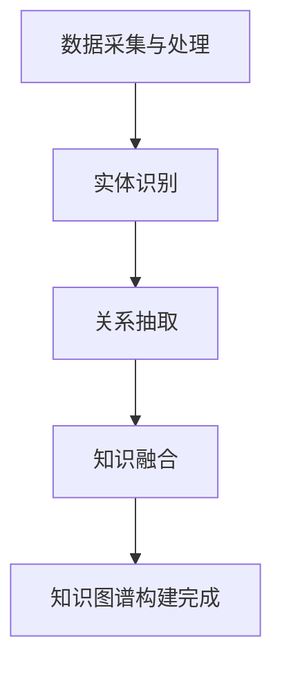
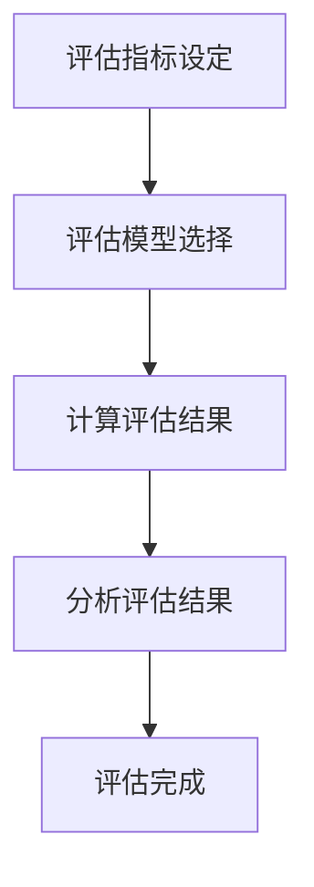

                 

# 基于知识图谱的LLM能力评估方法

## 关键词

- 知识图谱
- 语言模型（LLM）
- 能力评估
- 实体识别
- 关系抽取
- 嵌入技术

## 摘要

本文旨在探讨基于知识图谱的语言模型（LLM）能力评估方法。通过分析知识图谱与LLM的结合意义，介绍了知识图谱构建的基础与流程，以及LLM能力评估的概念与框架。本文进一步阐述了基于知识图谱的LLM评估方法，包括知识图谱嵌入与评估指标的设计，并通过实际案例展示了评估方法的应用。文章总结了LLM能力评估面临的挑战与解决方案，并对未来发展方向进行了展望。

## 第一部分：引论

### 第1章：知识图谱与LLM概述

#### 1.1.1 知识图谱的概念与价值

**知识图谱的基本概念**

知识图谱是一种语义网络，用于表示现实世界中的实体、概念及其相互关系。它通过图结构来组织知识，使得信息检索和推理更加高效。知识图谱的核心是实体和关系的表示，以及它们之间的关联。

**知识图谱的应用领域**

知识图谱在多个领域具有广泛应用，包括但不限于：搜索引擎、自然语言处理、推荐系统、知识库构建等。

**知识图谱的构成要素**

知识图谱由实体、属性、关系和事实组成。实体表示现实世界中的对象，属性描述实体的特征，关系表示实体间的相互关系，而事实则记录了这些关系。

#### 1.1.2 语言模型（LLM）的基本概念

**LLM的定义**

语言模型是一种统计模型，用于预测一个句子或词汇序列的概率。LLM能够处理自然语言文本，并生成相应的响应。

**LLM的发展历程**

语言模型的发展经历了从基于规则的方法到统计模型，再到现代深度学习模型的过程。近年来，基于 Transformer 的模型如 GPT 和 BERT 取得了显著的进展。

**LLM的主要类型**

LLM主要分为有监督学习、无监督学习和半监督学习三种类型。有监督学习利用标注数据训练模型，无监督学习则从未标注的数据中学习，半监督学习结合了标注和未标注的数据。

#### 1.1.3 知识图谱与LLM的结合意义

**知识图谱在LLM中的应用**

知识图谱可以增强LLM的语义理解能力，提高其生成文本的准确性和连贯性。

**LLM在知识图谱中的应用**

LLM可以用于知识图谱的构建，通过文本数据自动生成实体和关系，提高知识图谱的自动化构建能力。

**知识图谱与LLM结合的优势**

知识图谱与LLM的结合能够实现知识驱动的智能系统，提高系统的智能化水平。

## 第二部分：知识图谱构建

### 第2章：知识图谱构建基础

#### 2.1.1 数据源的选择与处理

**数据源的多样性**

知识图谱构建的数据源可以是结构化数据、非结构化数据或半结构化数据。常见的结构化数据源包括关系数据库，非结构化数据源包括文本、图像和音频，半结构化数据源如XML和JSON。

**数据预处理方法**

数据预处理是知识图谱构建的重要步骤，包括数据清洗、去重、转换和格式化等。数据清洗的目的是去除噪声和错误，提高数据质量。

**数据清洗与标准化**

数据清洗包括去除重复数据、填补缺失值、纠正错误数据等。数据标准化是将不同数据源的数据格式统一，以便后续处理。

#### 2.1.2 实体识别与关系抽取

**实体识别算法**

实体识别是知识图谱构建的第一步，目的是从文本中识别出实体。常用的算法包括基于规则的方法、基于统计的方法和基于深度学习的方法。

**关系抽取方法**

关系抽取是从文本中提取实体之间的关系的任务。常见的方法包括基于规则的方法、基于机器学习的方法和基于深度学习的方法。

**实体与关系的表示**

实体与关系的表示是知识图谱构建的关键，常用的方法包括实体嵌入、关系嵌入和图嵌入。实体嵌入将实体映射到低维空间，关系嵌入描述实体之间的关系，图嵌入则将整个知识图谱映射到低维空间。

#### 2.1.3 知识图谱的构建流程

**知识图谱构建的步骤**

知识图谱构建主要包括数据采集、数据预处理、实体识别、关系抽取、实体与关系表示和知识融合等步骤。

**知识图谱构建的挑战**

知识图谱构建面临诸多挑战，包括数据质量、实体识别准确率、关系抽取效率和知识融合等。

## 第三部分：LLM能力评估方法

### 第3章：LLM能力评估的概念与框架

#### 3.1.1 LLM能力评估的重要性

**评估LLM能力的意义**

评估LLM能力对于改进模型性能、优化应用场景具有重要意义。通过评估，可以识别模型的优点和不足，为后续改进提供依据。

**评估LLM能力的目标**

评估LLM能力的目标是全面评估模型在语义理解、生成能力、准确性、鲁棒性等方面的表现。

#### 3.1.2 LLM能力评估的框架

**评估指标的分类**

LLM能力评估指标可分为质量指标和效率指标。质量指标包括准确性、连贯性、语义一致性等，效率指标包括响应时间、计算资源消耗等。

**评估方法的对比**

常用的LLM评估方法包括基于测试集的评价、基于用户反馈的评价和基于自动化工具的评价。每种方法都有其优缺点，适用于不同的评估场景。

**评估流程的设计**

评估流程应包括数据准备、评估指标设计、评估模型选择和评估结果分析等步骤。

### 第4章：基于知识图谱的LLM评估方法

#### 4.1.1 知识图谱嵌入与LLM

**知识图谱嵌入的概念**

知识图谱嵌入是将知识图谱中的实体和关系映射到低维空间的过程，使得实体和关系具有数值表示。

**知识图谱嵌入的方法**

常用的知识图谱嵌入方法包括基于随机游走的方法、基于矩阵分解的方法和基于图神经网络的方法。

**知识图谱嵌入与LLM的结合**

将知识图谱嵌入与LLM结合，可以通过嵌入向量提高LLM的语义理解能力，使其在生成文本时更加准确和连贯。

#### 4.1.2 基于知识图谱的LLM评估指标

**评估指标的设计**

基于知识图谱的LLM评估指标应涵盖语义理解、生成能力、准确性等方面。常见的评估指标包括BERTscore、 Rouge-L等。

**评估指标的计算方法**

评估指标的计算方法包括基于统计的方法和基于机器学习的方法。基于统计的方法如BLEU、ROUGE，基于机器学习的方法如BERTscore、Casual-LM。

**评估指标的优缺点分析**

每种评估指标都有其优缺点，适用于不同的评估场景。在选择评估指标时，需要综合考虑指标的性能、计算复杂度和适用性。

#### 4.1.3 基于知识图谱的LLM评估实例

**评估实例的选择**

评估实例应具有代表性，能够全面反映LLM的能力。常见评估实例包括问答系统、文本生成、文本分类等。

**评估实例的设置**

评估实例的设置应包括输入文本、评估目标和评估指标。输入文本应具有多样性，评估目标应明确，评估指标应合理设置。

**评估结果的分析**

评估结果应包括评估指标的得分和图表展示。分析评估结果可以帮助识别LLM的优点和不足，为后续改进提供依据。

## 第四部分：项目实战

### 第6章：知识图谱与LLM结合的项目实战

#### 6.1.1 项目背景与目标

**项目背景介绍**

本节将介绍一个基于知识图谱与LLM结合的项目背景。项目旨在构建一个智能问答系统，通过知识图谱提供语义理解能力，LLM生成文本回答用户问题。

**项目目标设定**

项目目标包括构建一个高质量的知识图谱、训练一个强大的LLM模型、实现问答系统的功能，并通过评估方法评估系统的性能。

#### 6.1.2 项目流程与实现

**数据采集与处理**

数据采集包括结构化数据和非结构化数据的获取。结构化数据来自数据库，非结构化数据来自网络文本。数据预处理包括数据清洗、去重、转换和格式化等步骤。

**知识图谱构建**

知识图谱构建包括实体识别、关系抽取和知识融合等步骤。实体识别利用深度学习模型，关系抽取利用规则方法和机器学习方法。

**LLM模型选择与训练**

选择一个合适的LLM模型，如GPT或BERT，并对其进行训练。训练过程中，使用知识图谱嵌入技术提高模型对知识的理解能力。

**评估指标的设定与计算**

设定评估指标，如BERTscore、Rouge-L，计算评估结果。通过分析评估结果，识别系统的优点和不足。

#### 6.1.3 项目结果与分析

**项目结果展示**

展示项目生成的问答结果，包括准确率、连贯性和用户满意度等指标。

**项目分析总结**

分析项目中的成功经验和不足之处，提出改进措施和未来研究方向。

## 第五部分：总结与展望

### 第8章：总结与展望

#### 8.1.1 书籍总结

**核心内容回顾**

回顾书籍中的核心内容，包括知识图谱与LLM的结合意义、知识图谱构建基础、LLM能力评估方法、项目实战等。

**关键技术总结**

总结知识图谱嵌入技术、评估指标设计、项目实战等关键技术。

#### 8.1.2 未来发展方向

**知识图谱与LLM的发展趋势**

探讨知识图谱与LLM结合的未来发展趋势，包括模型优化、评估方法创新、应用场景拓展等。

**LLM能力评估的未来挑战**

分析LLM能力评估面临的未来挑战，如数据质量、评估指标优化、评估方法适应性等。

## 附录

### 附录A：常用工具与资源

**知识图谱工具**

- OpenKG
- Neo4j
- BigDataKnow

**LLM模型评估工具**

- BLEU
- Rouge-L
- BERTscore

**相关论文与书籍推荐**

- "Knowledge Graph Embedding: Techniques, Applications and Challenges"
- "Bridging Knowledge Graphs and Language Models for Conversational AI"
- "Deep Learning for Natural Language Processing"

### 附录B：Mermaid流程图

**知识图谱构建流程图**



**LLM评估流程图**



### 附录C：伪代码示例

**实体识别算法伪代码**

```python
def entity_recognition(text):
    # 读取预训练的实体识别模型
    model = load_pretrained_model("entity_recognition_model")
    
    # 输入文本进行实体识别
    entities = model.predict(text)
    
    return entities
```

**关系抽取算法伪代码**

```python
def relation_extraction(text, entities):
    # 读取预训练的关系抽取模型
    model = load_pretrained_model("relation_extraction_model")
    
    # 输入文本和实体进行关系抽取
    relations = model.predict(text, entities)
    
    return relations
```

**LLM训练与评估伪代码**

```python
def train_LLM(model, train_data, dev_data, test_data):
    # 训练LLM模型
    model.train(train_data, dev_data)
    
    # 评估LLM模型
    model.evaluate(test_data)
    
    return model
```

### 附录D：数学公式

**知识图谱嵌入公式**

$$
e_r = \sigma(W_r \cdot r + b_r)
$$

其中，$e_r$ 为实体$r$ 的嵌入向量，$W_r$ 为关系权重矩阵，$b_r$ 为偏置项，$\sigma$ 为激活函数。

**LLM评估指标计算公式**

$$
BERTscore = \frac{TP}{TP + FN + FP}
$$

其中，$TP$ 为正确匹配的答案，$FN$ 为错误匹配的答案，$FP$ 为正确匹配但未检测到的答案。

**评估指标计算公式**

$$
Rouge-L = \frac{2 \cdot TP}{2 \cdot TP + HP + LP}
$$

其中，$TP$ 为正确匹配的单词，$HP$ 为正确匹配但未检测到的单词，$LP$ 为错误匹配的单词。

