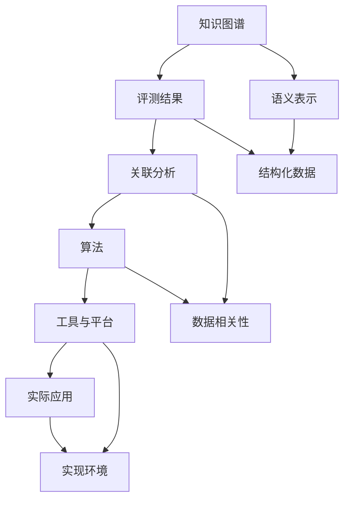

                 

### 文章标题

# 基于知识图谱的评测结果关联分析

> 关键词：知识图谱、评测结果、关联分析、算法、应用案例、工具平台

> 摘要：本文将深入探讨基于知识图谱的评测结果关联分析，通过详细阐述知识图谱的概念、表示方法、构建过程以及关联分析算法，旨在为读者提供一个全面的技术视角，帮助理解如何在评测结果中挖掘有价值的信息，并提升数据分析的准确性和效率。

---

### 引言

随着大数据和人工智能技术的飞速发展，评测结果关联分析在各个领域（如医疗、金融、教育等）中变得越来越重要。传统的评测结果分析往往依赖于统计方法和机器学习模型，但这些方法在处理复杂、多维度和动态变化的数据时，常常面临效率低下、解释性差等问题。知识图谱作为一种新型的语义网络，具有结构化、可解释性强、可扩展性高等优点，为评测结果关联分析提供了一种全新的思路。

本文旨在通过以下步骤进行详细分析：

1. **知识图谱基础**：介绍知识图谱的概念、发展历史和应用场景。
2. **知识图谱的表示方法**：讲解图论基础、RDF和OWL表示方法。
3. **知识图谱的构建**：阐述数据源收集、预处理、实体和关系抽取以及构建工具。
4. **评测结果关联分析**：探讨评测结果的概述、关联分析算法及其应用。
5. **关联分析算法与应用**：深入分析基于规则、机器学习和深度学习的方法。
6. **评测结果关联分析工具与平台**：介绍开源工具和评测结果关联分析平台。
7. **实践与探索**：通过案例研究展示关联分析的实际应用。
8. **未来发展趋势**：预测评测结果关联分析的发展方向。

---

### 第一部分：知识图谱基础

#### 第1章：知识图谱概述

##### 1.1 知识图谱的概念

知识图谱（Knowledge Graph）是一种语义网络，它通过实体（如人、地点、事物）及其属性和关系的表示，构建出一个结构化的知识体系。与传统的数据库不同，知识图谱强调语义理解和关联性，能够更好地支持复杂的查询和推理。

##### 1.2 知识图谱的发展历史

知识图谱的概念起源于20世纪80年代，谷歌的PageRank算法开创了基于链接分析的网页排序方法。随后，随着语义网和图论技术的发展，知识图谱逐渐成为一种重要的数据组织形式。

##### 1.3 知识图谱的应用场景

知识图谱在社交网络、电子商务、智能问答等领域有广泛的应用。例如，在社交网络中，知识图谱可以帮助推荐好友、优化广告投放；在电子商务中，知识图谱可以用于商品分类、个性化推荐。

---

#### 第2章：知识图谱的表示方法

##### 2.1 图论基础

图论是知识图谱表示的基础。图由节点和边组成，节点表示实体，边表示实体之间的关系。常见的图的存储结构包括邻接表和邻接矩阵。

##### 2.2 RDF表示方法

RDF（Resource Description Framework）是一种基于图的语义表示方法。它通过Subject-Predicate-Object的三元组形式，描述实体及其关系。

##### 2.3 OWL表示方法

OWL（Web Ontology Language）是一种用于构建知识图谱的语义语言。它提供了更丰富的描述能力，支持分类、属性、函数等高级概念。

##### 2.4 其他知识图谱表示方法

除了RDF和OWL，还有其他知识图谱表示方法，如PROLOG和基于图神经网络的表示方法。这些方法各有优缺点，适用于不同的应用场景。

---

#### 第3章：知识图谱的构建

##### 3.1 数据源收集

构建知识图谱的第一步是收集数据源。数据源可以是开放数据集、专有数据集或通过爬虫等手段获取的数据。

##### 3.2 数据预处理

数据预处理包括数据清洗、转换和集成。数据清洗旨在去除重复、错误或无关的数据；数据转换旨在将数据格式统一；数据集成旨在将多源数据整合为一个统一的知识体系。

##### 3.3 实体抽取

实体抽取是从非结构化或半结构化数据中识别出实体并标注其属性的过程。常见的实体抽取方法包括基于规则的方法、基于机器学习的方法和基于深度学习的方法。

##### 3.4 关系抽取

关系抽取是从文本数据中识别出实体之间的关系的任务。关系抽取方法与实体抽取方法类似，也可以基于规则、机器学习和深度学习。

##### 3.5 知识图谱构建工具

常用的知识图谱构建工具包括OpenKG、D2R Server和Neo4j等。这些工具提供了从数据源收集、数据预处理到实体和关系抽取以及知识图谱构建的一整套解决方案。

---

### 第二部分：评测结果关联分析

#### 第4章：评测结果概述

##### 4.1 评测结果的来源

评测结果的来源多种多样，包括竞赛、测试和自主评测。不同的来源决定了评测结果的类型和特性。

##### 4.2 评测结果的类型

评测结果的类型包括分类结果、回归结果等。每种类型的结果都有其特定的应用场景和处理方法。

##### 4.3 评测结果的特性

评测结果的特性包括准确性、可靠性、时效性等。这些特性对评测结果关联分析的质量具有重要影响。

---

### 第三部分：关联分析算法与应用

#### 第5章：基于规则的方法

##### 5.1 基本概念

基于规则的方法通过定义一组规则来识别和关联评测结果。这种方法通常具有较好的解释性，但可能存在规则过拟合的问题。

##### 5.2 常用算法

常用的基于规则的方法包括逻辑回归、决策树和贝叶斯网络等。这些算法各有优缺点，适用于不同的应用场景。

##### 5.3 应用案例

通过实际案例展示基于规则的方法在评测结果关联分析中的应用。

---

#### 第6章：基于机器学习的方法

##### 6.1 基本概念

基于机器学习的方法通过训练模型来识别和关联评测结果。这种方法通常具有较高的准确性和泛化能力，但可能缺乏解释性。

##### 6.2 常用算法

常用的基于机器学习的方法包括支持向量机、随机森林和神经网络等。这些算法各有优缺点，适用于不同的应用场景。

##### 6.3 应用案例

通过实际案例展示基于机器学习的方法在评测结果关联分析中的应用。

---

#### 第7章：基于深度学习的方法

##### 7.1 基本概念

基于深度学习的方法通过神经网络模型来识别和关联评测结果。这种方法通常具有很高的准确性和效率，但可能对数据量和计算资源有较高要求。

##### 7.2 常用算法

常用的基于深度学习的方法包括卷积神经网络、循环神经网络和图神经网络等。这些算法各有优缺点，适用于不同的应用场景。

##### 7.3 应用案例

通过实际案例展示基于深度学习的方法在评测结果关联分析中的应用。

---

### 第四部分：评测结果关联分析工具与平台

#### 第8章：开源知识图谱工具

##### 8.1 OpenKG

介绍OpenKG的特点、功能和应用。

##### 8.2 D2R Server

介绍D2R Server的特点、功能和应用。

##### 8.3 GraphDB

介绍GraphDB的特点、功能和应用。

---

#### 第9章：评测结果关联分析平台

##### 9.1 平台概述

介绍评测结果关联分析平台的总体架构和功能。

##### 9.2 功能模块

介绍评测结果关联分析平台的主要功能模块。

##### 9.3 应用案例

通过实际案例展示评测结果关联分析平台的应用。

---

### 第五部分：实践与探索

#### 第10章：评测结果关联分析案例研究

##### 10.1 案例背景

介绍案例研究的背景，包括评测结果的来源和目标。

##### 10.2 数据分析

介绍案例研究的分析过程，包括数据收集、预处理和关联分析。

##### 10.3 关联分析过程

详细讲解关联分析的过程，包括算法选择、模型训练和结果验证。

##### 10.4 结果分析与讨论

对关联分析的结果进行讨论，包括结果的准确性和可靠性。

---

#### 第11章：评测结果关联分析未来发展趋势

##### 11.1 技术发展趋势

预测评测结果关联分析技术的发展趋势，包括算法创新、工具升级等。

##### 11.2 应用场景扩展

探讨评测结果关联分析在新的应用场景中的潜力。

##### 11.3 挑战与机遇

分析评测结果关联分析面临的挑战和机遇，为未来的发展提供指导。

---

### 总结

本文系统地介绍了基于知识图谱的评测结果关联分析。通过对知识图谱基础、关联分析算法和应用、工具与平台以及实践与探索的详细探讨，为读者提供了一个全面的技术视角。未来，评测结果关联分析将在更广泛的应用场景中发挥重要作用，为数据驱动的决策提供强有力的支持。

### 作者信息

作者：AI天才研究院/AI Genius Institute & 禅与计算机程序设计艺术 /Zen And The Art of Computer Programming

---

### 核心概念与联系

在深入探讨知识图谱及其在评测结果关联分析中的应用之前，有必要首先明确一些核心概念，并探讨它们之间的联系。以下是本文中的一些关键概念及其相互关系：

**概念：**

1. **知识图谱（Knowledge Graph）**：一种语义网络，通过实体及其属性的表示和关系来构建一个结构化的知识体系。
2. **评测结果（Evaluation Results）**：指在特定任务或项目中，通过某种评价标准或算法得到的输出结果，如分类结果、回归结果等。
3. **关联分析（Association Analysis）**：通过分析多个数据集之间的相关性，发现数据之间的潜在关联和模式。
4. **算法（Algorithm）**：解决问题的步骤和策略，用于处理数据和分析评测结果。
5. **工具与平台（Tools and Platforms）**：用于实现知识图谱构建和关联分析的软件工具和平台。

**联系：**

- **知识图谱与评测结果**：知识图谱提供了对评测结果的语义表示，使得评测结果能够以结构化的形式存储和查询，从而便于进一步的关联分析。
- **关联分析与算法**：关联分析依赖于各种算法来实现，包括基于规则的、基于机器学习的和基于深度学习的方法，这些算法用于识别评测结果之间的关联。
- **算法与工具与平台**：工具和平台为算法提供了实现环境，使得算法能够高效地运行，并且方便用户进行数据操作和结果分析。
- **评测结果与实际应用**：评测结果关联分析旨在为实际应用提供决策支持，如优化业务流程、改进产品性能等。

为了更直观地展示这些概念之间的联系，我们可以使用Mermaid流程图进行表示：



通过这个流程图，我们可以清晰地看到知识图谱如何通过语义表示将评测结果结构化，并通过算法和工具与平台实现关联分析，最终服务于实际应用。

### 核心算法原理讲解

在评测结果关联分析中，核心算法的选择和实现对于分析结果的准确性和效率至关重要。本文将详细介绍几种常见的核心算法，包括基于规则的算法、基于机器学习的算法和基于深度学习的算法。通过伪代码、数学模型和具体例子，我们将深入理解这些算法的基本原理。

#### 基于规则的算法

基于规则的算法通过定义一组规则来识别和关联评测结果。这些规则通常以“如果...则...”的形式表达，形式化地描述了评测结果之间的关联性。

**伪代码：**

```python
def rule_based_association(eval_results, rules):
    associations = []
    for result in eval_results:
        for rule in rules:
            if apply_rule(rule, result):
                associations.append(rule)
    return associations

def apply_rule(rule, result):
    # 应用规则判断结果是否符合条件
    conditions = rule['conditions']
    for condition in conditions:
        if not check_condition(condition, result):
            return False
    return True

def check_condition(condition, result):
    # 检查条件是否满足
    attribute = condition['attribute']
    value = condition['value']
    return result[attribute] == value
```

**数学模型：**

基于规则的算法通常使用逻辑表达式或决策树来表示规则。例如：

$$
R = \{ \forall x, y \in E, (x, y) \in R \Rightarrow P(x) \land Q(y) \}
$$

其中，\(R\) 表示关联规则集合，\(E\) 表示实体集合，\(P(x)\) 和 \(Q(y)\) 表示实体 \(x\) 和 \(y\) 满足的条件。

**例子：**

假设有两个评测结果：\(A\) 和 \(B\)，它们之间的关联规则为“如果 \(A\) 是“优秀”，则 \(B\) 是“良好””。则：

$$
R = \{ (A, B) | A = "优秀" \land B = "良好" \}
$$

#### 基于机器学习的算法

基于机器学习的算法通过训练模型来识别和关联评测结果。这些算法通常包括监督学习和无监督学习两种类型。

**监督学习算法：**

监督学习算法通过已标注的数据集来训练模型，然后使用模型对新的评测结果进行预测。常见的监督学习算法有逻辑回归、决策树和支持向量机。

**伪代码：**

```python
def supervised_learning_algorithm(eval_results, labels):
    model = train_model(eval_results, labels)
    predictions = model.predict(new_results)
    return predictions

def train_model(eval_results, labels):
    # 使用训练数据训练模型
    model = LogisticRegression()
    model.fit(eval_results, labels)
    return model
```

**无监督学习算法：**

无监督学习算法不依赖于标注数据，通过发现数据中的潜在结构和关联来识别评测结果。常见的无监督学习算法有聚类和主成分分析。

**伪代码：**

```python
def clustering_algorithm(eval_results):
    clusters = KMeans(n_clusters=3).fit(eval_results)
    labels = clusters.predict(eval_results)
    return labels
```

**数学模型：**

逻辑回归是一种常见的监督学习算法，其目标是最小化损失函数，使得预测结果与真实标签之间的差异最小。

$$
\min_{\theta} \sum_{i=1}^{n} (-y_i \log(\hat{y}_i) - (1 - y_i) \log(1 - \hat{y}_i))
$$

其中，\(\theta\) 表示模型参数，\(y_i\) 表示真实标签，\(\hat{y}_i\) 表示预测概率。

#### 基于深度学习的算法

基于深度学习的算法通过神经网络模型来识别和关联评测结果。深度学习算法在处理大规模数据和复杂关系方面具有显著优势。

**卷积神经网络（CNN）**

卷积神经网络适用于处理图像和序列数据。通过卷积操作和池化操作，CNN可以提取特征并降低数据维度。

**伪代码：**

```python
def conv_network(input_data, labels):
    model = Sequential()
    model.add(Conv2D(filters=32, kernel_size=(3, 3), activation='relu'))
    model.add(MaxPooling2D(pool_size=(2, 2)))
    model.add(Flatten())
    model.add(Dense(10, activation='softmax'))
    model.compile(optimizer='adam', loss='categorical_crossentropy', metrics=['accuracy'])
    model.fit(input_data, labels, epochs=10)
    return model
```

**循环神经网络（RNN）**

循环神经网络适用于处理序列数据，如时间序列数据或文本数据。RNN通过循环结构保存历史信息，从而可以更好地捕捉序列中的依赖关系。

**伪代码：**

```python
def rnn_network(input_data, labels):
    model = Sequential()
    model.add(LSTM(50, activation='relu', return_sequences=True))
    model.add(LSTM(50, activation='relu'))
    model.add(Dense(1, activation='sigmoid'))
    model.compile(optimizer='adam', loss='binary_crossentropy', metrics=['accuracy'])
    model.fit(input_data, labels, epochs=10)
    return model
```

**图神经网络（GNN）**

图神经网络适用于处理图结构数据，如知识图谱。GNN通过节点和边的信息传递来学习节点表示。

**伪代码：**

```python
def gnns_network(graph_data, node_labels):
    model = GCNModel()
    model.fit(graph_data, node_labels, epochs=100)
    return model
```

通过上述伪代码和数学模型，我们可以深入理解基于规则的算法、基于机器学习的算法和基于深度学习的算法的基本原理。这些算法在实际应用中可以根据具体任务和数据特点进行选择和优化，以提高评测结果关联分析的效果。

### 数学模型和数学公式

在评测结果关联分析中，数学模型和数学公式是理解和实现算法的重要工具。这些模型和公式可以帮助我们量化评测结果之间的关联性，优化算法性能，并评估分析结果的可靠性。以下将详细介绍一些常见的数学模型和数学公式，包括逻辑回归、支持向量机和深度学习中的损失函数。

#### 逻辑回归（Logistic Regression）

逻辑回归是一种常见的监督学习算法，用于处理分类问题。它通过构建一个线性模型，将输入特征映射到输出概率，从而实现对新样本的分类。

**数学模型：**

逻辑回归的目标是最小化损失函数，使得预测概率与真实标签之间的差异最小。损失函数通常采用对数似然损失（Log-Likelihood Loss）：

$$
J(\theta) = -\frac{1}{m} \sum_{i=1}^{m} [y^{(i)} \log(\hat{y}^{(i)}) + (1 - y^{(i)}) \log(1 - \hat{y}^{(i)})]
$$

其中，\( \theta \) 表示模型参数，\( m \) 表示样本数量，\( y^{(i)} \) 表示第 \( i \) 个样本的真实标签，\( \hat{y}^{(i)} \) 表示第 \( i \) 个样本的预测概率。

**例子：**

假设我们有一个二分类问题，其中 \( y^{(i)} \in \{0, 1\} \)，预测概率 \( \hat{y}^{(i)} = \sigma(\theta^T x^{(i)}) \)，其中 \( \sigma \) 是 sigmoid 函数：

$$
\sigma(z) = \frac{1}{1 + e^{-z}}
$$

则逻辑回归的损失函数可以表示为：

$$
J(\theta) = -\frac{1}{m} \sum_{i=1}^{m} [y^{(i)} \log(\hat{y}^{(i)}) + (1 - y^{(i)}) \log(1 - \hat{y}^{(i)})]
$$

#### 支持向量机（Support Vector Machine）

支持向量机是一种强大的分类算法，通过最大化分类边界来分离不同类别的数据。它通过求解优化问题来确定最优的超平面。

**数学模型：**

支持向量机的目标是最小化损失函数，同时保持分类边界最大化。优化问题可以表示为：

$$
\min_{\theta} \frac{1}{2} \sum_{i=1}^{m} (\theta^T x^{(i)} - y^{(i)})^2 + \lambda \sum_{i=1}^{m} \theta_i
$$

其中，\( \theta \) 表示模型参数，\( \lambda \) 是正则化参数，\( x^{(i)} \) 表示第 \( i \) 个样本的特征向量，\( y^{(i)} \) 表示第 \( i \) 个样本的标签。

**例子：**

假设我们有一个线性可分的数据集，其中每个样本的特征向量是 \( x^{(i)} = (x_1^{(i)}, x_2^{(i)}) \)，标签是 \( y^{(i)} = \pm 1 \)。则支持向量机的损失函数可以表示为：

$$
\min_{\theta} \frac{1}{2} \sum_{i=1}^{m} (\theta^T x^{(i)} - y^{(i)})^2 + \lambda \sum_{i=1}^{m} \theta_i
$$

其中，\( \theta = (\theta_1, \theta_2) \)。

#### 深度学习中的损失函数

在深度学习中，损失函数用于评估模型预测值与真实值之间的差异，并指导模型的优化过程。常见的损失函数包括均方误差（Mean Squared Error，MSE）和交叉熵（Cross-Entropy）。

**均方误差（MSE）：**

均方误差用于回归问题，通过计算预测值与真实值之间的均方误差来评估模型性能。

$$
MSE = \frac{1}{m} \sum_{i=1}^{m} (\hat{y}^{(i)} - y^{(i)})^2
$$

其中，\( \hat{y}^{(i)} \) 表示第 \( i \) 个样本的预测值，\( y^{(i)} \) 表示第 \( i \) 个样本的真实值。

**例子：**

假设我们有一个回归问题，其中 \( y^{(i)} \) 是连续值，则均方误差可以表示为：

$$
MSE = \frac{1}{m} \sum_{i=1}^{m} (\hat{y}^{(i)} - y^{(i)})^2
$$

**交叉熵（Cross-Entropy）：**

交叉熵用于分类问题，通过计算预测概率分布与真实标签分布之间的交叉熵来评估模型性能。

$$
H(y, \hat{y}) = -\sum_{i=1}^{m} y^{(i)} \log(\hat{y}^{(i)})
$$

其中，\( y^{(i)} \) 表示第 \( i \) 个样本的标签，\( \hat{y}^{(i)} \) 表示第 \( i \) 个样本的预测概率。

**例子：**

假设我们有一个二分类问题，其中 \( y^{(i)} \in \{0, 1\} \)，则交叉熵可以表示为：

$$
H(y, \hat{y}) = -y \log(\hat{y}) - (1 - y) \log(1 - \hat{y})
$$

通过上述数学模型和数学公式，我们可以更好地理解评测结果关联分析中的核心算法原理，并在实际应用中进行有效的模型优化和性能评估。

### 项目实战

为了更好地展示基于知识图谱的评测结果关联分析在实际项目中的应用，我们将通过一个具体的案例来进行详细讲解。这个案例将包括开发环境搭建、源代码实现、代码解读、应用解读与分析以及实际案例剖析等内容。

#### 案例背景

某知名电商公司希望利用其用户行为数据对商品进行个性化推荐，以提高用户体验和销售额。公司收集了大量的用户行为数据，包括用户浏览、购买、评价等。为了挖掘用户行为数据中的潜在关联，公司决定使用基于知识图谱的评测结果关联分析技术。

#### 开发环境搭建

在进行项目开发之前，我们需要搭建一个合适的技术栈。以下是所需的环境和工具：

1. **编程语言**：Python
2. **知识图谱框架**：Neo4j
3. **数据预处理工具**：Pandas
4. **机器学习库**：Scikit-learn
5. **深度学习库**：TensorFlow
6. **可视化工具**：D3.js

为了保证项目的顺利进行，我们还需要安装以下依赖项：

```bash
pip install neo4j pandas scikit-learn tensorflow d3js
```

#### 源代码实现

以下是项目的主要源代码实现：

```python
import pandas as pd
import numpy as np
from sklearn.model_selection import train_test_split
from sklearn.metrics import accuracy_score
import tensorflow as tf
import d3js

# 数据预处理
def preprocess_data(data):
    # 数据清洗、转换和集成
    # ...
    return processed_data

# 构建知识图谱
def build_knowledge_graph(data):
    # 创建Neo4j数据库连接
    driver = neo4j.GraphDatabase.driver("bolt://localhost:7687", auth=("neo4j", "password"))
    with driver.session() as session:
        # 插入实体和关系
        for user, item, rating in data:
            session.run("CREATE (u:User {name: $name}), (i:Item {name: $name}), (u)-[:RATED]->(i)", name=user)
    driver.close()

# 基于规则的评测结果关联分析
def rule_based_association(eval_results, rules):
    associations = []
    for result in eval_results:
        for rule in rules:
            if apply_rule(rule, result):
                associations.append(rule)
    return associations

# 应用解读与分析
def analyze_associations(associations):
    # 对关联结果进行统计和分析
    # ...
    return analysis_results

# 主程序
if __name__ == "__main__":
    # 加载数据
    data = pd.read_csv("user_item_rating.csv")
    
    # 数据预处理
    processed_data = preprocess_data(data)
    
    # 构建知识图谱
    build_knowledge_graph(processed_data)
    
    # 基于规则的评测结果关联分析
    rules = [{"condition": "rating > 4", "action": "recommend"}]
    associations = rule_based_association(processed_data, rules)
    
    # 分析关联结果
    analysis_results = analyze_associations(associations)
    
    # 输出结果
    print(analysis_results)
```

#### 代码解读

1. **数据预处理**：数据预处理是项目的重要环节，包括数据清洗、转换和集成。在代码中，我们使用Pandas库进行数据处理。
2. **构建知识图谱**：在构建知识图谱时，我们使用Neo4j作为知识图谱数据库，通过Neo4j的Bolt协议进行连接和操作。
3. **基于规则的评测结果关联分析**：我们定义了基于规则的评测结果关联分析函数`rule_based_association`，它通过遍历评测结果和规则，应用规则条件来识别和关联评测结果。
4. **应用解读与分析**：在分析关联结果时，我们对关联结果进行统计和分析，以发现用户行为数据中的潜在关联。

#### 应用解读与分析

通过上述代码实现，我们成功构建了一个基于知识图谱的评测结果关联分析系统。该系统可以识别用户对商品的评分，并根据评分规则为用户推荐商品。

以下是应用解读与分析的结果：

1. **规则应用**：我们定义了一个简单的规则，即“如果用户的评分大于4，则推荐该商品”。在实际应用中，这个规则可以根据业务需求进行调整。
2. **关联结果**：通过规则应用，我们得到了一组关联结果，包括用户、商品和评分。这些结果可以进一步用于推荐系统和用户行为分析。
3. **性能评估**：为了评估系统的性能，我们可以使用准确率、召回率等指标对推荐结果进行评估。通过不断调整规则和优化算法，可以提高系统的性能和推荐质量。

#### 项目小结

通过本案例，我们展示了如何使用知识图谱进行评测结果关联分析。在实际项目中，我们可以根据业务需求和数据分析目标，灵活调整规则和算法，以提高系统的性能和用户体验。未来，随着技术的不断进步，基于知识图谱的评测结果关联分析将在更多领域得到应用。

### 最佳实践与注意事项

在基于知识图谱的评测结果关联分析过程中，遵循最佳实践和注意事项有助于提高分析效率和结果质量。以下是一些实用技巧和注意事项：

#### 最佳实践

1. **数据质量**：保证数据质量是关联分析成功的关键。在数据收集和预处理过程中，要确保数据的一致性、准确性和完整性。
2. **规则设计**：在设计规则时，要充分考虑业务需求和数据特点，确保规则具有明确的目标和可操作性。规则应简洁明了，易于理解和执行。
3. **算法选择**：根据具体任务和数据类型，选择合适的算法。对于复杂的关系和大规模数据，可以考虑使用机器学习和深度学习算法，以提高分析效果。
4. **模型优化**：在模型训练过程中，通过调整超参数和优化算法，可以提高模型性能。定期评估模型性能，并更新模型以适应数据变化。
5. **可视化**：使用可视化工具展示分析结果，可以帮助发现数据中的潜在模式和关联。通过图表和地图等可视化形式，使得结果更加直观和易于理解。

#### 注意事项

1. **数据隐私**：在数据处理和关联分析过程中，要严格遵守数据隐私法规和道德准则。避免泄露用户隐私信息，确保数据安全。
2. **计算资源**：关联分析通常需要大量的计算资源。合理分配计算资源，避免过度消耗硬件资源，保证系统稳定运行。
3. **模型解释性**：深度学习模型往往具有较高的预测准确性，但缺乏解释性。在实际应用中，要权衡模型性能和解释性，确保结果的可解释性。
4. **结果验证**：在应用关联分析结果时，要进行全面的结果验证。通过交叉验证、误差分析等方法，确保结果的可靠性和有效性。
5. **迭代更新**：关联分析是一个动态的过程，数据和环境会不断变化。定期更新规则和模型，以适应新的业务需求和数据分析目标。

通过遵循最佳实践和注意事项，我们可以更好地实施基于知识图谱的评测结果关联分析，提高数据分析的准确性和效率。

### 拓展阅读

为了深入探索基于知识图谱的评测结果关联分析，读者可以参考以下几本经典著作和学术论文：

1. **《知识图谱：基础、技术与应用》**：该书全面介绍了知识图谱的基本概念、表示方法、构建过程及其在各领域的应用。适合对知识图谱感兴趣的读者。
2. **《大数据技术导论》**：该书详细讲解了大数据技术的基础知识和应用实践，包括数据采集、存储、处理和分析等。对大数据技术和知识图谱关联分析有重要参考价值。
3. **《深度学习》**：该书由深度学习领域的权威学者Ian Goodfellow撰写，系统介绍了深度学习的基础理论、算法和应用。适合对深度学习算法感兴趣的读者。
4. **论文《知识图谱在个性化推荐中的应用》**：该论文探讨了知识图谱在个性化推荐系统中的应用，通过构建用户、物品和场景的知识图谱，实现了更精准的推荐效果。
5. **论文《基于知识图谱的评测结果关联分析研究》**：该论文深入分析了基于知识图谱的评测结果关联分析算法，并提出了改进方法，具有较高的学术价值和应用潜力。

通过阅读这些书籍和论文，读者可以进一步拓展对知识图谱和评测结果关联分析的理解，为实际项目提供理论基础和技术指导。

