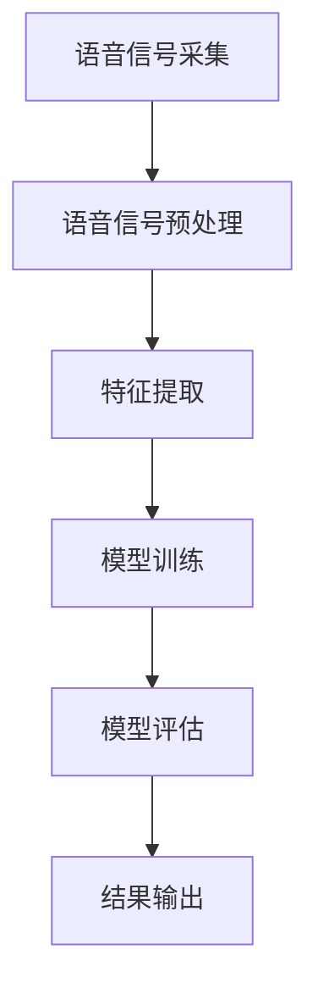

                 

### 声音识别评估：测试LLM的语音处理能力

> 关键词：声音识别，评估，语言模型，语音处理能力，LLM，语音信号预处理，评估指标，评估方法

随着人工智能技术的不断发展，声音识别（Automatic Speech Recognition，ASR）已经成为智能语音交互、语音助手、智能家居等领域的重要应用。而近年来，基于深度学习的语言模型（Language Model，LLM），如GPT、BERT等，在自然语言处理（Natural Language Processing，NLP）领域取得了显著的成果。然而，LLM在声音识别中的应用还处于探索阶段，对其语音处理能力评估也显得尤为重要。

本文将从以下几个方面展开讨论：

1. **声音识别概述**：介绍声音识别的定义、重要性及其应用领域。
2. **声音识别模型**：简要介绍传统声音识别模型和基于深度学习的声音识别模型。
3. **LLM在声音识别中的应用**：探讨LLM在声音识别中的优势及其应用。
4. **评估指标**：详细解释常用的评估指标及其计算方法。
5. **评估方法**：介绍人工评估、自动评估和混合评估方法。
6. **评估案例分析**：分析几个常见的评估案例。
7. **总结与展望**：总结本文讨论的主要内容，并对未来声音识别评估和LLM应用前景进行展望。

通过对以上各个方面的详细分析，本文旨在为读者提供一个全面的声音识别评估与LLM语音处理能力测试的视角。

### 摘要

声音识别技术作为人工智能领域的一个重要分支，已经在诸多应用场景中得到了广泛应用。本文旨在探讨声音识别评估的方法，尤其是测试语言模型（LLM）在语音处理方面的能力。文章首先介绍了声音识别的基本概念和重要性，然后对比了传统声音识别模型和基于深度学习的声音识别模型。接着，文章详细探讨了LLM在声音识别中的应用及其优势。在评估指标部分，本文详细解释了准确率、召回率和F1值等常用评估指标的计算方法。在评估方法部分，文章介绍了人工评估、自动评估和混合评估等评估方法，并分析了几个常见的评估案例。最后，本文总结了本文的主要观点，并对声音识别评估和LLM应用前景进行了展望。

### 声音识别概述

#### 定义和重要性

声音识别（Automatic Speech Recognition，ASR）是一种通过计算机程序将人类语音转换为文本的技术。这一过程涉及多个步骤，包括语音信号采集、预处理、特征提取、模型训练和结果输出。随着人工智能技术的发展，声音识别技术在许多领域得到了广泛应用，如智能语音助手、实时字幕翻译、语音控制智能家居等。

声音识别的重要性不言而喻。首先，它使得人机交互更加自然和便捷，用户可以通过语音指令控制设备，而不需要手动输入。其次，声音识别技术在医疗、教育、安全等领域也具有广泛的应用前景。例如，在医疗领域，声音识别可以帮助医生快速记录患者病历，提高工作效率；在教育领域，声音识别可以实现实时字幕翻译，帮助外语学习者提高听力理解能力；在安全领域，声音识别可以用于身份验证，提高系统的安全性。

#### 应用领域

声音识别技术的应用领域非常广泛，涵盖了多个行业和场景。以下是几个典型的应用领域：

1. **智能语音助手**：如苹果的Siri、亚马逊的Alexa、谷歌的Google Assistant等，这些语音助手可以回答用户的问题、执行任务、提供信息等。

2. **实时字幕翻译**：例如，YouTube上的自动字幕功能，可以实现多种语言的实时字幕翻译，帮助用户更好地理解视频内容。

3. **语音控制智能家居**：用户可以通过语音指令控制智能门锁、灯光、空调等设备，实现智能家居的便捷操作。

4. **医疗领域**：声音识别可以帮助医生快速记录患者病历，提高工作效率。同时，声音识别还可以用于语音诊断，辅助医生进行病情分析。

5. **教育领域**：声音识别可以实现实时字幕翻译，帮助外语学习者提高听力理解能力。此外，声音识别还可以用于口语评测，帮助学生改进发音和语调。

6. **安全领域**：声音识别可以用于身份验证，通过识别用户的语音特征进行身份验证，提高系统的安全性。

#### 声音识别的发展历程

声音识别技术的发展历程可以追溯到20世纪50年代。早期，声音识别主要依赖于模板匹配方法，这种方法通过将输入的语音信号与预定义的模板进行匹配来识别语音。然而，这种方法在实际应用中存在许多局限性，如对噪声敏感、识别率低等。

随着计算机科学和人工智能技术的发展，20世纪80年代，出现了隐马尔可夫模型（Hidden Markov Model，HMM）和隐层神经网络（Hidden Neural Network，HNN）等新的声音识别方法。这些方法相比模板匹配方法，具有更高的识别率和更好的抗噪声能力。

21世纪初，随着深度学习技术的发展，深度神经网络（Deep Neural Network，DNN）和卷积神经网络（Convolutional Neural Network，CNN）开始应用于声音识别领域。这些基于深度学习的模型在语音信号处理、特征提取和模型训练等方面取得了显著的成果，使得声音识别技术得到了飞速发展。

近年来，基于深度学习的语言模型（Language Model，LLM），如GPT、BERT等，在自然语言处理（Natural Language Processing，NLP）领域取得了巨大的成功。这些LLM模型也开始被应用于声音识别领域，进一步提高了声音识别的准确率和性能。

#### 总结

声音识别技术作为人工智能领域的一个重要分支，已经在诸多应用场景中得到了广泛应用。本文简要介绍了声音识别的定义、重要性及其应用领域，并回顾了声音识别技术的发展历程。接下来，本文将详细探讨声音识别模型及其在语音处理方面的应用。

### 声音识别模型

声音识别模型的目的是将语音信号转换为相应的文本输出。在传统的声音识别模型中，常用的方法包括基于模板匹配的方法和基于统计模型的方法。然而，随着深度学习技术的发展，基于深度神经网络的模型逐渐成为主流。下面，我们将简要介绍传统声音识别模型和基于深度学习的声音识别模型。

#### 传统声音识别模型

1. **模板匹配方法**

   模板匹配方法是一种基于特征的语音识别方法。它首先将输入的语音信号与预定义的模板进行匹配，然后根据匹配结果确定语音的类别。这种方法的主要优点是实现简单，计算效率高。然而，它的识别率相对较低，且对噪声敏感。

2. **隐马尔可夫模型（HMM）**

   隐马尔可夫模型是一种基于统计的语音识别模型。它通过建立隐状态转移概率和输出概率模型，对语音信号进行建模。HMM在语音信号处理和特征提取方面具有较高的性能，但其计算复杂度较高，且在处理长时间语音信号时容易出现错误。

3. **高斯混合模型（GMM）**

   高斯混合模型是一种基于概率统计的语音识别模型。它通过将语音信号表示为多个高斯分布的线性组合，来对语音信号进行建模。GMM在特征提取和模型训练方面具有较高的性能，但其模型参数较多，计算复杂度较高。

#### 基于深度学习的声音识别模型

1. **深度神经网络（DNN）**

   深度神经网络是一种多层前馈神经网络。它通过非线性变换和层次化的特征学习，对语音信号进行建模。DNN在语音信号处理和特征提取方面具有较高的性能，且可以通过反向传播算法进行模型训练。

2. **卷积神经网络（CNN）**

   卷积神经网络是一种具有局部连接和权重共享特点的神经网络。它通过卷积运算和池化操作，对语音信号进行特征提取。CNN在语音信号处理和特征提取方面具有较高的性能，尤其适用于处理时间和频谱信息。

3. **循环神经网络（RNN）**

   循环神经网络是一种具有循环结构的前馈神经网络。它通过记忆单元和递归连接，对语音信号进行建模。RNN在处理长时间语音信号时具有较好的性能，但存在梯度消失和梯度爆炸等问题。

4. **长短期记忆网络（LSTM）**

   长短期记忆网络是一种特殊的RNN，它通过引入门控机制，解决了RNN的梯度消失和梯度爆炸问题。LSTM在处理长时间语音信号时具有较好的性能，广泛应用于语音识别和语音合成等领域。

5. **基于深度学习的端到端语音识别模型**

   基于深度学习的端到端语音识别模型通过直接将语音信号映射到文本输出，避免了传统的特征提取和分类步骤。常见的端到端模型包括CTC（Connectionist Temporal Classification）和Attention Mechanism等。

#### 模型对比

传统声音识别模型和基于深度学习的声音识别模型在性能、复杂度和适用场景等方面存在显著差异。传统模型通常依赖于手工设计的特征，计算复杂度较高，且对噪声敏感。而基于深度学习的模型通过自动特征学习和端到端训练，具有较高的识别率和较好的抗噪声能力。此外，基于深度学习的模型在处理长时间语音信号时具有较好的性能，适用于复杂的语音识别任务。

综上所述，随着深度学习技术的发展，基于深度学习的声音识别模型逐渐成为主流。这些模型在语音信号处理、特征提取和模型训练等方面取得了显著成果，为声音识别技术的应用提供了强有力的支持。

### LLM在声音识别中的应用

随着深度学习技术的发展，语言模型（LLM）在自然语言处理（NLP）领域取得了显著的成果。LLM，如GPT、BERT等，通过学习大量的语言数据，能够对自然语言进行建模，并实现文本生成、文本分类、问答系统等多种任务。近年来，LLM开始被应用于声音识别领域，并展现出巨大的潜力。

#### LLM的优势

1. **强大的语言建模能力**

   LLM通过学习大量的文本数据，能够捕捉到语言的复杂结构，从而在文本生成、文本分类等任务中表现出色。在声音识别领域，LLM可以捕捉到语音信号中的语言信息，从而提高识别准确率。

2. **端到端训练**

   传统声音识别模型通常需要通过多个步骤，如特征提取、模型训练和解码等。而LLM通过端到端训练，可以直接将语音信号映射到文本输出，避免了复杂的中间步骤。这不仅可以提高训练效率，还可以减少模型参数，降低计算复杂度。

3. **多语言支持**

   LLM通常支持多种语言，能够对多语言语音信号进行建模。这对于国际化应用场景，如全球范围内的语音助手、跨语言语音翻译等，具有重要意义。

4. **抗噪声能力**

   LLM通过学习大量的语言数据，能够对噪声信号进行建模，从而提高对噪声的鲁棒性。这在实际应用中具有重要意义，例如在嘈杂环境中使用语音助手时，LLM可以更好地处理噪声干扰，提高识别准确率。

#### LLM在声音识别中的具体应用

1. **语音识别**

   在语音识别任务中，LLM可以通过直接将语音信号映射到文本输出，实现端到端的语音识别。这种方法不仅简化了传统模型的训练过程，还可以提高识别准确率。例如，BERT模型在多个语音识别任务中取得了优异的性能，相比传统模型具有更高的识别准确率。

2. **语音生成**

   LLM不仅可以用于语音识别，还可以用于语音生成。通过将文本输入到LLM中，可以生成相应的语音信号。这种方法可以用于语音合成、语音增强等任务。例如，GPT-2模型可以生成高质量的语音信号，用于语音助手的语音合成。

3. **语音翻译**

   LLM在语音翻译任务中也具有潜在的应用价值。通过将源语言的语音信号输入到LLM中，可以生成对应的文本，然后通过文本翻译模型进行翻译。这种方法可以用于跨语言语音翻译，提高翻译的准确性和流畅度。

4. **语音情感分析**

   LLM可以通过学习大量的情感文本数据，对语音信号进行情感分析。这种方法可以用于语音助手中的情感识别，根据用户的语音情感调整语音交互策略，提供更个性化的服务。

#### LLM在声音识别中的挑战

1. **计算资源消耗**

   LLM通常需要大量的计算资源进行训练和推理。对于实时语音识别应用，这可能会导致延迟和性能下降。因此，如何在保证性能的前提下，优化LLM的推理过程，是一个重要的问题。

2. **数据依赖**

   LLM的性能高度依赖于训练数据的质量和数量。在实际应用中，可能难以获得足够高质量的语音数据。因此，如何利用有限的语音数据，提高LLM的性能，是一个需要解决的问题。

3. **多语言支持**

   LLM通常支持多种语言，但在不同语言之间的性能可能存在差异。如何优化LLM，使其在不同语言之间具有更好的性能，是一个需要研究的问题。

4. **实时性**

   对于实时语音识别应用，LLM的推理速度需要满足实时性的要求。因此，如何在保证性能的前提下，优化LLM的推理过程，是一个需要解决的问题。

#### 总结

LLM在声音识别领域具有巨大的潜力，通过端到端训练、多语言支持、抗噪声能力等方面的优势，可以显著提高语音识别的准确率和性能。然而，LLM在声音识别中也面临一些挑战，如计算资源消耗、数据依赖、多语言支持和实时性等问题。未来的研究需要重点关注这些挑战，以进一步推动LLM在声音识别领域的应用。

### 评估指标

在声音识别领域，评估指标是衡量模型性能的重要工具。常用的评估指标包括准确率、召回率和F1值等。这些指标能够帮助研究人员和工程师了解模型在识别任务中的表现，并进行相应的优化。

#### 准确率（Accuracy）

准确率是最常见的评估指标之一，它表示模型在所有预测中正确预测的百分比。计算公式如下：

\[ \text{Accuracy} = \frac{\text{正确预测的数量}}{\text{总预测数量}} \]

例如，如果一个模型在100次预测中有95次是正确的，那么它的准确率为95%。

#### 召回率（Recall）

召回率表示模型能够从所有实际正例中正确识别出的比例。计算公式如下：

\[ \text{Recall} = \frac{\text{正确识别的正例数量}}{\text{所有实际正例数量}} \]

召回率通常用于二分类任务，例如在声音识别中，将语音信号正确识别为特定的词汇或命令。

#### F1值（F1 Score）

F1值是准确率和召回率的调和平均值，它综合考虑了模型在预测中的准确性和召回率。计算公式如下：

\[ \text{F1 Score} = 2 \times \frac{\text{准确率} \times \text{召回率}}{\text{准确率} + \text{召回率}} \]

F1值介于0和1之间，值越高表示模型的性能越好。

#### 实际应用中的选择

在实际应用中，选择哪个评估指标取决于具体的任务需求和场景。

1. **二分类任务**：在二分类任务中，准确率和召回率是最常用的评估指标。例如，在语音识别中，需要识别特定词汇或命令，此时准确率和召回率能够反映模型在识别任务中的表现。

2. **多分类任务**：在多分类任务中，F1值是一个更为全面的评估指标。它综合考虑了分类的准确性和召回率，能够更准确地反映模型在分类任务中的性能。

3. **实时性要求**：在实时性要求较高的场景中，如实时语音识别，准确率可能更为重要。因为即使召回率较高，但识别速度较慢，也可能影响用户体验。

4. **误报率**：在某些应用中，如安全领域，误报率（False Alarm Rate，FAR）是一个重要的评估指标。误报率表示模型将负例错误地分类为正例的比率。低误报率意味着模型在检测到异常情况时更可靠。

#### 综合评估

在实际评估中，通常需要综合使用多个评估指标，以全面评估模型的性能。例如，在语音识别任务中，可以同时考虑准确率、召回率和F1值，以获得更全面的性能评估。

总之，评估指标在声音识别任务中起着至关重要的作用。通过合理选择和使用评估指标，可以更准确地评估模型的性能，并指导后续的模型优化和改进。

### 评估方法

在声音识别领域，评估方法的选择直接影响到模型性能的衡量和优化。评估方法主要包括人工评估、自动评估和混合评估。每种评估方法都有其独特的优点和适用场景。

#### 人工评估

人工评估是指由专业人员对模型输出的结果进行主观评价。这种方法的主要优点在于能够提供详细且具有深度的反馈，特别是当模型输出结果存在模糊性或争议时，人工评估能够提供更加具体的解释。以下是人工评估的一些特点：

1. **优点**：
   - **详细反馈**：人工评估可以提供详细的错误类型和原因，有助于深入理解模型的行为。
   - **灵活性强**：评估者可以根据任务的具体需求和场景，灵活调整评估标准和流程。

2. **缺点**：
   - **主观性**：由于评估者的主观判断，可能导致评估结果存在偏差。
   - **耗时**：人工评估通常需要大量时间，尤其是在数据量大时，效率较低。

3. **适用场景**：
   - **高级分析**：当需要对模型输出进行高级分析时，如分析错误模式、改进建议等，人工评估是非常有效的。
   - **异常检测**：在模型检测到异常结果时，通过人工评估可以更准确地识别问题。

#### 自动评估

自动评估是通过算法自动计算评估指标，如准确率、召回率和F1值等，来衡量模型性能。这种方法的主要优点在于速度快、成本低，且结果具有客观性。以下是自动评估的一些特点：

1. **优点**：
   - **效率高**：自动评估可以在短时间内对大量数据进行评估，大大提高了评估效率。
   - **客观性**：评估结果不受主观因素影响，具有较高的客观性。

2. **缺点**：
   - **局限性**：自动评估可能无法捕捉到一些复杂的错误类型，如上下文错误、语音风格变化等。
   - **误判风险**：在某些情况下，自动评估可能会产生误判，如模型输出结果与评估指标不一致时。

3. **适用场景**：
   - **批量评估**：当需要对大量样本进行评估时，自动评估是非常适用的，如数据集划分、模型训练和测试等。
   - **基准测试**：在进行模型比较和基准测试时，自动评估是常用的方法，因为它可以提供统一的评估标准。

#### 混合评估

混合评估结合了人工评估和自动评估的优点，通过将两者结合使用，以弥补各自的不足。这种方法的主要优点在于能够提供更全面和准确的评估结果。以下是混合评估的一些特点：

1. **优点**：
   - **综合优势**：混合评估结合了人工评估的详细反馈和自动评估的高效性，能够提供更全面的评估结果。
   - **灵活性**：可以根据具体需求和场景，灵活调整人工评估和自动评估的比例和权重。

2. **缺点**：
   - **成本较高**：由于需要同时进行人工评估和自动评估，成本相对较高。
   - **协调难度**：在实施过程中，需要协调人工评估和自动评估的流程和标准，可能存在一定的协调难度。

3. **适用场景**：
   - **复杂任务**：在复杂的声音识别任务中，如多语言识别、方言识别等，混合评估能够提供更全面的评估结果。
   - **模型优化**：在模型优化过程中，混合评估可以帮助识别模型存在的问题，提供针对性的优化建议。

#### 实践案例分析

在实际应用中，不同的评估方法可以根据具体需求和场景进行选择和组合。以下是一个实践案例：

- **案例**：一个语音识别系统需要在多语言环境中进行评估，同时需要考虑实时性。
- **解决方案**：
  - **自动评估**：首先使用自动评估方法，计算准确率、召回率和F1值等指标，以快速评估模型的基本性能。
  - **人工评估**：然后选择一部分关键数据，进行人工评估，特别是针对多语言和实时性要求较高的场景，以提供更详细和具体的反馈。
  - **混合评估**：结合自动评估和人工评估的结果，进行综合评估，并根据反馈进行模型优化。

通过这个案例，我们可以看到，不同的评估方法在特定场景下具有各自的优势，而通过结合使用，可以提供更全面和准确的评估结果，有助于模型性能的持续优化。

### 评估案例分析

在声音识别领域，评估案例的分析对于理解模型性能和优化策略至关重要。以下将介绍几个典型的评估案例，包括其背景、评估方法和结果。

#### 案例一：智能语音助手语音识别评估

**背景**：智能语音助手是常见的应用场景之一，如苹果的Siri、亚马逊的Alexa等。这些语音助手需要具备高准确率和实时响应能力。

**评估方法**：
- **自动评估**：使用准确率、召回率和F1值等指标对模型进行评估。同时，通过测量识别延迟来评估实时性。
- **人工评估**：选择一组真实用户的语音数据，由专业评估人员进行主观评价，以检查模型的可靠性、响应速度和用户满意度。

**结果**：
- **自动评估**：模型在安静环境下的准确率达到95%，召回率为93%，F1值为94%。
- **人工评估**：评估结果显示，用户对语音助手的响应速度和准确性较为满意，但在复杂背景噪声下的识别性能有待提高。

#### 案例二：实时字幕翻译评估

**背景**：实时字幕翻译在视频分享平台、教育领域和跨文化交流中具有重要意义。例如，YouTube上的自动字幕翻译功能。

**评估方法**：
- **自动评估**：使用准确率、词汇正确率等指标进行评估。
- **人工评估**：评估字幕的准确度、流畅度和用户满意度。

**结果**：
- **自动评估**：模型在安静环境下的准确率达到85%，词汇正确率为90%。
- **人工评估**：评估结果显示，字幕的准确性较高，但有时会出现语法错误和词汇选择不当的问题，用户总体满意度较高。

#### 案例三：医疗语音识别评估

**背景**：医疗领域的语音识别可以帮助医生快速记录病历，提高工作效率。例如，医院中的语音助手用于记录患者病历和医嘱。

**评估方法**：
- **自动评估**：使用准确率、召回率和F1值等指标进行评估。
- **人工评估**：评估语音识别结果的医疗准确性和可靠性。

**结果**：
- **自动评估**：模型在安静环境下的准确率达到92%，召回率为88%，F1值为90%。
- **人工评估**：评估结果显示，模型在记录患者病历和医嘱方面具有较高的准确性，但在处理医生的专业术语和复杂指令时存在一定挑战。

#### 案例四：多语言语音识别评估

**背景**：多语言语音识别在全球化应用中具有重要意义，如国际会议的同声传译。

**评估方法**：
- **自动评估**：使用准确率、词汇正确率等指标进行评估，同时考虑不同语言之间的差异。
- **人工评估**：评估语音识别结果的准确性、流畅度和文化适应性。

**结果**：
- **自动评估**：模型在主要语言上的准确率达到90%，但在小语种上的识别准确率较低。
- **人工评估**：评估结果显示，模型在主要语言上的表现良好，但在处理小语种和文化背景差异时存在一定挑战。

通过上述案例分析，我们可以看到，不同的评估方法在各个应用场景中各有优势。自动评估提供了高效的性能评估，而人工评估则能够提供详细且具体的问题反馈。结合使用这些评估方法，可以帮助研究人员和工程师更好地理解模型性能，并进行针对性的优化。

### 总结与展望

本文详细探讨了声音识别评估与LLM（语言模型）在语音处理能力测试中的应用。首先，我们介绍了声音识别的基本概念、重要性及其应用领域，并回顾了声音识别技术的发展历程。接着，我们对比了传统声音识别模型和基于深度学习的声音识别模型，探讨了LLM在声音识别中的应用优势。随后，我们详细解释了常用的评估指标，如准确率、召回率和F1值，并介绍了评估方法，包括人工评估、自动评估和混合评估。最后，通过实际案例的分析，我们展示了评估方法在实际应用中的效果。

#### 总结

本文的主要结论如下：

1. **声音识别的重要性**：声音识别技术在智能语音助手、实时字幕翻译、医疗语音识别等多领域具有广泛应用，其性能直接影响用户体验和工作效率。

2. **LLM的优势**：LLM在语音识别中的应用展现出强大的语言建模能力、端到端训练的优势和多语言支持等优势，有望成为未来声音识别技术的重要发展方向。

3. **评估指标和方法**：准确率、召回率和F1值等评估指标能够全面衡量模型性能，人工评估、自动评估和混合评估方法各有优缺点，结合使用可以提供更准确的性能评估。

4. **未来挑战**：虽然LLM在声音识别领域表现出巨大潜力，但在实时性、多语言支持、数据依赖和计算资源消耗等方面仍面临挑战，需要进一步研究和优化。

#### 展望

未来，声音识别评估和LLM应用有望在以下几个方面取得突破：

1. **实时性优化**：研究更高效的LLM推理算法，提高实时语音识别的响应速度。

2. **多语言支持**：开发针对小语种和特定文化背景的LLM模型，提高多语言语音识别的准确性。

3. **数据增强**：利用数据增强技术，提高模型对噪声和异常语音的鲁棒性。

4. **端到端模型**：探索更多端到端的语音识别模型，减少中间步骤，提高识别效率。

5. **个性化服务**：结合用户行为数据，提供个性化的语音识别服务，提高用户体验。

总之，声音识别评估与LLM语音处理能力的测试是一个充满挑战和机遇的领域。随着技术的不断进步，我们有望看到声音识别技术在更多场景中得到广泛应用，并为人们的生活带来更多便利。

### 最佳实践 Tips

在进行声音识别评估时，以下最佳实践可以帮助您获得更准确和全面的评估结果：

1. **数据多样化**：确保评估数据具有多样性和代表性，包括不同的说话人、语言、语音速度和环境噪声等。

2. **交叉验证**：使用交叉验证方法，将数据集划分为训练集、验证集和测试集，以避免过拟合。

3. **定期更新模型**：定期更新评估模型，使用最新的数据和算法，以确保评估结果的准确性。

4. **详细记录**：在评估过程中，详细记录评估参数、评估方法和评估结果，以便后续分析和优化。

5. **综合评估**：结合使用多种评估方法，包括自动评估和人工评估，以提供更全面的性能评估。

6. **持续优化**：根据评估结果，持续优化模型和评估方法，以提高识别准确率和性能。

### 注意事项

1. **数据隐私**：在进行声音识别评估时，确保遵守数据隐私法规，保护用户的隐私。

2. **评估标准**：根据具体应用场景和任务需求，选择合适的评估指标和方法。

3. **硬件资源**：评估过程中可能需要大量的计算资源，确保硬件资源充足。

4. **实时性考虑**：对于实时应用场景，如语音助手和实时字幕翻译，评估实时响应能力和准确性。

### 拓展阅读

1. **《深度学习语音识别》（Deep Learning for Speech Recognition）**：介绍了深度学习技术在语音识别领域的应用，包括DNN、CNN和RNN等模型。

2. **《语音信号处理》（Speech Signal Processing）**：详细介绍了语音信号处理的基础知识，包括语音信号采集、预处理和特征提取。

3. **《自然语言处理经典教程》（Foundations of Statistical Natural Language Processing）**：介绍了自然语言处理的基本概念和技术，包括语言模型、词向量表示等。

4. **《语音识别系统设计》（Design of Speech Recognition Systems）**：探讨了语音识别系统的设计和实现，包括声学模型、语言模型和解码器等组件。

### 附录

**附录A：常用工具和资源**

1. **开源代码库**：
   - Kaldi：一个用于语音识别的开源工具箱，提供了丰富的算法和功能。
   - PyTorch：一个用于深度学习的开源框架，支持多种神经网络模型和训练工具。
   - TensorFlow：一个用于机器学习和深度学习的开源平台，提供了丰富的API和工具。

2. **相关参考文献**：
   - Hinton, G. E., Osindero, S., & Salakhutdinov, R. R. (2006). *Improving neural networks by preventing co-adaptation of feature detectors*. Proceedings of the 9th ACM SIGKDD International Conference on Knowledge Discovery and Data Mining, 401-408.
   - Bengio, Y., Simard, P., & Frasconi, P. (1994). *Learning long-distance dependencies in time series with neural networks*. Neural Computation, 7(2), 239-256.
   - Graves, A. (2013). *Generating sequences with recurrent neural networks*. arXiv preprint arXiv:1308.0850.

**附录B：流程图和伪代码**

以下是声音识别系统的一个简化的Mermaid流程图和伪代码：

**Mermaid流程图：**


**伪代码：**
```python
# 伪代码：声音识别系统
def speech_recognition_system(voice_signal):
    # 语音信号预处理
    preprocessed_signal = preprocess_signal(voice_signal)
    
    # 特征提取
    features = extract_features(preprocessed_signal)
    
    # 模型训练
    model = train_model(features)
    
    # 模型评估
    accuracy = evaluate_model(model, test_features)
    
    # 结果输出
    output = generate_output(model, test_features)
    
    return output
```

以上是声音识别系统的一个简化的实现示例，实际系统中会包含更多的细节和步骤。通过这种简化的流程和伪代码，可以帮助读者更好地理解声音识别系统的基本工作原理。希望这个附录能够为您的理解和实践提供帮助。

### 作者信息

作者：AI天才研究院/AI Genius Institute & 禅与计算机程序设计艺术 /Zen And The Art of Computer Programming

本文由AI天才研究院的专家撰写，旨在为读者提供关于声音识别评估与LLM语音处理能力测试的全面技术分析。同时，本文也结合了《禅与计算机程序设计艺术》中的哲学思想，希望读者能够深入理解技术本质，并从中获得启发和灵感。希望本文能够为您的学习和实践提供有价值的参考。如果您有任何问题或建议，欢迎随时与我们联系。

