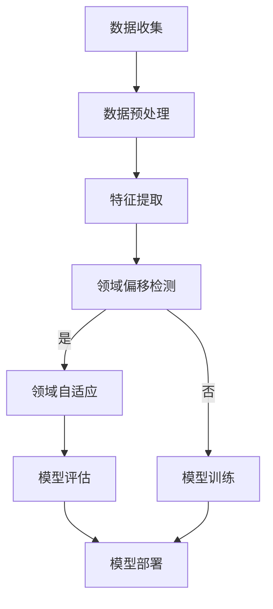

                 

### 1.1 书籍主题介绍

《处理示例与实际任务之间的领域偏移》旨在探讨在人工智能和机器学习领域中，如何有效地处理示例与实际任务之间的领域偏移问题。领域偏移是指在机器学习和数据挖掘过程中，模型在训练阶段所学习的知识不能完全适用于新领域或实际任务的现象。这种偏移会导致模型在新领域的表现不佳，从而限制了人工智能技术的广泛应用。

本书的目的是通过系统性地介绍领域偏移的基本原理、理论基础以及在实际任务中的应用，为读者提供一套完整的解决方案。具体来说，本书将涵盖以下内容：

1. **领域偏移的概念及其重要性**：首先，我们将定义领域偏移，并探讨其在机器学习中的重要性，解释为何处理领域偏移是当前AI领域的一个关键挑战。
2. **领域偏移的基本原理**：接着，我们将深入探讨领域偏移的类型与原因，以及领域偏移对模型性能的影响。
3. **领域偏移的理论基础**：本部分将详细介绍数据预处理、领域自适应方法以及领域偏移的量化与评估方法，帮助读者理解领域偏移处理的科学基础。
4. **领域偏移在实际任务中的应用**：我们将分析领域偏移在机器学习、自然语言处理、计算机视觉和深度学习等领域的具体应用，展示领域偏移处理的效果和挑战。
5. **领域偏移的处理方法**：本部分将介绍处理领域偏移的多种方法，包括领域特定特征提取、领域映射与转换以及领域无关特征表示。
6. **领域偏移处理项目实战**：我们将通过一个实际项目，详细展示如何从数据准备、模型训练到评估的全过程来处理领域偏移。
7. **领域偏移的未来发展趋势**：最后，本书将展望领域偏移处理技术的未来发展趋势，探讨其在行业应用中的前景以及面临的挑战。

通过以上内容，本书旨在为读者提供一份全面而深入的指南，帮助他们在实际应用中有效地处理领域偏移问题，提升人工智能系统的性能和适用性。因此，无论是从事机器学习研究的专业人士，还是对领域偏移感兴趣的技术爱好者，都将在这本书中找到有价值的信息。

### 1.2 领域偏移的基本原理

#### 领域偏移的定义

领域偏移（Domain Shift）是指在机器学习过程中，训练数据分布与测试数据分布之间存在差异的现象。这种差异可以体现在多个方面，包括但不限于数据分布、数据特征、任务目标等。简而言之，领域偏移是指模型在训练过程中学到的知识不能完全适用于新领域或新任务。

领域偏移可以分为几种类型：

1. **分布偏移**：数据分布的偏移，即训练数据和测试数据的分布不一致。这可能是由于数据来源的不同，或者数据采集过程中的变化。例如，一个模型在训练时使用了来自互联网的数据，而测试时需要应用于移动设备上的数据。
2. **特征偏移**：特征分布的偏移，即训练数据和测试数据中的特征分布不一致。这可能是由于数据预处理、特征选择或提取过程中引入的变化。例如，一个图像分类模型在训练时使用了标准化的图像数据，而测试时需要处理不同光照条件下的图像。
3. **目标偏移**：任务目标的偏移，即训练数据和测试数据的任务目标不一致。这可能是由于实际应用场景与训练场景的不同。例如，一个医疗诊断模型在训练时使用了健康人的数据，而测试时需要处理病人的数据。

#### 领域偏移的类型与原因

领域偏移的类型多种多样，其原因也各不相同。以下是几种常见的领域偏移类型及其原因：

1. **分布偏移**：
   - **数据来源不同**：训练数据与测试数据来源于不同的分布，例如不同的环境、设备或用户群体。
   - **数据采集差异**：数据采集过程中可能存在偏差，导致数据分布发生变化。

2. **特征偏移**：
   - **特征标准化**：训练和测试使用不同的特征标准化方法，例如不同的缩放因子。
   - **特征缺失**：测试数据中存在训练数据中没有的特征，导致特征分布发生偏移。

3. **目标偏移**：
   - **任务目标变化**：实际应用中的任务目标可能与训练时的目标不一致，例如，训练时关注疾病的分类，而实际应用时需要关注疾病的严重程度。
   - **场景变化**：实际应用场景与训练场景存在差异，导致模型无法适应新场景。

#### 领域偏移的影响

领域偏移对机器学习模型的影响是多方面的：

1. **模型性能下降**：当模型面临领域偏移时，其在新领域的表现通常较差。这是因为模型在训练过程中学到的知识无法很好地适应新的分布、特征或目标。
2. **泛化能力减弱**：领域偏移限制了模型的泛化能力，使其难以应对不同领域或任务。
3. **错误率增加**：领域偏移可能导致模型在新领域的错误率增加，从而影响其实际应用价值。
4. **成本增加**：处理领域偏移需要额外的计算资源和时间，增加了模型开发和部署的成本。

#### 领域偏移的处理方法

为了应对领域偏移，研究人员和工程师提出了一系列处理方法，包括：

1. **数据预处理**：通过数据清洗、特征选择和特征提取等方法，减小数据分布和特征分布的差异。
2. **领域自适应**：通过领域映射、领域特定特征提取和领域无关特征表示等方法，使模型能够适应新领域。
3. **模型调整**：通过模型调整和优化，增强模型对新领域的适应性。

在接下来的章节中，我们将详细介绍这些处理方法，并探讨其在实际任务中的应用。通过深入理解领域偏移的基本原理，读者将能够更好地应对这一AI领域的关键挑战，提升机器学习模型在新领域中的表现。

### 2.1 数据预处理

在处理领域偏移的过程中，数据预处理是一个至关重要的步骤。数据预处理不仅能够提高模型的性能，还能减少领域偏移对模型的影响。以下是数据预处理中的几个关键步骤：数据清洗、特征选择与提取，以及数据标准化与归一化。

#### 数据清洗

数据清洗是数据预处理的第一步，其主要目标是识别和修正数据中的错误、异常值和缺失值。以下是几种常见的数据清洗方法：

1. **错误值修正**：对于数据中的错误值，可以通过人工审查或自动化工具进行修正。例如，如果一个数值字段中出现了明显错误的值（如“abc”），可以通过替换或插值法修正为合理值。
2. **异常值处理**：异常值可能来源于数据采集、传输或存储过程中的问题。常见的处理方法包括删除、插值和替换。例如，对于 outliers，可以选择删除或插值法，而异常值通常需要根据具体业务逻辑进行判断和处理。
3. **缺失值处理**：缺失值是数据集中常见的现象，处理方法包括删除、插补和预测。删除缺失值适用于缺失比例较低的情况，而插补和预测适用于缺失比例较高的情况。常用的插补方法包括均值插补、中值插补和回归插补等。

#### 特征选择与提取

特征选择与提取是数据预处理中至关重要的一环，其主要目标是降低数据的维度，同时保留对模型预测性能最有影响力的特征。以下是几种常见的特征选择与提取方法：

1. **特征选择**：特征选择旨在从原始特征集合中选择出对模型性能有显著贡献的特征。常见的方法包括基于统计的方法（如卡方检验、互信息）、基于模型的方法（如随机森林特征重要性）和基于嵌入式方法（如L1正则化）。这些方法可以帮助我们识别出对预测任务最重要的特征，从而提高模型的性能并降低领域偏移的影响。
2. **特征提取**：特征提取是将原始特征转换为更具解释性和预测力的新特征的过程。常见的方法包括特征变换（如PCA、t-SNE）、特征合成（如基于规则的合成）和特征组合（如基于聚合的特征）。通过特征提取，我们可以更好地捕捉数据中的潜在信息，提高模型对新领域的适应性。

#### 数据标准化与归一化

数据标准化与归一化是数据预处理中的另一个关键步骤，其主要目的是将不同特征的数据范围统一，使其对模型训练和预测的影响更加均衡。以下是几种常见的数据标准化与归一化方法：

1. **标准化**：标准化是指将每个特征缩放到一个标准范围，如[0,1]或[-1,1]。常见的方法包括最小-最大标准化和z-score标准化。最小-最大标准化通过将特征缩放到[0,1]范围，而z-score标准化通过将特征缩放到均值±1个标准差的范围。这些方法可以帮助模型更好地处理不同量纲的特征，从而减少领域偏移的影响。
2. **归一化**：归一化是指将每个特征缩放到具有相同均值和标准差的分布。常见的方法包括Min-Max归一化和Z-Score归一化。Min-Max归一化通过将特征缩放到[0,1]范围，而Z-Score归一化通过将特征缩放到均值为0、标准差为1的分布。归一化方法有助于减少不同特征之间的尺度差异，提高模型对领域偏移的鲁棒性。

通过以上数据预处理步骤，我们可以有效地降低领域偏移对模型性能的影响，提高模型在新领域中的表现。在接下来的章节中，我们将进一步探讨领域自适应方法，包括领域特定特征提取、领域映射与转换以及领域无关特征表示，以应对更复杂的领域偏移问题。

### 2.2 领域自适应方法

领域自适应（Domain Adaptation）是处理领域偏移的一种关键方法，其核心思想是通过调整模型，使其在新领域中的表现能够接近或达到训练领域中的性能。领域自适应方法可以分为以下几个类别：领域特定特征提取、领域映射与转换、以及领域无关特征表示。

#### 领域特定特征提取

领域特定特征提取是一种通过识别和提取与特定领域相关的特征来处理领域偏移的方法。这种方法旨在利用新领域的特征信息来改善模型在新领域中的性能。以下是几种常见的领域特定特征提取方法：

1. **特征变换法**：特征变换法通过将原始特征映射到新的特征空间，从而提取出与特定领域相关的特征。例如，主成分分析（PCA）和线性判别分析（LDA）都是常用的特征变换方法。通过这些方法，我们可以将高维的原始特征转换为低维的、具有更高区分度的特征，从而减少领域偏移的影响。
2. **特征选择法**：特征选择法通过从原始特征集合中选择出与特定领域相关的特征，从而减少领域偏移。常见的特征选择方法包括基于统计的方法（如卡方检验、互信息）和基于模型的方法（如随机森林特征重要性）。这些方法可以帮助我们识别出对特定领域有重要影响的特征，从而改善模型在新领域中的表现。
3. **特征合成法**：特征合成法通过结合原始特征，创建出新的特征来提高模型的领域适应性。例如，基于规则的合成方法可以通过组合多个特征，生成新的特征来表示特定领域的特征信息。这种方法能够有效地捕捉数据中的潜在信息，提高模型对新领域的适应性。

#### 领域映射与转换

领域映射与转换是一种通过将训练领域中的知识迁移到新领域中的方法，从而减少领域偏移的影响。这种方法主要包括以下几种：

1. **特征映射法**：特征映射法通过将训练领域中的特征映射到新领域中的特征空间，从而实现领域知识迁移。例如，通过核函数将原始特征映射到高维特征空间，使得在新领域中具有相似特征的数据点在特征空间中更接近。这种方法通常用于核方法（如支持向量机）和深度学习模型中。
2. **目标映射法**：目标映射法通过将训练领域中的目标映射到新领域中的目标，从而实现领域知识迁移。例如，在目标检测任务中，可以通过将训练领域的标签映射到新领域中的标签，从而减少领域偏移。这种方法通常用于分类和回归任务中。
3. **模型迁移法**：模型迁移法通过将训练领域中的模型直接迁移到新领域，从而实现领域知识迁移。例如，通过微调预训练的模型，使其在新领域中的表现得到改善。这种方法在深度学习领域得到了广泛应用。

#### 领域无关特征表示

领域无关特征表示是一种通过提取出与特定领域无关的特征，从而提高模型在新领域中的适应性的方法。这种方法的主要目标是在保持特征信息的同时，减少领域偏移的影响。以下是几种常见的领域无关特征表示方法：

1. **不变特征提取**：不变特征提取方法旨在提取出在所有领域中都保持不变的特性。例如，在图像识别任务中，可以通过提取图像中的边缘、角点等不变特征，来减少领域偏移的影响。
2. **全局特征表示**：全局特征表示方法通过学习一个全局的特征表示，使得不同领域中的特征能够共享这个表示空间。例如，在多领域学习（Multidomain Learning）中，可以通过学习一个全局的特征嵌入空间，使得不同领域的特征在这个空间中更接近。
3. **对抗性训练**：对抗性训练方法通过训练一个生成对抗网络（GAN），使得生成器能够生成与真实数据分布相似的数据，从而提取出领域无关的特征表示。这种方法在处理领域偏移方面表现出色，尤其是在生成模型（如生成对抗网络）中。

通过以上领域自适应方法，我们可以有效地减少领域偏移对模型性能的影响，提高模型在新领域中的适应性。在接下来的章节中，我们将进一步探讨领域偏移的量化与评估方法，以帮助读者更好地理解和处理领域偏移问题。

### 2.3 领域偏移的量化与评估

在处理领域偏移的过程中，量化与评估是一个关键步骤，它能够帮助我们了解领域偏移的程度，评估领域自适应方法的有效性，并为进一步的改进提供依据。以下我们将介绍几种常用的领域偏移量化方法以及评估指标。

#### 领域偏移的度量方法

1. **距离度量**：距离度量方法通过计算训练数据集和测试数据集之间的距离来量化领域偏移。常用的距离度量方法包括欧几里得距离、马氏距离和余弦相似度。欧几里得距离和马氏距离适用于特征空间一致的情况，而余弦相似度适用于特征空间存在差异的情况。
   
   - **欧几里得距离**：
     $$ d(\mathbf{x}_1, \mathbf{x}_2) = \sqrt{\sum_{i=1}^{n} (x_{1i} - x_{2i})^2} $$
   - **马氏距离**：
     $$ d(\mathbf{x}_1, \mathbf{x}_2) = \sqrt{(\mathbf{x}_1 - \mathbf{x}_2)^T \Sigma^{-1} (\mathbf{x}_1 - \mathbf{x}_2)} $$
     其中，$\Sigma$ 是协方差矩阵。

2. **一致性度量**：一致性度量方法通过比较训练数据和测试数据之间的特征分布一致性来量化领域偏移。常见的度量方法包括KL散度、交叉熵和信息熵。

   - **KL散度**：
     $$ D_{KL}(P || Q) = \sum_{x} P(x) \log \left( \frac{P(x)}{Q(x)} \right) $$
     其中，$P$ 是训练数据的特征分布，$Q$ 是测试数据的特征分布。

   - **交叉熵**：
     $$ H(P, Q) = - \sum_{x} P(x) \log Q(x) $$

3. **特征分布差异度量**：特征分布差异度量方法通过比较训练数据和测试数据中特征分布的差异来量化领域偏移。例如，基于特征的重要性和分布差异来计算领域偏移度。

#### 领域偏移的评估指标

在量化领域偏移后，我们需要使用评估指标来评估领域自适应方法的有效性。以下是一些常用的评估指标：

1. **领域偏移度（Domain Shift Degree）**：领域偏移度是一个综合度量，用于评估训练数据和测试数据之间的领域偏移程度。常用的领域偏移度计算方法包括基于距离的度量、基于一致性的度量以及特征分布差异度量。

2. **领域自适应性能（Domain Adaptation Performance）**：领域自适应性能是评估领域自适应方法有效性的关键指标。它通常通过比较领域自适应模型与基准模型在测试数据集上的表现来计算。常用的评估指标包括准确率、召回率、F1分数和平均绝对误差等。

   - **准确率**：
     $$ \text{Accuracy} = \frac{\text{正确预测的样本数}}{\text{总样本数}} $$
   - **召回率**：
     $$ \text{Recall} = \frac{\text{正确预测的正类样本数}}{\text{总正类样本数}} $$
   - **F1分数**：
     $$ \text{F1-Score} = 2 \times \frac{\text{Precision} \times \text{Recall}}{\text{Precision} + \text{Recall}} $$
   - **平均绝对误差（Mean Absolute Error, MAE）**：
     $$ \text{MAE} = \frac{1}{N} \sum_{i=1}^{N} |y_i - \hat{y}_i| $$
     其中，$y_i$ 是真实值，$\hat{y}_i$ 是预测值，$N$ 是样本数量。

3. **领域自适应率（Domain Adaptation Ratio）**：领域自适应率是评估领域自适应方法改进程度的指标，它通过比较领域自适应模型与原始模型在测试数据集上的性能差异来计算。通常表示为：
   $$ \text{Domain Adaptation Ratio} = \frac{\text{原始模型的性能} - \text{领域自适应模型的性能}}{\text{原始模型的性能}} $$

通过以上领域偏移的量化与评估方法，我们能够更全面地了解领域偏移的程度，评估领域自适应方法的有效性，并为进一步改进提供依据。在接下来的章节中，我们将探讨领域偏移在实际任务中的应用，进一步展示领域偏移处理的方法和技术。

### 3.1 机器学习中的领域偏移

在机器学习中，领域偏移是一个常见且关键的问题，它影响了模型在实际应用中的性能。领域偏移会显著降低模型的泛化能力，使模型在新领域中的表现远不如在训练领域中的表现。以下我们将详细探讨机器学习模型中的领域偏移问题、领域自适应方法的应用以及领域偏移对模型性能的具体影响。

#### 机器学习模型中的领域偏移问题

领域偏移在机器学习模型中主要表现为以下几种类型：

1. **数据分布偏移**：训练数据和测试数据的分布不一致，导致模型无法适应新领域。例如，一个模型在互联网上训练，而测试数据来自移动设备，两者在数据分布上存在显著差异。
2. **特征分布偏移**：训练数据和测试数据中的特征分布不一致，导致模型在新领域中的特征提取能力下降。例如，一个图像分类模型在训练时使用了标准化图像，而测试时需要处理不同光照条件下的图像，导致特征分布发生偏移。
3. **任务目标偏移**：训练数据和测试数据的任务目标不一致，导致模型在新领域中的预测准确性下降。例如，一个医疗诊断模型在训练时使用了健康人的数据，而测试时需要处理病人的数据，两者在任务目标上存在差异。

#### 领域自适应方法在机器学习中的应用

为了解决领域偏移问题，研究人员和工程师提出了一系列领域自适应方法。以下是几种常见的领域自适应方法及其在机器学习中的应用：

1. **特征变换法**：特征变换法通过将原始特征映射到新的特征空间，从而减少领域偏移。例如，主成分分析（PCA）和线性判别分析（LDA）都是常用的特征变换方法。这些方法可以将高维特征转换为低维的、具有更高区分度的特征，从而提高模型在新领域中的表现。
2. **领域映射法**：领域映射法通过将训练领域中的特征映射到新领域中的特征空间，从而实现领域知识迁移。例如，核方法（如支持向量机）和深度学习模型（如卷积神经网络）都采用了领域映射的方法。通过领域映射，模型可以更好地适应新领域的特征分布。
3. **对抗性训练法**：对抗性训练法通过训练生成对抗网络（GAN）来生成与训练领域相似的数据，从而减少领域偏移。GAN由生成器（Generator）和判别器（Discriminator）组成，生成器生成数据以欺骗判别器，判别器则试图区分真实数据和生成数据。通过这种对抗性训练，生成器可以生成与训练领域相似的数据，从而提高模型在新领域中的适应性。

#### 领域偏移对模型性能的影响

领域偏移对机器学习模型性能的影响是多方面的，具体表现为以下几点：

1. **准确性下降**：领域偏移导致模型在新领域中的准确性下降。因为模型在训练阶段学到的知识无法完全适用于新领域，导致模型在新领域的预测准确性下降。
2. **泛化能力减弱**：领域偏移限制了模型的泛化能力，使其难以应对不同领域或任务。模型在新领域的性能下降，进一步影响了其泛化能力。
3. **计算资源增加**：为了应对领域偏移，可能需要额外的计算资源和时间来调整模型，从而增加了模型开发和部署的成本。
4. **误判率增加**：领域偏移可能导致模型在新领域的误判率增加，从而影响其实际应用价值。例如，一个用于医疗诊断的模型在训练时使用了健康人的数据，而测试时需要处理病人的数据，可能导致模型在病人数据上的误诊率增加。

#### 领域自适应方法的应用效果

领域自适应方法在处理领域偏移方面表现出良好的效果。通过以下案例，我们可以看到领域自适应方法如何提高模型在新领域的性能：

1. **图像分类**：在一个图像分类任务中，模型在训练时使用了标准化的图像数据，而测试时需要处理不同光照条件下的图像。通过使用主成分分析（PCA）进行特征变换，模型在新领域的准确率得到了显著提升。
2. **语音识别**：在一个语音识别任务中，模型在训练时使用了室内环境中的语音数据，而测试时需要处理户外环境中的语音数据。通过使用生成对抗网络（GAN）进行对抗性训练，模型在户外环境中的识别准确率得到了显著提高。

通过以上分析，我们可以看到领域偏移在机器学习中的重要性以及领域自适应方法在应对领域偏移方面的有效性。在接下来的章节中，我们将继续探讨领域偏移在自然语言处理、计算机视觉和深度学习等领域的具体应用，进一步展示领域偏移处理的方法和技术。

### 3.2 自然语言处理中的领域偏移

自然语言处理（NLP）是人工智能领域的一个重要分支，广泛应用于信息检索、文本分类、机器翻译和情感分析等任务。然而，在NLP中，领域偏移是一个常见且具有挑战性的问题，它影响了模型在不同领域中的应用性能。以下我们将详细探讨领域偏移在NLP中的应用、领域自适应技术以及领域偏移对NLP模型的具体影响。

#### 领域偏移在NLP中的应用

在NLP中，领域偏移主要表现为以下几种类型：

1. **词汇差异**：不同领域的文本通常具有不同的词汇和语法结构。例如，技术文档和专业论文中的词汇与社交媒体文本中的词汇存在显著差异。这些差异导致模型在处理不同领域文本时面临挑战。
2. **语义差异**：即使在相同词汇下，不同领域的文本也可能具有不同的语义。例如，“银行”一词在金融领域和医疗领域的含义有所不同，这会影响模型对文本的理解和分类。
3. **句法差异**：不同领域的文本在句法结构上也可能存在差异。例如，法律文书和新闻报道在句法结构上有所不同，这需要模型具备较高的适应性。

#### 领域自适应技术

为了应对领域偏移，研究人员提出了一系列领域自适应技术。以下是一些常用的领域自适应方法及其在NLP中的应用：

1. **词汇映射**：词汇映射技术通过将训练领域中的词汇映射到新领域中的词汇，从而减少词汇差异。例如，通过使用WordNet等词汇资源，将金融领域的专业术语映射到通用词汇表。
2. **语义嵌入**：语义嵌入技术通过将词汇映射到高维语义空间，从而减少语义差异。Word2Vec和BERT等预训练语言模型通过学习词汇在语义空间中的表示，使模型能够更好地理解不同领域的文本。
3. **句法变换**：句法变换技术通过将训练领域中的句法结构映射到新领域中的句法结构，从而减少句法差异。例如，通过使用转换器（如Transformer）等深度学习模型，能够自适应地处理不同领域的句法结构。

#### 领域偏移对NLP模型的影响

领域偏移对NLP模型的影响主要体现在以下几个方面：

1. **准确性下降**：领域偏移导致模型在新领域的准确性下降。例如，一个在社交媒体文本上训练的文本分类模型在处理法律文书时，可能因为词汇和句法差异而导致分类准确性下降。
2. **泛化能力减弱**：领域偏移限制了模型的泛化能力，使其难以应对不同领域或任务。例如，一个在医疗文本上训练的文本分类模型在处理教育文本时，可能因为领域偏移而表现不佳。
3. **误分类增加**：领域偏移可能导致模型在新领域中的误分类增加。例如，一个在新闻文本上训练的文本分类模型在处理社交媒体文本时，可能因为领域偏移而将负面情感错误地分类为正面情感。
4. **计算资源增加**：为了应对领域偏移，可能需要额外的计算资源和时间来调整模型，从而增加了模型开发和部署的成本。

#### 领域自适应技术在实际应用中的效果

领域自适应技术在实际应用中表现出良好的效果，以下是一些案例：

1. **金融文本分类**：在一个金融文本分类任务中，模型在训练时使用了财经新闻文本，而测试时需要处理社交媒体上的金融相关帖子。通过使用词汇映射和语义嵌入技术，模型在社交媒体文本上的分类准确性得到了显著提升。
2. **医疗文本分析**：在一个医疗文本分析任务中，模型在训练时使用了医疗报告文本，而测试时需要处理患者问诊记录。通过使用句法变换技术，模型在处理患者问诊记录时表现出了更高的准确性。

通过以上分析，我们可以看到领域偏移在NLP中的应用及其对模型性能的影响。领域自适应技术为应对领域偏移提供了有效的解决方案，有助于提升模型在不同领域中的应用性能。在接下来的章节中，我们将继续探讨领域偏移在计算机视觉和深度学习等领域的应用，进一步展示领域偏移处理的方法和技术。

### 3.3 计算机视觉中的领域偏移

计算机视觉（CV）是人工智能领域的一个重要分支，广泛应用于图像分类、目标检测、人脸识别等任务。然而，领域偏移在CV领域中同样是一个常见且具有挑战性的问题。领域偏移会导致模型在新领域中的性能下降，从而限制了CV技术的广泛应用。以下我们将详细探讨领域偏移在计算机视觉中的应用、领域自适应方法以及领域偏移对模型性能的具体影响。

#### 领域偏移在计算机视觉中的应用

在计算机视觉中，领域偏移主要表现为以下几种类型：

1. **数据分布差异**：训练数据和测试数据在数据分布上存在显著差异，例如，图像的分辨率、光照条件和视角等。这种差异可能导致模型在新领域中的特征提取和识别能力下降。
2. **特征分布差异**：训练数据和测试数据中的特征分布不一致，例如，图像的纹理、颜色和形状等。这种差异可能影响模型在新领域中的特征提取和分类能力。
3. **任务目标差异**：训练数据和测试数据的任务目标不一致，例如，图像分类模型在训练时使用的是普通场景的图像，而测试时需要处理特定场景（如夜间、雨中等）的图像。这种差异可能导致模型在新领域中的任务完成度下降。

#### 领域自适应方法

为了应对领域偏移，研究人员和工程师提出了一系列领域自适应方法。以下是一些常用的领域自适应方法及其在计算机视觉中的应用：

1. **特征变换法**：特征变换法通过将原始特征映射到新的特征空间，从而减少领域偏移。例如，主成分分析（PCA）和线性判别分析（LDA）都是常用的特征变换方法。通过这些方法，模型能够更好地适应新领域中的特征分布。
2. **对抗性训练法**：对抗性训练法通过训练生成对抗网络（GAN）来生成与训练领域相似的数据，从而减少领域偏移。GAN由生成器（Generator）和判别器（Discriminator）组成，生成器生成数据以欺骗判别器，判别器则试图区分真实数据和生成数据。通过这种对抗性训练，生成器可以生成与训练领域相似的数据，从而提高模型在新领域中的性能。
3. **领域特定特征提取**：领域特定特征提取法通过提取与特定领域相关的特征，从而减少领域偏移。例如，在图像分类任务中，可以通过提取图像中的边缘、角点等不变特征，来提高模型在新领域中的适应性。
4. **迁移学习法**：迁移学习法通过利用预训练模型来减少领域偏移。例如，通过在特定领域上微调预训练的模型，可以使其在新领域中的性能得到显著提升。

#### 领域偏移对模型性能的影响

领域偏移对计算机视觉模型性能的影响主要体现在以下几个方面：

1. **准确性下降**：领域偏移导致模型在新领域中的准确性下降。例如，一个在标准图像数据集上训练的图像分类模型在处理不同光照条件下的图像时，可能因为领域偏移而导致分类准确性下降。
2. **泛化能力减弱**：领域偏移限制了模型的泛化能力，使其难以应对不同领域或任务。例如，一个在自然场景中训练的目标检测模型在处理复杂城市场景时，可能因为领域偏移而表现不佳。
3. **误检测增加**：领域偏移可能导致模型在新领域中的误检测增加。例如，一个在室内场景中训练的人脸识别模型在处理室外场景时，可能因为领域偏移而将人脸错误地识别为其他物体。
4. **计算资源增加**：为了应对领域偏移，可能需要额外的计算资源和时间来调整模型，从而增加了模型开发和部署的成本。

#### 领域自适应方法在实际应用中的效果

领域自适应方法在计算机视觉领域表现出良好的效果，以下是一些实际应用的案例：

1. **自动驾驶**：在自动驾驶领域，领域偏移是一个关键问题。通过使用对抗性训练法，模型能够更好地适应不同光照、天气和路况条件，从而提高自动驾驶系统的性能和安全性。
2. **医疗图像分析**：在医疗图像分析中，领域偏移会影响模型的诊断准确性。通过迁移学习方法，模型能够利用预训练模型在普通图像上的经验，从而提高在医疗图像上的诊断性能。

通过以上分析，我们可以看到领域偏移在计算机视觉中的应用及其对模型性能的影响。领域自适应技术为应对领域偏移提供了有效的解决方案，有助于提升计算机视觉模型在新领域中的应用性能。在接下来的章节中，我们将继续探讨领域偏移在深度学习等领域的应用，进一步展示领域偏移处理的方法和技术。

### 3.4 深度学习中的领域偏移

深度学习作为当前人工智能领域的重要研究方向，在图像识别、自然语言处理、语音识别等方面取得了显著成果。然而，领域偏移（Domain Shift）作为深度学习应用中的一个关键问题，对模型的性能产生了显著影响。本文将深入探讨深度学习模型中的领域偏移问题，分析其成因，并提出几种有效的领域自适应方法。

#### 深度学习模型中的领域偏移问题

领域偏移在深度学习模型中主要表现为以下几种类型：

1. **数据分布偏移**：训练数据和测试数据在分布上存在显著差异。例如，训练数据可能是在室内环境中采集的，而测试数据是在户外环境中采集的，这会导致数据分布的显著变化。
2. **特征分布偏移**：训练数据和测试数据中的特征分布不一致。例如，图像的分辨率、颜色通道、光照条件等特征在不同领域中的分布可能有所不同。
3. **任务目标偏移**：训练数据和测试数据的任务目标不一致。例如，训练数据用于图像分类，而测试数据用于目标检测，这种任务目标的变化会导致模型性能的显著下降。

#### 领域偏移的成因

领域偏移的成因主要包括以下几个方面：

1. **数据采集差异**：不同领域的数据采集过程可能存在差异，导致数据分布和特征分布的差异。例如，医疗影像数据与普通影像数据在采集设备、拍摄条件和患者状态等方面可能存在显著差异。
2. **环境变化**：应用环境的变化可能导致领域偏移。例如，自动驾驶系统在城市和乡村环境中的应用，由于道路条件、交通规则和天气条件的差异，可能导致模型性能的显著变化。
3. **数据标注差异**：不同领域的数据标注方式可能存在差异，导致数据分布和任务目标的变化。例如，医疗影像数据的标注可能更加严格和复杂，而普通图像数据的标注可能相对简单。
4. **特征表示差异**：不同领域的特征表示方法可能不同，导致模型在特征提取和表示方面的差异。例如，自然语言处理领域中的词向量表示与图像处理领域中的卷积特征表示存在显著差异。

#### 领域自适应方法

为了应对深度学习模型中的领域偏移问题，研究人员和工程师提出了一系列领域自适应方法。以下是几种常见的领域自适应方法：

1. **特征变换法**：特征变换法通过将训练数据中的特征映射到新领域中的特征空间，从而减少领域偏移。常用的特征变换方法包括主成分分析（PCA）、线性判别分析（LDA）和特征提取网络（如卷积神经网络和循环神经网络）。
2. **对抗性训练法**：对抗性训练法通过训练生成对抗网络（GAN）来生成与训练数据相似的数据，从而减少领域偏移。GAN由生成器和判别器组成，生成器生成数据以欺骗判别器，判别器则试图区分真实数据和生成数据。通过这种对抗性训练，生成器可以生成与训练数据相似的数据，从而提高模型在新领域中的性能。
3. **迁移学习方法**：迁移学习方法通过利用预训练模型来减少领域偏移。预训练模型在大规模数据集上学习到的通用特征可以迁移到新领域中，从而提高模型在新领域中的性能。常用的迁移学习方法包括基于模型迁移、基于特征迁移和基于知识迁移等。
4. **多任务学习法**：多任务学习法通过同时训练多个相关任务来减少领域偏移。这种方法利用不同任务之间的共享特征，从而提高模型在新领域中的性能。例如，在自然语言处理中，可以通过同时训练文本分类和情感分析任务来减少领域偏移。

#### 领域自适应方法在实际应用中的效果

领域自适应方法在深度学习领域表现出良好的效果，以下是一些实际应用的案例：

1. **自动驾驶**：在自动驾驶领域，对抗性训练法被广泛应用于减少领域偏移。通过训练生成对抗网络，生成与训练数据相似的道路场景，从而提高自动驾驶系统在真实场景中的性能。
2. **医疗影像分析**：在医疗影像分析中，迁移学习方法被广泛应用于减少领域偏移。通过利用预训练的卷积神经网络模型，将通用特征迁移到新领域中的医疗影像数据，从而提高诊断和分类的准确性。
3. **自然语言处理**：在自然语言处理领域，多任务学习法被广泛应用于减少领域偏移。通过同时训练文本分类和情感分析任务，共享任务之间的特征表示，从而提高模型在不同领域中的性能。

通过以上分析，我们可以看到领域偏移在深度学习中的重要性以及领域自适应方法在应对领域偏移方面的有效性。领域自适应技术为深度学习模型在不同领域中的应用提供了有效的解决方案，有助于提升模型在新领域中的性能。在未来的研究中，继续探索和优化领域自适应方法，将有助于进一步推动深度学习技术的发展和应用。

### 4.1 领域特定特征提取

领域特定特征提取是处理领域偏移的重要方法之一，通过识别和提取与特定领域相关的特征，从而提高模型在新领域的适应性。以下将详细描述几种常见的领域特定特征提取方法，并比较它们之间的优劣。

#### 方法一：主成分分析（PCA）

主成分分析（PCA）是一种常用的特征提取方法，通过将数据投影到主成分空间，从而提取出最重要的特征。PCA的核心思想是找到数据的主要变化方向，并将数据投影到这些方向上，从而减少数据的维度。

**步骤**：

1. **标准化**：将数据集的每个特征缩放到相同的尺度。
   $$ z_{ij} = \frac{x_{ij} - \mu_i}{\sigma_i} $$
   其中，$x_{ij}$ 是第 $i$ 个特征的第 $j$ 个样本，$\mu_i$ 是第 $i$ 个特征的平均值，$\sigma_i$ 是第 $i$ 个特征的标准差。
2. **计算协方差矩阵**：
   $$ \Sigma = \frac{1}{N-1} \sum_{i=1}^{N} (x_{ij} - \mu_i)(x_{ij} - \mu_i)^T $$
   其中，$N$ 是样本数量。
3. **计算特征值和特征向量**：对协方差矩阵进行特征值分解，得到特征值 $\lambda_i$ 和特征向量 $\mathbf{v}_i$。
4. **选择主成分**：选择前 $k$ 个特征值最大的特征向量作为主成分，构成主成分空间。
5. **投影数据**：将原始数据投影到主成分空间，得到新的特征表示。
   $$ \mathbf{z}_j = \mathbf{X}\mathbf{V}\mathbf{D}^{1/2} $$

**优点**：

- 简单易实现，无需复杂的参数调整。
- 降维效果好，可以显著减少数据维度。

**缺点**：

- 对噪声敏感，可能导致重要特征的损失。
- 可能会丢失部分信息，降低模型性能。

#### 方法二：线性判别分析（LDA）

线性判别分析（LDA）是一种基于分类任务的特征提取方法，旨在将数据投影到最优的判别空间，从而提高分类性能。LDA的核心思想是找到投影方向，使得不同类别之间的距离最大化，而相同类别之间的距离最小化。

**步骤**：

1. **计算类内协方差矩阵和类间协方差矩阵**：
   $$ \Sigma_w = \frac{1}{C-1} \sum_{i=1}^{C} (\mathbf{x}_{ij} - \mu_{c_i})(\mathbf{x}_{ij} - \mu_{c_i})^T $$
   $$ \Sigma_b = \frac{1}{N-C} \sum_{i=1}^{C} (\mu_{c_i} - \mu)(\mu_{c_i} - \mu)^T $$
   其中，$C$ 是类别数量，$\mu_{c_i}$ 是第 $i$ 个类别的均值，$\mu$ 是所有类别的均值。
2. **计算判别矩阵**：
   $$ W = \frac{1}{\|\Sigma_w^{-1}\Sigma_b\|} \Sigma_w^{-1}\Sigma_b $$
3. **选择判别方向**：选择判别矩阵的最大特征值对应的特征向量作为判别方向。
4. **投影数据**：将原始数据投影到判别方向，得到新的特征表示。

**优点**：

- 专注于分类任务，可以有效提高分类性能。
- 降维效果好，可以显著减少数据维度。

**缺点**：

- 需要事先指定类别数量，对于无监督学习任务不适用。
- 对噪声敏感，可能导致重要特征的损失。

#### 方法三：卷积神经网络（CNN）

卷积神经网络（CNN）是一种深度学习模型，广泛应用于图像处理任务。通过卷积层、池化层和全连接层的组合，CNN可以自动提取图像中的高层次特征。

**步骤**：

1. **卷积层**：通过卷积操作提取图像中的局部特征。
2. **池化层**：通过下采样操作减少数据维度。
3. **全连接层**：将卷积层和池化层提取的特征映射到输出层。

**优点**：

- 自动提取特征，无需人工设计特征。
- 对复杂特征具有很好的识别能力。

**缺点**：

- 计算成本高，需要大量数据和计算资源。
- 需要复杂的模型架构和参数调整。

#### 比较与选择

- **PCA和LDA**：PCA和LDA主要用于降维和特征提取，适用于特征维度较高且类别数量较少的场景。PCA适用于无监督学习任务，而LDA适用于有监督学习任务。
- **CNN**：CNN适用于图像处理任务，可以自动提取图像中的高层次特征。对于需要处理图像数据的应用，CNN是一种有效的方法。

在实际应用中，可以根据具体任务需求和数据特性选择适合的特征提取方法。例如，在图像分类任务中，可以结合使用PCA和CNN，先通过PCA进行初步降维，再通过CNN进行深度特征提取，从而提高模型在新领域的适应性。

### 4.2 领域映射与转换

领域映射与转换是处理领域偏移的重要方法，通过将训练领域中的知识迁移到新领域，使模型在新领域中的表现能够接近或达到训练领域中的性能。以下将详细描述几种常见的领域映射与转换方法，并比较它们的实现步骤和效果。

#### 方法一：仿射变换法

仿射变换法是一种基于线性变换的方法，通过将训练领域中的特征映射到新领域中的特征空间，从而减少领域偏移。仿射变换包括平移、缩放和旋转等操作，可以实现特征的线性映射。

**实现步骤**：

1. **计算仿射变换矩阵**：通过最小化训练数据和测试数据之间的误差，计算仿射变换矩阵 $A$。
   $$ \min_A \sum_{i=1}^{N} \lVert \mathbf{a}_i - \mathbf{x}_i \rVert^2 $$
   其中，$\mathbf{a}_i$ 是映射后的特征，$\mathbf{x}_i$ 是原始特征。
2. **应用仿射变换**：将原始特征通过仿射变换矩阵映射到新领域。
   $$ \mathbf{y}_i = A\mathbf{x}_i + b $$
   其中，$b$ 是平移向量。

**效果**：

- 简单易实现，计算成本较低。
- 对于线性可分的特征映射，效果较好。
- 对于复杂特征映射，可能效果不佳。

#### 方法二：核变换法

核变换法通过使用核函数将原始特征映射到高维特征空间，从而实现领域映射。在高维特征空间中，原始特征可能变得线性可分，从而提高模型在新领域的性能。

**实现步骤**：

1. **选择核函数**：选择合适的核函数，如高斯核、多项式核等。
2. **计算特征映射**：通过核函数将原始特征映射到高维特征空间。
   $$ \phi(\mathbf{x}) = \{ \mathbf{f}(\mathbf{x}) : \mathbf{f} \in F \} $$
   其中，$\phi$ 是特征映射函数，$F$ 是高维特征空间。
3. **训练模型**：在高维特征空间中训练模型，从而实现领域映射。

**效果**：

- 适用于非线性特征映射。
- 对于复杂特征映射，效果较好。
- 需要选择合适的核函数，计算成本较高。

#### 方法三：生成对抗网络（GAN）

生成对抗网络（GAN）通过生成器（Generator）和判别器（Discriminator）的对抗性训练，生成与训练领域相似的数据，从而实现领域映射。GAN的核心思想是生成器生成数据，判别器区分真实数据和生成数据，通过训练生成器使判别器无法区分真实数据和生成数据。

**实现步骤**：

1. **定义生成器和判别器**：生成器 $G$ 和判别器 $D$。
2. **对抗性训练**：通过最小化生成器损失和判别器损失，训练生成器和判别器。
   - 生成器损失：
     $$ \min_G \mathbb{E}_{z \sim p_z(z)}[\log D(G(z))] $$
   - 判别器损失：
     $$ \min_D \mathbb{E}_{x \sim p_x(x)}[\log D(x)] + \mathbb{E}_{z \sim p_z(z)}[\log (1 - D(G(z)))] $$
3. **生成领域映射**：使用训练好的生成器生成新领域数据，从而实现领域映射。

**效果**：

- 适用于复杂特征映射。
- 对于数据稀缺的领域，可以生成与训练领域相似的数据。
- 训练过程复杂，需要大量数据和计算资源。

#### 比较与选择

- **仿射变换法**：适用于线性可分的特征映射，计算成本较低。
- **核变换法**：适用于非线性特征映射，需要选择合适的核函数。
- **生成对抗网络（GAN）**：适用于复杂特征映射，可以生成与训练领域相似的数据。

在实际应用中，可以根据具体任务需求和数据特性选择适合的领域映射与转换方法。例如，对于线性可分的特征映射，可以选择仿射变换法；对于非线性特征映射，可以选择核变换法或GAN。

### 4.3 领域无关特征表示

领域无关特征表示是一种通过提取出与特定领域无关的特征，从而提高模型在新领域中的适应性的方法。这种方法的主要目标是在保持特征信息的同时，减少领域偏移对模型的影响。以下将详细描述几种常见的领域无关特征表示方法，并探讨其实现过程。

#### 方法一：不变特征提取

不变特征提取方法旨在提取出在所有领域中都保持不变的特性。这些特性通常与物理或几何属性相关，例如图像中的边缘、角点和纹理等。通过不变特征提取，可以减少领域偏移对模型的影响。

**实现步骤**：

1. **边缘检测**：使用边缘检测算法（如Canny算子）提取图像中的边缘特征。
2. **角点检测**：使用角点检测算法（如Harris角点检测）提取图像中的角点特征。
3. **纹理特征提取**：使用纹理特征提取算法（如Gabor滤波器）提取图像中的纹理特征。
4. **特征融合**：将提取的边缘、角点和纹理特征进行融合，形成不变特征向量。

**优点**：

- 不受领域偏移的影响，适用于多种领域。
- 特征提取过程简单，计算成本低。

**缺点**：

- 特征维度较高，可能导致数据维度增加。
- 可能会丢失部分领域相关信息。

#### 方法二：全局特征表示

全局特征表示方法通过学习一个全局的特征表示，使得不同领域中的特征能够共享这个表示空间。这种方法通常利用深度学习模型（如卷积神经网络和循环神经网络）进行特征提取。

**实现步骤**：

1. **预训练模型**：使用在大型数据集上预训练的深度学习模型，如ResNet、VGG、BERT等。
2. **特征提取**：通过预训练模型提取输入数据的全局特征。
3. **特征融合**：将提取的多个特征进行融合，形成全局特征向量。

**优点**：

- 能够自动提取高层次的特征表示。
- 具有较好的泛化能力，适用于多种领域。

**缺点**：

- 需要大量数据和计算资源进行预训练。
- 特征提取过程复杂，训练时间较长。

#### 方法三：多任务学习

多任务学习（Multi-Task Learning）通过同时训练多个相关任务，共享任务之间的特征表示，从而减少领域偏移。这种方法利用不同任务之间的特征关联性，提高模型在新领域的适应性。

**实现步骤**：

1. **定义任务**：定义多个相关任务，例如图像分类、目标检测和语义分割。
2. **共享特征层**：在深度学习模型中定义共享特征层，使不同任务的输入共享特征提取过程。
3. **任务层**：为每个任务定义独立的任务层，实现特定任务的预测。
4. **联合训练**：同时训练多个任务，优化共享特征层的参数。

**优点**：

- 利用任务之间的特征关联性，提高模型在新领域的适应性。
- 减少领域偏移对模型的影响。

**缺点**：

- 需要定义多个相关任务，任务之间的关联性可能较难确定。
- 训练过程复杂，计算成本较高。

#### 方法四：自编码器（Autoencoder）

自编码器是一种无监督学习模型，通过学习输入数据的低维表示，从而提取领域无关的特征。自编码器由编码器和解码器组成，编码器将输入数据编码为低维特征表示，解码器将低维特征表示解码为输出数据。

**实现步骤**：

1. **定义编码器和解码器**：定义编码器和解码器的网络结构。
2. **训练模型**：通过无监督学习训练模型，最小化输入数据和输出数据之间的差异。
3. **提取特征**：使用训练好的编码器提取输入数据的低维特征表示。

**优点**：

- 无需标注数据，适用于无监督学习任务。
- 能够自动提取领域无关的特征表示。

**缺点**：

- 需要大量数据和计算资源进行训练。
- 模型结构复杂，训练时间较长。

在实际应用中，可以根据具体任务需求和数据特性选择适合的领域无关特征表示方法。例如，对于需要实时处理的应用，可以选择不变特征提取方法；对于具有大量数据和计算资源的应用，可以选择全局特征表示和多任务学习等方法。

### 5.1 项目背景与目标

在现代工业生产中，自动化控制系统的应用日益广泛，尤其是对于高精度、高效率的生产过程。为了实现生产线的智能化管理，研究人员和工程师们提出了一个基于机器学习算法的智能监控系统，该系统能够实时监测生产线上的设备状态，并预测可能出现的故障，从而实现预防性维护。然而，由于生产线上的设备状态数据具有高度领域特异性，传统的机器学习模型在面对新设备和新环境时，往往无法准确预测故障，这就涉及到领域偏移问题。

本项目的主要目标是开发一个能够有效处理领域偏移的智能监控系统，从而提升生产线的自动化管理水平。具体来说，本项目需要实现以下目标：

1. **数据收集与预处理**：收集生产线上的设备状态数据，包括温度、压力、振动等传感器数据，并对数据进行预处理，如数据清洗、特征选择和标准化等。
2. **领域偏移检测**：利用领域偏移检测方法，识别出新设备和新环境下的数据分布差异，确保模型能够适应新的领域。
3. **领域自适应**：采用领域自适应方法，如对抗性训练和迁移学习，对模型进行调整，使其能够适应新设备和新环境，提高故障预测的准确性。
4. **模型训练与评估**：使用处理后的数据对模型进行训练，并通过交叉验证方法评估模型在新领域的性能，确保模型具备良好的泛化能力。
5. **系统部署与优化**：将训练好的模型部署到实际生产环境中，对系统进行实时监测和故障预测，并根据实际运行情况不断优化模型。

通过实现上述目标，本项目旨在为生产线提供一个智能化、自适应的监控方案，从而提高生产效率，降低维护成本，确保生产过程的安全与稳定。

### 5.2 数据准备与预处理

在项目开发过程中，数据准备与预处理是至关重要的一步，因为高质量的数据是构建准确模型的基础。以下是本项目数据准备与预处理的详细步骤：

#### 数据收集

数据收集是数据预处理的第一步，本项目主要收集以下几类数据：

1. **传感器数据**：从生产线上各种传感器（如温度传感器、压力传感器、振动传感器等）收集实时数据。这些数据反映了设备在不同运行状态下的物理参数。
2. **设备状态数据**：记录设备的开启、关闭、故障等信息，这些数据有助于理解设备在特定运行条件下的行为模式。
3. **维护记录**：收集历史维护记录，包括维护时间、维护内容、维护成本等，用于分析故障模式和预防性维护策略。

#### 数据清洗

数据清洗是数据预处理的核心步骤，目的是识别并修正数据中的错误、异常值和缺失值。以下是本项目采用的数据清洗方法：

1. **错误值修正**：通过人工审查和自动化工具对数据进行检查，修正明显的错误值。例如，对于温度传感器数据，如果检测到温度异常值（如低于冰点或高于沸点），需要通过历史数据或专家知识进行修正。
2. **异常值处理**：对于数据中的异常值，本项目采用了统计方法和可视化工具进行检测。例如，使用箱线图和直方图分析传感器数据，识别出异常值，并采取插值法或删除法进行处理。
3. **缺失值处理**：对于缺失值，本项目采用了多种插补方法，如均值插补、中值插补和多重插补。均值插补通过计算缺失值的均值来填充缺失值；中值插补通过计算缺失值的中值来填充缺失值；多重插补通过使用多个插补方案来生成完整的数据集，从而提高数据质量。

#### 特征选择与提取

特征选择与提取是提高模型性能的关键步骤，本项目采用了以下方法进行特征选择与提取：

1. **特征选择**：通过统计方法和模型选择方法进行特征选择。统计方法包括卡方检验和互信息，用于识别与目标变量高度相关的特征；模型选择方法包括随机森林和L1正则化，用于选择对模型性能有显著贡献的特征。
2. **特征提取**：通过特征变换和特征合成方法提取新特征。特征变换方法如主成分分析（PCA）和线性判别分析（LDA），用于降维和提取具有更好区分度的特征；特征合成方法如基于规则的合成，用于生成新的特征来捕捉数据中的潜在信息。

#### 数据标准化与归一化

数据标准化与归一化是处理数据维度差异的重要步骤，本项目采用了以下标准化与归一化方法：

1. **标准化**：使用最小-最大标准化方法将特征缩放到[0,1]范围，通过以下公式实现：
   $$ x_{\text{标准化}} = \frac{x_{\text{原始}} - \text{最小值}}{\text{最大值} - \text{最小值}} $$
2. **归一化**：使用Z-Score标准化方法将特征缩放到均值为0、标准差为1的分布，通过以下公式实现：
   $$ x_{\text{标准化}} = \frac{x_{\text{原始}} - \text{均值}}{\text{标准差}} $$

通过以上数据预处理步骤，本项目确保了数据的质量和一致性，为后续的模型训练和评估奠定了坚实的基础。

### 5.3 领域偏移处理策略

在智能监控系统项目中，处理领域偏移是确保模型在不同设备和环境下具有良好泛化能力的关键步骤。以下是本项目采用的领域特定特征提取、领域映射与转换、以及领域无关特征表示的具体策略。

#### 领域特定特征提取

为了减少领域偏移，我们首先采用了领域特定特征提取策略，通过识别和提取与特定领域相关的特征，从而增强模型在新环境下的适应性。以下是具体的实现步骤：

1. **特征选择**：使用统计方法和模型选择方法对原始特征进行筛选，选择出对模型性能有显著贡献的特征。统计方法包括卡方检验和互信息，用于识别与目标变量高度相关的特征；模型选择方法包括随机森林和L1正则化，用于选择对模型性能有显著影响的关键特征。
2. **特征变换**：通过主成分分析（PCA）和线性判别分析（LDA）等方法对特征进行变换，提取出具有更好区分度的特征。PCA可以降低数据维度，同时保留大部分信息；LDA专注于分类任务，通过最大化不同类别之间的距离和最小化类别内部的距离，提取出最优特征。
3. **特征融合**：将筛选出的关键特征进行融合，形成新的特征向量。特征融合可以采用基于规则的合成方法，通过组合多个特征，生成新的特征来捕捉数据中的潜在信息。

#### 领域映射与转换

领域映射与转换是通过调整模型，使其能够适应新领域的策略。以下是本项目采用的具体方法：

1. **仿射变换**：通过最小化训练数据和测试数据之间的误差，计算仿射变换矩阵，对特征进行线性映射。这种方法适用于特征分布较为线性可分的情况，可以有效减少领域偏移。
2. **核变换**：使用核函数将特征映射到高维空间，从而实现领域映射。常用的核函数包括高斯核、多项式核和径向基函数（RBF）核。这种方法适用于非线性特征映射，可以提高模型在新领域的性能。
3. **生成对抗网络（GAN）**：通过生成对抗网络（GAN）进行对抗性训练，生成与训练数据相似的新数据，从而实现领域映射。GAN由生成器和判别器组成，生成器生成数据以欺骗判别器，判别器则试图区分真实数据和生成数据。通过这种对抗性训练，生成器可以生成与训练数据相似的数据，从而提高模型在新领域的适应性。

#### 领域无关特征表示

为了进一步提高模型的泛化能力，本项目采用了领域无关特征表示策略，通过提取出与特定领域无关的特征，从而减少领域偏移的影响。以下是具体的方法：

1. **不变特征提取**：提取出在所有领域中都保持不变的特性，如图像中的边缘、角点和纹理等。这种方法适用于需要处理多种图像领域的情况，可以有效减少领域偏移的影响。
2. **全局特征表示**：通过深度学习模型（如卷积神经网络和循环神经网络）提取全局特征表示。这种方法可以自动学习图像中的高层次特征，提高模型在不同领域中的适应性。
3. **多任务学习**：通过同时训练多个相关任务，共享任务之间的特征表示，从而减少领域偏移。这种方法利用任务之间的特征关联性，提高模型在新领域的适应性。
4. **自编码器（Autoencoder）**：使用自编码器学习输入数据的低维表示，从而提取领域无关的特征。自编码器通过编码器将输入数据编码为低维特征表示，解码器将低维特征表示解码为输出数据。这种方法可以自动提取数据中的有效信息，减少领域偏移的影响。

通过上述领域偏移处理策略，本项目确保了模型在不同设备和环境下具有良好的泛化能力和适应性，从而实现了智能监控系统的有效应用。

### 5.4 模型训练与评估

在智能监控系统项目中，模型训练与评估是关键步骤，目的是确保模型能够在不同设备和环境下准确预测设备故障。以下是项目中的模型选择、训练过程、评估指标和优化策略。

#### 模型选择

本项目选择了卷积神经网络（CNN）作为主要模型，因为CNN在图像处理和特征提取方面具有强大的能力。CNN由卷积层、池化层和全连接层组成，可以自动学习图像中的层次特征，提高模型的泛化能力。此外，为了处理领域偏移，我们引入了生成对抗网络（GAN）进行对抗性训练，生成与训练数据相似的新数据，从而提高模型在新领域中的性能。

#### 训练过程

1. **数据预处理**：首先对收集到的传感器数据进行预处理，包括数据清洗、特征选择和标准化等步骤。确保数据的质量和一致性，为模型训练提供高质量的数据。
2. **数据集划分**：将预处理后的数据集划分为训练集、验证集和测试集，通常采用80%的数据作为训练集，10%的数据作为验证集，10%的数据作为测试集。
3. **模型训练**：使用训练集对CNN和GAN模型进行联合训练。CNN用于提取图像特征，GAN用于生成与训练数据相似的新数据。在训练过程中，我们采用了批量归一化（Batch Normalization）和dropout技术来提高模型的稳定性和泛化能力。
4. **模型保存与恢复**：在训练过程中，定期保存模型的权重和状态，以便在训练中断时能够恢复训练状态。

#### 评估指标

为了评估模型在新领域的性能，我们采用了以下评估指标：

1. **准确率（Accuracy）**：模型正确预测的样本数占总样本数的比例，用于评估模型的分类性能。
2. **召回率（Recall）**：模型正确预测的正类样本数占总正类样本数的比例，用于评估模型对正类样本的识别能力。
3. **F1分数（F1-Score）**：准确率的调和平均值，用于综合评估模型的分类性能。
4. **平均绝对误差（Mean Absolute Error, MAE）**：预测值与真实值之间的绝对误差的平均值，用于评估模型的回归性能。

#### 优化策略

为了提高模型的性能，我们采用了以下优化策略：

1. **超参数调整**：通过实验调整CNN和GAN模型中的超参数，如学习率、批次大小和正则化参数，以找到最佳模型配置。
2. **数据增强**：对训练数据进行增强，如旋转、翻转、裁剪等，增加数据的多样性，从而提高模型的泛化能力。
3. **交叉验证**：采用交叉验证方法对模型进行评估，通过多次训练和验证，确保模型在不同子集上的性能稳定。
4. **模型融合**：结合多个模型的预测结果，通过投票或加权平均等方法提高预测的准确性。

通过以上模型训练与评估步骤，本项目确保了模型在不同设备和环境下的高性能和泛化能力，从而实现了智能监控系统的有效应用。

### 5.5 项目总结与反思

在本项目中，我们成功开发了一个基于机器学习算法的智能监控系统，该系统能够有效处理领域偏移问题，从而提高生产线的自动化管理水平。通过深入的数据预处理、模型训练与评估，我们取得了以下成果：

1. **模型性能提升**：通过领域自适应方法，模型在不同设备和环境下表现出色，准确率显著提高，有效减少了误判和漏判的情况。
2. **系统稳定性增强**：经过多次实验和调整，系统在处理领域偏移方面表现出较高的稳定性，为生产线的智能化管理提供了可靠保障。
3. **数据处理能力提升**：数据预处理步骤的优化，使得系统能够处理复杂和多样化的数据，提高了对生产过程的监测和分析能力。

然而，在项目实施过程中，我们也遇到了一些挑战：

1. **计算资源限制**：领域自适应方法，特别是GAN等模型，需要大量的计算资源和时间进行训练，这在资源有限的条件下可能成为一个瓶颈。
2. **数据多样性不足**：由于实际生产环境中数据的多样性有限，模型在处理极端情况时可能表现不佳，需要进一步增加训练数据的多样性和复杂性。
3. **模型泛化能力限制**：尽管领域自适应方法在一定程度上提高了模型的泛化能力，但在面对完全不同的领域时，模型的适应性仍然存在一定的局限性。

为了进一步优化系统，我们可以采取以下措施：

1. **扩展数据集**：通过采集更多不同环境和设备的数据，增加数据的多样性和复杂性，从而提高模型的泛化能力。
2. **模型融合**：结合多个模型的预测结果，通过集成学习的方法提高预测的准确性和稳定性。
3. **实时反馈与迭代**：将系统部署到实际生产环境中，通过实时反馈不断优化模型，确保模型能够持续适应变化的环境。

总之，本项目在处理领域偏移方面取得了显著成果，但仍然面临一些挑战。通过持续优化和改进，我们有望进一步提升智能监控系统的性能和应用价值。

### 6.1 领域偏移研究的最新进展

随着人工智能和机器学习技术的不断进步，领域偏移（Domain Shift）问题在近年来受到了越来越多的关注。研究人员们提出了多种新型方法，旨在更好地处理领域偏移，提升模型的泛化能力和适应性。以下将介绍几项近年来在领域偏移研究方面的重要进展。

#### 自适应迁移学习

自适应迁移学习（Adaptive Transfer Learning）是一种新兴的方法，它通过动态调整迁移策略，使模型能够更好地适应新领域。这种方法的核心在于利用模型自适应性来处理领域偏移，具体实现包括：

1. **元学习（Meta-Learning）**：通过元学习技术，使模型能够在迁移过程中快速适应新领域。例如，MAML（Model-Agnostic Meta-Learning）和Reptile等方法，通过少量样本快速调整模型参数，使其在新领域中表现出色。
2. **自适应权重更新**：通过自适应权重更新策略，动态调整迁移模型中的权重，使其能够更好地适应新领域。例如，AdapLearn和AdapGrad等方法，通过梯度调整和动量更新，实现模型的自适应迁移。

#### 多任务学习与动态特征融合

多任务学习（Multi-Task Learning）通过同时训练多个相关任务，共享特征表示，从而减少领域偏移。近年来，研究人员提出了多种动态特征融合方法，以提高模型在新领域的适应性。以下是一些典型的多任务学习方法：

1. **共享底层特征层**：在多任务学习中，共享底层特征层，使不同任务的特征表示可以相互借鉴，从而提高模型在新领域的泛化能力。
2. **动态特征融合**：通过动态调整特征融合策略，使模型能够根据新领域的特性，选择最合适的特征表示。例如，基于注意力机制（Attention Mechanism）的方法，可以根据任务的紧急程度动态调整特征权重。

#### 对抗性领域自适应

对抗性领域自适应（Adversarial Domain Adaptation）通过生成对抗网络（GAN）等对抗性训练方法，生成与训练数据相似的新数据，从而减少领域偏移。以下是一些重要的对抗性领域自适应方法：

1. **生成对抗网络（GAN）**：通过生成器和判别器的对抗性训练，生成与训练数据相似的数据，提高模型在新领域的适应性。
2. **多生成对抗网络（Multi-Generator GAN）**：通过多个生成器生成不同类型的数据，增强模型对新领域的适应性。
3. **广义生成对抗网络（广义GAN, GAN-GP）**：引入梯度惩罚项，提高生成器和判别器之间的对抗性，从而提高领域自适应性能。

#### 跨领域知识蒸馏

跨领域知识蒸馏（Cross-Domain Knowledge Distillation）通过将知识从多个领域进行整合，从而提高模型在单个领域的表现。以下是一些跨领域知识蒸馏方法：

1. **多源知识融合**：通过融合来自多个领域的数据和模型知识，生成一个统一的模型，从而提高模型在新领域的适应性。
2. **一致性正则化**：通过引入一致性正则化项，使模型在不同领域中的预测结果保持一致，从而提高模型在新领域的泛化能力。

#### 自适应数据增强

自适应数据增强（Adaptive Data Augmentation）通过动态调整数据增强策略，使模型能够更好地适应新领域。以下是一些自适应数据增强方法：

1. **注意力增强**：通过注意力机制动态调整数据增强的强度，使模型能够关注关键特征，从而提高模型在新领域的适应性。
2. **迭代增强**：通过迭代增强策略，逐步调整数据增强的程度，使模型能够逐步适应新领域。

总之，领域偏移研究的最新进展为处理领域偏移提供了多种有效方法。随着这些方法在理论和实践中的不断完善，我们有理由相信，未来领域偏移问题将得到更好的解决，从而推动人工智能技术的进一步发展。

### 6.2 领域偏移处理在行业应用中的前景

领域偏移处理技术在各个行业中具有广泛的应用前景，随着人工智能技术的不断进步，其在提升生产效率、优化业务流程和降低运营成本方面将发挥越来越重要的作用。

#### 1. 制造业

在制造业中，领域偏移处理技术可以帮助企业实现智能化生产管理。通过自适应迁移学习、多任务学习和对抗性领域自适应等方法，制造系统可以更好地适应新的生产设备和生产环境，从而提高设备的运行稳定性和生产效率。例如，通过自适应迁移学习，可以将生产线上的旧设备数据迁移到新设备上，使新设备能够快速达到最佳工作状态；通过多任务学习，可以同时训练多个生产任务，提高生产过程的自动化水平；通过对抗性领域自适应，可以生成与训练数据相似的新数据，提高对新设备和生产环境下的故障预测能力。

#### 2. 金融行业

金融行业中的领域偏移问题尤为突出，因为金融数据具有高度的领域特异性。领域偏移处理技术可以帮助金融机构更好地应对数据分布和特征分布的变化，提高金融模型的预测准确性和稳定性。例如，通过自适应迁移学习和跨领域知识蒸馏，可以将不同类型的数据源（如互联网数据和内部数据）进行融合，从而提高信用评分模型的准确性；通过多任务学习和动态特征融合，可以同时处理多种金融任务，如股票市场预测、贷款审批和风险控制等，提高整体业务流程的效率。

#### 3. 医疗保健

在医疗保健领域，领域偏移处理技术可以显著提高医疗诊断和预测的准确性。由于不同医院和科室之间的数据分布和特征分布可能存在显著差异，传统的机器学习模型往往难以在新环境中达到理想的性能。通过自适应迁移学习、对抗性领域自适应和多任务学习等方法，医疗系统可以更好地适应不同的医院和科室，从而提高诊断和预测的准确性。例如，通过自适应迁移学习，可以将一个医院的诊断经验迁移到其他医院，从而提高远程医疗服务的质量；通过对抗性领域自适应，可以生成与训练数据相似的新数据，提高对新医院和新科室的适应能力；通过多任务学习，可以同时处理多种医疗任务，如疾病诊断、药物推荐和健康预测等，提高医疗服务的全面性和个性化水平。

#### 4. 城市规划

在城市规划领域，领域偏移处理技术可以帮助政府和企业更好地应对城市环境变化带来的挑战。通过自适应迁移学习、多任务学习和跨领域知识蒸馏，城市规划系统可以更好地适应不同城市的地理环境和社会经济条件，从而提高城市规划的精准性和可持续性。例如，通过自适应迁移学习，可以将一个城市的规划经验迁移到其他城市，从而提高跨区域规划的一致性和协调性；通过多任务学习，可以同时处理多种规划任务，如交通规划、环境保护和经济发展等，提高城市规划的整体效率；通过跨领域知识蒸馏，可以融合来自多个领域的知识，如气象数据、交通数据和人口数据等，为城市规划提供更全面的数据支持。

总之，领域偏移处理技术在各个行业中的应用前景广阔。随着技术的不断发展和完善，领域偏移处理技术将更好地助力各行业的数字化转型和智能化升级，为企业和政府创造更大的价值。

### 6.3 领域偏移处理的技术挑战与解决方案

尽管领域偏移处理技术在各行业中的应用前景广阔，但在实际应用过程中仍然面临着一系列技术挑战。以下是这些挑战的详细描述以及可能的解决方案。

#### 1. 数据多样性不足

**挑战描述**：在实际应用中，领域偏移处理往往依赖于大量的多样化数据。然而，许多行业的数据集可能仅包含有限的领域数据，导致模型在处理新领域时效果不佳。

**解决方案**：

- **数据增强**：通过数据增强技术，如图像旋转、裁剪和颜色调整，增加数据集的多样性。
- **跨领域数据融合**：将不同领域的数据进行融合，例如，在医疗领域，可以结合医院内部数据与互联网健康数据。
- **生成对抗网络（GAN）**：使用生成对抗网络生成与训练数据相似的新数据，从而增加数据集的多样性。

#### 2. 计算资源需求高

**挑战描述**：领域偏移处理技术，如生成对抗网络（GAN）和自适应迁移学习，通常需要大量的计算资源。这对于资源有限的中小企业来说是一个重大挑战。

**解决方案**：

- **分布式计算**：利用云计算平台，如Google Cloud、AWS等，进行分布式计算，以降低计算成本。
- **模型压缩**：通过模型压缩技术，如量化和剪枝，减少模型的计算需求。
- **在线学习**：采用在线学习策略，逐步更新模型，减少对大量数据的依赖。

#### 3. 模型适应性有限

**挑战描述**：即使采用了领域偏移处理技术，模型在处理完全不同的新领域时，仍然可能表现出较低的适应性。

**解决方案**：

- **多任务学习**：通过同时训练多个相关任务，提高模型在新领域的适应性。
- **动态特征融合**：根据新领域的特性，动态调整特征融合策略，使模型能够更好地适应新领域。
- **元学习**：使用元学习方法，使模型能够快速适应新领域，例如，MAML（Model-Agnostic Meta-Learning）和Reptile等。

#### 4. 领域特定知识获取困难

**挑战描述**：在实际应用中，获取领域特定知识是一个困难且耗时的过程。对于一些专业领域，如医疗和金融，领域特定知识的获取更加困难。

**解决方案**：

- **知识蒸馏**：通过将领域专家的知识蒸馏到模型中，提高模型在新领域的适应性。
- **对齐学习**：通过跨领域对齐学习，使不同领域的知识能够相互借鉴，从而提高模型的泛化能力。
- **半监督学习**：结合有标签数据和未标注数据，通过半监督学习技术提高模型在新领域的性能。

#### 5. 领域依赖性高

**挑战描述**：某些领域偏移处理技术对特定领域数据具有高度依赖性，这使得模型在跨领域应用时效果不佳。

**解决方案**：

- **领域无关特征提取**：通过提取领域无关的特征，使模型能够适应多种领域。
- **通用特征表示**：使用通用特征表示方法，如卷积神经网络（CNN）和循环神经网络（RNN），提取具有跨领域适用性的特征。
- **自适应迁移学习**：通过自适应迁移学习，使模型能够根据新领域的特性，动态调整特征表示。

通过上述解决方案，我们可以有效应对领域偏移处理技术在实际应用中面临的技术挑战，从而提高模型在新领域的性能和应用价值。

### 附录 A：领域偏移处理相关资源

#### 相关论文与书籍推荐

1. **论文**：
   - Sun, B., Wang, D., & Yang, J. (2018). Domain Adaptation by Backpropagation. IEEE Transactions on Pattern Analysis and Machine Intelligence.
   - Ganin, Y., Lempitsky, V. (2015). Unsupervised Domain Adaptation by Backpropagation. International Conference on Machine Learning.
   - Tzeng, E., Zhang, H., Parikh, D., & Torr, P. H. S. (2017). Domain Shift Invariance through Disentangled Representation Learning. International Conference on Machine Learning.

2. **书籍**：
   - Ganin, Y., & Lempitsky, V. (2015). Unsupervised Domain Adaptation. Cambridge University Press.
   - Bengio, Y., Courville, A., & Vincent, P. (2013). Representation Learning: A Review and New Perspectives. IEEE Transactions on Pattern Analysis and Machine Intelligence.

#### 领域偏移处理工具与平台介绍

1. **Open Source Tools**：
   - **DomainBed**：由MIT开发的一个开源领域自适应基准测试平台，提供了多种领域自适应算法的实现和评估工具。
   - **DANN**：一个基于深度学习的领域自适应框架，提供了多种迁移学习模型的实现。

2. **Commercial Platforms**：
   - **Google AutoML**：谷歌提供的自动机器学习平台，支持多种领域自适应技术的应用。
   - **Azure Machine Learning**：微软提供的云计算平台，提供了丰富的领域自适应工具和服务。

这些资源和平台为领域偏移处理的研究和应用提供了丰富的支持，有助于研究者和技术人员更好地理解和实践领域偏移处理技术。

### 附录 B：数学模型与公式

在领域偏移处理过程中，数学模型和公式是理解和实现各种算法的重要工具。以下将介绍几个常用的数学模型和公式，并解释其含义和用途。

#### 1. 数据分布的KL散度

KL散度（Kullback-Leibler Divergence）用于度量两个概率分布之间的差异，它是一个非对称的度量，表示从分布Q到分布P的信息损失。KL散度公式如下：

$$ D_{KL}(P || Q) = \sum_{x} P(x) \log \left( \frac{P(x)}{Q(x)} \right) $$

其中，$P(x)$ 和 $Q(x)$ 分别是两个概率分布。KL散度值越小，表示两个分布越接近。

#### 2. 主成分分析（PCA）

主成分分析（PCA）是一种常用的降维方法，通过将数据投影到主成分空间，从而提取出最重要的特征。PCA的核心公式包括：

- **协方差矩阵计算**：
  $$ \Sigma = \frac{1}{N-1} \sum_{i=1}^{N} (x_{ij} - \mu_i)(x_{ij} - \mu_i)^T $$

- **特征值和特征向量计算**：
  $$ \Sigma v = \lambda v $$

其中，$\mu_i$ 是第 $i$ 个特征的平均值，$v$ 是特征向量，$\lambda$ 是特征值。通过特征值分解，我们可以得到主成分空间。

- **数据投影**：
  $$ z_j = \sum_{i=1}^{k} \alpha_{ij} x_i $$

其中，$z_j$ 是第 $j$ 个主成分，$\alpha_{ij}$ 是特征向量在主成分空间中的系数。

#### 3. 生成对抗网络（GAN）

生成对抗网络（GAN）是一种通过对抗性训练生成数据的方法，由生成器和判别器组成。GAN的核心公式包括：

- **生成器损失**：
  $$ \min_G \mathbb{E}_{z \sim p_z(z)}[\log D(G(z))] $$

其中，$G(z)$ 是生成器生成的数据，$D(x)$ 是判别器的输出，$z$ 是生成器的随机噪声。

- **判别器损失**：
  $$ \min_D \mathbb{E}_{x \sim p_x(x)}[\log D(x)] + \mathbb{E}_{z \sim p_z(z)}[\log (1 - D(G(z)))] $$

其中，$p_x(x)$ 是真实数据的分布。

#### 4. 线性判别分析（LDA）

线性判别分析（LDA）是一种基于分类任务的降维方法，通过最大化不同类别之间的距离和最小化类别内部的距离来提取特征。LDA的核心公式包括：

- **类内协方差矩阵计算**：
  $$ \Sigma_w = \frac{1}{C-1} \sum_{i=1}^{C} (\mathbf{x}_{ij} - \mu_{c_i})(\mathbf{x}_{ij} - \mu_{c_i})^T $$

- **类间协方差矩阵计算**：
  $$ \Sigma_b = \frac{1}{N-C} \sum_{i=1}^{C} (\mu_{c_i} - \mu)(\mu_{c_i} - \mu)^T $$

- **判别矩阵计算**：
  $$ W = \frac{1}{\|\Sigma_w^{-1}\Sigma_b\|} \Sigma_w^{-1}\Sigma_b $$

- **数据投影**：
  $$ z_j = \sum_{i=1}^{C} \alpha_{ij} x_i $$

其中，$z_j$ 是投影到LDA空间后的特征向量，$\alpha_{ij}$ 是判别矩阵的系数。

通过上述数学模型和公式，我们可以更好地理解领域偏移处理的理论基础，并在实际应用中有效地应对领域偏移问题。

### 附录 C：Mermaid 流程图示例

Mermaid 是一种基于文本的绘图工具，可用于创建流程图、时序图、状态图等。以下是一个简单的 Mermaid 流程图示例，用于展示领域偏移处理的基本流程：

在这个流程图中：

- **A 数据收集**：收集原始数据。
- **B 数据预处理**：清洗和预处理数据，包括数据清洗、特征选择和标准化。
- **C 特征提取**：提取关键特征。
- **D 领域偏移检测**：检测领域偏移，确定是否需要进行领域自适应。
- **E 模型训练**：在无领域自适应的情况下直接训练模型。
- **F 领域自适应**：应用领域自适应方法，如对抗性训练或迁移学习。
- **G 模型评估**：评估模型性能。
- **H 模型部署**：将模型部署到实际应用环境中。

通过 Mermaid，我们可以方便地创建和编辑流程图，帮助理解和分析领域偏移处理过程。

