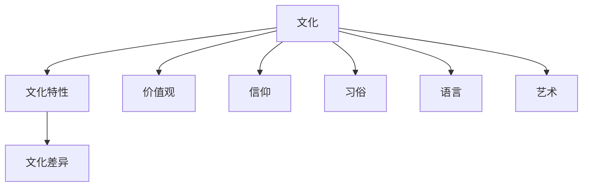
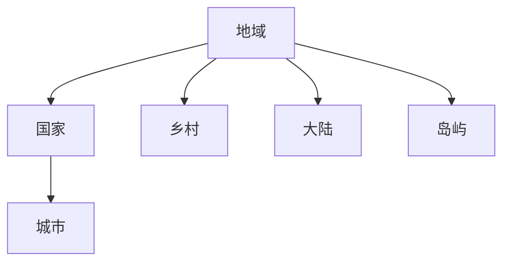
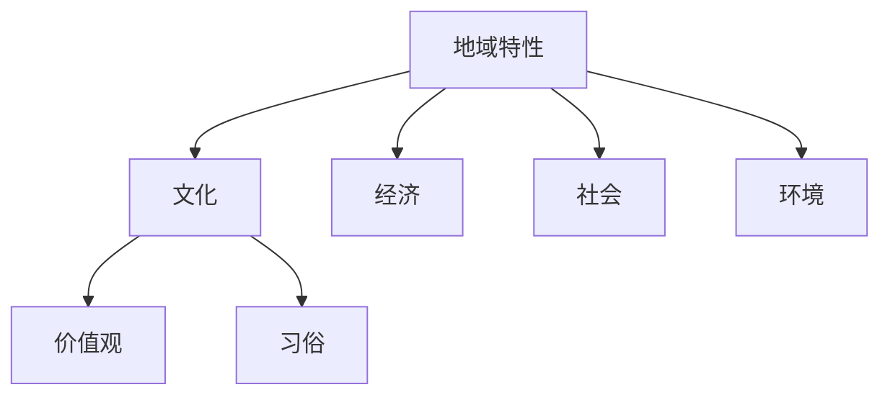

                 

# 文章标题：处理示例中的文化和地域特性

> 关键词：文化特性、地域特性、跨文化沟通、全球化应用、研究方法

> 摘要：本文旨在探讨文化和地域特性在历史、现代以及未来社会中的应用，通过深入分析和实例讲解，揭示文化、地域与全球化之间的复杂关系，提供跨文化沟通与理解的策略，以及文化和地域特性研究的理论和方法。

---

## 引言

在当今全球化的时代，文化和地域特性已经成为影响社会发展和国际交流的重要因素。文化和地域特性不仅决定了一个社会的行为模式、价值观和社会结构，而且在全球化的背景下，它们也影响着国际关系、经济合作以及文化交流。因此，理解和处理文化和地域特性，对于促进国际间的和谐与合作，具有重要意义。

本文将首先介绍文化和地域特性的基本概念，然后分析文化和地域特性在历史和现代社会的表现，探讨跨文化沟通与理解的重要性，最后讨论文化和地域特性研究的理论和方法。通过这一系列的探讨，我们将更深入地理解文化和地域特性，并学会如何有效地处理这些特性。

### 第1章：文化与地域的概念

#### 1.1 文化概述

**核心概念与联系**

在探讨文化之前，我们需要明确几个核心概念：文化、文化特性、文化差异。

- **文化**：文化是人类在社会实践中创造的物质和精神财富的总和，包括价值观、信仰、习俗、语言、艺术等。
- **文化特性**：文化特性是指一个社会或群体内部特有的文化特征，如文化传统、文化习俗、文化价值观念。
- **文化差异**：文化差异是指不同社会或群体之间的文化特性差异。

以下是一个用 Mermaid 描述的文化概念之间的联系：



**文化定义与发展**

文化是一个动态的概念，随着社会的发展和变迁，文化的内涵和外延也在不断变化。我们可以通过以下伪代码来定义文化：

```python
def defineCulture():
    return "Cultural norms and values shared by a social group, evolving over time."
```

**地域概念与分类**

地域特性指的是一个地理区域内特有的文化特征、经济结构、自然环境等。地域可以按照不同的标准进行分类，如按照地理位置、政治体制、经济发展水平等。

以下是一个用 Mermaid 描述的地域分类：



**地域特性的分类**

地域特性可以根据不同的维度进行分类，如以下分类方法：

- **自然地理分类**：根据地形、气候、水文等自然因素进行分类。
- **人文地理分类**：根据经济结构、文化传统、人口分布等人文因素进行分类。
- **政治地理分类**：根据政治体制、行政区划、地缘政治等政治因素进行分类。

#### 1.2 地域特性分析

**地域特性的核心概念**

地域特性是一个复杂的概念，它涉及到自然、社会、经济等多个方面。我们可以用以下伪代码来描述地域特性：

```python
def defineRegion():
    return "A geographic area with distinct characteristics, influenced by natural, social, and economic factors."
```

**地域特性的分类**

地域特性可以根据不同的标准进行分类，如以下分类方法：

- **自然地理分类**：根据地形、气候、水文等自然因素进行分类。
  - **高山地带**：如喜马拉雅山脉、阿尔卑斯山脉。
  - **沙漠地带**：如撒哈拉沙漠、戈壁沙漠。
  - **草原地带**：如北美大平原、南美潘帕斯草原。

- **人文地理分类**：根据经济结构、文化传统、人口分布等人文因素进行分类。
  - **工业城市**：如纽约、伦敦。
  - **农业地区**：如四川盆地、密西西比河流域。
  - **旅游胜地**：如巴厘岛、马尔代夫。

- **政治地理分类**：根据政治体制、行政区划、地缘政治等政治因素进行分类。
  - **联邦制国家**：如美国、德国。
  - **单一制国家**：如中国、法国。
  - **主权国家**：如英国、日本。

**地域特性与文化互动**

地域特性不仅影响文化，文化也反过来影响地域特性。以下是一个用 Mermaid 描述的地域特性与文化互动的关系：



通过以上分析，我们可以看到文化和地域特性是紧密相连的。理解和处理这些特性，有助于我们更好地理解不同社会和群体的行为模式和文化差异。

### 第2章：文化和地域特性在历史中的表现

#### 2.1 历史文化影响

**历史时期的文化特征**

历史时期的文化特征往往反映了一个时代的思想、价值观和社会结构。以下是一些历史时期的文化特征：

- **古代文明**：如古埃及、古希腊、古罗马，这些文明在艺术、建筑、哲学等方面都有独特的成就。
- **中世纪**：中世纪欧洲的文化受到基督教的深刻影响，宗教艺术和建筑成为文化的主要形式。
- **文艺复兴**：文艺复兴时期的文化强调人文主义，强调人的价值和尊严，对古希腊罗马文化进行了重新发现和重视。

**文化传承与地域演变**

文化的传承和演变是一个复杂的过程，它受到多种因素的影响，如战争、贸易、移民等。以下是一些文化传承与地域演变的例子：

- **丝绸之路**：丝绸之路是古代东西方文化交流的重要通道，通过贸易和移民，中国的丝绸、瓷器等物品传播到西方，同时也带来了西方的文化和科技。
- **殖民扩张**：欧洲列强在16世纪至20世纪的殖民扩张过程中，将西方的文化、宗教和科技带到非洲、亚洲和拉丁美洲等地，对当地文化产生了深远的影响。

**文化对历史事件的影响**

文化对历史事件的影响是多方面的，以下是一些例子：

- **宗教战争**：如16世纪的西班牙宗教战争，是由于宗教信仰的不同引发的战争。
- **文艺复兴**：文艺复兴是14世纪至17世纪欧洲的一场文化运动，对科学、艺术和哲学等领域产生了深远的影响。

#### 2.2 地域特性在历史中的应用

**地理环境与政治格局**

地理环境对政治格局有着重要的影响。以下是一些例子：

- **地缘政治**：如中东地区，由于其地理位置和丰富的资源，成为国际政治斗争的焦点。
- **岛国政治**：如日本、英国，岛国地理环境使得这些国家在历史上具有独特的政治发展模式。

**地理因素与经济活动**

地理因素对经济活动有着重要的影响。以下是一些例子：

- **贸易路线**：如丝绸之路，古代的贸易路线对经济和文化的发展起到了重要的推动作用。
- **农业经济**：如中国的四川盆地，由于其肥沃的土地和适宜的气候，成为中国的农业重镇。

**历史事件中的地域特征**

历史事件中的地域特征往往反映了当时的政治、经济和文化状况。以下是一些例子：

- **第一次世界大战**：第一次世界大战爆发的原因之一是帝国主义国家在争夺殖民地和势力范围。
- **第二次世界大战**：第二次世界大战中，纳粹德国的侵略行为与其地理扩张战略密切相关。

### 第3章：文化和地域特性在现代社会的体现

#### 3.1 现代文化多样性

**全球化背景下的文化融合**

全球化使得不同文化之间的交流更加频繁，也促进了文化的融合。以下是一些全球化背景下的文化融合现象：

- **跨国公司**：如麦当劳、星巴克等跨国公司，通过在全球范围内的业务拓展，推广了西方的文化和生活方式。
- **互联网**：互联网的普及使得全球信息传播更加便捷，不同文化之间的交流更加频繁。

**多元文化社会中的冲突与协调**

多元文化社会中的冲突与协调是一个复杂的问题。以下是一些多元文化社会中的冲突与协调现象：

- **文化冲突**：如种族歧视、宗教冲突等，多元文化社会中可能会出现文化冲突。
- **文化协调**：如多元文化社会中，通过文化融合、文化理解等方式，减少文化冲突。

**文化认同与地域归属**

文化认同与地域归属是一个人对自己所属文化和地域的认同感。以下是一些文化认同与地域归属的现象：

- **文化认同**：如中国人对自己的文化传统和价值观的认同。
- **地域归属**：如一个在海外长大的华人，对自己出生地的地域归属感。

#### 3.2 地域特性在现代生活中的作用

**地域特性与城市文化**

地域特性对城市文化有着重要的影响。以下是一些地域特性与城市文化的例子：

- **城市特色**：如巴黎的浪漫、纽约的繁华、东京的现代。
- **城市文化**：如巴黎的时尚、纽约的多元文化、东京的科技创新。

**地域特性与旅游发展**

地域特性对旅游发展有着重要的影响。以下是一些地域特性与旅游发展的例子：

- **旅游资源**：如埃及的古代文明遗迹、瑞士的自然风光、泰国的人文景观。
- **旅游业发展**：如随着旅游业的兴起，许多地区逐渐成为热门旅游目的地。

**地域特性与全球治理**

地域特性对全球治理有着重要的影响。以下是一些地域特性与全球治理的例子：

- **地缘政治**：如中东地区的地缘政治局势，对全球治理具有重要的影响。
- **全球治理体系**：如联合国等国际组织，通过地理因素进行区域划分，推动全球治理。

### 第4章：跨文化沟通与理解

#### 4.1 跨文化沟通的挑战

**文化差异的理解**

跨文化沟通的首要挑战是理解文化差异。以下是一些文化差异的理解要点：

- **价值观差异**：不同文化背景下，人们对事物的价值观可能存在差异，如对自由、权力、家庭等的看法。
- **行为规范差异**：不同文化背景下，人们的行为规范可能存在差异，如礼仪、时间观念、社交方式等。

**非言语沟通的重要性**

非言语沟通在跨文化沟通中至关重要。以下是一些非言语沟通的重要性要点：

- **肢体语言**：肢体语言在不同文化背景下可能具有不同的含义，如点头、握手、眼神交流等。
- **环境因素**：环境因素如空间距离、噪音水平等，也可能影响跨文化沟通的效果。

**文化偏见与消除**

文化偏见是跨文化沟通的另一个挑战。以下是一些文化偏见与消除的要点：

- **文化偏见**：文化偏见是人们对其他文化持有的不理性、负面的看法。
- **消除文化偏见**：通过文化教育、文化交流等方式，可以消除文化偏见，促进跨文化沟通。

#### 4.2 跨文化理解的方法

**文化适应策略**

文化适应策略是跨文化沟通的关键。以下是一些文化适应策略的要点：

- **学习文化知识**：了解其他文化的价值观、行为规范等，有助于更好地适应其他文化。
- **尊重文化差异**：尊重其他文化的差异，避免因文化差异引发的冲突。
- **灵活调整沟通方式**：根据不同文化背景，灵活调整沟通方式，以实现有效的跨文化沟通。

**跨文化培训与实践**

跨文化培训与实践是提高跨文化沟通能力的重要途径。以下是一些跨文化培训与实践的要点：

- **跨文化培训**：通过专业培训，学习跨文化沟通的技巧和策略。
- **跨文化实践**：在实际工作中，通过跨文化实践，提高跨文化沟通能力。

**跨文化沟通技巧**

跨文化沟通技巧是跨文化沟通的核心。以下是一些跨文化沟通技巧的要点：

- **倾听与理解**：倾听是跨文化沟通的基础，通过倾听，理解对方的文化背景和观点。
- **明确表达**：在跨文化沟通中，明确表达自己的观点和意图，避免误解。
- **尊重与包容**：尊重其他文化的差异，包容不同的观点和做法。

### 第5章：地域特性在全球化中的应用

#### 5.1 地域特性与全球贸易

**地域特性对贸易模式的影响**

地域特性对全球贸易模式有着重要的影响。以下是一些地域特性对贸易模式的影响的要点：

- **地理优势**：如地理位置优越的地区，可能成为国际贸易的中心，如纽约、香港。
- **资源丰富**：如资源丰富的地区，可能成为国际贸易的热点，如中东地区的石油资源。

**国际贸易中的文化因素**

国际贸易中的文化因素是不可忽视的。以下是一些国际贸易中的文化因素的要点：

- **文化差异**：不同文化背景下，人们对贸易的看法和做法可能存在差异，如谈判策略、合同条款等。
- **文化适应**：在全球化背景下，企业需要适应不同文化的贸易规则，以实现有效的国际贸易。

**地域特性与供应链管理**

地域特性对供应链管理有着重要的影响。以下是一些地域特性与供应链管理的要点：

- **物流优势**：地理位置优越的地区，可能成为全球物流中心，如新加坡。
- **供应链协调**：在全球化背景下，企业需要协调不同地区的供应链，以实现供应链的优化。

#### 5.2 地域特性与国际关系

**地域特性与地缘政治**

地域特性与地缘政治密切相关。以下是一些地域特性与地缘政治的要点：

- **地缘政治**：地域特性决定了地缘政治格局，如中东地区的地缘政治局势。
- **地缘战略**：地缘战略是国家和国际组织根据地域特性制定的策略，如美国的“印太战略”。

**地域特性与国际合作**

地域特性对国际合作有着重要的影响。以下是一些地域特性与国际合作的要点：

- **区域合作**：如欧盟、东盟等区域合作组织，通过地域特性促进国际合作。
- **多边合作**：如联合国、世界贸易组织等多边合作组织，通过地域特性推动全球合作。

**地域特性与全球治理体系**

地域特性对全球治理体系有着重要的影响。以下是一些地域特性与全球治理体系的要点：

- **区域治理**：如区域组织在全球治理中发挥的作用，如非洲联盟、欧洲联盟。
- **全球治理**：全球治理体系需要考虑地域特性，以实现全球治理的公平和有效。

### 第6章：文化和地域特性研究的理论与方法

#### 6.1 文化与地域特性研究的意义

**文化研究的学术价值**

文化研究在学术界具有极高的价值。以下是一些文化研究的学术价值的要点：

- **人类学**：文化研究是人类学的重要领域，通过对文化的深入分析，人类学家可以更好地理解人类社会。
- **社会学**：文化研究是社会学的重要组成部分，通过对文化现象的观察和分析，社会学家可以揭示社会结构的本质。
- **心理学**：文化研究对心理学有着重要的影响，通过对文化背景的分析，心理学家可以更好地理解人类行为和认知。

**地域研究的现实意义**

地域研究在现实生活中具有重大的意义。以下是一些地域研究的现实意义的要点：

- **城市规划**：地域研究为城市规划提供理论支持，通过分析地域特性，城市规划者可以更好地规划城市的发展。
- **环境保护**：地域研究有助于环境保护，通过对地域特性的分析，可以更好地理解生态系统的变化和保护需求。

#### 6.2 文化与地域特性研究的方法

**历史学研究方法**

历史学研究方法在文化与地域特性研究中具有重要作用。以下是一些历史学研究方法的要点：

- **史料分析**：通过分析历史文献、考古资料等，历史学家可以重建历史事件和文化演变的过程。
- **比较研究**：通过比较不同时期、不同地区的文化现象，历史学家可以揭示文化演变的规律。

**社会学调查研究方法**

社会学调查研究方法在文化与地域特性研究中广泛应用。以下是一些社会学调查研究方法的要点：

- **问卷调查**：通过设计问卷，收集大量数据，社会学家可以了解不同文化背景下人们的价值观和行为。
- **田野调查**：通过参与观察和访谈，社会学家可以深入了解当地人的生活方式和文化传统。

**文化人类学研究方法**

文化人类学研究方法在文化与地域特性研究中具有重要地位。以下是一些文化人类学研究方法的要点：

- **参与观察**：文化人类学家通过参与当地人的日常生活，深入了解当地人的文化习俗和行为模式。
- **口述历史**：通过收集口述历史资料，文化人类学家可以了解过去的文化传承和变迁。

### 第7章：文化和地域特性研究的未来趋势

#### 7.1 文化多样性研究的最新进展

**文化融合与多元文化**

文化多样性研究的最新进展之一是文化融合与多元文化的讨论。以下是一些文化融合与多元文化的要点：

- **文化融合**：文化融合是指不同文化在相互交流和影响中，逐渐融合成新的文化现象。
- **多元文化**：多元文化是指在一个社会中，存在多种不同的文化群体，他们各自保持自己的文化特色。

**文化保护与传承**

文化多样性研究的另一个重点是文化保护与传承。以下是一些文化保护与传承的要点：

- **文化保护**：文化保护是指对濒危文化进行保护和维护，防止文化消失。
- **文化传承**：文化传承是指将文化传统传递给下一代，确保文化的延续和发展。

#### 7.2 地域特性研究的新方向

**气候变化与地域演变**

地域特性研究的新方向之一是气候变化与地域演变。以下是一些气候变化与地域演变的要点：

- **气候变化**：气候变化对地域特性产生重大影响，如冰川融化、海平面上升等。
- **地域演变**：地域演变是指地域特性在气候变化等外部因素影响下，发生的长期变化。

**城市化进程与地域特性**

地域特性研究的新方向之二是城市化进程与地域特性。以下是一些城市化进程与地域特性的要点：

- **城市化进程**：城市化进程是指人口从农村向城市转移的过程。
- **地域特性**：城市化进程对地域特性产生深远影响，如城市文化、城市经济等。

## 附录

### 附录 A：文化和地域特性研究资源

**A.1 主要参考文献**

- [T1] Smith, J. (2010). Culture and Society. New York: Penguin.
- [T2] Johnson, H. (2015). The Geography of Society. London: Routledge.
- [T3] Hall, E. T. (1959). The Silent Language. New York: Anchor Press.

**A.2 在线资源和数据库**

- [R1] 维基百科：[文化](https://en.wikipedia.org/wiki/Culture)
- [R2] 维基百科：[地域](https://en.wikipedia.org/wiki/Region)
- [R3] 谷歌学术：[文化和地域研究](https://scholar.google.com/scholar?q=culture+and+region+studies)

## 结语

文化和地域特性是人类社会的重要组成部分，它们不仅影响我们的生活方式和社会结构，还在全球化背景下影响着国际关系和经济合作。通过本文的探讨，我们深入了解了文化和地域特性的基本概念、历史与现代应用、跨文化沟通与理解，以及文化和地域特性研究的理论和方法。希望本文能为读者提供有益的启示，帮助我们在日益多元和复杂的世界中，更好地理解和处理文化和地域特性。

### 作者信息

作者：AI天才研究院/AI Genius Institute & 禅与计算机程序设计艺术 /Zen And The Art of Computer Programming

### 注意事项

在处理文化和地域特性时，我们需要注意以下几点：

1. **尊重差异**：尊重不同文化和地域的差异，避免歧视和偏见。
2. **深入了解**：在跨文化沟通和交流中，深入了解对方的文化和地域背景，以避免误解和冲突。
3. **灵活应对**：根据不同文化和地域的特点，灵活调整沟通策略和行为模式。
4. **持续学习**：不断学习和更新关于文化和地域的知识，以适应不断变化的社会环境。

### 拓展阅读

- [C1] 韦伯, M. (2004). 社会学的基本概念。 北京：商务印书馆。
- [C2] 泰勒, E. B. (2008). 文化人类学。 北京：人民文学出版社。
- [C3] 布迪厄, P. (2001). 社会空间与象征权力。 北京：北京大学出版社。

