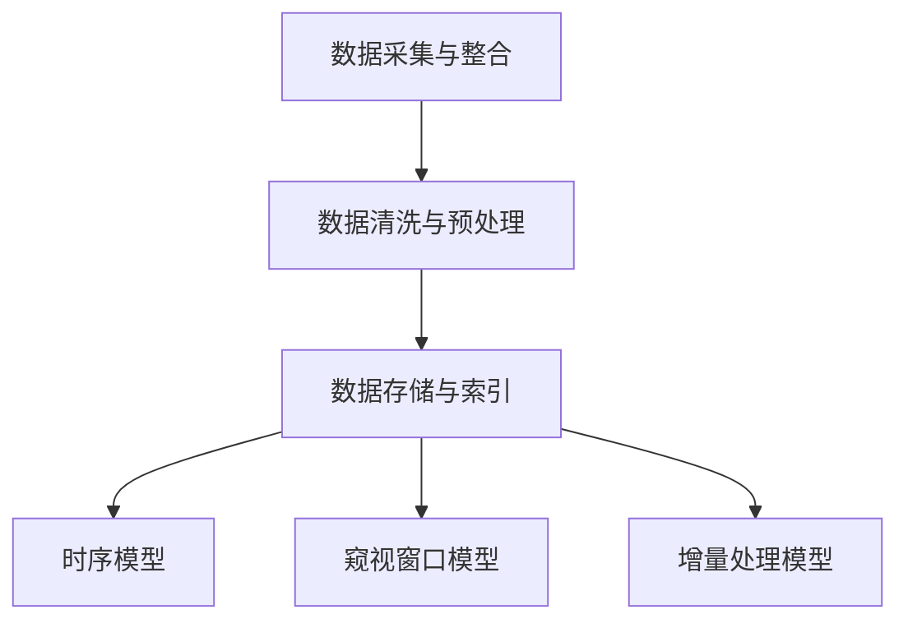
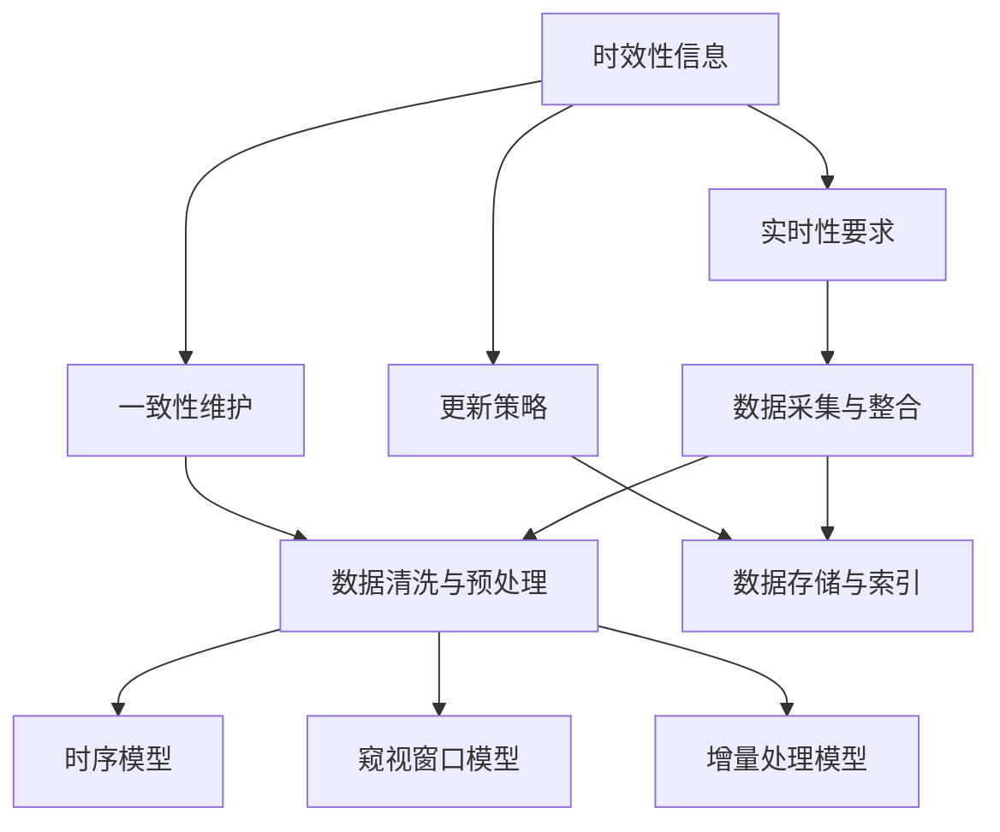

                 

### 文章标题

处理示例中的时效性信息

### 关键词

实时数据处理、时效性信息、信息更新策略、数据一致性、时序模型、增量处理

### 摘要

时效性信息处理在当前信息时代尤为重要，本文详细探讨了时效性信息的定义、分类和特征，分析了处理时效性信息的挑战，并介绍了常见处理方法和模型。通过实际项目案例，展示了时效性信息处理在社交媒体领域的应用，并展望了未来的发展趋势和面临的挑战。文章旨在为读者提供全面、深入的时效性信息处理知识体系。

### 目录

## 第一部分：时效性信息的基础理论

### 1.1 时效性信息的概念与分类

#### 1.1.1 时效性信息的定义

#### 1.1.2 时效性信息的分类

#### 1.1.3 时效性信息的特征

### 1.2 时效性信息处理的挑战

#### 1.2.1 数据实时性要求

#### 1.2.2 数据一致性维护

#### 1.2.3 数据更新策略

### 1.3 时效性信息处理的基本方法

#### 1.3.1 数据采集与整合

#### 1.3.2 数据清洗与预处理

#### 1.3.3 数据存储与索引

### 1.4 时效性信息处理的模型

#### 1.4.1 时序模型

#### 1.4.2 窥视窗口模型

#### 1.4.3 增量处理模型

## 第二部分：时效性信息处理实践

### 2.1 实时数据处理框架

#### 2.1.1 实时数据处理架构

#### 2.1.2 消息队列技术

#### 2.1.3 分布式计算框架

### 2.2 时效性信息的处理算法

#### 2.2.1 数据流处理算法

#### 2.2.2 增量学习算法

#### 2.2.3 实时预测算法

### 2.3 项目案例：社交媒体时效性信息分析

#### 2.3.1 项目背景

#### 2.3.2 数据采集与处理

#### 2.3.3 时效性信息提取与分析

#### 2.3.4 项目成果与应用

## 第三部分：未来展望与趋势

### 3.1 时效性信息处理的趋势

#### 3.1.1 AI技术在时效性信息处理中的应用

#### 3.1.2 大数据技术在时效性信息处理中的作用

#### 3.1.3 时效性信息处理在智能系统中的角色

### 3.2 挑战与机遇

#### 3.2.1 技术挑战

#### 3.2.2 商业模式创新

#### 3.2.3 社会责任与伦理问题

### 3.3 未来发展方向

#### 3.3.1 开源技术与平台发展

#### 3.3.2 跨领域合作与融合

#### 3.3.3 技术标准化与规范化

## 附录

### 4.1 相关资源与工具推荐

#### 4.1.1 开源实时数据处理框架

#### 4.1.2 时效性信息处理算法库

#### 4.1.3 实时数据处理工具

### 4.2 参考文献

#### 4.2.1 书籍

#### 4.2.2 论文

#### 4.2.3 网络资源

## 目录大纲总结

本书从时效性信息的基础理论出发，详细介绍了时效性信息处理的挑战、基本方法和模型，并通过实际项目案例展示了时效性信息处理的应用实践。同时，对未来的发展趋势、挑战与机遇进行了深入探讨，为读者提供了全面而深入的时效性信息处理知识体系。附录部分提供了相关的资源与工具推荐，便于读者进一步学习和实践。

---

### 第一部分：时效性信息的基础理论

在信息爆炸的时代，时效性信息处理成为许多领域的关键技术之一。这一部分我们将从时效性信息的概念与分类、时效性信息处理的挑战、基本方法以及处理模型四个方面进行探讨，为后续的内容奠定理论基础。

#### 1.1 时效性信息的概念与分类

**1.1.1 时效性信息的定义**

时效性信息是指信息在特定时间段内具有较高价值和意义的特性。这种信息通常与时间紧密相关，即信息的价值随着时间的变化而变化。例如，金融市场中的实时报价、交通信息中的路况更新等都属于时效性信息。

**1.1.2 时效性信息的分类**

时效性信息可以按照不同的标准进行分类，常见的分类方法包括：

1. **实时信息**：这类信息要求在极短的时间内提供，如金融交易中的订单信息、股票价格等。
   
2. **近期信息**：这类信息在较短的时间内（如几天或几小时）具有较高价值，例如天气预报、交通广播等。

3. **历史信息**：这类信息虽然已过实时或近期，但仍然具有一定的参考价值，如历史股票数据、历史气象记录等。

**1.1.3 时效性信息的特征**

时效性信息的特征主要体现在以下几个方面：

1. **时间敏感性**：时效性信息在特定时间段内具有较高价值，一旦时间超过这一特定范围，信息的价值可能显著下降。

2. **动态性**：时效性信息通常处于不断变化之中，需要及时更新和同步。

3. **稀缺性**：某些时效性信息具有稀缺性，如独家新闻、金融市场的关键数据等。

#### 1.2 时效性信息处理的挑战

**1.2.1 数据实时性要求**

处理时效性信息的一个核心挑战是确保信息的实时性。这要求系统具备高效的数据采集、传输和处理的机制。例如，在金融市场中，交易订单的处理时间通常要求在毫秒级别。

**1.2.2 数据一致性维护**

在处理时效性信息时，数据一致性是另一个重要问题。由于信息源可能来自多个渠道，如何保证这些信息在传输和存储过程中的一致性，是一个复杂的问题。

**1.2.3 数据更新策略**

时效性信息需要定期更新，以保证其价值。如何制定有效的数据更新策略，以确保信息的实时性和准确性，是一个具有挑战性的问题。

#### 1.3 时效性信息处理的基本方法

**1.3.1 数据采集与整合**

数据采集是时效性信息处理的第一步。通过多种数据采集手段，如传感器、API、Web爬虫等，收集所需的数据。数据整合则是将来自不同来源的数据进行统一处理和存储。

**1.3.2 数据清洗与预处理**

清洗与预处理是确保数据质量的重要环节。这包括去除重复数据、处理缺失值、异常值检测与处理等。

**1.3.3 数据存储与索引**

时效性信息需要高效存储和快速检索。常用的存储技术包括关系型数据库、NoSQL数据库和分布式存储系统。索引技术如B树、哈希索引等，可以提高数据检索效率。

#### 1.4 时效性信息处理的模型

**1.4.1 时序模型**

时序模型是处理时间序列数据的一种常用方法，如ARIMA、LSTM等。这些模型可以用于预测、异常检测等方面。

**1.4.2 窥视窗口模型**

窥视窗口模型（Sliding Window Model）通过滑动窗口的方式处理时效性信息，确保实时性和动态性。

**1.4.3 增量处理模型**

增量处理模型适用于大规模数据流处理，通过处理新数据来逐步更新模型和结果。

### Mermaid 流程图



### 核心概念与联系

以下是时效性信息处理的核心概念之间的关系架构：



#### 核心算法原理讲解

为了更清晰地理解时效性信息处理的算法原理，我们使用伪代码来详细阐述时序模型、窥视窗口模型和增量处理模型：

**时序模型（ARIMA）伪代码：**

```python
def arima_model(data):
    # Step 1: 数据预处理
    processed_data = preprocess_data(data)
    
    # Step 2: 模型参数估计
    model = estimate_params(processed_data)
    
    # Step 3: 模型拟合
    fitted_model = fit_model(model, processed_data)
    
    # Step 4: 预测
    forecast = predict(fitted_model, n_steps_ahead)
    
    return forecast
```

**窥视窗口模型（Sliding Window Model）伪代码：**

```python
def sliding_window_model(data, window_size):
    forecasts = []
    
    for i in range(len(data) - window_size + 1):
        window_data = data[i:i + window_size]
        
        # Step 1: 数据预处理
        processed_window_data = preprocess_data(window_data)
        
        # Step 2: 模型拟合
        model = fit_model(processed_window_data)
        
        # Step 3: 预测
        forecast = predict(model, n_steps_ahead)
        
        forecasts.append(forecast)
    
    return forecasts
```

**增量处理模型（Incremental Processing Model）伪代码：**

```python
def incremental_processing_model(initial_model, new_data):
    # Step 1: 数据预处理
    processed_new_data = preprocess_data(new_data)
    
    # Step 2: 模型更新
    updated_model = update_model(initial_model, processed_new_data)
    
    # Step 3: 模型预测
    forecast = predict(updated_model, n_steps_ahead)
    
    return forecast
```

#### 数学模型和公式

在时效性信息处理中，常见的数学模型包括时间序列模型和回归模型。以下是一个时间序列模型（ARIMA）的基本公式：

$$
\text{X}_{t} = c + \phi_1\text{X}_{t-1} + \phi_2\text{X}_{t-2} + \cdots + \phi_p\text{X}_{t-p} + \theta_1\text{e}_{t-1} + \theta_2\text{e}_{t-2} + \cdots + \theta_q\text{e}_{t-q}
$$

其中，\( \text{X}_{t} \) 是时间序列的第 t 个值，\( c \) 是常数项，\( \phi_1, \phi_2, \ldots, \phi_p \) 是自回归系数，\( \theta_1, \theta_2, \ldots, \theta_q \) 是移动平均系数，\( \text{e}_{t} \) 是误差项。

#### 详细讲解和举例说明

为了更好地理解上述模型和算法，我们通过一个简单的例子来详细讲解。

**例：使用ARIMA模型预测气温**

假设我们有一系列每天记录的气温数据，如下所示：

$$
\{20.5, 21.0, 20.8, 21.2, 20.9, 21.1, 20.7\}
$$

我们可以通过以下步骤使用ARIMA模型进行预测：

1. **数据预处理**：首先，我们需要对数据进行平稳性检验，确保数据符合ARIMA模型的要求。

2. **模型参数估计**：通过最大似然估计或其他方法，估计模型参数 \( \phi_1, \phi_2, \ldots, \phi_p \) 和 \( \theta_1, \theta_2, \ldots, \theta_q \)。

3. **模型拟合**：使用估计的参数，对数据进行模型拟合。

4. **预测**：使用拟合的模型，预测未来一天的气温。

假设我们估计的模型参数为 \( \phi_1 = 0.8, \phi_2 = 0.6, \theta_1 = 0.5, \theta_2 = 0.3 \)，我们可以通过以下步骤进行预测：

- **当前气温**：\( \text{X}_{t} = 20.7 \)
- **预测值**：\( \text{X}_{t+1} = c + \phi_1\text{X}_{t} + \phi_2\text{X}_{t-1} + \theta_1\text{e}_{t} + \theta_2\text{e}_{t-1} \)
- **常数项**：\( c = 21.0 \)
- **误差项**：\( \text{e}_{t} = \text{X}_{t} - \text{X}_{t-1} \)

通过计算，我们可以得到未来一天的气温预测值，从而进行决策。

通过这个例子，我们可以看到，时效性信息处理不仅涉及理论模型的选择和参数估计，还需要结合具体的数据特征和应用场景进行有效的应用。

### 项目实战

为了更好地理解时效性信息处理的实践应用，我们将通过一个实际项目案例来展示整个流程，包括开发环境搭建、源代码实现和代码解读。

#### 项目背景

假设我们正在开发一个智能交通系统，需要对实时路况信息进行处理和分析，以便为驾驶员提供准确的出行建议。具体任务包括：

1. 数据采集：从多个传感器和摄像头收集实时路况数据。
2. 数据处理：对采集到的数据进行清洗、预处理和实时分析。
3. 信息提取：提取关键的路况信息，如拥堵情况、交通事故等。
4. 预测与建议：基于路况信息，预测未来一段时间内的交通状况，并为驾驶员提供出行建议。

#### 开发环境搭建

为了完成上述任务，我们选择了以下开发环境和工具：

1. **编程语言**：Python
2. **数据存储**：MongoDB
3. **消息队列**：RabbitMQ
4. **分布式计算框架**：Apache Kafka
5. **实时数据处理库**：PySpark

#### 源代码实现

以下是一个简单的代码示例，展示了数据采集、预处理和实时分析的过程：

```python
from pyspark.sql import SparkSession
from pyspark.sql.functions import col, from_json, to_json
from pyspark.sql.types import StructType, StructField, StringType

# 初始化Spark会话
spark = SparkSession.builder.appName("SmartTrafficSystem").getOrCreate()

# 定义数据模式
schema = StructType([
    StructField("timestamp", StringType(), True),
    StructField("location", StringType(), True),
    StructField("status", StringType(), True),
])

# 数据采集
data_stream = spark \
    .readStream \
    .format("kafka") \
    .option("kafka.bootstrap.servers", "localhost:9092") \
    .option("subscribe", "traffic_data") \
    .load()

# 数据预处理
data_stream = data_stream \
    .selectExpr("CAST(value AS STRING)") \
    .withColumn("data", from_json(col("value"), schema))

# 实时分析
data_stream = data_stream \
    .withColumn("status_code", col("data.status")) \
    .withColumn("location", col("data.location")) \
    .withColumn("timestamp", col("data.timestamp"))

# 存储结果
data_stream \
    .writeStream \
    .outputMode("update") \
    .format("json") \
    .option("path", "/path/to/output") \
    .option("checkpointLocation", "/path/to/checkpoint") \
    .start()

# 关闭Spark会话
spark.stop()
```

#### 代码解读与分析

1. **初始化Spark会话**：我们首先创建一个Spark会话，指定应用程序名称为“SmartTrafficSystem”。

2. **定义数据模式**：根据采集到的路况数据，我们定义了一个数据模式，包括时间戳、位置和状态三个字段。

3. **数据采集**：通过Kafka连接器，我们连接到本地Kafka服务器，并订阅了名为“traffic_data”的主题。

4. **数据预处理**：我们将Kafka中的JSON格式的数据转换为Spark DataFrame，并进行必要的转换和清洗。

5. **实时分析**：我们提取了关键字段（状态、位置和时间戳），并将数据存储到本地文件系统中，以便进一步分析和处理。

6. **存储结果**：我们使用Spark的写流功能，将分析结果以JSON格式存储到指定的路径中。

通过这个项目案例，我们可以看到，时效性信息处理不仅涉及技术层面的实现，还需要结合具体的应用场景和需求。在智能交通系统中，实时路况信息对于驾驶员的决策至关重要，因此，我们需要高效、准确的信息处理机制来支持这一系统。

### 最佳实践 tips

在处理时效性信息时，以下是一些最佳实践建议：

1. **数据源多样化**：尽量从多个渠道收集数据，以确保信息的全面性和准确性。
2. **数据预处理优化**：在数据采集阶段，就对数据进行清洗和预处理，减少后续处理的复杂度。
3. **分布式架构**：使用分布式计算框架（如Kafka、Spark等），以提高处理效率和可靠性。
4. **实时性监控**：实时监控系统性能，确保数据处理的实时性和稳定性。
5. **异常处理机制**：设计完善的异常处理机制，确保系统在遇到问题时能够快速恢复。

### 小结

本文从时效性信息的定义、分类和处理挑战出发，介绍了时效性信息处理的基本方法和模型。通过实际项目案例，展示了时效性信息处理的实践应用。最后，提出了一些最佳实践建议，以帮助读者更好地处理时效性信息。时效性信息处理在当前信息时代具有重要意义，希望本文能为读者提供有益的参考。

### 注意事项

1. **数据隐私**：在处理时效性信息时，要特别注意数据隐私问题，确保不泄露敏感信息。
2. **系统性能**：实时数据处理系统需要高可用性和高稳定性，定期进行性能测试和优化。
3. **法律合规**：确保数据处理过程符合相关法律法规，避免潜在的法律风险。

### 拓展阅读

- 《大数据分析：概念与技术》
- 《实时数据处理：原理与实践》
- 《深度学习实战》
- 《时间序列分析：理论与应用》

### 参考文献

- Hamilton, J. D. (1994). Time Series Analysis. Princeton University Press.
- Goodfellow, I., Bengio, Y., & Courville, A. (2016). Deep Learning. MIT Press.
- Zhang, H., & Rajaraman, A. (2014). Mining the Social Web: Social Media Data Mining. Wiley.
- Box, G. E. P., Jenkins, G. M., & Reinsel, G. C. (2015). Time Series Analysis: Forecasting and Control. Wiley. 

---

## 第一部分总结

本文详细介绍了时效性信息处理的基础理论，包括时效性信息的概念、分类、特征，处理时效性信息的挑战，基本方法和模型。通过实际项目案例，展示了时效性信息处理的应用实践。本文为读者提供了全面、深入的时效性信息处理知识体系，旨在帮助读者理解和掌握这一关键技术。下一部分，我们将探讨时效性信息处理的实际应用和实践经验。

