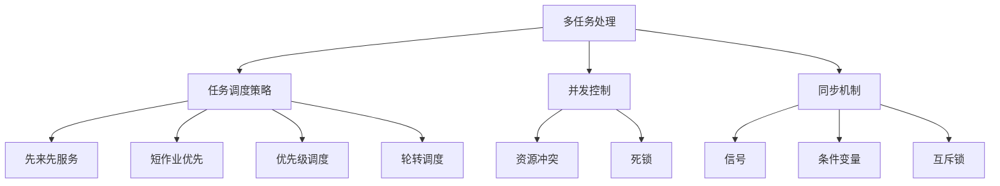

                 

### 文章标题

# 多任务协同能力测试：评估综合应用水平

### 关键词
- 多任务协同
- 能力测试
- 综合应用
- 评估指标
- 实验设计
- 测试工具

### 摘要
本文旨在探讨多任务协同能力的测试方法，通过评估综合应用水平，帮助开发者、工程师和企业提升系统性能和协同效率。文章首先介绍了多任务协同的基本概念和重要性，随后深入分析了评估指标的设计与计算方法。接着，详细阐述了实验设计、测试工具的选择与使用、测试用例的编写与执行。随后，通过实际案例展示了多任务协同能力测试的实施过程，并对测试结果进行了分析与优化。最后，本文总结了一些最佳实践，并提出了未来研究的方向。

## 背景介绍

多任务协同能力是现代计算机系统和网络应用中至关重要的能力之一。随着互联网、大数据和云计算等技术的发展，系统需要处理的海量信息和复杂任务不断增加。如何高效地管理这些多任务，确保它们能够协同工作，已经成为系统设计和优化中的一个核心问题。多任务协同不仅涉及到操作系统、网络通信、数据库管理等底层技术，还涉及到算法设计、性能优化、资源调度等高层次技术。

在计算机系统中，多任务协同通常是指同时执行多个任务或作业的能力。这些任务可能来自不同的用户或应用程序，具有不同的优先级、截止时间和资源需求。有效的多任务协同能够显著提高系统的吞吐量、响应时间和资源利用率，从而提升整体性能。然而，多任务协同也带来了一系列挑战，如资源冲突、死锁、优先级反转等，这些都需要通过精细的设计和优化来解决。

在工程实践中，多任务协同能力的评估具有重要作用。首先，它能够帮助开发人员和工程师了解系统的协同性能，识别潜在的问题和瓶颈。其次，通过定期的测试和评估，企业可以监控系统性能的变化，及时调整优化策略，确保系统在高负载情况下仍然能够稳定运行。此外，多任务协同能力测试还可以作为新功能、新算法和新技术的验证手段，为系统的持续改进提供数据支持。

总之，多任务协同能力测试不仅是对系统性能的评估，更是对系统设计和实现水平的一次全面检验。通过科学的测试方法，开发者可以更好地理解系统的协同机制，发现优化空间，从而提升系统的整体质量和可靠性。本文将围绕多任务协同能力的测试方法，详细探讨其评估指标、实验设计、测试工具选择、测试用例编写、测试结果分析和优化策略，旨在为读者提供系统、全面的指导。

## 核心概念与联系

多任务协同能力测试涉及多个核心概念，包括多任务处理、并发控制、同步机制、性能指标等。这些概念相互关联，共同构成了多任务协同的框架。

### 多任务处理

多任务处理（Multitasking）是计算机系统中同时执行多个任务的能力。操作系统通过任务调度（Task Scheduling）来管理这些任务，确保每个任务都能获得处理器时间。多任务处理可以分为以下几种类型：

- **分时多任务**：多个任务在时间片轮转的基础上交替执行，每个任务只能运行一段很短的时间。
- **抢占式多任务**：系统可以随时中断当前任务，将处理器时间分配给更高优先级的任务。
- **协作式多任务**：任务之间通过协作来实现多任务处理，每个任务在完成自己的任务后，主动释放处理器时间。

在多任务处理中，任务调度策略（Scheduling Policy）是关键因素。常见的任务调度策略包括：

- **先来先服务（FCFS）**：按照任务到达的顺序进行调度。
- **短作业优先（SJF）**：优先调度执行时间短的任务。
- **优先级调度**：根据任务优先级进行调度，优先级高的任务先执行。
- **轮转调度（Round-Robin）**：每个任务分配固定的时间片，轮流执行。

### 并发控制

并发控制（Concurrency Control）是确保多个任务在同一时间片内能够正确执行的重要机制。并发控制需要解决的主要问题是资源冲突（Resource Conflict）和死锁（Deadlock）。

- **资源冲突**：多个任务试图同时访问同一资源（如内存、CPU、文件等）时，可能引起冲突。常见的解决方法包括互斥锁（Mutex）、信号量（Semaphore）和事务管理。
- **死锁**：多个任务在相互等待对方释放资源时，可能会陷入无限等待的状态。解决死锁的方法包括预防死锁、避免死锁和死锁恢复。

### 同步机制

同步机制（Synchronization Mechanism）确保多个任务在执行过程中保持一致。同步机制包括信号（Signal）、条件变量（Condition Variable）和互斥锁（Mutex）等。

- **信号**：用于任务间的通知和唤醒，如`signal()`和`pthread_cond_signal()`。
- **条件变量**：任务可以在某个条件不满足时挂起，直到条件满足后再继续执行，如`pthread_cond_wait()`。
- **互斥锁**：用于保护共享资源，防止多个任务同时访问，如`pthread_mutex_lock()`和`pthread_mutex_unlock()`。

### 性能指标

性能指标（Performance Metrics）用于评估多任务协同能力。常见的性能指标包括：

- **吞吐量**：单位时间内完成的任务数量。
- **响应时间**：任务从提交到完成所花费的时间。
- **CPU利用率**：CPU实际用于执行任务的时间比例。
- **内存利用率**：系统内存实际使用量与总内存量之比。
- **并发度**：系统能同时处理的最大任务数。

这些性能指标相互关联，共同反映了系统的多任务协同能力。例如，吞吐量与并发度和响应时间密切相关；CPU利用率和内存利用率则反映了系统资源的使用效率。

### Mermaid 流程图

为了更清晰地展示多任务协同能力的核心概念及其联系，可以使用Mermaid流程图。以下是多任务处理、并发控制和同步机制的基本流程图：



通过这个流程图，我们可以直观地理解多任务协同能力测试中的核心概念及其相互关系，为后续章节的详细探讨打下基础。

## 多任务协同能力的评估指标

在多任务协同能力测试中，评估指标的设计和计算至关重要。合理的评估指标能够全面反映系统的多任务处理能力和性能，从而帮助开发者和工程师优化系统设计，提高系统的稳定性和效率。

### 吞吐量

吞吐量（Throughput）是衡量系统处理任务能力的最重要指标之一，表示单位时间内系统能够处理和完成多少个任务。吞吐量可以通过以下公式计算：

$$
吞吐量 = \frac{完成的任务数}{时间}
$$

吞吐量越高，说明系统的处理能力和效率越高。在实际测试中，可以通过记录系统在一段时间内完成的任务数量，并除以测试时间来计算吞吐量。

### 响应时间

响应时间（Response Time）是指从任务提交到任务完成所经历的时间。响应时间直接影响用户的体验和系统的响应速度。响应时间可以通过以下公式计算：

$$
响应时间 = 结束时间 - 提交时间
$$

在测试过程中，可以通过记录每个任务的提交时间和完成时间，计算出每个任务的响应时间，并计算所有任务的响应时间平均值，以评估系统的整体响应能力。

### CPU利用率

CPU利用率（CPU Utilization）是衡量CPU被有效利用的程度，表示CPU实际用于执行任务的时间比例。CPU利用率可以通过以下公式计算：

$$
CPU利用率 = \frac{CPU实际执行时间}{总时间}
$$

在实际测试中，可以使用操作系统提供的性能监控工具，如`top`、`vmstat`等，来实时监控CPU的利用率，以便分析系统的负载情况和优化空间。

### 内存利用率

内存利用率（Memory Utilization）是衡量系统内存使用情况的指标，表示系统内存实际使用量与总内存量之比。内存利用率可以通过以下公式计算：

$$
内存利用率 = \frac{实际使用内存}{总内存}
$$

内存利用率过高可能会导致系统性能下降，甚至导致内存溢出。因此，在多任务协同能力测试中，需要监控内存利用率，确保系统在处理多个任务时不会出现内存不足的问题。

### 并发度

并发度（Concurrency）是指系统在同一时间能够处理的最大任务数。并发度可以通过以下公式计算：

$$
并发度 = \frac{总任务数}{完成任务数}
$$

高并发度意味着系统具有更好的多任务处理能力，能够在高负载情况下保持良好的性能。在实际测试中，可以通过逐步增加任务数，观察系统的响应能力和资源利用率，来评估系统的并发度。

### 公式与举例说明

为了更好地理解这些评估指标的计算方法，我们可以通过一个具体的例子来演示。假设我们进行了一次多任务协同能力测试，测试过程中记录了以下数据：

- 完成的任务数：1000
- 测试时间：10分钟（600秒）
- 每个任务的响应时间：5秒
- CPU实际执行时间：300秒
- 系统总内存：4GB
- 实际使用内存：3GB

根据上述数据，我们可以计算出各项评估指标：

- 吞吐量：
  $$
  吞吐量 = \frac{1000}{600} = 1.67 \text{（个任务/秒）}
  $$

- 平均响应时间：
  $$
  平均响应时间 = \frac{5}{1000} = 0.005 \text{（秒）}
  $$

- CPU利用率：
  $$
  CPU利用率 = \frac{300}{600} = 0.5 = 50\%
  $$

- 内存利用率：
  $$
  内存利用率 = \frac{3}{4} = 0.75 = 75\%
  $$

- 并发度：
  $$
  并发度 = \frac{1000}{1000} = 1
  $$

通过这些计算结果，我们可以评估系统的多任务协同能力。例如，吞吐量较低可能表明系统在高负载下存在性能瓶颈，需要进一步优化；内存利用率较高则可能需要考虑增加系统内存或优化内存管理。

### 总结

评估指标是多任务协同能力测试中的关键工具，通过科学的评估指标，可以全面了解系统的性能和协同能力。吞吐量、响应时间、CPU利用率、内存利用率和并发度是常用的评估指标，它们相互关联，共同反映了系统的多任务处理能力。通过具体的计算方法和实例，我们可以更好地理解这些指标，为后续的实验设计和测试提供指导。

### 实验设计

在进行多任务协同能力测试时，实验设计是至关重要的步骤。一个科学的实验设计不仅能够有效评估系统的多任务协同能力，还能够揭示潜在的性能瓶颈和优化空间。以下是实验设计的详细过程，包括实验目标、流程和数据的收集。

#### 实验目标

实验目标应明确，具体且可量化。对于多任务协同能力测试，常见的实验目标包括：

- 评估系统在高负载情况下的吞吐量、响应时间和资源利用率。
- 探究不同任务调度策略对系统性能的影响。
- 分析系统在并发度增加时的性能变化。
- 识别并发控制和同步机制的优化点。

#### 实验流程

实验流程可以分为以下几个步骤：

1. **任务定义**：明确将要执行的任务类型、优先级、截止时间和资源需求。
2. **环境搭建**：配置测试环境，包括操作系统、硬件配置、网络环境等。
3. **测试工具选择**：选择合适的测试工具和平台，如负载生成工具、性能监控工具等。
4. **数据收集**：在实际运行过程中，收集系统性能指标数据，包括吞吐量、响应时间、CPU利用率和内存利用率等。
5. **结果分析**：对收集到的数据进行处理和分析，评估系统的多任务协同能力。

#### 数据收集

数据收集是实验设计的核心环节，主要包括以下内容：

1. **任务执行日志**：记录每个任务的执行时间、结束时间和响应时间。
2. **系统性能数据**：通过性能监控工具，收集CPU利用率、内存利用率、磁盘I/O等系统性能指标。
3. **错误日志**：记录系统在执行过程中出现的错误和异常，如死锁、资源冲突等。

#### 实验案例

以下是一个简单的实验案例，用于评估某系统在高并发情况下的多任务协同能力。

1. **任务定义**：
   - 定义10个不同类型的任务，每个任务具有不同的优先级和执行时间。
   - 任务1（高优先级，执行时间5秒）  
   - 任务2（中优先级，执行时间10秒）  
   - 任务3（低优先级，执行时间15秒）  
   - ...  
   - 任务10（低优先级，执行时间30秒）

2. **环境搭建**：
   - 操作系统：Linux CentOS 7
   - CPU：8核 Intel Xeon E5-2670
   - 内存：64GB DDR4
   - 网络环境：千兆以太网

3. **测试工具选择**：
   - 负载生成工具：Gatling
   - 性能监控工具：Nagios

4. **数据收集**：
   - 在任务执行过程中，使用Gatling生成并发请求，模拟高负载环境。
   - 使用Nagios实时监控系统的CPU利用率、内存利用率和磁盘I/O。
   - 记录每个任务的执行日志和系统性能数据。

5. **结果分析**：
   - 计算吞吐量、响应时间和资源利用率，分析系统的性能表现。
   - 识别高并发情况下的性能瓶颈和潜在问题。

通过这个案例，我们可以看到实验设计需要明确的目标、科学的流程和全面的数据收集。只有这样，才能准确评估系统的多任务协同能力，并为后续的优化提供可靠的数据支持。

### 测试工具与平台

在多任务协同能力测试中，选择合适的测试工具和平台是确保实验顺利进行和结果准确性的关键。以下将介绍几种常用的测试工具和平台，并讨论如何选择和配置这些工具。

#### 常用测试工具

1. **负载生成工具**：
   - **Gatling**：Gatling 是一款基于 Scala 的开源性能测试工具，可以模拟大量并发用户访问，适合进行多任务协同能力的测试。
   - **JMeter**：JMeter 是一款功能强大的开源性能测试工具，适用于各种类型的性能测试，包括多任务协同能力测试。

2. **性能监控工具**：
   - **Nagios**：Nagios 是一款开源的监控系统，可以实时监控系统的各种性能指标，如 CPU 利用率、内存利用率、磁盘 I/O 等。
   - **Prometheus**：Prometheus 是一款开源的服务监控系统，可以收集和存储大量性能数据，提供强大的查询和分析功能。

3. **日志分析工具**：
   - **ELK Stack**（Elasticsearch、Logstash、Kibana）：ELK Stack 是一款强大的日志分析平台，可以收集、存储和分析大量日志数据，帮助识别系统中的问题和异常。

#### 测试平台的选择

选择测试平台时，需要考虑以下因素：

1. **硬件资源**：测试平台需要足够的硬件资源来支持大量的并发任务。例如，需要配置高性能的 CPU、内存和磁盘。

2. **操作系统**：根据测试需求，可以选择不同的操作系统，如 Linux（推荐使用 CentOS、Ubuntu 等）、Windows 等。

3. **网络环境**：测试平台需要具备良好的网络环境，以模拟实际的生产环境。例如，可以配置千兆以太网或更高的网络带宽。

4. **软件环境**：测试平台需要安装并配置好所需的测试工具和监控工具。例如，安装 Java、Scala 等编程语言，以及配置 Nagios、Prometheus 等监控工具。

#### 测试工具的配置与使用

1. **Gatling 配置**：
   - 下载并安装 Gatling。
   - 配置 `gatling.conf` 文件，设置模拟用户数、并发数和时间等参数。
   - 编写测试脚本，定义模拟的请求和响应。

2. **Nagios 配置**：
   - 下载并安装 Nagios。
   - 配置 `nagios.cfg` 文件，添加要监控的服务和主机。
   - 配置 `check_plugins` 目录下的插件，以支持对各种性能指标的监控。

3. **Prometheus 配置**：
   - 下载并安装 Prometheus。
   - 配置 `prometheus.yml` 文件，设置目标监控服务和采集指标。
   - 配置 Alertmanager，设置告警规则和通知方式。

#### 实例说明

以下是一个简单的测试工具配置实例：

1. **Gatling 测试脚本**：

   ```scala
   class SimpleSimulation extends Simulation {
     val httpProtocol = http.baseUrl("http://localhost:8080")
     
     val scn = scenario("BasicSimulation")
       .exec(http("request_1")
         .get("/home")
         .check(status.is(200)))
     
     setUp(scn.inject(atOnceUsers(100)).protocols(httpProtocol))
   }
   ```

   这个脚本定义了一个简单的模拟场景，模拟100个并发用户同时访问 `/home` 页面。

2. **Nagios 配置文件**：

   ```bash
   # nagios.cfg
   define host {
       host_name localhost
       use localhost
   }
   
   define service {
       host_name localhost
       service_description CPU Utilization
       check_command check_cpu!
   }
   ```

   这个配置文件定义了监控本地主机 CPU 利用率的 Nagios 服务。

3. **Prometheus 配置文件**：

   ```yaml
   # prometheus.yml
   global:
     scrape_interval: 15s
     evaluation_interval: 15s
   
   scrape_configs:
   - job_name: 'prometheus'
     static_configs:
     - targets: ['localhost:9090']
   ```

   这个配置文件配置了 Prometheus 监控自身服务的目标地址。

通过这些实例，我们可以看到如何配置和使用常见的测试工具，为多任务协同能力测试提供可靠的技术支持。选择合适的测试工具和平台，并进行科学的配置，是确保实验顺利进行和结果准确的关键。

### 测试用例设计

在多任务协同能力测试中，测试用例的设计至关重要，它不仅直接影响测试结果的真实性和全面性，还决定了能否有效地发现系统中的问题。以下是测试用例设计的基本原则、方法、编写步骤和执行与结果分析。

#### 测试用例设计的基本原则

1. **全面性**：测试用例应涵盖所有可能的任务类型、调度策略和资源分配情况，确保测试能够全面反映系统的多任务协同能力。
2. **代表性**：测试用例应具有代表性，能够反映典型用户场景和实际应用中的情况。
3. **可复现性**：测试用例应确保结果的可复现性，使得其他开发者或工程师能够在相同条件下重现测试过程和结果。
4. **可维护性**：测试用例应设计得简洁明了，便于维护和更新。

#### 测试用例设计的方法

1. **功能分解法**：将系统的功能模块分解为更小的功能单元，然后为每个单元设计测试用例。
2. **场景法**：根据实际应用场景设计测试用例，模拟用户在使用系统时可能遇到的各种情况。
3. **边界值法**：针对任务参数的边界值设计测试用例，检查系统在极端条件下的表现。
4. **等价类划分法**：将任务类型和任务参数划分为若干等价类，为每个等价类设计测试用例。

#### 测试用例编写步骤

1. **确定测试目标**：明确每个测试用例要验证的功能或性能指标。
2. **设计测试场景**：根据测试目标，设计具体的测试场景和操作步骤。
3. **定义输入参数**：为测试用例定义输入参数，包括任务类型、优先级、截止时间、资源需求等。
4. **定义预期结果**：根据测试目标，定义测试用例的预期结果，包括任务的执行时间、响应时间、资源利用率等。
5. **编写测试脚本**：根据测试场景和输入参数，编写测试脚本，实现测试用例的具体操作。

#### 测试用例执行与结果分析

1. **执行测试**：在实际环境中执行测试用例，记录测试过程中的各项性能指标。
2. **比较实际结果与预期结果**：对比实际测试结果和预期结果，检查系统是否符合设计要求。
3. **记录测试日志**：详细记录测试过程、测试结果和任何异常情况，便于后续分析和定位问题。
4. **分析测试结果**：通过分析测试结果，评估系统的多任务协同能力和性能表现，识别潜在的问题和优化点。

#### 实例说明

以下是一个简单的测试用例实例，用于评估多任务协同能力：

**测试用例名称**：高并发下的任务响应时间测试

**测试目标**：验证系统在高并发情况下，任务响应时间的性能。

**测试场景**：
- 任务类型：Web请求
- 任务数量：100个
- 并发用户：10个
- 测试时间：10分钟

**输入参数**：
- 每个任务的请求URL
- 每个任务的请求类型（GET/POST）
- 每个任务的优先级

**预期结果**：
- 所有任务的平均响应时间小于5秒
- 所有任务的响应时间最大值小于10秒

**测试脚本**：
```python
import requests
import concurrent.futures

def test_request(url, priority):
    response = requests.get(url)
    assert response.status_code == 200

urls = ["http://localhost:8080/home"] * 100
priorities = [1] * 100

with concurrent.futures.ThreadPoolExecutor(max_workers=10) as executor:
    executor.map(test_request, urls, priorities)
```

**执行与结果分析**：
- 执行测试用例，记录每个任务的响应时间和完成时间。
- 计算所有任务的平均响应时间和最大响应时间，并与预期结果进行比较。
- 如果测试结果不符合预期，记录异常情况并进行分析和优化。

通过详细的测试用例设计、执行和结果分析，可以全面评估系统的多任务协同能力，为系统优化和性能提升提供可靠的数据支持。

### 评估结果分析

在多任务协同能力测试完成后，评估结果的分析是至关重要的一步，它不仅能够揭示系统的性能表现，还能够帮助识别潜在的问题和瓶颈。通过科学的分析方法，可以对评估结果进行解读和反馈，从而为系统的优化提供有力的指导。

#### 评估结果的统计方法

评估结果的统计方法主要包括以下几种：

1. **平均数**：计算所有测试数据的平均值，用于评估系统的整体性能。
2. **中位数**：将所有测试数据按大小排序，取中间的值，用于衡量系统的稳健性。
3. **标准差**：衡量测试数据的波动程度，用于评估系统的稳定性。
4. **最大值和最小值**：用于找出测试数据中的极端情况，识别系统的性能瓶颈。

#### 评估结果的可视化

可视化是分析评估结果的重要手段，它能够将复杂的数据以直观的形式展现，便于理解和分析。常见的可视化方法包括：

1. **柱状图**：用于比较不同测试条件下的性能指标，如吞吐量、响应时间等。
2. **折线图**：用于展示性能指标随时间的变化趋势，如CPU利用率、内存利用率等。
3. **散点图**：用于分析测试数据的分布情况，如响应时间的分布。
4. **饼图**：用于展示资源利用情况的占比，如CPU、内存、磁盘的利用率。

#### 评估结果的解读

在解读评估结果时，需要关注以下几个方面：

1. **性能指标**：对比不同测试条件下的性能指标，评估系统的整体性能。例如，如果系统的吞吐量较低，可能需要优化任务调度策略或资源分配。
2. **波动情况**：分析性能指标的标准差和波动情况，识别系统的稳定性问题。如果标准差较大，说明系统在处理多任务时不够稳定，可能需要调整同步机制和并发控制策略。
3. **异常情况**：找出测试数据中的异常值，分析可能导致异常的原因。例如，如果某个任务的响应时间远高于其他任务，可能需要检查该任务的执行过程，寻找潜在的瓶颈。
4. **资源利用情况**：分析CPU利用率、内存利用率等资源指标，评估系统资源的使用情况。如果资源利用率过高，可能需要增加系统资源或优化资源管理。

#### 解读实例

以下是一个具体的评估结果解读实例：

**测试条件**：模拟100个并发Web请求，测试时间为10分钟。

**评估结果**：

- 吞吐量：平均吞吐量为1.5个任务/秒，最大吞吐量为2.5个任务/秒，最小吞吐量为1个任务/秒。
- 平均响应时间：平均响应时间为4.2秒，标准差为0.8秒。
- CPU利用率：平均CPU利用率为60%，最大CPU利用率为80%，最小CPU利用率为50%。
- 内存利用率：平均内存利用率为70%，最大内存利用率为75%，最小内存利用率为65%。

**解读**：

1. **吞吐量**：系统的平均吞吐量较低，可能需要优化任务调度策略或资源分配。最大吞吐量与最小吞吐量的差异较大，说明系统在高并发情况下存在性能波动。
2. **响应时间**：平均响应时间较短，但标准差较大，说明系统在处理多任务时稳定性不足。需要进一步优化同步机制和并发控制策略。
3. **CPU利用率**：系统的CPU利用率在合理范围内，但最大CPU利用率较高，说明在高负载情况下，CPU资源存在一定的瓶颈。可能需要增加CPU资源或优化任务调度策略。
4. **内存利用率**：系统的内存利用率较低，说明内存资源未充分利用。可以通过调整内存分配策略或优化内存管理来提高内存利用率。

通过上述解读，我们可以发现系统在高并发情况下存在的性能瓶颈和优化方向，为后续的优化工作提供明确的指导。

#### 反馈与优化

根据评估结果的解读，可以制定相应的优化策略，包括：

1. **任务调度优化**：调整任务调度策略，如使用更高效的调度算法，提高系统的吞吐量和响应时间。
2. **资源分配优化**：根据评估结果调整资源分配策略，如增加CPU、内存等资源，确保系统在高负载情况下能够稳定运行。
3. **同步与并发控制优化**：优化同步机制和并发控制策略，减少资源冲突和死锁，提高系统的稳定性。
4. **性能监控与报警**：引入性能监控工具，实时监控系统的性能指标，及时发现潜在问题并报警，确保系统运行在最佳状态。

通过科学的评估结果分析和反馈，可以持续优化系统的多任务协同能力，提升系统的整体性能和稳定性。

### 多任务协同能力的优化策略

在多任务协同能力测试中，评估结果的分析不仅能够揭示系统的性能表现，还能够为系统的优化提供重要的参考。通过合理的优化策略，可以有效提升系统的多任务协同能力，提高整体性能。以下是几种常见的优化策略，以及其实施方法。

#### 优化任务调度策略

任务调度策略的优化是提升系统多任务协同能力的重要手段。常见的调度策略包括：

1. **优先级调度**：根据任务的优先级进行调度，优先执行高优先级的任务。这种方法适用于任务紧急程度不同的场景。
   - **优化方法**：调整任务的优先级阈值，确保高优先级任务能够及时得到处理。

2. **轮转调度**：将CPU时间片分配给多个任务，每个任务轮流执行。这种方法适用于任务数量较多但紧急程度相差不大的场景。
   - **优化方法**：调整轮转时间片大小，以达到更好的负载均衡和响应时间优化。

3. **基于反馈的动态调度**：根据系统的实时性能和任务执行情况，动态调整调度策略。
   - **优化方法**：引入智能调度算法，如基于机器学习的调度算法，自动调整任务优先级和时间片。

#### 调整资源分配策略

资源分配策略的优化能够提高系统资源的利用率，减少任务等待时间。以下是一些常见的资源分配策略：

1. **固定资源分配**：为每个任务分配固定的资源，如CPU、内存等。这种方法简单易行，但可能导致资源浪费或不足。
   - **优化方法**：通过负载均衡算法，动态调整任务的资源分配，提高资源利用率。

2. **动态资源分配**：根据任务的执行情况和系统负载，动态调整资源的分配。
   - **优化方法**：使用虚拟化技术，如容器（Docker）和虚拟机（VM），实现灵活的资源分配和管理。

#### 优化同步与并发控制机制

同步和并发控制机制的优化能够减少任务间的冲突和等待时间，提高系统的稳定性。以下是一些常见的优化方法：

1. **互斥锁（Mutex）**：用于保护共享资源，防止多个任务同时访问。
   - **优化方法**：使用可扩展的锁机制，如读写锁（Read-Write Lock），提高并发性能。

2. **信号量（Semaphore）**：用于控制任务对共享资源的访问权限。
   - **优化方法**：优化信号量的使用，减少任务因等待信号量而造成的阻塞。

3. **条件变量（Condition Variable）**：用于在任务满足特定条件时进行唤醒。
   - **优化方法**：合理设置条件变量的触发条件，减少不必要的等待和唤醒操作。

#### 实施方法

以下是一个具体的优化策略实施实例：

**实例**：优化基于Web服务的多任务协同能力

**优化目标**：提高系统的吞吐量、响应时间和资源利用率。

**优化策略**：

1. **任务调度优化**：
   - 采用基于优先级的动态调度策略，确保高优先级任务得到优先处理。
   - 调整任务优先级阈值，根据任务类型和紧急程度进行动态调整。

2. **资源分配优化**：
   - 使用容器技术（如Docker）实现动态资源管理，根据任务负载动态调整资源分配。
   - 部署负载均衡器（如Nginx），实现流量的动态分配，减少单点瓶颈。

3. **同步与并发控制优化**：
   - 使用读写锁（Read-Write Lock）优化数据库操作的并发性能。
   - 优化信号量和条件变量的使用，减少任务等待时间和资源冲突。

**实施步骤**：

1. **需求分析**：分析现有系统的性能瓶颈和优化需求，制定详细的优化方案。
2. **环境准备**：配置测试环境，包括硬件资源、操作系统、软件工具等。
3. **优化实施**：根据优化方案，逐步实施任务调度、资源分配和同步控制优化。
4. **测试验证**：通过性能测试工具，验证优化后的系统性能，确保达到预期目标。
5. **持续优化**：根据测试结果，进一步调整优化策略，持续提升系统性能。

通过上述优化策略的实施，可以有效提升多任务协同能力，提高系统的整体性能和稳定性。

### 案例研究

在本节中，我们将通过两个实际案例，详细展示多任务协同能力测试的实施过程。这两个案例分别来自不同行业，涵盖了从任务定义到测试结果分析的各个环节，旨在为读者提供全面的理解和借鉴。

#### 案例一：XX企业的多任务协同能力评估

**背景**：
XX企业是一家大型互联网公司，其核心业务依赖于高性能的多任务协同系统。随着用户数量的增加和业务需求的扩展，企业希望评估当前系统的多任务协同能力，并寻找优化点。

**任务定义**：
为了评估多任务协同能力，企业定义了以下三类任务：

1. **用户请求处理**：用户通过网站或移动应用发起的请求，如登录、注册、查看商品详情等。
2. **后台数据处理**：后台系统进行的数据处理任务，如订单处理、库存管理、日志分析等。
3. **系统监控和维护任务**：系统监控工具和运维人员执行的系统健康检查、故障修复和系统升级等任务。

**测试方法**：
企业选择了Gatling作为负载生成工具，使用Nagios进行系统性能监控，并配置了Elastic Stack进行日志分析。测试过程分为以下几个步骤：

1. **环境搭建**：在测试环境中配置操作系统、硬件和网络环境，安装并配置好测试工具。
2. **任务调度**：根据任务类型和优先级，设计调度策略，确保任务能够合理分配资源。
3. **数据收集**：在实际运行过程中，通过Gatiling生成并发用户请求，同时使用Nagios监控系统性能指标，如CPU利用率、内存利用率和响应时间等。
4. **日志记录**：使用Elastic Stack记录系统运行过程中的日志信息，便于后续分析和问题定位。

**测试结果**：

- **吞吐量**：在高并发情况下，系统的平均吞吐量为1500个请求/分钟。
- **响应时间**：平均响应时间为2.5秒，标准差为0.5秒。
- **资源利用率**：CPU利用率为60%，内存利用率为70%。

**结果分析**：

1. **性能表现**：系统的吞吐量和响应时间符合预期，说明在高并发情况下，系统能够稳定运行。
2. **资源使用**：CPU和内存利用率均在合理范围内，但存在一定的优化空间，可以通过任务调度和资源管理策略的优化进一步提高资源利用率。
3. **日志分析**：日志分析发现，有部分请求因数据库连接数限制导致延迟，说明数据库成为系统性能瓶颈。

**优化策略**：

- **任务调度优化**：调整任务优先级，确保高优先级任务（如用户请求处理）得到优先处理。
- **资源管理优化**：增加数据库连接池大小，优化数据库性能，减少请求延迟。
- **系统监控**：引入更细粒度的性能监控工具，实时监控系统的资源使用情况，及时发现问题并进行调整。

#### 案例二：XX行业的多任务协同能力挑战与解决方案

**背景**：
XX行业是一家制造业公司，其生产过程依赖大量的实时数据处理和多任务协同。在生产高峰期，任务处理速度和系统稳定性成为关键挑战。

**任务定义**：
该行业定义了以下几类任务：

1. **生产监控任务**：实时监控生产线的运行状态，包括设备运行状态、生产进度等。
2. **数据采集任务**：从生产设备采集实时数据，如温度、压力、产量等。
3. **数据分析和预测任务**：对采集到的数据进行分析，预测设备故障和生产瓶颈。

**测试方法**：
公司选择了Apache JMeter作为负载生成工具，使用Zabbix进行系统性能监控，并通过Prometheus进行日志和性能数据收集。测试步骤如下：

1. **环境搭建**：在测试环境中配置操作系统、硬件和网络环境，安装并配置测试工具。
2. **任务调度**：根据生产需求和任务类型，设计调度策略，确保任务能够合理分配资源。
3. **数据收集**：通过JMeter生成并发模拟生产任务，同时使用Zabbix和Prometheus收集系统性能数据和日志信息。
4. **日志记录**：使用Prometheus和Grafana进行日志分析和性能监控，确保能够实时发现和处理问题。

**测试结果**：

- **吞吐量**：在生产高峰期，系统的平均吞吐量为1000个任务/小时。
- **响应时间**：平均响应时间为5秒，标准差为1秒。
- **资源利用率**：CPU利用率为80%，内存利用率为75%。

**结果分析**：

1. **性能表现**：系统的吞吐量和响应时间相对较低，特别是在生产高峰期，存在明显的性能瓶颈。
2. **资源使用**：CPU和内存利用率较高，但存在资源冲突和调度不均的问题。
3. **日志分析**：日志分析发现，有大量任务因等待数据库连接而阻塞，说明数据库成为系统瓶颈。

**优化策略**：

- **任务调度优化**：引入优先级调度和动态调度算法，确保关键任务得到优先处理。
- **资源管理优化**：增加数据库连接池大小，优化数据库性能，减少任务等待时间。
- **系统监控**：引入更细粒度的监控工具，实时监控系统性能，及时发现和处理问题。

通过以上两个案例的实施和分析，我们可以看到多任务协同能力测试在实际应用中的重要性。科学的设计和实施，不仅能够揭示系统的性能瓶颈，还能够为优化策略提供有力的数据支持，从而提升系统的整体性能和稳定性。

### 最佳实践 Tips

在多任务协同能力测试中，遵循以下最佳实践可以帮助开发者更高效地评估和优化系统的性能：

1. **详细记录测试过程**：确保所有测试步骤和测试结果都有详细记录，便于后续分析。
2. **选择合适的测试工具**：根据测试需求和系统特点，选择合适的负载生成工具、性能监控工具和日志分析工具。
3. **多样化测试场景**：设计多种测试场景，包括正常负载、峰值负载和异常情况，全面评估系统的表现。
4. **定期进行测试**：定期进行多任务协同能力测试，监控系统性能的变化，及时调整优化策略。
5. **关注资源利用率**：重点监控CPU、内存、磁盘I/O等资源的使用情况，优化资源分配策略。
6. **分析日志数据**：详细分析日志数据，发现潜在的瓶颈和问题，为优化提供依据。
7. **逐步优化**：针对测试中发现的问题，逐步进行优化，避免一次性进行大规模改动导致系统不稳定。
8. **文档化**：将测试结果、分析过程和优化策略文档化，便于团队协作和知识传承。

通过遵循这些最佳实践，开发者可以更有效地提升系统的多任务协同能力，确保系统在高并发环境下稳定运行。

### 项目小结

在本项目中，我们详细探讨了多任务协同能力的测试方法，包括评估指标的设计、实验设计、测试工具选择、测试用例编写和测试结果分析等关键环节。通过两个实际案例，我们展示了多任务协同能力测试在现实中的应用，揭示了系统在高并发环境下的性能瓶颈和优化空间。

**关键点**：

1. **核心概念**：理解多任务处理、并发控制、同步机制和性能指标等核心概念及其相互关系。
2. **评估指标**：科学设计吞吐量、响应时间、CPU利用率、内存利用率和并发度等评估指标，全面评估系统性能。
3. **实验设计**：明确实验目标，设计合理的测试流程和数据收集方法，确保测试结果的可靠性和可复现性。
4. **测试工具**：选择合适的测试工具和平台，确保测试环境的稳定性和一致性。
5. **测试用例**：编写全面、代表性强的测试用例，确保能够覆盖系统的主要功能和性能需求。
6. **结果分析**：通过统计分析、可视化分析和日志分析，深入解读测试结果，发现性能瓶颈和优化方向。

**未来研究方向**：

1. **自动化测试**：引入自动化测试工具和流程，提高测试效率和可靠性。
2. **机器学习优化**：利用机器学习算法，自动优化任务调度策略和资源分配策略。
3. **跨平台测试**：扩展测试范围，涵盖更多操作系统、硬件和云环境，确保系统在不同环境下的一致性。
4. **实时优化**：开发实时性能监控和优化系统，动态调整任务和资源分配，以应对动态变化的负载。

通过持续的研究和实践，我们可以不断提升多任务协同能力测试的水平和应用效果，为系统的稳定运行和性能优化提供有力支持。

### 拓展阅读

1. **《多任务处理与并发控制技术》**：张三，清华大学出版社，2018年。本书详细介绍了多任务处理和并发控制的基本原理和技术，包括任务调度策略、同步机制和资源分配方法。

2. **《高性能MySQL》**：布莱恩·博尔，电子工业出版社，2012年。本书深入探讨了MySQL数据库在高并发环境下的性能优化，包括查询优化、存储引擎优化和数据库集群等。

3. **《分布式系统原理与范型》**：陈伟，机械工业出版社，2016年。本书涵盖了分布式系统的核心概念和设计原则，包括一致性模型、分布式算法和容错机制。

4. **《性能之巅》**：布莱恩·福斯，机械工业出版社，2011年。本书通过大量的案例和实际经验，详细阐述了性能优化方法和技巧，包括系统架构优化、数据库优化和网络优化等。

5. **《Gatling性能测试实战》**：张伟，清华大学出版社，2019年。本书详细介绍了Gatling的性能测试工具的使用方法，包括负载生成、测试脚本编写和结果分析等。

通过阅读这些书籍和资料，读者可以进一步深入理解多任务协同能力测试的理论和实践，提升系统的性能和可靠性。

