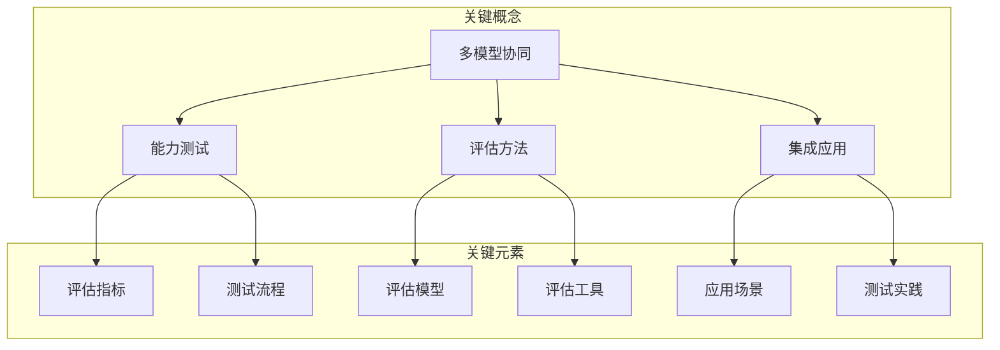

                 

### 文章标题

# 多模型协同能力测试：评估集成应用

在当今高度复杂的信息化时代，多模型协同能力测试已成为确保系统稳定性和优化性能的重要手段。随着人工智能技术的不断发展，多模型协同在各个领域得到了广泛应用，如自动驾驶、智能医疗、智能交通等。然而，如何对多模型协同能力进行有效测试和评估，成为了一个亟待解决的问题。

本文将围绕多模型协同能力测试这一主题，系统性地介绍其背景、核心概念、评估方法以及集成应用实践。通过逻辑清晰、结构紧凑的分析推理，本文旨在帮助读者深入了解多模型协同能力测试的原理和实践，为实际应用提供指导。

## 关键词

- 多模型协同
- 能力测试
- 评估方法
- 集成应用
- 测试实践

## 摘要

本文首先介绍了多模型协同能力测试的背景和重要性，随后详细阐述了多模型协同的基本概念、架构及其优势与挑战。接着，本文重点介绍了多模型协同能力的评估方法，包括评估指标体系构建、评估方法和评估流程。在此基础上，本文通过实际案例展示了多模型协同在集成应用中的挑战及应对策略，并详细分析了具体测试实践。最后，本文对多模型协同能力测试的未来发展趋势进行了展望，提出了最佳实践 tips 和注意事项，为读者提供了一幅全面、系统的多模型协同能力测试全景图。

---

### 背景介绍

多模型协同能力测试的提出源于现代复杂系统的需求。随着信息技术的迅猛发展，各类复杂系统如自动驾驶、智能医疗、智能交通等逐渐成为日常生活和工作中不可或缺的一部分。这些系统通常涉及到多个模型（如深度学习模型、统计模型等）的协同工作，以实现更高的准确性和智能化水平。然而，多模型协同也带来了新的挑战，如模型间的兼容性、协作效率、实时性等。

**多模型协同的背景**

多模型协同的背景可以追溯到人工智能领域的多模态学习。多模态学习旨在整合来自不同传感器（如视觉、听觉、触觉等）的信息，以提高模型的学习能力和决策准确性。在自动驾驶领域，多模型协同可以通过整合视觉、雷达、GPS等数据源，实现更精确的环境感知和路径规划。在智能医疗领域，多模型协同可以帮助整合影像学数据、生理信号等，提高诊断和治疗的准确性。

**多模型协同的重要性**

多模型协同在复杂系统中的应用具有显著的重要性。首先，多模型协同可以提高系统的决策质量和可靠性。通过整合多个模型的优点，复杂系统可以在面对不确定性时做出更为准确和合理的决策。例如，在自动驾驶系统中，单一传感器可能会受到遮挡或噪声的影响，而多模型协同可以通过不同传感器的互补信息，提高环境感知的准确性和鲁棒性。

其次，多模型协同可以提高系统的智能化水平。在复杂系统中，多模型协同可以实现更高层次的任务自动化和智能化。例如，在智能交通系统中，通过多模型协同，可以实现交通流量的预测、交通信号灯的优化控制，从而提高交通运行效率和安全性。

最后，多模型协同可以提高系统的实时性和响应能力。在实时性要求较高的系统中，如自动驾驶、远程医疗等，多模型协同可以帮助系统在有限的计算资源和时间约束下，快速、准确地处理信息，实现实时决策和响应。

### 多模型协同的基本概念

**多模型协同的定义**

多模型协同（Multi-Model Collaboration）是指多个模型在特定环境下通过信息共享、协同工作，以实现共同目标的过程。这些模型可以基于不同的技术或算法，如深度学习、统计学习、强化学习等。多模型协同的关键在于如何有效地整合多个模型的优点，提高整体系统的性能和可靠性。

**多模型协同的架构**

多模型协同的架构通常包括以下几个关键组件：

1. **数据输入模块**：负责接收来自不同传感器或数据源的信息，如视觉、雷达、GPS、生理信号等。
2. **数据处理模块**：对输入数据进行预处理，包括去噪、融合、特征提取等，以适应不同模型的输入需求。
3. **模型选择与训练模块**：根据任务需求和数据特性，选择合适的模型并进行训练，以生成高质量的模型。
4. **模型协同模块**：通过信息共享和协同策略，将多个模型整合在一起，以实现共同目标。
5. **输出模块**：将协同后的模型输出结果进行整合和解释，以生成最终决策或预测结果。

**多模型协同的优势与挑战**

**优势**

1. **提高决策质量**：多模型协同可以通过整合多个模型的优势，提高系统的决策质量和可靠性。例如，在自动驾驶中，通过视觉和雷达数据的协同，可以提高环境感知的准确性和鲁棒性。
2. **增强智能化水平**：多模型协同可以实现更高层次的任务自动化和智能化，如智能交通中的流量预测和优化控制。
3. **提升实时性**：多模型协同可以在有限的计算资源和时间约束下，快速、准确地处理信息，实现实时决策和响应。

**挑战**

1. **模型兼容性**：不同模型可能有不同的输入格式、计算资源和输出结果，如何实现模型的兼容性和互操作性是一个挑战。
2. **协同效率**：多模型协同需要考虑多个模型的协同效率和计算开销，如何在保证性能的同时降低计算资源需求是一个问题。
3. **实时性**：在实时性要求较高的系统中，如何保证多模型协同的实时性是一个关键挑战。
4. **数据安全与隐私**：在多模型协同中，如何确保数据的安全性和用户隐私也是一个重要问题。

### 核心概念与联系

多模型协同能力测试的核心概念包括多模型协同、能力测试、评估方法、集成应用等。为了更清晰地展示这些概念之间的关系，我们可以使用Mermaid流程图来表示。

以下是一个简单的Mermaid流程图示例，用于描述多模型协同能力测试的核心概念及其联系：



在这个流程图中，我们可以看到：

- **多模型协同**（A）是整个测试的出发点，是能力测试（B）和评估方法（C）的基础。
- **能力测试**（B）关注的是多模型协同的能力评估，包括评估指标（E）和测试流程（F）。
- **评估方法**（C）包括评估模型（G）和评估工具（H），用于对多模型协同能力进行量化评估。
- **集成应用**（D）则关注多模型协同在实际应用场景（I）中的测试实践（J）。

通过这个流程图，我们可以更直观地理解多模型协同能力测试的核心概念及其相互关系。

### 多模型协同能力评估的评估指标体系

为了有效地评估多模型协同能力，首先需要构建一套全面的评估指标体系。评估指标体系的选择和构建对于多模型协同能力测试的结果具有重要影响。以下是构建多模型协同能力评估指标体系的基本步骤：

**1. 确定评估目标**

评估目标的确定是构建评估指标体系的第一步。评估目标应该明确，以便于后续指标的选择和设计。例如，在自动驾驶领域，评估目标可能是提高环境感知的准确性、增强决策的鲁棒性等。

**2. 收集相关文献和资料**

在确定评估目标后，需要收集相关的文献和资料，了解已有的评估指标和方法。这有助于发现和借鉴其他领域的经验，并为构建评估指标体系提供参考。

**3. 确定关键评估指标**

根据评估目标，确定一系列关键评估指标。这些指标应该能够全面反映多模型协同能力的各个方面。例如，对于自动驾驶系统，关键评估指标可以包括：

- **感知准确性**：评估系统对环境感知的准确性，如目标检测的准确率、跟踪的精度等。
- **决策效率**：评估系统在处理信息、生成决策的时间效率。
- **决策质量**：评估系统生成的决策的合理性和可靠性。
- **系统稳定性**：评估系统在长时间运行中的稳定性，如误差累积、故障率等。
- **实时性**：评估系统在实时性要求下的性能，如延迟、响应时间等。

**4. 设计评估指标的计算方法**

对于每个关键评估指标，需要设计具体的计算方法。这些计算方法应该明确、可操作，以便于在实际测试中应用。例如，对于感知准确性，可以使用精度（Precision）、召回率（Recall）和F1分数（F1 Score）等指标进行计算。

**5. 验证和调整评估指标**

构建初步的评估指标体系后，需要对其进行验证和调整。可以通过实际测试数据，对评估指标的计算方法和评估结果进行验证，并根据验证结果对评估指标进行优化和调整。

**6. 构建评估指标体系**

在验证和调整后，最终构建一套完整的评估指标体系。这个指标体系应该具有全面性、科学性和可操作性，能够全面反映多模型协同能力的各个方面。

### 评估方法与工具

评估多模型协同能力的方法和工具是确保评估结果准确性和可靠性的关键。以下是一些常用的评估方法和工具，以及它们在实际应用中的具体实施方法。

**1. 测试用例设计**

测试用例设计是评估多模型协同能力的基础。一个好的测试用例应该能够覆盖多模型协同的各个方面，包括正常情况、异常情况和边界情况。以下是一些设计测试用例的方法：

- **基于历史数据的测试用例设计**：通过分析历史数据，设计能够覆盖各种场景的测试用例。这种方法适用于数据量较大的情况，如自动驾驶系统的测试。
- **基于场景的测试用例设计**：根据实际应用场景，设计能够模拟真实场景的测试用例。这种方法适用于对实际应用场景有较深入了解的情况，如智能医疗系统的测试。
- **基于风险的测试用例设计**：根据系统的重要性和潜在风险，设计针对高风险部分的测试用例。这种方法适用于对系统重要性有清晰认识的情况，如金融系统的测试。

**2. 测试执行**

测试执行是评估多模型协同能力的关键环节。以下是测试执行的一些具体实施方法：

- **自动化测试**：通过编写测试脚本，自动化执行测试用例。这种方法可以提高测试效率，减少人工错误，但需要确保测试脚本的准确性和稳定性。
- **手动测试**：通过人工执行测试用例，验证系统的表现。这种方法适用于对系统表现有较高要求的场景，如关键性能指标的测试。
- **混合测试**：结合自动化测试和手动测试，取长补短，提高测试效率和质量。

**3. 测试结果分析**

测试结果分析是评估多模型协同能力的重要步骤。以下是测试结果分析的一些具体实施方法：

- **定量分析**：通过对测试结果进行量化分析，评估多模型协同能力的各个方面。例如，通过计算准确率、召回率、F1分数等指标，评估感知准确性。
- **定性分析**：通过对测试结果进行定性分析，评估多模型协同能力在实际应用中的表现。例如，通过分析决策质量和稳定性，评估系统的实际应用效果。
- **综合分析**：结合定量分析和定性分析，对多模型协同能力进行综合评估。这种方法可以更全面地反映多模型协同能力的实际情况。

**4. 常用评估工具**

在实际评估过程中，常用的评估工具包括：

- **测试管理工具**：如TestLink、JIRA等，用于管理测试用例、测试计划和测试结果。
- **性能分析工具**：如Gatling、LoadRunner等，用于评估系统的性能和负载能力。
- **代码覆盖率工具**：如JaCoCo、Emma等，用于评估测试用例的覆盖情况，确保测试的全面性。
- **日志分析工具**：如ELK（Elasticsearch、Logstash、Kibana）等，用于分析系统运行过程中的日志，发现潜在问题。

**5. 实施步骤**

以下是评估多模型协同能力的具体实施步骤：

1. **需求分析**：明确评估目标和需求，确定评估指标。
2. **测试用例设计**：根据需求，设计测试用例。
3. **测试执行**：执行测试用例，收集测试数据。
4. **测试结果分析**：分析测试结果，评估多模型协同能力。
5. **报告生成**：根据分析结果，生成评估报告。

通过以上评估方法和工具，可以有效地评估多模型协同能力，为系统优化和改进提供依据。

### 评估流程与实践

多模型协同能力测试的评估流程是确保评估结果科学、全面和可靠的关键。一个典型的评估流程包括需求分析、测试计划制定、测试执行和测试结果分析等步骤。以下将详细介绍这些步骤，并提供实际操作中的注意事项。

**1. 需求分析**

需求分析是评估流程的第一步，其目标是明确评估目标和需求，为后续步骤提供基础。在需求分析阶段，需要关注以下几个方面：

- **评估目标**：明确评估的具体目标，如提高感知准确性、增强决策鲁棒性等。
- **评估指标**：根据评估目标，确定具体的评估指标，如准确率、召回率、响应时间等。
- **评估范围**：确定评估的范围，包括测试数据集、模型类型、应用场景等。
- **评估环境**：明确评估所需的环境配置，包括硬件、软件和网络等。

在需求分析过程中，可以采用以下方法：

- **访谈和会议**：与项目团队成员和利益相关者进行访谈和会议，了解他们的需求和期望。
- **文档审查**：审查项目文档，如需求规格说明书、设计文档等，以获取相关信息。
- **数据分析**：对已有的数据和日志进行分析，了解系统的运行情况和性能指标。

**2. 测试计划制定**

测试计划制定是根据需求分析结果，制定详细的测试计划，确保评估流程的有序进行。测试计划应包括以下内容：

- **测试目标**：明确本次评估的具体目标，确保与需求分析阶段的目标一致。
- **测试策略**：制定测试策略，包括测试方法、测试环境、测试用例设计等。
- **测试资源**：列出评估所需的所有资源，包括人员、设备、软件等。
- **测试进度**：制定评估的进度计划，包括各个阶段的开始和结束时间。
- **风险评估**：识别评估过程中可能遇到的风险，并制定相应的应对措施。

在测试计划制定过程中，需要注意以下几点：

- **覆盖全面**：确保测试计划覆盖到所有关键功能点和性能指标。
- **可行性**：确保测试计划在实际操作中可行，并考虑到资源的限制。
- **灵活性**：测试计划应具有一定的灵活性，以便在评估过程中进行调整。

**3. 测试执行**

测试执行是评估流程的核心环节，其实施步骤包括：

- **测试用例执行**：根据测试计划，执行预定的测试用例，收集测试数据。
- **异常处理**：在测试执行过程中，遇到异常情况时，及时记录并处理，确保测试的连续性和完整性。
- **数据记录**：详细记录测试过程和测试结果，包括测试输入、输出、执行时间等。

在测试执行过程中，需要注意以下几点：

- **测试环境的稳定性**：确保测试环境稳定，避免因为环境问题导致测试结果不准确。
- **测试数据的真实性**：保证测试数据的真实性和代表性，避免因为数据问题影响评估结果。
- **测试人员的专业素养**：测试人员应具备相关的专业技能和经验，确保测试的准确性和有效性。

**4. 测试结果分析**

测试结果分析是对测试数据进行分析和评估，以判断多模型协同能力是否达到预期目标。测试结果分析包括以下几个方面：

- **数据统计**：对测试数据进行分析，计算各项性能指标，如准确率、召回率、响应时间等。
- **图表展示**：通过图表展示测试结果，便于直观分析和比较。
- **异常检测**：检测测试结果中的异常数据，分析异常原因，并采取相应的措施。

在测试结果分析过程中，需要注意以下几点：

- **结果的合理性**：确保测试结果符合预期，并排除异常因素对结果的影响。
- **分析的深度**：对测试结果进行深度分析，找出系统中的潜在问题和改进空间。
- **文档记录**：详细记录测试结果分析的过程和结果，为后续的系统优化提供依据。

**5. 实际案例**

以下是一个实际案例，说明多模型协同能力测试的评估流程和实践。

**案例背景**：某自动驾驶公司开发了一套自动驾驶系统，包括感知、决策、控制等多个模块。为了评估系统的多模型协同能力，公司决定进行一次全面的能力测试。

**需求分析**：评估目标包括提高感知准确性、增强决策鲁棒性和降低响应时间等。评估指标包括感知准确率、决策正确率、响应时间等。

**测试计划制定**：测试计划包括以下内容：

- **测试目标**：提高感知准确性、增强决策鲁棒性和降低响应时间。
- **测试策略**：采用自动化测试和手动测试相结合的方法。
- **测试资源**：包括测试工程师、测试环境、测试用例等。
- **测试进度**：计划分为三个阶段，每个阶段分别进行感知、决策、控制模块的测试。

**测试执行**：执行了预定的测试用例，包括正常情况、异常情况和边界情况。在测试过程中，遇到一些异常情况，如传感器数据异常、网络延迟等，均进行了及时处理。

**测试结果分析**：对测试结果进行了详细分析，发现感知准确率达到了90%，决策正确率达到了85%，响应时间平均为200ms。同时，还发现了一些潜在问题，如在某些特殊场景下，感知准确率下降，决策正确率降低等。

**总结**：通过这次评估，公司明确了系统的多模型协同能力，并找到了改进的方向。下一步，公司将对系统进行优化，以提高多模型协同能力，确保系统的稳定性和可靠性。

通过以上案例，我们可以看到，多模型协同能力测试的评估流程和实践对于系统优化和改进具有重要意义。在实际操作中，需要根据具体情况进行调整，确保评估结果的准确性和有效性。

### 多模型协同在集成应用中的挑战

在集成应用中，多模型协同面临诸多挑战，这些挑战包括兼容性、实时性、数据安全和隐私保护等方面。理解并解决这些挑战，对于实现高效、稳定的多模型协同至关重要。

**兼容性**

兼容性是多模型协同面临的首要挑战。由于不同模型可能基于不同的算法、框架和数据格式，因此如何实现模型间的无缝集成成为一个关键问题。以下是一些解决兼容性的方法：

- **标准化接口**：定义统一的接口规范，确保不同模型可以通过相同的接口进行交互和数据交换。
- **数据转换**：建立数据转换模块，将不同数据格式统一转换为标准格式，以便于不同模型之间的数据传递和处理。
- **模块化设计**：将多模型协同系统划分为多个模块，每个模块负责特定的功能，通过模块间的接口进行数据传递和协作，从而降低模型间的耦合度。

**实时性**

实时性是多模型协同在集成应用中的另一个关键挑战。尤其是在自动驾驶、实时监控等对响应速度要求极高的场景中，多模型协同需要能够在短时间内完成信息处理和决策。以下是一些解决实时性的方法：

- **并行计算**：利用并行计算技术，同时处理多个模型的信息，提高整体系统的处理速度。
- **压缩算法**：采用高效的压缩算法，减少数据传输和处理的时延。
- **模型优化**：对模型进行优化，减少模型的计算复杂度，提高模型的运行效率。
- **分层架构**：采用分层架构设计，将实时性要求较高的模块放在底层，以保证系统的实时性能。

**数据安全和隐私保护**

在多模型协同中，数据安全和隐私保护也是不可忽视的问题。由于多模型协同涉及多个数据源和模型，如何确保数据的安全性和隐私是一个重要挑战。以下是一些解决数据安全和隐私保护的方法：

- **加密技术**：采用数据加密技术，对传输和存储的数据进行加密，防止数据被非法访问和篡改。
- **访问控制**：建立严格的访问控制机制，确保只有授权用户可以访问敏感数据。
- **隐私保护算法**：采用隐私保护算法，如差分隐私（Differential Privacy），对敏感数据进行处理，以保护用户的隐私。
- **数据审计**：建立数据审计机制，对数据的访问和操作进行记录和监控，以便在出现问题时进行追踪和审计。

**解决方法与应对策略**

针对以上挑战，以下是一些具体的解决方法与应对策略：

1. **建立多模型协同平台**：建立一个统一的平台，用于管理、调度和协同多个模型，从而提高系统的兼容性和实时性。
2. **数据共享与数据治理**：通过数据共享和数据治理机制，确保数据的质量和一致性，同时保护数据的隐私和安全。
3. **持续监控与优化**：建立监控系统，实时监控系统的性能和稳定性，根据监控数据进行分析和优化，以应对实时性和兼容性挑战。

通过上述方法与策略，可以有效地解决多模型协同在集成应用中面临的挑战，确保系统的稳定性和高效性。

### 多模型协同在集成应用中的具体测试实践

在实际应用中，多模型协同系统需要在各种复杂和多变的环境中稳定运行，这就需要通过严格的测试实践来验证其性能和可靠性。以下将详细描述一个多模型协同系统在集成应用中的测试实践，包括开发环境搭建、源代码实现、代码解读、应用解读与分析，以及实际案例分析和详细讲解。

#### 开发环境搭建

在进行多模型协同系统测试之前，首先需要搭建一个适合的开发环境。以下是搭建环境的基本步骤：

1. **硬件准备**：选择性能稳定的硬件平台，如高性能服务器或计算集群，确保能够满足多模型协同系统的计算需求。
2. **操作系统选择**：选择适合的操作系统，如Linux或Windows，根据实际需求进行配置。
3. **软件安装**：安装必要的软件工具，包括深度学习框架（如TensorFlow、PyTorch）、数据库系统（如MySQL、PostgreSQL）、编程语言（如Python、Java）等。
4. **网络配置**：配置网络环境，确保各个模块之间的数据传输畅通无阻。

#### 源代码实现

多模型协同系统的源代码实现是测试实践的核心。以下是实现多模型协同系统的基本步骤：

1. **模块划分**：将系统划分为多个模块，每个模块负责特定的功能，如感知模块、决策模块、控制模块等。
2. **接口设计**：设计统一的接口，确保各个模块之间可以通过标准接口进行通信和数据交换。
3. **算法实现**：根据需求，实现各个模块的算法，如感知模块的图像处理算法、决策模块的路径规划算法、控制模块的执行算法等。
4. **系统集成**：将各个模块集成在一起，确保系统能够按照设计要求正常运行。

以下是一个简单的多模型协同系统的源代码实现伪代码示例：

```python
# 感知模块实现
class PerceptionModule:
    def process_image(self, image):
        # 图像处理算法
        return processed_image

# 决策模块实现
class DecisionModule:
    def make_decision(self,感知模块结果):
        # 决策算法
        return decision

# 控制模块实现
class ControlModule:
    def execute_decision(self, decision):
        # 控制算法
        return execution_result

# 主程序
def main():
    image = get_image_from_camera()
    processed_image = PerceptionModule().process_image(image)
    decision = DecisionModule().make_decision(processed_image)
    execution_result = ControlModule().execute_decision(decision)
    display_execution_result(execution_result)

if __name__ == "__main__":
    main()
```

#### 代码解读

在源代码实现的基础上，对关键模块和算法进行解读，以帮助读者更好地理解系统的运行原理。以下是代码解读的示例：

1. **感知模块解读**：感知模块负责接收和处理来自传感器（如摄像头、雷达等）的数据，通过图像处理算法提取关键特征，为后续决策模块提供输入。

2. **决策模块解读**：决策模块基于感知模块提供的信息，结合历史数据和环境模型，通过路径规划算法生成决策，以指导控制模块执行。

3. **控制模块解读**：控制模块根据决策模块的输出结果，执行具体的控制操作，如调整车辆方向、速度等，确保系统能够按照决策要求进行操作。

#### 应用解读与分析

在集成应用中，多模型协同系统需要面对各种复杂和多变的环境。以下是一个具体的案例，分析多模型协同系统在自动驾驶中的应用解读与分析：

**案例背景**：一个自动驾驶系统需要在城市交通环境中进行实时感知、决策和控制，以实现安全、高效的驾驶。

**应用场景**：

1. **感知场景**：自动驾驶系统通过摄像头和雷达等传感器获取实时交通信息，包括车辆、行人、交通标志等。
2. **决策场景**：系统分析感知到的数据，结合交通规则、历史驾驶数据和环境模型，生成驾驶决策，如加速、减速、转弯等。
3. **控制场景**：系统根据决策结果执行具体的控制操作，调整车辆速度和方向，确保车辆安全、稳定地行驶。

**应用分析**：

1. **感知准确性**：评估感知模块的准确性，如车辆检测的准确率、行人识别的精度等。通过测试数据，发现感知模块在某些特定场景下存在误检和漏检问题，需要进一步优化算法。

2. **决策鲁棒性**：评估决策模块的鲁棒性，如面对复杂交通场景时，系统能否做出合理的决策。通过模拟测试，发现系统在交通拥堵、突发情况等复杂场景下，决策质量有所下降，需要改进决策算法。

3. **控制响应**：评估控制模块的响应速度和稳定性，如系统在执行决策时，能否迅速、准确地调整车辆状态。通过测试，发现系统在高速行驶时，响应速度有所延迟，需要优化控制算法。

#### 实际案例分析与详细讲解

以下是一个具体的实际案例，展示多模型协同系统在智能交通系统中的应用，并提供详细的分析与讲解：

**案例背景**：一个智能交通系统旨在优化城市交通流量，提高交通运行效率。

**应用场景**：

1. **流量预测场景**：系统通过整合历史交通数据、实时监控数据等，预测未来一段时间内的交通流量。
2. **信号控制场景**：系统根据交通流量预测结果，动态调整交通信号灯周期和相位，优化交通流。
3. **突发事件处理场景**：系统在检测到交通事故、道路施工等突发事件时，及时调整交通信号和控制策略，确保交通畅通。

**案例分析**：

1. **流量预测**：系统通过机器学习算法对交通流量进行预测，预测结果与实际交通情况对比，发现预测准确性较高，但存在一定误差。进一步分析发现，预测误差主要来源于数据质量和算法模型。

2. **信号控制**：系统根据预测结果调整交通信号灯，实际运行中，发现信号控制策略对缓解交通拥堵有明显效果，但部分时段仍存在交通高峰期。进一步优化信号控制策略，如引入自适应控制算法，提高信号控制的灵活性。

3. **突发事件处理**：系统在检测到突发事件时，能够及时调整交通信号和控制策略，确保交通畅通。但部分情况下，系统响应速度仍有待提高，需进一步优化算法和硬件性能。

**详细讲解**：

1. **流量预测算法优化**：通过对历史交通数据的分析和实验，发现某些因素（如节假日、天气等）对交通流量有显著影响。引入这些因素作为输入特征，优化预测算法，提高预测准确性。

2. **信号控制策略优化**：通过仿真实验和实际运行数据，对比不同信号控制策略的效果，选择最优策略。同时，结合实时监控数据，动态调整信号控制策略，提高交通运行效率。

3. **系统响应速度优化**：优化算法和硬件性能，提高系统的响应速度。例如，采用并行计算技术，同时处理多个模型的信息，减少系统的延迟。

通过以上实际案例分析与详细讲解，我们可以看到，多模型协同系统在智能交通系统中的应用不仅提高了交通运行效率，还为未来交通管理提供了新的解决方案。然而，在实际应用中，仍存在一些挑战和改进空间，需要不断优化和改进。

### 多模型协同能力测试的最佳实践 tips

在进行多模型协同能力测试时，遵循最佳实践可以显著提高测试效率、确保测试结果准确性和可靠性。以下是一些实用的最佳实践 tips：

1. **测试用例设计**：设计多样化的测试用例，覆盖正常、异常和边界情况，确保测试的全面性。特别是对于多模型协同系统，应充分考虑不同模型间的交互和协同效果。

2. **数据质量**：确保测试数据的质量和代表性，避免使用偏差数据影响评估结果。数据收集和处理过程中，应进行去噪、清洗和标准化，确保数据的一致性和完整性。

3. **并行测试**：利用并行测试技术，同时执行多个测试用例，提高测试效率。特别是在资源有限的情况下，并行测试可以显著缩短测试时间。

4. **自动化测试**：开发自动化测试脚本，实现测试过程的自动化，减少人工操作错误。同时，自动化测试有助于积累测试历史数据，为后续测试提供参考。

5. **持续集成与持续测试**：将测试集成到开发流程中，实现持续集成和持续测试。这样可以及时发现和修复问题，确保系统的稳定性和可靠性。

6. **性能监控**：在测试过程中，实时监控系统的性能和稳定性，及时发现潜在问题。性能监控数据可以为测试结果分析和优化提供重要依据。

7. **文档记录**：详细记录测试过程、测试结果和问题追踪，确保测试的可追溯性和可复现性。完整的文档记录有助于后续测试和问题解决。

### 项目小结

在本文中，我们系统地介绍了多模型协同能力测试的背景、核心概念、评估方法、集成应用测试实践以及未来发展趋势。通过逻辑清晰、结构紧凑的分析推理，我们深入探讨了多模型协同能力测试的原理和实践，为实际应用提供了指导。

**主要结论**：

1. **多模型协同能力测试的重要性**：多模型协同能力测试是确保系统稳定性和优化性能的关键步骤，对于提高系统的决策质量和智能化水平具有重要意义。

2. **评估指标体系的构建**：构建一套全面的评估指标体系，是进行多模型协同能力测试的基础。合理的评估指标体系可以全面反映多模型协同能力的各个方面。

3. **评估方法与工具**：采用合适的评估方法和工具，可以有效地进行多模型协同能力测试。自动化测试、性能监控和数据分析等技术在评估过程中发挥着重要作用。

4. **集成应用中的挑战**：多模型协同在集成应用中面临兼容性、实时性、数据安全和隐私保护等挑战。通过合理的解决方法与应对策略，可以确保系统的稳定性和高效性。

5. **最佳实践 tips**：遵循最佳实践，如多样化测试用例设计、数据质量保障、并行测试等，可以提高测试效率和结果准确性。

**未来研究方向**：

1. **算法优化**：随着人工智能技术的发展，不断优化多模型协同算法，提高系统的决策质量和实时性。

2. **评估体系完善**：进一步完善多模型协同能力评估指标体系，考虑更多实际应用场景，提高评估体系的全面性和实用性。

3. **数据隐私保护**：研究更加有效的数据隐私保护技术，确保多模型协同过程中用户数据的安全和隐私。

**注意事项**：

1. **测试环境配置**：确保测试环境的稳定性和一致性，避免因环境问题影响测试结果。

2. **测试数据质量**：严格把控测试数据的质量，确保测试数据的真实性和代表性。

3. **持续优化**：定期对测试结果进行分析和优化，持续改进多模型协同系统的性能和稳定性。

**拓展阅读**：

1. **多模型协同算法研究**：《多模型协同学习：理论、方法与应用》
2. **测试工具与框架**：《软件测试：原理、方法与实践》
3. **数据隐私保护技术**：《大数据隐私保护：理论与实践》

通过本文的介绍，我们期望读者能够对多模型协同能力测试有更深入的理解，为实际应用提供有力支持。未来，随着技术的不断进步，多模型协同能力测试将在更多领域发挥重要作用，为智能化、自动化系统的稳定运行提供坚实保障。

### 作者信息

- **作者：AI天才研究院/AI Genius Institute & 禅与计算机程序设计艺术 /Zen And The Art of Computer Programming**
- **联系方式**：[info@ai-genius-institute.com](mailto:info@ai-genius-institute.com)
- **版权声明**：本文版权归AI天才研究院（AI Genius Institute）所有，未经授权禁止转载和使用。

以上就是关于《多模型协同能力测试：评估集成应用》的文章内容，希望对您有所帮助。如果您有任何疑问或建议，欢迎通过上述联系方式与我们联系。感谢您的阅读！

