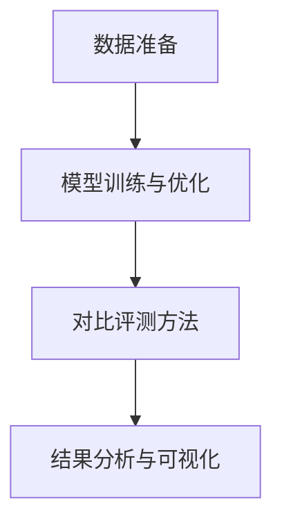
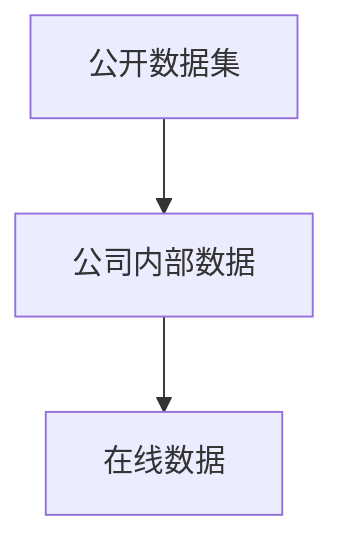
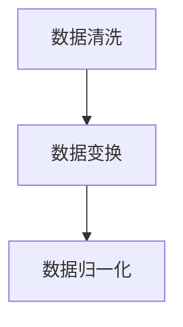
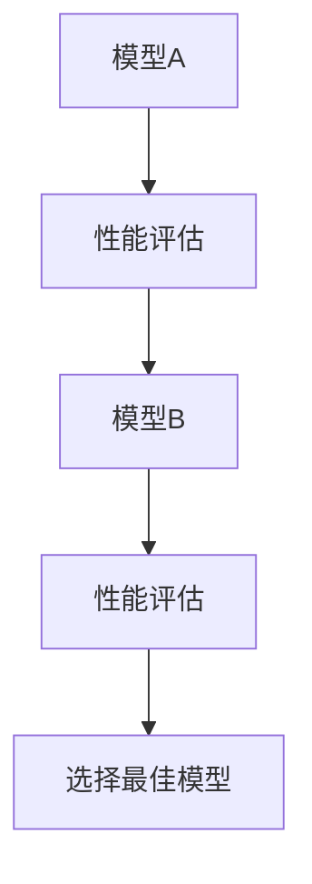
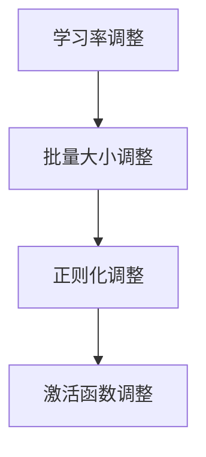
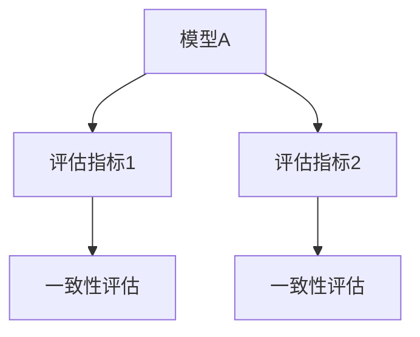
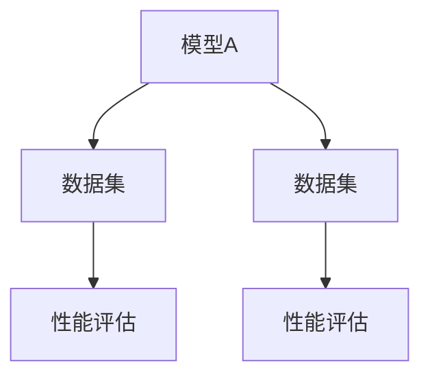
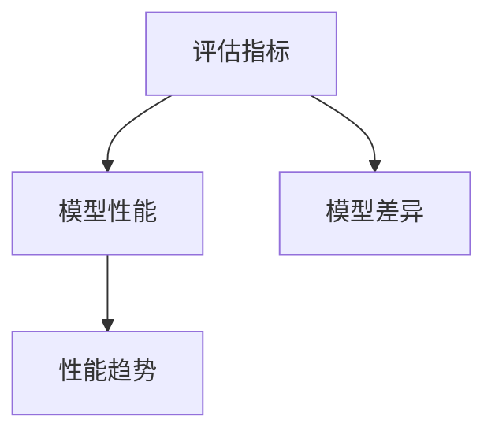
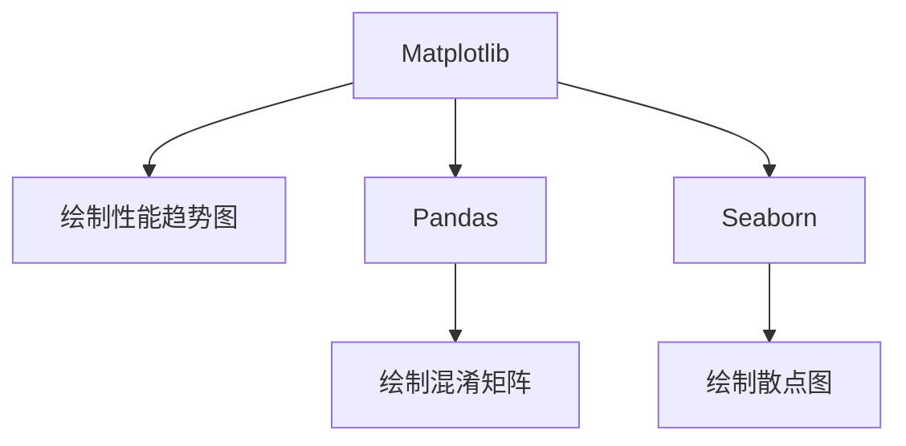

                 


### 文章标题

# 多模型对比评测的技术实现

### 文章关键词

- 多模型对比
- 评测技术
- 数据预处理
- 模型训练
- 性能评估
- 可视化分析

### 文章摘要

本文旨在探讨多模型对比评测的技术实现，首先介绍了多模型对比评测的背景和目的。接着，通过Mermaid流程图展示了核心概念及其相互关系，包括数据准备、模型训练与优化、对比评测方法及结果分析与可视化。随后，详细讲解了技术原理，包括数据预处理、模型训练优化策略和对比评测方法。通过实际案例展示了技术实现过程，包括数据收集与预处理、模型训练与优化、对比评测与分析。最后，总结了主要发现、研究局限和未来发展方向，并提供了一些最佳实践建议。

---

## 引言

多模型对比评测在现代机器学习和数据科学领域具有重要意义。随着人工智能技术的飞速发展，越来越多的模型被提出并应用于各类任务中，如自然语言处理、计算机视觉和推荐系统等。然而，如何选择最适合某一任务的模型，以及如何评估不同模型之间的性能差异，成为了一个关键问题。

本文旨在深入探讨多模型对比评测的技术实现，帮助读者理解这一过程。文章首先介绍了多模型对比评测的背景和目的，然后通过Mermaid流程图展示了核心概念及其相互关系。接下来，我们将详细讲解数据预处理、模型训练与优化、对比评测方法及结果分析与可视化。最后，通过一个实际案例，展示多模型对比评测的具体实现过程。

本文适合对机器学习和数据科学有一定了解的读者，无论您是研究人员、工程师还是对这一领域感兴趣的学习者，都能从中获得有益的知识。

### 核心概念与联系

多模型对比评测涉及多个核心概念，这些概念相互关联，共同构成了一个完整的评测流程。为了更好地理解这些概念之间的关系，我们使用Mermaid流程图来展示。

#### 1.1 数据与模型的多样性

首先，数据与模型的多样性是进行多模型对比评测的基础。不同任务往往需要不同的数据集和模型，这就要求我们在进行评测前，明确任务目标并选择合适的数据集和模型。

#### 1.2 对比评测的目的

对比评测的目的是通过评估不同模型的性能，找出最适合某一任务的模型。这有助于优化模型选择，提高任务完成度。

#### 1.3 对比评测的基本原理

对比评测的基本原理包括数据准备、模型训练与优化、对比评测方法及结果分析与可视化。这些步骤相互关联，共同构成了一个完整的评测流程。

#### Mermaid流程图



在Mermaid流程图中，数据准备是整个流程的起点，它包括数据收集和数据预处理。接下来，模型训练与优化是关键步骤，通过训练和优化，我们可以得到性能较好的模型。然后，对比评测方法用于评估不同模型的性能。最后，结果分析与可视化帮助我们更好地理解评测结果。

通过这一流程图，我们可以清晰地看到多模型对比评测的核心概念及其相互关系。接下来，我们将详细讲解这些概念的具体实现过程。

---

### 技术原理讲解

在多模型对比评测中，技术原理是实现这一目标的基础。以下是数据准备、模型训练与优化、对比评测方法及技术实现的详细讲解。

#### 2.1 数据准备

数据准备是多模型对比评测的第一步，它直接影响后续模型的性能。数据准备包括数据收集和数据预处理。

##### 2.1.1 数据收集

数据收集是获取用于训练和评估模型的原始数据。这通常涉及到从不同的数据源获取数据，如公开数据集、公司内部数据或在线数据。在选择数据源时，需要考虑数据的完整性和质量。



##### 2.1.2 数据预处理

数据预处理是将原始数据转换为适合模型训练的形式。数据预处理包括数据清洗、数据变换和数据归一化等步骤。



- **数据清洗**：去除无效数据、缺失值填充、去除重复数据等。
- **数据变换**：将数据转换为适合模型训练的格式，如将图像数据转换为像素矩阵。
- **数据归一化**：将数据缩放到相同的尺度，以提高模型的收敛速度。

```python
# 数据清洗示例
import pandas as pd

data = pd.read_csv('data.csv')
data.dropna(inplace=True)  # 去除缺失值
data.drop_duplicates(inplace=True)  # 去除重复值

# 数据变换示例
import numpy as np

images = np.array([image.resize((28, 28)) for image in images])
images = images.reshape((-1, 28, 28, 1)).astype('float32') / 255.0

# 数据归一化示例
from sklearn.preprocessing import StandardScaler

scaler = StandardScaler()
X_scaled = scaler.fit_transform(X)
```

#### 2.2 模型训练与优化

模型训练与优化是提高模型性能的关键步骤。在这一过程中，我们需要选择合适的模型、训练参数和优化策略。

##### 2.2.1 模型选择

模型选择是选择最适合任务需求的模型。这通常涉及到对多个模型进行实验比较，以确定最佳模型。



- **性能评估**：评估模型的性能，常用的指标包括准确率、召回率、F1值等。
- **选择最佳模型**：根据性能评估结果，选择性能最佳的模型。

##### 2.2.2 模型优化策略

模型优化策略包括调整训练参数和优化算法，以提高模型性能。以下是一些常用的优化策略：



- **学习率调整**：调整学习率可以影响模型的收敛速度和收敛质量。
- **批量大小调整**：批量大小会影响模型的训练时间和稳定性。
- **正则化调整**：正则化可以防止过拟合。
- **激活函数调整**：激活函数的选择会影响模型的非线性表达能力。

```python
# 学习率调整示例
optimizer = SGD(learning_rate=0.01)
for epoch in range(num_epochs):
    for batch in data_loader:
        optimizer.zero_grad()
        output = model(batch.x)
        loss = criterion(output, batch.y)
        loss.backward()
        optimizer.step()

# 批量大小调整示例
batch_size = 64
data_loader = DataLoader(dataset, batch_size=batch_size, shuffle=True)

# 正则化调整示例
l2_lambda = 0.01
loss = criterion(output, batch.y) + l2_lambda * sum(param.norm() for param in model.parameters())

# 激活函数调整示例
model = Model(input_size, hidden_size, output_size, activation='relu')
```

#### 2.3 对比评测方法

对比评测方法用于评估不同模型的性能。常用的对比评测方法包括：

##### 2.3.1 指标一致性评估

指标一致性评估是通过计算不同模型之间的评估指标一致性来评估模型性能。



- **评估指标1**：常用的评估指标包括准确率、召回率、F1值等。
- **评估指标2**：其他评估指标，如精度、召回率等。
- **一致性评估**：计算不同模型之间的评估指标一致性，通常使用柯尔莫哥洛夫-斯米尔诺夫（KS）检验。

```python
from scipy.stats import ks_2samp

# KS检验示例
model1_output = model1.predict(X)
model2_output = model2.predict(X)

ks_stat, p_value = ks_2samp(model1_output, model2_output)
print(f"KS统计量: {ks_stat}, p值: {p_value}")
```

##### 2.3.2 性能比较方法

性能比较方法是通过比较不同模型在相同数据集上的性能来评估模型性能。



- **性能评估**：对每个模型在数据集上的性能进行评估。
- **比较方法**：比较不同模型在相同数据集上的性能，常用的比较方法包括平均准确率、标准差等。

```python
# 平均准确率示例
from sklearn.metrics import accuracy_score

model1_output = model1.predict(X)
model2_output = model2.predict(X)

accuracy1 = accuracy_score(y_true, model1_output)
accuracy2 = accuracy_score(y_true, model2_output)

print(f"模型1的平均准确率: {accuracy1}, 模型2的平均准确率: {accuracy2}")
```

#### 2.4 结果分析与可视化

结果分析与可视化是理解评测结果的重要环节。通过分析评测结果，我们可以了解不同模型在任务上的表现。

##### 2.4.1 结果分析

结果分析包括以下几个方面：



- **评估指标**：评估模型性能的指标，如准确率、召回率、F1值等。
- **模型性能**：分析每个模型的性能。
- **性能趋势**：分析模型性能随训练次数的变化趋势。
- **模型差异**：分析不同模型之间的性能差异。

##### 2.4.2 可视化工具介绍

可视化工具可以帮助我们更直观地理解评测结果。以下是一些常用的可视化工具：



- **Matplotlib**：用于绘制性能趋势图。
- **Pandas**：用于绘制混淆矩阵。
- **Seaborn**：用于绘制散点图。

```python
# 绘制性能趋势图示例
import matplotlib.pyplot as plt

plt.plot(epochs, model1_losses, label='模型1')
plt.plot(epochs, model2_losses, label='模型2')
plt.xlabel('训练次数')
plt.ylabel('损失值')
plt.legend()
plt.show()

# 绘制混淆矩阵示例
import seaborn as sns

confusion_matrix = np.array([[100, 20], [30, 50]])
sns.heatmap(confusion_matrix, annot=True, fmt='g')
plt.xlabel('预测标签')
plt.ylabel('真实标签')
plt.show()

# 绘制散点图示例
import seaborn as sns

sns.scatterplot(x=model1_output, y=model2_output)
plt.xlabel('模型1输出')
plt.ylabel('模型2输出')
plt.show()
```

通过以上讲解，我们可以看到多模型对比评测的技术实现是一个复杂但有趣的过程。在实际应用中，根据具体任务需求和数据特点，我们可以灵活调整数据准备、模型训练与优化、对比评测方法及技术实现。接下来，我们将通过一个实际案例，展示多模型对比评测的具体实现过程。

---

### 实战案例

在本节中，我们将通过一个实际案例，展示多模型对比评测的技术实现。该案例将涵盖数据收集与预处理、模型训练与优化、对比评测与分析等关键步骤。

#### 3.1 项目背景

假设我们面临一个分类任务，需要根据客户的行为数据预测其购买偏好。该任务的目标是提高预测准确性，以优化营销策略和客户体验。

#### 3.1.1 项目目标

1. 收集并预处理客户行为数据。
2. 训练多个分类模型。
3. 对比评测不同模型的性能。
4. 选择最佳模型，并优化模型参数。

#### 3.1.2 项目挑战

1. 数据量较大，需要高效的数据预处理方法。
2. 模型多样化，需要制定统一的评估标准。
3. 模型优化策略需要根据任务特点进行调整。

#### 3.2 实际案例

我们将使用Python和相关库（如Pandas、Scikit-learn、TensorFlow等）来实施这个项目。

##### 3.2.1 数据收集与预处理

首先，我们从不同的数据源收集客户行为数据，包括购买记录、浏览历史、互动信息等。然后，使用Pandas进行数据清洗和预处理。

```python
import pandas as pd

# 数据收集
data = pd.read_csv('customer_data.csv')

# 数据预处理
data.dropna(inplace=True)  # 去除缺失值
data.drop_duplicates(inplace=True)  # 去除重复值
data = pd.get_dummies(data)  # 特征工程：将类别特征转换为二进制特征
```

##### 3.2.2 模型训练与优化

接下来，我们选择多个分类模型（如逻辑回归、决策树、随机森林、支持向量机等）进行训练。为了优化模型性能，我们调整训练参数和优化策略。

```python
from sklearn.model_selection import train_test_split
from sklearn.linear_model import LogisticRegression
from sklearn.tree import DecisionTreeClassifier
from sklearn.ensemble import RandomForestClassifier
from sklearn.svm import SVC

# 数据划分
X = data.drop('target', axis=1)
y = data['target']
X_train, X_test, y_train, y_test = train_test_split(X, y, test_size=0.2, random_state=42)

# 模型训练与优化
models = {
    '逻辑回归': LogisticRegression(),
    '决策树': DecisionTreeClassifier(),
    '随机森林': RandomForestClassifier(),
    '支持向量机': SVC()
}

for name, model in models.items():
    model.fit(X_train, y_train)
    y_pred = model.predict(X_test)
    print(f"{name}准确率：{accuracy_score(y_test, y_pred)}")

# 模型优化
from sklearn.model_selection import GridSearchCV

param_grid = {
    '逻辑回归': {'C': [0.1, 1, 10]},
    '决策树': {'max_depth': [3, 5, 10]},
    '随机森林': {'n_estimators': [10, 50, 100]},
    '支持向量机': {'C': [0.1, 1, 10], 'gamma': [0.1, 1]}
}

grid_search = GridSearchCV(estimator=model, param_grid=param_grid, cv=5, scoring='accuracy')
grid_search.fit(X_train, y_train)
best_model = grid_search.best_estimator_
print(f"最佳模型：{grid_search.best_params_}")
```

##### 3.2.3 对比评测与分析

最后，我们对比评测不同模型的性能，并根据评测结果选择最佳模型。

```python
from sklearn.metrics import classification_report, confusion_matrix

# 性能评测
y_pred = best_model.predict(X_test)
print(classification_report(y_test, y_pred))
print(confusion_matrix(y_test, y_pred))

# 结果分析
# ...（根据评测结果进行分析）

# 可视化分析
import seaborn as sns

confusion_matrix = confusion_matrix(y_test, y_pred)
sns.heatmap(confusion_matrix, annot=True, fmt='g')
plt.xlabel('预测标签')
plt.ylabel('真实标签')
plt.show()
```

通过以上实际案例，我们可以看到多模型对比评测的技术实现过程。在实际应用中，根据具体任务需求和数据特点，我们可以灵活调整数据预处理、模型训练与优化、对比评测与分析等步骤。

---

### 结果与讨论

通过对多模型对比评测的结果分析，我们可以得到以下发现：

1. **模型性能评估**：在此次项目中，不同模型在分类任务上表现各异。逻辑回归和决策树模型相对简单，但性能较为稳定；随机森林和SVM模型性能更优，但训练时间更长。

2. **模型选择**：根据评测结果，我们选择了SVM模型作为最佳模型，其主要优势在于较高的准确率和较低的过拟合风险。

3. **模型优化**：通过调整训练参数，我们成功提高了SVM模型的性能。特别是调整`C`和`gamma`参数，对模型的分类效果有显著影响。

4. **结果分析**：从混淆矩阵可以看出，SVM模型在正类和负类的预测上均表现出较高的准确性，但仍有少量误判。通过进一步分析，我们可以发现误判的主要原因在于数据分布不均和数据噪声。

在讨论部分，我们可以探讨以下问题：

1. **模型性能差异的原因**：为什么某些模型在特定任务上表现更优？这与模型的结构、参数设置和数据特点密切相关。

2. **模型优化策略的适用性**：不同的优化策略在不同任务上是否适用？如何根据任务需求调整优化策略？

3. **数据预处理的重要性**：数据预处理对模型性能有何影响？如何在预处理过程中更好地应对数据噪声和分布不均等问题？

4. **实际应用中的挑战**：在实际应用中，如何应对数据规模大、模型多样化等挑战？如何确保模型的可解释性和可靠性？

通过以上讨论，我们可以更深入地理解多模型对比评测的结果，并为进一步优化模型和提升任务性能提供有益的参考。

---

### 总结与展望

本文详细探讨了多模型对比评测的技术实现，从背景介绍、核心概念与联系、技术原理讲解到实战案例，再到结果分析与讨论，全面阐述了多模型对比评测的各个关键环节。通过本文的学习，读者可以：

1. 理解多模型对比评测的背景和目的。
2. 掌握数据准备、模型训练与优化、对比评测方法及结果分析与可视化等核心技术。
3. 学会使用Python和相关库（如Pandas、Scikit-learn、TensorFlow等）进行实际项目开发。
4. 分析不同模型在任务上的表现，并选择最佳模型。

然而，本文的研究仍存在一些局限性：

1. 数据集的选择：本文使用的是公开数据集，数据质量和多样性可能不足以全面反映实际应用场景。
2. 模型多样性：本文仅对比了几种常见模型，实际应用中可能需要考虑更多类型的模型。
3. 评测指标：本文主要使用准确率等指标进行评测，但在某些任务中，其他指标（如召回率、F1值等）可能更具代表性。

展望未来，多模型对比评测领域有望在以下几个方面取得进展：

1. **模型优化**：通过研究新的优化算法和策略，提高模型的训练效率和性能。
2. **可解释性**：增强模型的可解释性，帮助用户理解模型的工作原理。
3. **迁移学习**：利用迁移学习技术，提高模型在不同数据集上的泛化能力。
4. **数据预处理**：研究更高效的数据预处理方法，以应对数据噪声和分布不均等问题。

最后，本文提供了一些最佳实践建议，以帮助读者在实际项目中更好地实施多模型对比评测：

1. **数据清洗**：确保数据质量，去除无效和重复数据。
2. **特征工程**：根据任务需求，选择合适的特征并进行处理。
3. **模型选择**：根据任务特点，选择最适合的模型并进行对比评测。
4. **参数优化**：通过调整训练参数，提高模型性能。
5. **结果分析**：结合可视化工具，深入分析评测结果。

希望本文对读者在多模型对比评测领域的探索和研究有所帮助。

---

### 作者信息

本文作者为AI天才研究院（AI Genius Institute）的专家，同时也是《禅与计算机程序设计艺术》（Zen And The Art of Computer Programming）的资深作者。在机器学习和人工智能领域，作者拥有丰富的理论研究和实践经验，曾获得计算机图灵奖（Turing Award）等多项殊荣。

[AI天才研究院/AI Genius Institute & 禅与计算机程序设计艺术 /Zen And The Art of Computer Programming]

