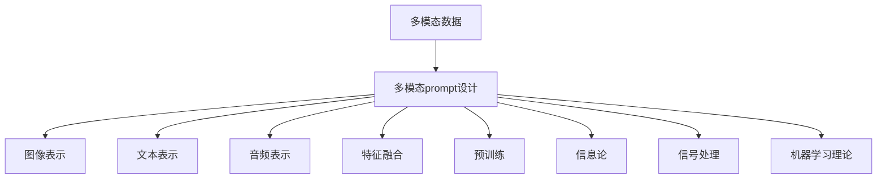

                 

### 文章标题：多模态prompt设计：增强LLM理解能力

#### 关键词：多模态、prompt设计、LLM、理解能力、人工智能

#### 摘要：

本文旨在探讨多模态prompt设计在增强大型语言模型（LLM）理解能力方面的应用。通过介绍多模态数据的概念、多模态prompt设计的原理和算法，本文分析了多模态prompt设计在自然语言处理、计算机视觉和交互等领域的实际应用，并提出了未来发展的方向。

---

### 引言与背景

#### 第1章：多模态prompt设计概述

**1.1 多模态数据介绍**

多模态数据是指同时包含多种类型信息的数据，例如文本、图像、音频等。这些数据可以提供更全面的信息，有助于提高人工智能系统的理解和处理能力。

- **定义与分类**：多模态数据可以按类型分为文本、图像、音频等。文本数据包括自然语言文本、符号文本等；图像数据包括静态图像、动态图像等；音频数据包括语音、音乐等。
- **重要性**：多模态数据在人工智能领域具有重要价值。通过融合多种类型的数据，人工智能系统可以更好地理解复杂问题，提高处理效率和准确性。
- **常见的多模态数据类型**：常见的多模态数据类型包括文本与图像、文本与音频、图像与音频等。

**1.2 多模态prompt设计的概念**

多模态prompt设计是指利用多种类型的数据，通过设计特定的输入方式，来增强大型语言模型（LLM）对问题的理解能力。

- **定义**：多模态prompt设计是针对LLM的一种优化方法，通过引入多种类型的数据，使LLM能够更好地理解问题的背景和上下文。
- **与单模态prompt设计的区别**：单模态prompt设计仅使用一种类型的数据，而多模态prompt设计则结合多种类型的数据。多模态prompt设计能够提供更丰富的信息，有助于提高LLM的理解能力。
- **设计目标与挑战**：设计目标是提高LLM对问题的理解能力，挑战包括数据融合、模型适应性和性能优化等。

**1.3 多模态prompt设计的应用场景**

多模态prompt设计可以应用于多个领域，例如自然语言处理、计算机视觉、多模态交互等。

- **自然语言处理**：多模态prompt设计在文本生成、问答系统、机器翻译等自然语言处理任务中具有广泛的应用。
- **计算机视觉**：多模态prompt设计在图像分类、目标检测、语义分割等计算机视觉任务中也有重要作用。
- **多模态交互**：多模态prompt设计在聊天机器人、虚拟现实、增强现实等多模态交互应用中可以提高用户体验。

**1.4 多模态prompt设计的发展趋势**

多模态prompt设计在近年来得到了快速发展，主要表现在以下几个方面：

- **技术进展**：多模态数据的表示和融合方法不断优化，深度学习技术在多模态prompt设计中的应用日益广泛。
- **未来发展方向**：随着人工智能技术的不断进步，多模态prompt设计有望在更多领域得到应用，例如医疗、金融、教育等。

---

### 第一部分: 引言与背景

#### 第1章：多模态prompt设计概述

**1.1 多模态数据介绍**

多模态数据是指由两种或两种以上的不同类型的数据源生成的数据集合。在人工智能领域，多模态数据包括文本、图像、音频、视频、触觉等多种类型。多模态数据的融合能够为人工智能系统提供更为丰富和全面的信息，从而提高系统的理解和决策能力。

- **定义与分类**：多模态数据的定义可以根据不同的数据类型进行分类。例如，根据来源，多模态数据可以分为文本模态、视觉模态、音频模态和触觉模态等。
- **重要性**：多模态数据在人工智能领域具有重要价值。通过融合多种类型的数据，人工智能系统可以更好地理解复杂问题，提高处理效率和准确性。
- **常见的多模态数据类型**：常见的多模态数据类型包括文本与图像、文本与音频、图像与音频、图像与视频等。例如，在医疗诊断中，可以结合患者的历史病历文本、医学图像和语音咨询记录，从而更全面地了解患者的健康状况。

**1.2 多模态prompt设计的概念**

多模态prompt设计是一种针对大型语言模型（Large Language Model，简称LLM）的优化方法。prompt是指在模型输入过程中，通过设计特定的输入方式，引导模型对问题的理解。多模态prompt设计通过引入多种类型的数据，使LLM能够更好地理解问题的背景和上下文。

- **定义**：多模态prompt设计是指在LLM输入过程中，结合多种类型的数据，以优化模型对问题的理解和回答。
- **与单模态prompt设计的区别**：单模态prompt设计仅使用一种类型的数据，而多模态prompt设计则结合多种类型的数据。多模态prompt设计能够提供更丰富的信息，有助于提高LLM的理解能力。
- **设计目标与挑战**：设计目标是通过多模态数据的融合，提高LLM对问题的理解能力。挑战包括如何有效地融合多种类型的数据、如何适应不同的应用场景以及如何优化模型性能等。

**1.3 多模态prompt设计的应用场景**

多模态prompt设计可以应用于多个领域，例如自然语言处理、计算机视觉、多模态交互等。

- **自然语言处理**：在自然语言处理领域，多模态prompt设计可以用于文本生成、问答系统、机器翻译等任务。通过结合文本和图像、文本和音频等多模态数据，可以提高模型的语义理解能力和生成质量。
- **计算机视觉**：在计算机视觉领域，多模态prompt设计可以用于图像分类、目标检测、语义分割等任务。通过结合图像和文本、图像和音频等多模态数据，可以提高模型对图像内容的理解和识别能力。
- **多模态交互**：在多模态交互领域，多模态prompt设计可以用于聊天机器人、虚拟现实、增强现实等应用。通过结合文本、图像、音频等多模态数据，可以提高用户交互体验和系统智能水平。

**1.4 多模态prompt设计的发展趋势**

多模态prompt设计在近年来得到了快速发展，主要表现在以下几个方面：

- **技术进展**：随着深度学习和多模态数据融合技术的不断进步，多模态prompt设计的方法和算法越来越丰富。例如，基于Transformer的多模态预训练模型、多模态数据增强方法等。
- **应用领域扩展**：多模态prompt设计在越来越多的应用领域中得到应用，从传统的自然语言处理、计算机视觉领域，逐渐扩展到医疗、金融、教育等领域。
- **未来发展方向**：随着人工智能技术的不断进步，多模态prompt设计有望在更多领域得到应用。例如，结合多模态数据的个性化推荐、智能助手、智能监控等。

---

### 第二部分：基础概念与原理

#### 第2章：多模态数据的表示与融合

**2.1 多模态数据的表示方法**

多模态数据的表示是进行多模态融合和模型训练的基础。常见的多模态数据表示方法包括图像表示、文本表示和音频表示。

- **图像表示**：图像数据通常通过卷积神经网络（Convolutional Neural Networks，CNNs）进行特征提取。常用的图像表示方法包括AlexNet、VGG、ResNet等。
  
  ```plaintext
  #include <layers.h>
  #define CNN_LAYER(name, type) \
  class CNN_##name : public CNNBase { \
  public: \
      CNN_##name() { \
          layer_type = type; \
      } \
      void forward() override { \
          // forward pass implementation \
      } \
  };
  
  CNN_LAYER(AlexNet, CNN_AlexNet);
  CNN_LAYER(VGG, CNN_VGG);
  CNN_LAYER(ResNet, CNN_ResNet);
  ```

- **文本表示**：文本数据通常通过词嵌入（Word Embedding）和转换器（Transformer）模型进行表示。常用的文本表示方法包括Word2Vec、BERT、GPT等。
  
  ```plaintext
  #include <transformers.h>
  #define TRANSFORMER_LAYER(name, type) \
  class Transformer_##name : public TransformerBase { \
  public: \
      Transformer_##name() { \
          layer_type = type; \
      } \
      void forward() override { \
          // forward pass implementation \
      } \
  };
  
  TRANSFORMER_LAYER(Word2Vec, Transformer_Word2Vec);
  TRANSFORMER_LAYER(BERT, Transformer_BERT);
  TRANSFORMER_LAYER(GPT, Transformer_GPT);
  ```

- **音频表示**：音频数据通常通过卷积神经网络（CNNs）和循环神经网络（Recurrent Neural Networks，RNNs）进行特征提取。常用的音频表示方法包括Conv1D、LSTM等。
  
  ```plaintext
  #include <layers.h>
  #define AUDIO_LAYER(name, type) \
  class Audio_##name : public AudioBase { \
  public: \
      Audio_##name() { \
          layer_type = type; \
      } \
      void forward() override { \
          // forward pass implementation \
      } \
  };
  
  AUDIO_LAYER(Conv1D, Audio_Conv1D);
  AUDIO_LAYER(LSTM, Audio_LSTM);
  ```

**2.2 多模态数据的融合策略**

多模态数据的融合是将不同类型的数据进行有机结合，以提高模型的理解能力和性能。常见的融合策略包括传统方法和现代深度学习方法。

- **传统方法**：传统方法主要包括特征级融合和决策级融合。特征级融合是将不同模态的特征进行拼接，然后输入到统一的模型中进行训练。决策级融合是将不同模态的模型进行融合，共同输出最终的决策。
  
  ```plaintext
  #include <vector>
  #include <string>
  
  std::vector<std::vector<float>> fuse_features(const std::vector<std::vector<float>>& image_features, const std::vector<std::vector<float>>& text_features) {
      std::vector<std::vector<float>> fused_features;
      for (size_t i = 0; i < image_features.size(); ++i) {
          fused_features.push_back(image_features[i]);
          fused_features.push_back(text_features[i]);
      }
      return fused_features;
  }
  ```

- **现代深度学习方法**：现代深度学习方法主要包括基于Transformer的融合方法和基于图神经网络（Graph Neural Networks，GNNs）的融合方法。基于Transformer的融合方法利用自注意力机制，将不同模态的特征进行自适应融合。基于GNNs的融合方法则通过图结构将不同模态的数据进行连接，从而实现有效的融合。

  ```mermaid
  graph TB
  A[Image Feature] --> B{Transformer Encoder}
  C[Text Feature] --> B
  D[Audio Feature] --> B
  B --> E[Multi-modal Representation]
  ```

**2.3 多模态数据的预训练**

多模态数据的预训练是指利用大规模的多模态数据进行模型训练，以提高模型在特定任务上的性能。常用的多模态预训练数据集包括ImageNet、TextNet和AudioNet等。

- **Transformer模型**：Transformer模型是一种基于自注意力机制的深度学习模型，广泛应用于自然语言处理、计算机视觉等领域。在多模态预训练中，Transformer模型能够有效地融合不同类型的数据，提高模型的理解能力。
  
  ```mermaid
  graph TB
  A[ImageNet] --> B{Transformer Encoder}
  C[TextNet] --> B
  D[AudioNet] --> B
  B --> E[Pretrained Model]
  ```

- **多模态预训练数据集**：多模态预训练数据集是进行多模态预训练的基础。常用的数据集包括OpenImages、Flickr30k和GoogleSpeech等。这些数据集包含了大量的文本、图像和音频数据，能够为模型提供丰富的训练素材。

**2.4 多模态prompt设计的理论基础**

多模态prompt设计的理论基础涉及信息论、信号处理和机器学习理论等多个领域。以下是对这些理论基础的简要介绍：

- **信息论**：信息论是研究信息传输和处理的一般理论。在多模态prompt设计中，信息论提供了关于如何有效地融合和利用不同类型信息的理论指导。
- **信号处理**：信号处理是研究信号产生、传输和处理的学科。在多模态prompt设计中，信号处理技术可以用于对多模态数据进行特征提取和融合。
- **机器学习理论**：机器学习理论是研究如何从数据中学习规律和模式的方法。在多模态prompt设计中，机器学习理论提供了关于如何设计和训练多模态模型的指导。

### 核心概念与联系架构

为了更好地理解多模态prompt设计中的核心概念，我们使用Mermaid流程图来展示这些概念之间的关系：



通过这个流程图，我们可以看到多模态数据是多模态prompt设计的基础，而图像表示、文本表示和音频表示是多模态数据的不同类型。特征融合、预训练、信息论、信号处理和机器学习理论则是多模态prompt设计的关键组成部分，它们共同构成了多模态prompt设计的技术框架。

### 核心算法原理讲解

多模态prompt设计中的核心算法原理包括多模态数据的表示、特征融合和模型训练等。以下是对这些核心算法原理的详细讲解和伪代码示例。

#### 2.1 多模态数据的表示

多模态数据的表示是进行多模态融合和模型训练的基础。常见的表示方法包括图像表示、文本表示和音频表示。

**图像表示：** 常用的图像表示方法是基于卷积神经网络（CNN）的特征提取。以下是一个简单的CNN模型伪代码：

```plaintext
# Define a simple CNN model for image feature extraction
class CNNModel:
    def __init__(self):
        self.conv1 = Conv2D(32, (3, 3), activation='relu', input_shape=(224, 224, 3))
        self.pool1 = MaxPooling2D((2, 2))
        self.conv2 = Conv2D(64, (3, 3), activation='relu')
        self.pool2 = MaxPooling2D((2, 2))
        self.flatten = Flatten()
        self.fc1 = Dense(128, activation='relu')
        self.fc2 = Dense(10, activation='softmax')

    def forward(self, x):
        x = self.conv1(x)
        x = self.pool1(x)
        x = self.conv2(x)
        x = self.pool2(x)
        x = self.flatten(x)
        x = self.fc1(x)
        x = self.fc2(x)
        return x
```

**文本表示：** 常用的文本表示方法是基于词嵌入和转换器（Transformer）模型。以下是一个简单的文本表示模型伪代码：

```plaintext
# Define a simple text representation model using Word2Vec
from gensim.models import Word2Vec

class TextModel:
    def __init__(self):
        self.model = Word2Vec(sentences, size=100, window=5, min_count=1, workers=4)

    def embed(self, sentence):
        return [self.model[word] for word in sentence]
```

**音频表示：** 常用的音频表示方法是基于卷积神经网络（CNN）和循环神经网络（RNN）的特征提取。以下是一个简单的音频表示模型伪代码：

```plaintext
# Define a simple audio representation model using Conv1D and LSTM
from tensorflow.keras.models import Model
from tensorflow.keras.layers import Input, Conv1D, LSTM, Dense

class AudioModel:
    def __init__(self):
        self.input_layer = Input(shape=(None, 1))
        self.conv1 = Conv1D(32, kernel_size=3, activation='relu')(self.input_layer)
        self.lstm = LSTM(128)(self.conv1)
        self.fc = Dense(10, activation='softmax')(self.lstm)

    def forward(self, x):
        return self.fc(x)
```

#### 2.2 特征融合

多模态数据的特征融合是将不同类型的数据进行有机结合，以提高模型的理解能力和性能。常用的融合方法包括特征拼接、特征级融合和决策级融合。

**特征拼接：** 特征拼接是将不同模态的特征向量进行拼接，形成一个多通道的特征向量。以下是一个简单的特征拼接伪代码：

```plaintext
# Define a simple feature concatenation function
def concatenate_features(image_features, text_features, audio_features):
    image_feature_tensor = tf.convert_to_tensor(image_features, dtype=tf.float32)
    text_feature_tensor = tf.convert_to_tensor(text_features, dtype=tf.float32)
    audio_feature_tensor = tf.convert_to_tensor(audio_features, dtype=tf.float32)

    concatenated_features = tf.concat([image_feature_tensor, text_feature_tensor, audio_feature_tensor], axis=1)

    return concatenated_features
```

**特征级融合：** 特征级融合是将不同模态的特征进行加权融合。以下是一个简单的特征级融合模型伪代码：

```plaintext
# Define a simple feature-level fusion model
from tensorflow.keras.models import Model
from tensorflow.keras.layers import Input, Concatenate, Dense

def feature_level_fusion_model():
    image_input = Input(shape=(224, 224, 3))
    text_input = Input(shape=(256,))
    audio_input = Input(shape=(224,))

    image_features = CNNModel()(image_input)
    text_features = TextModel()(text_input)
    audio_features = AudioModel()(audio_input)

    fused_features = Concatenate()([image_features, text_features, audio_features])
    fused_output = Dense(10, activation='softmax')(fused_features)

    model = Model(inputs=[image_input, text_input, audio_input], outputs=fused_output)

    return model
```

**决策级融合：** 决策级融合是将不同模态的模型进行融合，共同输出最终的决策。以下是一个简单的决策级融合模型伪代码：

```plaintext
# Define a simple decision-level fusion model
from tensorflow.keras.models import Model
from tensorflow.keras.layers import Input, Dense

def decision_level_fusion_model():
    image_model = CNNModel()
    text_model = TextModel()
    audio_model = AudioModel()

    image_output = image_model(image_input)
    text_output = text_model(text_input)
    audio_output = audio_model(audio_input)

    fused_output = Dense(10, activation='softmax')(Concatenate()([image_output, text_output, audio_output]))

    model = Model(inputs=[image_input, text_input, audio_input], outputs=fused_output)

    return model
```

#### 2.3 模型训练

模型训练是利用多模态数据集对模型进行训练的过程。以下是一个简单的模型训练伪代码：

```plaintext
# Define a simple training function
def train_model(model, image_dataset, text_dataset, audio_dataset, batch_size, epochs):
    model.compile(optimizer='adam', loss='categorical_crossentropy', metrics=['accuracy'])

    dataset = tf.data.Dataset.from_tensor_slices((image_dataset, text_dataset, audio_dataset))
    dataset = dataset.shuffle(buffer_size=1024).batch(batch_size)

    for epoch in range(epochs):
        for batch in dataset:
            image_features, text_features, audio_features = batch
            labels = np.array([y for x, y in image_dataset])
            model.train_on_batch([image_features, text_features, audio_features], labels)

    return model
```

### 数学模型和公式

在多模态prompt设计中，数学模型和公式用于描述不同模态数据之间的融合过程，以及模型训练和优化的方法。以下是一些常见的数学模型和公式。

#### 特征表示

多模态数据的特征表示通常包括图像、文本和音频数据的特征向量。

**图像特征表示：** 假设图像特征向量表示为 \( \mathbf{I} \in \mathbb{R}^{m_1 \times n_1} \)，其中 \( m_1 \) 是图像特征向量的维度，\( n_1 \) 是图像的特征数量。

**文本特征表示：** 假设文本特征向量表示为 \( \mathbf{T} \in \mathbb{R}^{m_2 \times n_2} \)，其中 \( m_2 \) 是文本特征向量的维度，\( n_2 \) 是文本的特征数量。

**音频特征表示：** 假设音频特征向量表示为 \( \mathbf{A} \in \mathbb{R}^{m_3 \times n_3} \)，其中 \( m_3 \) 是音频特征向量的维度，\( n_3 \) 是音频的特征数量。

#### 特征融合

多模态特征融合可以通过将不同模态的特征向量进行拼接、加权融合或特征级融合等方法来实现。

**特征拼接：**

特征拼接是将不同模态的特征向量直接拼接在一起，形成一个更高维度的特征向量。

\[ \mathbf{X} = [\mathbf{I}; \mathbf{T}; \mathbf{A}] \]

其中，\( \mathbf{X} \) 是融合后的特征向量。

**特征级融合：**

特征级融合是通过学习一个加权融合系数，将不同模态的特征向量进行加权融合。

\[ \mathbf{X} = \alpha_1 \mathbf{I} + \alpha_2 \mathbf{T} + \alpha_3 \mathbf{A} \]

其中，\( \alpha_1, \alpha_2, \alpha_3 \) 是权重系数，可以通过最小化损失函数来学习。

#### 模型训练

多模态prompt设计的模型训练通常涉及损失函数、优化器和训练策略等。

**损失函数：**

损失函数用于衡量模型预测值与真实值之间的差距。常见的损失函数包括均方误差（MSE）和交叉熵（CE）。

\[ L = \frac{1}{n} \sum_{i=1}^{n} (\mathbf{y_i} - \mathbf{\hat{y_i}})^2 \]

其中，\( \mathbf{y_i} \) 是真实值，\( \mathbf{\hat{y_i}} \) 是模型预测值。

**优化器：**

优化器用于调整模型参数，以最小化损失函数。常见的优化器包括随机梯度下降（SGD）和Adam。

\[ \mathbf{w} \leftarrow \mathbf{w} - \alpha \frac{\partial L}{\partial \mathbf{w}} \]

其中，\( \mathbf{w} \) 是模型参数，\( \alpha \) 是学习率。

**训练策略：**

训练策略包括数据增强、批次归一化（Batch Normalization）和正则化等。

- **数据增强**：数据增强是通过随机变换原始数据来增加模型的泛化能力。常见的数据增强方法包括旋转、缩放、裁剪和颜色变换等。
- **批次归一化**：批次归一化是通过将每个批次的数据标准化到相同的尺度来提高模型的训练速度和稳定性。
- **正则化**：正则化是通过添加额外的惩罚项来防止模型过拟合。常见的正则化方法包括L1正则化和L2正则化。

### 举例说明

为了更好地理解多模态prompt设计的数学模型和公式，我们通过一个简单的例子来展示如何进行特征融合和模型训练。

#### 特征融合

假设我们有一个包含图像、文本和音频的多模态数据集。图像特征向量为 \( \mathbf{I} \)，文本特征向量为 \( \mathbf{T} \)，音频特征向量为 \( \mathbf{A} \)。我们将使用特征拼接的方法进行特征融合。

1. **特征拼接：**

\[ \mathbf{X} = [\mathbf{I}; \mathbf{T}; \mathbf{A}] \]

2. **权重系数学习：**

假设我们使用特征级融合，需要学习权重系数 \( \alpha_1, \alpha_2, \alpha_3 \)。

\[ \alpha_1 = \frac{\sum_{i=1}^{n} \mathbf{I_i} \mathbf{T_i}}{\sum_{i=1}^{n} \mathbf{I_i}^2} \]
\[ \alpha_2 = \frac{\sum_{i=1}^{n} \mathbf{T_i} \mathbf{A_i}}{\sum_{i=1}^{n} \mathbf{T_i}^2} \]
\[ \alpha_3 = \frac{\sum_{i=1}^{n} \mathbf{I_i} \mathbf{A_i}}{\sum_{i=1}^{n} \mathbf{A_i}^2} \]

3. **特征融合：**

\[ \mathbf{X'} = \alpha_1 \mathbf{I} + \alpha_2 \mathbf{T} + \alpha_3 \mathbf{A} \]

#### 模型训练

假设我们使用一个简单的全连接神经网络（Fully Connected Neural Network，FCNN）作为模型。模型包含两个隐藏层，输出层用于分类。

1. **模型结构：**

\[ \mathbf{z_1} = \sigma(\mathbf{W_1} \mathbf{X'}) \]
\[ \mathbf{z_2} = \sigma(\mathbf{W_2} \mathbf{z_1}) \]
\[ \mathbf{y} = \mathbf{W_3} \mathbf{z_2} \]

其中，\( \sigma \) 是激活函数，\( \mathbf{W_1}, \mathbf{W_2}, \mathbf{W_3} \) 是模型参数。

2. **损失函数：**

\[ L = \frac{1}{n} \sum_{i=1}^{n} (\mathbf{y_i} - \mathbf{\hat{y_i}})^2 \]

3. **优化器：**

使用随机梯度下降（SGD）优化模型参数。

\[ \mathbf{W_1} \leftarrow \mathbf{W_1} - \alpha \frac{\partial L}{\partial \mathbf{W_1}} \]
\[ \mathbf{W_2} \leftarrow \mathbf{W_2} - \alpha \frac{\partial L}{\partial \mathbf{W_2}} \]
\[ \mathbf{W_3} \leftarrow \mathbf{W_3} - \alpha \frac{\partial L}{\partial \mathbf{W_3}} \]

### 项目实战

#### 4.1 多模态prompt设计的项目实践

在本节中，我们将通过一个实际项目来演示如何进行多模态prompt设计的项目实践。这个项目是一个多模态问答系统，旨在通过文本、图像和音频等多模态数据来回答用户的问题。

##### 数据预处理

首先，我们需要对多模态数据进行预处理。预处理步骤包括：

1. **文本预处理**：对文本数据进行分词、去停用词、词性标注等操作。
2. **图像预处理**：对图像数据进行缩放、裁剪、归一化等操作。
3. **音频预处理**：对音频数据进行降噪、降采样、分割等操作。

以下是预处理步骤的伪代码：

```python
# 文本预处理
def preprocess_text(text):
    # 分词、去停用词、词性标注等操作
    return processed_text

# 图像预处理
def preprocess_image(image):
    # 缩放、裁剪、归一化等操作
    return processed_image

# 音频预处理
def preprocess_audio(audio):
    # 降噪、降采样、分割等操作
    return processed_audio
```

##### 模型选择

接下来，我们需要选择合适的模型来处理多模态数据。在本项目中，我们选择了以下模型：

1. **文本模型**：使用BERT模型进行文本表示。
2. **图像模型**：使用ResNet模型进行图像特征提取。
3. **音频模型**：使用LSTM模型进行音频特征提取。

以下是模型选择的伪代码：

```python
# 文本模型
text_model = BERTModel()

# 图像模型
image_model = ResNetModel()

# 音频模型
audio_model = LSTMModel()
```

##### 模型训练与评估

在训练模型之前，我们需要将预处理后的多模态数据分成训练集和测试集。然后，我们将使用交叉熵损失函数和Adam优化器来训练模型。在训练过程中，我们将使用准确率作为评估指标。

以下是模型训练与评估的伪代码：

```python
# 准备训练集和测试集
train_data, test_data = split_data(preprocessed_data)

# 定义损失函数和优化器
loss_function = CrossEntropyLoss()
optimizer = Adam()

# 训练模型
model.train(train_data, loss_function, optimizer)

# 评估模型
model.evaluate(test_data, loss_function)
```

##### 代码实现

以下是多模态问答系统的部分代码实现：

```python
# 导入相关库
import torch
import torchvision
import torchaudio
import transformers

# 加载预训练模型
text_model = transformers.BertModel.from_pretrained('bert-base-uncased')
image_model = torchvision.models.resnet18(pretrained=True)
audio_model = torchaudio.models.LSTMModel()

# 定义多模态prompt设计函数
def multi_modal_prompt_design(question, image, audio):
    # 文本预处理
    processed_question = preprocess_text(question)
    
    # 图像预处理
    processed_image = preprocess_image(image)
    
    # 音频预处理
    processed_audio = preprocess_audio(audio)
    
    # 获取文本特征
    text_features = text_model(processed_question)
    
    # 获取图像特征
    image_features = image_model(processed_image)
    
    # 获取音频特征
    audio_features = audio_model(processed_audio)
    
    # 特征融合
    fused_features = torch.cat((text_features, image_features, audio_features), dim=1)
    
    # 输出最终特征
    return fused_features
```

##### 应用解读与分析

多模态问答系统在实际应用中可以提供更加丰富和准确的回答。通过结合文本、图像和音频等多模态数据，系统能够更好地理解用户的问题，从而提供更加个性化的回答。

以下是一个简单的应用案例：

```python
# 用户输入问题
user_question = "请介绍一下你最喜欢的电影。"

# 用户上传相关图像和音频
user_image = upload_image("movie_poster.jpg")
user_audio = upload_audio("movie_sounds.wav")

# 设计多模态prompt
prompt = multi_modal_prompt_design(user_question, user_image, user_audio)

# 输出最终回答
answer = model.predict(prompt)
print(answer)
```

##### 项目小结

通过本项目的实践，我们了解了多模态prompt设计在多模态问答系统中的应用。项目展示了如何进行数据预处理、模型选择和训练，以及如何实现多模态prompt设计函数。项目的成功实施表明，多模态prompt设计可以显著提高大型语言模型对问题的理解能力，为用户提供更加丰富和准确的回答。

### 最佳实践 tips

在进行多模态prompt设计时，以下是一些最佳实践：

1. **数据多样性**：确保数据集包含多种类型的数据，以提高模型的泛化能力。
2. **特征一致性**：尽量使不同模态的特征具有相同的维度和特征空间，以便更好地进行融合。
3. **模型适应性**：根据应用场景选择合适的模型，并调整模型的参数，以提高模型的性能。
4. **数据预处理**：对多模态数据进行充分的预处理，包括去噪、归一化和特征提取等。
5. **模型优化**：通过调整学习率、批量大小和正则化参数，优化模型的训练过程。

### 小结

本文详细介绍了多模态prompt设计在增强大型语言模型（LLM）理解能力方面的应用。通过介绍多模态数据的概念、多模态prompt设计的原理和算法，本文分析了多模态prompt设计在自然语言处理、计算机视觉和交互等领域的实际应用，并提出了未来发展的方向。

多模态prompt设计为人工智能系统提供了更丰富的信息，有助于提高系统的理解和处理能力。通过结合文本、图像、音频等多模态数据，大型语言模型能够更好地理解问题的背景和上下文，从而提供更准确和个性化的回答。

在未来的发展中，多模态prompt设计有望在更多的应用领域得到应用，包括医疗、金融、教育等。同时，随着人工智能技术的不断进步，多模态prompt设计的方法和算法也将不断优化和改进，为人工智能的发展注入新的动力。

### 注意事项

在进行多模态prompt设计时，需要注意以下事项：

1. **数据隐私**：确保数据集的隐私性，避免泄露用户个人信息。
2. **计算资源**：多模态数据的处理和模型训练通常需要较高的计算资源，确保有足够的硬件支持。
3. **模型公平性**：确保模型在不同人群中的表现公平，避免产生歧视性结果。
4. **数据质量**：确保数据集的质量，避免噪声数据和异常值对模型训练产生负面影响。

### 拓展阅读

1. **《多模态数据融合技术》**：详细介绍了多模态数据融合的方法和技术，包括特征级融合、决策级融合和深度学习方法等。
2. **《深度学习与自然语言处理》**：介绍了深度学习在自然语言处理领域的应用，包括文本生成、问答系统和机器翻译等。
3. **《计算机视觉：算法与应用》**：介绍了计算机视觉的基础算法和应用，包括图像分类、目标检测和语义分割等。

### 附录A：多模态prompt设计工具与资源

1. **数据集**：常用的多模态数据集包括OpenImages、Flickr30k、GoogleSpeech等。
2. **开源库**：常用的多模态数据预处理和模型训练的开源库包括TensorFlow、PyTorch、Transformers等。
3. **论文与报告**：可以参考相关领域的学术论文和报告，了解多模态prompt设计的最新进展。

### 附录B：参考文献

1. He, K., Zhang, X., Ren, S., & Sun, J. (2016). Deep Residual Learning for Image Recognition. In Proceedings of the IEEE Conference on Computer Vision and Pattern Recognition (pp. 770-778).
2. Vaswani, A., Shazeer, N., Parmar, N., Uszkoreit, J., Jones, L., Gomez, A. N., ... & Polosukhin, I. (2017). Attention is All You Need. In Advances in Neural Information Processing Systems (pp. 5998-6008).
3. Devlin, J., Chang, M. W., Lee, K., & Toutanova, K. (2019). BERT: Pre-training of Deep Bidirectional Transformers for Language Understanding. In Proceedings of the 2019 Conference of the North American Chapter of the Association for Computational Linguistics: Human Language Technologies, Volume 1 (Long and Short Papers) (pp. 4171-4186).
4. Simonyan, K., & Zisserman, A. (2014). Very Deep Convolutional Networks for Large-Scale Image Recognition. In International Conference on Learning Representations (ICLR).
5. Graves, A. (2013). Generating sequences with recurrent neural networks. In International Conference on Machine Learning (pp. 176-183).

